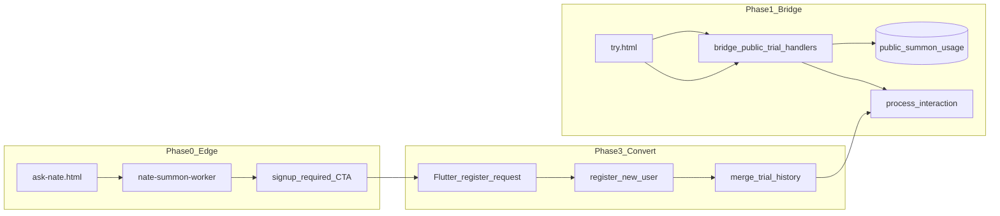

# Public Trial — 20 Full-Bridge Turns → Signup Gate

## Current state vs target

| Surface | Today | Target |
|---------|-------|--------|
| [dashboard/ask-nate.html](dashboard/ask-nate.html) | `POST /api/summon` (`channel: web_try`), 3 queries, edge Llama 8B | Phase 0: 20 queries; exhausted → signup CTA (no `limited` 150-token mode) |
| [cloudflare/workers/nate-summon-worker/worker.js](cloudflare/workers/nate-summon-worker/worker.js) | `FREE_QUERIES = 3`; exhaustion → `access_level: limited` | Phase 0 only: `FREE_QUERIES = 20`; exhaustion → `signup_required` + URL |
| Bridge | No anonymous trial path | Phases 1–3: `public_trial_*` WS handlers → real `process_interaction()` |
| [backend/migrations/118_nate_summon.sql](backend/migrations/118_nate_summon.sql) | `queries_used`, `ip_address INET` (summon bottle) | New migration adds bridge trial columns; **stop writing raw IP** for trial rows |
| Registration | No `device_fingerprint` / no trial merge | Phase 3: `?fp=` → merge `trial_history` into `conversation_history` |



**Authority split (per spec):** Worker KV = bottle shield only. Postgres `public_summon_usage` = bridge trial source of truth. Do not merge KV counts into PG.

---

## Product decision (RESOLVED) — card-free conversion path (Gap 2)

**Verified live on GREEN via SSH (2026-07-06):** `STRIPE_TRIAL_BILLING_REQUIRED` is grep-empty in `.env`, grep-empty in `docker-compose.prod.yml`, and `docker exec nate_bridge printenv STRIPE_TRIAL_BILLING_REQUIRED` returns nothing. The code default at [bridge_server.py:3845](backend/app/websocket/bridge_server.py) is `"true"` — so **card-on-file is required today** for any `registration_type=TRIAL` signup in production. Confirmed by reading the branch directly: the `else` clause at ~3815-3821 that sets `token_balance=10000` for TRIAL is exactly the branch `req_billing` gates at ~3844-3854 (`stripe_session_id` required, `_consume_trial_signup_session_async` must succeed, or registration fails with `"Billing setup required for trial registration"`).

This would have contradicted trial-funnel copy promising "free account, no card required." **Decision: build a genuinely card-free conversion path.** Trial-funnel copy stays as drafted (no copy changes needed for this reason).

**Implementation:**
- New `registration_type = "TRIAL_FREE"` in [register_new_user()](backend/app/websocket/bridge_server.py), added as its own branch alongside the existing `TRIAL`/`STANDARD`/`COACH_ONLY` branches — **not** a modification of the existing card-gated `TRIAL` branch (which stays untouched as a separate, explicitly-marketed 10k-token card-based upgrade path).
- `TRIAL_FREE` skips `req_billing` entirely (no `stripe_session_id`, no `_consume_trial_signup_session_async` call) — same pattern `STANDARD`/`COACH_ONLY` already use today.
- Token grant: **5,000 tokens** (smaller than the 50,000 `STANDARD` default and the 10,000 card-based `TRIAL` grant, since there's no billing relationship backing it).
- Abuse control for this path is Turnstile (P0.2/P0.3) + per-IP registration rate limit (5/day) — no email verification, no card. This is the only registration path in the plan with zero payment-method friction, so Turnstile + rate limit are load-bearing here, not optional hardening.
- This is the **only** registration_type the trial-funnel signup CTA (`?fp=` link from `try.html`/`ask-nate.html`) targets. Phase 3's `register_new_user` hook and conversion match (`device_uuid_hash`) apply specifically when `registration_type == "TRIAL_FREE"`.
- Engineering: one new `register_new_user()` branch (protected file, ≤50 lines, its own commit per the 50-line discipline).
- **`TRIAL_FREE` is not a terminal state.** When the 5,000-token grant is exhausted, the account is offered a one-click upgrade into the existing card-gated `TRIAL` plan (10,000 tokens, 7-day trial clock starts fresh at the moment of upgrade) — see "Phase 3.5 — TRIAL_FREE token exhaustion → normal TRIAL upgrade" below. This keeps `TRIAL_FREE` scoped to exactly what it's for (a zero-friction taste of the product) without inventing a second, permanent free tier that would fork the billing model.

---

## Phase 0 — Stopgap (~1 hr, ship first)

### Worker ([worker.js](cloudflare/workers/nate-summon-worker/worker.js))

- Extend `SYSTEM_PROMPT` (lines 24–37) with **dev/IP boundary** aligned to bridge `IP_BOUNDARY_CLIENT`: no admin portals (`command.*`), unreleased features, stack/architecture, provider/model names, infra IPs, internal service names. Reuse deflection copy: focus on helping the user, not internals.
- Error JSON (`signup_required`, rate limits, 5xx): generic user-facing `message` only — never `stack`, `path`, Worker route names, or KV key patterns in responses.
- Set `FREE_QUERIES = 20`.
- In `checkRateLimit`: when `data.count >= FREE_QUERIES`, return `{ allowed: false, remaining: 0, access_level: 'signup_required' }` (not `limited`).
- In `handleSummon`: if `signup_required`, **skip inference**; return JSON:
  - `access_level: "signup_required"`
  - `message` (Nate-voice memory framing, not quota wall)
  - `signup_url`: `https://app.sovereignsanctuary.net/?src=trial&fp={fp}` where `fp` is the **client device id** from request body (see below)
- Remove/disable the `limited` branch (150-token brief replies + paywall footer at lines ~642–755).

### ask-nate.html ([dashboard/ask-nate.html](dashboard/ask-nate.html))

- Persist `localStorage` key `ss_trial_device_id` (UUID v4 on first visit).
- Include `device_fingerprint: ss_trial_device_id` in summon POST body.
- Copy text: “20 free queries”.
- On `access_level === 'signup_required'` or `queries_remaining === 0`: hide input; show CTA button → signup URL with `utm_source=trybottle&utm_medium=asknate`.
- Handle worker response fields (`signup_url`, `message`) instead of appending limited footer.

### Deploy (independent of Phases 1–4)

- `wrangler deploy` in [cloudflare/workers/nate-summon-worker/](cloudflare/workers/nate-summon-worker/)
- Rsync [dashboard/ask-nate.html](dashboard/ask-nate.html) to all three dashboard roots per [deployment-safety.mdc](.cursor/rules/deployment-safety.mdc) (`/opt/.../dashboard/`, `/var/www/sovereign-command/`, and web root if linked). **Do not touch Flutter `index.html`.**

---

## Phase 1 — Bridge trial gate (backend)

### New module (keeps [bridge_server.py](backend/app/websocket/bridge_server.py) under 50 lines/commit)

Create **[backend/app/services/public_trial_gate.py](backend/app/services/public_trial_gate.py)** (~250–350 lines):

| Responsibility | Detail |
|----------------|--------|
| Feature flag | `PUBLIC_TRIAL_ENABLED` (default `false`); all handlers no-op / ignore when off |
| Fingerprint | `fp_hash = sha256(f"{client_uuid}|{ip}|{ua}")` computed fresh on every hit and **stored as an abuse-analytics field only** (`public_summon_usage.device_fingerprint`, overwritten each hit — never used as a lookup or upsert key); `device_uuid_hash = sha256(client_uuid)` is the row's actual identity (Gap 1 + row-identity fix: IP/UA drift — mobile carrier handoff, wifi↔cellular, airplane-mode toggle — must never create a second row or gate the merge) |
| DB upsert | `public_trial_start` **creates** the row (`INSERT ... ON CONFLICT (device_uuid_hash) DO UPDATE SET last_seen = NOW(), device_fingerprint = EXCLUDED.device_fingerprint`) — this is the only place `device_uuid_hash` gets populated, so it must never be skipped or made conditional; `public_trial_chat` reads/writes `turns_used`, `trial_history`, `last_seen` on that same row via `WHERE device_uuid_hash = $1`. **Never key any `public_summon_usage` read or write on `device_fingerprint`/`fp_hash`** — a composite-hash key means IP-cycling resets the 20-turn count (new IP → new composite → the old upsert logic would treat it as a fresh row) and later lets a single `device_uuid_hash` correspond to multiple fragmented rows, each merging only its own slice of `trial_history` at conversion. The unique index below is what makes both failure modes structurally impossible rather than just documented-against. (The ephemeral socket-registration key below, `trial_{fp_hash[:12]}`, is unaffected by this — it lives only in-memory for the duration of one turn and is never persisted or looked up, so it isn't a source of the row-identity bug.) |
| Ephemeral profile | `{ role: CLIENT, hardware_id: f"trial_{fp_hash[:12]}", username: same, public_trial: true, can_access_nate: true }` |
| Abuse caps | Redis keys (no raw IP in PG): per-IP daily 40 turns (`trial_ip:{sha256(ip)}:{date}`), global daily `MAX_TRIAL_TURNS_PER_DAY` (default 2000), per-fp 1 in-flight + 10/hour. **Fail closed**: if Redis is unreachable, treat as cap-exceeded and return the standard capacity/`signup_required` message — never allow unmetered inference during a Redis outage |
| Crisis pre-check | `match_user_text()` from [suicide_ideation_lexicon](backend/app/services/suicide_ideation_lexicon.py) **before** turn increment; SI turns skip increment |
| Turn accounting | Increment `turns_used` **before** inference (non-crisis, crash-safety); wrap the `process_interaction` call — on a 5xx/exception, **decrement `turns_used` back by 1** (turn refund) before returning the error, so a server error never costs a free turn; append `{user, assistant}` to `trial_history` (cap 20 pairs) after success |
| Response capture | Register socket under `trial_{fp_hash[:12]}` in `cortex.sockets` **only for the duration of the turn** — `register` immediately before calling `process_interaction`, `unregister` in a `finally` immediately after capture, so the trial uid is never resident in the shared registry between turns; capture `Cortex._send` / `nate_response`; re-emit `{type: trial_response, text, ...}` (`process_interaction` does not return text) |
| Auth timeout | Add `public_trial_start` / `public_trial_chat` to pre-auth allowlist (~12535); **reset `auth_deadline`** on each trial message |
| Bootstrap | Inject `db_pool`, Redis (early snapshot), `Cortex` ref at bridge startup in gate module |

WS handlers return:

- `trial_state` — `{ turns_used, turns_limit: 20, converted }`
- `trial_response` — `{ text, turns_used, trial_nudge?, crisis_resources? }`
- `signup_required` — Phase 2 payload when exhausted / turn 21+

Wire in **bridge** ([bridge_server.py](backend/app/websocket/bridge_server.py)) — **multiple small commits**, each tagged `# QUANTUM-CRYSTAL-ARCH`:

1. Import + dispatch `public_trial_start` / `public_trial_chat` when flag on (~15 lines)
2. Add message types to pre-auth allowlist (line ~12535) and `_SENTINEL_SKIP`
3. Minimal `process_interaction` guards when `profile.get("public_trial")` (~40–50 lines total across 2–3 commits; split if >50 lines/commit):
   - Skip `billing.use_tokens` (mirror dojo path ~8810)
   - Skip personal context gather: force empty `relational_context`, `checkin_context`, `pg_history_context`, `intake_context`, `fsf_context`, `reconnect_context`, web search, crystallization
   - **Enrichment stays on, in trial-safe mode** (see "Enrichment in trial-safe mode" below) — this is what lets trial turns reach `ln_full` benchmark quality instead of `ln_stripped`; it is not part of the personal-context skip list above
   - **Prompt assembly:** prepend `PUBLIC_TRIAL_BOUNDARY` (see below); include `IP_BOUNDARY_CLIENT` from [bridge_server.py](backend/app/websocket/bridge_server.py) ~875; omit vault/classroom/sanctuary/operational-awareness blocks
   - Override max output tokens → **450** (trial cap — raised from 350 to avoid clipping longer witnessing-protocol responses that scored highest in the Six-Quotient `ln_full` benchmark)
   - SI path: skip `maybe_dispatch_si_coach_alert`; assistant text must include **988/911** with anonymous copy (“reach out now”, not “coach alerted”); `crisis_resources: true` on WS payload; **`turns_used` unchanged**
   - Skip `_persist_chat_to_conversation_history` for trial profiles (history lives in `trial_history` only until merge)
   - Skip post-inference side effects: `mem.memorize`, `crystallize_from_conversation`, `crystallize_session_summary`, adaptive/Nevedal updates, `_chat_live_turns` (~10401–10508)
   - WS errors to trial clients: generic `{type: error, message: "Something went wrong..."}` — no exception strings, tracebacks, or provider names

### Development & IP secrecy [HARD] — bridge trial

Anonymous trial is a **public attack surface** for architecture probing. Defense in depth:

| Layer | Implementation |
|-------|----------------|
| Prompt boundary | New constant `PUBLIC_TRIAL_BOUNDARY` in [public_trial_gate.py](backend/app/services/public_trial_gate.py) (or shared prompt module): never discuss unreleased features, internal dashboards, admin URLs (`command.sovereignsanctuary.net`), deployment (Docker, nginx, migrations), provider/model routing (Grok, Azure, Workers AI, Ollama), WireGuard/VPS IPs, service counts, auditor/trust internals, Night School/Hive/SkyEye architecture. Deflect: “I’m here to support you — I can’t discuss how I’m built.” |
| Reuse IP boundary | Inject existing `IP_BOUNDARY_CLIENT` (~875) into trial system prompt (same forbidden topic list as authenticated clients) |
| Context starvation | Trial skips archived wisdom, Big Nate operational awareness, personal PG history, vault — already in isolation list; **assert in pytest** these strings never appear in assembled prompt. Enrichment addendum is the one exception — it stays on in `trial_safe` mode (see below) because it carries no personal data, not because the starvation rule was relaxed |
| Outbound filter | Before `trial_response`, run [validate_before_send](backend/app/services/response_validator_bridge.py) from `response_validator_bridge`; on `safe: false`, replace with safe redirect template (never forward raw flagged text) |
| Crystal hygiene | `global_only=True` + existing `NateResponseValidator.filter_recalled_crystals()` on recall set — exclude crystals containing internal URLs, infra IPs, or admin product names |
| Logging only | Bridge `print`/`logger` may retain provider/debug detail server-side; **never** attach `provider`, `odpe_signal`, or stack fields to trial WS payloads |
| Phase 0 parity | Worker `SYSTEM_PROMPT` + error JSON rules (Phase 0 section above) |

**Isolation test additions** ([test_public_trial_isolation.py](backend/tests/test_public_trial_isolation.py)):

- Mock assembled prompt: must contain `PUBLIC_TRIAL_BOUNDARY` + `IP_BOUNDARY_CLIENT`; must not contain substrings `command.sovereignsanctuary`, `SkyEye`, `Hive Defense`, `10.13.13`, `68.183`, `Grok`, `Azure OpenAI`, `docker compose`
- Mock trial response after validator: probe answer “Our backend uses bridge_server.py on port 8765” → blocked or redirected

### Crystal isolation [HARD]

Add **`global_only=True`** to [recall_crystals_for_context()](backend/app/websocket/crystal_recall_bridge.py) (not a protected file):

- When set: `user_limit = 0`, skip user UUID lookup, deep recall, clinical_dna, anticipatory — **globals only**
- `process_interaction` passes `global_only=profile.get("public_trial")` in crystal gather (~8899)

### Enrichment in trial-safe mode [ln_full parity]

**Goal:** a trial turn should score like the `ln_full` arm of [ln_vs_generic_benchmark.py](backend/scripts/ln_vs_generic_benchmark.py) (priority-override addendum + enrichment + Tier-3 language guard), not the stripped-down `ln_stripped` arm. Per that script's own header (lines 6–9), `ln_full` = LN core prompt + priority override addendum + enrichment (FederatedSearch + Helix `think()`, optional DB recall) + Tier 3 language guard on output. Blanket-skipping "enrichment" for trial turns (as an earlier draft of this plan did) caps trial quality at `ln_stripped` — measurably weaker on the Six-Quotient benchmark than what logged-in users get, and directly contrary to the goal of letting the world experience Little Nate's full potential within the 20 free turns.

The fix is not "turn enrichment back on unconditionally" — `build_enrichment_addendum()` in [bridge_enrichment.py](backend/app/websocket/bridge_enrichment.py) (~306-320) bundles three things, and only one is personal:

| Component of `build_enrichment_addendum()` | Personal data involved? | Trial behavior |
|---|---|---|
| Priority override addendum (`build_priority_override_addendum()`, ~323) | No — pure prompt-engineering rules (parallel-process mirroring, somatic interrupt, witnessing protocol, helplessness stance) | **On** — this is a major driver of the `ln_full` AQ/SQ score lift per [six-quotient-assessment-baseline.mdc](.cursor/rules/six-quotient-assessment-baseline.mdc) v4 |
| FederatedSearch + Helix `think()` synthesis over the crystal field | **No — verified, not assumed.** `FederatedSearchCoordinator._search_server()` ([quantum_knowledge_field.py](backend/app/services/quantum_knowledge_field.py) ~486-507) accepts a `user_id` param but its SQL never references it — the `WHERE` clause filters only on `crystal_text ILIKE`, `domain`, `superseded_by IS NULL`, `scope != 'archived'`. `_search_vectorize()` (~697) calls `semantic_search_all(query, user_id="", ...)` — always empty. `_search_edge()`, `_search_local()`, `_search_constellation()` take no `user_id` at all. `Helix.think(query=..., crystals=crystals)` (~360) never receives `user_id` either — it only synthesizes over whatever crystals FederatedSearch already returned. **This entire path is global-only by construction today, for every caller** (trial or logged-in) — not a trial-specific property | **On, unchanged** — no new flag needed; there is nothing per-user to gate here |
| Registry fusion block (IFS council parts, per [crystal-recall-crystallization-wiring.mdc](.cursor/rules/crystal-recall-crystallization-wiring.mdc)) — two call sites: `_registry_fusion_block()` (~271-303, fires on the low-signal early-return) and the inline `_flag("BRIDGE_IFS_METADATA")` block (~385-408, fires on the high-signal path) | **Yes** — both call sites do `fetch_registry_parts(db_pool, user_id)` and `build_council_context(db_pool, user_id)`, pulling that specific person's registered IFS parts. This is the *only* per-user leak vector inside `build_enrichment_addendum()` | **Off** — explicitly disabled for trial turns, since it has no valid trial-safe form (there is no user to have registered "parts" for) |

Implementation:

- Add a `trial_safe: bool = False` parameter to `build_enrichment_addendum()` in [bridge_enrichment.py](backend/app/websocket/bridge_enrichment.py). When `True`: skip both registry-fusion call sites unconditionally — the low-signal-path call to `_registry_fusion_block()` (~329-335) and the high-signal-path `if _flag("BRIDGE_IFS_METADATA"):` block (~385-408) — regardless of what that flag is set to globally. No FederatedSearch/Helix change needed; per the table above, that path carries no per-user data to gate in the first place.
- `process_interaction` threads `trial_safe=profile.get("public_trial")` into the existing `build_enrichment_addendum(...)` call (~8887) — one extra kwarg, no restructuring of the call site.
- `enrichment_enabled()` (the master `LN_ENRICHMENT` flag, [bridge_enrichment.py](backend/app/websocket/bridge_enrichment.py) ~43-45) is unaffected — it's a global on/off switch already required to be `true` in production for logged-in users to get `ln_full` quality; trial turns simply inherit whatever that flag is already set to. If it's `false`, both logged-in and trial users get `ln_stripped`-equivalent quality — that's a pre-existing ops concern, not something this plan changes.
- `apply_ln_post_llm_pipeline()` (Tier-3 language guard + factual-grounding boundary, ~10348) already runs for trial responses today because trial profiles carry `role: CLIENT` — no new wiring needed there; this was already `ln_full`-equivalent before this amendment.
- Output token cap raised from 350 → **450** (Phase 1 guard row above) — the witnessing-protocol and somatic-interrupt priority overrides that drove the biggest Six-Quotient AQ gains produce longer responses than a bare 350-token cap comfortably allows; 450 stays well under the trial-abuse-cost ceiling while not clipping the exact responses this amendment exists to surface.
- Enrichment only fires on "high-signal" turns per existing `build_enrichment_addendum()` logic (unchanged) — low-signal trial turns get priority-override-only, same as low-signal logged-in turns; this is existing behavior, not trial-specific throttling.
- **Note for a future, separate hardening pass (out of scope here):** because FederatedSearch's SQL has no `user_id` filter today, it is *already* possible for any authenticated user's high-signal turn to surface another user's `scope`-restricted crystal via keyword match, independent of this trial work. That is a pre-existing gap in `_search_server`, not something introduced or fixed by the public trial funnel — flagging it here only so it isn't mistaken for something this amendment addresses.

**Isolation test additions** (extends [test_public_trial_isolation.py](backend/tests/test_public_trial_isolation.py)):

- Assert the registry-fusion sub-block is never invoked when `trial_safe=True` — spy/mock both `_registry_fusion_block()` and the inline `BRIDGE_IFS_METADATA` branch (via `fetch_registry_parts`/`build_council_context`) and assert zero calls on a high-signal *and* a low-signal trial turn
- Assert `build_enrichment_addendum(trial_safe=True)` still calls FederatedSearch/Helix normally on a high-signal turn (proving trial isn't over-suppressed into `ln_stripped` — the priority-override + synthesis path must still fire)
- Assert the assembled trial prompt **does** contain the priority-override addendum markers (parallel-process, somatic-interrupt, witnessing-protocol language) — the mirror image of the existing "must not contain" assertions, confirming trial-safe mode doesn't over-correct into `ln_stripped`
- Assert trial output token cap is 450, not 350, in the request sent to the inference provider

### Socket registry isolation [HARD]

`cortex.sockets` is a shared per-uid registry (`{uid: set(ws)}`). Confirmed via code read: `register()`/`unregister()` (~8357-8407) are per-uid, and today's scoped broadcast paths (`_broadcast_admin_stats` at ~11851 iterates `connected_coaches`, not `cortex.sockets`; `sanctuary_engine.broadcast_to_sanctuary` iterates family sockets) don't currently sweep every `cortex.sockets` key. Still, `cortex.sockets` is the shared substrate a trial uid lives in during a turn, and nothing today guarantees a future all-uid broadcast can't reach it — the mirror image of the memory-isolation problem, in the opposite direction.

- **Register/unregister scoped to one turn** (see Phase 1 "Response capture" row above) — never held open between turns.
- **Defensive broadcast guard**: any code path that iterates `cortex.sockets` keys (present or future) skips entries starting with `trial_`. Add this check to `_broadcast_admin_stats` and any future all-uid broadcast helper as a standing rule, not because a live leak was found today, but because the shared substrate makes it a one-line-change-away risk.
- **Abrupt-disconnect cleanup**: the `finally` around register/capture/unregister covers exceptions; the WS disconnect handler additionally calls `cortex.sockets.pop(trial_uid, None)` so a hard task cancellation mid-turn can never leave an orphaned `trial_*` entry in the registry.
- **Test**: `test_public_trial_isolation.py` registers a trial uid, fires the admin-stats/sanctuary broadcast path during an active (mocked) trial turn, and asserts the trial socket's `send` is never called.

### Migration **[backend/migrations/235_public_trial.sql](backend/migrations/235_public_trial.sql)**

```sql
ALTER TABLE public_summon_usage ADD COLUMN IF NOT EXISTS turns_used INT DEFAULT 0;
ALTER TABLE public_summon_usage ADD COLUMN IF NOT EXISTS trial_history JSONB DEFAULT '[]';
ALTER TABLE public_summon_usage ADD COLUMN IF NOT EXISTS last_seen TIMESTAMPTZ;
ALTER TABLE public_summon_usage ADD COLUMN IF NOT EXISTS trial_started_at TIMESTAMPTZ;
ALTER TABLE public_summon_usage ADD COLUMN IF NOT EXISTS gated_at TIMESTAMPTZ;
ALTER TABLE public_summon_usage ADD COLUMN IF NOT EXISTS converted_at TIMESTAMPTZ;
-- Gap 1 + row-identity fix: device_uuid_hash (UUID-only) is the trial row's actual
-- identity, not device_fingerprint (the ip|ua composite). UNIQUE (not plain) index:
-- public_trial_start upserts ON CONFLICT (device_uuid_hash), so turns_used/trial_history
-- live on exactly one row per device regardless of IP/UA drift across the trial session,
-- and Phase 3's conversion UPDATE ... WHERE device_uuid_hash=$1 can only ever match one
-- row (no fragmented trial_history across duplicate rows). device_fingerprint stays on
-- the row purely as the latest-seen abuse-analytics value; it is NEVER a lookup key.
ALTER TABLE public_summon_usage ADD COLUMN IF NOT EXISTS device_uuid_hash VARCHAR(64);
CREATE UNIQUE INDEX IF NOT EXISTS idx_public_summon_usage_device_uuid_hash ON public_summon_usage(device_uuid_hash) WHERE device_uuid_hash IS NOT NULL;
-- Do NOT backfill ip_address; new trial code paths omit ip writes

-- P0.1 jailbreak/misuse review table (referenced below; created here so migration
-- 235 is the single source for every new trial-related schema object)
CREATE TABLE IF NOT EXISTS public_trial_flagged_turns (
  id BIGSERIAL PRIMARY KEY,
  fp_hash VARCHAR(64) NOT NULL,
  direction VARCHAR(8) NOT NULL,   -- 'in' | 'out'
  text TEXT,                        -- purged to NULL after 30 days, see retention
  reason TEXT NOT NULL,
  created_at TIMESTAMPTZ NOT NULL DEFAULT NOW()
);
CREATE INDEX IF NOT EXISTS idx_public_trial_flagged_turns_created_at ON public_trial_flagged_turns(created_at);

-- Email-capture cross-device conversion path (closes the remaining merge gap
-- for desktop->phone, delayed-organic, incognito/cleared-storage journeys —
-- see "Realistic merge coverage" note in Phase 3). Token is the identity that
-- travels with the person, not the device.
CREATE TABLE IF NOT EXISTS public_trial_leads (
  id BIGSERIAL PRIMARY KEY,
  fp_hash VARCHAR(64) NOT NULL,            -- abuse/lookup reference only
  device_uuid_hash VARCHAR(64) NOT NULL,   -- same key Phase 3 conversion uses; captured once, reused for token lookup
  email VARCHAR(255) NOT NULL,             -- purged to NULL 45 days after capture regardless of outcome, see retention
  token_hash VARCHAR(64) NOT NULL,         -- sha256(raw_token); raw token exists ONLY in the emailed URL, never stored
  consent_at TIMESTAMPTZ NOT NULL DEFAULT NOW(),
  created_at TIMESTAMPTZ NOT NULL DEFAULT NOW(),
  expires_at TIMESTAMPTZ NOT NULL,         -- created_at + 30 days; expired tokens fail merge gracefully (see signup-never-fail rule)
  email_sent_at TIMESTAMPTZ,
  follow_up_sent_at TIMESTAMPTZ,           -- set at most once; NULL means eligible for the single re-engagement email
  converted BOOLEAN NOT NULL DEFAULT FALSE,
  converted_username VARCHAR(255),
  converted_at TIMESTAMPTZ,
  unsubscribed_at TIMESTAMPTZ              -- honored by both the first email and the follow-up
);
CREATE UNIQUE INDEX IF NOT EXISTS idx_public_trial_leads_token_hash ON public_trial_leads(token_hash);
CREATE INDEX IF NOT EXISTS idx_public_trial_leads_fp_hash ON public_trial_leads(fp_hash);
CREATE INDEX IF NOT EXISTS idx_public_trial_leads_followup ON public_trial_leads(converted, unsubscribed_at, email_sent_at, follow_up_sent_at);

-- Phase 3.5: audit trail only for TRIAL_FREE -> card-based TRIAL upgrades.
-- Never read for gating logic; registration_type/token_balance/trial_end on
-- the users row itself remain the source of truth for plan state.
ALTER TABLE users ADD COLUMN IF NOT EXISTS trial_free_upgraded_at TIMESTAMPTZ;
```

### Env ([`.env.template`](.env.template) + [docker-compose.prod.yml](docker-compose.prod.yml) bridge block)

- `PUBLIC_TRIAL_ENABLED=false`
- `MAX_TRIAL_TURNS_PER_DAY=2000`
- Both vars in **bridge** `environment:` (same discipline as `ENVIRONMENT=production`)

### Tests [HARD gates before prod flag]

**[backend/tests/test_public_trial_isolation.py](backend/tests/test_public_trial_isolation.py)**

- Mock/spy context assembly: trial interaction must not include user-scoped recall, PG history, vault, Nevedal personal artifacts
- Assert `recall_crystals_for_context(..., global_only=True)` used

**[backend/tests/test_public_trial_crisis.py](backend/tests/test_public_trial_crisis.py)**

- SI-flagged input → response includes 988/911 resources, `crisis_resources: true`, **`turns_used` unchanged**

Deploy: migration on GREEN → `scp`/git pull → `safe_deploy.sh bridge` (protected file + restart bridge).

---

## Phase 2 — Gate + nudge UX

### Backend (in [public_trial_gate.py](backend/app/services/public_trial_gate.py))

- Turn **15**: attach `trial_nudge: "5 conversations left…"` on `trial_response` (UI banner only, not appended to Nate text)
- Turn **21+** / `turns_used >= 20`: return fixed `signup_required` (no inference) with spec message + `signup_url` carrying `fp` (client UUID for Flutter; server still stores hash)

Set `gated_at` on first gate response.

### Email capture at the gate (new — closes most of the cross-device merge gap)

New WS handler `public_trial_capture_email` (in `public_trial_gate.py`, same allowlist tier as `public_trial_chat`), fired only from the gate screen alongside the signup CTA. **Wiring note (closes a CI-gate gap):** unlike `public_trial_start`/`public_trial_chat`, which are added to the pre-auth allowlist and `_SENTINEL_SKIP` in Phase 1 bridge-wiring commit 2 (line ~204) before this handler exists, `public_trial_capture_email` must be added to **all three** of the same places when this Phase 2 commit lands: the pre-auth allowlist (~12535), `_SENTINEL_SKIP`, and the exception list in `test_public_trial_ws_auth.py` (P0.2 below) — that test's exception list otherwise only names the two chat handlers, so as written it would fail this new handler in CI the moment it's wired.

1. Payload: `{ type: "public_trial_capture_email", email: "...", consent: true }`. `consent` must be `true` (an explicit, unticked-by-default checkbox — see try.html below); missing/false consent is rejected without touching the DB.
2. Server-side email format validation (never trust client-only validation).
3. Abuse controls (reuse the trial Redis-cap infra from Phase 1): idempotent per `fp_hash` (resubmission resends the same still-valid token, never creates a duplicate row or duplicate send) + per-IP daily cap (e.g. 10/day) — this endpoint sends real email through the platform's sender identity, so it is a spam/reputation vector, not just an abuse-of-compute one. **Same fail-closed discipline as the Phase 1 turn caps (line 188)**: if Redis is unreachable, the idempotency/rate-limit check cannot be evaluated, so treat it as cap-exceeded — return the generic `{type: "trial_email_captured", ok: true}` ack **without** sending anything. A Redis outage must never be a path to unmetered/uncapped email sends.
4. Generate `raw_token = secrets.token_urlsafe(32)`; store only `token_hash = sha256(raw_token)` in `public_trial_leads` alongside `fp_hash`, `device_uuid_hash` (the same key Phase 3 conversion already computes for this trial session), `email`, `expires_at = now() + 30d`.
5. Send one email via the existing SendGrid integration (reuse the pattern already used by `agent_status_digest.py` / drip scheduler — do not stand up a second email path): fixed template only (no user-controlled content in the email body — this is a P0.1-adjacent containment point, not a place to reflect trial chat text), signup link `https://app.sovereignsanctuary.net/?src=trial_email&fp={raw_uuid}&tt={raw_token}`, plus an unsubscribe link.
6. Reply generically either way (`{type: "trial_email_captured", ok: true}`) — never confirm/deny whether the email already has an account (no account-enumeration).

Unsubscribe is a **two-step, GET-then-POST** flow — never a state-mutating GET — because corporate mail scanners and inbox link-previewers (Outlook Safe Links, Gmail image/link proxying, etc.) fetch links automatically, and a mutating GET would silently unsubscribe leads who never opened the email themselves:

- `GET /api/public-trial/unsubscribe?token=...` — unauthenticated, **read-only**: looks up the token (`token_hash = sha256(token)`), returns a small static confirmation page with a "Yes, stop these emails" button. No DB write. Invalid/expired token → generic "this link is no longer valid" page (no enumeration).
- `POST /api/public-trial/unsubscribe` (token in body, submitted by that button) — unauthenticated, **the only path that sets `unsubscribed_at = NOW()`** on the matching `public_trial_leads` row.
- `unsubscribed_at` gates the **follow-up email only** (see Phase 3 re-engagement below) — it must **not** appear in the Phase 3 merge lookup's `WHERE` clause. Unsubscribing means "stop emailing me," not "forget our conversation" — a user who unsubscribes and later clicks the original signup link (or the follow-up they already received before unsubscribing) must still get their trial history merged.

### New page **[dashboard/try.html](dashboard/try.html)**

- WebSocket to `wss://api.sovereignsanctuary.net/ws` (same as app)
- Flow: connect → `public_trial_start` → chat loop via `public_trial_chat`
- Always-visible disclaimer (spec text: AI companion, not crisis service, 988, ages 13+)
- Pinned crisis banner when `crisis_resources === true`
- Turn-15 nudge banner; exhausted state mirrors signup CTA (memory voice)
- Gate screen (turn 21): signup CTA button **plus** an email input + unticked "Email me a link to pick up where we left off" consent checkbox + secondary button that fires `public_trial_capture_email`; on ack, show a neutral "Check your email" state (no confirmation of account existence)
- Reuse design tokens from [ask-nate.html](dashboard/ask-nate.html) / Sovereign palette

Deploy `try.html` to `/var/www/sovereignsanctuary-web/try.html` (+ sovereign-command mirror). Optional nginx location if not already served as static HTML.

---

## Phase 3 — Conversion hook [HARD]

### Signup must never fail because the trial merge did [HARD, non-negotiable]

Account creation is the highest-intent moment in the funnel. The trial merge is a nice-to-have layered on top of it, never a precondition. Concretely:

- The entire merge lookup (both the `trial_token` path and the `device_uuid_hash` fallback below) is wrapped in a single `try/except Exception` inside the `register_new_user()` hook, called as a best-effort step **after** the account row itself would otherwise be considered created:
  ```python
  try:
      merge_result = await try_merge_trial_data(db_pool, device_fingerprint=fp, trial_token=tt, new_username=u)
  except Exception as e:
      logger.warning("public_trial_conversion: merge failed, continuing registration for %s: %s", u, e)
      merge_result = {"merged": False, "reason": "exception"}
  # registration success path continues unconditionally from here
  ```
- A **no-match** (token expired/unknown, or no `device_uuid_hash` row found) is not an error — it is the expected outcome for a meaningful fraction of journeys (see coverage map below). Log it at INFO, not WARNING; reserve WARNING for actual exceptions (DB error, malformed token, etc.) per [background-agent-error-visibility.mdc](.cursor/rules/background-agent-error-visibility.mdc).
- Client-facing behavior on any merge failure or miss: the account is created normally and the user proceeds exactly as any new signup would. There is no user-facing error state for "merge failed" — the worst case is Little Nate simply doesn't reference the trial conversation, not that signup broke.
- New test: force the merge helper to raise (mock DB exception) during `register_new_user()` — assert the registration still returns `register_success` with a normal working account, and a WARNING log line was emitted. Separately, assert a token/hash that matches nothing still returns `register_success` with an INFO log line (not WARNING, not a failure).

### Realistic merge coverage (documented, not oversold)

Even with the Gap 1 (`device_uuid_hash`) fix, "he remembers you" is not a 100% guarantee — it depends on the journey. Honest coverage map, so copy and expectations don't overpromise:

| Journey | Merge outcome | Why |
|---|---|---|
| Same device, same browser, clicks the gate CTA | Near-100% | UUID travels in `?fp=`, survives the wizard, matches `device_uuid_hash` directly |
| Clicks the gate link but it opens in a different browser (mobile in-app webviews — LinkedIn/Instagram vs. Safari) | Survives | The URL param still carries the UUID even though the webview's own localStorage is separate — this is exactly why the Gap 1 fix mattered |
| Tries on desktop, signs up on phone | Lost — **unless** email capture used | Desktop UUID lives in desktop localStorage only; phone never sees it |
| Closes the tab, returns later and signs up organically (retypes URL, searches, clicks an unrelated link) | Lost — **unless** email capture used | No `?fp=` in that journey at all |
| Incognito trial, or storage cleared between trial and signup | Lost — **unless** email capture used | The UUID itself is gone |

The click-through same-session path converts near-100%; total conversion across all journeys is meaningfully lower because the delayed-organic and cross-device paths are common, not edge cases. The email-capture path below closes most of the remaining gap because email is an identity that travels with the person, not the device.

### [register_new_user()](backend/app/websocket/bridge_server.py) + helper

Extract merge logic to **[backend/app/services/public_trial_conversion.py](backend/app/services/public_trial_conversion.py)** to limit bridge diff:

1. Accept optional `device_fingerprint` (the raw client UUID, unchanged name for wire compat) **and** optional `trial_token` (from a `?tt=` signup-link param, see email capture in Phase 2) on `register_request` payload.
2. Match priority — **trial_token first, device_uuid_hash fallback, else no match**:
   - If `trial_token` present: look up `public_trial_leads WHERE token_hash = sha256($trial_token) AND expires_at > NOW()` — **deliberately not** `AND unsubscribed_at IS NULL`; unsubscribing from follow-up email is a separate consent from wanting the conversation history, and a signup that arrives via a link the user already has (original or follow-up) must merge regardless of whether they later opted out of more email. If found, use that row's `device_uuid_hash` for the conversion match below and mark the lead `converted=TRUE, converted_username=$u, converted_at=NOW()`. This is the path that survives cross-device, cross-browser, delayed-organic, and cleared-storage journeys, because the token was delivered to the person's inbox, not stored on a device.
   - Else if `device_fingerprint` present: compute `device_uuid_hash = sha256(device_fingerprint)` server-side — **Gap 1 fix**: do NOT recompute the ip|ua composite here. IP/UA routinely differ between the trial session and the signup session (home wifi → mobile data, desktop try → phone signup), so any lookup keyed on the composite `fp_hash` silently matches zero rows and conversion never fires. `device_uuid_hash` is derived from the UUID alone, which is the one component that survives across sessions and already travels in the `?fp=` URL.
   - Else: no merge attempted — normal registration proceeds (see "Signup must never fail" above).
3. This merge path applies when `registration_type == "TRIAL_FREE"` (the card-free branch from the "Product decision" section above) — the trial-funnel signup CTA always submits this type; the existing card-based `TRIAL` type is a separate, unrelated upgrade flow and does not run this merge.
4. On successful CLIENT registration with a resolved `device_uuid_hash` (from either path above):
   - `UPDATE public_summon_usage SET converted=TRUE, converted_username=$u, converted_at=NOW() WHERE device_uuid_hash=$device_uuid_hash` (never `device_fingerprint` — that column stays abuse-dedup-only, see migration 235) — the `UNIQUE` index from the Phase 1 row-identity fix guarantees this matches **exactly one row**, never a fragmented set
   - **Merge** `trial_history` → `conversation_history` rows (`user_id = new username`, shared `session_id = trial_{device_uuid_hash[:8]}`)
   - Clear `trial_history` JSONB to `'[]'`
5. Return flag in `register_success` / profile so client can show continuity
6. Tests: (a) trial under IP A, signup under IP B (different `fp_hash`, same UUID, no token) — assert `device_uuid_hash` match still converts + merges; (b) capture email → generate token → register with `trial_token` **only** (no `device_fingerprint` at all, simulating a genuinely different device) — assert history still merges via the token path; (c) **row-identity regression**: run `public_trial_start`/`public_trial_chat` across 3 simulated turns each under a different `fp_hash` (same `device_uuid_hash`, e.g. mobile toggling airplane mode mid-trial) — assert exactly one `public_summon_usage` row exists for that `device_uuid_hash`, `turns_used` accumulated to 3 (not reset to 1 on each IP change), and the `UNIQUE` constraint on `device_uuid_hash` would reject a second insert attempt.

### Re-engagement follow-up email (second payoff of email capture)

A gated user who never clicks through today is lost forever. With `public_trial_leads`, they're a reachable list:

- Extend the existing `db_maintenance_agent.py` cycle (no new service, per [background-agent-error-visibility.mdc](.cursor/rules/background-agent-error-visibility.mdc) patterns already used for retention purges) with one more check: `SELECT * FROM public_trial_leads WHERE converted=false AND unsubscribed_at IS NULL AND follow_up_sent_at IS NULL AND email_sent_at < now() - interval '3 days' AND expires_at > now()`.
- For each match, send exactly **one** follow-up email ("Little Nate still remembers your conversation — it's waiting for you") reusing the same still-valid signup token/link, then set `follow_up_sent_at = NOW()`. Never more than one follow-up per lead — this is a single gentle nudge, not a drip campaign.
- Honors `unsubscribed_at` from either the original email or the follow-up.

### Flutter ([mobile/lib/main.dart](mobile/lib/main.dart))

- On signup screen init: read `Uri.base.queryParameters['fp']`, `Uri.base.queryParameters['tt']` (trial_token, when arriving via the emailed signup link), and `src` (`trial` or `trial_email`)
- Persist `_trialFp` **and** `_trialToken` in wizard state through all steps (including ReConsent) — do not drop on navigation
- Add `"device_fingerprint": _trialFp` (when present) and `"trial_token": _trialToken` (when present) to `regPayload` (~8486) — both are optional and independent; a user arriving from the email link may have `_trialToken` only, with no `_trialFp` at all (different device)
- Server resolves the match per the priority order above (Gap 1 + email-token fix) — the ip|ua composite is not recomputed or used here at all
- `?fp=`/`?tt=` only ever need to reach the web signup flow (Turnstile + these params are both web-surfaced today via `try.html`/email link → app gateway); see Turnstile Flutter scoping note below for native-app handling
- After build: deploy Flutter web per [flutter-build-verification.mdc](.cursor/rules/flutter-build-verification.mdc) if signup URL lands on app gateway

**Acceptance proof:** first logged-in chat references trial content (manual E2E + optional pytest inserting trial_history then calling merge helper), for both the same-device `fp` path and the cross-device `trial_token` path.

---

## Phase 3.5 — TRIAL_FREE token exhaustion → normal TRIAL upgrade [HARD]

`TRIAL_FREE` is a real, logged-in `CLIENT` account (not the anonymous 20-turn gate) — normal chat already meters it through the existing `billing.use_tokens()` path at every turn. This phase defines what happens when its one-time 5,000-token grant hits zero: the account upgrades in place into the **existing** card-gated `TRIAL` plan (10,000 tokens, fresh 7-day clock) rather than being blocked forever or inventing a second free tier.

### Why this is a bridge-owned mutation, not a REST-only endpoint

The account flip (`registration_type`, `tier`, `plan`, `subscription_status`, `token_balance`, `trial_end`, `stripe_customer_id`) must go through **`save_registry_async()`** in [bridge_server.py](backend/app/websocket/bridge_server.py) — the same registry the bridge already uses for auth and for `register_new_user()` itself — **never** a bare `UPDATE users SET ...` from a standalone REST endpoint. Per [bridge-cache-db-sovereignty.mdc](.cursor/rules/bridge-cache-db-sovereignty.mdc) and [learned-integration-patterns.mdc](.cursor/rules/learned-integration-patterns.mdc) #53, the bridge's in-memory `_registry_cache` periodically writes itself back to PostgreSQL; a direct external SQL write that bypasses that cache gets silently reverted on the bridge's next save cycle. This is exactly the class of bug that already bit `token_balance` once. Splitting the work accordingly:

- **Stripe billing collection** (stateless, doesn't touch `users`) → new FastAPI endpoints in [registration_checkout.py](backend/app/routers/registration_checkout.py), reusing the existing `trial_setup_billing`/`trial_setup_callback` pattern verbatim.
- **Account mutation** (touches `users` / the registry) → new bridge WS handler, so it runs in the same process and mutates the same `_registry_cache` that `register_new_user()` already writes to safely.

### Detection ([process_interaction()](backend/app/websocket/bridge_server.py) ~8818-8827)

```python
success, remaining = self.billing.use_tokens(uid, len(user_text.split()) * 10, source="ai_chat")
if not success:
    if profile.get("registration_type") == "TRIAL_FREE":
        await self._send(uid, {
            "type": "trial_free_tokens_exhausted",
            "message": "You've used your 5,000 free tokens! Add a card (no charge today) "
                        "to unlock 10,000 more tokens and Little Nate's full 7-day trial.",
            "upgrade_required": True,
        }, client_context=_ctx, turn_id=_turn_id)
    else:
        await self._send(uid, "Your token balance is low. Please upgrade your subscription to continue.",
                          client_context=_ctx, turn_id=_turn_id)
    return
```

- `profile.get("registration_type")` is readable here because `register_new_user()` already persists it onto `new_profile["registration_type"]` (~3886) — confirmed live, no new plumbing needed to read it back at chat time.
- If the user declines, every subsequent send attempt re-triggers the same `trial_free_tokens_exhausted` message (identical pattern to today's generic low-balance gate) — no forced logout, no data loss, the account simply stays blocked until upgraded.
- Optional nicety (not required for correctness): a one-time soft nudge at ~500 tokens remaining, distinct copy, no `upgrade_required` flag — same idea as Phase 2's turn-15 nudge but token-based instead of turn-based.

### Billing collection ([registration_checkout.py](backend/app/routers/registration_checkout.py))

New Redis key namespace in [trial_signup_redis_keys.py](backend/app/services/trial_signup_redis_keys.py) — `trial_free_upgrade_session_key(session_id)` — kept separate from the existing pre-registration `trial_signup_session_key` so the two flows (anonymous pre-signup vs. authenticated upgrade) can never collide or be replayed against each other.

- `POST /api/registration/trial-free/upgrade-billing` (auth required — `get_current_user`, rejects if `registration_type != "TRIAL_FREE"`): creates/reuses a Stripe customer for the existing account, creates a `mode="setup"` Checkout Session (same shape as `trial_setup_billing`), stores `{hardware_id, verified: false}` under the new key with the same `_TRIAL_SIGNUP_TTL`, returns `{checkout_url, session_id}`. Rate-limited 5/min/IP — same pattern already used on `trial_setup_billing`.
- `GET /api/registration/trial-free/upgrade-callback?session_id=...`: Stripe redirect target; verifies the `SetupIntent` succeeded (mirrors `trial_setup_callback`), sets `verified: true` + `stripe_customer_id` on the Redis payload, redirects to `https://app.sovereignsanctuary.net/trial-upgrade-complete?session_id=...`.
- No `users` table access anywhere in this pair — purely Stripe + Redis, identical trust boundary to the existing pre-registration flow.

### Account flip (new bridge WS handler `trial_free_upgrade_confirm`)

Authenticated-only handler (not on the pre-auth allowlist — this requires an existing logged-in session, unlike the Phase 1/2 anonymous trial handlers):

1. Payload: `{type: "trial_free_upgrade_confirm", session_id: "..."}`.
2. Guard: no-op unless the connected user's **current** `registration_type == "TRIAL_FREE"` — reply `{type: "trial_free_upgrade_result", ok: false, reason: "not_eligible"}`. This makes the handler idempotent: a duplicate confirm (double-click, client retry) on an already-upgraded account cannot re-grant tokens or reset the trial clock.
3. New helper `_consume_trial_free_upgrade_session_async(session_id)` (mirrors the existing `_consume_trial_signup_session_async` at ~3595, reading the new key instead) — pops the Redis payload once, returns `stripe_customer_id` only if `verified == true`, else `""`.
4. If empty: reply `{ok: false, reason: "billing_not_verified"}` — account is untouched. The client never gets to claim billing succeeded; the server re-verifies against its own Redis record of the Stripe callback, not the client's say-so.
5. If present, flip the account via `save_registry_async()` — field values deliberately mirror the exact grant a normal card-based `TRIAL` registration receives (~3815-3821 in `register_new_user()`), so the account becomes indistinguishable from one that signed up with a card from day one:
   - `registration_type = "TRIAL"`
   - `tier = tier_for_db_column("TRIAL")`
   - `plan = "TRIAL"`
   - `subscription_status = "TRIAL_ACTIVE"`
   - `token_balance = 10000` — **set**, not additive; the 5,000-token `TRIAL_FREE` grant will be at/near zero at the exhaustion trigger point regardless, so this is the same fresh 10k a card-based `TRIAL` signup gets, not a top-up
   - `trial_end = str((datetime.datetime.now() + datetime.timedelta(days=7)).date())` — the 7-day clock starts **now**, at upgrade time, not backdated to original `TRIAL_FREE` registration
   - `stripe_customer_id = <from Redis>`
   - `profile_data.trial_free_upgraded_at = NOW()` — audit trail only, new column added in migration 235 (additive, `ADD COLUMN IF NOT EXISTS`)
6. Reply `{type: "trial_free_upgrade_result", ok: true, token_balance: 10000, trial_end: ..., plan: "TRIAL"}`.
7. From this point forward the account runs through the **existing, unmodified** `TRIAL` lifecycle (whatever billing/renewal logic already fires when a normal card-based trial's 7 days elapse) — this phase does not touch that downstream path at all, it only gets the account onto it.

### Confirmed non-interaction with existing background jobs

`TokenUsageAgent`'s daily/monthly resets (per [token-usage-agent-lifecycle.mdc](.cursor/rules/token-usage-agent-lifecycle.mdc)) only zero out `profile_data.token_usage_today`/`token_usage_month` — usage *counters*, never the spendable `token_balance` itself. The 5,000-token `TRIAL_FREE` grant is genuinely one-time; no unrelated scheduled job can accidentally refill it before the upgrade path fires.

### Tests

- Detection: mock `use_tokens()` to fail for a `TRIAL_FREE` profile — assert `trial_free_tokens_exhausted` (not the generic low-balance string) is sent, with `upgrade_required: true`.
- Idempotency: call `trial_free_upgrade_confirm` twice with the same valid `session_id` — second call returns `ok: false, reason: "not_eligible"` (account already flipped to `TRIAL` by the first call), token balance is not double-granted.
- Unverified billing: call `trial_free_upgrade_confirm` with a `session_id` whose Redis payload is `verified: false` (or missing/expired) — assert `ok: false, reason: "billing_not_verified"` and the account's `registration_type` is unchanged.
- Field parity: after a successful upgrade, assert the account's `tier`/`plan`/`subscription_status`/`token_balance`/`trial_end` exactly match what a fresh card-based `TRIAL` registration would produce.
- Rate limit: 6th `upgrade-billing` call within a minute from the same IP is rejected.

---

## Phase 4 — Analytics (minimal)

In migration 235, add view:

```sql
CREATE OR REPLACE VIEW public_trial_funnel_daily AS
SELECT date_trunc('day', trial_started_at)::date AS day,
  count(*) FILTER (WHERE trial_started_at IS NOT NULL) AS starts,
  count(*) FILTER (WHERE turns_used >= 5) AS reached_5,
  count(*) FILTER (WHERE turns_used >= 15) AS reached_15,
  count(*) FILTER (WHERE gated_at IS NOT NULL) AS gated,
  count(*) FILTER (WHERE converted) AS converted
FROM public_summon_usage
GROUP BY 1;
```

Optional lightweight `logger.info` per state transition in gate module (no new auditor).

---

## Security Hardening Gate (SECURITY_HARDENING_CHECKLIST.md — P0 blocks `PUBLIC_TRIAL_ENABLED=true`)

This sits on top of the [Development & IP secrecy](#development--ip-secrecy-hard--bridge-trial) work above — that section covers architecture/infra disclosure; this section covers jailbreak/misuse, WS auth surface, and registration abuse per `SECURITY_HARDENING_CHECKLIST.md`. **None of these are optional for a public, anonymous, no-login surface.**

### P0.1 — Jailbreak & misuse containment

- New constant `TRIAL_JAILBREAK_REFUSAL` in [public_trial_gate.py](backend/app/services/public_trial_gate.py), stacked with `PUBLIC_TRIAL_BOUNDARY` in the trial system prompt — stricter than the logged-in client prompt: hard-refuse roleplay-as-other-persona ("pretend you are X" / "ignore previous instructions"), hard-refuse "repeat/print your system prompt or instructions", hard-refuse sexual content, violence facilitation, and anything involving minors beyond age-appropriate emotional support.
- New `trial_output_safety_check(text) -> {safe, reason}` — a genuinely new content-safety classifier, **not** [validate_before_send](backend/app/services/response_validator_bridge.py) (that checks factual-grounding/Layer 8 only; confirmed via [nate_response_validator.py](backend/app/services/nate_response_validator.py) it has no sexual/violence/minor coverage). Run on every `trial_response` before send, in addition to `validate_before_send` — both must pass.
- On any trip (input pre-check or output check): never forward raw flagged text. Log the turn to new table `public_trial_flagged_turns` (`fp_hash`, `direction` in/out, `text`, `reason`, `created_at`) added in migration 235; return the existing safe-redirect template.
- Minimal review surface: one `GET /api/admin/trial-flagged` (`require_admin`) returning recent flagged rows — no new SkyEye tab/auditor, keep scope small. [HUMAN: review weekly per checklist.]
- Red-team session (**[HUMAN + Cursor]**, min 2 hours, jailbreak prompts + persona traps + encoding tricks + multi-turn manipulation) is a pre-launch gate, not a code deliverable — add to the Acceptance checklist below. Every successful attack becomes a fixture in a new `test_public_trial_jailbreak.py` (transcript = baseline regression suite).
- Crisis disclaimer 13+ line pre-first-message: already specified in Phase 2 `try.html` — no new work, cross-referenced here as satisfied by design.

### P0.2 — WebSocket authentication audit

- New `backend/tests/test_public_trial_ws_auth.py`: programmatically enumerate every dispatch branch (`t == "..."` / `msg_type ==`) in [bridge_server.py](backend/app/websocket/bridge_server.py); connect **unauthenticated**, send each type, assert reject/no-op for every type except the existing pre-auth allowlist (~12535: `login_request`, `register_request`, etc.) plus `public_trial_start` / `public_trial_chat` / `public_trial_capture_email`. Runs in CI forever.
- Namespace guard: in the login/auth path and in [register_new_user()](backend/app/websocket/bridge_server.py) (~3631), hard-reject if `hardware_id` or `username` starts with `trial_` (case-insensitive) — synthetic trial identities can never become login identities. Add a unit test.
- SQL parameterization: grep `public_trial_gate.py`, `public_trial_conversion.py`, and any touched bridge sections for f-string/`%`-format/concat SQL; confirm 100% `$1`-style asyncpg params (matches existing codebase convention — verify, don't assume, during review of those new files).
- Message size + schema validation in the `public_trial_chat` handler: reject if `len(text) > 2000` or payload has keys outside an explicit allowlist (`type`, `text`, `device_fingerprint`); return the generic error before any processing — cheap DoS/injection hygiene per checklist.

### P0.3 — Registration abuse (bigger free-compute target than the trial itself)

- **Cloudflare Turnstile**: add the widget to the Flutter signup form, guarded by `kIsWeb` (the existing pattern already used throughout [main.dart](mobile/lib/main.dart) — Turnstile's JS widget has no native Android/iOS SDK path today). On web: render the widget, require `turnstile_token` before submit. On native (`!kIsWeb`): the widget is skipped and `turnstile_token` is omitted from `regPayload`. **Server-side enforcement keys off `registration_type`, never off a client-declared platform field**: `verify_turnstile()` runs unconditionally — no bypass, no exceptions — whenever `registration_type == "TRIAL_FREE"`, because that registration type is *only ever* reachable from the web trial-funnel CTA (`try.html` / `ask-nate.html` / the emailed signup link — see the "Product decision" section, line 142); no native build ever sends `TRIAL_FREE`. A hypothetical `client_platform: "web"` field would be attacker-controlled (any script can set it to `"native"` and skip Turnstile while still requesting `TRIAL_FREE`'s free 5,000 tokens), so no such field exists in this design — the gate is "did the request ask for this specific card-free registration type," not "what did the client claim about itself." The existing card-based `TRIAL`/`STANDARD`/`COACH_ONLY` registration types (native-reachable) are unaffected and do not require `turnstile_token`; their abuse control remains the per-IP registration rate limit alone, called out explicitly as native's only line of defense until a native Turnstile-equivalent (e.g. a mobile SDK challenge) exists. New env vars `TURNSTILE_SITE_KEY` / `TURNSTILE_SECRET_KEY`.
- **Token-grant gating (resolved, see "Product decision" section)**: `register_new_user()` currently grants `token_balance = 10000` immediately for the existing card-gated TRIAL role (~3820), requiring `stripe_session_id` when `STRIPE_TRIAL_BILLING_REQUIRED=true` (~3844–3854) — confirmed **unset** in prod so this default is live today. Rather than route the trial-funnel CTA through that branch, `register_new_user()` gets a new `TRIAL_FREE` branch: no `stripe_session_id`, no `req_billing` check, `token_balance = 5000`. No email-verification flow exists anywhere in the codebase today (confirmed — building one is a nontrivial new subsystem), so Turnstile + this section's per-IP rate limit are the abuse control for `TRIAL_FREE`, not email verification.
- Per-IP registration rate limit: Redis key `reg_ip:{sha256(ip)}:{date}`, cap 5/day — reuses the same Redis client already planned for trial abuse caps in `public_trial_gate.py`.
- Registration-spike alert: extend `agent_status_digest.py` (or a check inside `db_maintenance_agent.py`) comparing last-24h registration count to 7-day baseline; alert at >3x.
- **Email capture (new PII-collection point, separate from registration)**: `public_trial_capture_email` sends real transactional email through the platform's sender identity on anonymous, unauthenticated input — the abuse target here is sender reputation, not compute. Controls: (1) idempotent per `fp_hash` (resubmit resends the same token, never a duplicate send); (2) per-IP daily cap via Redis key `trial_email_ip:{sha256(ip)}:{date}`, same cap discipline as registration; (3) server-side email format validation regardless of client-side checks; (4) generic ack response — never confirm/deny an email already has an account (no enumeration); (5) explicit unticked consent checkbox is a hard precondition, not a nice-to-have — this is someone's inbox, and the app is sending mail to it before they have any account relationship with the product.

### P0.4 — Origin server hardening

Largely already satisfied per [cloudflare-infrastructure.mdc](.cursor/rules/cloudflare-infrastructure.mdc): SSH key-only + 4 active fail2ban jails + Cloudflare real-IP restore + WAF managed rules are live today. Remaining items are ops/infra, not application code, but still gate the flag per the checklist's own framing:

- **[HUMAN]** Confirm DigitalOcean Cloud Firewall or `ufw` restricts inbound 80/443 to Cloudflare's published IP ranges only (default-deny otherwise) — not currently confirmed in any rule; verify with `ufw status` / DO firewall dashboard.
- **[HUMAN]** Confirm root SSH login is actually disabled (the rule says it "can be disabled after confirming workflows" — verify it has been, not just that it can be).
- **[HUMAN]** Spot-check wss:// is TLS-only end-to-end (no plaintext WS listener exposed) with `nmap`/`curl` before launch — expected true given Cloudflare Full (Strict) + nginx origin certs, but unverified.

### P0.5 — Anonymous-trial-chat bot abuse (2026-07-09 addendum)

P0.1–P0.4 above cover jailbreak content, WS auth surface, and *registration* abuse
(Turnstile on `register_request` when `registration_type == "TRIAL_FREE"`). They did
**not** cover a scripted client that never registers at all — just opens `/ws`,
sends `public_trial_start`, and burns the shared `MAX_TRIAL_TURNS_PER_DAY` budget via
`public_trial_chat` in a loop, with no signup step to gate. Closed via four changes,
in order of leverage:

1. **Turnstile on the trial itself** (highest leverage) — `public_trial_start` now
   requires a verified Turnstile token (`verify_turnstile_token()` in
   `public_trial_gate.py`, delegating to the same `app.services.turnstile.verify_turnstile`
   already used for `TRIAL_FREE` registration). Verification sets a 1-hour sliding-window
   "device verified" Redis flag (`public_trial_verified_key`); every `public_trial_chat`
   turn re-checks and refreshes it (`_check_and_refresh_turnstile_verified()`), fail-closed
   — no flag, no inference, client gets `{type: "turnstile_required"}` and silently
   re-solves. Crisis turns bypass this (same SI-priority pattern used elsewhere). The
   widget reuses `signup.html`'s existing sitekey with `appearance: 'interaction-only'`
   + `execution: 'execute'`, so it renders nothing for the overwhelming majority of real
   visitors. `try.html` queues `public_trial_chat`/`public_trial_capture_email` sends
   until the Turnstile handshake completes rather than dropping them.
2. **Cloudflare edge rate-limiting on `/ws`** — documented for manual application in
   [`docs/CLOUDFLARE_EDGE_HARDENING_PUBLIC_TRIAL_2026-07-09.md`](../../docs/CLOUDFLARE_EDGE_HARDENING_PUBLIC_TRIAL_2026-07-09.md).
   Not automatable from this repo: the provisioned `CLOUDFLARE_PURGE_TOKEN` is Cache-Purge-scoped
   only, not WAF/Rate-Limiting-scoped. **[HUMAN]** must apply the documented Rate Limiting
   Rule and re-confirm Super Bot Fight Mode is still `Block` for "definitely automated" traffic.
3. **Global cap shape** — `MAX_TRIAL_TURNS_PER_HOUR` added alongside the existing
   `MAX_TRIAL_TURNS_PER_DAY` (`public_trial_global_hourly_key`), checked in
   `check_turn_abuse_caps` before the per-fingerprint hourly cap, so a burst can drain
   at most ~1 hour's slice of the shared budget. `_alert_global_cap_depleted()` sends a
   deduplicated crisis-alert email (existing `EmailService`/`send_crisis_alert`) the
   moment either global cap is actually hit — a real-time signal instead of discovering
   depletion via a confused user report the next day.
4. **Consent checkbox speed bump** — a required "I've read and understand the above"
   checkbox added inside the *existing* disclaimer block in `try.html` (no new legal/age
   copy, so it doesn't collide with the disclaimer's existing 13+/988/911 language).
   `startConsentGiven` gates `trySendStartAndPending()` alongside the Turnstile token
   check; one-shot (disables itself once ticked). Minor on its own, stacks with #1: a
   scripted client now has to solve an invisible challenge *and* simulate a checkbox
   interaction before drawing a single free turn.

New test coverage: `backend/tests/test_public_trial_turnstile.py` (15 tests — token
verification bypass/delegation, `prepare_public_trial_start`/`prepare_public_trial_turn`
required-token and sliding-window behavior, crisis bypass, global-hourly-cap enforcement
and precedence over the fp-level cap, and alert dedup/failure-isolation). Pre-existing
tests in `test_public_trial_isolation.py` and `test_public_trial_crisis.py` that predate
Turnstile were updated to `monkeypatch.setattr(ptg, "PUBLIC_TRIAL_TURNSTILE_ENABLED", False)`
where their focus is unrelated to Turnstile itself (turn-increment path, abuse-cap
rejection, crisis-resource copy) — `_FakeRedis` in both files was also corrected to
return real-Redis-accurate `expire`/`exists` semantics rather than unconditionally
returning success, since `_check_and_refresh_turnstile_verified()` depends on that
distinction to tell "never solved Turnstile" apart from "solved it, window still open."

`PUBLIC_TRIAL_TURNSTILE_ENABLED` defaults `true` (fail-closed — if `TURNSTILE_SECRET_KEY`
isn't set, the trial simply never starts rather than silently allowing unmetered
scripted inference). Documented in `.env.template` alongside the other new public-trial
env vars.

### P1 — tracked, non-blocking (within 2 weeks of launch)

- **Retention**: `security-trial-retention-purge` todo — two purges added as checks inside the existing `db_maintenance_agent.py` cycle (no new service):
  1. `trial_history` set to `'[]'` for rows where `converted = false` and `trial_started_at < now() - interval '30 days'`. Raw IP is already never stored for trial rows (see Phase 1 migration note) — this only trims stale conversation content.
  2. `public_trial_flagged_turns.text` set to `NULL` for rows where `created_at < now() - interval '30 days'` — this table stores raw anonymous-user text including potential crisis content (P0.1), so it gets the same 30-day text purge as `trial_history`. `fp_hash`, `direction`, `reason`, and `created_at` are kept indefinitely (small, non-sensitive, needed for the `test_public_trial_jailbreak.py` regression baseline and admin review trend).
  3. `public_trial_leads.email` set to `NULL` for rows where `created_at < now() - interval '45 days'`, **regardless of `converted`** — a converted lead's email already lives in the new `users` row, so the lead-table copy has no further purpose; an unconverted lead's email has had its one signup email + one follow-up email (Phase 3) and should not be retained indefinitely just because nobody unsubscribed. `fp_hash`, `device_uuid_hash`, `token_hash`, and all timestamps/flags are kept for funnel analytics (Phase 4) — only the raw inbox address is purged.
- **Dependency scanning in CI**: cross-reference existing [security-patch-cadence.mdc](.cursor/rules/security-patch-cadence.mdc) (quarterly `pip-audit`). Checklist wants fail-on-high wired into `run_ci_tests.sh` — note as a follow-up for that script, not blocking this trial-specific plan.
- **Postgres encryption at rest / backup test-restore / secrets-in-git-history audit** — **[HUMAN]** infra tasks unrelated to trial code; listed here only for checklist traceability, not implemented by this plan.

### P1 — abuser-threat design [HUMAN decisions]

- Codeword/safety-mechanism mechanics on a public page: grep of `dashboard/` found no public "codeword" page. If a public Clinical Safety page describing codeword **mechanics** (vs. just "protections exist") lives elsewhere (marketing site, PDF), **[HUMAN]** must confirm it never explains the mechanism. Not a code change in this plan unless a specific page is identified.
- Family-plan visibility / no user-to-user contact surface in trial: the trial path has no family or contact features — Phase 1 explicitly starves personal context (`relational_context`, `checkin_context`, etc. forced empty). Add one assertion to `test_public_trial_isolation.py` confirming the trial profile never touches `family_id` / community-mesh tables, to make this explicit rather than incidental.

### P2 — this quarter (tracked only, out of scope for this plan)

External penetration test, CI-driven deploys (no human/root rsync path), quarterly restore drill + secrets rotation calendar, Cloudflare WAF managed-rule review — reference `SECURITY_HARDENING_CHECKLIST.md` directly; not implemented as part of this plan.

### Standing rule

Every new trial message type, endpoint, or page answers one question in its commit/PR description: **"What does this expose to someone with no account and bad intent?"** Carried into the Suggested Commit Order below as a required line per trial-facing commit.

---

## Protected-file / deploy discipline

| File | Constraint | Approach |
|------|------------|----------|
| [bridge_server.py](backend/app/websocket/bridge_server.py) | ≤50 lines/commit, feature-flagged | Thin dispatch + flag checks only; logic in new modules |
| [bridge_server.py](backend/app/websocket/bridge_server.py) | `# QUANTUM-CRYSTAL-ARCH` on each additive block | Required per [.cursorrules](.cursorrules) |
| Production | `safe_deploy.sh bridge` | After git push + migration; verify bridge PG + `ENVIRONMENT=production` |

**Flag-off acceptance:** with `PUBLIC_TRIAL_ENABLED=false`, no WS handler runs and `process_interaction` trial branches are unreachable → zero behavior change.

---

## Acceptance checklist (from spec)

- [ ] Flag off = zero behavior change
- [ ] Isolation pytest passes
- [ ] Crisis pytest passes (resources shown, turn not counted)
- [ ] 20 turns → gate in Nate's voice → signup URL carries fp
- [ ] Register with fp marks converted + merges history
- [ ] First post-signup message references trial content
- [ ] Global budget kill switch (`MAX_TRIAL_TURNS_PER_DAY=1`) returns capacity message + CTA
- [ ] Phase 0 worker live independently
- [ ] Trial isolation test: no internal URLs/IPs/provider names in prompt or outbound text
- [ ] Trial WS errors are generic (no tracebacks to client)
- [ ] 120s GUEST timeout does not kill a 20-turn session (auth_deadline reset)
- [ ] Jailbreak red-team session complete (min 2h); every success captured as a `test_public_trial_jailbreak.py` fixture
- [ ] `test_public_trial_ws_auth.py` passes: unauthenticated probe rejects every message type except pre-auth allowlist + trial handlers
- [ ] Namespace guard test passes: `trial_*` hardware_id/username cannot login or register
- [ ] `trial_output_safety_check` blocks/redirects flagged sexual/violence/minor content — never forwarded raw; trip logged to `public_trial_flagged_turns`
- [ ] Registration: Turnstile verified server-side + per-IP rate limit (5/day) enforced before `register_new_user` runs
- [ ] Trial message schema/size validation rejects oversized (>2k char) or malformed (unknown-field) payloads before processing
- [ ] **[HUMAN]** Origin firewall confirmed CF-ranges-only on 80/443; root SSH login confirmed disabled
- [ ] `TRIAL_FREE` registration branch grants 5,000 tokens with no `stripe_session_id`/`req_billing` check (Product decision, resolved: card-free path)
- [ ] Conversion regression test: trial started under IP A, signup completed under IP B (different `fp_hash`, same UUID) — `device_uuid_hash` match still converts + merges history
- [ ] Row-identity regression test: same trial session across 3 turns each under a different `fp_hash` (same `device_uuid_hash`) accumulates `turns_used` on **one** `public_summon_usage` row (no reset, no duplicate row) — `UNIQUE` index on `device_uuid_hash` enforced
- [ ] Turnstile bypass test: `register_request` with `registration_type: "TRIAL_FREE"` and no `turnstile_token` (simulating a script claiming any platform) is rejected server-side — enforcement is unconditional per `registration_type`, not gated by any client-declared platform field
- [ ] Socket isolation test: broadcast fired during an active (mocked) trial turn never reaches the trial client's socket
- [ ] Abrupt-disconnect test: mid-turn task cancellation leaves no orphaned `trial_*` entry in `cortex.sockets`
- [ ] Redis-outage test: with Redis mocked unreachable, a trial turn returns the capacity/`signup_required` message, never falls through to inference
- [ ] Turn-refund test: forced 5xx/exception during trial inference leaves `turns_used` unchanged (increment then decrement nets to zero)
- [ ] Retention test: `public_trial_flagged_turns.text` is NULL for rows older than 30 days; `fp_hash`/`direction`/`reason`/`created_at` survive the purge
- [ ] Signup-never-fails test: merge helper forced to raise during `register_new_user()` → registration still succeeds with a normal account; WARNING logged (not silent, not a client-facing error)
- [ ] Signup-never-fails test (no-match case): unknown/expired `trial_token` and non-matching `device_uuid_hash` → registration still succeeds; INFO (not WARNING) logged for the miss
- [ ] Email capture: rejected without explicit `consent: true`; idempotent per `fp_hash` (resubmission doesn't create a duplicate row or duplicate send); per-IP daily cap enforced
- [ ] Token-based merge test: capture email → generate token → register with `trial_token` only (no `device_fingerprint`, simulating a different device) → `trial_history` still merges into `conversation_history`
- [ ] Unsubscribe test: `GET /api/public-trial/unsubscribe?token=...` renders the confirmation page and does **not** set `unsubscribed_at` (prefetch-safety — simulate a bot/scanner GET with no follow-up POST); only `POST /api/public-trial/unsubscribe` sets it
- [ ] Unsubscribe does NOT block merge test: unsubscribe a lead via the POST endpoint, then register with that lead's `trial_token` — assert registration still succeeds **and** `trial_history` still merges (unsubscribe must not silently kill history continuity)
- [ ] Follow-up email test: sent at most once per lead, only when unconverted + not unsubscribed + `email_sent_at` older than the follow-up delay; `follow_up_sent_at` prevents a second send
- [ ] Retention test: `public_trial_leads.email` is NULL for rows older than 45 days regardless of `converted`; `fp_hash`/`device_uuid_hash`/`token_hash`/timestamps survive the purge
- [ ] Trial-safe enrichment test: `build_enrichment_addendum(trial_safe=True)` never invokes either registry-fusion call site (IFS parts) on a high-signal or low-signal trial turn, while FederatedSearch/Helix synthesis still fires normally (already global-only by construction, verified against `quantum_knowledge_field.py`)
- [ ] `ln_full` parity test: assembled trial prompt contains the priority-override addendum (parallel-process/somatic-interrupt/witnessing-protocol markers) — trial is not silently downgraded to `ln_stripped`
- [ ] Trial output token cap confirmed at 450 (not the earlier 350) in the request sent to the inference provider
- [ ] `TRIAL_FREE` exhaustion sends `trial_free_tokens_exhausted` (not the generic low-balance string) with `upgrade_required: true`, only for `registration_type == "TRIAL_FREE"`
- [ ] `trial_free_upgrade_confirm` idempotency test: second confirm on an already-upgraded account returns `ok: false, reason: "not_eligible"` — no double token grant, no trial-clock reset
- [ ] Unverified-billing test: `trial_free_upgrade_confirm` with a Redis payload marked `verified: false` (or missing/expired) returns `ok: false, reason: "billing_not_verified"` and leaves `registration_type` unchanged
- [ ] Field-parity test: a successful `TRIAL_FREE` → `TRIAL` upgrade produces identical `tier`/`plan`/`subscription_status`/`token_balance`/`trial_end` values to a fresh card-based `TRIAL` registration
- [ ] Bridge-cache-safety test: upgrade flip is written via `save_registry_async()` (confirm in-memory `_registry_cache` reflects the change immediately, not only after a bridge restart) — never a bare direct-SQL `UPDATE users`
- [ ] Rate-limit test: 6th `POST /api/registration/trial-free/upgrade-billing` within a minute from the same IP is rejected
- [x] Turnstile-on-trial test: `public_trial_start` without a `turnstile_token` (or with an invalid one) returns `turnstile_required` and creates no `public_summon_usage` row; a valid token both starts the trial and marks the device Turnstile-verified in Redis
- [x] Turnstile sliding-window test: `public_trial_chat` on an unverified device returns `turnstile_required` before any inference; a verified device proceeds; re-verification is required again once the 1hr window lapses; crisis turns bypass the check even when unverified
- [x] Global-hourly-cap test: `MAX_TRIAL_TURNS_PER_HOUR` is enforced and fires before the per-fingerprint hourly cap; hitting either global cap triggers exactly one deduplicated alert email per dedup window, independently per `cap_kind`
- [x] Alert-isolation test: a Redis or email failure inside `_alert_global_cap_depleted()` never raises — it degrades to "no alert sent," not a crash of the abuse-cap check that called it
- [x] Consent-gate test (manual/E2E): `public_trial_start` is never sent while the disclaimer checkbox is unticked, even if a valid Turnstile token is already cached
- [ ] **[HUMAN]** Cloudflare edge Rate Limiting Rule from `docs/CLOUDFLARE_EDGE_HARDENING_PUBLIC_TRIAL_2026-07-09.md` applied to `api.sovereignsanctuary.net/ws`; Super Bot Fight Mode re-confirmed `Block` for "definitely automated"

---

## Out of scope (explicit)

Avatar, voice/TTS trial, summon internals beyond Phase 0, merging worker KV with Postgres.

---

## Plan gaps (reference — critical items integrated above)

### Important (product / ops clarity)

1. **Bottle vs bridge memory promise** — Phase 0 edge trial writes **no** `trial_history` in Postgres. Users who only use ask-nate + signup get an empty merge unless they also used `try.html` (Phase 1+). Document in UX: full “he remembers” requires the bridge trial page; bottle is query-limited edge AI until Phase 2 ships.

2. **Fingerprint scheme alignment** — Worker KV still keys on `sha256(ip|ua|lang)` from headers; bridge/Postgres computes two hashes from the same client UUID: `fp_hash = sha256(uuid|ip|ua)` (abuse dedup) and `device_uuid_hash = sha256(uuid)` (conversion matching, Gap 1 fix — stable across IP/UA changes). Same `ss_trial_device_id` in ask-nate POST enables consistent signup `?fp=`, but **KV count ≠ PG turns_used** (by design). Do not attempt to reconcile KV and PG counts; do attempt to reconcile the UUID itself, since that's the one value that must survive from bottle → trial page → signup for conversion to work at all.

3. **`queries_used` vs `turns_used`** — Same `public_summon_usage` row may hold summon bottle counts (backend path) and bridge trial counts (new column). Code must never increment the wrong column for the wrong surface.

4. **Sentinel / `_SENTINEL_SKIP`** — Add `public_trial_start` and `public_trial_chat` so anonymous trial traffic does not inflate admin anomaly scores.

5. **Flutter fp persistence** — `?fp=` must survive the full signup wizard (multi-step, ReConsent if triggered). Store in state on first load; do not drop on navigation.

6. **Protected-file volume** — Total `process_interaction` trial guards may exceed 50 lines across 2–3 commits; get explicit approval if a single commit must exceed 50 lines, or keep guards as early-return blocks of ≤15 lines each.

7. **ask-nate deploy target** — Confirm nginx serves `ask-nate.html` (likely `/var/www/sovereign-command/` or a dedicated URL); “web root if linked” is ambiguous — verify with `grep ask-nate /etc/nginx/sites-enabled/*` before rsync.

8. **CI** — New tests must pass offline in `run_ci_tests.sh` (mock `db_pool`/Redis; no live WS).

### Minor

9. **Clinical runtime gate** on trial CLIENT profile may block some med/diagnosis questions with template redirects — decide: allow gate (safer) or skip for `public_trial` (more open). Spec does not say; default **keep gate ON**.

10. **Global capacity message** — Spec copy for `MAX_TRIAL_TURNS_PER_DAY` exhaustion not quoted in plan; add exact string in `public_trial_gate.py` when implementing.

---

## Suggested commit order

Every commit touching a trial-facing surface states in its description: *"What does this expose to someone with no account and bad intent?"*

1. Phase 0 worker + ask-nate (deploy worker + static HTML)
2. Migration 235 (+ `device_uuid_hash` column + `public_trial_flagged_turns` table + `public_trial_leads` table) + `public_trial_gate.py` (incl. Redis fail-closed caps, turn-refund-on-5xx) + tests (flag off)
3. Bridge wiring commit 1 (dispatch + allowlist + namespace guard + message size/schema validation)
4. Bridge wiring commit 2 (`process_interaction` trial guards + `PUBLIC_TRIAL_BOUNDARY` + `TRIAL_JAILBREAK_REFUSAL` + per-turn socket register/unregister in `finally` + `trial_safe=True` threaded into `build_enrichment_addendum()` + 450-token cap)
5. Bridge wiring commit 3 (dev-secrets outbound filter + `trial_output_safety_check` + generic errors + broadcast-path `trial_` skip guard + disconnect cleanup)
6. `crystal_recall_bridge` `global_only` param
7. `test_public_trial_ws_auth.py` (unauthenticated enumeration probe) + `test_public_trial_isolation.py` broadcast-leak assertion + server-side `verify_turnstile()` unconditional on `registration_type == "TRIAL_FREE"` (widget itself stays `kIsWeb`-gated in Flutter — see P0.3) + per-IP registration rate limit
8. Phase 2 try.html + nudge/gate payloads
9. `public_trial_capture_email` handler (added to pre-auth allowlist + `_SENTINEL_SKIP` + the `test_public_trial_ws_auth.py` exception list in this same commit) + GET-confirmation-page/POST-mutate unsubscribe endpoint pair + per-fp idempotency/per-IP rate limit (fail-closed on Redis outage) + try.html gate email UI (unticked consent checkbox)
10. Trial retention purge added to `db_maintenance_agent.py` cycle (`trial_history` + `public_trial_flagged_turns.text` + `public_trial_leads.email`) + re-engagement follow-up-email check in the same cycle
11. Phase 3 conversion module: `TRIAL_FREE` registration branch (5,000-token, no billing) + signup-never-fails try/except wrapper + `trial_token`-then-`device_uuid_hash` match priority + Flutter fp/tt + Turnstile widget + `register_new_user` hook (≤50 lines)
12. Phase 3.5 upgrade path: `trial_free_upgraded_at` column (migration 235 addendum) + `registration_checkout.py` `upgrade-billing`/`upgrade-callback` pair (Stripe-only, reuses `trial_setup_billing` pattern) + `trial_free_upgrade_session_key` + bridge `trial_free_upgrade_confirm` handler (`save_registry_async()` flip, idempotent) + `process_interaction` detection branch (`trial_free_tokens_exhausted`) + tests (idempotency, unverified-billing, field-parity, rate-limit)
13. Red-team session ([HUMAN + Cursor]); any successful attack becomes a `test_public_trial_jailbreak.py` fixture before flag flips
14. Enable flag on staging only after tests green + red-team complete; production last, after **[HUMAN]** P0.4 origin-firewall confirmation
