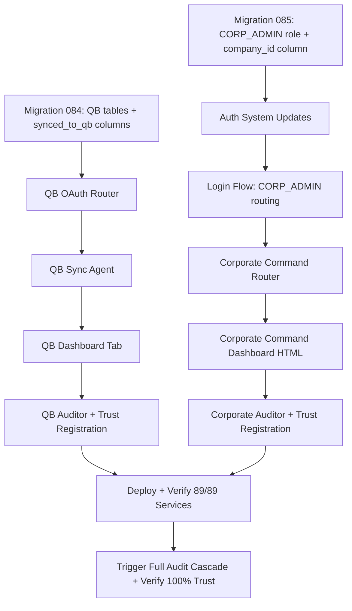

# QuickBooks Integration + Corporate Command Dashboard

## Part 1: Full Custom QuickBooks Online Integration

### 1A. Migration — QB Sync Tables

New migration `backend/migrations/084_quickbooks_integration.sql`:

- `qb_connection` — Single-row table storing QB OAuth tokens and realm ID
  - `id`, `realm_id` (QB company ID), `access_token`, `refresh_token`, `token_expiry`, `company_name`, `connected_by`, `connected_at`, `last_sync_at`, `error_message`, `created_at`
- `qb_sync_log` — Every sync event for audit trail
  - `id`, `sync_type` (subscription/token_purchase/gkm_donation/coach_payout/corporate_invoice), `source_table`, `source_id`, `qb_entity_type` (Invoice/SalesReceipt/JournalEntry/Bill), `qb_entity_id`, `amount_cents`, `status` (synced/failed/skipped), `error_message`, `created_at`
- `qb_account_mapping` — Maps internal categories to QB Chart of Accounts IDs
  - `id`, `internal_category` (subscription_revenue/token_sales/gkm_donations/coach_payouts/corporate_revenue), `qb_account_id`, `qb_account_name`, `created_at`

### 1B. QB OAuth Router

New file `backend/app/routers/quickbooks_api.py` — prefix `/api/admin/quickbooks`, requires `require_admin`:

- `GET /connect` — Generate OAuth URL (Intuit OAuth 2.0, scopes: `com.intuit.quickbooks.accounting`)
- `GET /callback` — Handle OAuth callback, exchange code for tokens, store in `qb_connection`
- `GET /status` — Connection health, last sync time, token expiry
- `POST /disconnect` — Revoke tokens, clear connection
- `POST /sync/trigger` — Manual full sync
- `GET /sync/history` — Recent sync log entries
- `GET /account-mapping` — Current QB account mappings
- `POST /account-mapping` — Set/update a mapping
- `GET /health` — Health check

OAuth pattern mirrors the existing LinkedIn/Instagram flow in [backend/app/services/platforms/linkedin.py](backend/app/services/platforms/linkedin.py). QB OAuth redirect URI: `https://api.sovereignsanctuary.net/api/admin/quickbooks/callback`.

### 1C. QB Sync Agent (Background Agent)

New file `backend/app/services/quickbooks_sync_agent.py`:

- Runs every 6 hours (daily would miss intra-day activity; 6h balances freshness vs API rate limits)
- Refreshes QB OAuth token if expiry < 30 minutes (tokens last 1 hour, refresh tokens last 100 days)
- Syncs 5 financial streams:

```
Stream 1: Subscriptions → QB Invoice
  Source: payment_history WHERE synced_to_qb = FALSE AND status = 'PAID'
  QB Object: Invoice (customer = user, line item = tier name + period)

Stream 2: Token Purchases → QB Sales Receipt
  Source: token_transactions WHERE action = 'purchase' AND source = 'token_pack' AND synced_to_qb = FALSE
  QB Object: SalesReceipt (customer = user, item = pack name)

Stream 3: GKM Donations → QB Journal Entry
  Source: gkm_donations WHERE synced_to_qb = FALSE
  QB Object: JournalEntry (debit: Stripe clearing, credit: GKM Donation Revenue)

Stream 4: Coach Payouts → QB Bill
  Source: signup_sharing_ledger WHERE status = 'completed' AND synced_to_qb = FALSE
  QB Object: Bill (vendor = coach, amount = shared_amount_cents)

Stream 5: Corporate Invoices → QB Invoice
  Source: corporate billing events (new query joining corporate_sponsors + payment_history)
  QB Object: Invoice (customer = company_name, line items = per-department enrollment)
```

- Each stream: query unsynced rows, batch into QB API calls, mark `synced_to_qb = TRUE`, log to `qb_sync_log`
- Error handling: per-record try/catch, failed records logged with error_message, retried next cycle
- QB API rate limit: 500 requests/minute — batch where possible

The `synced_to_qb BOOLEAN DEFAULT FALSE` column needs to be added to: `payment_history`, `token_transactions`, `gkm_donations`, `signup_sharing_ledger` (all in migration 084).

### 1D. QB Dashboard Tab

New file `dashboard/quickbooks.html` — accessible via `navTo('quickbooks.html')` from a new "QuickBooks" tab in [dashboard/command.html](dashboard/command.html):

- **Connection Status** — Connected/disconnected, company name, last sync, token health
- **Connect/Disconnect** button — Initiates OAuth or revokes
- **Account Mapping** — Dropdowns to map internal categories to QB accounts
- **Sync History** — Table of recent sync events with status badges
- **Manual Sync** button — Triggers immediate full sync
- **Sync Stats** — Counts by type (invoices synced, receipts created, etc.)

### 1E. Environment Variables

Add to `.env.template`:

- `QB_CLIENT_ID` — Intuit OAuth app client ID
- `QB_CLIENT_SECRET` — Intuit OAuth app client secret
- `QB_REDIRECT_URI` — defaults to `https://api.sovereignsanctuary.net/api/admin/quickbooks/callback`
- `QB_ENVIRONMENT` — `sandbox` or `production`

### 1F. QB Trust Auditor

New file `backend/app/services/quickbooks_auditor.py` — 10 checks:

- **Tab 1: Connection Health (3)** — health endpoint, connection status (DB row exists), token not expired
- **Tab 2: Sync Pipeline (4)** — last sync within 12h, sync log has entries, no failed syncs in last cycle, unsynced backlog < 100
- **Tab 3: API Endpoints (3)** — GET status returns 200, GET sync/history returns 200, GET account-mapping returns 200

Stagger: next available slot. Register in trust enforcer (5-location sync):

1. `TAB_ENDPOINTS` in `quickbooks_auditor.py`
2. `AUDITOR_ACTIVITY_TYPES` in `trust_enforcer.py` — `"quickbooks_audit_sent"`
3. `AUDITOR_LABELS` — `"QuickBooks Sync"`
4. `_baseline_key_for()` — `"quickbooks_check_count"`
5. `trust_baseline` table — `{"expected": 10}`

Register in `_service_checks` in `main.py` (service count 87 -> 89 with both new agents).

### 1G. Dependencies

- `pip install intuit-oauth quickbooks-python` (or use raw `aiohttp` to QB REST API v3 for consistency with existing codebase pattern)
- Intuit Developer account at `developer.intuit.com` (free)
- QB Online sandbox for testing before production

---

## Part 2: Corporate Command Dashboard

### 2A. Migration — CORP_ADMIN Role

New migration `backend/migrations/085_corporate_command.sql`:

- Widen the role CHECK constraint:
  ```sql
  ALTER TABLE users DROP CONSTRAINT IF EXISTS users_role_check;
  ALTER TABLE users ADD CONSTRAINT users_role_check
    CHECK (role IN ('CLIENT', 'COACH', 'ADMIN', 'RESEARCHER', 'CORP_ADMIN'));
  ```
- Add `company_id` as an indexed column on `users` (currently only in `profile_data` JSONB):
  ```sql
  ALTER TABLE users ADD COLUMN IF NOT EXISTS company_id UUID REFERENCES corporate_sponsors(id) ON DELETE SET NULL;
  CREATE INDEX IF NOT EXISTS idx_users_company_id ON users(company_id);
  ```
- Add `corp_admin_permissions` JSONB column to `corporate_sponsors` (stores which features are enabled per company):
  ```sql
  ALTER TABLE corporate_sponsors ADD COLUMN IF NOT EXISTS
    corp_admin_permissions JSONB DEFAULT '{"bulk_import":true,"roster":true,"usage_dashboard":true,"coach_assign":true,"billing":true,"password_reset":true}'::jsonb;
  ```

### 2B. Auth System Updates

**[backend/app/services/api_server.py](backend/app/services/api_server.py)** — Add new dependency:

```python
async def require_corp_admin(user: Dict = Depends(get_current_user)) -> Dict:
    if user.get('role') not in ['CORP_ADMIN', 'ADMIN']:
        raise HTTPException(403, "Corporate admin access required")
    return user
```

**[backend/app/websocket/bridge_server.py](backend/app/websocket/bridge_server.py)** — Update WRONG_PORTAL check:

```python
ADMIN_PORTAL_ROLES = {"ADMIN", "CORP_ADMIN"}
if expected_role and p.get("role") not in ADMIN_PORTAL_ROLES and p.get("role") != expected_role:
    return None, "WRONG_PORTAL"
```

Update the portal hints dict:

```python
_portal_hints = {
    "CLIENT": "app.sovereignsanctuary.net",
    "COACH": "coach.sovereignsanctuary.net",
    "ADMIN": "command.sovereignsanctuary.net",
    "CORP_ADMIN": "command.sovereignsanctuary.net",
}
```

### 2C. Admin Login Flow Update

**[dashboard/index.html](dashboard/index.html)** — After successful login, check the role from the login_success response:

- If `role === 'ADMIN'` — show passphrase challenge, then redirect to `command.html` (existing flow)
- If `role === 'CORP_ADMIN'` — skip passphrase, redirect directly to `corporate_command.html`

The passphrase challenge is admin-only. CORP_ADMIN gets credential auth only (username + password). No SMS challenge unless we add it later.

### 2D. Corporate Command Router

New file `backend/app/routers/corporate_command_api.py` — prefix `/api/corp`, requires `require_corp_admin`:

Every endpoint auto-scopes to the caller's `company_id` (extracted from the auth'd user profile). A CORP_ADMIN can never see users outside their company.

- `GET /roster` — List employees in their company (paginated, searchable)
- `GET /roster/{username}` — Employee detail (usage stats, login history, coach)
- `POST /roster/deactivate/{username}` — Soft-deactivate an employee
- `POST /roster/reactivate/{username}` — Re-activate
- `POST /roster/reset-password/{username}` — Reset employee password
- `GET /template/download` — Download CSV import template (pre-filled headers)
- `POST /bulk-import` — Upload CSV (reuses bulk_import logic, injects company_id + sponsor enrollment)
- `GET /usage-dashboard` — Aggregate usage: total tokens consumed, active users, sessions by department
- `GET /usage-dashboard/departments` — Per-department breakdown
- `GET /coach-assignments` — Coaches assigned to their company entity
- `POST /coach-assignments` — Assign coach to company (calls existing coach_assignments table)
- `DELETE /coach-assignments/{assignment_id}` — Remove coach assignment
- `GET /billing/overview` — Corporate billing: discount details, enrollment count, invoice summary
- `GET /billing/invoices` — Invoice history from Stripe for their company
- `GET /engagement-report` — Downloadable CSV: login frequency, session count, token usage per employee
- `GET /health` — Health check

### 2E. Company-Scoped Middleware Pattern

The `require_corp_admin` dependency returns the user dict. The router extracts `company_id`:

```python
company_id = user.get("company_id") or (user.get("profile_data") or {}).get("company_id")
if not company_id:
    raise HTTPException(403, "No company association")
```

Every query then includes `WHERE company_id = $company_id` or joins through `corporate_enrollments`. ADMIN role bypasses the company filter (can see all companies).

### 2F. Corporate Command Dashboard

New file `dashboard/corporate_command.html`:

Design system: Same void/gold/cyan palette as Sovereign Command. Tabs:

- **Dashboard** — Welcome banner with company name, quick stats (employee count, active users, tokens consumed this month)
- **Employee Roster** — Searchable table with name, email, status, last login, token balance, coach. Actions: deactivate, reset password
- **Import Employees** — Download template button, file upload with drag-and-drop, dry run validation, import button with progress
- **Usage Analytics** — Charts: daily active users, token consumption by department, session frequency, engagement trend
- **Coach Management** — Assigned coaches list, assign/unassign buttons (reads from coach_assignments where entity_type = 'company')
- **Billing** — Corporate discount details, current enrollment count vs max_employees cap, invoice history from Stripe

Auth: Same `_recoverAuth()` pattern as `command.html`. Token/username recovered from hash/localStorage/cookies.

### 2G. Corporate Command Trust Auditor

New file `backend/app/services/corporate_command_auditor.py` — 12 checks:

- **Tab 1: Health & Auth (3)** — health endpoint, roster returns 200, usage-dashboard returns 200
- **Tab 2: Import Pipeline (3)** — template download returns 200 with CSV, bulk-import POST returns 400/422 (validation), engagement-report returns 200
- **Tab 3: Management (3)** — coach-assignments returns 200, billing/overview returns 200, billing/invoices returns 200
- **Tab 4: Data Integrity (3)** — DB: company_id column exists on users, corporate_sponsors table exists, corp_admin users have company_id set

Stagger: next available slot after QB auditor. Register in trust enforcer (5-location sync).

Register in `_service_checks` in `main.py`.

### 2H. CORP_ADMIN Account Creation

CORP_ADMIN accounts are created by DrNevedal1 (ADMIN) only, via the existing user management or a new endpoint in `admin.py`:

- `POST /api/admin/create-corp-admin` — Creates a CORP_ADMIN user linked to a `corporate_sponsors` entry
  - Required: `username`, `password`, `email`, `company_id` (references corporate_sponsors.id)
  - Sets `role = 'CORP_ADMIN'`, `company_id` on both the column and profile_data
  - Only ADMIN can create these accounts (never self-registration)

---

## Implementation Order




## Service Health Impact

- Current: 87/87 services
- After: 89/89 (+1 QB Sync Agent, +1 Corporate Command Auditor, +1 QB Auditor = 90 if QB agent counted separately from auditor... let me be precise)
  - `quickbooks_sync_agent` — background agent (needs start/stop)
  - `quickbooks_auditor` — 3x daily auditor
  - `corporate_command_auditor` — 3x daily auditor
- Final target: **90/90 services healthy, ALL SYSTEMS NOMINAL**

## Trust Impact

- Current: 441/441 checks across 24 auditors
- After: 441 + 10 (QB) + 12 (Corp) = **463/463 checks across 26 auditors**

## Prerequisites

- Intuit Developer account and OAuth app (free at developer.intuit.com)
- QB Online sandbox company for testing
- `QB_CLIENT_ID` and `QB_CLIENT_SECRET` in `.env`

