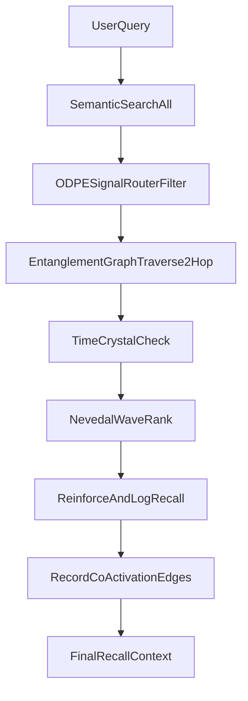

# Quantum Crystal Architecture Integration Plan

## Goal

Ship the full architecture from `quantum_crystal_architecture.py` with intact API contracts while integrating into existing LN modules and runtime lifecycle.

## Executive Order (Binding)

- **Order EO-QC-01: Remove `decay()` from implementation.**
- Confidence is **earned through recall** and retained permanently.
- Add `staleness_factor` for **ranking only** (retrieval ordering), not confidence mutation.
- `SOVEREIGN` cap at `0.95` remains the confidence ceiling guardrail.
- Retention floors remain quality thresholds for persistence policy.
- Time crystals remain the temporal relevance mechanism.
- Rationale adopted: decay is unnecessary and therapeutically counterproductive.

## Platform Invariant (Hard Safety Rail)

- **Invariant PI-QC-01: Crystal confidence must be monotonic non-decreasing.**
- Enforce this in two layers:
  1. Acceptance gate (release blocker on any downward mutation path).
  2. Database trigger in migration 154 (reject `NEW.confidence < OLD.confidence`).
- Any confidence decrease attempt fails by default.
- Confidence reduction requires explicit privileged administrative action (e.g., trigger drop/disable under superuser governance).

## Executive Rationale (Why Decay Is Removed)

1. **ODPE routing already solves quality control**
  - Low-quality crystals are filtered by signal/classification gates (`NOISE` excluded, `TENSION`/`DEEP_TENSION` flagged).
  - Quality failures are handled at classification/review time, not by time-based confidence erosion.
2. **Time crystals already solve temporal relevance**
  - Infrequent-but-critical patterns (e.g., annual grief activations) are surfaced by temporal pattern logic.
  - Decay would incorrectly suppress legitimate long-cycle memories between activations.
3. **Nevedal/recall ranking already solves priority**
  - Older crystals naturally rank lower when less relevant, without needing confidence destruction.
  - High-relevance stale crystals remain retrievable when query context demands them.

## Delivery Order, Dependencies, Timeline

- **Phase 0 (Day 0.5): Schema-first prep**
  - Confirm migration slot after `153` and align with existing `152_crystal_edges.sql`.
  - Dependency: none.
- **Phase 1 (Days 1-2): Migration + storage contracts**
  - Ship `154_...sql` for `coherence_time_crystals`, `crystal_recall_log`, and `crystal_edges` enhancements.
  - Dependency: Phase 0 complete.
- **Phase 2 (Days 2-4): Orchestrator core + class APIs**
  - Implement intact public API contracts (`recall`, `forge_for_user`, `compute_ec`, `filter_recall_results`).
  - Dependency: Phase 1 complete (tables available).
- **Phase 3 (Days 4-6): Recall-path integration (all 4 paths)**
  - Wire reinforce + recall-log hooks into every active recall path (listed below).
  - Dependency: Phase 2 complete.
- **Phase 4 (Days 6-8): Voice crystallization depth**
  - Add transcript persistence/vectorization + `detect_therapeutic_insights()` extraction + filler tracking + live EC cadence hooks.
  - Dependency: Phase 2 complete (orchestrator services available).
- **Phase 5 (Days 8-10): Time crystal forge + scheduler**
  - Add weekly forge with startup-safe stagger and observability.
  - Dependency: Phases 1-3 complete (requires recall log + co-activation data).
- **Phase 6 (Days 10-12): Validation + impact baselines + controlled rollout**
  - Run regression/load tests, measure pre/post impact, enable flags progressively.
  - Dependency: Phases 3-5 complete.

## Staleness-Aware Ranking (Replaces Decay)

- Implement `staleness_factor` as a ranking feature only, derived from recency/activation lag.
- `staleness_factor` influences recall ordering in orchestrator ranking, without mutating confidence.
- Confidence progression remains monotonic (reinforce only, capped at 0.95).
- Time crystal signals can up-rank stale-but-predictively-relevant crystals at query time.

```python
@property
def staleness_factor(self) -> float:
    """How long since last recall. Used for ranking, not deletion."""
    now = datetime.now(timezone.utc)
    if self.last_recalled is None:
        days = (now - self.created_at).days
    else:
        days = (now - self.last_recalled).days

    # Ranking penalty only; never mutates confidence
    # ~1 day: 1.00, ~30 days: 0.95, ~365 days: 0.70, multi-year floor: 0.30
    return max(0.3, 1.0 - (days / 2000))
```

- Ranking guidance:
  - `final_rank_score = base_relevance * staleness_factor * ec_weight`
  - Keep confidence immutable except `reinforce()` increments.
  - Permit time-crystal override to boost stale-but-timely crystals.

### DB Enforcement Snippet (Migration 154)

```sql
CREATE OR REPLACE FUNCTION prevent_crystal_confidence_decay()
RETURNS TRIGGER AS $$
BEGIN
    IF NEW.confidence < OLD.confidence THEN
        RAISE EXCEPTION 'Crystal confidence decay is prohibited. Crystal % cannot decrease from % to %.',
            OLD.id, OLD.confidence, NEW.confidence;
    END IF;
    RETURN NEW;
END;
$$ LANGUAGE plpgsql;

CREATE TRIGGER no_confidence_decay
    BEFORE UPDATE ON nate_intelligence_crystals
    FOR EACH ROW
    WHEN (NEW.confidence < OLD.confidence)
    EXECUTE FUNCTION prevent_crystal_confidence_decay();
```

## Contract APIs To Preserve

- `QuantumCrystalOrchestrator.recall()`
- `TimeCrystalForge.forge_for_user()`
- `NevedalWaveEngine.compute_ec()`
- `ODPESignalRouter.filter_recall_results()`

## Integration Map (Hybrid)

- Extend crystal model logic in [backend/app/services/nate_memory_crystallizer.py](/Users/nathannevedal/Desktop/Clinical-Sovereignty-Lab-2/backend/app/services/nate_memory_crystallizer.py) for `FiveDMemoryCrystal` behavior (`reinforce`, signal promotion, cacheability criteria) plus staleness metadata for ranking.
- Add new services for missing domains:
  - [backend/app/services/coherence_time_crystal.py](/Users/nathannevedal/Desktop/Clinical-Sovereignty-Lab-2/backend/app/services/coherence_time_crystal.py)
  - [backend/app/services/time_crystal_forge.py](/Users/nathannevedal/Desktop/Clinical-Sovereignty-Lab-2/backend/app/services/time_crystal_forge.py)
  - [backend/app/services/quantum_crystal_orchestrator.py](/Users/nathannevedal/Desktop/Clinical-Sovereignty-Lab-2/backend/app/services/quantum_crystal_orchestrator.py)
- Extend edge graph beyond current [backend/migrations/152_crystal_edges.sql](/Users/nathannevedal/Desktop/Clinical-Sovereignty-Lab-2/backend/migrations/152_crystal_edges.sql) and [backend/app/services/crystal_graph.py](/Users/nathannevedal/Desktop/Clinical-Sovereignty-Lab-2/backend/app/services/crystal_graph.py) to support typed edges and recursive CTE traversal (2-hop entanglement walk).
- Integrate ODPE anti-hallucination filter into Helix + inference path in [backend/app/services/helix_orchestrator.py](/Users/nathannevedal/Desktop/Clinical-Sovereignty-Lab-2/backend/app/services/helix_orchestrator.py) and [backend/app/services/littlenate_inference.py](/Users/nathannevedal/Desktop/Clinical-Sovereignty-Lab-2/backend/app/services/littlenate_inference.py).
- Extend [backend/app/services/nevedal_engine.py](/Users/nathannevedal/Desktop/Clinical-Sovereignty-Lab-2/backend/app/services/nevedal_engine.py) with `NevedalWaveEngine.compute_ec()` outputs (A, Aw, I, R, EC), RISSC mapping, outreach trigger.

## Data Layer Work

- Create next migration (after `153`) as `154_...sql` to add:
  - `coherence_time_crystals`
  - `crystal_recall_log`
  - enhanced `crystal_edges` fields for edge type/strength/last co-activation semantics
- Keep compatibility with existing crystal tables (`nate_intelligence_crystals`) and recall metadata updates.
- Reuse existing conversation persistence + vectorization path as canonical source for recall inputs.
- Add canonical co-activation event schema used across all modalities (voice, text chat, Me2Me, SkyEye), persisted once and replay-safe.

## Universal Co-Activation Policy (All Modalities)

- Co-activation recording is a mandatory post-recall step across:
  - voice turns
  - websocket/text therapeutic turns
  - Me2Me recalls
  - system-level semantic recalls (SkyEye/knowledge tools)
- Implement idempotent co-activation writes keyed by `(session_id|call_sid, source, crystal_a, crystal_b, time_bucket)` to avoid duplicate edge inflation.
- Edge update rule is shared:
  - co-activated => strengthen edge
  - expected co-activation miss => decay edge
- Time crystal forge reads the same universal co-activation source, not voice-only logs.

## Voice Call Crystallization Integration

- In [backend/app/services/twilio_grok_xtts_pipeline.py](/Users/nathannevedal/Desktop/Clinical-Sovereignty-Lab-2/backend/app/services/twilio_grok_xtts_pipeline.py), add post-call crystallization pipeline:
  - Capture user/assistant turn text from realtime events.
  - Persist turns into `conversation_history` using same encryption semantics as bridge path.
  - Upsert voice turns into Vectorize conversation index via `index_conversation()`.
  - Log recall/co-activation for graph reinforcement.
  - Attach voice biometrics to `voice_session_biometrics` for EC/time-crystal learning.
  - Run `detect_therapeutic_insights()` on finalized transcript and crystallize high-signal insights.
  - Track filler usage frequency in `voice_filler_events` (`call_sid`, profile, count windows) and feed into insight extraction and PMB summaries.
  - Define live `compute_ec()` cadence for calls:
    - turn-level update on each completed user transcript
    - rolling window update every N seconds during active call
    - end-of-call final EC snapshot for report/coach brief synthesis.

## Runtime Wiring

- Initialize orchestrator in [backend/app/main.py](/Users/nathannevedal/Desktop/Clinical-Sovereignty-Lab-2/backend/app/main.py) lifespan and register in `app.state`.
- Inject orchestrator into inference entrypoints (`littlenate_inference`, bridge call paths).
- Register weekly `forge_all_users()` background cycle with stagger discipline and startup-safe delays.
- Add service health check entries so startup denominator stays accurate and explicit.

## Recall Hook Map (All 4 Existing Paths)

- **Path 1: Little Nate inference core**
  - File: [backend/app/services/littlenate_inference.py](/Users/nathannevedal/Desktop/Clinical-Sovereignty-Lab-2/backend/app/services/littlenate_inference.py)
  - Hook: replace direct recall-count SQL in `_retrieve_crystals()` with orchestrator `reinforce + crystal_recall_log`.
- **Path 2: Bridge semantic therapeutic recall**
  - File: [backend/app/websocket/bridge_server.py](/Users/nathannevedal/Desktop/Clinical-Sovereignty-Lab-2/backend/app/websocket/bridge_server.py)
  - Hook: where semantic recall injects memory + current `record_recall()` call; route through orchestrator for unified logging + co-activation.
- **Path 3: Quantum knowledge field recall**
  - File: [backend/app/services/quantum_knowledge_field.py](/Users/nathannevedal/Desktop/Clinical-Sovereignty-Lab-2/backend/app/services/quantum_knowledge_field.py)
  - Hook: replace per-index recall_count updates with orchestrator reinforcement/logging to prevent divergence.
- **Path 4: SkyEye semantic recall context**
  - File: [backend/app/services/skyeye_chat.py](/Users/nathannevedal/Desktop/Clinical-Sovereignty-Lab-2/backend/app/services/skyeye_chat.py)
  - Hook: apply ODPE filter + reinforce/log recalls for system wisdom retrieval path.

## Recall Flow (Target)




## Impact Comparison Deliverables (99%-accuracy methodology)

- Produce a pre/post impact brief using measured baselines (not speculative claims) across:
  - end-user response quality
  - voice experience quality
  - Me2Me learning depth
  - lived wisdom promotion
  - memory capture/recall precision
  - prediction + cycle detection
  - PMB report quality/speed
  - coach briefing quality/prep time
- Use objective instrumentation sources:
  - `conversation_history`, `crystal_recall_log`, `coherence_time_crystals`, `voice_session_biometrics`, `call_metrics`, PMB report outputs.
- Define acceptance gates per capability (minimum sample sizes, confidence interval thresholds, regression limits).

## Validation & Safety

- Unit tests for all 12 classes and edge cases (monotonic confidence, contradiction detection, periodicity confidence, staleness-aware ranking stability).
- Integration tests for recall 9-step pipeline and voice-to-crystal persistence.
- Integration tests for universal co-activation write path across all 4 recall paths.
- Integration tests for voice `detect_therapeutic_insights()` extraction and filler-frequency ingestion.
- Trust regression checks for route ordering/status code expectations and service health denominator.
- Load-test memory/graph traversal and weekly forge jobs to prevent CPU saturation.

## Rollout

- Deploy behind feature flags:
  - `ENABLE_QUANTUM_CRYSTAL_ORCHESTRATOR`
  - `ENABLE_VOICE_TRANSCRIPT_CRYSTALLIZATION`
  - `ENABLE_TIME_CRYSTAL_FORGE`
- Progressive enablement: admin cohort -> coach cohort -> selected clients -> full rollout.
- Include fast rollback path to legacy recall/inference.

## Execution Checklist With Acceptance Gates

### Phase 0 — Schema Prep (Done/Not-Done Gate)

- Checklist
  - Identify next migration number and confirm no numbering collision.
  - Confirm compatibility with existing `152_crystal_edges.sql` constraints and indexes.
  - Confirm table ownership/permissions for app runtime role.
- Acceptance criteria
  - Migration file name reserved and review-approved.
  - No conflicting PK/index definitions with existing `crystal_edges`.
  - Dry-run SQL parse passes in CI/local migration checker.

### Phase 1 — Migration 154 (Done/Not-Done Gate)

- Checklist
  - Create `coherence_time_crystals`.
  - Create `crystal_recall_log`.
  - Extend/create `crystal_edges` typed-edge fields required by architecture.
  - Add DB anti-decay enforcement on `nate_intelligence_crystals`:
    - `prevent_crystal_confidence_decay()` trigger function
    - `no_confidence_decay` trigger (`BEFORE UPDATE`, reject `NEW.confidence < OLD.confidence`)
  - Add indexes for:
    - recall lookups by `(user_id, recalled_at)`
    - time crystal lookups by `(user_id, next_activation_at, confidence)`
    - edge traversal by `(crystal_a, edge_type, strength)` and `(crystal_b, edge_type, strength)`.
- Acceptance criteria
  - Migration applies cleanly on a fresh DB and current production schema snapshot.
  - Trigger test passes: attempted confidence decrease is rejected by DB.
  - Rollback migration executes without orphaning dependent constraints.
  - Explain plan on key queries shows index usage (no full scans for core paths).

### Phase 2 — Class API Contracts (Done/Not-Done Gate)

- Checklist
  - Implement/port all 12 classes with exact required public methods.
  - Keep contract signatures for:
    - `QuantumCrystalOrchestrator.recall()`
    - `TimeCrystalForge.forge_for_user()`
    - `NevedalWaveEngine.compute_ec()`
    - `ODPESignalRouter.filter_recall_results()`
  - Split internals into LN-native service files while preserving API shape.
- Acceptance criteria
  - Contract tests pass (method names/signatures/return envelopes stable).
  - Static type checks pass for all orchestrator call sites.
  - No direct callers broken in existing inference/helix/bridge code paths.

### Phase 3 — Recall Integration (All 4 Paths) (Done/Not-Done Gate)

- Checklist
  - Path 1: `littlenate_inference.py` `_retrieve_crystals()` hooks to orchestrator reinforce+log.
  - Path 2: `bridge_server.py` semantic recall path hooks reinforce+log+co-activation.
  - Path 3: `quantum_knowledge_field.py` recall update logic replaced with orchestrator path.
  - Path 4: `skyeye_chat.py` semantic recall path applies ODPE filter + reinforce+log.
  - Ensure universal co-activation writer is invoked by every path.
- Acceptance criteria
  - `crystal_recall_log` receives rows from all four paths (validated by integration tests).
  - `recall_count` and `last_recalled_at` stay consistent with log counts (no drift >1 event).
  - ODPE filtering removes NOISE and flags TENSION in all four paths.

### Phase 4 — Voice Crystallization Depth (Done/Not-Done Gate)

- Checklist
  - Persist voice turn transcripts into `conversation_history` (encrypted) at post-call finalize.
  - Index voice turns in Vectorize `conversation` source.
  - Add `detect_therapeutic_insights()` and crystal extraction from voice transcript.
  - Record filler usage in `voice_filler_events` with per-call frequency metrics.
  - Run `compute_ec()` live:
    - per completed user turn
    - rolling interval update
    - final post-call snapshot
- Acceptance criteria
  - A successful call writes transcript rows + vector records + recall logs.
  - Insight extraction creates measurable new crystals on test calls with disclosure content.
  - `voice_filler_events` contains expected counts and timestamps for filler playback.
  - RISSC profile switching reflects live EC changes in call telemetry.

### Phase 5 — Time Crystal Forge Weekly Job (Done/Not-Done Gate)

- Checklist
  - Add `forge_all_users()` scheduler with startup-safe delay and weekly cadence.
  - Add staleness-factor refresh/compute path for ranking (no confidence mutation).
  - Implement periodicity confidence via interval consistency metrics.
  - Feed `should_trigger_outreach()` into outreach candidate output path.
- Acceptance criteria
  - Weekly job runs once per window (idempotent guard in place).
  - No background process mutates confidence downward.
  - Staleness-factor updates are idempotent and reflected in ranking outputs.
  - Time crystals generated only when minimum confidence/occurrence thresholds are met.
  - Outreach candidates include evidence fields (pattern, confidence, next_activation_at).

### Phase 6 — Platform Impact Validation + Rollout (Done/Not-Done Gate)

- Checklist
  - Measure pre/post baselines for:
    - end-user quality
    - voice quality
    - Me2Me depth
    - lived wisdom promotion
    - memory capture/recall precision
    - prediction/cycle detection
    - PMB report quality/speed
    - coach brief depth/prep time
  - Execute progressive flag rollout (admin -> coach -> selected clients -> full).
  - Define rollback runbook for each flag.
- Acceptance criteria
  - All 8 capability reports generated with confidence intervals and sample sizes.
  - No trust/service-health regressions in deployment verification checks.
  - Platform invariant PI-QC-01 preflight passes (downward confidence update attempt fails).
  - Rollback rehearsal validated in staging or controlled production window.

## Evidence Required For Final Sign-Off

- DB evidence
  - `crystal_recall_log` populated from all 4 recall paths.
  - `coherence_time_crystals` has forged records with valid confidence windows.
  - `voice_filler_events` and `voice_session_biometrics` populated for test calls.
- Behavioral evidence
  - Recall responses show ODPE-prioritized crystal selection.
  - Voice calls produce transcript persistence + insight-derived crystal creation.
  - Coach brief examples include time crystal predictions and tension flags.
- Reliability evidence
  - No startup health denominator regression.
  - No CPU saturation from forge/co-activation/recall logging paths under load test.
  - DB invariant evidence: `UPDATE ... SET confidence = confidence - x` fails due to trigger enforcement.

## Review Rubric (Pass/Fail Matrix)

- **Phase 0: Schema Prep**
  - Pass if migration numbering, compatibility, and SQL dry-run checks are all green.
  - Fail if any migration naming conflict or DDL parse issue remains.
- **Phase 1: Migration 154**
  - Pass if migration up/down works, indexes are used on core queries, no constraint conflicts exist, and DB trigger rejects confidence decreases.
  - Fail if rollback breaks dependencies, core recall/edge queries require full scans, or confidence can be decremented via SQL update.
- **Phase 2: Contract APIs**
  - Pass if all required class APIs exist with expected signatures and callers compile/type-check.
  - Fail if any required method contract changes or existing caller path breaks.
- **Phase 3: Recall Integration (4 paths)**
  - Pass if all four recall paths write reinforce + recall logs + co-activation events consistently.
  - Fail if any path bypasses orchestrator hooks or produces recall/log drift.
- **Phase 4: Voice Crystallization**
  - Pass if successful calls persist encrypted transcript turns, index to Vectorize, record filler events, and run live/final `compute_ec()`.
  - Pass if `detect_therapeutic_insights()` produces test-validated new crystals on disclosure-rich calls.
  - Fail if voice calls only log minutes without transcript/crystal learning artifacts.
- **Phase 5: Time Crystal Forge**
  - Pass if weekly forge runs idempotently, no confidence-downward mutation exists, staleness-aware ranking works, and outreach candidates include evidence.
  - Fail if any decay-style confidence reduction is present, ranking ignores staleness/time-crystal relevance, or outreach evidence fields are missing.
- **Phase 6: Impact + Rollout**
  - Pass if all 8 capability comparisons include sample size + confidence intervals, no trust/service-health regressions occur, and PI-QC-01 preflight is green.
  - Fail if claims are unmeasured, rollout skips gating, regressions appear without rollback execution, or confidence can be lowered by normal app paths.
- **Final Platform Sign-Off**
  - Pass only if DB evidence + behavioral evidence + reliability evidence are all satisfied simultaneously.
  - Automatic fail if any critical gate is unmet in any phase.

