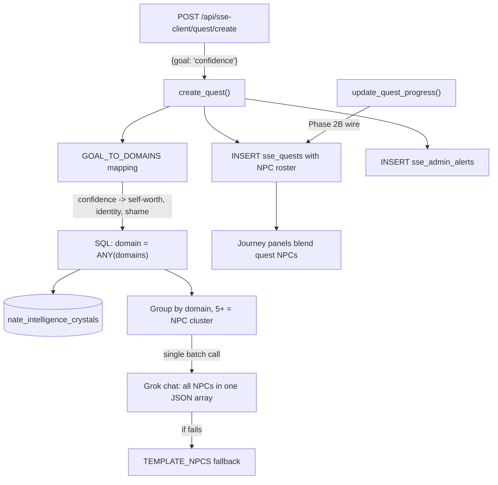

# Phase 2: Quest and Mission Engine with Crystal-Informed NPCs

## Architecture



## Decision: API-first, Flutter UI deferred to Phase 4

Quest/mission creation is tested via API endpoints directly. Flutter chat integration (Little Nate suggesting quests, action buttons) is a Phase 4 task. This phase builds the engine and endpoints.

## File 1: NEW -- `backend/app/sse/quest_mission_engine.py` (max 250 lines)

Seven functions. LLM calls follow the existing `thera_world_engine.py` pattern (`httpx.AsyncClient`, `NATE_CHAT_URL`, `XAI_API_KEY`/`NATE_CHAT_KEY`, `grok-3-mini`).

### Constants

`GOAL_TO_DOMAINS` -- maps user-facing goal keywords to crystal domain lists:

- `"confidence"` -> `["self-worth", "identity", "shame", "performance"]`
- `"anxiety"` -> `["anxiety", "fear", "control", "attachment"]`
- `"anger"` -> `["anger", "resentment", "boundaries", "control"]`
- `"relationship"` -> `["attachment", "trust", "abandonment", "codependency"]`
- `"grief"` -> `["grief", "loss", "abandonment"]`
- `"forgiveness"` -> `["forgiveness", "resentment", "anger"]`
- `"depression"` -> `["depression", "loss", "loneliness", "self-worth"]`
- `"boundaries"` -> `["boundaries", "control", "codependency", "identity"]`
- `"trauma"` -> `["trauma", "fear", "shame", "abandonment"]`
- `"self-esteem"` -> `["self-worth", "identity", "shame", "rejection"]`

Fallback: if no keyword match, extract words from `goal` and match any crystal `domain` containing those words.

`TEMPLATE_NPCS` -- keyed by pattern, provides fallback NPCs when LLM is down.

### `analyze_crystal_depth(user_id, goal_or_target, db_pool) -> dict`
- Resolve username to UUID via `SELECT id FROM users WHERE username = $1`
- Map `goal_or_target` through `GOAL_TO_DOMAINS`: for each word in the goal, check if it's a key in the mapping. Collect all matched domain lists into a target set.
- If no mapping hit, fallback: use raw goal words as domain substrings.
- Query `nate_intelligence_crystals WHERE user_id = $uuid AND superseded_by IS NULL AND domain = ANY($domains)` for the target domain set.
- Group results by `domain`, count per domain.
- For clusters with 5+ crystals, assign an NPC archetype pattern via `DOMAIN_TO_PATTERN` dict.
- Also grab 2-3 sample `crystal_text` snippets per cluster for NPC prompt context.
- Return `{clusters: [{domain, crystal_count, pattern, sample_texts}], goal_domain: str}`

### `generate_npcs_from_crystals(clusters) -> list`
- **Single batch Grok call** -- send ALL clusters in one prompt, request a JSON array of NPCs back.
- System prompt lists each cluster with domain, pattern, and sample crystal texts.
- Asks for one NPC per cluster: `{name, description, initial_form, transformed_form, visual_prompt_fragment}`
- On LLM failure, use `TEMPLATE_NPCS` fallback keyed by each cluster's pattern.
- Return list of NPC dicts.

### `create_quest(user_id, goal, db_pool, crystal_analysis=None) -> dict`
- If no `crystal_analysis`, call `analyze_crystal_depth()`
- Call `generate_npcs_from_crystals()`
- INSERT into `sse_quests` with `goal`, `goal_domain`, `progress_notes` containing NPC roster
- INSERT `sse_admin_alerts` with `alert_type='quest_created'`
- Return quest dict with NPC info

### `create_mission(user_id, relationship_target, relationship_type, db_pool, crystal_analysis=None) -> dict`
- Same pattern as `create_quest` but for relational work
- INSERT into `sse_missions`
- INSERT alert with `alert_type='mission_created'`

### `compose_quest_panel(user_id, quest, profile, journey, db_pool) -> dict`
- Get NPCs from `quest.progress_notes`
- Build LLM prompt including biome, character, quest goal, active NPCs
- Return `{narrative_text, image_prompt, panel_tone}`
- Fallback template on failure

### `compose_mission_panel(user_id, mission, profile, journey, db_pool) -> dict`
- Same structure as quest panel but for relational dynamics

### `update_quest_progress(quest_id, new_crystal_summaries, db_pool) -> dict` (~20 lines)
- Append to `progress_notes` JSONB: `{"timestamp": now, "crystals_added": summaries, "note": "..."}`
- Count total domain crystals since quest started
- If quest active 7+ days AND domain crystal count has grown by 50%+ since creation, set a `climax_ready` flag in `progress_notes`
- Return updated quest state
- **Wire point**: called from crystal pipeline when new crystals are created -- noted for Phase 2B, not wired in this phase

## File 2: MODIFY -- `backend/app/routers/admin.py` (max 45 new lines on `sse_client_router`, max 45 on `sse_router`)

### Client endpoints (appended after `sse_client_router.get("/vault/{user_id}")` at line 5405)

- `POST /api/sse-client/quest/create` -- body `{goal}`, calls `create_quest()`, returns quest + NPCs
- `POST /api/sse-client/mission/create` -- body `{relationship_target, relationship_type}`, calls `create_mission()`, returns mission + NPCs
- `GET /api/sse-client/quests` -- returns user's active quests from `sse_quests`
- `GET /api/sse-client/missions` -- returns user's active missions from `sse_missions`
- `POST /api/sse-client/quest/{quest_id}/complete` -- sets `status='completed'`, `completed_at=NOW()`, generates resolution panel via `compose_quest_panel()`, fires admin alert `quest_completed`
- `POST /api/sse-client/quest/{quest_id}/pause` -- sets `status='paused'`, admin alert `quest_paused`
- `POST /api/sse-client/mission/{mission_id}/complete` -- same pattern, admin alert `mission_completed`
- `POST /api/sse-client/mission/{mission_id}/pause` -- sets `status='paused'`, admin alert `mission_paused`

All use `_user: dict = Depends(_sse_auth)` for auth. The complete endpoints verify the quest/mission belongs to the user before updating.

### Admin endpoints (on `sse_router`)

- `POST /api/sse/admin/assign-workbook` -- body `{user_id, storyboard_id}`. INSERT into `sse_enrolled_users` with `source='coach_assigned'`. Fire admin alert `workbook_assigned`. Max 10 lines.
- `POST /api/sse/admin/backfill-intake/{user_id}` -- re-run extraction for single user. Max 15 lines.
- `POST /api/sse/admin/backfill-intake-all` -- batch re-extraction for all users with NULL archetype_hint. Max 20 lines.

## File 3: MODIFY -- `backend/app/sse/thera_world_engine.py` (max 55 new lines total)

Add a comment block at the TOP of the file (after imports, before constants) for future Family Sanctuary requirements:

```python
# ---------- Phase 6: Family Sanctuary Story Integration ----------
# TODO: Couples — shared relational story space. Partner NPCs appear as
#   distant figures in each other's panels (never named, always archetypal).
# TODO: Dependents — age-gated biomes (brighter, gentler imagery).
#   Simplified intake. Adult trauma themes MUST NOT leak into child panels.
# TODO: Family coherence — family-level story thread when multiple members
#   are active. Shared biome events (storms, seasons) sync across members.
# TODO: Relational crystal linking — crystals from family therapy sessions
#   create cross-member NPC appearances (e.g. "The Bridge Builder").
# -----------------------------------------------------------------
```

### A. Story continuity via `last_panel_summary`, `last_panel_npcs`, `panel_sequence`

In `compose_journey_narrative()` (line 185), add continuity parameters:

```python
async def compose_journey_narrative(
    profile, journey, biome, character, db_pool,
    last_panel_summary: str = "", last_panel_npcs: list = None, panel_sequence: int = 0
) -> dict:
```

Add to the `sys_prompt` string (after "Therapeutic arc"):

```
f"Previous scene: {last_panel_summary or 'This is the opening scene.'}\n"
f"NPCs present last time: {', '.join(n.get('name','') for n in (last_panel_npcs or [])) or 'none yet'}\n"
f"This is panel {panel_sequence + 1} in the {biome['biome']} biome.\n"
"Generate the NEXT scene that continues from where we left off.\n"
```

In `generate_journey_panel()`, after fetching the fresh journey (line 272), read all three:

```python
j = journey_fresh or journey
last_summary = j.get("last_panel_summary", "")
last_npcs = j.get("last_panel_npcs", [])
panel_seq = j.get("panel_sequence", 0)
```

Pass all three to `compose_journey_narrative()`.

After panel generation succeeds, write back:

```python
summary = narrative["narrative_text"].split(".")[0] + "." if narrative["narrative_text"] else ""
# Collect NPCs that appeared in this panel (from quest/mission blending + core character)
npcs_this_panel = [{"name": character[0]}]  # core character always present
# ... append quest/mission NPCs if blended
# In the UPDATE sse_user_journeys query, add:
#   last_panel_summary = $X, last_panel_npcs = $Y::jsonb, panel_sequence = panel_sequence + 1
```

On biome transition (in `check_biome_transition`), reset `panel_sequence` to 0.

### B. One panel per day maximum

In `generate_journey_panel()`, at the top (before any work), check if a panel already exists for today:

```python
async with db_pool.acquire() as conn:
    existing = await conn.fetchval(
        "SELECT 1 FROM sse_panel_log WHERE user_id = $1 AND generated_at::date = CURRENT_DATE",
        user_id)
    if existing:
        return {"skipped": True, "reason": "panel_already_generated_today"}
```

Quest climax and mission milestone panels use `panel_type='quest'` or `panel_type='mission'` -- these override the daily journey panel. The dedup check in `_run_journey_panels()` catches any `panel_type` for today, so if a quest panel already fired, the journey panel is skipped.

### C. Quest/mission NPC blending + archetype protagonist

After `compose_journey_narrative()`, add quest/mission NPC blending:

- If `profile["active_quests"]` is non-empty, load quest NPCs from `sse_quests.progress_notes`
- Append NPC visual fragments to the image prompt (e.g. `", The Silent Guardian watches from the treeline"`)
- If `profile["active_missions"]` is non-empty, append relational NPC fragment

Also fetch the user's archetype from `sse_identity_forge` to use as the protagonist figure in the image prompt instead of the crystal-mapped character:

```python
archetype_vis = None
try:
    async with db_pool.acquire() as conn:
        archetype_vis = await conn.fetchval(
            "SELECT character_visual FROM sse_identity_forge WHERE user_id = $1", user_id)
except Exception:
    pass
if archetype_vis:
    narrative["image_prompt"] = narrative["image_prompt"].replace("a solitary figure", archetype_vis[:100])
else:
    # No archetype yet — default until backfill runs
    narrative["image_prompt"] = narrative["image_prompt"].replace(
        "a solitary figure", "a solitary traveler")
```

### D. Data richness graceful degradation

Add a `data_richness` field to the profile returned by `get_therapeutic_profile()`:

```python
crystal_count = profile.get("crystal_count", 0)
session_count = profile.get("session_count", 0)
if crystal_count >= 50 and session_count >= 10:
    profile["data_richness"] = "rich"
elif crystal_count >= 10 and session_count >= 3:
    profile["data_richness"] = "moderate"
elif crystal_count >= 1 or session_count >= 1:
    profile["data_richness"] = "thin"
else:
    profile["data_richness"] = "empty"
```

In `compose_journey_narrative()`, the LLM prompt adapts based on `data_richness`:

- **rich**: deep crystal-informed narrative with NPCs, quest/mission references
- **moderate**: crystal-informed with biome atmosphere, lighter NPC presence
- **thin**: biome-focused with hints from intake themes (no crystal references)
- **empty**: pure biome atmosphere, character exploration, world-building only

For **empty** and **thin** users (zero or few crystals), fall back to intake `conversation_history` as narrative source material:

```python
if profile.get("data_richness") in ("empty", "thin"):
    intake_themes = ""
    try:
        async with db_pool.acquire() as conn:
            conv_hist = await conn.fetchval(
                "SELECT conversation_history FROM sse_identity_forge WHERE user_id = $1", user_id)
        if conv_hist:
            import json
            turns = json.loads(conv_hist)
            user_turns = [m["content"] for m in turns if m.get("role") == "user"]
            intake_themes = "; ".join(t[:80] for t in user_turns[2:8] if t)
    except Exception:
        pass
    # Append to LLM prompt: f"User's intake themes: {intake_themes}"
```

The biome descriptions in `BIOME_THRESHOLDS` (especially `dark_forest`) are rich enough to generate atmospheric panels for weeks without any crystal data. The narrative prompt instructs the LLM to focus on world-building and character exploration when data is thin.

### E. Reserve panels -- generation failure fallback (max 10 lines)

After a user's first successful panel generation, store 2 reserve prompts (text only, not images) in `journey_metadata`:

```python
if not journey.get("journey_metadata", {}).get("reserve_prompts"):
    reserves = [
        f"A {biome['biome']} scene at dawn, {character[1]}, painterly style, muted warm palette",
        f"A {biome['biome']} scene at dusk, distant campfire, {character[1]}, painterly style"
    ]
    # UPDATE sse_user_journeys SET journey_metadata = jsonb_set(journey_metadata, '{reserve_prompts}', $1::jsonb)
```

In `generate_journey_panel()`, if the LLM narrative call AND the template fallback both fail (double fault), check for a reserve prompt:

```python
except Exception:
    reserves = journey.get("journey_metadata", {}).get("reserve_prompts", [])
    if reserves:
        prompt = reserves.pop(0)
        # generate image from reserve prompt, use generic narrative
        # update journey_metadata to remove the used reserve
    else:
        return {"error": "panel generation failed, no reserves"}
```

This ensures the user ALWAYS gets a panel even if the LLM is completely down.

## File 4: MODIFY -- `backend/app/services/littlenate_inference.py` (PROTECTED -- max 4 new lines)

**Line budget**: 14 lines added in prior sessions (Step 5.5 story context fetch + `_build_enriched_prompt` story_context param + STORY JOURNEY block). Adding 2 more here = 16/20 total. 4 lines remaining.

Inside the existing `if story_context and story_context.get("phase_id"):` block (line 351), append quest/mission context after the STORY JOURNEY text. These keys come from the expanded `get_user_story_context()` in layer6_crystal_bridge.py:

```python
if story_context.get("active_quest"):
    parts.append(f"[ACTIVE QUEST] {story_context['active_quest']}\n")
if story_context.get("active_mission"):
    parts.append(f"[ACTIVE MISSION] {story_context['active_mission']}\n")
```

2 new lines inside the existing `if story_context` block. No new parameters, no new imports.

## File 5: MODIFY -- `backend/app/sse/layer6_crystal_bridge.py` (max 15 new lines)

Expand `get_user_story_context()` to also return active quest and mission info:

- After fetching storyboard context (existing logic), also query:
  - `SELECT goal FROM sse_quests WHERE user_id = $1 AND status = 'active' LIMIT 1`
  - `SELECT relationship_target, relationship_type FROM sse_missions WHERE user_id = $1 AND status = 'active' LIMIT 1`
- Add `active_quest` and `active_mission` keys to the returned dict
- If user has no storyboard enrollment but HAS an active quest/mission, still return a minimal context dict (don't return None just because no workbook enrollment)

## File 6: FIX -- `backend/app/sse/layer1_identity_forge.py` (max 60 new lines)

### Root cause of NULL clinical fields

`extract_intake_data()` at line 60 has three bugs:

1. **`archetype_hint` options missing `seraph`**: prompt lists `warrior|sage|healer|guardian|explorer|child` but user described a seraph warrior. The LLM may return an unlisted value which is still valid, but we should list all options: `warrior|sage|healer|guardian|explorer|seraph|custom`.

2. **No fallback when LLM returns empty/malformed JSON**: If the Grok call fails or returns non-JSON, `data = {}` and all fields are written as NULL to DB. The function succeeds silently -- it writes a `status='complete'` row with all NULL clinical fields.

3. **No keyword extraction fallback**: The conversation_history has the raw user answers for each turn. Turn 2 = presenting concern, turn 5 = roots/culture/faith, turn 6 = wound, turn 7 = strength, turn 8 = character visual, turn 9 = spiritual framework, turn 10 = hope. These can be extracted directly by matching turn numbers.

### Fix: add `_keyword_fallback_extraction(conversation)` (~25 lines)

```python
def _keyword_fallback_extraction(conversation: list) -> dict:
    """Extract intake fields directly from conversation turns when LLM fails."""
    user_turns = [m["content"] for m in conversation if m.get("role") == "user"]
    data = {}
    if len(user_turns) >= 2:
        data["presenting_concern"] = user_turns[1][:300]
    if len(user_turns) >= 5:
        text = user_turns[4].lower()
        data["cultural_context"] = user_turns[4][:200]
        if any(w in text for w in ("god", "jesus", "christ", "church", "pray", "bible", "faith")):
            data["spiritual_framework"] = "christian"
        elif any(w in text for w in ("universe", "energy", "spirit", "meditation")):
            data["spiritual_framework"] = "spiritual"
        else:
            data["spiritual_framework"] = "other"
    if len(user_turns) >= 6:
        data["wound_indicator"] = user_turns[5][:300]
    if len(user_turns) >= 7:
        data["strength_indicator"] = user_turns[6][:300]
    if len(user_turns) >= 8:
        data["character_visual"] = user_turns[7][:300]
        vis = user_turns[7].lower()
        for hint in ("warrior", "sage", "healer", "guardian", "explorer", "seraph"):
            if hint in vis:
                data["archetype_hint"] = hint
                break
        data.setdefault("archetype_hint", "explorer")
    if len(user_turns) >= 9:
        data["spiritual_framework"] = data.get("spiritual_framework") or "other"
        stext = user_turns[8].lower()
        if any(w in stext for w in ("god", "jesus", "christ", "church", "pray", "bible")):
            data["spiritual_framework"] = "christian"
    if len(user_turns) >= 10:
        data["language_notes"] = user_turns[9][:200]
    return data
```

### Fix: merge fallback into `extract_intake_data()` (~5 lines)

After the existing LLM try/except block (line 88), add:

```python
if not data.get("character_visual"):
    logger.warning("LLM extraction returned empty for %s — falling back to keyword extraction", user_id)
    fallback = _keyword_fallback_extraction(conversation)
    for k, v in fallback.items():
        data.setdefault(k, v)
```

### Fix: update archetype_hint options in the sys_prompt (line 74)

Change `warrior|sage|healer|guardian|explorer|child` to `warrior|sage|healer|guardian|explorer|seraph|custom`.

### Fix: post-insert verification (~5 lines)

After the DB INSERT at line 108, verify extraction succeeded:

```python
if not data.get("archetype_hint"):
    logger.error("INTAKE EXTRACTION FAILED for %s — archetype_hint is NULL after LLM + fallback", user_id)
if not data.get("character_visual"):
    logger.error("INTAKE EXTRACTION FAILED for %s — character_visual is NULL after LLM + fallback", user_id)
```

This ensures extraction failures are VISIBLE in backend logs. Combined with the fallback, the only way both fire is if the conversation has fewer than 8 user turns (incomplete intake that somehow reached turn 10).

### Add: archetype image generation after successful extraction (~20 lines)

After the DB write at line 108 and before the crystallization try/except, add a function `_generate_archetype_image(user_id, data, db_pool)`:

- Build prompt from `character_visual` + `archetype_hint` + starting biome (`dark_forest` for new users):
  `"{character_visual}, standing at the edge of a dark misty forest, {archetype_hint} archetype, painterly style, muted warm palette with golden light accents, no text, no words, no lettering"`
- Call `grok_imagine_client.generate_image(prompt)`
- Upload to R2 at `sse/archetype/{user_id}/archetype.png`
- Write URL to:
  - `sse_identity_forge`: `UPDATE SET archetype_image_url = $1 WHERE user_id = $2` (new column)
  - `sse_user_journeys.journey_metadata`: `jsonb_set(journey_metadata, '{archetype_image_url}', ...)` (existing JSONB column)
- Return the URL
- Wrap in try/except -- image generation failure must not break intake completion

Add `archetype_image_url` to the return dict so `intake_session.py` can pass it to Flutter.

### Modify: `intake_session.py` (~3 lines)

The turn 10 response MUST include `archetype_image_url`. The flow is synchronous: extract data -> generate archetype image -> THEN return "complete". The image generation happens inside `extract_intake_data()` (which now calls `_generate_archetype_image()`), so by the time it returns, the URL is in `intake_data`.

```python
return {
    "turn": 10,
    "nate_message": closing,
    "complete": True,
    "intake_data": intake_data,
    "archetype_image_url": intake_data.get("archetype_image_url"),
    "conversation_history": conversation_history,
}
```

The Flutter `IntakeConversationScreen` should:
1. Show loading state: "Little Nate is creating your story world..."
2. Receive the response with `archetype_image_url`
3. Display the archetype image with text: "This is you in the Thera-World"
4. 3-second pause, then navigate to main app

This is a Flutter-side display change (not in this phase's scope), but the API contract is established here -- `archetype_image_url` is always present in the turn 10 response body.

### Impact on journey panels

The archetype is the PROTAGONIST. The user IS their archetype (e.g. Seraph warrior). Core characters from `CRYSTAL_TO_CHARACTER` (Mirror, Serpent, etc.) are forces the protagonist ENCOUNTERS. In `compose_journey_narrative()`, the image prompt should include the archetype as the main figure, not the crystal-mapped character. This change goes in `thera_world_engine.py` -- when generating the panel, check `sse_identity_forge.archetype_hint` or `sse_user_journeys.journey_metadata.archetype_image_url` and use the archetype as the protagonist description in the image prompt.

## File 7: MIGRATION -- `backend/migrations/175_archetype_continuity_columns.sql`

```sql
ALTER TABLE sse_identity_forge ADD COLUMN IF NOT EXISTS archetype_image_url TEXT;
ALTER TABLE sse_user_journeys ADD COLUMN IF NOT EXISTS last_panel_summary TEXT;
ALTER TABLE sse_user_journeys ADD COLUMN IF NOT EXISTS last_panel_npcs JSONB DEFAULT '[]';
ALTER TABLE sse_user_journeys ADD COLUMN IF NOT EXISTS panel_sequence INT DEFAULT 0;
ALTER TABLE sse_enrolled_users ADD COLUMN IF NOT EXISTS source TEXT DEFAULT 'intake_auto';
```

Five columns:
- `archetype_image_url` on `sse_identity_forge` -- generated archetype image R2 URL
- `last_panel_summary` on `sse_user_journeys` -- 1-sentence summary of previous panel for continuity
- `last_panel_npcs` on `sse_user_journeys` -- which NPCs appeared in the last panel (for NPC persistence)
- `panel_sequence` on `sse_user_journeys` -- panel number in the current biome (resets on biome transition)
- `source` on `sse_enrolled_users` -- tracks how the enrollment was created (`intake_auto`, `coach_assigned`, `self_enrolled`). Required by `POST /api/sse/admin/assign-workbook` which inserts with `source='coach_assigned'`. Without this column, the INSERT fails.

Uses existing `journey_metadata` JSONB on `sse_user_journeys` for the journey-side archetype URL and reserve prompts -- no new column needed there.

## Pre-build verification: CRYSTAL_TO_CHARACTER coverage

The Phase 1 build of `thera_world_engine.py` already includes all 32 entries (lines 21-52):
- Mirror (8): attachment, love, trust, anxiety, loss, abandonment, codependency, depression
- Serpent (6): shame, deception, anger, fear, control, resentment
- Pride/Shame (3): guilt, trauma, perfectionism
- Reflection (5): identity, self-worth, grief, boundaries, rejection
- Holy Spirit (4): faith, hope, spiritual, forgiveness
- Curiosity (5): wonder, growth, discovery, loneliness, vulnerability
- Default fallback: `_DEFAULT_CHARACTER = ("Mirror", ...)`

No expansion needed -- all domains from the Phase 2 plan are covered.

## File 8: ADMIN ENDPOINTS -- assign workbook + backfill intake (max 45 lines total in `admin.py` on `sse_router`)

### `POST /api/sse/admin/assign-workbook` (max 10 lines)

- Body: `{user_id: str, storyboard_id: str}`
- INSERT into `sse_enrolled_users(user_id, storyboard_id, status, source)` VALUES `($1, $2, 'active', 'coach_assigned')` with `ON CONFLICT DO NOTHING`
- INSERT `sse_admin_alerts` with `alert_type='workbook_assigned'`, `title='Workbook assigned by coach'`, `detail=storyboard_id`
- Return `{"ok": true}`
- Auth: `require_admin` (already on `sse_router`)

### `POST /api/sse/admin/backfill-intake/{user_id}` (max 15 lines)

- Read `conversation_history` from `sse_identity_forge WHERE user_id = $1`
- If NULL or empty, return `{"error": "no conversation history"}`
- Call `extract_intake_data(json.loads(conversation_history), db_pool, user_id)` -- this re-runs LLM + fallback + archetype image generation
- Return the updated intake_data with `archetype_image_url`
- Auth: `require_admin`

### `POST /api/sse/admin/backfill-intake-all` (max 20 lines)

- Query `SELECT user_id, conversation_history FROM sse_identity_forge WHERE archetype_hint IS NULL AND conversation_history IS NOT NULL`
- For each row: call `extract_intake_data(json.loads(row["conversation_history"]), db_pool, row["user_id"])`
- Track counts: processed, succeeded (archetype_hint now non-NULL), failed
- Wrap each user's extraction in try/except so one failure doesn't stop the batch
- Return `{"processed": int, "succeeded": int, "failed": int, "details": [{"user_id": str, "status": "ok"|"error", "archetype_hint": str|null}]}`
- Auth: `require_admin`

## File 9: MODIFY -- `backend/app/sse/layer0_orchestrator.py` (TODO comments only, max 15 lines)

No functional changes needed -- dedup lives in `thera_world_engine.generate_journey_panel()`.

Add TODO comment blocks to `_run_weekly_clips()` and `_run_monthly_recap()`:

```python
async def _run_weekly_clips(self, storyboard_id: str):
    # TODO Phase 5: Weekly video generation
    # - Select best 3 panels from the week (highest narrative_text quality + data_richness)
    # - Grok Video Extend from Frame: each panel image → 3-5s video clip
    # - Chain clips with crossfade transitions
    # - Upload to Cloudflare Stream
    # - Push notification to user: "Your weekly story clip is ready"
    ...

async def _run_monthly_recap(self, storyboard_id: str):
    # TODO Phase 5: Monthly recap video
    # - Select best panels + weekly clips from the month
    # - Narrative voiceover via Grok TTS synthesizing the month's story arc
    # - Compose 3-min video with voiceover + visuals
    # - Upload to Cloudflare Stream + R2 + IPFS for permanence
    # - Family recap variant: aggregate family member panels into shared video
    ...
```

## Files touched

- `backend/app/sse/quest_mission_engine.py` -- NEW (max 250 lines, 7 functions)
- `backend/app/routers/admin.py` -- MODIFY (max 45 client + 45 admin new lines: 8 client endpoints + 3 admin endpoints)
- `backend/app/sse/thera_world_engine.py` -- MODIFY (max 55 new lines: Family Sanctuary TODOs, data richness, continuity, dedup, NPC blend, archetype protagonist, reserve panels)
- `backend/app/services/littlenate_inference.py` -- MODIFY, PROTECTED (2 new lines; 16/20 total budget)
- `backend/app/sse/layer6_crystal_bridge.py` -- MODIFY (max 15 new lines)
- `backend/app/sse/layer1_identity_forge.py` -- MODIFY (max 60 new lines: fallback extraction, archetype image gen, seraph archetype)
- `backend/app/services/intake_session.py` -- MODIFY (2 new lines: archetype_image_url in response)
- `backend/app/sse/layer0_orchestrator.py` -- MODIFY (TODO comments only: video stubs for Phase 5, ~15 lines)
- `backend/migrations/175_archetype_continuity_columns.sql` -- NEW (4 ALTER TABLE statements)

## Not touched (per rules)

- `main.py`, `bridge_server.py`, `nate_memory_crystallizer.py`
- No new service registration needed

## Deferred to later phases (add as TODO comments in code)

- **Phase 2B**: Wire `update_quest_progress()` into crystal pipeline (call when new crystals are created in a quest's domain)
- **Phase 3**: Crystal confidence levels affecting narrative intensity
- **Phase 3**: Cross-domain crystal co-occurrence for complex NPCs
- **Phase 3**: Core character visual consistency per user
- **Phase 3**: Crystal-to-panel feedback loop
- **Phase 3**: Workbook completion tracking
- **Phase 3**: Quest/mission history endpoints
- **Phase 3**: Journey arc phases within biomes
- **Phase 4**: Archetype evolution on biome transition
- **Phase 4**: Core character reveal timing
- **Phase 4**: User self-select workbooks browse/enroll
- **Phase 4**: Flutter chat integration -- Little Nate suggests quests/missions, action buttons ("Start Quest" / "Not right now")
- **Phase 5**: Weekly video clips (best 3 panels -> Grok Video Extend -> Cloudflare Stream -> push notification)
- **Phase 5**: Monthly recap video (panels + clips + Grok TTS voiceover -> 3-min video -> Stream + R2 + IPFS)
- **Phase 5**: Family recap variant (aggregate family member panels into shared video)
- **Phase 6**: Couples shared relational story space with partner NPCs
- **Phase 6**: Dependent age-gated biomes (brighter, gentler, no adult trauma themes)
- **Phase 6**: Family coherence story thread across members
- **Phase 6**: Relational crystal linking between family members

## Deploy sequence

1. Run migration 175 (5 ALTER TABLE statements: `archetype_image_url`, `last_panel_summary`, `last_panel_npcs`, `panel_sequence`, `source` on `sse_enrolled_users`)
2. `scp` quest_mission_engine.py, layer1_identity_forge.py, intake_session.py to GREEN
3. `scp` modified admin.py, thera_world_engine.py, layer6_crystal_bridge.py, littlenate_inference.py to GREEN
4. `docker compose -f docker-compose.prod.yml restart backend`
5. Verify healthy
6. Test: `POST /api/sse-client/quest/create` with `{goal: "build confidence"}` for a test user
7. Verify: quest in `sse_quests`, alert in `sse_admin_alerts`, NPCs in `progress_notes`
8. Test: `POST /api/sse/admin/assign-workbook` with `{user_id, storyboard_id}` for a test user
9. Test: `POST /api/sse-client/quest/{quest_id}/complete` for the test quest -- verify resolution panel + admin alert
10. Backfill all: `POST /api/sse/admin/backfill-intake-all` -- re-extracts intake for all users with NULL archetype_hint
11. Verify: `SELECT user_id, archetype_hint, archetype_image_url FROM sse_identity_forge` -- all rows should have non-NULL archetype_hint + image URL
12. Verify continuity: generate a journey panel for a test user, check `last_panel_summary`, `last_panel_npcs`, `panel_sequence` are all written to `sse_user_journeys`
13. Verify dedup: generate panel again for same user same day -- should return `{skipped: true}`
14. Verify degradation: generate panel for a user with zero crystals -- should produce an atmospheric biome panel using intake themes, not error out
15. Verify reserves: check `journey_metadata->'reserve_prompts'` is populated after first successful panel
