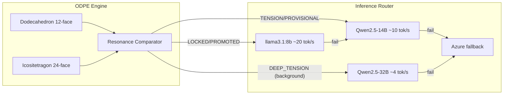

# Three-Tier Sovereign Model Stack: Qwen2.5 Integration

This updates the existing [build_all_34_items plan](.cursor/plans/build_all_34_items_aed21205.plan.md) to add Qwen2.5-14B and Qwen2.5-32B alongside the existing llama3.1:8b on Hetzner.

## Hardware Reality (Hetzner CAX41)

- **CPU:** 16 ARM Ampere cores
- **RAM:** 32 GB total, ~26.5 GB available (after OS + XTTS-v2)
- **Disk:** 320 GB NVMe (~268 GB free after current models)
- **Current models:** llama3.1:8b-instruct-q4_K_M (4.9 GB disk, ~7 GB loaded)

Model memory footprint (Ollama Q4_K_M quantization):

- llama3.1:8b -- ~7 GB loaded, ~4.9 GB disk
- Qwen2.5-14B -- ~11 GB loaded, ~9 GB disk
- Qwen2.5-32B -- ~23.5 GB loaded, ~20 GB disk

Only certain pairs fit simultaneously in 26.5 GB available RAM:

- 8B + 14B = ~18 GB -- fits comfortably (default real-time pair)
- 32B alone = ~23.5 GB -- fits (background-only mode, 8B/14B unloaded)
- 8B + 32B = ~30 GB -- does NOT fit
- 14B + 32B = ~35 GB -- does NOT fit

## ODPE Signal to Model Routing

ODPE signals from [odpe_engine.py](backend/app/services/odpe_engine.py) drive model selection:


| ODPE Signal  | Model       | Context Budget | Latency | When                                           |
| ------------ | ----------- | -------------- | ------- | ---------------------------------------------- |
| LOCKED       | llama3.1:8b | 350 tokens     | ~1s     | Both topologies agree, simple query            |
| PROMOTED     | llama3.1:8b | 500 tokens     | ~1.2s   | Dodecahedron dominates, moderate complexity    |
| TENSION      | Qwen2.5-14B | 700 tokens     | ~2s     | Icositetragon dominates, clinical depth needed |
| PROVISIONAL  | Qwen2.5-14B | 500 tokens     | ~2s     | Ambiguous, err toward quality                  |
| DEEP_TENSION | Qwen2.5-32B | 1000 tokens    | ~10-15s | High icosi amplitude + non-real-time flag      |
| NOISE        | Skip LLM    | 0              | 0       | Neither topology has signal                    |





## Changes per Phase

### Phase 0 Additions

SSH to Hetzner (37.27.244.80) and pull both models:

```bash
ollama pull qwen2.5:14b-instruct-q4_K_M
ollama pull qwen2.5:32b-instruct-q4_K_M
```

Disk impact: +29 GB (9 GB + 20 GB). Remaining free: ~239 GB. No runtime impact until Phase 4 code routes to them.

Set `OLLAMA_NUM_PARALLEL=4` as already planned.

### Phase 2 SDH Additions

The SDH Context Compressor ([sdh_context_compressor.py](backend/app/services/sdh_context_compressor.py)) must produce model-aware context budgets. Add a `target_model` parameter to `compress()`:

- 8B: budget 350-500 tokens, aggressive compression
- 14B: budget 500-700 tokens, moderate compression  
- 32B: budget 700-1000 tokens, minimal compression (maximize reasoning depth)

The SDH Pre-computation Agent should pre-compute for the 8B model by default (fast, always loaded) and speculatively compute 14B contexts for users in active clinical sessions.

### Phase 4 Additions (Major)

#### 1. New ODPE Signal: DEEP_TENSION

In [odpe_engine.py](backend/app/services/odpe_engine.py), add a sixth signal:

```python
class ODPESignal(str, Enum):
    LOCKED = "LOCKED"
    PROMOTED = "PROMOTED"
    TENSION = "TENSION"
    DEEP_TENSION = "DEEP_TENSION"  # NEW
    PROVISIONAL = "PROVISIONAL"
    NOISE = "NOISE"
```

Classification rule in `ResonanceComparator.classify()`:

```python
if ratio <= TENSION_THRESHOLD and icosi_amp > 0.8:
    return ODPESignal.DEEP_TENSION
elif ratio <= TENSION_THRESHOLD and icosi_amp > 0.5:
    return ODPESignal.TENSION
```

Add to `TIER_FOR_SIGNAL`:

```python
TIER_FOR_SIGNAL = {
    ODPESignal.LOCKED: "utility",
    ODPESignal.PROMOTED: "domain_default",
    ODPESignal.TENSION: "clinical",
    ODPESignal.DEEP_TENSION: "deep_clinical",  # NEW
    ODPESignal.PROVISIONAL: "domain_default",
    ODPESignal.NOISE: "skip",
}
```

Update ODPE architecture rule (`odpe-architecture.mdc`) signal table from 5 to 6 states.

#### 2. Multi-Model Routing in Inference Router

In [nate_inference_router.py](backend/app/services/nate_inference_router.py):

Add env vars and model mapping:

```python
_SOVEREIGN_MODEL_FAST = os.getenv("SOVEREIGN_MODEL_FAST", "llama3.1:8b-instruct-q4_K_M")
_SOVEREIGN_MODEL_MID = os.getenv("SOVEREIGN_MODEL_MID", "qwen2.5:14b-instruct-q4_K_M")
_SOVEREIGN_MODEL_DEEP = os.getenv("SOVEREIGN_MODEL_DEEP", "qwen2.5:32b-instruct-q4_K_M")
```

Add ODPE-to-model resolution in `generate()`:

```python
def _resolve_sovereign_model(self, odpe_signal, allow_deep=False):
    if odpe_signal in (ODPESignal.LOCKED, ODPESignal.PROMOTED):
        return _SOVEREIGN_MODEL_FAST
    elif odpe_signal == ODPESignal.DEEP_TENSION and allow_deep:
        return _SOVEREIGN_MODEL_DEEP
    elif odpe_signal in (ODPESignal.TENSION, ODPESignal.PROVISIONAL, ODPESignal.DEEP_TENSION):
        return _SOVEREIGN_MODEL_MID
    else:
        return _SOVEREIGN_MODEL_FAST
```

Modify `_call_sovereign()` to accept `model` parameter instead of always using `_SOVEREIGN_MODEL`.

Add `allow_deep` parameter to `generate()` signature:

```python
async def generate(self, prompt, system="", tier=TIER_ANALYTICAL,
                   temperature=None, max_tokens=1000, domain=None,
                   odpe_signal=None, allow_deep=False) -> Dict[str, Any]:
```

#### 3. `allow_deep` Flag Usage

Real-time therapy chat (bridge `process_interaction`): `allow_deep=False` -- never cold-load the 32B model during conversation.

Background tasks that can tolerate 10-15s latency: `allow_deep=True`:

- Noetic Synthesis Stage 3 (`noetic_synthesis.py`)
- Session summaries (post-session)
- Night School assessment generation
- SDH Pre-computation Agent (speculative deep computation)
- Crystal supersession resolution

#### 4. Model Warm/Cold Management

Ollama auto-manages model loading. But for predictable latency:

- On backend startup, preload 8B + 14B: `ollama run llama3.1:8b-instruct-q4_K_M "warmup" && ollama run qwen2.5:14b-instruct-q4_K_M "warmup"`
- 32B is cold-loaded on demand (~15-25s first load on ARM), then stays loaded for `OLLAMA_KEEP_ALIVE` duration (default 5 min)
- After 32B background task completes, Ollama auto-unloads it after keep-alive, freeing RAM for 8B+14B pair
- Add `OLLAMA_KEEP_ALIVE=5m` to Hetzner systemd unit to control unload timing

#### 5. Wire ODPE Signal Through Full Pipeline

Currently broken chain: `LittleNateInference.generate()` calls `helix_orchestrator.think()` which produces `odpe_result`, but the result is ignored at line 138 of [littlenate_inference.py](backend/app/services/littlenate_inference.py).

Fix:

```python
# After helix_output (line 130ish):
odpe_result = helix_output.odpe_result
odpe_signal = odpe_result.signal if odpe_result else None
recommended_tier = odpe_result.recommended_inference_tier if odpe_result else tier

# At router.generate() call (line 138ish):
router_result = await self._router.generate(
    prompt=final_prompt,
    system=system,
    tier=recommended_tier or tier,
    odpe_signal=odpe_signal,
    allow_deep=(not is_realtime),  # caller passes this
    ...
)
```

### Phase 8 Adjustment

The Twin-Helix distributed architecture item should account for the Qwen2.5 models:

- DigitalOcean secondary node: install Ollama + pull 8B model only (keep it lightweight)
- Hetzner remains the primary with all 3 models
- Load balancing: LOCKED/PROMOTED queries can overflow to DigitalOcean; TENSION/DEEP_TENSION always route to Hetzner (only node with 14B/32B)

### Phase 10 Deploy Additions

Hetzner config step expands to:

1. Pull `qwen2.5:14b-instruct-q4_K_M` (~9 GB, ~5 min download)
2. Pull `qwen2.5:32b-instruct-q4_K_M` (~20 GB, ~10 min download)
3. Set `OLLAMA_NUM_PARALLEL=4` and `OLLAMA_KEEP_ALIVE=5m` in systemd
4. Add env vars to `docker-compose.prod.yml` backend environment block:
  - `SOVEREIGN_MODEL_FAST=llama3.1:8b-instruct-q4_K_M`
  - `SOVEREIGN_MODEL_MID=qwen2.5:14b-instruct-q4_K_M`
  - `SOVEREIGN_MODEL_DEEP=qwen2.5:32b-instruct-q4_K_M`
5. Warm up 8B + 14B after restart

Post-deploy verification adds:

```
Phase 11: Three-tier inference test
  - Send LOCKED-signal query -> verify 8B model used (check router logs)
  - Send TENSION-signal query -> verify 14B model used
  - Send DEEP_TENSION background task -> verify 32B model loaded + used + unloaded after 5min
```

## Updated Impact Summary


| Dimension                  | Before                   | After (with Qwen2.5)                          |
| -------------------------- | ------------------------ | --------------------------------------------- |
| Service health             | 117/125 (8 degraded)     | 140+/140+ (0 degraded)                        |
| ODPE utilization           | 0% (built, ignored)      | 100% end-to-end + model selection             |
| Sovereign models           | 1 (8B)                   | 3 (8B + 14B + 32B)                            |
| Real-time therapy quality  | 8B only (~GPT-3.5 level) | 14B for clinical (~GPT-4o-mini level)         |
| Background task quality    | 8B only                  | 32B (~GPT-4o level)                           |
| Context utilization        | 6% of 128K               | 62% of 128K                                   |
| Concurrent sovereign users | 5-8                      | 35-50 (8B), 15-25 (14B), 3-5 (32B background) |
| Azure dependency (therapy) | 100%                     | 0-5% (emergency fallback only)                |
| Azure cost (1K users)      | $1,500-3,000/mo          | $50-150/mo                                    |
| Trust checks               | 557                      | 600+                                          |
| Hetzner disk usage         | ~5 GB models             | ~34 GB models (of 320 GB)                     |
| ODPE signal states         | 5                        | 6 (adds DEEP_TENSION)                         |


## Qwen2.5 Capability Advantages Over llama3.1:8b

- **Multilingual:** 29 languages vs llama's ~8 (critical for diverse user base)
- **Structured output:** Superior JSON/function calling (better crystal synthesis, Noetic Synthesis)
- **Coding:** Qwen2.5-Coder heritage improves tool use and chain-of-thought
- **Reasoning depth:** 14B matches llama3.1:70b on many benchmarks; 32B approaches GPT-4o
- **Context window:** 128K native (same as llama3.1)

## Files Modified


| File                                                                        | Change                                                                                                    |
| --------------------------------------------------------------------------- | --------------------------------------------------------------------------------------------------------- |
| [odpe_engine.py](backend/app/services/odpe_engine.py)                       | Add DEEP_TENSION signal + classification rule + TIER_FOR_SIGNAL entry                                     |
| [nate_inference_router.py](backend/app/services/nate_inference_router.py)   | Add 3 model env vars, `_resolve_sovereign_model()`, `allow_deep` param, pass model to `_call_sovereign()` |
| [littlenate_inference.py](backend/app/services/littlenate_inference.py)     | Wire `odpe_signal` + `recommended_inference_tier` from helix output to router call                        |
| [sdh_context_compressor.py](backend/app/services/sdh_context_compressor.py) | (New) Add `target_model` param with model-specific budgets                                                |
| [sdh_precompute_agent.py](backend/app/services/sdh_precompute_agent.py)     | (New) Default to 8B pre-compute, speculative 14B for active clinical                                      |
| `.env.template`                                                             | Add SOVEREIGN_MODEL_FAST, SOVEREIGN_MODEL_MID, SOVEREIGN_MODEL_DEEP                                       |
| `docker-compose.prod.yml`                                                   | Add 3 model env vars to backend environment block                                                         |
| `.cursor/rules/odpe-architecture.mdc`                                       | Update signal table from 5 to 6 states, add DEEP_TENSION                                                  |
| `.cursor/rules/sovereign-inference-routing.mdc`                             | Add three-tier model routing documentation                                                                |
| `.cursor/rules/service-health-49-49.mdc`                                    | Note Qwen2.5 model availability in Hetzner section                                                        |


