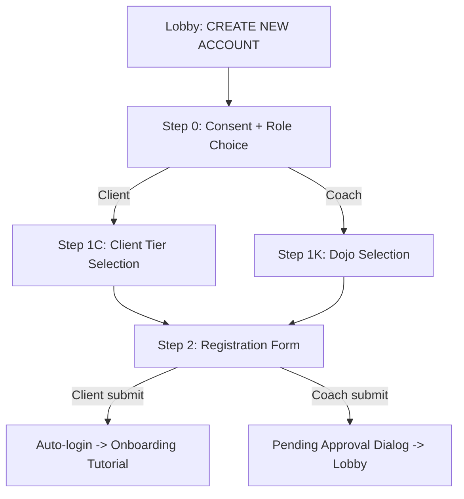

# Registration Flow Redesign

## New Registration Flow




## Step 0: Consent + Role Choice

Merge the existing consent screen with a role selector. After accepting the covenant, the user taps one of two cards:

- **"I'm a Client"** (blue accent) -- "AI companion, therapy, family wellness"
- **"I'm a Coach"** (gold accent) -- "Coach Command, DOJO training, mentoring -- requires approval"

This replaces the current hardcoded `role: "CLIENT"` approach.

## Step 1C: Client Tier Selection

Four tier cards displayed vertically. User taps one to select, then taps "Continue":

- **Coach-Only** -- Free / Scheduling with assigned coach only / No AI access
- **Threshold (Trial)** -- Free / 7 days / Limited AI conversations / Basic tracking
- **Inner Chamber** -- $49/mo / Unlimited AI / Voice mode / Full metrics
- **Sovereign Circle** -- $149/mo / Everything + Avatar Mode + Family Sanctuary + Live coaching

For beta: Show prices but note "Beta: No charge during testing period"

Each card shows a brief feature list and price. Selected card gets a highlight border.

## Step 1K: Coach Dojo Selection

Two-part selection screen:

**Part A -- Pick your dojos** (checkboxes, multi-select):


| Dojo       | Monthly Price |
| ---------- | ------------- |
| CNC        | $150/mo       |
| Therapist  | $175/mo       |
| Teacher    | $225/mo       |
| Project PM | $250/mo       |
| Business   | $325/mo       |
| MCAT       | $500/mo       |


**Part B -- Live price calculation** (updates as dojos are checked):

- Show: number selected, base total, discount %, final price
- Discount tiers: 1 dojo = 0%, 2 = 10%, 3 = 15%, 4 = 20%, 5 = 25%, 6 = 30%
- Anchor: Show crossed-out a la carte total when 2+ dojos selected
- All-Access badge appears when all 6 selected: "ALL-ACCESS BUNDLE -- Save $487.50/mo"

**Always included** (shown as a "Included with every plan" section):

- Clients tab, Schedule, Insights, Briefings, Classroom

For beta: "Beta: No charge during testing period" note below the price

At least 1 dojo must be selected to continue.

## Step 2: Registration Form (existing, with fixes)

Same form as today but with these fixes:

- **AppBar title**: White text -- "NEW CLIENT" or "NEW COACH"
- **All TextFields**: Add `style: const TextStyle(color: Colors.white)` for typed text
- **Theme wrapper**: Add `hintStyle: TextStyle(color: Colors.white38)`, `prefixIconColor: Colors.white54`
- **DOB field**: White text for the date display

## Data Passed to Backend

The `register_request` WebSocket message will include new fields:

```json
{
  "type": "register_request",
  "role": "CLIENT" | "COACH",
  "registration_type": "COACH_ONLY" | "TRIAL" | "STANDARD" | "TOP_TIER",
  "selected_dojos": ["therapist", "cnc", "mcat"],
  "dojo_discount_pct": 15,
  "dojo_monthly_price": 552.50,
  ...existing fields...
}
```

## Backend Changes

### [backend/app/websocket/bridge_server.py](backend/app/websocket/bridge_server.py) -- `register_new_user()` (line ~929)

Update the new_profile creation to handle:

1. **Client tiers**: Use `registration_type` to set `tier` and `subscription_plan`:
  - `COACH_ONLY` -> tier: COACH_ONLY, plan: COACH_ONLY, can_access_nate: false
  - `TRIAL` -> tier: STANDARD, plan: TRIAL, trial_end_date: +7 days
  - `STANDARD` -> tier: STANDARD, plan: STANDARD (Inner Chamber)
  - `TOP_TIER` -> tier: TOP_TIER, plan: TOP_TIER (Sovereign Circle)
2. **Coach dojos**: Store `selected_dojos` list and `dojo_monthly_price` on the coach profile. Add these fields to the coach-specific profile section (after line ~998):
  ```python
   if role == "COACH":
       new_profile["selected_dojos"] = data.get("selected_dojos", [])
       new_profile["dojo_discount_pct"] = data.get("dojo_discount_pct", 0)
       new_profile["dojo_monthly_price"] = data.get("dojo_monthly_price", 0)
  ```
3. **Coach subscription status**: Remains `PENDING_VERIFICATION` (requires admin approval)

### DOJO Access Gating

In the DOJO HTML ([dashboard/night_school_dojo.html](dashboard/night_school_dojo.html)), the mode tabs are already rendered client-side. When the DOJO loads via WebSocket, the coach's `selected_dojos` list is in their profile. Add JS logic in the `init()` function to hide mode tabs not in the coach's `selected_dojos` array (unless all 6 are selected). This only requires a small JS addition -- no backend route changes.

## Frontend Changes

### [mobile/lib/main.dart](mobile/lib/main.dart)

**SignUpWizard refactor** (lines 4611-4876):

- Make `role` parameter optional (default null)
- Change `_step` flow: 0 (consent+role) -> 1 (tier/dojo selection) -> 2 (form)
- Add `_selectedRole`, `_selectedTier`, `_selectedDojos` state variables
- Add `_buildRoleChoice()` -- two cards after consent checkbox
- Add `_buildClientTierSelection()` -- four tier cards
- Add `_buildCoachDojoSelection()` -- six dojo checkboxes with live price calc
- Update `_submitRegistration()` to include new fields in the WebSocket message
- After coach registration success: show approval dialog, return to Lobby (don't auto-login)

**LobbyScreen** (line 4520-4528):

- Change link text to "CREATE NEW ACCOUNT" with white font
- Remove hardcoded `role: "CLIENT"`

## Files to Modify

- [mobile/lib/main.dart](mobile/lib/main.dart) -- SignUpWizard redesign + LobbyScreen link
- [backend/app/websocket/bridge_server.py](backend/app/websocket/bridge_server.py) -- register_new_user() dojo/tier fields
- [dashboard/night_school_dojo.html](dashboard/night_school_dojo.html) -- JS to gate mode tabs by selected_dojos

## What Does NOT Change

- Onboarding tutorial -- still triggers for new clients after first login
- Admin approval flow for coaches -- existing behavior preserved
- Backend authentication -- no changes
- Existing user profiles -- backward compatible (missing fields default to full access)

