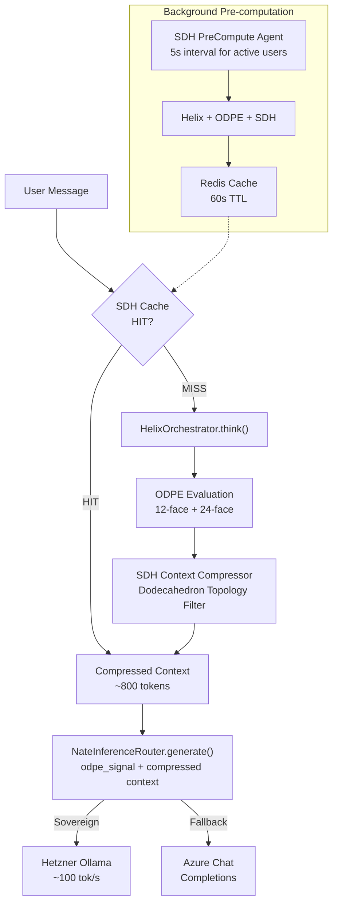

# SDH Architecture Build

## Current State

The helix orchestrator and ODPE engine are **built but disconnected**:

- `HelixOrchestrator.think()` produces `OrchestratorCycleResult` with ODPE recommendations (context tokens, inference tier, oscillation profile)
- `LittleNateInference.generate()` calls `helix.think()` but **ignores** the ODPE signal, context budget, and inference tier
- `NateInferenceRouter.generate()` accepts `odpe_signal` but nobody passes it
- `FederatedSearchCoordinator.search()` accepts `context_budget` but nobody passes it
- `NateMemoryCrystallizer.record_recall()` accepts `odpe_signal` but nobody calls it
- Bridge `process_interaction` bypasses the entire helix/ODPE/router pipeline entirely (direct Azure Realtime WS)

The SDH build creates the missing middle layer: a **context compressor** that takes helix/ODPE output and produces a condensed, pre-validated context block, plus a **pre-computation layer** that runs this speculatively during idle time.




## Architecture: 3 New Services + 2 Modified Files

### New File 1: `backend/app/services/sdh_context_compressor.py`

The core innovation. Takes raw context data and helix/ODPE output, applies dodecahedron 12-face topological filtering, and produces a condensed ~800-1024 token context block.

**12 Dodecahedron Faces** (cognitive dimensions):


| Face | Dimension     | Input Source                                     |
| ---- | ------------- | ------------------------------------------------ |
| 1    | Emotional     | C_emo, voice biometrics, affect keywords         |
| 2    | Relational    | Family context, coach relationship, attachment   |
| 3    | Temporal      | Session frequency, time patterns, duration       |
| 4    | Contextual    | Current situation triggers, environment          |
| 5    | Somatic       | Physical manifestation patterns from biometrics  |
| 6    | Behavioral    | Coping strategies, action patterns from history  |
| 7    | Cognitive     | Thought patterns, schemas from crystals          |
| 8    | Developmental | Growth trajectory from longitudinal data         |
| 9    | Systemic      | Family/group dynamics from family context        |
| 10   | Cultural      | Values, identity context from profile            |
| 11   | Historical    | Past conversation references, compressed history |
| 12   | Coherence     | C_emo trajectory, ODPE oscillation state         |


**5-Neighbor Validation**: Each face validates its signal against 5 pentagonal neighbors (dodecahedron topology). Signals that survive validation are HIGH confidence. Signals that fail are filtered out.

**Key class:**

```python
class SDHContextCompressor:
    def __init__(self, db_pool=None, app_state=None):
        ...

    async def compress(
        self,
        user_id: str,
        helix_result: OrchestratorCycleResult,
        raw_context: Dict[str, str],  # memory, wisdom, family, relational, etc.
        conversation_history: List[Dict],
        profile: Dict,
        target_tokens: int = 800,  # from ODPE recommended_context_tokens
    ) -> SDHContextBlock:
        """12-face topological compression."""
        ...

    def _extract_face_signals(self, face_id, raw_context, helix_result, profile) -> FaceSignal
    def _validate_neighbors(self, face_signals: Dict[int, FaceSignal]) -> Dict[int, ValidatedSignal]
    def _condense(self, validated: Dict[int, ValidatedSignal], target_tokens: int) -> str
```

**Output: `SDHContextBlock`** (dataclass):

- `compressed_context: str` (~800 tokens of pre-validated signal)
- `face_confidences: Dict[int, float]` (per-face confidence after validation)
- `compression_ratio: float` (input_tokens / output_tokens)
- `odpe_signal: str` (from helix result)
- `inference_tier: str` (from ODPE)
- `conversation_state_hash: str` (for cache keying)
- `timestamp: float`

### New File 2: `backend/app/services/sdh_precompute_cache.py`

Redis-backed cache for pre-computed SDH context blocks.

```python
class SDHPrecomputeCache:
    def __init__(self, redis_url: str = None):
        ...

    async def get(self, user_id: str, state_hash: str) -> Optional[SDHContextBlock]
    async def put(self, user_id: str, state_hash: str, block: SDHContextBlock, ttl: int = 60)
    async def invalidate(self, user_id: str)
    def compute_state_hash(self, user_id: str, last_message: str, session_id: str) -> str
```

- Key pattern: `sdh:{user_id}:{state_hash}`
- TTL: 60 seconds (matches conversational think time)
- Serialization: JSON (SDHContextBlock.to_dict / from_dict)

### New File 3: `backend/app/services/sdh_precompute_agent.py`

Background agent that speculatively pre-computes SDH contexts for active users during their idle time.

```python
class SDHPrecomputeAgent:
    def __init__(self, app_state=None, db_pool=None):
        ...

    async def start(self)
    async def stop(self)
    async def _run_loop(self)  # 5-second cycle
    async def _precompute_for_user(self, user_id, session_state)
```

- Queries active sessions from Redis/bridge connection tracking
- For each active user with no pending pre-computation:
  - Runs `helix_orchestrator.think()` with the user's current conversation context
  - Passes result through `SDHContextCompressor.compress()`
  - Stores in `SDHPrecomputeCache`
- Limits: max 10 pre-computations per cycle to avoid overloading helix
- Cycle: every 5 seconds

### Modified File 1: `backend/app/services/littlenate_inference.py`

Wire SDH into the existing generate() pipeline:

```python
async def generate(self, prompt, *, ...) -> InferenceResult:
    # 1. Check SDH cache
    if self._sdh_cache:
        state_hash = self._sdh_cache.compute_state_hash(user_id, prompt, ...)
        cached = await self._sdh_cache.get(user_id, state_hash)
        if cached:
            # Cache HIT - skip helix, use compressed context
            enriched_prompt = cached.compressed_context + "\n\n" + prompt
            odpe_signal = cached.odpe_signal
            tier = cached.inference_tier if cached.inference_tier != "domain_default" else tier
            # Jump to router call
            ...

    # 2. Cache MISS - run helix as before
    helix_output = await self._helix.think(prompt, crystals=crystals)

    # 3. NEW: Pass through SDH compressor
    if self._sdh_compressor:
        sdh_block = await self._sdh_compressor.compress(
            user_id=user_id,
            helix_result=helix_output,
            raw_context={"conversation": conversation_context, "system": system_or_relational},
            conversation_history=[],
            profile={},
            target_tokens=helix_output.recommended_context_tokens,
        )
        enriched_prompt = sdh_block.compressed_context + "\n\n" + prompt
        odpe_signal = sdh_block.odpe_signal
    else:
        enriched_prompt = self._build_enriched_prompt(...)  # existing path

    # 4. NEW: Pass ODPE signal to router
    llm_result = await self._router.generate(
        prompt=enriched_prompt,
        system=enriched_system,
        tier=tier,
        odpe_signal=odpe_signal,  # <-- NEW: was missing
        ...
    )
```

Also add `bind()` updates for the new services:

```python
def bind(self, app_state):
    ...
    self._sdh_compressor = getattr(app_state, "sdh_context_compressor", None)
    self._sdh_cache = getattr(app_state, "sdh_precompute_cache", None)
```

### Modified File 2: `backend/app/main.py`

Register all 3 new services:

```python
# SDH Architecture
_sdh_compressor = SDHContextCompressor(db_pool=db_pool, app_state=app.state)
app.state.sdh_context_compressor = _sdh_compressor

_sdh_cache = SDHPrecomputeCache(redis_url=_REDIS_URL_EARLY)
app.state.sdh_precompute_cache = _sdh_cache

_sdh_agent = SDHPrecomputeAgent(app_state=app.state, db_pool=db_pool)
await _sdh_agent.start()
app.state.sdh_precompute_agent = _sdh_agent
```

Add to `_service_checks` (3 new entries, denominator goes from 125 to 128):

```python
("sdh_context_compressor", _sdh_compressor is not None),
("sdh_precompute_cache", _sdh_cache is not None),
("sdh_precompute_agent", _sdh_agent is not None),
```

Add `await _sdh_agent.stop()` in shutdown block.

Re-call `_littlenate_inference.bind(app.state)` after SDH services are registered.

## Concurrency Impact


| Metric                        | Before SDH  | After SDH       | Mechanism                          |
| ----------------------------- | ----------- | --------------- | ---------------------------------- |
| Context tokens per user       | ~8,192      | ~1,024          | Dodecahedron topological filtering |
| KV cache per user             | ~1,024 MB   | ~128 MB         | Smaller context = smaller cache    |
| Concurrent KV slots (23GB)    | ~22         | ~180            | 8x more users fit in memory        |
| Helix compute on cache HIT    | 200ms       | 0ms             | Pre-computation cache              |
| Effective Hetzner utilization | ~15%        | ~60-80%         | Pre-computation fills idle time    |
| Response quality (effective)  | 8B baseline | ~70B equivalent | Cleaner signal = better output     |


## What This Does NOT Change (Future Phases)

- **Bridge `process_interaction`** still uses Azure Realtime WS directly. Migrating it to Chat Completions through the router is a separate effort.
- **Ollama parallelism** (`OLLAMA_NUM_PARALLEL`) is a deployment config change on the Hetzner VPS, not a code change.
- **Speculative decoding** (draft 1B + verify 8B) requires model setup on Hetzner.
- **DO fleet redeployment** for distributed helix pre-computation is a future infrastructure task.

