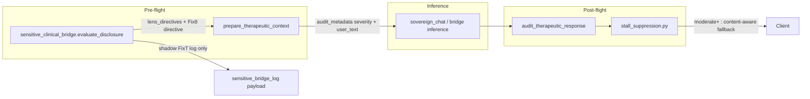

# Sensitive Bridge Turn-Handling Fixes

## Grep-confirmed root causes

| Fix | Source (verified) | Emission path |
|-----|-------------------|---------------|
| **5** | Hardcoded `TRANSPARENT_AUDIT_FALLBACK_MESSAGE` in [`backend/app/services/therapeutic_controller.py`](backend/app/services/therapeutic_controller.py) L319–322 | Post-flight `audit_therapeutic_response()` L1058–1059 when `_audit_violations` fails after optional LLM retry — **not** LLM habit |
| **8** | No dose-change detector today; med names exist in [`backend/app/services/little_nate_clinical_runtime_gate.py`](backend/app/services/little_nate_clinical_runtime_gate.py) (`medications_in_text()`, `CANONICAL_MEDICATION_NAMES` incl. seroquel/quetiapine) | Prompt assembly in [`backend/app/services/sensitive_clinical_bridge.py`](backend/app/services/sensitive_clinical_bridge.py) via `lens_directives_block` (~L2144–2162) |
| **T** | Live handoff: `_build_handoff_if_needed()` (~L1569–1633) + `_classify_trafficking()` (~L1002–1049); eval audit logs `trafficking_label` in `disclosure_evaluated` (~L2299–2310). Prior `.label` vs `.classification` bug is documented/fixed in `_classify_trafficking` comments but FPs persist via raw-classifier branch (L1630–1631) and abuse-vocabulary conflation | Shadow only — **no live handoff changes** in this work |

### Data-source reality (verified — gap fix 1)

The local exports are **not** a complete source for acceptance cases. Verified by grep over `data/`:
- `longra` → **0 matches** anywhere in `data/` (Fix 8 evidence absent locally)
- `Seroquel`, `trafficking`, `Lana`, "grandfather's bed", "never cause my family" → **0 matches**
- `2026-06-14/15/16` → **0 matches**; Fix T criticals (06-13, 06-16 turns 121–122) are not local
- [`data/pilot_turns_full_post_e.tsv`](data/pilot_turns_full_post_e.tsv) is effectively **LetsGoLisa only, through ~06-13**

Also (gap fix 2): TSV cells contain **embedded newlines** (AI replies span multiple lines), so naive line-by-line parsing corrupts rows. `^username\|` matches 0 lines.

**Consequence:** the replay harness must source Fix 8 / Fix T cases from production `conversation_history` via `DATABASE_URL` (the [`run_magicguy72_sensitive_bridge_replay.py`](backend/scripts/run_magicguy72_sensitive_bridge_replay.py) pattern, L95/L138) **or** from hardcoded synthetic strings transcribed from the BUILD_SPEC. Only Lisa stall rows are reliably available locally.

Available-locally evidence:
- Lisa CSA disclosure: line 4109 (`2026-06-11 03:38`) — AI text is exact stall string (Fix 5)
- Lisa low-acuity control: line 4068 (`2026-06-09 02:01`) — non-over-fire case (Fix 5)

PG-or-synthetic evidence (NOT local):
- longra med turns 40–42 (Fix 8) — hardcode verbatim from BUILD_SPEC or PG export
- Lisa trafficking criticals 06-13 / 06-16 turns 121–122 (Fix T) — PG query or hardcode from BUILD_SPEC



---

## Commit 1 — Feature flags (default false)

Mirror [`backend/app/services/little_nate_arc_memory.py`](backend/app/services/little_nate_arc_memory.py) pattern:

| Flag | Module constant |
|------|-----------------|
| `ENABLE_STALL_SUPPRESSION` | `stall_suppression.py` |
| `ENABLE_MED_ADJUST_REDIRECT` | `med_adjustment_redirect.py` |
| `ENABLE_TRAFFICKING_RECAL` | `trafficking_recalibration.py` |

Add to:
- [`.env.template`](.env.template) — three lines, all `false`
- [`docker-compose.prod.yml`](docker-compose.prod.yml) bridge `environment:` block — `${VAR:-false}` entries adjacent to `ENABLE_ARC_MEMORY`

---

## Commit 2 — Fix 5: Stall suppression

### New module: [`backend/app/services/stall_suppression.py`](backend/app/services/stall_suppression.py)

- `ENABLE_STALL_SUPPRESSION` bool from env
- `HIGH_ACUITY_SEVERITIES = frozenset({"moderate", "high", "critical", "emergency"})` — matches migration 202 `event_severity` enum
- `is_stall_fallback(text) -> bool` — exact match to `TRANSPARENT_AUDIT_FALLBACK_MESSAGE`
- `build_content_aware_fallback(user_text: str) -> str` — heuristic only (no LLM): extract 1–2 salient phrases from user message (proper nouns, quoted trauma markers, first long clause), acknowledge them, optional single focused question; **never** emit the banned stall string
- `resolve_audit_fallback(*, user_text, bridge_event_severity, default_fallback) -> str` — if flag off or severity not high → `default_fallback`; else content-aware + `print(">>> [STALL] suppressed turn_acuity=...")` and `print(">>> [STALL] emitted content_aware_fallback=...")` (negative path: `>>> [STALL] not_applied reason=...`)

### Metadata plumbing (minimal protected-file touch)

**In [`sensitive_clinical_bridge.py`](backend/app/services/sensitive_clinical_bridge.py)** (not protected): before `_emit_audit_event`, add `"event_severity": <computed>` into `audit_event` dict so downstream can read severity without recomputing.

**In [`therapeutic_controller.py`](backend/app/services/therapeutic_controller.py)** (~≤8 lines, tagged `# QUANTUM-CRYSTAL-ARCH`):
- After `_apply_sensitive_bridge_decision`, capture `_bridge_severity = (_bd.audit_event or {}).get("event_severity") if _bd else None`
- Extend `audit_metadata` with `"bridge_event_severity": _bridge_severity or "info"` and `"user_text_for_audit": (user_text or "")[:2000]`

**In `audit_therapeutic_response()`** (~≤5 lines):
- Replace unconditional `final_text = TRANSPARENT_AUDIT_FALLBACK_MESSAGE` with call to `stall_suppression.resolve_audit_fallback(...)`

### Tests: [`backend/tests/test_stall_suppression.py`](backend/tests/test_stall_suppression.py)

- High acuity + flag on → not equal to stall string; contains substring from synthetic CSA user text
- Low acuity (`info`) + flag on → still allows transparent fallback (Lisa turn 126 / vault-panel class)
- **Regression gate (gap fix 3):** the existing C1–C3 assertions in [`backend/tests/test_therapeutic_audit_c1_c3.py`](backend/tests/test_therapeutic_audit_c1_c3.py) must still pass unchanged with the flag **off** — suppression must be a pure no-op when `ENABLE_STALL_SUPPRESSION=false` (default). Add: (a) explicit flag-off case asserting the stall string is still emitted verbatim for non-high-acuity audit failures; (b) flag-on case with `bridge_event_severity=moderate` asserting the stall string is NOT emitted. Both run in the same file so CI proves no behavior change in the default path.

### Acceptance replay targets

- Lisa user text from TSV row 4109 (CSA crawling under bed) — local
- longra turn 23 user text — **not local** (gap fix 1): hardcode from BUILD_SPEC ("never cause my family pain again") or PG fetch in harness

---

## Commit 3 — Fix 8: Med-adjustment redirect

### New module: [`backend/app/services/med_adjustment_redirect.py`](backend/app/services/med_adjustment_redirect.py)

- Import/reuse `medications_in_text()` from `little_nate_clinical_runtime_gate` (do not duplicate med list)
- High-precision detector (all required):
  1. ≥1 med name from lexicon
  2. Dose signal: `\d+\s*(?:mg|mcg|g|ml|milligram)` or number adjacent to med name
  3. Change verb: `increase|raise|up|bump|cut|lower|reduce|double|skip|stop|wean|titrat` (case-insensitive)
- Target: `other` if third-person possessive near med (`her/his/their ... seroquel`, `Lana's dose`); else `self`
- `build_redirect_directive(match) -> str` — prescriber redirect; **hard-stop for `other`**: do not validate/co-plan dose; for `self`: redirect without co-planning
- `detect_and_log(message) -> Optional[MedAdjustMatch]` — prints `>>> [MED_REDIRECT] target=... med=...` or `>>> [MED_REDIRECT] not_applied reason=...`

### Wire in [`sensitive_clinical_bridge.py`](backend/app/services/sensitive_clinical_bridge.py) only

After `lens_directives_block` assembly (~L2162), when `ENABLE_MED_ADJUST_REDIRECT`:

```python
_med = med_adjustment_redirect.detect_and_log(message)
if _med:
    _lens_block_parts.append(med_adjustment_redirect.build_redirect_directive(_med))
    lens_directives_block = "\n\n".join(_lens_block_parts)
```

Also append to `audit_event`: `med_adjust_redirect_fired`, `med_adjust_target`, `med_adjust_med` (additive JSON fields — no migration).

### Tests: [`backend/tests/test_med_adjustment_redirect.py`](backend/tests/test_med_adjustment_redirect.py)

- longra turn 42 synthetic: "raise her Seroquel from 50mg to 75mg" → match, `target=other`
- Self: "double my Zoloft to 100mg" → `target=self`
- Negative: "she takes Seroquel at night" → no match
- Negative: "Seroquel helps her sleep" → no match

---

## Commit 4 — Fix T: Trafficking recalibration (shadow only)

### New module: [`backend/app/services/trafficking_recalibration.py`](backend/app/services/trafficking_recalibration.py)

Shadow classifier **parallel** to live logic; never mutates `handoff_payload`, `coach_alert`, or `_build_handoff_if_needed` return values.

**Rules (from spec):**

1. **Construct separation** — Down-rank / exclude when message matches historical-trauma-only signals without exploitation markers:
   - IFS part names (`silencer`, `exile`, `manager`, capitalized multi-word parts)
   - Historical CSA language without present-tense control/exploitation (`when I was`, `as a child`, `grandfather`, `remembered`)
   - Grand-jury / witness / theological framing without commercial exploitation
   - Require positive trafficking indicators (reuse patterns from [`trafficking_disclosure_classifier.py`](backend/app/services/trafficking_disclosure_classifier.py) CLASS_* or [`mandatory_reporting.py`](backend/app/services/governance/mandatory_reporting.py) TRAFFICKING list) for shadow tier `trafficking_disclosure`

2. **Eval authoritative** — If live eval `trafficking_label` is `no_disclosure` / `unclassified`, shadow tier must **not** be `trafficking_disclosure` (fixes eval/handoff contradiction on Lisa 2026-06-13)

3. **Acuity lag fix (shadow score only)** — `compute_sexual_trauma_acuity(message) -> float` using disclosure-weighted lexicon (first-person past abuse disclosure > theological follow-up). Log `shadow_acuity_score` per turn; acceptance: turn 121 score > turn 122 on paired Lisa messages from spec

4. **Recall guard** — Synthetic mandatory test: message with commercial exploitation + document control + present tense (`sells me`, `took my passport`, `can't leave`) → shadow **still** `trafficking_disclosure`

**Logging (gap fix 4 — decision locked, no new event_type):**
- Stdout: `>>> [TRAFFICKING_SHADOW] live=<tier|none> shadow=<tier|none> agree=<bool> turn=<session_or_id>`
- Persist: **append** shadow fields onto the existing `disclosure_evaluated` `payload_json` only (`trafficking_shadow_tier`, `trafficking_shadow_agree`, `trafficking_shadow_acuity`, `trafficking_shadow_reason`). This is locked because [`backend/migrations/202_sensitive_clinical_bridge_core.sql`](backend/migrations/202_sensitive_clinical_bridge_core.sql) puts a `CHECK` constraint on `sensitive_bridge_log.event_type`; a new `trafficking_shadow_evaluated` row would be silently rejected by the constraint. **No new `event_type`, no migration** in this work. The shadow data rides inside the already-permitted `disclosure_evaluated` event. (If a dedicated row is required later for live graduation, that is a separate migration following the self-healing CHECK pattern and is out of scope here.)

### Hook in [`sensitive_clinical_bridge.py`](backend/app/services/sensitive_clinical_bridge.py)

After live handoff tier resolved (~post L2193), call `trafficking_recalibration.run_shadow(...)` when flag enabled; pass `live_tier`, `trafficking_label`, `message`, `session_id`, optional turn id.

**Explicit guard:** wrap shadow call in `if ENABLE_TRAFFICKING_RECAL:` — never read this flag in `_build_handoff_if_needed`.

### Tests: [`backend/tests/test_trafficking_recalibration_shadow.py`](backend/tests/test_trafficking_recalibration_shadow.py)

- Lisa IFS parts message (Silencer) + eval `no_disclosure` → shadow no fire, agree=true
- Lisa theology turn 122 vs trauma turn 121 → acuity 121 > 122
- Synthetic genuine trafficking → shadow fires
- Assert no mutation: mock `_build_handoff_if_needed` inputs unchanged when shadow runs

---

## Commit 5 — Replay harness

### New script: [`backend/scripts/run_pilot_turn_fix_replay.py`](backend/scripts/run_pilot_turn_fix_replay.py)

Pattern after [`backend/scripts/run_magicguy72_sensitive_bridge_replay.py`](backend/scripts/run_magicguy72_sensitive_bridge_replay.py):

- Sets flags via env for each fix section
- **Fix 5 block:** run `prepare_therapeutic_context` + force audit failure path (inject violating response) → assert no stall string on high-acuity rows
- **Fix 8 block:** run `evaluate_disclosure` (or directive helper only) on acceptance user texts
- **Fix T block:** run shadow only; print shadow log lines; assert live handoff tier unchanged vs baseline run with flag off

### Case sourcing (gap fixes 1 + 2)

Acceptance cases are NOT all in local files. Use a single `CASES` list where each case carries an explicit `source` of `local_tsv | pg | synthetic`:

| Case | Fix | Source |
|------|-----|--------|
| Lisa 4109 (CSA stall) | 5 | `local_tsv` |
| Lisa 4068 (low-acuity control) | 5 | `local_tsv` |
| longra 23 ("never cause my family pain") | 5 | `synthetic` (verbatim from BUILD_SPEC) or `pg` |
| longra 42 ("raise her Seroquel 50→75mg") | 8 | `synthetic` or `pg` |
| self-dosing ("double my Zoloft to 100mg") | 8 | `synthetic` |
| benign mention ("Seroquel helps her sleep") | 8 | `synthetic` |
| Lisa 06-13 IFS / 06-16 turns 121–122 | T | `pg` or `synthetic` from BUILD_SPEC |
| genuine trafficking positive | T | `synthetic` (mandatory recall guard) |

- **TSV reader must handle embedded newlines (gap fix 2):** parse with `csv.reader(f, delimiter="\t")` (or pandas), never `line.split("\t")` on raw `readlines()`. Reject the run with a clear error if a `local_tsv` case row is not found.
- **PG path:** when `DATABASE_URL` set, `SELECT user_text, ai_text, created_at FROM conversation_history WHERE user_id IN ('LetsGoLisa','longra') AND created_at BETWEEN ... ` to hydrate `pg` cases; if `DATABASE_URL` unset, fall back to the `synthetic` verbatim string baked from BUILD_SPEC so the harness still runs offline.
- Every `synthetic` string is transcribed verbatim from the BUILD_SPEC and commented with its origin.

Exit non-zero if any acceptance assertion fails, or if a required case could not be sourced (no silent skips).

---

## Protected-file and trust constraints

- **Do not expand** the Phase 4 wiring seam comment block (L739–798) — already fails `phase4_wiring_diff_under_15_lines` (37 substantive lines). All new bridge logic stays in service modules; only metadata + audit fallback hooks touch `therapeutic_controller.py`.
- **Do not flip** `ENABLE_TRAFFICKING_RECAL` live; document in script header and `.env.template` comment.
- **Deploy path:** commit → push → GREEN `git pull` + `safe_deploy.sh bridge` (bridge owns TTC + SCB hot path).
- Fix T live graduation is **out of scope** — gated on T1–T3 (26 skipped auditor checks, CoachN labeling ~50 turns, clinical sign-off).

---

## Verification checklist (post-implementation)

1. `pytest backend/tests/test_stall_suppression.py backend/tests/test_med_adjustment_redirect.py backend/tests/test_trafficking_recalibration_shadow.py backend/tests/test_therapeutic_audit_c1_c3.py -v`
2. `python backend/scripts/run_pilot_turn_fix_replay.py` with flags staged one at a time
3. Grep logs for `>>> [STALL]`, `>>> [MED_REDIRECT]`, `>>> [TRAFFICKING_SHADOW]` on replay
4. Confirm `ENABLE_TRAFFICKING_RECAL=false` in compose template; shadow run produces no live handoff delta vs baseline
