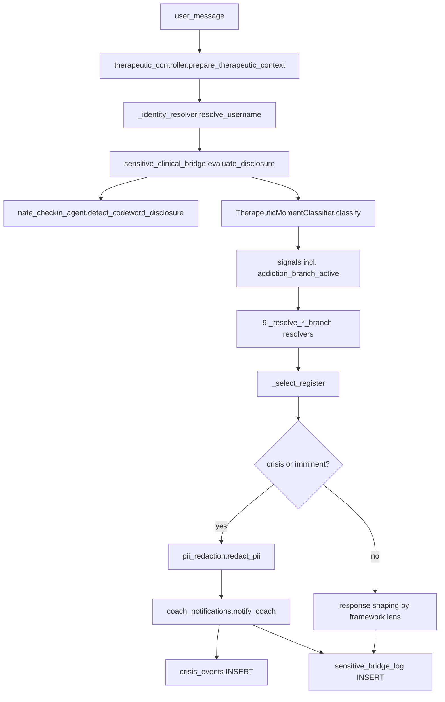

# Sensitive Bridge v1.4 — Addiction Architecture + Part-Aware Codewords

Comprehensive implementation plan for [V1_4_ADDICTION_ARCHITECTURE_SPEC_v0.2.md](/Users/nathannevedal/Downloads/V1_4_ADDICTION_ARCHITECTURE_SPEC_v0.2.md). Extends v1.3 ([sensitive_clinical_bridge_cca8623c](.cursor/plans/sensitive_clinical_bridge_cca8623c.plan.md)). All work canonicalized on `users.username` (Priority 1 lesson). Master switch `app_settings.sensitive_bridge_master_enabled` stays FALSE through Phase D.

## Spec → Repo Deltas (decided up-front, not blocking)

- Migration number is **`217_v1_4_addiction_architecture.sql`**, not `215`. Repo already has 212–216.
- `coach_notifications.notify_coach()` real signature is `(pool, coach_username, notification: Dict)` ([backend/app/services/coach_notifications.py](backend/app/services/coach_notifications.py) L16-24). Spec §12.1 kwargs example will be adapted to: `await notify_coach(db_pool, assigned_coach, {"urgency": ..., "subject": ..., "message": ..., "channels": [...], "payload": {...}})`.
- `nate_checkin_agent.detect_codeword_disclosure(message, username)` **does not yet exist** — only `check_codeword`. Phase C adds the new method returning a `CodewordDisclosureEvent` with `(matched_codeword_id, disclosure_type, part_name, part_number, part_category, addiction_link)`.
- `EmailService` lives in [backend/app/services/notifications_service.py](backend/app/services/notifications_service.py) (not `email_service.py`). Phase A adds `send_crisis_alert(to_email, client_name, alert_type, details)` matching the broken caller in [bridge_server.py L28360](backend/app/websocket/bridge_server.py) and [sanctuary_handlers.py L465](backend/app/websocket/sanctuary_handlers.py).
- `coach_notifications.notify_coach()` does **not** return inserted `coach_escalation_notifications.id` today; Phase B will extend the return dict to include `id` so the `sensitive_bridge_log` cross-reference (spec §12.4) works without a second query.

## Resolved Gaps (Review Pass 2)

Each numbered gap below is resolved inline with concrete spec, OR explicitly deferred with the named phase that must resolve it before proceeding. Subsequent phase descriptions reference these resolutions rather than re-stating them.

### Gap 1 — Cross-addiction response semantics: AUGMENT, not suppress

When `_resolve_cross_addiction_branch` returns `branched=True`, the orchestrator does NOT replace individual branch responses. It fires individual branches normally AND attaches a single **cross-addiction overlay directive** to the response generator: `"Multiple addictions active ({primary}, {secondary}). Watch for transfer pattern; pace toward integration not eradication; do not name secondary addiction unless client raises it."` Lexicons from each active branch still apply. Telemetry records `cross_addiction_overlay_applied=true` plus the branch list in `sensitive_bridge_log`. Implementation: helper `_compose_cross_addiction_overlay(active_branches: list[str], primary: str, secondary: str) -> str` in [sensitive_clinical_bridge.py](backend/app/services/sensitive_clinical_bridge.py).

### Gap 2 — DST lens behavior: three concrete changes, not a flag

`_dst_lens_active(...) -> bool` is the gate. When True, new helper `_apply_dst_lens(directive: dict) -> dict` mutates the response directive with three behavior changes:

1. **System prompt augmentation**: appends DST directive block: `"Apply DST awareness: assume dissociation may be present. Prefer questions that name parts ('which part of you is...?') over questions that assume a unified self. Pace slowly."`
2. **Pacing modifier**: raises `grounding_offer_threshold` (existing response-shaper knob) by `+0.15`; reduces `escalation_step_size` by `25%`.
3. **Audit field**: `lens_dst=true` recorded in `sensitive_bridge_log` for monitoring lens activation rate.

Both helpers added to [sensitive_clinical_bridge.py](backend/app/services/sensitive_clinical_bridge.py). Phase B `phase-b-dst-gate` todo expands to include behavior-mutation work, not only the boolean gate.

### Gap 3 — Framework lens composition: cap-at-two, primary structures + secondary supplements

`_select_framework_lens(...) -> list[str]` returns the ordered lens list as before. New companion helper `_compose_lens_directives(lens_list: list[str]) -> str` enforces composition:

- **Cap at 2 lenses** for prompt composition (extra lenses recorded in audit but excluded from prompt).
- **Primary lens** (`lens_list[0]`): drives full prompt structure — full system-instruction template for that lens.
- **Secondary lens** (`lens_list[1]`): contributes ONE supplementary directive — single sentence appended to system instructions (e.g. `"Also apply IFS framing: invite the part to speak rather than confronting it directly."`).
- All selected lenses are recorded in `sensitive_bridge_log.framework_lens_selected` regardless of cap.

### Gap 4 — Crystal Factory Layers 2 and 3: split phase, defer Layer 3

- **Layer 1** (per-client lexicon augmentation from `nate_intelligence_crystals`): Phase B (existing todo `phase-b-crystal-layer1`).
- **Layer 2** (response pattern crystals — top-3-by-`recall_count` clinical crystals scoped `response_pattern` injected by `_compose_lens_directives`): NEW **Phase B.5** sub-phase, blocks Phase C. Adds helper `_load_response_pattern_crystals(username, lens_primary) -> list[str]`.
- **Layer 3** (per-client clinical knowledge graph linking parts ↔ trigger_dates ↔ codewords ↔ active addictions): **DEFERRED to Phase G (post-GA)**. Default OFF, opt-in via existing `crystal_knowledge_graph_enabled` toggle in framework menu. Phase G scope (out of v1.4 GA): graph schema migration, traversal API, opt-in enforcement, telemetry, lexicon-loader integration.

### Gap 5 — Trafficking is NOT addiction; relocate lexicons + clarify detection path

- **Lexicon location**: lexicons move from `backend/data/lexicons/addiction/trafficking/` to **`backend/data/lexicons/polyvictimization/trafficking/`**. Phase A directory tree adjusted accordingly.
- **Detection path**: trafficking codeword disclosure type (`trafficking_imminent_danger`, `trafficking_historical`, etc.) → `nate_checkin_agent.detect_codeword_disclosure` → `evaluate_disclosure` step 2 → `_select_register` precedence elevates to `trafficking_imminent_danger` source → crisis-tier warm referral (hotline `1-888-373-7888` per spec §11.2) → polyvictim layer logged.
- **No `_resolve_trafficking_branch`**: trafficking is NOT a TMC branch. The 9 resolvers stay: 8 individual addictions + 1 cross-addiction.
- [v1_4_addiction_taxonomy.mdc](.cursor/rules/v1_4_addiction_taxonomy.mdc) explicitly states "trafficking is polyvictimization, detected via codeword only — never add a `_resolve_trafficking_branch`."

### Gap 6 — `_emit_addiction_alert` lives in dedicated dispatcher module

New module **[backend/app/services/sensitive_alert_dispatcher.py](backend/app/services/sensitive_alert_dispatcher.py)**. Single canonical entry point for all v1.4 alert dispatch:

- `emit_addiction_alert(pool, *, urgency, client_username, ...)`
- `emit_trafficking_alert(pool, *, ...)`
- `emit_codeword_disclosure_alert(pool, *, ...)`

Imports `pii_redaction`, `coach_notifications`, `crisis_events_writer`. Orchestrator [sensitive_clinical_bridge.py](backend/app/services/sensitive_clinical_bridge.py) imports ONLY this dispatcher — never the three downstream modules directly. Codified by [v1_4_alert_integration_discipline.mdc](.cursor/rules/v1_4_alert_integration_discipline.mdc): "Sensitive Bridge alert paths import only `sensitive_alert_dispatcher`. Direct calls to `notify_coach`/`crisis_events_writer`/`pii_redaction` from the orchestrator are forbidden."

### Gap 7 — Phase A acceptance: identity-grep check (zero `hardware_id` in v1.4 paths)

Phase A acceptance gains an explicit zero-`hardware_id` check on every v1.4-touched code path:

```bash
rg -n "hardware_id" \
  backend/app/services/sensitive_clinical_bridge.py \
  backend/app/services/pii_redaction.py \
  backend/app/services/crisis_events_writer.py \
  backend/app/services/sensitive_alert_dispatcher.py \
  backend/app/services/lexicon_loader.py \
  backend/app/sse/ucd/tmc.py \
  backend/app/routers/sensitive_profile_api.py \
  backend/migrations/217_v1_4_addiction_architecture.sql
```

Must return ZERO matches in newly-added v1.4 lines (pre-existing lines may surface but must be reviewed and confirmed not load-bearing for v1.4). Boundary resolution (chat path → username via `_identity_resolver.resolve_username`) remains the only place hardware_id is consumed, and that's outside the v1.4-touched files above.

### Gap 8 — Phase E master-switch flip ordering (gate-by-gate)

Master switch is global; per-user gating is `sensitive_bridge_enrollment.gap_features_enabled` JSONB. Order is mandatory and Phase E enforces:

1. **Audit non-pilot enrollments**: `SELECT username, cohort_label, gap_features_enabled FROM sensitive_bridge_enrollment WHERE cohort_label != 'pilot_5'`. For any row with non-empty `gap_features_enabled`, blank to `'{}'::jsonb` and emit a `gap_features_blanked` audit row in `sensitive_bridge_log`.
2. **Verify orchestrator per-user gating**: confirm `evaluate_disclosure` (or upstream `prepare_therapeutic_context`) reads `gap_features_enabled` for the resolved username and gates each v1.4 branch resolver, codeword listener, and alert path on the corresponding feature flag. **If any v1.4 path bypasses the per-user gate, that gate must be added as a blocking pre-Phase-E commit** — this is a code-path correctness check, not a "ready" sign-off. New blocking todo `phase-e-pre-flight-audit`.
3. **Pilot enablement**: for `pilot_5` cohort users only, set `gap_features_enabled` to the full v1.4 feature set.
4. **Flip master switch**: `UPDATE app_settings SET parameter_value = 'true' WHERE parameter_key = 'sensitive_bridge_master_enabled'`.
5. **24h observation window**: monitor `sensitive_bridge_log` false-positive rate, alert acknowledgment latency, missed-detection audit. No further enablement during the window.

### Gap 9 — Trust auditor check count: enumerated, 34 → 56 (+22)

Sensitive Bridge auditor expands from `34` to **`56`**. Concrete enumeration:

| Check group | Count |
|---|---|
| Status PUT endpoints (substance, sex_addiction, gambling, gaming, food_compulsion, work_compulsion, spending_compulsion, codependency, cross_addiction_profile) | **9** |
| Parts registry endpoints (GET list, POST create, PATCH update, DELETE retire) | **4** |
| Framework menu endpoints (GET, PUT) | **2** |
| Migration 217 schema integrity (4 new tables + ALTER user_safety_codewords + 14-type CHECK constraint) | **4** |
| `crisis_events_writer.write_crisis_event` round-trip smoke (write then SELECT confirms row) | **1** |
| `pii_redaction.redact_pii` smoke (synthetic payload; assert names/phones/emails redacted, hotline preserved) | **1** |
| `nate_checkin_agent.detect_codeword_disclosure` smoke (synthetic codeword + part match) | **1** |
| **Total new** | **22** |

Sensitive Bridge total: **34 + 22 = 56**. Composite trust score: **558 + 22 = 580**. Update both:

- [trust-100-percent.mdc](.cursor/rules/trust-100-percent.mdc) row 199: `Sensitive Clinical Bridge | 34 | sensitive_bridge_check_count` → `Sensitive Clinical Bridge | 56 | sensitive_bridge_check_count`.
- `trust_baseline` row `sensitive_bridge_check_count` from `{"expected": 34}` to `{"expected": 56}` in same commit as the auditor code update (via the trust proposal flow per [trust-enforcer-architecture.mdc](.cursor/rules/trust-enforcer-architecture.mdc)).

### Gap 10 — All v1.4 addiction state is PostgreSQL-resident; zero vault files introduced

Confirmed via inventory:

| State | Location | Type |
|---|---|---|
| 8 `*_status` fields | `users.profile_data` | JSONB |
| `cross_addiction_profile` | `users.profile_data` | JSONB |
| `sensitive_clinical` envelope | `users.profile_data` | JSONB |
| Parts registry | `user_parts_registry` | PG table (canonical username) |
| Status history | `addiction_status_history` | PG table (append-only) |
| Transfer events | `cross_addiction_transfer_events` | PG table (append-only) |
| Codewords | `user_safety_codewords` | PG table (existing, ALTER) |
| Audit log | `sensitive_bridge_log` | PG table (existing) |
| Crisis records | `crisis_events` | PG table (existing) |
| Lexicons | `backend/data/lexicons/` | repo-tracked YAML |
| Resources | `backend/data/addiction_resources/` | repo-tracked YAML |

**No vault files introduced.** v1.4 does NOT touch `data/bridge/Vaults/` or `data/backend/Vaults/`. The [vault-bind-mount-protection.mdc](.cursor/rules/vault-bind-mount-protection.mdc) rule remains the canonical guard for non-addiction client metrics (e.g. `metrics.json` written by parietal/MetricsEngine). v1.4 addiction signals are read from PG only — the Swain-style stale-stamp pattern (lazy-init writing default values into vault files) cannot affect addiction state because no v1.4 code path writes to vault.

## Architecture flow (one-pass)



## Phase A — Schema, infrastructure, EmailService fix (one deploy, master switch FALSE)

Files:

- **[backend/migrations/217_v1_4_addiction_architecture.sql](backend/migrations/217_v1_4_addiction_architecture.sql)** (new) — all DDL from spec §14.2:
  - `ALTER user_safety_codewords` add `part_name`, `part_number`, `part_category`, `addiction_link` + 2 indexes.
  - `DROP CONSTRAINT codeword_disclosure_type_check` and re-add with all 14 disclosure types incl. trafficking.
  - `CREATE TABLE user_parts_registry` (FK → `users(username) ON DELETE RESTRICT`, self-FK `protected_exile_part_id`, `UNIQUE(user_id, part_name)`).
  - `CREATE TABLE addiction_status_history` (append-only, indexed by `(user_id, addiction_type)`).
  - `CREATE TABLE cross_addiction_transfer_events`.
  - Idempotent (`IF NOT EXISTS`, guarded `DROP CONSTRAINT IF EXISTS`).
- **[backend/app/services/pii_redaction.py](backend/app/services/pii_redaction.py)** (new) — `redact_pii(turns: list[dict], hotline_numbers: set[str], coach_username: str, client_username: str) -> list[dict]`. Regex-based redaction: names (NER-light), phones, emails, addresses; date generalization for events <30d old; URLs preserved; hotline numbers preserved.
- **[backend/app/services/notifications_service.py](backend/app/services/notifications_service.py)** — add `EmailService.send_crisis_alert(to_email, client_name, alert_type, details)` matching broken caller signature; SendGrid send + audit log on failure.
- **[backend/app/services/crisis_events_writer.py](backend/app/services/crisis_events_writer.py)** (new) — `write_crisis_event(pool, *, user_id, user_name, hardware_id, risk_level, reason, keywords, session_id) -> int` writes to existing `crisis_events` (defined in [052_data_consolidation.sql L77-92](backend/migrations/052_data_consolidation.sql)).
- **[backend/app/sse/ucd/tmc.py](backend/app/sse/ucd/tmc.py)** `_gather_signals` — add 8 `*_branch_active` flags + `cross_addiction_active` + `cross_addiction_count` inside the existing `async with self.db_pool.acquire()` block. Read `users.profile_data` once via `fetchrow("SELECT profile_data FROM users WHERE username = $1", user_id)`. Permissive activation per spec §5: any non-`none` value activates branch.
- **[backend/app/routers/sensitive_profile_api.py](backend/app/routers/sensitive_profile_api.py)** — add 8 new Pydantic models + 8 new PUT handlers paralleling existing `set_substance_status` (L1261-1282). Each handler: `Depends(require_clinician_for_user)`, `_patch_user_profile_data` for status, write `addiction_status_history` row, `_emit_profile_mutation_audit` with `mutation_kind=f"{type}_status_set"`. Plus PUT `/cross-addiction-profile` writing JSONB to `users.profile_data.cross_addiction_profile`.
- **[backend/data/lexicons/addiction/](backend/data/lexicons/addiction/)** (new directory tree) — 8 addiction-only directories per spec §14.3 (`substance/`, `sex_addiction/`, `gambling/`, `gaming/`, `food_compulsion/`, `work_compulsion/`, `spending_compulsion/`, `codependency/`), every YAML stamped `status: scaffolded_unreviewed`, source field populated for seed bibliography (Carnes, Weiss, Mellody, AA Big Book, etc.). No `clinically_active` files in Phase A.
- **[backend/data/lexicons/polyvictimization/trafficking/](backend/data/lexicons/polyvictimization/trafficking/)** (new, per Gap 5) — trafficking lexicons live under the `polyvictimization/` parent, NOT under `addiction/`. Same YAML structure (`general_seed.yaml`, `active_risk_seed.yaml`, `crystal_seed.yaml`), same `scaffolded_unreviewed` stamp.
- **[backend/data/addiction_resources/](backend/data/addiction_resources/)** (new) — `hotlines.yaml` (per spec §11.2 verbatim, including trafficking hotline `1-888-373-7888`), `meeting_locators.yaml`, `online_meetings.yaml`, `clinical_referrals.yaml`, `books_and_workbooks.yaml`, `self_assessment_tools.yaml`.

Phase A acceptance:

1. Migration runs idempotently twice (second run is a no-op).
2. `EmailService.send_crisis_alert` is callable with the broken-caller signature (resolves both silent-fail sites).
3. All 9 PUT endpoints return 200/422/403/404 correctly under their respective auth/validation paths.
4. TMC signals appear in `tmc_result["signals"]` for users with addiction status set.
5. **No orchestrator branching, no UI, no alerts fire** (resolvers stubbed to return `branched=False`).
6. **Identity-grep clean** (per Gap 7): the `rg "hardware_id"` invocation listed in Gap 7 returns ZERO new matches in v1.4-touched files. Pre-existing matches (if any) are reviewed and confirmed not load-bearing for v1.4.

## Phase B — Branch resolvers + lexicons + coach alerts (one deploy, master switch FALSE)

Files:

- **[backend/app/services/sensitive_clinical_bridge.py](backend/app/services/sensitive_clinical_bridge.py)** —
  - Mirror `SubstanceRegisterBranch` (L329-335) into 8 new `@dataclass(frozen=True)` types: `SexAddictionRegisterBranch`, `GamblingRegisterBranch`, `GamingRegisterBranch`, `FoodCompulsionRegisterBranch`, `WorkCompulsionRegisterBranch`, `SpendingCompulsionRegisterBranch`, `CodependencyRegisterBranch`, `CrossAddictionRegisterBranch`.
  - Add 8 resolver fns paralleling `_resolve_substance_branch` (L1918-1933). Each: read `tmc_signals[f"{type}_branch_active"]`, optionally consult `embodiment` for trauma/dissociation gates, return branch dataclass.
  - **Cross-addiction resolver** (`_resolve_cross_addiction_branch`) consumes the other 8 branch dataclasses + `cross_addiction_count`. Per **Gap 1 (augment-not-suppress)**: when `branched=True` it does NOT replace individual branches; it produces a separate overlay directive via `_compose_cross_addiction_overlay(active_branches, primary, secondary)`. Both individual branch responses and the overlay are passed to the response generator. Telemetry records `cross_addiction_overlay_applied=true`.
  - Extend `_select_register` (L1115-1125) to accept all 9 branch arguments; precedence: codeword crisis > thalamic gate > trigger_date > legal_proximity > reengagement > introjection > embodiment > **trafficking_imminent_danger** (new, codeword-driven per Gap 5) > **substance/sex_addiction crisis** (new) > TMC CRISIS > other branches > default.
  - Extend `_first_matching_register_source` to mirror new precedence.
  - Step 13 call site (L1710-1725): compute all 9 resolvers, pass to `_select_register`.
  - **DST gate + behavior** (per **Gap 2 — three behavior changes, not a flag**): `_dst_lens_active(*, sex_addiction_status, addiction_active_any, polyvictim_layers) -> bool` returns the gate. New helper `_apply_dst_lens(directive: dict) -> dict` mutates the response directive: (1) appends DST directive block to system prompt; (2) raises `grounding_offer_threshold` by `+0.15` and reduces `escalation_step_size` by `25%`; (3) records `lens_dst=true` in `sensitive_bridge_log`.
  - **Framework lens selection + composition** (per **Gap 3 — cap-at-two, primary structures + secondary supplements**): `_load_framework_menu(profile_data) -> dict` and `_select_framework_lens(*, tmc_signals, embodiment, framework_menu, codeword_match) -> list[str]` per spec §8.2 selection table. New companion `_compose_lens_directives(lens_list: list[str]) -> str` enforces cap-at-2 composition: lens[0] uses full system-instruction template, lens[1] adds one supplementary sentence, lens[2+] are recorded in audit but excluded from prompt.
- **[backend/app/services/sensitive_alert_dispatcher.py](backend/app/services/sensitive_alert_dispatcher.py)** (new, per **Gap 6**) — single canonical entry point for v1.4 alert dispatch. Exposes `emit_addiction_alert(pool, *, urgency, client_username, ...)`, `emit_trafficking_alert(...)`, `emit_codeword_disclosure_alert(...)`. Internally calls `pii_redaction.redact_pii`, `coach_notifications.notify_coach`, then writes `crisis_events` (via `crisis_events_writer`) + `sensitive_bridge_log` row with cross-ref to `coach_escalation_notifications.id`. Orchestrator imports ONLY this dispatcher — never the three downstream modules directly. Codified by [v1_4_alert_integration_discipline.mdc](.cursor/rules/v1_4_alert_integration_discipline.mdc).
- **[backend/app/services/coach_notifications.py](backend/app/services/coach_notifications.py)** — modify `notify_coach` to `RETURNING id` from the `coach_escalation_notifications` INSERT; include `id` in return dict. Adjust the channels-by-urgency block so the DB row reflects the final channel list (current bug: row stores pre-append list).
- **[backend/app/services/lexicon_loader.py](backend/app/services/lexicon_loader.py)** (new) — `load_active_lexicons(category, kind)` where `category in {addiction, polyvictimization}` and `kind` is the sub-tier (`substance`, `gambling`, ..., `trafficking`). Reads YAML, **filters out `scaffolded_unreviewed`**, returns compiled regex patterns + weights. Cached with TTL (1h) keyed on file mtime.
- **[backend/app/services/sensitive_clinical_bridge.py](backend/app/services/sensitive_clinical_bridge.py)** — Crystal Factory **Layer 1** hook: each branch resolver, when `branched=True`, augments lexicon list with `WHERE user_id = $1 AND domain = 'clinical' AND crystal_text ILIKE '%addiction_keyword%'` from `nate_intelligence_crystals` (existing) per [crystal-recall-crystallization-wiring](.cursor/rules/crystal-recall-crystallization-wiring.mdc). Layer 2 lands in Phase B.5; Layer 3 deferred to Phase G (per Gap 4).

Phase B acceptance: branch resolvers return `branched=True` for active addictions; cross-addiction overlay attaches without suppressing individual branches (Gap 1); DST lens mutates directive across all three behaviors (Gap 2); framework composition caps at 2 with primary/secondary roles (Gap 3); orchestrator imports only `sensitive_alert_dispatcher` for alert dispatch (Gap 6); lexicon loader skips unreviewed files; `notify_coach` extended return shape compatible with all existing callers; still **zero user-facing changes**.

## Phase B.5 — Crystal Factory Layer 2 (response pattern crystals)

Per **Gap 4 (Layer split)**, this sub-phase blocks Phase C and lands as a single deploy with master switch FALSE.

Files:

- **[backend/app/services/sensitive_clinical_bridge.py](backend/app/services/sensitive_clinical_bridge.py)** — add `_load_response_pattern_crystals(username: str, lens_primary: str) -> list[str]` reading from `nate_intelligence_crystals` `WHERE user_id = $1 AND domain = 'clinical' AND scope = 'response_pattern' ORDER BY recall_count DESC LIMIT 3`. Output is appended (one bullet per crystal) to the directive block produced by `_compose_lens_directives` from Phase B. Audit emits `response_pattern_crystal_applied` event with crystal IDs.
- **[backend/app/services/sensitive_clinical_bridge.py](backend/app/services/sensitive_clinical_bridge.py)** — wire the new helper into the response generation step (immediately after `_compose_lens_directives`).
- **[v1_4_crystal_factory_layers.mdc](.cursor/rules/v1_4_crystal_factory_layers.mdc)** (new) — names the 3 layers, declares Layer 3 deferred to Phase G with explicit opt-in (`crystal_knowledge_graph_enabled` toggle in framework menu).

Phase B.5 acceptance: response generator receives lens directives + (when present) up to 3 response-pattern crystal bullets; audit row written; still **zero user-facing changes**.

## Phase C — Codeword listener + Flutter UI (one deploy, master switch FALSE)

Files:

- **[backend/app/services/nate_checkin_agent.py](backend/app/services/nate_checkin_agent.py)** — add new method `detect_codeword_disclosure(message: str, username: str) -> Optional[CodewordDisclosureEvent]`. Loads codewords for canonical username via existing pattern (L871+), pattern-matches against message, returns dataclass with `matched_codeword_id`, `disclosure_type`, `part_name`, `part_number`, `part_category`, `addiction_link`. Existing `check_codeword` retained for backward compat.
- **[backend/app/services/sensitive_clinical_bridge.py](backend/app/services/sensitive_clinical_bridge.py)** `evaluate_disclosure` (L1480-1527) — accept new optional kwarg `nate_checkin_agent` (already passed-through pattern in L681-709). Replace step 2 `_check_codeword` with `_check_codeword_disclosure_v2` that calls the new method when agent provided, falls back to `check_codeword` otherwise.
- **[backend/app/services/therapeutic_controller.py](backend/app/services/therapeutic_controller.py)** L602-672 — pass `nate_checkin_agent` into `evaluate_disclosure(...)` (already imported nearby).
- **Flutter** — 4 new screens + 1 extension (per spec §15):
  - **[mobile/lib/screens/sensitive_clinical_profile_screen.dart](mobile/lib/screens/sensitive_clinical_profile_screen.dart)** — extend `_substanceBody` pattern (L1557-1629) into 7 sibling `_sexAddictionBody`, `_gamblingBody`, `_gamingBody`, `_foodCompulsionBody`, `_workCompulsionBody`, `_spendingCompulsionBody`, `_codependencyBody`. Each is a collapsible `ExpansionTile` with status dropdown, optional subtype, frameworks multi-select, primary part autocomplete from `user_parts_registry` API.
  - **[mobile/lib/screens/client_parts_registry_screen.dart](mobile/lib/screens/client_parts_registry_screen.dart)** (new) — list parts, add/edit/retire, IFS-aware help.
  - **[mobile/lib/screens/client_framework_menu_screen.dart](mobile/lib/screens/client_framework_menu_screen.dart)** (new) — toggle frameworks, Crystal Knowledge Graph opt-in (default OFF per spec §10.3 / Q2), `default_lens_for_today` override with expiration.
  - **[mobile/lib/screens/client_cross_addiction_profile_screen.dart](mobile/lib/screens/client_cross_addiction_profile_screen.dart)** (new) — derived view of active/recovery, primary/secondary, transfer history, polyvictim link.
  - **View Brief pill** ([mobile/lib/screens/sensitive_clinical_profile_screen.dart](mobile/lib/screens/sensitive_clinical_profile_screen.dart)) — addiction icon overlay if any status active/crisis; cross-addiction badge; tap opens addiction section auto-expanded. Must follow [flutter-disabled-control-clickability](.cursor/rules/flutter-disabled-control-clickability.mdc) three-state rule.
- **REST endpoints supporting parts registry**: `GET /sensitive-profile/{user_id}/parts`, `POST /sensitive-profile/{user_id}/parts`, `PATCH /sensitive-profile/{user_id}/parts/{id}`, `DELETE` (soft = retire). All `Depends(require_clinician_for_user)`.
- **REST endpoints supporting framework menu**: `GET /sensitive-profile/{user_id}/framework-menu`, `PUT /sensitive-profile/{user_id}/framework-menu`.

Phase C acceptance: codeword detection fires part-aware events; Flutter screens compile; full CRUD over parts registry + framework menu via REST; **detector still gated by master switch**.

## Phase D — Lexicon clinical review (project-owner-driven, 5–15 days)

Owner workflow:

- For each `*_seed.yaml` in `backend/data/lexicons/addiction/`:
  1. Review patterns against authoritative source.
  2. Confirm APA citations (per Q3); for `verbatim: true` entries verify the linked URL resolves.
  3. Edit/prune patterns; add response_seeds.
  4. Update `status: clinically_active`, `last_review`, `reviewed_by`.
- One PR per addiction tier (substance, sex_addiction, …) so review can land incrementally.
- Phase D does **not** require code changes; lexicon loader already filters unreviewed files.

## Phase E — Pilot enablement (William Henderson + 4 others)

Per **Gap 8 (gate-by-gate)**, the master switch is global; per-user gating is `sensitive_bridge_enrollment.gap_features_enabled` JSONB. Order is mandatory:

1. **Pre-flight orchestrator gate audit** (blocking todo `phase-e-pre-flight-audit`): grep `evaluate_disclosure` and upstream `prepare_therapeutic_context` to confirm every v1.4 branch resolver, codeword listener, and alert path reads `gap_features_enabled` for the resolved username before activating. If any v1.4 path bypasses the per-user gate, that gate must be added as a blocking pre-Phase-E commit.
2. **Audit non-pilot enrollments**: `SELECT username, cohort_label, gap_features_enabled FROM sensitive_bridge_enrollment WHERE cohort_label != 'pilot_5'`. For any row with non-empty `gap_features_enabled`, blank to `'{}'::jsonb` and emit `sensitive_bridge_log.gap_features_blanked` audit row.
3. **Pilot enablement**: for `pilot_5` cohort users only, set `sensitive_bridge_enrollment.cohort_label = 'pilot_5'`, configure `gap_features_enabled` JSONB to the full v1.4 feature set, set `crystal_knowledge_graph_enabled = false` (Layer 3 is Phase G; per Gap 4 it stays OFF through GA).
4. **Flip master switch**: `UPDATE app_settings SET parameter_value = 'true' WHERE parameter_key = 'sensitive_bridge_master_enabled'`.
5. **24h observation window**: monitor `sensitive_bridge_log` false-positive rate per detector, missed-detection audit, alert acknowledgment latency. No further enablement during the window.

## Phase F — General availability

- Pilot_5 → cohort_25 → cohort_100 → general_availability per existing rollout pattern in v1.3 plan.
- Each gate: 100% trust score, zero open `crisis_events` rows older than 24h, no PII redaction failures in audit window.

## Phase G — Crystal Factory Layer 3 (DEFERRED, post-GA)

**Explicitly out of scope for v1.4 GA per Gap 4.** Listed here so it does not get silently dropped or quietly built without spec.

Scope when Phase G is taken up:

- **Schema migration** for per-client clinical knowledge graph linking parts ↔ trigger_dates ↔ codewords ↔ active addictions (separate migration, post-217).
- **Graph traversal API** — read-only endpoints under `/sensitive-profile/{user_id}/knowledge-graph/*`.
- **Opt-in enforcement** — orchestrator only loads graph when `framework_menu.crystal_knowledge_graph_enabled = true` for the resolved username (default OFF; opt-in lives in framework menu screen built in Phase C).
- **Lexicon-loader integration** — graph traversal augments per-turn lexicon list (third augmentation layer atop Layer 1 user-crystal lookup and Layer 2 response-pattern crystals).
- **Telemetry** — new `sensitive_bridge_log` event type `knowledge_graph_traversed` with node/edge counts and latency.
- **Trust auditor** — additional checks (count TBD when Phase G is planned).

Phase G enters planning only after Phase F GA stabilizes and a separate phase G plan file is approved.

## Cursor Rules — new + amendments

**New rules (in `.cursor/rules/`):**

- **[v1_4_addiction_taxonomy.mdc](.cursor/rules/v1_4_addiction_taxonomy.mdc)** — names the 4 tiers, lists 9 PUT endpoints, names 9 branch resolvers, names 14 disclosure types, names 14 audit event types. Forbid: piecemeal addition of new addiction types without all 5 surfaces (status field, PUT, TMC signal, resolver, lexicon directory) updated together.
- **[v1_4_part_aware_codewords.mdc](.cursor/rules/v1_4_part_aware_codewords.mdc)** — part numbering is per-client (not global), `part_category` carries clinical semantic, every codeword load uses canonical username, `nate_checkin_agent.detect_codeword_disclosure` is the only entry point post-Phase C.
- **[v1_4_pii_redaction.mdc](.cursor/rules/v1_4_pii_redaction.mdc)** — every payload passed to `coach_notifications.notify_coach` from a Sensitive Bridge alert path **must** be passed through `pii_redaction.redact_pii` first. Hotline numbers must NOT be redacted. Unredacted version stays in `sensitive_bridge_log` only.
- **[v1_4_framework_composition.mdc](.cursor/rules/v1_4_framework_composition.mdc)** — framework menu is coach-set per client, AI selects per-turn from enabled set, lens labeling stays in audit log not surfaced to client. Crystal Knowledge Graph default OFF.
- **[v1_4_crisis_warm_referral.mdc](.cursor/rules/v1_4_crisis_warm_referral.mdc)** — 6-step crisis pause flow per spec §11.4. No auto-follow-up; reengagement via existing `NateCheckInAgent` 62h/72h. Crisis writes to BOTH `sensitive_bridge_log` (canonical) AND `crisis_events` (admin parity).
- **[v1_4_lexicon_citation.mdc](.cursor/rules/v1_4_lexicon_citation.mdc)** — Q3 verbatim/APA contract. Every YAML file has `source.citation` + `source.link`. Per-pattern `citation` required when `verbatim: true`. `scaffolded_unreviewed` files must NEVER load in production (lexicon_loader filters).
- **[v1_4_alert_integration_discipline.mdc](.cursor/rules/v1_4_alert_integration_discipline.mdc)** — addiction alerts use `notify_coach()` only. Forbid: new `coach_escalation_notifications` writers; duplicate `EmailService` crisis paths; broadcasting via `notification_system.create_notification(ALL_COACHES)` for sensitive content.

**Amendments to existing rules:**

- **[sensitive-bridge-identity-canonical.mdc](.cursor/rules/sensitive-bridge-identity-canonical.mdc)** — extend forbidden-hardware_id-query list to include: `user_parts_registry`, `addiction_status_history`, `cross_addiction_transfer_events`, plus new JSONB sub-keys `users.profile_data.{sex_addiction_status, gambling_status, gaming_status, food_compulsion_status, work_compulsion_status, spending_compulsion_status, codependency_status, cross_addiction_profile, sensitive_clinical}`.
- **[trust-100-percent.mdc](.cursor/rules/trust-100-percent.mdc)** L199 — bump Sensitive Clinical Bridge auditor row check count from `34` to **`56`** per **Gap 9 enumeration** (9 status PUT + 4 parts registry + 2 framework menu + 4 schema integrity + 1 crisis_events writer smoke + 1 PII redaction smoke + 1 codeword listener smoke = 22 new). Composite trust score moves from `558` to **`580`**. Update `trust_baseline.sensitive_bridge_check_count` from `{"expected": 34}` to `{"expected": 56}` in the same commit via the trust proposal flow per [trust-enforcer-architecture.mdc](.cursor/rules/trust-enforcer-architecture.mdc).
- **[completion-three-gate-discipline.mdc](.cursor/rules/completion-three-gate-discipline.mdc)** — append v1.4 example: do not mark "v1.4 Phase X complete" until commit hash + GREEN deploy + E2E synthetic test (`audit_addiction_test_01` per spec §18.10) all confirmed.
- **[silent-exception-prevention.mdc](.cursor/rules/silent-exception-prevention.mdc)** — confirm `pii_redaction.redact_pii` and `crisis_events_writer.write_crisis_event` raise on hard failure; alerts MUST NOT be silently dropped.

## Telemetry — 14 new event types in `sensitive_bridge_log`

Per spec §17, all writes via existing `_emit_audit_event`-style helper:
`addiction_status_update`, `addiction_branch_activated`, `addiction_lexicon_match`, `addiction_response_generated`, `coach_alert_dispatched` (with `coach_escalation_notifications.id` cross-ref), `coach_alert_acknowledged`, `referral_suggested`, `referral_acknowledged`, `crisis_warm_handoff`, `cross_addiction_transfer_logged`, `part_codeword_match`, `framework_lens_selected`, `trafficking_disclosure_detected`, `pii_redaction_applied`. 7-year retention, RBAC, `ON DELETE RESTRICT`.

## Testing plan (mirrors spec §18)

- Per-phase unit tests for migration idempotency, each PUT endpoint, TMC signal propagation, codeword listener with part metadata, crisis warm handoff (asserts `notify_coach` called + `crisis_events` row written + `sensitive_bridge_log` row + PII redaction applied), PII redaction (third-party name/phone/address removed; hotlines preserved; unredacted in audit), framework selection (EFT vs IFS vs Carnes per signal), trafficking disclosure (`1-888-373-7888` presented + polyvictim layer logged), `EmailService.send_crisis_alert` no longer silently fails.
- E2E: `audit_addiction_test_01` synthetic client walks enrollment → status set → codeword create → chat turn → response → coach alert → PII verify → all 14 telemetry types fire.

## Risk register

- **Identity drift**: any new hardware_id query is a Priority-1 regression repeat — guarded by amended `sensitive-bridge-identity-canonical.mdc` and grep-based pre-deploy check.
- **Lexicon clinical liability**: `scaffolded_unreviewed` content loaded in production = clinical safety incident. `lexicon_loader.py` enforces filter; rule `v1_4_lexicon_citation.mdc` codifies.
- **Alert PII leakage**: any addiction alert path that bypasses `pii_redaction.redact_pii` violates HIPAA + clinical safety. Rule `v1_4_pii_redaction.mdc` codifies.
- **Master switch leakage**: `_read_master_enabled` ([sensitive_clinical_bridge.py L2374-2397](backend/app/services/sensitive_clinical_bridge.py)) must remain fail-closed. Any new code path that bypasses the gate is a v1.4 rollout regression.
- **Trust auditor drift**: bumping check count without updating `trust_baseline` row produces DATA_PIPELINE flag in Trust Enforcer. Update both code and DB seed in same commit per [trust-enforcer-architecture.mdc](.cursor/rules/trust-enforcer-architecture.mdc).

## Effort summary

- Phase A: 3–4 days Cursor execution.
- Phase B: 3–5 days Cursor execution (blocks on Phase A).
- Phase B.5: 0.5–1 day Cursor execution (blocks Phase C; per Gap 4 split).
- Phase C: 1–2 days Cursor execution + ~2 days Flutter (blocks on Phase B.5).
- Phase D: 5–15 days project-owner clinical review (parallel-able with Phase C).
- Phase E: 1 day pilot enablement + pre-flight audit (blocks on first activated lexicons; per Gap 8 ordering).
- Phase F: 2–4 weeks observation.
- Phase G (deferred): Crystal Factory Layer 3, post-GA, separate plan file required.
- Total elapsed to v1.4 GA: 4–8 weeks from approval (Phase G excluded).