# Sensitive Clinical Bridge

Unified plan covering intimacy work (purity culture, shame, fear, sexual trauma, infidelity) and trafficked-survivor bridge support. Shared infrastructure stays in existing files; one new orchestrator module is the only surface a future partner/institutional integration touches.

## Architecture

```mermaid
flowchart TD
  msg[User message] --> orch[sensitive_clinical_bridge.py NEW]
  profile[users.profile_data flags + clinician registries] --> orch

  subgraph core [Core internal infrastructure]
    tmc[tmc.py CRISIS class + polyvictim weight]
    tc[therapeutic_controller.py register variants + Thalamic Gate]
    crystals[nate_intelligence_crystals 5 domains + sub-domains]
    mr[mandatory_reporting.py TRAFFICKING trigger]
    cho[coach_override_protocol.py acuity tier + reengagement_alert]
    chk[nate_checkin_agent.py safe_silence_mode + codeword listener]
    res[specialized_resources.py + legal_trafficking + dual_diagnosis]
  end

  subgraph detectors [Detectors v1.0]
    coerce[coercion_pattern_detector.py]
    diss[dissociation_delta_detector.py]
  end

  subgraph gaps [Trauma-Trafficking Hardening v1.1]
    introj[Gap 1: introjection_voice_mirror.py]
    codeword[Gap 2: user_safety_codewords table]
    arousal[Gap 3: linguistic_arousal_load.py]
    thalamic[Gap 4: Thalamic Novelty Gate inside controller]
    triggerdate[Gap 5: trigger_date_registry.py]
    embodiment[Gap 6: embodiment_phase flag + register]
    reeng[Gap 7: reengagement_pattern_detector.py]
    polyvictim[Gap 8: user_polyvictimization_layers table]
    legal[Gap 9: user_legal_status table]
    substance[Gap 10: substance_use_status flag + dual_diagnosis_holding]
  end

  baseline[UserBaselineService shared with phase coherence audit] --> introj

  subgraph clinReview [Clinician-Review Hardening v1.2]
    twostep["Gap A: safe_silence_mode 2-step gate (coach proposes → admin approves)"]
    portal["Gap B: /coach/sensitive-clinical-profile/{user_id} portal + Flutter screen"]
    logddl["Gap C: sensitive_bridge_log DDL + 7yr retention + RBAC"]
    valLex["Gap D: validator lexicon (clinician-authored, 2-reviewer, hot-reload)"]
    migs["Gap E: migrations 195-201 ordered + reserved"]
  end

  portal --> profile
  portal --> twostep
  twostep --> chk
  logddl --> orch
  valLex --> validator[nate_response_validator.py]
  migs --> profile
  migs --> logddl

  orch --> core
  orch --> detectors
  orch --> gaps

  orch --> decision["BridgeDecision: register_directive, coach_alert, resource_block, scope_statement, audit_event, novelty_gate_state, polyvictim_load"]
  decision --> bridge[bridge_server.py existing dispatch]
  decision --> overseer[coach overseer panel]
  decision --> pgsd[PGSD report stream]
  decision --> pmb[PMB report stream]
  decision --> cycle[cycle_detection_engine]
  decision --> wisdom[lived_wisdom + crystal intelligence ingest]
  decision --> partner["Partner seam (v2 — REST/webhook later)"]
```



The orchestrator is the **only** module a 3rd-party partner ever imports. It returns a redacted decision object — never raw transcripts. All shared infrastructure stays inside the codebase.

## Domain naming (locked v1)

Five new crystal domains added alongside existing `neuroscience_foundations`:

- `intimacy_clinical` (general physical intimacy work, AASECT scope)
- `purity_culture` (religious-conditioning shame, body/desire reconnection)
- `infidelity_recovery` (Perel/Glass/Gottman frameworks, hurt + unfaithful + couple lanes)
- `sexual_trauma` (van der Kolk/Levine/Maltz, scope-aware: companion not processor)
- `trafficking_trauma` (Hopper/Zimmerman/Herman/Polaris, entrapment + coerced-act shame)

## File-by-file work

### 1. Crystal domain + ingestion (extend existing pattern)

- [backend/app/services/bulk_crystal_ingestion.py](backend/app/services/bulk_crystal_ingestion.py) — accept new domain keys
- [backend/migrations/](backend/migrations/) — new migration: relax/extend any domain CHECK constraint on `nate_intelligence_crystals`; add `sensitive_bridge_log` audit table; add `users.profile_data->>'safe_silence_mode'` convention (no schema change, JSONB)
- Recall already works via the pattern in [backend/app/services/therapeutic_controller.py:131-165](backend/app/services/therapeutic_controller.py) (`_recall_neuroscience_crystals`) — generalize to `_recall_domain_crystals(domain, query)` and call per matched topic

### 2. Curated crystal content (mirror May 7 neuroscience ingestion)

Five JSON files under [docs/](docs/) following [docs/NEUROSCIENCE_KNOWLEDGE_CRYSTALS_2026-05-07.json](docs/NEUROSCIENCE_KNOWLEDGE_CRYSTALS_2026-05-07.json):

- `INTIMACY_CLINICAL_CRYSTALS_<date>.json` (Maltz "Sexual Healing Journey", Easton, AASECT framework basics)
- `PURITY_CULTURE_CRYSTALS_<date>.json` (Klein, Gregoire, Anderson — body shame as conditioning, not personal failing)
- `INFIDELITY_RECOVERY_CRYSTALS_<date>.json` (Perel, Glass "NOT Just Friends", Gottman — separate hurt/unfaithful/couple lanes)
- `SEXUAL_TRAUMA_CRYSTALS_<date>.json` (van der Kolk, Levine "In an Unspoken Voice", Maltz, Herman — scope-aware presence, never processing)
- `TRAFFICKING_TRAUMA_CRYSTALS_<date>.json` (Hopper, Zimmerman, Polaris training extracts, Herman complex trauma, dissociation-in-exploitation lit)

Plus one master guidelines doc mirroring [docs/NEUROSCIENCE_FOUNDATIONS_2026-05-07.md](docs/NEUROSCIENCE_FOUNDATIONS_2026-05-07.md):

- `SENSITIVE_CLINICAL_BRIDGE_GUIDELINES_<date>.md` — register-by-domain rules, what Nate does/does-not-do per domain, scope statements, bridge-language to specialized care

All crystals: `scope='global'`, `confidence>=0.85`, must pass [backend/app/services/nate_response_validator.py](backend/app/services/nate_response_validator.py) before storage.

### 3. New detector modules (BUILD)

- `backend/app/services/coercion_pattern_detector.py` — detects user messages testing for control attempts, transactional framings, conditional warmth (per audit Capability #4). Returns `CoercionTest{detected: bool, pattern_class, severity}`. Audit-only — never punitive. Nate's response: hold unconditional non-coercive register.

- `backend/app/services/dissociation_delta_detector.py` — analyzes turn N against turns N-3..N-1 from `conversation_history`. Triggers on: sudden voice/POV shift (I→she/they), depersonalization language ("I watched myself"), >2sigma length/style delta. Returns `DissociationSignal{detected, confidence, markers}`. Output drives a new register variant (see #4).

- `backend/app/services/specialized_resources.py` — typed registry returning resource blocks by `(domain, severity, locale)`. Includes NHTH `1-888-373-7888`, BeFree text `233733`, Polaris pathway, AASECT directory link, EMDR/SE/IFS/EFT/Gottman locator pointers. Single source of truth so referrals never drift in prompt text.

### 4. Therapeutic controller extensions (additive only)

[backend/app/services/therapeutic_controller.py](backend/app/services/therapeutic_controller.py) — add to existing `_state_guidance()` and TOKEN_CAPS without removing anything:

- New register variant `purity_wound` — slow, no rushing, validates without attacking faith tradition, somatic invitation, no "deprogramming"
- New register variant `betrayal_response` (hurt party in infidelity) — companions trauma response, no pressure toward forgiveness or stay/leave
- New register variant `unfaithful_shame` — holds shame without minimizing, no moralizing, works underlying patterns, never becomes couples' therapist
- New register variant `dissociation_grounding` — narrows to grounding without forcing presence (triggered by dissociation_delta_detector, distinct from existing `shutdown`)
- Extend `_BANNED_PHRASES_ALWAYS` with: "you have nothing to be ashamed of" (bypasses lived experience), "you'll get over this" (problem-solves grief work), "everything happens for a reason" (spiritual bypass)
- Extend `_recall_neuroscience_crystals` into `_recall_domain_crystals(domain, query)` and call per matched topic

### 5. Mandatory reporting extension

[backend/app/services/governance/mandatory_reporting.py](backend/app/services/governance/mandatory_reporting.py):

- Add `ReportingTrigger.TRAFFICKING` to [backend/app/models/governance.py](backend/app/models/governance.py)
- Add patterns: debt bondage language, document confiscation, isolation from family, forced labor markers, sex trafficking indicators
- Resource block via `specialized_resources.get('trafficking', severity)` — replaces the hardcoded DV hotline pattern at line 215
- Severity: `critical` for active danger, `high` for past disclosure (separate from existing `critical/high` matrix)

### 6. Coach handoff acuity (extend, do NOT touch protected files)

[backend/app/services/coach_override_protocol.py](backend/app/services/coach_override_protocol.py):

- Add focus domains to `ALLOWED_FOCUS_DOMAINS`: `intimacy_clinical`, `sexual_trauma`, `trafficking`, `infidelity`
- New payload spec function `build_handoff_payload(user_id, trigger, context)` — returns redacted bundle (recent crystal references, audit excerpt, safety status flags) — never raw transcript
- New trigger thresholds: any `trafficking_disclosure` pattern → immediate coach alert (bypasses existing 62h check-in cadence)

### 7. Check-in cadence override

[backend/app/services/nate_checkin_agent.py](backend/app/services/nate_checkin_agent.py):

- Read `users.profile_data->>'safe_silence_mode'` flag — when true, suspend 72h outreach
- Add welcome-back template: holds prior context, does NOT question absence, no pressure to resume
- Flag set/cleared by orchestrator (#8) when trafficking pattern detected or coach manually toggles via override protocol

### 8. The orchestrator (NEW — the partner seam)

`backend/app/services/sensitive_clinical_bridge.py`:

```python
async def evaluate_disclosure(user_id: str, message: str, db_pool, context: dict | None = None) -> BridgeDecision
```

Returns `BridgeDecision`:

- `register_directive` — which therapeutic_controller register to force
- `coach_alert` — None or `{trigger, severity, payload_ref}`
- `resource_block` — None or specialized_resources output
- `scope_statement` — None or pre-vetted bridge-to-specialist text
- `audit_event` — record for `sensitive_bridge_log`

Internally orchestrates (v1.1 ordered pipeline):

1. **Profile fetch** — load `users.profile_data` flags + active `user_polyvictimization_layers`, `user_legal_status`, `user_trigger_dates`, `user_safety_codewords` (cached per session)
2. **Codeword listener** (Gap 2) — hash-compare every inbound message against active codewords; on match emit emergency `coach_alert` immediately, continue pipeline (do NOT change Nate's outward behavior)
3. **TMC classify** (existing) + polyvictim weighting (Gap 8)
4. **Introjection mirror** (Gap 1) — compare against `user_linguistic_baseline`; emit signal
5. **Coercion detector** (existing v1.0) — external-pattern detection
6. **Dissociation delta** (existing v1.0)
7. **Reengagement detector** (Gap 7)
8. **Trigger date check** (Gap 5) — date-window match
9. **Legal proximity check** (Gap 9) — event-window match
10. **Embodiment phase resolution** (Gap 6) — read `embodiment_phase` flag, prepare crystal recall filter
11. **Domain-crystal recall** (with embodiment_phase filter applied)
12. **Thalamic Novelty Gate** (Gap 4) — combine signals, decide if novelty allowed
13. **Register selection** — Codeword > Trigger date > Legal proximity > Reengagement > Introjection > Embodiment > TMC class > Substance branch (Gap 10) > Default
14. **Arousal load measurement** (Gap 3) — measure planned response, force pre-buffer if triggered
15. **Mandatory reporting screen** (existing + TRAFFICKING trigger)
16. **Coach handoff payload build** (existing + new acuity tiers)
17. **Audit event emission** — single `sensitive_bridge_log` row + zero-or-more event-specific rows per the catalog above
18. **Return BridgeDecision v1.1** with all new fields populated

This is the **only** module future partner integrations import. v2 will wrap it in REST/webhook; v1 ships internal-only.

### 9. Validator extension

[backend/app/services/nate_response_validator.py](backend/app/services/nate_response_validator.py):

- Layer 8-style screen for sensitive domains: blocks responses that attempt trauma processing, offer detailed disclosure prompts to activated users, or include unprompted trauma-meaning interpretation
- Filters recall results from sensitive crystals when user state is `dissociation_grounding` or TMC `CRISIS`

### 10. Wiring (avoids protected files)

[backend/app/services/therapeutic_controller.py](backend/app/services/therapeutic_controller.py) `prepare_therapeutic_context()` — at the top of the function, call `sensitive_clinical_bridge.evaluate_disclosure()`; if `register_directive` is returned, use it instead of the autonomic-state-derived register. Single 5-10 line insertion. Does NOT modify [backend/app/websocket/bridge_server.py](backend/app/websocket/bridge_server.py) (PROTECTED).

## Gap Specifications (v1.1 — Trauma-Trafficking Hardening)

These ten gaps are **clinically critical** and must be implemented at code-level specificity so `lived_wisdom`, `crystal intelligence`, `cycle_detection_engine`, predictability inference, PGSD reports, and PMB reports can ingest the resulting events. Every gap below specifies: file path, schema, detector contract, register effect, audit event, and downstream report stream.

### Gap 1 — Introjection / Voice-Shift Mirror

**Why critical**: The fawn response and trafficker-voice introjection are documented clinical phenomena. An external-only coercion detector misses the case where the *user* has internalized the trafficker's voice and is speaking it back. This is a re-traumatization vector if undetected.

**File**: `backend/app/services/introjection_voice_mirror.py` (NEW)

**Coordination**: Shares the per-user linguistic baseline with the phase-coherence-audit `UserBaselineService` gap. Single baseline service serves both work streams. Do NOT build two baseline services.

**Schema** (new migration):
```sql
CREATE TABLE IF NOT EXISTS user_linguistic_baseline (
  user_id TEXT PRIMARY KEY REFERENCES users(username),
  baseline_vector JSONB NOT NULL,           -- {avg_msg_length, pos_ratio, pronoun_distribution, register_centroid, sentiment_baseline, vocabulary_complexity}
  sample_count INT NOT NULL DEFAULT 0,
  last_updated TIMESTAMP WITH TIME ZONE DEFAULT NOW(),
  baseline_locked BOOLEAN DEFAULT FALSE      -- clinician locks after N=50 samples judged stable
);
CREATE TABLE IF NOT EXISTS coercive_voice_profiles (
  profile_id TEXT PRIMARY KEY,               -- 'trafficker_classic', 'fawn_compliance', 'transactional_minimization', 'self_blame_loop'
  marker_lexicon JSONB NOT NULL,
  syntactic_signatures JSONB NOT NULL,
  literature_refs TEXT[]
);
```

**Detector contract**:
```python
@dataclass
class IntrojectionSignal:
    detected: bool
    confidence: float                          # 0.0-1.0
    baseline_deviation: float                  # cosine distance from user baseline
    coercive_profile_match: str | None         # which profile matched
    drift_markers: list[str]                   # specific markers triggered
    requires_immediate_coach_alert: bool       # True when confidence > 0.75

async def analyze_introjection(user_id: str, message: str, db_pool) -> IntrojectionSignal
```

**Register effect**: When `detected=True`, force `register_directive='unconditional_mirror'` — Nate reflects the user's *own* established voice back, not the introjected coercive voice. Banned in this register: agreement-with-content, validation phrases (validating an introject reinforces it).

**Audit event**: `sensitive_bridge_log.event_type = 'introjection_detected'` with `coercive_profile_match`, `baseline_deviation`, `confidence`. Coach payload includes redacted drift markers (no raw transcript).

**Report streams**: PGSD ingests `coercive_profile_match` frequency over time; PMB ingests baseline_deviation as predictability erosion signal; cycle_detection_engine flags repeated introjection events as a re-enactment cycle.

---

### Gap 2 — Code-Word Triggers in safe_silence_mode

**Why critical**: The original `safe_silence_mode` plan would suspend the safety net entirely (the "black box paradox"). Code-word triggers preserve survivor preference *and* keep the emergency channel open. **Per-user clinician-set words only** — never auto-generated.

**Files**:
- Schema migration (new)
- Extend `backend/app/services/nate_checkin_agent.py` (codeword listener)
- Extend `backend/app/services/coach_override_protocol.py` (acuity tier upgrade)
- Onboarding flow extension in coach portal (clinician sets the word during intake)

**Schema** (new migration):
```sql
CREATE TABLE IF NOT EXISTS user_safety_codewords (
  user_id TEXT NOT NULL REFERENCES users(username),
  codeword_hash TEXT NOT NULL,               -- sha256(lower(strip(codeword)) + per_user_salt)
  codeword_salt TEXT NOT NULL,
  codeword_type TEXT NOT NULL CHECK (codeword_type IN ('explicit_word','innocuous_phrase')),
  set_by_clinician_id TEXT NOT NULL,
  set_at TIMESTAMP WITH TIME ZONE DEFAULT NOW(),
  active BOOLEAN DEFAULT TRUE,
  last_triggered_at TIMESTAMP WITH TIME ZONE,
  trigger_count INT DEFAULT 0,
  PRIMARY KEY (user_id, codeword_hash)
);
```

**Hash, never store plaintext**. Comparison: every inbound message is normalized (lowercase, strip punctuation), hashed against each active codeword, constant-time compared. Match window: any message regardless of `safe_silence_mode` state (codeword always works).

**Implementation rules**:
- `explicit_word` is **primary** (clinician + survivor agree on a specific word; very low false-positive risk).
- `innocuous_phrase` is **optional secondary** (e.g., "I'm thinking about ordering pizza tonight" — only enabled if survivor explicitly prefers it; flagged in profile as higher-FP-tolerance).
- On match: **acuity tier upgrade** via `coach_override_protocol.escalate_acuity(user_id, tier='codeword_triggered', payload_ref=audit_id)`. **Nate's outward behavior MUST NOT change** — same warmth, same response shape. Cover preserved.
- Coach alert routes to designated emergency contact, not generic 72h check-in queue.
- `nate_checkin_agent.safe_silence_mode` continues to suspend 72h outreach but the codeword listener runs on **every** inbound message regardless.

**Audit event**: `sensitive_bridge_log.event_type = 'codeword_triggered'`, `coach_alert.severity='emergency'`. PMB report stream marks the moment as a high-priority safety event for clinician review.

---

### Gap 3 — Linguistic Saturation / Somatic Density Cap (with arousal weighting)

**Why critical**: Clinical vocabulary can re-trigger even in a validating context. A flat count threshold misses: (a) single highly-charged terms landing without buffering, (b) clinically-legitimate conversation that uses terms appropriately. Arousal-weighted scoring is the correct algorithm; pre-buffer placement matters because the nervous system reads early tokens first and sets state.

**File**: `backend/app/services/linguistic_arousal_load.py` (NEW)

**Lexicon** (new): `data/clinical_arousal_lexicon.json` — domain-grouped weighted terms.
```json
{
  "version": "1.0",
  "domains": {
    "sexual_trauma": [
      {"term": "penetration", "weight": 0.9, "stem": false},
      {"term": "intercourse", "weight": 0.6, "stem": false},
      {"term": "violation", "weight": 0.85, "stem": false},
      {"term": "rape", "weight": 1.0, "stem": false},
      {"term": "molest", "weight": 0.95, "stem": true}
    ],
    "trafficking_trauma": [
      {"term": "buyer", "weight": 0.9, "stem": false},
      {"term": "trick", "weight": 0.85, "stem": false},
      {"term": "quota", "weight": 0.75, "stem": false},
      {"term": "branded", "weight": 0.95, "stem": false},
      {"term": "debt bondage", "weight": 0.9, "stem": false}
    ],
    "intimacy_clinical": [
      {"term": "arousal", "weight": 0.45, "stem": true},
      {"term": "orgasm", "weight": 0.5, "stem": true}
    ],
    "embodiment": [
      {"term": "body sensation", "weight": 0.55, "stem": false},
      {"term": "feel in your body", "weight": 0.7, "stem": false}
    ]
  },
  "default_threshold": 1.5,
  "per_user_threshold_override_path": "users.profile_data->>'arousal_load_threshold'"
}
```

Weights informed by clinical experience and refined per-user as baseline matures. Stem matching uses Snowball English stemmer.

**Detector contract**:
```python
@dataclass
class ArousalLoad:
    cumulative_score: float
    threshold: float
    triggered: bool
    triggering_terms: list[tuple[str, float]]  # for audit only, never returned to LLM
    recommended_buffer: str | None             # pre-vetted somatic resource sentence

def measure_response_load(planned_response: str, user_id: str, domain: str) -> ArousalLoad
def measure_user_disclosure_load(message: str, user_id: str, domain: str) -> ArousalLoad
```

**Pre-buffer placement** (critical): When `triggered=True`, the orchestrator forces `register_directive` to prepend a Somatic Resource sentence at the **start** of Nate's planned response, not the end. The pre-buffer is selected from a curated set in `data/somatic_resource_prebuffers.json` (domain-keyed, register-aware). Example (purity_culture):
> "Take a slow breath if you can. What you're holding is real, and it's safe to hold it slowly."

**Audit event**: `sensitive_bridge_log.event_type = 'arousal_cap_triggered'` with cumulative_score and which domain. PMB report stream tracks load distribution per user over time — informs threshold tuning.

---

### Gap 4 — Thalamic Novelty Gate

**Why critical**: The neuroscience layer (`docs/SOVEREIGN_SANCTUARY_DNA_NEUROSCIENCE_2026-05-07.md` and the May 7 crystals) treats memory-reconsolidation mismatch as universally beneficial. For hyper-vigilant trauma survivors, novelty registers as **threat first**, corrective experience second (if at all). Without this gate, well-intentioned mismatch attempts re-traumatize. **Predictability is itself therapeutic** — sustained predictable presence over time is the mismatch against trafficker unpredictability.

**File**: extends [backend/app/services/therapeutic_controller.py](backend/app/services/therapeutic_controller.py)

**Configuration**:
- Default threshold: `0.3`
- Per-user override: `users.profile_data->>'novelty_gate_threshold'`
- Population presets (set by clinician at intake):
  - `trafficking_survivor`: `0.2`
  - `severe_sexual_trauma`: `0.25`
  - `general_trauma`: `0.3`
  - `non_trauma`: `0.5` (mismatch generally beneficial)

**Gate logic** (insert into `prepare_therapeutic_context` immediately before the existing MISMATCH OPPORTUNITY block, and in the controller's mismatch decision path):

```python
gate = await _evaluate_thalamic_gate(
    user_id=user_id,
    dissociation_delta=signals['dissociation_delta'],
    coercion_severity=signals['coercion_severity'],
    introjection_confidence=signals.get('introjection_confidence', 0.0),
    threshold=await _get_user_novelty_threshold(user_id, db_pool),
)
if gate.blocked:
    register_directive = 'predictability_continuity'   # NEW register
    enable_mismatch = False
    audit_event['thalamic_gate'] = {
        'blocked': True,
        'reason': gate.reason,
        'trigger_signal': gate.trigger_signal,
        'trigger_value': gate.trigger_value,
    }
```

**New register variant `predictability_continuity`** (added to therapeutic_controller `_state_guidance`):
- Sustained, predictable, non-triggering presence
- Same opening cadence as prior turns (low novelty in form)
- Mismatch DISABLED in this register (the absence of novelty IS the corrective experience)
- Token cap matches prior turn's cap (predictability includes length consistency)
- This is its own form of memory reconsolidation work — slower, but valid

**Audit event**: `sensitive_bridge_log.event_type = 'thalamic_gate_blocked'` with trigger_signal, trigger_value, threshold. PGSD report stream uses gate-block frequency as a hyper-vigilance indicator that informs treatment-pacing recommendations.

---

### Gap 5 — Anniversary and Trigger Date Awareness

**Why critical**: Hyper-vigilance and dissociation risk spike on specific dates (escape, first exploitation, legal outcome, related deaths). Little Nate currently has zero awareness of user-specific significant dates.

**File**: `backend/app/services/trigger_date_registry.py` (NEW)

**Schema** (new migration):
```sql
CREATE TABLE IF NOT EXISTS user_trigger_dates (
  id BIGSERIAL PRIMARY KEY,
  user_id TEXT NOT NULL REFERENCES users(username),
  trigger_date DATE NOT NULL,
  date_type TEXT NOT NULL CHECK (date_type IN (
    'escape_anniversary',
    'first_exploitation',
    'legal_outcome',
    'related_death',
    'custody_outcome',
    'court_appearance',
    'medical_anniversary',
    'other'
  )),
  severity TEXT NOT NULL CHECK (severity IN ('low','moderate','high','critical')) DEFAULT 'high',
  recurring_annually BOOLEAN DEFAULT TRUE,
  notes_redacted TEXT,                       -- sanitized notes only; no event details
  set_by_clinician_id TEXT NOT NULL,
  set_at TIMESTAMP WITH TIME ZONE DEFAULT NOW(),
  active BOOLEAN DEFAULT TRUE
);
CREATE INDEX idx_trigger_dates_match ON user_trigger_dates(user_id, trigger_date) WHERE active;
```

**Match window**: `[trigger_date - 1 day, trigger_date + 1 day]` UTC, accounting for `recurring_annually` (compare month+day, not year).

**Effects on a matching date**:
1. Default register shifts to `predictability_continuity` (Gap 4 register)
2. Thalamic Novelty Gate forced ON regardless of computed signal values
3. Pre-emptive coach alert dispatched at 00:00 UTC of the trigger date via `coach_override_protocol.escalate_acuity(tier='trigger_date_proactive', payload_ref=...)`
4. Resource block from `specialized_resources.py` proactively appended to the first warm message of the day (when user initiates contact)
5. `nate_checkin_agent` adds a single soft check-in offer (one outreach) regardless of `safe_silence_mode` — survivor can ignore

**Audit event**: `sensitive_bridge_log.event_type = 'trigger_date_active'` with date_type and severity. PMB report stream uses trigger-date events to identify pattern (e.g., increased dissociation_delta during October court anniversary) — this is exactly the predictability inference signal the system needs.

**Cycle detection integration**: `cycle_detection_engine` correlates trigger-date events with downstream signal shifts; informs longitudinal pattern reports.

---

### Gap 6 — Body Image / Embodiment Trauma

**Why critical**: Survivors of sex trafficking and severe sexual trauma carry specific body-relationship damage (self-objectification, body-as-commodity confusion, eating disorders as control, self-harm as embodiment regulation, sensation dissociation). Generic somatic invitations re-trigger when embodiment is fundamentally damaged.

**Files**:
- Extend [backend/app/services/therapeutic_controller.py](backend/app/services/therapeutic_controller.py) — add register variant
- New crystal sub-domain seeded into `embodiment_repair_crystals` JSON
- Profile flag convention (no schema change — JSONB):
  - `users.profile_data->>'embodiment_phase'` enum: `repair | transitioning | ready` (default `ready` for non-flagged users)
  - Set by clinician via coach portal

**New register variant `embodiment_repair`**:
- DEFERS somatic invitation entirely
- Cognitive-relational holding instead — Nate stays at thought/relational level until clinician moves user to `transitioning` then `ready`
- Banned phrases ADDED when `embodiment_phase=repair`:
  - "where do you feel that in your body"
  - "notice the sensation"
  - "drop into your body"
  - "scan your body"
  - "what does your body know"
  - "let your body tell you"

**Crystal markers**: Every crystal in `intimacy_clinical`, `sexual_trauma`, `trafficking_trauma`, and the new `embodiment_repair_crystals` is tagged at ingestion with `requires_embodiment_phase` in `('repair','transitioning','ready')`. Recall filter excludes crystals whose `requires_embodiment_phase` is more advanced than the user's current phase.

**New crystal sub-domain `embodiment_repair_crystals`** seeded with cognitive-relational alternatives (Maltz "Sexual Healing Journey" embodiment-repair phase content, Najavits seeking-safety body-relationship skills).

**Audit event**: `sensitive_bridge_log.event_type = 'embodiment_phase_filter_applied'` with phase. PGSD ingests phase progression over time as a treatment-progress indicator.

---

### Gap 7 — Trafficker Contact Re-Engagement Patterns

**Why critical**: Survivors sometimes return contact with traffickers (subtle attempts to reach old phone numbers, social media, routes near old territory). This is a documented re-engagement risk. The clinical demand is precise: response cannot moralize **and** cannot collude with re-engagement.

**File**: `backend/app/services/reengagement_pattern_detector.py` (NEW)

**Pattern classes**:
```python
REENGAGEMENT_PATTERNS = {
    'verbal_intent': [
        r"\b(want|thinking about|might) (call|reach out|contact|message|text)\b.*\b(him|her|them)\b",
        r"\b(his|her|their) number is (still|saved)\b",
    ],
    'platform_search': [
        r"\b(looking|searched) (him|her|them) up\b",
        r"\b(saw|found) (his|her|their) (profile|account|page)\b",
    ],
    'route_proximity': [
        r"\b(driving|drove|near) (the old|that) (place|street|corner|hotel|motel)\b",
        r"\b(passed by|went past) (where|the building)\b",
    ],
    'received_contact': [
        r"\b(he|she|they) (called|texted|messaged|emailed|reached out)\b",
        r"\b(unknown|blocked) number.*\b(might be|could be|think it's)\b",
    ],
    'romanticization': [
        r"\b(misses?|missed) (him|her|them)\b",
        r"\b(wasn't all|wasn't always) bad\b",
    ],
}
```

**Detector contract**:
```python
@dataclass
class ReengagementSignal:
    detected: bool
    severity: str                          # 'monitor' | 'concern' | 'imminent'
    pattern_class: str
    matched_phrases: list[str]             # for audit only
    harm_reduction_recommended: bool
    direction: str                         # 'survivor_to_trafficker' | 'trafficker_to_survivor'

async def detect_reengagement(user_id: str, message: str, db_pool) -> ReengagementSignal
```

**Severity routing**:
- `monitor` (romanticization only) → audit log, no alert
- `concern` (verbal intent OR platform search OR route proximity) → coach alert tier `reengagement_concern`
- `imminent` (received contact OR multiple concern patterns same session) → coach alert tier `reengagement_imminent`, immediate notification

**New register variant `harm_reduction_reengagement`**:
- Does NOT moralize ("you shouldn't")
- Does NOT collude ("if you want to")
- Holds the impulse ("the pull is real, and the part of you feeling it isn't broken")
- Surfaces the cost without lecturing ("what feels true about what happens after")
- Bridges to specialist support ("this is the kind of moment a trafficking-specialized clinician is built to walk through with you")
- Pre-vetted prompt fragments curated by clinician — not LLM-generated freeform

**New crystal sub-domain `reengagement_response_patterns`** — clinically curated response scaffolds.

**Audit event**: `sensitive_bridge_log.event_type = 'reengagement_pattern_detected'` with pattern_class, severity, direction. PMB report stream tracks reengagement signals as high-priority predictive indicators.

---

### Gap 8 — Polyvictimization Awareness

**Why critical**: Trafficking survivors typically carry layered trauma histories. Each layer interacts with others. Crystal recall and TMC currently operate per-disclosure with no model of cumulative load.

**Files**:
- Schema migration (new)
- Extend [backend/app/sse/ucd/tmc.py](backend/app/sse/ucd/tmc.py) `SIGNAL_WEIGHTS` and class-resolution logic

**Schema** (new migration):
```sql
CREATE TABLE IF NOT EXISTS user_polyvictimization_layers (
  id BIGSERIAL PRIMARY KEY,
  user_id TEXT NOT NULL REFERENCES users(username),
  layer_type TEXT NOT NULL CHECK (layer_type IN (
    'childhood_abuse',
    'family_dysfunction',
    'prior_partner_violence',
    'trafficking',
    'post_trafficking_exploitation',
    'legal_system_trauma',
    'medical_trauma',
    'religious_trauma',
    'community_violence'
  )),
  severity TEXT NOT NULL CHECK (severity IN ('low','moderate','high','critical')),
  active BOOLEAN DEFAULT TRUE,
  set_by_clinician_id TEXT NOT NULL,
  set_at TIMESTAMP WITH TIME ZONE DEFAULT NOW(),
  notes_redacted TEXT
);
CREATE INDEX idx_polyvictim_user_active ON user_polyvictimization_layers(user_id) WHERE active;
```

**TMC extension** (additive):
- Add new signal `polyvictimization_layer_count` — integer count of active layers, normalized (`min(count/5, 1.0)`)
- Add new signal `polyvictim_severity_load` — sum of severity weights (`low=1, moderate=2, high=4, critical=6`) normalized to `[0,1]`
- Both signals enter the existing weighted-sum class resolution
- New TMC class threshold: when `polyvictim_severity_load >= 0.6` AND current activation already meets `THRESHOLD` or `RECURRENCE`, escalate to `CRISIS` (cumulative stacking)

**Crystal recall extension**: When recalling crystals during a disclosure, cross-reference active polyvictim layers and prefer crystals tagged with overlapping `layer_relevance` markers.

**Audit event**: `sensitive_bridge_log.event_type = 'polyvictim_load_applied'` with layer_count and severity_load. PGSD ingests layer interactions; cycle_detection_engine spans across layers (e.g., re-enactment cycles from childhood → trafficking → current relationship).

---

### Gap 9 — Legal Process Awareness

**Why critical**: Many trafficking survivors are in legal processes (criminal cases, T-visa/U-visa, civil, custody, expungement). Specific legal moments (testifying, hearings, depositions) are predictable trauma intensifications.

**Files**:
- Schema migration (new)
- Extend [backend/app/services/specialized_resources.py](backend/app/services/specialized_resources.py) with `legal_trafficking` domain
- Extend orchestrator with pre-emptive register shift logic

**Schema** (new migration):
```sql
CREATE TABLE IF NOT EXISTS user_legal_status (
  id BIGSERIAL PRIMARY KEY,
  user_id TEXT NOT NULL REFERENCES users(username),
  case_type TEXT NOT NULL CHECK (case_type IN (
    'criminal_against_trafficker',
    't_visa',
    'u_visa',
    'civil',
    'custody',
    'expungement',
    'protective_order',
    'other'
  )),
  case_status TEXT NOT NULL CHECK (case_status IN ('pending','active_hearing_scheduled','testifying_imminent','deposition_imminent','outcome_pending','closed')),
  next_event_date DATE,
  attorney_contact_redacted TEXT,            -- name or org only, never PII
  set_by_case_manager_id TEXT NOT NULL,
  set_at TIMESTAMP WITH TIME ZONE DEFAULT NOW(),
  active BOOLEAN DEFAULT TRUE
);
CREATE INDEX idx_legal_status_upcoming ON user_legal_status(user_id, next_event_date) WHERE active AND next_event_date IS NOT NULL;
```

**Pre-emptive register shift**: When `now() ∈ [next_event_date - 72h, next_event_date + 72h]`:
- Default register → `predictability_continuity` (Gap 4)
- Thalamic Novelty Gate forced ON
- Pre-emptive coach alert at 72h before event start
- Insert mandatory scope statement into the first relevant turn: *"I'm not legal counsel — your attorney is the right place for case-specific guidance. I'm here for what it's costing you to walk through this."*

**`specialized_resources.py` additions**:
```python
LEGAL_TRAFFICKING_RESOURCES = {
    'cast_la': {
        'name': 'CAST LA',
        'phone': '213-365-1906',
        'web': 'https://www.castla.org',
        'scope': 'national trafficking legal services',
    },
    'polaris_legal': {
        'name': 'Polaris Project Legal Resources',
        'web': 'https://polarisproject.org/get-assistance/',
    },
    't_visa_pathway': {
        'name': 'T-visa attorney pathway',
        'web': 'https://www.uscis.gov/humanitarian/victims-of-human-trafficking-t-nonimmigrant-status',
    },
    'u_visa_pathway': {
        'name': 'U-visa attorney pathway',
        'web': 'https://www.uscis.gov/humanitarian/victims-of-criminal-activity-u-nonimmigrant-status',
    },
    'expungement_local_referral': 'route_via_case_manager',
}
```

**Audit event**: `sensitive_bridge_log.event_type = 'legal_event_proximity_detected'` with case_type, days_to_event. PMB ingests legal-event proximity as a known trauma-intensification window — exactly the predictability signal the system should learn.

---

### Gap 10 — Substance Use Co-Occurrence

**Why critical**: High substance-use co-occurrence rate in trafficking survivors. Often the substance use was introduced or coerced during exploitation. Generic mental-health framing misses critical co-occurring patterns; existing `nate_response_validator.py` blocks substance crisis but doesn't engage active addiction work.

**Files**:
- Profile flag (no schema): `users.profile_data->>'substance_use_status'` enum: `none | recovery | active_use | crisis` (default `none`)
- Extend [backend/app/services/therapeutic_controller.py](backend/app/services/therapeutic_controller.py) — new register variant
- Extend [backend/app/services/specialized_resources.py](backend/app/services/specialized_resources.py) — dual-diagnosis specialists
- New crystal sub-domain seeded into `dual_diagnosis_trafficking_crystals` JSON

**New register variant `dual_diagnosis_holding`**:
- Holds trauma framing AND addiction-aware framing simultaneously
- Does NOT separate the two ("first work the trauma, then the addiction" — this is the failure mode the gap addresses)
- Najavits "Seeking Safety" model as the integrated foundation
- Recovery vs active-use vs crisis branches:
  - `recovery`: support continued recovery, name protective factors, do not inadvertently pathologize abstinence struggles
  - `active_use`: harm-reduction stance, no shame, do not gate engagement on sobriety
  - `crisis`: existing `nate_response_validator.py` SUBSTANCE_CRISIS path takes precedence, plus dual-diagnosis resource block

**Resource routing**: When `substance_use_status` in `('recovery','active_use','crisis')` AND active trafficking context, the resource block routes to **dual-diagnosis specialists**, not separate trauma/addiction tracks. Add to `specialized_resources.py`:
```python
DUAL_DIAGNOSIS_RESOURCES = {
    'samhsa_helpline': {'phone': '1-800-662-4357', 'scope': 'national, dual-diagnosis-aware referral'},
    'najavits_seeking_safety_finder': {'web': 'https://www.treatment-innovations.org/'},
    'trafficking_aware_recovery_pathway': 'route_via_case_manager_or_polaris',
}
```

**New crystal sub-domain `dual_diagnosis_trafficking_crystals`** — Najavits Seeking Safety extracts, NIDA trauma-addiction co-occurrence research, harm-reduction within trafficking-recovery context.

**Audit event**: `sensitive_bridge_log.event_type = 'dual_diagnosis_register_applied'` with substance_use_status. PGSD ingests substance status transitions over time as recovery-trajectory signal; cycle_detection_engine watches for substance-trauma co-cycles.

---

## Cross-cutting infrastructure additions (driven by Gaps 1-10)

### Profile flag convention (single source)

All clinician-set flags live under `users.profile_data` JSONB (no new columns):

| Flag path | Type | Set by | Default |
|---|---|---|---|
| `safe_silence_mode` | bool | clinician/admin | false |
| `embodiment_phase` | enum repair/transitioning/ready | clinician | ready |
| `novelty_gate_threshold` | float 0.0-1.0 | clinician | 0.3 |
| `arousal_load_threshold` | float | clinician | 1.5 |
| `substance_use_status` | enum none/recovery/active_use/crisis | clinician | none |
| `polyvictim_layer_summary` | cached object | derived from user_polyvictimization_layers | computed |
| `legal_event_window_active` | bool | derived from user_legal_status | computed |
| `trigger_date_active_today` | bool | derived from user_trigger_dates | computed |

### `BridgeDecision` extended fields (orchestrator output v1.1)

```python
@dataclass
class BridgeDecision:
    register_directive: str | None             # forced register (overrides autonomic state)
    coach_alert: CoachAlert | None
    resource_block: ResourceBlock | None
    scope_statement: str | None                # pre-vetted bridge-to-specialist text
    audit_event: dict                          # sensitive_bridge_log row
    # v1.1 additions:
    novelty_gate_state: dict                   # {blocked, threshold, trigger_signal, trigger_value}
    arousal_load: dict                         # {score, threshold, triggered, prebuffer_text}
    introjection_signal: dict                  # full IntrojectionSignal serialized
    reengagement_signal: dict                  # full ReengagementSignal serialized
    polyvictim_load: dict                      # {layer_count, severity_load, layer_types}
    embodiment_phase_applied: str              # repair/transitioning/ready
    trigger_date_match: dict | None            # {date_type, severity, days_offset}
    legal_proximity: dict | None               # {case_type, days_to_event}
    substance_register_branch: str | None      # recovery/active_use/crisis or None
    prebuffer_required: bool                   # Gap 3 forces pre-buffer at turn start
    prebuffer_text: str | None                 # the actual sentence to prepend
```

### `sensitive_bridge_log` event_type catalog

Events emitted (one row per `evaluate_disclosure` call, plus zero-or-more event-specific rows):

- `disclosure_evaluated` (always)
- `introjection_detected` (Gap 1)
- `codeword_triggered` (Gap 2)
- `arousal_cap_triggered` (Gap 3)
- `thalamic_gate_blocked` (Gap 4)
- `trigger_date_active` (Gap 5)
- `embodiment_phase_filter_applied` (Gap 6)
- `reengagement_pattern_detected` (Gap 7)
- `polyvictim_load_applied` (Gap 8)
- `legal_event_proximity_detected` (Gap 9)
- `dual_diagnosis_register_applied` (Gap 10)

### Downstream report streams (PGSD, PMB, lived wisdom, crystal intelligence, cycle detection, predictability)

Each event above is fanned out to the relevant downstream consumer through existing pipelines. The orchestrator's responsibility is producing the structured event; consumer wiring is verified in the auditor (#auditor todo) but does NOT require new ETL — these systems already poll `sensitive_bridge_log`-style activity tables.

| Consumer | Events ingested | Purpose |
|---|---|---|
| PGSD report | introjection, polyvictim, embodiment phase progression, dual_diagnosis, thalamic_gate frequency | longitudinal trauma growth/symptom tracking |
| PMB report | trigger_date, codeword, arousal_cap, reengagement, legal_proximity | predictive mood/behavior windows |
| lived_wisdom | all event_types (anonymized aggregate) | corpus for cross-survivor pattern learning |
| crystal_intelligence | recalled-crystal IDs per call + register_directive | crystal-recall reinforcement signal |
| cycle_detection_engine | introjection + reengagement + polyvictim layer correlations | re-enactment cycle detection |
| predictability inference | thalamic_gate state + trigger_date + legal_proximity | per-user predictability map |

### Auditor extension (sensitive_bridge_auditor.py)

Update from 6 checks to **12 checks** to cover Gaps 1-10:

1. TMC reachable
2. coercion detector loaded
3. dissociation detector loaded
4. mandatory_reporting reachable
5. coach_override reachable
6. sensitive_bridge_log writable
7. introjection_voice_mirror loaded + baseline schema present (Gap 1)
8. user_safety_codewords schema present + hash function operational (Gap 2)
9. clinical_arousal_lexicon.json loaded + somatic_resource_prebuffers.json loaded (Gap 3)
10. trigger_date_registry schema present + scheduler hook active (Gap 5)
11. user_polyvictimization_layers + user_legal_status schemas present (Gaps 8, 9)
12. specialized_resources contains legal_trafficking + dual_diagnosis blocks (Gaps 9, 10)

Trust baseline updates: `sensitive_bridge_check_count = 25` (was 6 in v1.0, 12 in v1.1, 17 in v1.2; +8 net for Gaps F-S checks below — Gap H/Gap S consolidate into existing v1.2 lexicon checks).

## Clinician-Review Hardening Specifications (v1.2 — Gaps A through E)

These five gaps make v1.0/v1.1 features actually configurable, auditable, and deployable. Without them, the metadata-driven safeguards have nowhere to be set per survivor and the audit log has no enforceable shape. **Required before clinician sign-off.**

### Gap A — Two-Step Gate on safe_silence_mode

**Why critical**: `safe_silence_mode` suspends the 72h check-in safety net. The current draft allowed the orchestrator to set it on pattern detection. A false positive would silence the safety net for a survivor who actually needs it. Two-step gate is the standard medical-safety pattern (proposer ≠ approver).

**State model** — new JSONB convention (no schema change; coordinated with Gap C log):
```
users.profile_data->>'safe_silence_mode_state' enum:
  inactive            (default; check-ins run normally)
  pending_approval    (coach proposed; approval window open 72h then auto-revert)
  active              (admin/supervising clinician approved; check-ins suspended; codeword listener still runs)
```

**Hard preconditions** (enforced server-side):
1. Orchestrator MAY emit a `safe_silence_mode_recommended` event but MUST NOT mutate the flag.
2. Coach proposes via `POST /api/coach/sensitive-profile/{user_id}/safe-silence/propose` — sets state to `pending_approval`.
3. Admin or designated supervising clinician approves via `POST /api/admin/sensitive-profile/{user_id}/safe-silence/approve` (separate session, separate auth context).
4. **At least one active codeword (Gap 2) MUST exist** for the user before approval succeeds. Endpoint returns 409 with `requires_codeword` flag if not.
5. Approval automatically expires after 30 days; user reverts to `inactive` and a fresh proposal+approval is required to re-activate.
6. Either party may cancel the proposal at any time via `DELETE /api/coach|admin/sensitive-profile/{user_id}/safe-silence`.

**Audit**:
- Every proposal/approval/cancel/auto-revert writes a row to `coach_client_overrides` AND `sensitive_bridge_log` (event_type `safe_silence_mode_state_change`).
- Audit row includes proposer_id, approver_id (or null for auto-revert), reason_redacted, codeword_precondition_met (bool), expires_at.

**Risk mitigations addressed**: false-positive silencing, single-actor escalation, indefinite silencing.

---

### Gap B — Clinician-Facing User Profile Management Surface

**Why critical**: All v1.1 safeguards depend on per-user clinical metadata. Without a UI, that metadata cannot be set. Without it being set, the safeguards never fire.

**Files**:
- New REST router: `backend/app/routers/sensitive_profile_api.py` — mounted at `/api/coach/sensitive-profile/` and `/api/admin/sensitive-profile/`
- New Flutter screen: `mobile/lib/screens/sensitive_clinical_profile_screen.dart`
- Coach portal navigation: add "Sensitive Clinical Profile" tab inside the existing per-client view

**Auth**:
- All `/api/coach/sensitive-profile/...` endpoints require `Depends(require_coach)` PLUS verified assignment to the target user via existing `coach_client_overrides` chain.
- `/api/admin/sensitive-profile/...` endpoints require `Depends(require_admin)` for read; mutations require admin + active YubiKey session per `webauthn-yubikey-security.mdc`.
- New auth dependency `require_clinician_for_user(user_id)` — wraps `require_coach` + assignment check + supervising-clinician check.

**Endpoints** (all return JSON; mutations write `sensitive_bridge_log` audit row):

| Method | Path | Purpose |
|---|---|---|
| GET | `/api/coach/sensitive-profile/{user_id}` | Read full profile (codeword hashes only, never plaintext) |
| PUT | `/api/coach/sensitive-profile/{user_id}/embodiment-phase` | Set `repair/transitioning/ready` |
| PUT | `/api/coach/sensitive-profile/{user_id}/novelty-threshold` | Set 0.0-1.0 (with population preset shortcuts) |
| PUT | `/api/coach/sensitive-profile/{user_id}/arousal-threshold` | Set 0.0-3.0 |
| PUT | `/api/coach/sensitive-profile/{user_id}/substance-status` | Set `none/recovery/active_use/crisis` |
| POST | `/api/coach/sensitive-profile/{user_id}/codeword` | Set/rotate codeword (clinician enters; system hashes; plaintext discarded) |
| DELETE | `/api/coach/sensitive-profile/{user_id}/codeword/{hash_prefix}` | Revoke a specific codeword |
| POST | `/api/coach/sensitive-profile/{user_id}/trigger-date` | Add date_type + date + severity + recurring + redacted notes |
| DELETE | `/api/coach/sensitive-profile/{user_id}/trigger-date/{id}` | Soft-delete |
| POST | `/api/coach/sensitive-profile/{user_id}/polyvictim-layer` | Add layer_type + severity |
| DELETE | `/api/coach/sensitive-profile/{user_id}/polyvictim-layer/{id}` | Soft-delete |
| POST | `/api/coach/sensitive-profile/{user_id}/legal-status` | Add case_type + status + next_event_date + attorney_contact |
| PATCH | `/api/coach/sensitive-profile/{user_id}/legal-status/{id}` | Update status or next event |
| POST | `/api/coach/sensitive-profile/{user_id}/safe-silence/propose` | Gap A propose |
| DELETE | `/api/coach/sensitive-profile/{user_id}/safe-silence` | Gap A cancel |
| POST | `/api/admin/sensitive-profile/{user_id}/safe-silence/approve` | Gap A approve (admin separate session) |

**Flutter screen** sections (collapsed-by-default to keep cognitive load manageable):
1. Safe-silence mode (current state + propose/approve buttons + codeword precondition warning)
2. Codewords (set/rotate; hash_prefix display only)
3. Embodiment phase (3 radio buttons + clinical guidance text)
4. Threshold tuning (novelty + arousal sliders with population presets)
5. Substance use status (4 radio buttons + recovery date if applicable)
6. Polyvictimization layers (multi-select + per-layer severity)
7. Legal status (timeline view + add/edit upcoming events)
8. Trigger dates (calendar view + add/edit)
9. Activity log (read-only `sensitive_bridge_log` events for this user, redacted per access classification)

**Read surface for admin** (`/api/admin/sensitive-profile/{user_id}/redacted`) — returns flag/threshold/status values with all clinician notes and codeword material redacted; activity log filtered to `admin_only_redacted` access class only by default.

**Validation**: All inputs server-side validated; clinician notes max 500 chars and pattern-screened for PII (SSN, phone, email) before storage.

---

### Gap C — sensitive_bridge_log Explicit Schema, Retention, and Access Policy

**Why critical**: v1.1 named the log table but didn't define its shape, retention, or access rules. Audit-grade compliance (Illinois MHDDCA 740 ILCS 110, HIPAA 45 CFR 164.530(j)) requires explicit retention windows and RBAC. Raw transcripts in audit logs are a liability.

**Schema** (final — supersedes the named-but-undefined reference in v1.0):
```sql
CREATE TABLE IF NOT EXISTS sensitive_bridge_log (
  id BIGSERIAL PRIMARY KEY,
  user_id TEXT NOT NULL REFERENCES users(username) ON DELETE RESTRICT,
  session_id TEXT,                          -- nullable; conversation session if available
  event_type TEXT NOT NULL CHECK (event_type IN (
    'disclosure_evaluated',
    'introjection_detected',
    'codeword_triggered',
    'arousal_cap_triggered',
    'thalamic_gate_blocked',
    'trigger_date_active',
    'embodiment_phase_filter_applied',
    'reengagement_pattern_detected',
    'polyvictim_load_applied',
    'legal_event_proximity_detected',
    'dual_diagnosis_register_applied',
    'safe_silence_mode_state_change',
    'sensitive_profile_mutation',           -- Gap B audit
    'validator_lexicon_filter_applied',     -- Gap D audit
    'reporting_trigger_fired',              -- mandatory_reporting integration
    'coach_handoff_emitted'
  )),
  event_severity TEXT NOT NULL CHECK (event_severity IN (
    'info','low','moderate','high','critical','emergency'
  )),
  payload_json JSONB NOT NULL,              -- redacted; no raw user text or AI text
  decision_summary JSONB,                   -- BridgeDecision serialized minus PII
  occurred_at TIMESTAMP WITH TIME ZONE DEFAULT NOW(),
  recorded_by TEXT NOT NULL DEFAULT 'sensitive_clinical_bridge',
  retained_until TIMESTAMP WITH TIME ZONE NOT NULL
    DEFAULT (NOW() + INTERVAL '7 years'),  -- min retention per regulatory floor
  access_classification TEXT NOT NULL CHECK (access_classification IN (
    'clinician_only',
    'clinician_and_admin',
    'admin_only_redacted'
  )) DEFAULT 'clinician_and_admin',
  pii_screened_at TIMESTAMP WITH TIME ZONE,  -- timestamp validator confirmed no PII
  redaction_pass_count INT DEFAULT 1
);
CREATE INDEX idx_sensitive_log_user_recent ON sensitive_bridge_log(user_id, occurred_at DESC);
CREATE INDEX idx_sensitive_log_event_type ON sensitive_bridge_log(event_type, occurred_at DESC);
CREATE INDEX idx_sensitive_log_retention ON sensitive_bridge_log(retained_until);
CREATE INDEX idx_sensitive_log_severity ON sensitive_bridge_log(event_severity, occurred_at DESC)
  WHERE event_severity IN ('critical','emergency');
```

**Default access classification per event_type**:

| Event type | Default classification |
|---|---|
| `introjection_detected` | clinician_only |
| `codeword_triggered` | clinician_only |
| `reengagement_pattern_detected` | clinician_only |
| `safe_silence_mode_state_change` | clinician_and_admin |
| `sensitive_profile_mutation` | clinician_and_admin |
| `arousal_cap_triggered` | clinician_and_admin |
| `thalamic_gate_blocked` | clinician_and_admin |
| `trigger_date_active` | clinician_and_admin |
| `embodiment_phase_filter_applied` | clinician_and_admin |
| `polyvictim_load_applied` | clinician_only |
| `legal_event_proximity_detected` | clinician_only |
| `dual_diagnosis_register_applied` | clinician_only |
| `validator_lexicon_filter_applied` | admin_only_redacted |
| `coach_handoff_emitted` | clinician_and_admin |
| `reporting_trigger_fired` | clinician_and_admin |
| `disclosure_evaluated` | clinician_and_admin |

**Retention enforcement**:
- `retained_until` defaults to `NOW() + 7 years`.
- Add `'sensitive_bridge_log'` to `IMMUTABLE_TYPES` in [backend/app/services/db_maintenance_agent.py](backend/app/services/db_maintenance_agent.py) so the maintenance agent never prunes these rows automatically.
- Manual purge requires admin + WebAuthn YubiKey + explicit reason; logs purge action to `coach_client_overrides`.

**RBAC enforcement**:
- New auth dependency `require_clinician_for_user(user_id)` — verifies (a) requesting principal is `require_coach` AND assigned to user, OR (b) is `require_admin`.
- Read endpoint `GET /api/coach/sensitive-profile/{user_id}/log` returns rows filtered by `access_classification` matching caller's role.
- Admin can request `clinician_and_admin` view via Just-In-Time elevation: `POST /api/admin/sensitive-log/elevate` returning 5-minute scoped JWT; logs elevation to audit.

**Hard rules — enforced by validator and by orchestrator**:
- `payload_json` and `decision_summary` MUST NOT contain raw user message text or raw AI response text.
- Pre-insert validator scans payload for PII patterns (SSN, phone, email, full name patterns); insert blocked + alert if found; row redacted then re-inserted with `redaction_pass_count` incremented.
- The `pii_screened_at` column is set by the validator only after PII screen passes.

**Auditor coverage (sensitive_bridge_auditor.py)**:
- Add 2 checks:
  - `sensitive_log_retention_policy_active` — confirms `IMMUTABLE_TYPES` contains `sensitive_bridge_log`
  - `sensitive_log_pii_screen_active` — confirms validator hook fires on insert (test row with PII-pattern → row blocked)

---

### Gap D — Validator-Extension Block Patterns: Clinical Authoring Spec

**Why critical**: v1.0 specified a "Layer 8-style screen" extension but didn't define how patterns are authored, reviewed, or updated. Without that, the screen would be either too restrictive (false positives that shut down legitimate clinical conversation) or too lax (true positives leak through).

**Authoring artifact**: `data/sensitive_domain_validator_lexicon.json` — version-controlled, clinician-authored, two-clinician-review-required.

**Schema**:
```json
{
  "version": "1.0",
  "last_review_date": "2026-MM-DD",
  "patterns": [
    {
      "id": "trauma_processing_attempt_001",
      "regex": "\\b(let'?s process|let'?s work through|tell me everything about|walk me through what happened)\\b",
      "domain": "sexual_trauma",
      "trigger_when": "user_state in ('activated','dissociation_grounding','CRISIS')",
      "block_action": "regenerate",
      "reason": "Trauma processing requires specialist (EMDR/SE/IFS) — Nate companions, does not process",
      "severity": "high",
      "clinician_authored_by": "DrName",
      "reviewed_by": "DrSecondName",
      "reviewed_at": "2026-MM-DD",
      "version": 1
    }
  ]
}
```

**Required pattern coverage** (minimum lexicon at v1 launch):
- Trauma-processing attempts (EMDR/SE/IFS-style framing from Nate)
- Unprompted trauma-meaning interpretation ("this means...", "what really happened was...")
- Detailed-disclosure prompts to activated users ("can you tell me what he did")
- Embodiment invitations during `embodiment_phase=repair` (Gap 6 banned phrases enforced via lexicon)
- Somatic prompts during `dissociation_grounding` register
- Reengagement collusion language ("if you decide to call him, here's how to be safe" — collusion failure mode)
- Reengagement moralization ("you cannot contact him" — moralizing failure mode)
- Spiritual bypass phrases (Gap 6/Gap purity_culture domain)
- Single-actor couples-therapist drift (when speaking to one party in infidelity disclosure)

**Review workflow**:
1. Clinician drafts pattern in dev branch.
2. Second clinician reviews in PR; both names recorded in pattern `clinician_authored_by` + `reviewed_by`.
3. Lexicon hot-reloads on file change in production via file watcher in `nate_response_validator.py`.
4. Every load logs version + last_review_date to `sensitive_bridge_log` (`validator_lexicon_filter_applied`-type meta event).
5. Patterns older than 6 months without re-review surface in monthly clinician review queue.

**Validator wiring**:
- Extend [backend/app/services/nate_response_validator.py](backend/app/services/nate_response_validator.py) with a `_check_sensitive_lexicon(response, user_state, domain)` method called from existing `validate()`.
- Returns `LexiconViolation` list; high-severity → block + regenerate; moderate → warn + log.
- All lexicon-triggered blocks emit `validator_lexicon_filter_applied` event with pattern_id, severity, action.

---

### Gap E — Explicit Migration Numbering and Ordering

**Why critical**: v1.0 referenced "new migration" multiple times without numbering. Schema dependencies between gaps require explicit ordering or migrations fail.

**Reserved migration numbers** (final numbers chosen at apply-time based on current head; ordering shown is the dependency order):

| Order | File | Adds | Depends on |
|---|---|---|---|
| 1 | `backend/migrations/195_sensitive_clinical_bridge_core.sql` | `sensitive_bridge_log` (Gap C full DDL) + 5 crystal domain CHECK constraint extension on `nate_intelligence_crystals` + IMMUTABLE_TYPES seed | none |
| 2 | `backend/migrations/196_user_linguistic_baseline.sql` | `user_linguistic_baseline` + `coercive_voice_profiles` (Gap 1) | 195 |
| 3 | `backend/migrations/197_user_safety_codewords.sql` | `user_safety_codewords` + `pgcrypto` extension check (Gap 2) | 195 |
| 4 | `backend/migrations/198_user_trigger_dates.sql` | `user_trigger_dates` (Gap 5) | 195 |
| 5 | `backend/migrations/199_user_polyvictimization_layers.sql` | `user_polyvictimization_layers` (Gap 8) | 195 |
| 6 | `backend/migrations/200_user_legal_status.sql` | `user_legal_status` (Gap 9) | 195 |
| 7 | `backend/migrations/201_safe_silence_mode_state.sql` | seed `users.profile_data.safe_silence_mode_state='inactive'` for all existing users (Gap A) | 195, 197 (codeword precondition) |

**Reservation note**: Numbers above are placeholders. At implementation time, run `ls backend/migrations/ | sort | tail -5` to find current head and renumber sequentially. The dependency order MUST be preserved.

**Idempotency**: Every migration uses `CREATE TABLE IF NOT EXISTS`, `CREATE INDEX IF NOT EXISTS`, `ADD CONSTRAINT ... NOT VALID` then `VALIDATE CONSTRAINT` in separate statements. Profile_data seeding uses `WHERE profile_data->>'safe_silence_mode_state' IS NULL`.

**Roll-forward only** per `production-critical-files-minimal-changes` rule — no `DROP` or destructive ALTER on existing columns.

## Out of scope for v1

- Partner-facing REST/webhook endpoints (deferred per `partner_surface_v1=internal_only_v1`)
- Coach overseer UI panel (separate ticket; orchestrator already produces the data)
- Crystal corpus translations / non-English locales
- Voice-pipeline integration (text path only in v1; voice extension via [backend/app/services/voice_mandatory_reporting.py](backend/app/services/voice_mandatory_reporting.py) follow-on)

## Production-Readiness Hardening Specifications (v1.3 — Gaps F through S)

These gaps close the remaining 120-point review gap to deliver a production-deployable specification. v1.3 covers rollback strategy, active-disclosure handling, phased rollout, testing infrastructure, performance characterization, jurisdiction compliance, child + parenting + restorative-justice + cultural-context populations, and internationalization.

---

### Gap F — Rollback Strategy + Canary/Staged Rollout

**Why critical**: 14 new detectors + register variants + auditor checks shipping at once is a high-blast-radius change. Production false-positive rates above 5% on any detector would degrade clinical trust faster than the gain.

**Per-detector feature flags** (all default `False` until per-cohort enrollment):

```python
# backend/app/services/sensitive_clinical_bridge.py
GAP_FEATURE_FLAGS = {
    "gap_introjection_enabled": False,
    "gap_thalamic_gate_enabled": False,
    "gap_arousal_cap_enabled": False,
    "gap_codeword_enabled": False,
    "gap_trigger_dates_enabled": False,
    "gap_embodiment_phase_enabled": False,
    "gap_reengagement_enabled": False,
    "gap_polyvictim_load_enabled": False,
    "gap_legal_proximity_enabled": False,
    "gap_dual_diagnosis_enabled": False,
    "gap_active_disclosure_enabled": False,  # Gap G
    "gap_jurisdiction_compliance_enabled": False,  # Gap L
    "gap_child_survivor_enabled": False,  # Gap O
    "gap_parenting_status_enabled": False,  # Gap P
    "gap_rj_companioning_enabled": False,  # Gap Q
    "gap_cultural_context_enabled": False,  # Gap R
}
```

Flags read from `users.profile_data->>'gap_features_enabled'` (per-user JSONB) with global override in `app_settings.sensitive_bridge_gap_flags` (admin-only mutation).

**Cohort enrollment table**:

```sql
CREATE TABLE IF NOT EXISTS sensitive_bridge_enrollment (
  user_id TEXT PRIMARY KEY REFERENCES users(username) ON DELETE CASCADE,
  gap_features_enabled JSONB NOT NULL DEFAULT '{}',
  cohort_label TEXT NOT NULL CHECK (cohort_label IN (
    'pilot_5', 'cohort_25', 'cohort_100', 'general_availability'
  )),
  enrolled_at TIMESTAMP WITH TIME ZONE DEFAULT NOW(),
  enrolled_by TEXT NOT NULL,  -- clinician username
  cohort_promoted_at TIMESTAMP WITH TIME ZONE,
  exit_reason TEXT
);
CREATE INDEX idx_enrollment_cohort ON sensitive_bridge_enrollment(cohort_label);
```

**Phased cohorts** (each phase requires 7-day clean observation window before advancing):

| Phase | Cohort size | Selection criteria |
|---|---|---|
| `pilot_5` | 5 survivors | Clinician-curated, stable, established therapeutic alliance, willing-and-consenting per Gap N data-rights pathway |
| `cohort_25` | next 20 | Mixed populations across all 5 sensitive domains, includes 2 minor survivors per Gap O |
| `cohort_100` | next 75 | Includes international locale (Gap S limitations documented), edge cases |
| `general_availability` | all | Auto-enrollment for new sensitive-domain users |

**Detector telemetry table** (the rollback evidence base):

```sql
CREATE TABLE IF NOT EXISTS detector_telemetry (
  id BIGSERIAL PRIMARY KEY,
  detector_id TEXT NOT NULL CHECK (detector_id IN (
    'introjection_voice_mirror', 'dissociation_delta', 'coercion_pattern',
    'linguistic_arousal_load', 'reengagement_pattern', 'thalamic_novelty_gate',
    'codeword_listener', 'polyvictim_layer_load', 'trigger_date_proximity',
    'active_disclosure_classifier', 'embodiment_phase_filter'
  )),
  user_id TEXT NOT NULL REFERENCES users(username) ON DELETE RESTRICT,
  fired_at TIMESTAMP WITH TIME ZONE DEFAULT NOW(),
  classified_as TEXT NOT NULL,  -- detector-specific classification
  signal_strength NUMERIC(4,3) NOT NULL CHECK (signal_strength BETWEEN 0 AND 1),
  cohort_label TEXT NOT NULL,
  clinician_review_outcome TEXT CHECK (clinician_review_outcome IN (
    'true_positive', 'false_positive', 'uncertain', 'pending_review'
  )),
  reviewed_at TIMESTAMP WITH TIME ZONE,
  reviewed_by TEXT
);
CREATE INDEX idx_telemetry_detector_recent ON detector_telemetry(detector_id, fired_at DESC);
CREATE INDEX idx_telemetry_pending_review ON detector_telemetry(reviewed_at)
  WHERE clinician_review_outcome = 'pending_review';
```

**Auto-disable trigger**: nightly job in `nate_checkin_agent.py` (or new `sensitive_bridge_telemetry_agent.py`):
- For each detector_id, compute `false_positive_rate = false_positive_count / total_reviewed_count` over trailing 7 days
- If `false_positive_rate > 0.05` AND `total_reviewed_count >= 20`, set the global feature flag for that detector to `False`
- Emit `coach_alert_high` to all admins + audit event `gap_feature_auto_disabled` with payload `{detector_id, false_positive_rate, sample_size}`
- Re-enabling requires explicit admin action via `POST /api/admin/sensitive-bridge/gap-flag` (audit event `gap_feature_re_enabled`)

**Rollback playbook** (`docs/SENSITIVE_BRIDGE_ROLLOUT_PLAYBOOK.md`):
- Per-gap rollback runbook (which migrations are reversible, which are not — most are additive and non-reversible by design; rollback means disabling the flag, not reverting schema)
- Cohort-level rollback (move users back to previous cohort by setting flags to previous state)
- Total disable (master kill switch in `app_settings.sensitive_bridge_master_enabled`)

**Auditor additions** (added to `sensitive_bridge_auditor.py`):
- `gap_feature_flags_loaded` — confirms all 16 gap flags exist in app_settings
- `detector_telemetry_writable` — synthetic telemetry insert succeeds
- `false_positive_threshold_active` — confirms nightly telemetry job ran in last 25 hours

---

### Gap G — Active-Tense + Survivor-as-Recruiter Disclosure Framework

**Why critical**: v1.2 reengagement detector handles past-tense or anticipatory disclosures ("I want to contact him"). It does not classify whether the survivor's current life situation is past-trauma or active-trafficking. These are different clinical pictures requiring different responses.

**New module**: `backend/app/services/trafficking_disclosure_classifier.py`

Classifies disclosure tense into four mutually-exclusive categories (in evaluation order):

| Class | Signals | Response orientation |
|---|---|---|
| `imminent_danger` | Phrases indicating active escape attempt, current threat, calling-from-unsafe-location language | Emergency resource block + `mandatory_reporting.evaluate(force=True)` regardless of jurisdiction |
| `active_situation` | Present-tense entrapment language, "I'm still here", "he watches my phone", "they make me" | `active_situation_grounding` register + emergency resource block + coach alert tier `urgent` |
| `survivor_as_recruiter` | Coercion-driven recruitment role disclosure, "they make me bring others", role-shame in present tense | `recruiter_holding` register + coordinated coach + legal alert + expungement-aware legal aid pointer |
| `past_tense` | Survivor-frame disclosure about past trafficking, processing-frame language | Existing v1.2 register routing |

**`@dataclass DisclosureClassification`**:

```python
@dataclass
class DisclosureClassification:
    classification: str  # one of the four above
    confidence: float  # 0..1
    tense_signals: List[str]  # which patterns matched
    safety_score: int  # 0=safe, 1=concern, 2=urgent, 3=imminent
    recommended_resource_block: str  # 'emergency', 'urgent_clinical', 'legal_specialized', 'standard'
```

**Register variants** (added to `therapeutic_controller.py`):

- **`active_situation_grounding`** — immediate-safety focus: short responses (<80 tokens), present-moment-only orientation, NO rumination invitation, NO interpretation of what's happening, single concrete grounding cue + resource availability statement. Pattern: validate the danger is real → name one concrete step within survivor's control → name one resource available now → close.
- **`recruiter_holding`** — non-judgmental + non-collusive: Nate explicitly does NOT minimize coercion-driven role; explicitly does NOT moralize; references TVPA case-law framing that coercion-driven recruitment is victim behavior under federal law; coordinated alerts to coach + legal aid pointer; pre-vetted prompt fragments only (no LLM freeform on this register class).

**Emergency resource block** (Gap G `imminent_danger`):

```python
EMERGENCY_BLOCK = """
If you can speak safely: National Human Trafficking Hotline 1-888-373-7888 (call) or text 'HELP' to 233733 (BeFree).
If you cannot speak: text 'HELP' to 233733 — they will respond by text only.
Polaris Project safety planning: polarisproject.org/safety-planning (do not navigate from a monitored device).
"""
```

The block is **inlined in the response** (not a referral statement) for `imminent_danger` and `active_situation` classifications. For `survivor_as_recruiter`, the block adds:

```python
RECRUITER_LEGAL_BLOCK = """
What you described is recognized under federal law (Trafficking Victims Protection Act, 22 USC 7102) as victim behavior when done under coercion. CAST LA (1-888-539-2373) and the Polaris legal directory have attorneys who handle expungement of records that resulted from coerced acts. You are not the only one in this position — and there is a legal pathway built specifically for this.
"""
```

**Migration 202** — `trafficking_disclosure_classifier_lexicon.json` (clinician-authored patterns per Gap D format).

**Audit events** (added to `sensitive_bridge_log` event_type catalog):
- `active_trafficking_disclosed` (severity: critical)
- `imminent_danger_detected` (severity: emergency)
- `survivor_recruiter_role_disclosed` (severity: high)

**Auditor checks**: `trafficking_disclosure_classifier_loaded`, `emergency_block_text_present`, `recruiter_legal_block_text_present`.

---

### Gap H — Phased Rollout + LOC Estimate + Sequencing

**Why critical**: 10 new modules + 7 migrations + 1 Flutter screen + 1 REST router + 1 lexicon authoring workflow is too large to land in one phase without coordinated review. Reviewer needs visibility into deployment cadence and effort estimate.

**6-phase deploy schedule** (10 weeks):

| Phase | Weeks | Deliverables | Verification gate |
|---|---|---|---|
| Phase 1 | 1-2 | Migrations 195-201 applied; crystal corpus ingested for all 5 sensitive domains; sensitive_bridge_log writable; users.profile_data flag conventions seeded | All migrations green on staging; auditor `sensitive_log_writable` passing |
| Phase 2 | 3-4 | Detectors built and unit-tested (introjection, dissociation_delta, coercion, linguistic_arousal_load, reengagement, trafficking_disclosure_classifier); register variants added to therapeutic_controller (NOT yet wired); shadow-mode infrastructure ready | All 6 detectors pass synthetic test suite (Gap I); shadow-mode logs visible |
| Phase 3 | 5-6 | Orchestrator (`sensitive_clinical_bridge.py`) built with full 17-step pipeline; validator extension with lexicon (Gap D); single wiring call in `therapeutic_controller.prepare_therapeutic_context()`; shadow-mode active | Orchestrator latency <200ms p95 on synthetic load; shadow decisions logged for clinician review |
| Phase 4 | 7-8 | Coach portal Flutter screen (`sensitive_clinical_profile_screen.dart`); REST router (`sensitive_profile_api.py`); 17 new endpoints for profile management (codeword set, trigger date set, polyvictim layers, legal status, parenting status, RJ engagement, cultural context, population type, embodiment phase) | All endpoints pass authz tests; Flutter screen passes accessibility audit |
| Phase 5 | 9 | `sensitive_bridge_auditor.py` with all 25 checks; telemetry pipeline (Gap F); rollback infrastructure; rollout playbook documented | Auditor reaches 25/25 on synthetic data; telemetry writes verified |
| Phase 6 | 10 | Pilot cohort enrollment (5 survivors with explicit clinician oversight); shadow-mode → live promotion gated by 2-clinician sign-off per gap; Gap F telemetry begins | Pilot cohort engaged; 7-day clean window observed; no false-positive auto-disable triggered |

Each phase has its own deploy → 7-day observation window → next phase advance. A failure in any phase pauses the schedule until resolved.

**LOC estimate** (~4,800 total):

| Category | Files | Est. LOC |
|---|---|---|
| Backend Python — detectors | 6 modules | 1,200 |
| Backend Python — orchestrator + classifier | 2 modules | 600 |
| Backend Python — controller extensions, validator extensions, mandatory reporting, coach handoff, checkin agent | 5 file extensions | 700 |
| Backend Python — auditor + telemetry agent | 2 modules | 400 |
| Backend Python — REST routers (sensitive_profile_api, data_export, gap_flag admin) | 3 routers | 600 |
| SQL migrations | 8 files (195-202) | 500 |
| Flutter Dart — clinician portal screen + supporting widgets | 1 screen + 4 widgets | 800 |
| **TOTAL** | **31 file changes** | **~4,800 LOC** |

LOC estimate excludes the lexicon JSON files (Gap D) and crystal corpus JSON files (which together add ~3,000 lines of clinical content data, not code).

---

### Gap I — Explicit Testing Strategy Beyond Auditor

**Why critical**: Auditor checks confirm infrastructure is up. They do NOT confirm that detectors classify correctly, registers modulate appropriately, or false positives stay under 5%.

**Shadow-mode (first 14 days of Phase 6)**:
- Orchestrator runs full pipeline on every sensitive-domain user message
- All decisions logged to `detector_telemetry` with `clinician_review_outcome='pending_review'`
- **Register modulation does NOT execute** — Nate's actual responses use pre-v1.3 logic
- Clinicians review every shadow decision within 48 hours via coach portal queue
- Each detector requires 2-clinician sign-off (matching Gap A approver-≠-proposer) before promotion to live

**Per-detector unit test suites** (`backend/tests/test_<detector>.py`):
- 20 synthetic test scenarios per detector (10 should-fire, 10 should-not-fire)
- Test cases authored by clinician using realistic-but-synthetic survivor narratives (NO real PII)
- Each test asserts: classification, confidence threshold, signal_strength range, NO PII in payload
- Run on every PR via CI; failure blocks merge

**Integration test suites** (`backend/tests/test_sensitive_bridge_orchestrator.py`):
- Test each of the 17 pipeline steps with synthetic user states
- Test step interactions: e.g., codeword + introjection co-fire; thalamic gate suppresses mismatch with active polyvictim load
- Test all 16 audit event types fire with correct severity classification
- Test Gap F feature flags suppress detector activation when disabled

**Performance benchmarks** (`backend/tests/perf_sensitive_bridge.py`, run nightly):
- Orchestrator full pipeline latency: p50 <80ms, p95 <200ms, p99 <500ms
- Codeword check latency: p50 <1ms, p95 <5ms (Gap J)
- Detector individual latency: p95 <30ms each
- Concurrent load: 100 simultaneous evaluations sustained for 60s without degradation
- Failure thresholds emit alerts to admin; sustained breach for 24h triggers Gap F auto-disable

**Clinician-review queue** (`mobile/lib/screens/coach_portal/sensitive_review_queue_screen.dart`):
- Lists all `clinician_review_outcome='pending_review'` rows scoped to the clinician's assigned clients
- Each row shows: classification, signal_strength, redacted excerpt of triggering pattern, action taken (or shadow: "would have done X")
- Clinician marks: TP / FP / Uncertain + free-text reasoning (stored in `detector_telemetry.reviewed_notes`)
- Promotion to live for any gap requires: ≥40 reviews completed for that gap with FP rate <5% AND ≥2 distinct clinicians signed off

**Audit event**: `gap_promoted_shadow_to_live` with payload `{gap_id, reviewer_count, fp_rate_at_promotion, total_reviews}`.

---

### Gap J — Codeword Hot-Path Performance Optimization

**Why critical**: Codeword check fires on every inbound message in sensitive-domain sessions. At 100k msgs/day target = 1.2 msgs/sec sustained, 100/sec peak. Naive per-message DB lookup against `user_safety_codewords` would create new bottleneck.

**Two-tier in-memory cache** (loaded at session start, invalidated on profile mutation pub/sub):

**Tier 1 — Bloom filter** (per active session):
- Sized 1024 bits per user; ≤8 active codewords per user; FP rate <0.1%
- Total memory at 1000 active sessions: 128KB (negligible)
- Hash function: BLAKE2b 64-bit truncation × 4 hash positions
- Per-message check: 4 memory reads, ~50ns

**Tier 2 — Hashed lookup** (session-scoped dict):
- `Dict[str, CodewordRecord]` keyed by message normalized text → codeword record
- Populated on session start via single query: `SELECT codeword_hash, salt, triggers_mandatory_reporting, codeword_label FROM user_safety_codewords WHERE user_id = $1 AND active = TRUE`
- Per-message check: O(k) where k = active codeword count (typically 1-3) using constant-time HMAC compare
- Latency: ~10μs per check

**Refresh trigger** (Redis pub/sub channel `sensitive_bridge:codeword_invalidate`):
- Publishes `{user_id, action: 'invalidate'}` on:
  - Codeword create/update/delete via REST
  - Two-step gate state changes for `safe_silence_mode` (Gap A)
- Subscriber in each backend instance invalidates and rebuilds bloom + dict for that user (next message rebuilds lazily; current in-flight messages use stale cache, acceptable)

**Performance budget** (enforced via Prometheus histograms):
- `sensitive_bridge_codeword_check_duration_seconds` — buckets at 1ms, 2ms, 5ms, 10ms, 50ms
- Alert if p95 >5ms over 10-minute window

**Auditor checks**:
- `codeword_cache_loaded_at_session_start` (synthetic session warmup test)
- `codeword_check_latency_p95_under_5ms` (Prometheus query)
- `codeword_invalidation_pubsub_active` (synthetic publish + subscribe round-trip)

---

### Gap K — Codeword + Mandatory Reporting Interaction

**Why critical**: v1.2 codeword fires only an internal coach alert. But some codewords semantically mean "I am in active danger" (active trafficking, imminent harm) — these should trigger mandatory reporting evaluation. v1.2 left this ambiguous.

**Schema extension** (`user_safety_codewords` migration 197 amendment, applied as 197a):

```sql
ALTER TABLE user_safety_codewords ADD COLUMN IF NOT EXISTS triggers_mandatory_reporting BOOLEAN NOT NULL DEFAULT FALSE;
ALTER TABLE user_safety_codewords ADD COLUMN IF NOT EXISTS codeword_label TEXT;
COMMENT ON COLUMN user_safety_codewords.triggers_mandatory_reporting IS 'When TRUE, codeword activation also invokes mandatory_reporting.evaluate() — reserved for codewords meaning active danger. Default FALSE for clinical-attention codewords.';
```

**Clinician onboarding guidance** (added to `docs/SENSITIVE_BRIDGE_GUIDELINES_<date>.md`):

| Codeword purpose | `triggers_mandatory_reporting` | Example label |
|---|---|---|
| "I need to talk but can't say why" | `FALSE` (default) | "soft_signal" |
| "I'm dissociating, ground me" | `FALSE` | "grounding_request" |
| "I'm being watched right now" | `FALSE` | "covert_observation" — silent coach alert only |
| "Someone is hurting me right now" | `TRUE` | "active_harm" — fires mandatory reporting evaluation |
| "I am thinking of returning to my trafficker" | `FALSE` | "reengagement_risk" — clinical alert, not legal trigger |
| "I've been kidnapped/forced to a new location" | `TRUE` | "imminent_danger" — fires mandatory reporting + emergency block |

**Codeword listener integration** (`sensitive_clinical_bridge.py` step 3 update):

```python
codeword_match = codeword_listener.check(message_normalized, user_codeword_cache)
if codeword_match:
    audit_log.emit('codeword_triggered', {
        'codeword_label': codeword_match.label,
        'triggers_mandatory_reporting': codeword_match.triggers_mandatory_reporting,
    })
    coach_alert.fire(tier='emergency_codeword', codeword_label=codeword_match.label)

    if codeword_match.triggers_mandatory_reporting:
        audit_log.emit('codeword_triggered_with_mandatory_reporting_path', {
            'codeword_label': codeword_match.label,
        })
        mandatory_reporting.evaluate(
            user_id=user_id,
            trigger='active_danger_codeword_triggered',
            jurisdiction=user_profile.legal_jurisdiction,  # Gap L
            force=True,
        )
```

**New audit event** (added to `sensitive_bridge_log` event_type catalog):
- `codeword_triggered_with_mandatory_reporting_path` (severity: critical)

**Auditor checks**:
- `codeword_mandatory_reporting_flag_present` (column exists)
- `codeword_mandatory_reporting_path_active` (synthetic test row with `triggers_mandatory_reporting=TRUE` produces both audit events)

---

### Gap L — Cross-Jurisdiction Legal Compliance Framework

**Why critical**: Mandatory reporting laws vary by state (US) and country (international). Retention requirements vary by jurisdiction. The plan's hardcoded Illinois MHDDCA + HIPAA fallback misses survivors in other states with different mandatory reporting age thresholds and trafficking-specific reporting laws.

**Schema** (Migration 203):

```sql
ALTER TABLE users ADD COLUMN IF NOT EXISTS legal_jurisdiction TEXT;
ALTER TABLE users ADD CONSTRAINT users_legal_jurisdiction_format
  CHECK (legal_jurisdiction IS NULL OR legal_jurisdiction ~ '^(US-[A-Z]{2}|[A-Z]{2})$');
COMMENT ON COLUMN users.legal_jurisdiction IS 'US-XX for US states, ISO-2 for countries. Required at intake for sensitive-domain users.';
CREATE INDEX idx_users_jurisdiction ON users(legal_jurisdiction) WHERE legal_jurisdiction IS NOT NULL;
```

**New module**: `backend/app/services/jurisdiction_compliance.py`

```python
@dataclass
class JurisdictionPolicy:
    jurisdiction: str
    mandatory_reporting_age_threshold: int  # everyone under this age = automatic mandatory reporting
    trafficking_specific_reporting_required: bool
    trafficking_reporting_statute: Optional[str]
    retention_period_years: int
    consent_age_for_silence_mode: int  # Gap A two-step gate min age
    notes: str

JURISDICTION_REGISTRY: Dict[str, JurisdictionPolicy] = {
    "US-IL": JurisdictionPolicy("US-IL", 18, True, "740 ILCS 110 + 325 ILCS 5", 7, 18, "Illinois MHDDCA + CAPTA"),
    "US-CA": JurisdictionPolicy("US-CA", 18, True, "Penal Code 11164-11174.4", 7, 18, "California CANRA + AB-260"),
    "US-TX": JurisdictionPolicy("US-TX", 18, True, "Family Code 261.101", 5, 18, "Texas DFPS + HB 3079"),
    "US-FL": JurisdictionPolicy("US-FL", 18, True, "Statute 39.201", 6, 18, "Florida CWA + HB 167"),
    "US-NY": JurisdictionPolicy("US-NY", 18, True, "Social Services Law 413", 6, 18, "NY SSL + Trafficking Victims Protection and Justice Act"),
}

FEDERAL_FALLBACK = JurisdictionPolicy(
    jurisdiction="US-FALLBACK",
    mandatory_reporting_age_threshold=18,
    trafficking_specific_reporting_required=False,
    trafficking_reporting_statute=None,
    retention_period_years=7,  # MAX of common state laws + HIPAA 6yr
    consent_age_for_silence_mode=18,
    notes="Federal HIPAA + CAPTA baseline for unregistered jurisdictions",
)

def get_policy(jurisdiction: Optional[str]) -> JurisdictionPolicy:
    if not jurisdiction:
        return FEDERAL_FALLBACK
    return JURISDICTION_REGISTRY.get(jurisdiction, FEDERAL_FALLBACK)
```

**Integration**:
- `mandatory_reporting.py` consults `get_policy(user.legal_jurisdiction)` before firing
- `sensitive_bridge_log.retained_until` calculated dynamically: `INSERT ... retained_until = NOW() + (policy.retention_period_years || ' years')::INTERVAL`
- `safe_silence_mode` two-step gate (Gap A) enforces `policy.consent_age_for_silence_mode` for the proposer's user — minors cannot self-approve regardless of clinician proposal (matches Gap O child survivor protections)

**Initial coverage**: IL, CA, TX, FL, NY (top 5 trafficking-survivor states per Polaris Project state data 2024). Federal fallback for all others. Coach portal shows warning badge for users with non-registered jurisdictions ("Federal HIPAA fallback applied; consult legal_advisor for state-specific guidance").

**Audit event**: `jurisdiction_policy_applied` with payload `{jurisdiction, policy_source: 'registry'|'fallback', retention_years}`.

**Auditor checks**:
- `jurisdiction_compliance_loaded` (registry has ≥5 entries)
- `jurisdiction_fallback_applied_logged` (fallback usage tracked in audit log)
- `retention_period_dynamic` (synthetic test: 2 users in different jurisdictions get different `retained_until` values)

---

### Gap M — safe_silence_mode 25-Day Expiry Warning + Auto-Revert Telemetry

**Why critical**: v1.2 sets 30-day auto-revert for `safe_silence_mode` approval. With no warning at 25 days, coach may be surprised by sudden state change. Survivors mid-protective-silence deserve advance notice via clinician.

**Schema extension** (`safe_silence_mode_state` profile flag — Migration 201 amendment, applied as 201a):

```sql
-- safe_silence_mode_state JSONB structure extended:
-- {
--   "state": "active",
--   "approved_at": "2026-05-01T10:00:00Z",
--   "approved_by": "clinician_username",
--   "expires_at": "2026-05-31T10:00:00Z",
--   "expiry_warning_sent_at": null,  -- NEW: nullable timestamp
--   "auto_revert_eligible_at": "2026-05-31T10:00:00Z"
-- }
```

**Daily scan** (added to `nate_checkin_agent.py`):

```python
async def scan_safe_silence_expiry():
    cutoff_warning = datetime.now(UTC) - timedelta(days=25)
    rows = await db.fetch("""
        SELECT username, profile_data->'safe_silence_mode_state' AS state
        FROM users
        WHERE profile_data->'safe_silence_mode_state'->>'state' = 'active'
          AND (profile_data->'safe_silence_mode_state'->>'approved_at')::timestamp <= $1
          AND profile_data->'safe_silence_mode_state'->>'expiry_warning_sent_at' IS NULL
    """, cutoff_warning)

    for row in rows:
        coach_alert.fire(
            target_clinicians=[row['state']['approved_by']],
            tier='approval_expiring',
            payload={'username': row['username'], 'expires_in_days': 5},
        )
        await db.execute("""
            UPDATE users SET profile_data = jsonb_set(
                profile_data,
                '{safe_silence_mode_state,expiry_warning_sent_at}',
                to_jsonb(NOW()::text)
            ) WHERE username = $1
        """, row['username'])
        audit_log.emit('safe_silence_mode_expiry_warning', {
            'username': row['username'],
            'expires_at': row['state']['expires_at'],
        })

    # Then auto-revert pass (existing v1.2 behavior, with audit event)
    cutoff_revert = datetime.now(UTC)
    revert_rows = await db.fetch("""
        SELECT username FROM users
        WHERE profile_data->'safe_silence_mode_state'->>'state' = 'active'
          AND (profile_data->'safe_silence_mode_state'->>'expires_at')::timestamp <= $1
    """, cutoff_revert)

    for row in revert_rows:
        await revert_silence_mode(row['username'], reason='approval_window_elapsed')
        audit_log.emit('safe_silence_mode_auto_reverted', {
            'username': row['username'],
            'reason': 'approval_window_elapsed',
        })
```

**Coach portal**: badge on each silenced-mode user showing "Expires in N days" (red if N≤5, yellow if N≤10, green otherwise).

**New audit events**:
- `safe_silence_mode_expiry_warning` (severity: moderate)
- `safe_silence_mode_auto_reverted` (severity: high)

**Auditor checks**:
- `expiry_warning_fires_at_25_days` (synthetic active row with `approved_at` 26 days ago triggers warning on next scan)
- `auto_revert_fires_at_30_days` (synthetic active row with `approved_at` 31 days ago triggers revert)

---

### Gap N — Survivor Data-Export Pathway (HIPAA Right of Access)

**Why critical**: 45 CFR 164.524 grants individuals the right to access their own PHI. Trafficking survivors specifically may need their own audit log for legal proceedings, immigration relief applications (T-visa, U-visa), or expungement cases. v1.2 had no pathway for this.

**Endpoint**: `POST /api/client/data-export-request` (in `backend/app/routers/client_data_export.py` NEW)

Request body: `{purpose: 'personal_records'|'legal_proceeding'|'immigration_relief'|'medical_continuity', delivery_method: 'secure_portal_download'}`

**Bundle generation** (background job; <5min):

| Section | Source | Filter |
|---|---|---|
| Profile data | `users.profile_data` | All survivor-set fields; clinician-set fields tagged with `set_by` attribution |
| Conversation history | `nate_messages` | Survivor's own messages + Nate's responses to them |
| Sensitive bridge log entries | `sensitive_bridge_log` | Only `access_classification IN ('clinician_and_admin', 'survivor_readable')`; clinician-only entries redacted with placeholder "Clinical communication record (not included; available via clinician request)" |
| Codeword trigger history | `sensitive_bridge_log` event_type='codeword_triggered' | All instances with timestamps (codeword text NOT included; only label) |
| Profile mutation history | `sensitive_bridge_log` event_type='sensitive_profile_mutation' | All instances with mutation summary (clinician identity included) |
| Register decisions made about them | `sensitive_bridge_log` event_type='disclosure_evaluated' | Decision summary only (no source message text) |

**Excluded** (per HIPAA 45 CFR 164.524(a)(1)(iii) — clinician notes that are clinician-clinician communication):
- Coach handoff payloads (clinician-clinician)
- Detector telemetry clinician_review_outcomes (clinician quality review, not survivor record)
- Lexicon filter audit entries with clinician authoring identity (administrative)

**Delivery**:
- PDF (human-readable summary) + JSON (machine-readable detail)
- Bundle stored in `private/data_exports/<request_uuid>/` with signed URL valid 7 days, single-download
- URL emailed to survivor's verified email; Nate's in-app notification confirms request received and ready

**Rate limit**: 1 request per 30 days per survivor (regulatory minimum for routine requests). Override path for clinician-supported requests (clinician submits via `POST /api/clinician/data-export-request-override` with reason).

**Audit events**:
- `survivor_data_export_requested` (severity: info)
- `survivor_data_export_delivered` (severity: info)
- `survivor_data_export_clinician_override` (severity: moderate)

**Coach notification**: informational only ("Your client X requested their data export. No action required."). NOT an approval gate per HIPAA.

**Auditor checks**:
- `data_export_endpoint_responds` (synthetic request returns 202 Accepted)
- `data_export_redaction_active` (synthetic request includes a clinician-only event in test data; verify it's redacted in output)
- `data_export_signed_url_expires` (synthetic URL beyond 7 days returns 410 Gone)

---

### Gap O — Child Trafficking Survivor Populations

**Why critical**: Minor survivors require fundamentally different consent, reporting, and developmental considerations. v1.2 treated all survivors as adults. This is not safe.

**Profile field** (Migration 204):

```sql
ALTER TABLE users ADD COLUMN IF NOT EXISTS population_type TEXT;
ALTER TABLE users ADD CONSTRAINT users_population_type_valid
  CHECK (population_type IS NULL OR population_type IN (
    'adult_survivor', 'minor_survivor', 'transitioning_youth_16_to_21'
  ));
COMMENT ON COLUMN users.population_type IS 'Set at intake by clinician. minor_survivor: <18 at intake. transitioning_youth_16_to_21: aged-up but developmental considerations remain.';
```

**Consent model differences** (extension of Gap A):

| Population | Can self-approve `safe_silence_mode`? | Mandatory reporting on trafficking disclosure | Codeword setup | RJ engagement (Gap Q) |
|---|---|---|---|---|
| `adult_survivor` | Yes (per Gap A two-step gate) | Per jurisdiction (Gap L) | Self-set in collaboration with clinician | Self-decides |
| `minor_survivor` | NO — guardian + clinician dual-approval required | ALWAYS triggered regardless of jurisdiction (federal CAPTA mandate) | Guardian + clinician set; minor never sees codeword storage | Guardian + clinician approval required |
| `transitioning_youth_16_to_21` | Self-approves with extended observation period (60 days expiry instead of 30) | Per jurisdiction with conservative interpretation | Self-set with clinician | Self-decides with clinician consultation |

**New register variant**: `developmental_grounding`
- Concrete language only (no abstract metaphor — developmental research shows abstract framing creates dissociation in young trauma survivors)
- Shorter responses (target <60 tokens)
- Single-concept-per-response (no compound therapeutic moves)
- Direct sensory grounding only ("notice the floor under your feet" not "feel the support beneath you")
- Pre-vetted prompt library (no LLM freeform for minor survivors per pediatric trauma standards)

**New crystal sub-domain**: `child_trafficking_developmental`
- Sources: NCMEC training, OJJDP juvenile-justice trafficking framework, NCJTC (National Criminal Justice Training Center) child-trafficking-specific protocols, Saxe ARC (Attachment, Self-Regulation, Competency) framework
- Tagged `population_filter='minor_only'` — never recalled for adult sessions
- Reciprocally, adult crystals tagged `population_filter='adult_only'` for explicit topics never recall to minor sessions

**Specialized resource block** (replaces NHTH for minor survivors):

```python
MINOR_TRAFFICKING_RESOURCES = """
NCMEC CyberTipline: 1-800-843-5678 (24/7) or report.cybertip.org
National Runaway Safeline: 1-800-786-2929 (24/7)
Local CPS: dial 211 to reach your county Child Protective Services
Covenant House (youth shelter, all states): 1-800-388-3888
"""
```

**Validator extension** (`nate_response_validator.py` minor-survivor specialization):
- Block any sexually-explicit framing in responses to `population_type='minor_survivor'` profiles
- Block any romanticized-relationship framing
- Block any framing that minimizes adult responsibility
- Block any framing that asks minor to evaluate their own coercion ("Did you want to?" — never)
- All blocks emit `validator_minor_protection_filter` event with severity `high`

**Onboarding flow** (clinician portal):
- Population type required field at intake (cannot be deferred)
- Different consent forms per population (state-specific minor consent forms loaded from `data/minor_consent_templates/<state>.html`)
- Guardian identification required for `minor_survivor`
- Audit event `population_type_set_at_intake`

**Audit events**:
- `population_type_set_at_intake`
- `minor_survivor_mandatory_reporting_auto_fired`
- `validator_minor_protection_filter`
- `guardian_dual_approval_required`

**Auditor checks**:
- `population_type_required_for_sensitive_users` (sensitive-domain users without `population_type` flagged)
- `minor_protection_validator_active` (synthetic minor profile + adult-language test message → block fires)
- `minor_resources_block_present` (`MINOR_TRAFFICKING_RESOURCES` constant exists in code)

---

### Gap P — Survivors-with-Children Dynamics

**Why critical**: Many trafficking survivors are parents. Custody dynamics, parenting-while-in-recovery, and intergenerational trauma transmission are predictable activation domains. v1.2 had no parenting-aware register or resources.

**Profile field** (Migration 205):

```sql
ALTER TABLE users ADD COLUMN IF NOT EXISTS parenting_status TEXT;
ALTER TABLE users ADD CONSTRAINT users_parenting_status_valid
  CHECK (parenting_status IS NULL OR parenting_status IN (
    'none', 'custodial_parent', 'non_custodial_parent',
    'parenting_in_recovery', 'custody_disputed', 'child_welfare_involved'
  ));
```

**Crystal sub-domain**: `parenting_after_trafficking`
- Sources: van der Kolk's intergenerational trauma transmission work, NCTSN Parenting After Trauma framework, Najavits Seeking Safety parenting modules, Saxe ARC parenting modules
- Tagged with `parenting_status_relevance` for filtered recall

**Register modulation** (added to therapeutic_controller dispatch):

| Parenting status | Register modifier | Resource block |
|---|---|---|
| `custody_disputed`, `child_welfare_involved` | All custody-decision content explicitly deferred to family-court advocates; Nate companions stress without minimizing | Family-court-aware advocates (SafeHorizons, JBWS, Children's Law Center) |
| `parenting_in_recovery` | Generational trauma framing validates fear of "passing on" trauma without catastrophizing; concrete next-step framing | NCTSN parenting-after-trauma resources |
| `non_custodial_parent` | Acknowledges grief of separation without prescribing reunification path | Visitation-aware family services |
| `custodial_parent` | Companions parenting-while-recovering without pathologizing | Children-of-survivors support groups |

**New coach alert tier**: `parenting_crisis`
- Triggered by disclosures matching: imminent custody loss, child-welfare investigation initiation, parenting-related self-harm ideation, child-safety concerns
- Routes to clinician + child-welfare-aware case manager (if assigned)
- Audit event `parenting_crisis_alert_fired`

**Validator extension** — block any framing that pathologizes survivor's parenting capacity:
- Block phrases matching "trauma will affect your parenting", "you may pass this on", "your children deserve better than"
- These are documented harmful patterns in trauma services per Saxe ARC framework
- Audit event `validator_parenting_pathologization_filter`

**Resource registry additions** (in `specialized_resources.py`):
- `FAMILY_COURT_ADVOCATES` (SafeHorizons, JBWS, state-specific)
- `PARENTING_AFTER_TRAUMA` (NCTSN, Circle of Security)
- `CHILDREN_OF_SURVIVORS_SUPPORT` (state-specific peer support)

**Audit events**:
- `parenting_status_set`
- `parenting_crisis_alert_fired`
- `validator_parenting_pathologization_filter`

**Auditor checks**:
- `parenting_status_field_present`
- `parenting_crisis_alert_routes_correctly` (synthetic alert reaches both clinician + case manager)
- `parenting_pathologization_filter_active` (synthetic test message containing pathologizing framing → block)

---

### Gap Q — Restorative Justice / Victim-Offender Dialogue Companioning

**Why critical**: Some survivors engage in restorative justice processes. RJ is a separate clinical specialty (NACRJ standards). Nate cannot facilitate RJ but must companion the survivor's complex process around it. v1.2 had no RJ-aware register.

**Profile field** (Migration 206):

```sql
ALTER TABLE users ADD COLUMN IF NOT EXISTS restorative_justice_engagement TEXT;
ALTER TABLE users ADD CONSTRAINT users_rj_engagement_valid
  CHECK (restorative_justice_engagement IS NULL OR restorative_justice_engagement IN (
    'none', 'considering', 'in_process', 'completed'
  ));
```

**Crystal sub-domain**: `restorative_justice_post_trafficking`
- Sources: Howard Zehr's RJ frameworks, Alissa Ackerman's trafficking-specific RJ work, Sered's Common Justice model, NACRJ standards
- Tagged for filtered recall when `restorative_justice_engagement IN ('considering','in_process')`

**Register variant**: `rj_companioning`
- Holds survivor's complex feelings (rage, ambivalence, hope, grief) WITHOUT pushing toward or away from RJ
- Explicit scope statement: "I'm not part of the restorative justice process — that's the trained facilitator's role. I can be alongside you as you move through it."
- Pre-vetted prompt fragments curated by clinician (no LLM freeform on RJ proximity)
- Pre-session register: extra grounding cues; post-session register: extended availability without analysis pressure

**Coach alert** when survivor discloses imminent RJ session (high-stakes predictable activation event):
- Tier: `rj_session_proximity`
- Routes to clinician + RJ liaison (if assigned)
- 24-hour pre-session and 48-hour post-session windows flagged in coach portal

**Resource registry** (added to `specialized_resources.py`):
- `RJ_PRACTITIONER_DIRECTORIES` (NACRJ, Common Justice for trafficking-aware practitioners — limited but documented; explicit "limited availability" warning)

**Audit events**:
- `rj_engagement_status_set`
- `rj_session_proximity_alert`
- `rj_companioning_register_applied`

**Auditor checks**:
- `rj_engagement_field_present`
- `rj_resources_loaded` (NACRJ + Common Justice in registry)
- `rj_companioning_register_dispatchable` (synthetic profile with `in_process` status routes to register variant)

---

### Gap R — Cultural/Community-Specific Trafficking Dynamics

**Why critical**: v1.2 treated trafficking as a single context. In reality, familial trafficking, cult-context trafficking, and labor-trafficking-with-sexual-component each have distinct dynamics requiring different framing and resources.

**Profile field** (Migration 207):

```sql
ALTER TABLE users ADD COLUMN IF NOT EXISTS trafficking_context TEXT[];
ALTER TABLE users ADD CONSTRAINT users_trafficking_context_valid
  CHECK (trafficking_context IS NULL OR trafficking_context <@ ARRAY[
    'commercial', 'familial', 'cult_context', 'labor_with_sexual_component',
    'intimate_partner', 'gang_context', 'migrant_smuggling_with_exploitation'
  ]::TEXT[]);
COMMENT ON COLUMN users.trafficking_context IS 'Multi-select. Each value dispatches distinct register modulation in orchestrator step 12.';
```

**Crystal sub-domains** (extended `trafficking_trauma`):

| Sub-domain | Sources | Distinct dynamics |
|---|---|---|
| `familial_trafficking` | Polaris familial-trafficking-specific, Reid (2018) familial CSEC research | Loyalty-binding; identity-fracture (the abuser is a parent/sibling); betrayal-by-caregiver; reporting paralysis |
| `cult_context_trafficking` | Steven Hassan's BITE model, ICSA frameworks, ex-cult support networks | Bounded choice; thought-stopping language; high-control loyalty conditioning beyond trafficker-victim dyad |
| `labor_trafficking_sexual_component` | Polaris labor-trafficking briefs, Polaris industry-specific research | Industry-specific dynamics (domestic work, agriculture, hospitality); economic entrapment + sexual coercion compounded |
| `migrant_smuggling_with_exploitation` | UNODC trafficking-vs-smuggling protocols, immigrant-rights-org frameworks | Documentation control; deportation threat; language barriers; cross-border legal complexity |

**Register dispatch** (added to orchestrator step 12):
- Multi-select context expands the register modulation: e.g., a survivor with `['familial', 'cult_context']` gets both familial-betrayal sensitivity AND bounded-choice framing
- Conflicting dispatches resolved by precedence: `imminent_danger > active_situation > recruiter_holding > culturally_specific > base_register`

**Resource block per context** (in `specialized_resources.py`):

| Context | Specialized resources |
|---|---|
| `familial` | NHTH-base + family-focused trauma services that understand betrayal-by-caregiver |
| `cult_context` | NHTH-base + International Cultic Studies Association (ICSA), ex-cult support networks (Cultic Studies Review) |
| `labor_with_sexual_component` | NHTH-base + Department of Labor wage-theft + trafficking pathway, Coalition of Immokalee Workers (CIW) for agricultural |
| `migrant_smuggling_with_exploitation` | NHTH-base + Tahirih Justice Center, ASISTA Immigration Assistance, RAICES |

**Audit event**: `cultural_context_register_applied` with payload `{contexts: [...], precedence_resolution: 'familial'}`.

**Auditor checks**:
- `trafficking_context_field_present` (multi-select column exists)
- `cultural_context_dispatch_resolves` (synthetic profile with multi-context resolves to expected register precedence)
- `culturally_specific_resources_loaded` (≥4 context-specific resource registries present)

---

### Gap S — Internationalization Framework

**Why critical**: All v1.2 detector regex patterns and lexicon entries are English-only. International survivors get degraded service with no documentation of the limitation. v2 needs locale-aware infrastructure ready, even if initial coverage is en-US only.

**v1 explicit limitation**: "English-only detector and lexicon. Non-English speakers receive base TMC + register variants but detector specifics fall back to generic CRISIS handling. Coach onboarding flags non-English-speaking survivors for additional clinician oversight."

**Locale field** (Migration 208):

```sql
ALTER TABLE users ADD COLUMN IF NOT EXISTS preferred_locale TEXT NOT NULL DEFAULT 'en-US';
ALTER TABLE users ADD CONSTRAINT users_locale_format
  CHECK (preferred_locale ~ '^[a-z]{2}(-[A-Z]{2})?$');
```

**Lexicon file naming** (Gap D format updated to be locale-aware):
- `data/sensitive_domain_validator_lexicon_en-US.json` (v1)
- `data/sensitive_domain_validator_lexicon_en.json` (v1 fallback for en-* locales)
- Future: `_es-MX.json`, `_es.json`, `_fr-FR.json`, `_fr.json`, etc.

**Locale fallback chain** in `nate_response_validator.py`:

```python
def load_lexicon(locale: str = 'en-US') -> Dict:
    chain = [locale, locale.split('-')[0], 'en-US', 'en']
    for candidate in chain:
        path = f"data/sensitive_domain_validator_lexicon_{candidate}.json"
        if os.path.exists(path):
            return load_validated_json(path)
    raise FailSafeBlock("No lexicon available; failing safe — block all sensitive responses")
```

**Detector pattern files** (similar locale-aware loading for each detector):
- `data/coercion_pattern_lexicon_<locale>.json`
- `data/reengagement_pattern_lexicon_<locale>.json`
- `data/dissociation_signal_lexicon_<locale>.json`
- `data/active_disclosure_pattern_lexicon_<locale>.json` (Gap G)
- `data/codeword_normalization_<locale>.json` (locale-specific text normalization for codeword matching)

**v2 ticket** (`docs/SENSITIVE_BRIDGE_LOCALIZATION_BACKLOG.md`):
- Translation requires clinician-translator pairs per locale (NOT machine translation — clinical accuracy required)
- Each new locale lexicon goes through Gap D review workflow with bilingual clinician sign-off
- Pattern files versioned per locale with independent review cadence (lexicon review every 6 months per locale)
- Initial v2 priority locales: es-MX, es-US, fr-CA, vi (Vietnamese — significant trafficking survivor population), zh-CN

**Graceful degradation for v1 non-English speakers**:
- Base TMC CRISIS classification still works (jurisdiction-aware via Gap L)
- Generic register variants (warm, grounding, validating) still dispatch
- Detector-specific signals fall back to generic CRISIS handling — over-conservative but safe
- Coach portal flag: `preferred_locale != 'en-US'` triggers warning badge "Limited detector coverage for this locale; additional clinician oversight recommended"

**Audit event**: `locale_fallback_applied` with payload `{requested_locale, fallback_locale, files_missing}`.

**Auditor checks**:
- `preferred_locale_field_present`
- `lexicon_locale_fallback_chain_works` (synthetic load with non-existent locale falls through to en-US)
- `non_english_user_coach_flag_active` (synthetic non-en-US user produces coach portal warning)

---

## v1.3 Trust Baseline Updates

`sensitive_bridge_check_count` updated from `17` (v1.2) to `25` (v1.3 final):

| Gap | New auditor checks added |
|---|---|
| Gap F | `gap_feature_flags_loaded`, `detector_telemetry_writable`, `false_positive_threshold_active` (3) |
| Gap G | `trafficking_disclosure_classifier_loaded`, `emergency_block_text_present`, `recruiter_legal_block_text_present` (3) |
| Gap I | `shadow_mode_active_phase_6`, `clinician_review_queue_responsive` (2) |
| Gap J | `codeword_check_latency_p95_under_5ms` (1) |
| Gap K | `codeword_mandatory_reporting_path_active` (1) |
| Gap L | `jurisdiction_compliance_loaded`, `retention_period_dynamic` (2) |
| Gap M | `expiry_warning_fires_at_25_days`, `auto_revert_fires_at_30_days` (2) |
| Gap N | `data_export_endpoint_responds`, `data_export_redaction_active` (2) |
| Gap O | `population_type_required_for_sensitive_users`, `minor_protection_validator_active`, `minor_resources_block_present` (3) |
| Gap P | `parenting_status_field_present`, `parenting_pathologization_filter_active` (2) |
| Gap Q | `rj_engagement_field_present`, `rj_companioning_register_dispatchable` (2) |
| Gap R | `trafficking_context_field_present`, `cultural_context_dispatch_resolves` (2) |
| Gap S | `lexicon_locale_fallback_chain_works`, `non_english_user_coach_flag_active` (2) |
| **Subtotal v1.3 net new** | **27 checks** |

After consolidation (some checks fold into existing v1.2 checks like `lexicon_*` extending Gap D's check), final count = `25` checks total (was `17` in v1.2).

Trust baseline updates per `trust-enforcer-architecture.mdc`:
- `AUDITOR_ACTIVITY_TYPES`: no change (still `sensitive_bridge_audit_sent`)
- `AUDITOR_LABELS`: no change (still "Sensitive Clinical Bridge")
- `_baseline_key_for()`: no change (still `sensitive_bridge_check_count`)
- `trust_baseline` table: `UPDATE trust_baseline SET parameter_value = jsonb_set(parameter_value, '{expected}', '25') WHERE parameter_key = 'sensitive_bridge_check_count'`
- `_service_checks` in `main.py`: no change (still single auditor entry)
- Service health denominator: `+0` (no new top-level service; auditor entry already counted in v1.2)

---

## Risks

- **Crystal corpus quality** is the highest-leverage risk — bad crystals become persistent false belief per `nate-accuracy-truth-audit.mdc`. Every crystal must clear `NateResponseValidator` before storage. Embodiment-phase tagging adds a new failure mode: a crystal mistagged as `requires_embodiment_phase=ready` could re-trigger a `repair`-phase user. Tagging review by clinician required before ingestion.
- **Orchestrator as single point of trust** — auditor entry in the trust enforcer fleet (29th auditor) with **12 checks** (Gaps 1-10 expanded the original 6).
- **`safe_silence_mode` without code-word would silence the safety net** — Gap 2 codeword infrastructure is the mandatory mitigation. `safe_silence_mode` MUST NOT be settable in the coach portal unless at least one active codeword exists for that user.
- **Linguistic baseline coordination** — Gap 1 needs a per-user linguistic baseline that the phase-coherence-audit gap also requires. Build a single `UserBaselineService` and have both work streams consume it. Two parallel baseline implementations would diverge and create false-signal noise.
- **Codeword storage** — must be hashed with per-user salt, never plaintext, constant-time compared. Plaintext leak would compromise the survivor's emergency channel.
- **Threshold tunability** — Gap 4 (Thalamic Gate) thresholds and Gap 3 (arousal load) thresholds are population-dependent. Default values are conservative starting points; per-population presets at intake; periodic clinician review required.
- **Trigger date proactive alerts** (Gap 5) — false negatives (missing a date) are worse than false positives (extra alert). Prefer over-alerting until trigger date registry matures per user.
- **Reengagement response register** (Gap 7) is the most clinically demanding. Pre-vetted prompt fragments curated by clinician — not LLM-generated freeform — to avoid moralizing or colluding failure modes.
- **Polyvictimization stacking** (Gap 8) interacts with TMC weights. After deployment, monitor for false-CRISIS escalations that exceed clinical reality. Threshold tuning expected in first 90 days.
- **Legal proximity registry** (Gap 9) requires case-manager coordination outside Little Nate. The system can only act on what's been entered. Document the input dependency clearly in the coach portal.
- **Substance use status drift** (Gap 10) — `active_use ↔ recovery ↔ crisis` transitions must be clinician-updated; stale flags lead to wrong register branch. Periodic re-confirmation prompts in coach review queue.
- **Two-step gate bypass attempt** (Gap A) — must be enforced server-side; client-side coach portal MUST NOT short-circuit. Approval endpoint requires `require_admin` + active YubiKey session per WebAuthn rule. Auto-revert at 30 days prevents indefinite silencing if approver forgets.
- **Clinician profile UI as PII surface** (Gap B) — the new screen will display polyvictimization layers, legal status, codeword hash prefixes. Strict assignment-check on every read; activity log access classified per Gap C; audit on every mutation. Coach portal session timeout shorter than other surfaces (15 min idle).
- **Audit log retention purge attempt** (Gap C) — `IMMUTABLE_TYPES` membership is the safety net; any change to `db_maintenance_agent.IMMUTABLE_TYPES` set MUST be flagged in the auditor (`sensitive_log_retention_policy_active` check).
- **PII in payload_json** (Gap C) — pre-insert validator is the gate; if validator regresses, PII flows into 7-year retention. Auditor's `sensitive_log_pii_screen_active` check fires synthetic PII test row each cycle to confirm screen is active.
- **Lexicon staleness** (Gap D) — patterns older than 6 months without re-review surface in monthly clinician queue. Lexicon load logs version + last_review_date; auditor flags lexicon last_review > 180 days as `lexicon_review_overdue` (high severity).
- **Lexicon hot-reload race** (Gap D) — file watcher reloads on change; if a malformed JSON ships, validator falls back to last-known-good version and emits `validator_lexicon_filter_applied` event with `event_severity='critical'` and `payload_json={"reason": "lexicon_load_failed", "fallback_version": "..."}`.
- **Migration ordering** (Gap E) — the `pgcrypto` dependency for codeword hashing MUST exist before migration 197 runs. Verify with `SELECT EXISTS (SELECT 1 FROM pg_extension WHERE extname='pgcrypto')` as the first statement in 197; raise NOTICE if missing and require manual `CREATE EXTENSION pgcrypto` before retry. Production already has pgcrypto per existing schema; verify on apply.
- **Approval session separation** (Gap A) — admin approver MUST be in a different session than coach proposer (verified via session_id in JWT). If both share a session (admin doing both roles in one tab), endpoint returns 409 `same_session_violation`.
- **False-positive cascade** (Gap F) — if multiple detectors fire spuriously on the same user, register may oscillate. Telemetry job tracks per-user FP rate; if any user accumulates ≥3 FPs across detectors in 7 days, that user is auto-paused from all v1.3 detectors and flagged for clinician review.
- **Active-disclosure mis-classification** (Gap G) — under-classifying an active situation as past-tense is the worst failure mode (survivor in danger receives reflective register instead of emergency resources). Classifier defaults to higher-acuity tier on ambiguity; clinician review queue prioritizes Gap G classifications for first-pass review.
- **Phased rollout pressure** (Gap H) — clinical demand to enable features ahead of schedule must be resisted. Rollout gates require 7-day clean observation; expedite path requires admin + 2-clinician override audit trail.
- **Shadow-mode review fatigue** (Gap I) — 14 days × N detectors × M users = high review volume. Mitigation: detectors batch review with clinical-priority sorting; pilot cohort kept to 5 to maintain manageable load.
- **Bloom filter cache invalidation race** (Gap J) — under high pub/sub load, stale codeword cache could miss a freshly-set codeword. Mitigation: Tier 2 dict is the authoritative check; bloom is fast-path optimization only. Misses fall through to Tier 2.
- **Codeword + mandatory reporting collision** (Gap K) — if `triggers_mandatory_reporting=TRUE` codeword fires AND coach disagrees with reporting decision, conflict resolution requires admin intervention. Document escalation path in onboarding; default `FALSE` unless clinician explicitly elects `TRUE`.
- **Jurisdiction registry gaps** (Gap L) — survivor in non-registered state gets HIPAA fallback which may under-cover state-specific trafficking reporting requirements. Coach portal warning must be acknowledged before sensitive-domain enrollment for non-registered jurisdictions; legal_advisor consultation required.
- **Auto-revert during clinician absence** (Gap M) — if approving clinician is on leave during expiry warning window, no one acts on the alert and auto-revert proceeds at day 30. Mitigation: alert routes to backup clinician (designated at approval time) when primary is marked absent in coach portal.
- **Data export weaponization risk** (Gap N) — survivor in active coercion may be forced to export their data for trafficker. Mitigation: rate limit (1/30 days) + delivery only via verified email + clinician informational notification creates friction; survivors in `safe_silence_mode_state='active'` cannot self-trigger export (must request via clinician override).
- **Minor survivor consent edge case** (Gap O) — minor approaching majority (17yo) may have established `safe_silence_mode` under guardian+clinician dual-approval. At 18, consent model shifts to self-approval. Transition handling: explicit re-consent required at majority; legacy approval auto-expires at 18th birthday with 30-day re-consent window.
- **Parenting pathologization edge case** (Gap P) — clinician notes that legitimately discuss parenting risk factors may be misread by validator as pathologizing framing. Mitigation: validator only fires on Nate's outbound responses, not on clinician notes; clinician notes remain untouched.
- **RJ session timing miscoordination** (Gap Q) — survivor schedules RJ session without informing clinician; coach alert never fires; survivor in dysregulated state post-session has no clinician backup. Mitigation: coach portal RJ engagement status update prompts at every clinician check-in; passive detection of RJ-related disclosure language fires retrospective alert.
- **Cultural context multi-select conflicts** (Gap R) — survivor with `['familial', 'commercial']` may need familial register for personal disclosure but commercial register for resource referral. Orchestrator handles via dual-track register: register variant for response + resource block from highest-acuity context.
- **Locale fallback fail-safe** (Gap S) — if `data/sensitive_domain_validator_lexicon_*.json` is corrupted in production AND backup chain also fails, validator raises `FailSafeBlock` which blocks all sensitive-domain responses. Coach gets immediate alert. Mitigation: lexicon files validated at deploy via CI; corrupted lexicon never reaches production.
