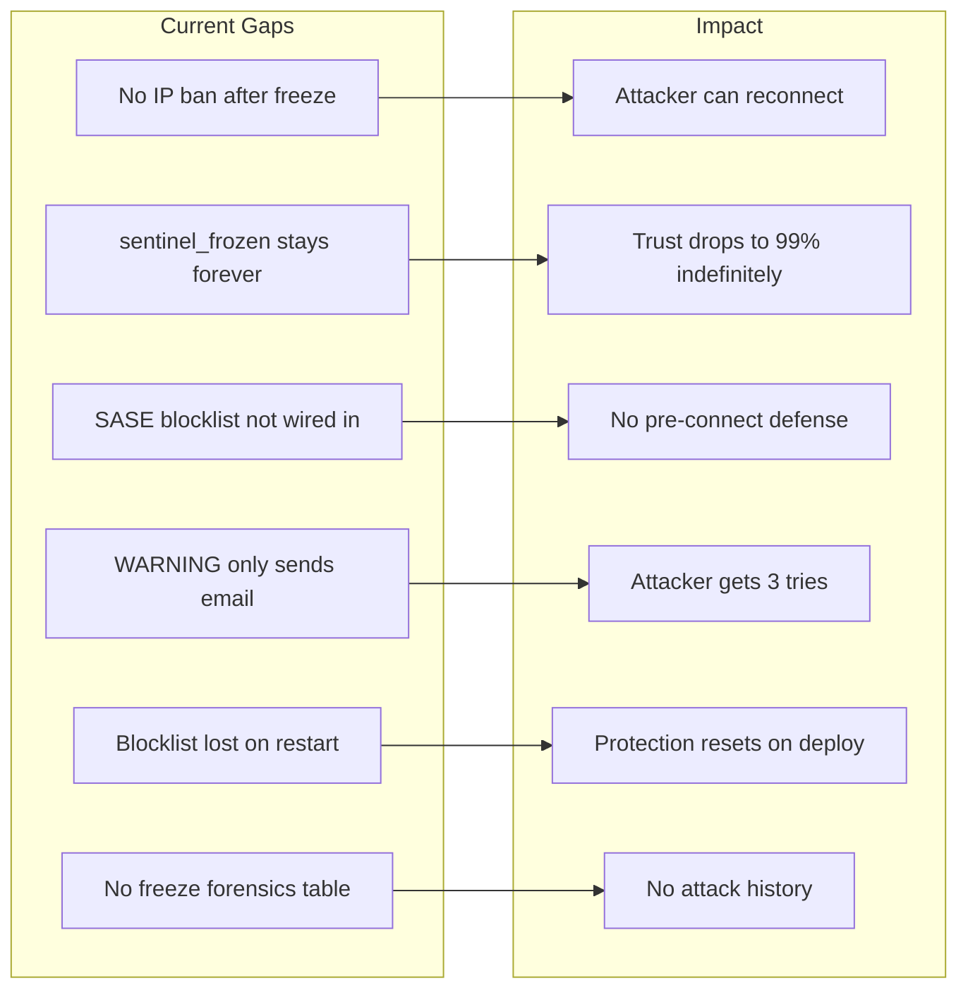

# Sentinel and Hive Defense Hardening Plan

> **Depends on:** `sentinel_mirror_trap_wiring_595369a4.plan.md` (completed — migration 092 creates `sentinel_banned_ips`; this plan extends it)
> **Note:** Some schema overlap with mirror trap plan. Verify `sentinel_banned_ips` columns before adding new ones.
> **Deploy order:** Migration first, then sentinel.py, then bridge_server.py, then auditor

## Current State — What Worked

The Sentinel escalated correctly through three levels against IP `68.43.85.92`:

```
SCORE 50 (WARNING) → Email alert: 2138.6 req/min
SCORE 75 (WARNING) → Email alert: 300.1 req/min  
SCORE 100 (FREEZE) → Session terminated, token revoked, WebSocket closed (1008)
```

## Gaps to Close




## Improvement 1: Persistent IP Ban Table + Auto-Ban on Freeze

**New migration** — `sentinel_banned_ips` table:

```sql
CREATE TABLE sentinel_banned_ips (
  id SERIAL PRIMARY KEY,
  ip_address INET NOT NULL,
  reason TEXT NOT NULL,
  banned_at TIMESTAMPTZ DEFAULT NOW(),
  expires_at TIMESTAMPTZ,        -- NULL = permanent
  banned_by VARCHAR(64),          -- 'sentinel_auto' or admin username
  freeze_session_id VARCHAR(64),
  score_at_ban INTEGER,
  UNIQUE(ip_address)
);
CREATE INDEX idx_banned_ips_active ON sentinel_banned_ips (ip_address) WHERE expires_at IS NULL OR expires_at > NOW();
```

**Auto-ban on freeze** — In [bridge_server.py](backend/app/websocket/bridge_server.py) freeze handler (~line 8890), after `sentinel_frozen: true` is written, insert the attacker IP with a 24-hour expiry (configurable). Repeated freeze from the same IP extends to permanent.

## Improvement 2: WebSocket Pre-Connect IP Check

In [bridge_server.py](backend/app/websocket/bridge_server.py) at the top of the WebSocket handler (before the message loop), query `sentinel_banned_ips` for the connecting IP. If banned, send `security_disconnect` and close immediately with 1008 before any authentication or message processing occurs.

```python
_client_ip = websocket.remote_address[0] if websocket.remote_address else None
if _client_ip and db_pool:
    _banned = await db_pool.fetchval(
        "SELECT 1 FROM sentinel_banned_ips WHERE ip_address = $1::inet AND (expires_at IS NULL OR expires_at > NOW())",
        _client_ip)
    if _banned:
        await websocket.send(json.dumps({"type": "security_disconnect", "reason": "Access denied."}))
        await websocket.close(1008, "IP banned")
        return
```

## Improvement 3: Wire SASE Blocklist into Live Request Path

The SASE controller in [sase_controller.py](backend/app/services/security/sase_controller.py) has `evaluate_request()` and `_check_blocklist()` but they are never called on incoming requests. Two changes:

- **Sync SASE blocklist from DB** — On startup and every 5 minutes, load `sentinel_banned_ips` into `_dynamic_blocklist`
- **Add REST middleware** — In [main.py](backend/app/main.py), add a lightweight middleware that calls `sase_controller.check_blocklist(request.client.host)` before routing. Only check the set membership (O(1)), no heavy processing

## Improvement 4: Graduated Response at WARNING Level

Currently WARNING only sends an email. Improve escalation in [sentinel.py](backend/app/websocket/sentinel.py):


| Level    | Score Range | Current Action      | New Action                                           |
| -------- | ----------- | ------------------- | ---------------------------------------------------- |
| ALERT    | 50-74       | Email only          | Email + throttle (2s delay before response)          |
| ESCALATE | 75-99       | Email only          | Email + require re-auth challenge before next action |
| FREEZE   | 100+        | Freeze + disconnect | Freeze + disconnect + auto-ban IP for 24h            |


In [bridge_server.py](backend/app/websocket/bridge_server.py), after `score_action()` returns, check the score level and apply the graduated response:

- **ALERT (50-74)**: `await asyncio.sleep(2)` before processing the next message — slows the attacker without blocking legitimate use
- **ESCALATE (75-99)**: Set a flag requiring admin to re-verify passphrase/TOTP before the next admin action is processed. Send a `security_challenge` message to the client

## Improvement 5: Auto-Unfreeze with Cooldown

The admin shouldn't be punished indefinitely by their own defense system. Add auto-unfreeze logic:

- **In [sentinel.py](backend/app/websocket/sentinel.py)**: New method `check_auto_unfreeze(uid)` — if `sentinel_frozen_at` is older than 30 minutes AND the triggering IP is banned, auto-clear the freeze
- **In bridge startup** or a background task: Periodically check for stale freezes and clear them
- **After unfreeze (auto or manual)**: Enter a "heightened alertness" period (2 hours) where thresholds are halved — any anomaly triggers freeze faster
- **Store `sentinel_frozen_at` timestamp** in `profile_data` when freezing (currently missing — we couldn't determine when the freeze happened)

## Improvement 6: Freeze History / Forensics Table

**New migration** — `sentinel_freeze_history` table:

```sql
CREATE TABLE sentinel_freeze_history (
  id SERIAL PRIMARY KEY,
  user_id VARCHAR(64) NOT NULL,
  ip_address INET,
  user_agent TEXT,
  score_at_freeze INTEGER,
  reasons JSONB,
  action_log JSONB,         -- last 20 actions before freeze
  frozen_at TIMESTAMPTZ DEFAULT NOW(),
  unfrozen_at TIMESTAMPTZ,
  unfreeze_method VARCHAR(30), -- 'yubikey', 'passphrase', 'auto', 'admin_sql'
  ip_banned BOOLEAN DEFAULT FALSE
);
```

Every freeze and unfreeze event writes here. The HW Security Auditor can query this for forensic context. The admin can view attack history in the Hardware Security tab.

## Improvement 7: Trust Auditor Awareness of Active Defense

In [hardware_security_auditor.py](backend/app/services/hardware_security_auditor.py), modify the `sentinel_clear` check:

- If `sentinel_frozen: true` AND `sentinel_frozen_at` is within the last 60 minutes AND the triggering IP is in `sentinel_banned_ips`, classify as **TRUSTED** (active defense in progress), not WARNING
- If `sentinel_frozen: true` AND older than 60 minutes, classify as WARNING (stale freeze needs attention)

This prevents the trust score from dropping to 99% when the system is actively defending against an attack.

## Improvement 8: Score Decay for False Positive Prevention

In [sentinel.py](backend/app/websocket/sentinel.py), add time-based score decay:

- After 5 minutes of no scored actions, decay at -5 points/minute
- Minimum score: 0
- This prevents legitimate burst admin activity (e.g., reviewing multiple users quickly) from accumulating to WARNING/FREEZE
- Attacks sustain high rates continuously, so decay won't help them

Implementation: In `score_action()`, before adding the new score, check time since last action. If > 5 minutes, subtract elapsed decay.

## Files Modified


| File                                                | Changes                                                                                      |
| --------------------------------------------------- | -------------------------------------------------------------------------------------------- |
| `backend/migrations/NNN_sentinel_defense.sql`       | New tables: `sentinel_banned_ips`, `sentinel_freeze_history`                                 |
| `backend/app/websocket/sentinel.py`                 | Score decay, auto-unfreeze check, heightened alertness, `sentinel_frozen_at`                 |
| `backend/app/websocket/bridge_server.py`            | Pre-connect IP check, auto-ban on freeze, graduated WARNING response, freeze history logging |
| `backend/app/services/security/sase_controller.py`  | Sync blocklist from DB on startup + periodic refresh                                         |
| `backend/app/main.py`                               | Add IP check middleware using SASE blocklist                                                 |
| `backend/app/services/hardware_security_auditor.py` | Active defense awareness for `sentinel_clear` check                                          |
| `backend/app/routers/admin.py`                      | Log unfreeze events to `sentinel_freeze_history`                                             |


## Deployment Order

1. Apply migration (tables first)
2. Deploy `sentinel.py` + `bridge_server.py` + `sase_controller.py`
3. Deploy `main.py` + `admin.py` + `hardware_security_auditor.py`
4. Restart backend + bridge
5. Verify: connect from a test IP, confirm ban table is queryable, trigger a test WARNING to verify graduated response

