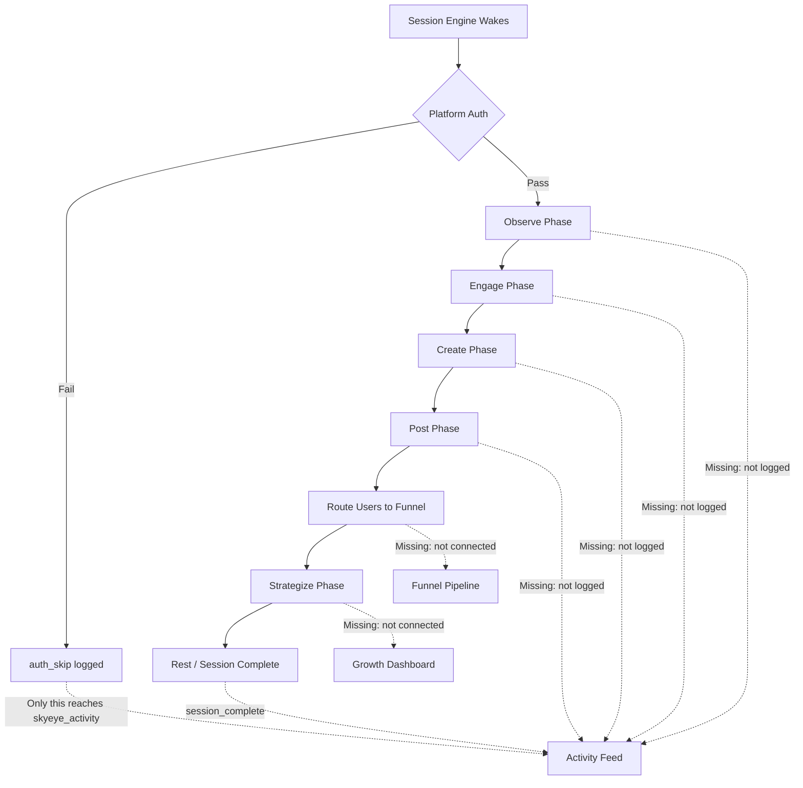

# SkyEye Live Data Overhaul

## Root Cause

The dashboard code IS dynamic (all tabs fetch from real APIs) and the backend DOES query real databases. The problem is upstream: Little Nate's sessions aren't producing data because most platforms fail auth, content generation barely fires, and session actions only write to `skyeye_session_actions` but not to the tables the dashboard reads from (`skyeye_activity`, `skyeye_history`, `skyeye_drip_suggestions`, `skyeye_live_expressions`, `funnel_routing_log`).

## Phase 1: Fix Platform Connectivity (unblock all data flow)

### 1a. Fix X (Twitter) token auto-refresh

- File: [backend/app/services/platforms/x_twitter.py](backend/app/services/platforms/x_twitter.py)
- The X OAuth 2.0 token expires every 2 hours. The `authenticate()` method checks expiry and calls `refresh_token()`, but the token_expiry comparison has a timezone mismatch (same bug as YouTube). Fix the datetime comparison and ensure refresh fires before expiry.

### 1b. Fix YouTube datetime bug

- File: [backend/app/services/platforms/youtube.py](backend/app/services/platforms/youtube.py)
- Error: `can't compare offset-naive and offset-aware datetimes`
- The `token_expiry` from the DB is timezone-aware but compared against `datetime.utcnow()` (naive). Strip tzinfo or use `datetime.now(timezone.utc)`.

### 1c. Fix content generation for platforms with empty feeds

- File: [backend/app/services/skyeye_session_engine.py](backend/app/services/skyeye_session_engine.py)
- The `_create_phase` only generates content if `recent_count < 2`. For platforms with 0 posts, this should still trigger. Verify the create phase actually runs for connected platforms even when observe/engage find nothing.

## Phase 2: Wire Session Actions to Dashboard Tables

### 2a. Dual-write ALL session actions to `skyeye_activity` (partially done)

- File: [backend/app/services/skyeye_session_engine.py](backend/app/services/skyeye_session_engine.py)
- The `_log_action` fix was deployed but needs to cover ALL action types including browse, observe, and strategy phases. Map every action_type to a dashboard-friendly activity type.

### 2b. Write session summaries to `skyeye_history`

- The History tab reads from `skyeye_history` table, but sessions only write to `skyeye_activity` with type `session_complete`. Add writes to `skyeye_history` at session end with per-platform breakdown.

### 2c. Generate drip suggestions during sessions

- File: [backend/app/services/skyeye_session_engine.py](backend/app/services/skyeye_session_engine.py)
- The Drip Bridge tab reads from `skyeye_drip_suggestions` (currently empty). During the strategize phase, use Marketing Brain insights to generate 1-2 drip suggestions per session (e.g., "User @handle showed interest in X topic, suggest drip sequence").

### 2d. Capture expressions from posts and interactions

- The Expressions Wall reads from `skyeye_live_expressions`. During engage/observe phases, capture emotionally resonant comments and Little Nate's best replies as expressions.

### 2e. Wire funnel routing to populate `funnel_routing_log`

- The `_route_engaged_users` method exists but only fires for users with 3+ interactions. Lower the threshold or ensure the method actually runs. The Funnel Pipeline tab reads from this table.

## Phase 3: Connect Dashboard Tabs to Marketing Brain

### 3a. Growth Dashboard -- wire to real growth snapshots

- File: [dashboard/skyeye.html](dashboard/skyeye.html) (Growth Dashboard tab)
- Currently calls `/api/marketing/results` and `/api/marketing/funnel-stats`
- These endpoints query real tables (`funnel_routing_log`, `prospects`, `users`, `growth_snapshots`)
- Fix: Ensure `record_growth_snapshot()` runs every session and populates these tables so the dashboard has data

### 3b. Marketing Brain tab -- ensure playbook is populated

- Currently calls `/api/marketing/playbook` which reads from `marketing_playbook` table
- If the playbook table is empty, the tab shows nothing. Seed the playbook with initial content pillars and strategy, or run `review_playbook()` to generate one via Azure OpenAI.

### 3c. Funnel Pipeline -- show per-platform traffic

- Currently calls `/api/marketing/funnel-stats?days=7`
- Reads from `funnel_routing_log` which is populated by `_route_engaged_users()`
- Once Phase 2e is working, this will show real data automatically

### 3d. Activity Feed -- already wired (Phase 2a completes this)

- Each dropdown filter (Content Generated, Post Published, Engagement, etc.) will show real data once `_log_action` dual-writes are complete

### 3e. Drip Bridge -- show intelligent suggestions

- Once Phase 2c populates `skyeye_drip_suggestions`, the tab will show real AI-generated suggestions for bridging social engagement into email drip campaigns

### 3f. Expressions Wall -- show real expressions

- Once Phase 2d captures expressions during sessions, the wall will populate with real emotional content from Little Nate's interactions

## Phase 4: Deploy and Verify

- Deploy all backend changes via SCP (source mounted as volume)
- Restart backend container
- Trigger a manual SkyEye session wake to generate initial data
- Verify each tab populates with real data
- Run full deployment health checks per workspace rules

