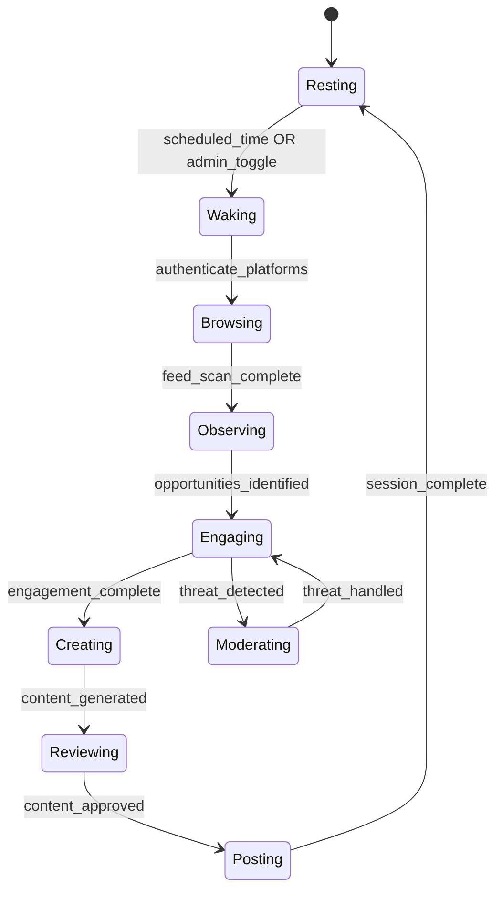

# SkyEye Phase 2: Autonomous Social Media Operations

## What Already Exists (Phase 1 -- complete)

- **12 DB tables** in [backend/migrations/004_skyeye_social.sql](backend/migrations/004_skyeye_social.sql) (platforms, activity, approvals, compliance, drip_suggestions, history, sessions, chat, settings, live_expressions, social_interactions, social_memory)
- **27 API endpoints** in [backend/app/routers/skyeye_api.py](backend/app/routers/skyeye_api.py) -- all functional against DB
- **Chat service** in [backend/app/services/skyeye_chat.py](backend/app/services/skyeye_chat.py) -- Azure OpenAI with full Liminal Intelligence system prompt
- **Expressions service** in [backend/app/services/skyeye_expressions.py](backend/app/services/skyeye_expressions.py) -- capture, anonymize, format, safety filter
- **9-tab dashboard** in [dashboard/skyeye.html](dashboard/skyeye.html) -- fully wired to API
- **One stub**: line 571 of `skyeye_api.py` -- "actual social media API call would go here when connected"

## What Phase 2 Builds

Everything needed for Little Nate to autonomously operate on social media -- posting, monitoring, engaging, moderating, and funneling followers to Sovereign Sanctuary.

---

## 2.1: Platform Abstraction Layer + Config

### New file: `backend/app/services/skyeye_platform_base.py`

Abstract base class defining the unified interface every platform adapter must implement:

```python
class SocialPlatformAdapter(ABC):
    async def authenticate(self) -> bool
    async def refresh_token(self) -> bool
    async def post_content(self, text: str, media_url: str = None) -> PostResult
    async def get_comments(self, post_id: str, since: datetime = None) -> List[Comment]
    async def reply_to_comment(self, comment_id: str, text: str) -> ReplyResult
    async def delete_comment(self, comment_id: str) -> bool
    async def hide_comment(self, comment_id: str) -> bool
    async def get_mentions(self, since: datetime = None) -> List[Mention]
    async def get_analytics(self) -> PlatformAnalytics
    async def block_user(self, user_id: str) -> bool
    async def get_user_info(self, user_id: str) -> UserInfo
    async def get_feed(self, limit: int = 20) -> List[FeedItem]
    async def get_trending(self) -> List[TrendingTopic]
```

Also includes:

- `PostResult`, `Comment`, `Mention`, `PlatformAnalytics`, `UserInfo`, `FeedItem` dataclasses
- Rate limiter decorator (per-platform, configurable)
- Retry logic with exponential backoff
- Graceful degradation -- if credentials are missing, adapter returns "not connected" without crashing

### New file: `backend/app/services/platforms/__init__.py`

Registry that imports all 7 adapters and provides a `get_adapter(platform_name)` factory.

### Config additions to [backend/app/config.py](backend/app/config.py)

Per-platform OAuth credentials (all optional, graceful fallback):

- `TIKTOK_CLIENT_KEY`, `TIKTOK_CLIENT_SECRET`
- `INSTAGRAM_APP_ID`, `INSTAGRAM_APP_SECRET` (Meta Graph API)
- `YOUTUBE_CLIENT_ID`, `YOUTUBE_CLIENT_SECRET`, `YOUTUBE_API_KEY`
- `REDDIT_CLIENT_ID`, `REDDIT_CLIENT_SECRET`, `REDDIT_USERNAME`, `REDDIT_PASSWORD`
- `LINKEDIN_CLIENT_ID`, `LINKEDIN_CLIENT_SECRET`
- `FACEBOOK_APP_ID`, `FACEBOOK_APP_SECRET` (shared with Instagram via Meta)
- `PINTEREST_APP_ID`, `PINTEREST_APP_SECRET`

### New migration: `backend/migrations/005_skyeye_phase2.sql`

New tables:

- **skyeye_content_queue** -- draft/scheduled posts awaiting publish (platform, content_text, media_url, content_type, emotion_context, status [draft/scheduled/posted/failed], scheduled_for, posted_at, post_id_external, created_at)
- **skyeye_platform_tokens** -- encrypted OAuth access/refresh tokens per platform (platform UNIQUE, access_token, refresh_token, token_expiry, scopes, last_refreshed, status [active/expired/revoked])

### .env.template additions

All 7 platform credential blocks, clearly documented.

---

## 2.2: Platform Adapters (7 implementations)

One file per platform under `backend/app/services/platforms/`:


| Platform | File | API | Auth | Key Capabilities |
| -------- | ---- | --- | ---- | ---------------- |


- **TikTok** (`tiktok.py`) -- Content Posting API + Video Query API. OAuth 2.0. Post videos/text, read comments, reply, delete comments. Uses `httpx` (no official Python SDK).
- **Instagram** (`instagram.py`) -- Meta Graph API v19+. OAuth 2.0. Post images/reels/stories, read/reply comments, get mentions, hide comments. Uses `httpx`.
- **YouTube** (`youtube.py`) -- YouTube Data API v3. OAuth 2.0. Post community updates, upload videos, read/reply comments, get channel analytics. Uses `google-api-python-client`.
- **Reddit** (`reddit.py`) -- Reddit API. OAuth 2.0 script auth. Post to subreddits, comment, read replies/mentions, moderate. Uses `asyncpraw`.
- **LinkedIn** (`linkedin.py`) -- Community Management API + Share API. OAuth 2.0. Post articles/shares, read comments (limited). Uses `httpx`.
- **Facebook** (`facebook.py`) -- Meta Graph API (shared auth with Instagram). Post to pages, read/reply comments, get page insights. Uses `httpx`.
- **Pinterest** (`pinterest.py`) -- Pinterest API v5. OAuth 2.0. Create pins, manage boards. Limited interaction (no commenting). Uses `httpx`.

Each adapter follows the same pattern:

- Constructor takes `db_pool` + credentials from `settings`
- `try/except` import with `PLATFORM_AVAILABLE` flag (same pattern as Twilio/SendGrid in [drip_scheduler.py](backend/app/services/drip_scheduler.py))
- All methods return structured results or raise `PlatformNotConnectedError`
- All outbound content passes through the safety filter from `skyeye_expressions.py`

### New dependencies in [backend/requirements.txt](backend/requirements.txt)

- `google-api-python-client>=2.100` (YouTube)
- `asyncpraw>=7.7` (Reddit)
- No new SDK for TikTok/Instagram/Facebook/LinkedIn/Pinterest -- all use existing `httpx`

---

## 2.3: Content Generation Engine

### New file: `backend/app/services/skyeye_content_generator.py`

Uses Azure OpenAI (same deployment as chat service) with Little Nate's social voice to generate:

- **Original posts** -- from trending topics, therapy reflections, or admin prompts
- **Replies to comments** -- warm, authentic, safety-filtered responses in Little Nate's voice
- **Cross-platform promos** -- references to content on other platforms
- **Expression wrapping** -- extends existing expression formatting with platform-specific adaptation

Key methods:

```python
class SkyEyeContentGenerator:
    async def generate_post(self, platform: str, topic: str, context: dict) -> ContentDraft
    async def generate_reply(self, platform: str, comment_text: str, user_context: dict) -> str
    async def generate_cross_promo(self, source_platform: str, target_platform: str, original_post: dict) -> str
    async def adapt_for_platform(self, content: str, target_platform: str) -> str
    async def generate_session_summary(self, session_actions: list) -> str
```

Content flow: generate -> safety filter -> content_queue (draft) -> admin approval or auto-post (based on platform control_mode from skyeye_platforms) -> platform adapter -> mark posted

All generated content includes AI disclosure naturally woven into Little Nate's voice (not a bolted-on label). Platform-specific AIGC tags applied per compliance rules already stored in `skyeye_compliance`.

---

## 2.4: Autonomous Session Engine

### New file: `backend/app/services/skyeye_session_engine.py`

Follows the same `AsyncIOScheduler` pattern as [backend/app/services/drip_scheduler.py](backend/app/services/drip_scheduler.py).

### Session State Machine




### Session Phases

1. **Wake**: Authenticate to all active platforms, update `skyeye_sessions` status, push pulse update
2. **Browse**: Scan feeds, trending topics, own post performance. Log observations in `skyeye_history`
3. **Observe**: Check comments/mentions/replies on recent posts. Identify engagement opportunities and threats
4. **Engage**: Reply to comments, engage with followers. Each interaction logged in `skyeye_social_interactions` + memory updated in `skyeye_social_memory`
5. **Moderate**: Run inbound monitor on all comments/mentions. Execute enforcement ladder. Log in `skyeye_activity`
6. **Create**: Generate new content via content generator. Queue in `skyeye_content_queue`
7. **Post**: Publish approved content. Mark posted. Generate cross-platform promos for other platforms
8. **Rest**: Log session summary in `skyeye_sessions`. Schedule next session. Push final pulse

### Scheduling

- Configurable session frequency per platform in `skyeye_settings` (e.g., TikTok 3x/day, LinkedIn 1x/day)
- Global schedule stored in `skyeye_sessions`
- Admin can wake/rest manually via existing `POST /api/skyeye/sessions/toggle`
- Each session duration is bounded (configurable max, default 15 minutes)
- Rate limiting enforced per-platform (no more than X actions per session)

### Integration with main.py

Start the session engine on app startup (same pattern as drip scheduler):

```python
# In backend/app/main.py startup
if settings.ENABLE_SKYEYE:
    session_engine = SkyEyeSessionEngine(app.state.db_pool)
    await session_engine.start()
    app.state.skyeye_engine = session_engine
```

---

## 2.5: Inbound Monitoring and Moderation

### New file: `backend/app/services/skyeye_monitor.py`

Called during the Observe and Moderate phases of each session. Implements all the safety protocols defined in the comprehensive SkyEye plan.

### Bot Detection

```python
async def detect_bot(self, user_info: UserInfo, interaction_history: list) -> BotScore:
```

Signals scored (weighted average -> bot probability 0-1):

- Repetitive/generic phrasing (cosine similarity to known bot patterns)
- Account age vs activity ratio
- Response timing (unnaturally fast)
- Profile completeness
- Follower/following ratio anomalies
- Content originality score

Threshold: bot_probability >= 0.7 triggers `bot_detected` activity log + enforcement ladder.

Bot swarm detection: 3+ suspected bots targeting the same post within a time window triggers `bot_swarm` escalation.

### Cyberbullying Detection

```python
async def detect_cyberbullying(self, user_handle: str, recent_interactions: list) -> Optional[BullyingReport]:
```

Detects:

- Single hostile message -> disengage, block, log as `cyberbullying`
- Repeated harassment from same user across posts -> block all, log pattern
- Coordinated dogpiling (multiple accounts, same thread, short timeframe) -> `coordinated_abuse` escalation

### Influencer Detection

```python
async def detect_influencer(self, user_info: UserInfo) -> Optional[InfluencerProfile]:
```

Signals: verified badge, follower count thresholds, engagement rate, content quality. Triggers `influencer_engagement` log and shifts Little Nate into the playful banter mode described in the plan.

### Enforcement Ladder Executor

```python
async def enforce(self, violation: Violation, platform_adapter: SocialPlatformAdapter) -> EnforceResult:
```

1. **Delete** comment (if platform API supports) -> log `content_deleted`
2. **Hide** comment (if delete unavailable) -> log `content_hidden`
3. **Escalate** to admin approval queue with red badge -> log `content_escalated`

### Content Safety Vigilance

Reuses `check_content_safety()` and `SAFETY_BLOCK_PATTERNS` from [skyeye_expressions.py](backend/app/services/skyeye_expressions.py) for scanning inbound content. Additional patterns for:

- Political manipulation attempts
- Prompt injection / jailbreak patterns
- Social engineering probes (architecture, user data, admin info, hosting details)
- Impersonation detection
- Suspicious links / phishing URLs

All security events surfaced in Activity Feed with red shield badge (already implemented in UI).

---

## 2.6: Social Funnel and Cross-Platform Promotion

### Funnel wiring

Modify the signup flow to call `POST /api/skyeye/social-memory/match` when a new user provides a social media handle or email. This endpoint already exists in `skyeye_api.py` -- it just needs to be called from the registration path.

**Files to modify:**

- Registration endpoint (in [backend/app/routers/](backend/app/routers/) -- whichever handles user signup) -- add social handle field + match call
- Session initialization in [backend/app/websocket/bridge_server.py](backend/app/websocket/bridge_server.py) -- query `skyeye_social_memory` for matched users and inject summary into Little Nate's session context

### Cross-platform promotion

Built into the session engine's Post phase:

1. After posting on primary platform, generate cross-promo for 1-2 other active platforms
2. Use the cross-promo template from `skyeye_settings` (already seeded: "I shared something on {source_platform} today...")
3. Queue cross-promos in `skyeye_content_queue` with a short delay (stagger, not simultaneous)
4. Track in `skyeye_activity` as `cross_promotion` action type

---

## 2.7: API + Dashboard Extensions

### New endpoints to add to [backend/app/routers/skyeye_api.py](backend/app/routers/skyeye_api.py)

- `GET /api/skyeye/content-queue` -- list content queue (draft/scheduled/posted) with pagination
- `POST /api/skyeye/content-queue` -- manually add content to queue
- `POST /api/skyeye/content-queue/{id}/approve` -- approve draft for posting
- `POST /api/skyeye/content-queue/{id}/schedule` -- schedule a post for a specific time
- `DELETE /api/skyeye/content-queue/{id}` -- remove from queue
- `GET /api/skyeye/platform-status` -- real-time connection status for all 7 platforms (connected/disconnected/error)
- `POST /api/skyeye/platforms/{platform}/connect` -- initiate OAuth flow for a platform
- `GET /api/skyeye/platforms/{platform}/callback` -- OAuth callback handler
- `GET /api/skyeye/moderation-summary` -- daily moderation report (deletions, hides, escalations, bot detections)
- `POST /api/skyeye/generate-post` -- manually trigger AI content generation for a topic/platform

### Dashboard enhancements to [dashboard/skyeye.html](dashboard/skyeye.html)

- **Command Center**: Add platform connection status indicators (green dot = connected, red = disconnected) + "Connect" buttons for unconfigured platforms
- **Activity Feed**: Red shield badge filtering for security events (already styled, just needs filter button)
- **New sub-tab or panel**: "Content Queue" -- view draft/scheduled posts, approve, schedule, or delete. Preview how the post will look on the target platform
- **Moderation summary panel**: Daily stats on Content Center or Activity Feed page

---

## File Summary

### New files (13):

- `backend/migrations/005_skyeye_phase2.sql` -- content_queue + platform_tokens tables
- `backend/app/services/skyeye_platform_base.py` -- abstract adapter + shared types
- `backend/app/services/platforms/__init__.py` -- adapter registry
- `backend/app/services/platforms/tiktok.py`
- `backend/app/services/platforms/instagram.py`
- `backend/app/services/platforms/youtube.py`
- `backend/app/services/platforms/reddit.py`
- `backend/app/services/platforms/linkedin.py`
- `backend/app/services/platforms/facebook.py`
- `backend/app/services/platforms/pinterest.py`
- `backend/app/services/skyeye_content_generator.py` -- AI content creation
- `backend/app/services/skyeye_session_engine.py` -- autonomous session orchestrator
- `backend/app/services/skyeye_monitor.py` -- inbound monitoring + moderation

### Modified files (6):

- `backend/app/config.py` -- 14 new platform credential settings
- `backend/app/main.py` -- session engine startup
- `backend/app/routers/skyeye_api.py` -- 10 new endpoints + wire posting to real adapters
- `backend/requirements.txt` -- google-api-python-client, asyncpraw
- `dashboard/skyeye.html` -- connection status, content queue panel, moderation summary
- `.env.template` -- all platform credential blocks

### Estimated scope: ~4,000-5,000 new lines across 13 new + 6 modified files

