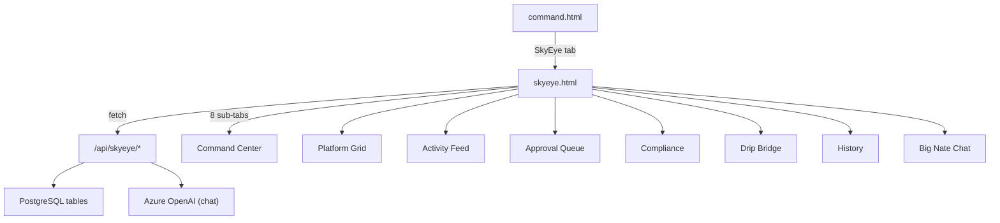

name: SkyEye Social Media Hub
overview: Build the SkyEye tab -- a full social media autonomy dashboard for Little Nate -- with all 8 sub-tabs from the JSX design, backed by new database tables and API endpoints, wired to real DB data. Social media platform APIs will be stubbed until credentials are provided. Big Nate Chat will use Azure OpenAI for real AI responses.
todos:

- id: db-migration
content: Create 004_skyeye_social.sql with all 9 tables, indexes, and seed data for 7 platforms + compliance matrix
status: completed
- id: skyeye-chat-service
content: Create skyeye_chat.py service with Azure OpenAI integration for Big Nate / Little Nate conversation
status: completed
- id: skyeye-api
content: Create skyeye_api.py router with all 16 endpoints (overview, platforms, activity, approvals, compliance, drip, history, sessions, chat)
status: completed
- id: skyeye-html
content: Create skyeye.html dashboard -- convert JSX to vanilla HTML/JS with all 8 sub-tabs, wired to /api/skyeye/* endpoints
status: completed
- id: wire-main
content: Register skyeye router in main.py, add ENABLE_SKYEYE to config.py, add SkyEye tab to command.html
status: completed
- id: deploy
content: Run migration on production DB, deploy all new/modified files, restart backend
status: completed
isProject: false

---

# SkyEye -- Social Media Autonomy Hub

## Architecture

The SkyEye system follows the same pattern as the MarketPlace drip campaign system:

- **Frontend**: Standalone HTML page `dashboard/skyeye.html` (vanilla HTML/CSS/JS, matching existing design system)
- **Backend**: New database tables + FastAPI router + service layer
- **Navigation**: New tab in `dashboard/command.html` next to MarketPlace

## Phase 1: Database Schema

New migration file: `backend/migrations/004_skyeye_social.sql`

Tables to create:

- **skyeye_platforms** -- 7 platform configs (tiktok, instagram, youtube, reddit, linkedin, facebook, pinterest) with tier, control_mode, followers, engagement, posts, content_type, aigc_method, compliance_status
- **skyeye_activity** -- unified activity feed log (platform, type, content, compliance_note, pillar, created_at)
- **skyeye_approvals** -- approval queue items (platform, type, content, priority, reason, status, created_at, resolved_at, resolved_by)
- **skyeye_compliance** -- compliance audit snapshots (platform, aigc_labels_applied, bio_disclosure, anti_bot, public_figure, special_notes, audited_at)
- **skyeye_drip_suggestions** -- drip campaign bridge suggestions from social observation (topic, insight, confidence, source, status)
- **skyeye_history** -- session browsing/search/action history (platform, action, detail, session_start, created_at)
- **skyeye_sessions** -- session scheduling data (session_start, session_end, platforms_visited, total_actions, status)
- **skyeye_chat** -- Big Nate / Little Nate chat messages (sender, message, created_at)
- **skyeye_settings** -- per-platform settings and global config (key, value, platform)

## Phase 2: Backend API

New router: `backend/app/routers/skyeye_api.py` (prefix: `/api/skyeye`)

Endpoints:

- `GET /api/skyeye/overview` -- aggregated metrics (total followers, avg engagement, total posts, compliance score, pending approvals)
- `GET /api/skyeye/platforms` -- all platform configs with current mode
- `PUT /api/skyeye/platforms/{platform_id}/mode` -- change control mode (full/approval/observe)
- `GET /api/skyeye/activity` -- activity feed with pagination + platform filter
- `POST /api/skyeye/activity` -- log new activity entry
- `GET /api/skyeye/approvals` -- pending approval queue
- `POST /api/skyeye/approvals/{id}/approve` -- approve item
- `POST /api/skyeye/approvals/{id}/reject` -- reject item
- `GET /api/skyeye/compliance` -- compliance metrics + per-platform matrix
- `GET /api/skyeye/drip-suggestions` -- drip bridge suggestions
- `POST /api/skyeye/drip-suggestions/{id}/action` -- approve/review/reject suggestion
- `GET /api/skyeye/history` -- session history log
- `GET /api/skyeye/sessions` -- session schedule info (next login, current status)
- `POST /api/skyeye/sessions/toggle` -- wake/rest toggle
- `GET /api/skyeye/chat` -- chat message history
- `POST /api/skyeye/chat` -- send message (triggers Azure OpenAI response as Little Nate)

New service: `backend/app/services/skyeye_chat.py`

- Uses Azure OpenAI (same `AZURE_OPENAI_CHAT_DEPLOYMENT` from existing config) with a system prompt defining Little Nate's social media persona
- Returns conversational response about social media observations, strategy, and experiences

## Phase 3: Frontend Dashboard

New file: `dashboard/skyeye.html`

Convert the JSX component to vanilla HTML/JS following the exact visual design from `SovereignCommand.jsx`:

- Dark glass-morphism aesthetic (rgba backgrounds, backdrop blur, subtle glows)
- Instrument Serif for headings, DM Sans for body
- Green (#00E5A0), blue (#38BDF8), purple (#A78BFA), amber (#FFB800), red (#FF3B5C) accent palette
- Sidebar navigation with 8 sub-tabs
- All data loaded from `/api/skyeye/*` endpoints

Sub-tabs (matching JSX `TABS` array):

1. **Command Center** -- status banner (active/resting), 5 metric cards, session schedule panel, recent activity panel, platform status overview grid
2. **Platform Grid** -- Tier 1 and Tier 2 sections, each platform as a card with followers/engagement/posts stats and mode selector (Full Autonomy / Approval Required / Observation Only)
3. **Activity Feed** -- chronological list of all actions with platform icon, compliance badge, content pillar tag, and action type
4. **Approval Queue** -- pending items with priority badges, approve/reject/edit buttons
5. **Compliance** -- overall score banner, per-platform compliance matrix table, Meta and TikTok compliance rule panels
6. **Drip Bridge** -- suggestion cards with confidence scores, approve/review/dismiss actions
7. **History** -- timestamped session log with action type badges (browse/search/engage/create/draft/rest)
8. **Big Nate Chat** -- real-time chat interface, messages sent via POST /api/skyeye/chat which returns AI response

Include back arrow to `command.html` in the top bar (same pattern as `sovereign-command-admin.html`).

## Phase 4: Integration

- Add "SkyEye" tab to [dashboard/command.html](dashboard/command.html) nav bar (next to MarketPlace)
- Register `skyeye_api.router` in [backend/app/main.py](backend/app/main.py)
- Add `ENABLE_SKYEYE` feature flag to [backend/app/config.py](backend/app/config.py)
- Run migration on production database
- Deploy all files

## Key Files to Create/Modify

**Create:**

- `backend/migrations/004_skyeye_social.sql` -- database schema
- `backend/app/routers/skyeye_api.py` -- API endpoints
- `backend/app/services/skyeye_chat.py` -- Azure OpenAI chat service
- `dashboard/skyeye.html` -- frontend dashboard

**Modify:**

- `backend/app/main.py` -- include skyeye router
- `backend/app/config.py` -- add ENABLE_SKYEYE flag
- `dashboard/command.html` -- add SkyEye nav tab

## Seed Data

The migration will seed the 7 platforms with initial config matching the JSX `PLATFORMS` object (TikTok, Instagram, YouTube, Reddit, LinkedIn, Facebook, Pinterest) with zeroed-out stats (followers: 0, engagement: 0, posts: 0). The compliance matrix will be pre-populated with the required checks per platform from the blueprint's Section 8.3.