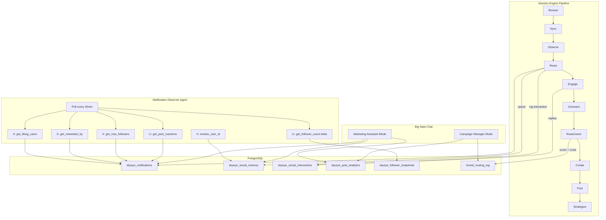

# Social Engagement Engine & Marketing Agent Build

## Current State

The session engine ([backend/app/services/skyeye_session_engine.py](backend/app/services/skyeye_session_engine.py)) runs a 9-phase pipeline per platform:

```
Browse -> Sync -> Observe -> Engage -> Outreach -> Route -> Create -> Post -> Strategize
```

**What works today:**

- `_observe_phase` checks comments on own posts and @mentions
- `_engage_phase` replies to safe comments and mentions via AI (`generate_reply()`)
- `_outreach_phase` likes, follows, and quote-tweets relevant strangers' content
- `_route_engaged_users` scores users via `FunnelRouter` and triggers CTAs
- Marketing Brain, Funnel Router, Content Generator, Big Nate Chat (marketing mode) are fully implemented

**What is missing (identified gaps):**


| Gap                                          | Platform | Missing API Call                                                                                            |
| -------------------------------------------- | -------- | ----------------------------------------------------------------------------------------------------------- |
| Likes on own posts invisible                 | X        | `GET /2/tweets/{id}/liking_users`                                                                           |
| Reposts invisible                            | X        | `GET /2/tweets/{id}/retweeted_by`                                                                           |
| New followers invisible                      | X        | `GET /2/users/{id}/followers`                                                                               |
| author_id not resolved to @handle            | X        | `GET /2/users/{id}` (reverse lookup)                                                                        |
| Post reactions invisible                     | LinkedIn | `GET /rest/socialActions/{id}` (likes/reactions)                                                            |
| New followers invisible                      | LinkedIn | `GET /rest/networkSizes/{urn}` (delta tracking)                                                             |
| Funnel stages not populating from engagement | All      | Funnel only routes users with `interaction_count >= 1` but many engagement signals never log an interaction |


---

## Phase 1: Platform Adapter Enhancements

### X/Twitter Adapter ([backend/app/services/platforms/x_twitter.py](backend/app/services/platforms/x_twitter.py))

Add 4 new methods using the same `_auth_headers()`, `rate_limiter.acquire()`, and `@retry_on_failure(max_retries=2)` patterns already used throughout the file:

- `**get_liking_users(tweet_id: str, limit: int = 100) -> List[UserInfo]**` — calls `GET /2/tweets/{tweet_id}/liking_users?user.fields=username,name,description,public_metrics`
- `**get_retweeted_by(tweet_id: str, limit: int = 100) -> List[UserInfo]**` — calls `GET /2/tweets/{tweet_id}/retweeted_by?user.fields=username,name,description,public_metrics`
- `**get_new_followers(limit: int = 100) -> List[UserInfo]**` — calls `GET /2/users/{user_id}/followers?user.fields=username,name,description,public_metrics&max_results={limit}`. Returns most recent followers (newest first). The Notification Observer will diff against previous snapshots.
- `**resolve_user_id(user_id: str) -> Optional[UserInfo]**` — calls `GET /2/users/{user_id}?user.fields=username,name,description,public_metrics`. Reverse lookup from numeric ID to @handle.

Also fix `get_mentions()` to include `expansions=author_id&user.fields=username` in the API call and map the resolved `@username` into `Mention.author_handle` instead of the raw numeric `author_id`.

### LinkedIn Adapter ([backend/app/services/platforms/linkedin.py](backend/app/services/platforms/linkedin.py))

Add 2 new methods:

- `**get_post_reactions(post_id: str, limit: int = 100) -> List[Dict]**` — calls `GET /rest/socialActions/{post_urn}/likes` (Community Management API). Returns reactor URNs + reaction types.
- `**get_follower_count() -> int**` — calls `GET /rest/networkSizes/{org_urn}?edgeType=CompanyFollowedByMember`. Returns integer count. The Notification Observer will track deltas.

---

## Phase 2: Database Migration

New migration file `backend/migrations/060_social_engagement.sql`:

**Table: `skyeye_notifications**` — stores detected engagement events for session processing

```sql
CREATE TABLE IF NOT EXISTS skyeye_notifications (
    id SERIAL PRIMARY KEY,
    platform VARCHAR(32) NOT NULL,
    notification_type VARCHAR(32) NOT NULL,  -- 'like', 'repost', 'new_follower', 'reaction', 'quote'
    post_id VARCHAR(128),                    -- which post was liked/reposted (null for follows)
    actor_handle VARCHAR(128) NOT NULL,      -- who did it (@username)
    actor_id VARCHAR(128),                   -- platform-specific user ID
    actor_bio TEXT,
    actor_followers INTEGER,
    processed BOOLEAN DEFAULT FALSE,
    created_at TIMESTAMPTZ DEFAULT NOW()
);
CREATE INDEX IF NOT EXISTS idx_notifications_unprocessed
    ON skyeye_notifications (processed, created_at DESC) WHERE NOT processed;
```

**Table: `skyeye_follower_snapshots**` — for delta tracking on platforms without "new follower" APIs

```sql
CREATE TABLE IF NOT EXISTS skyeye_follower_snapshots (
    id SERIAL PRIMARY KEY,
    platform VARCHAR(32) NOT NULL,
    follower_count INTEGER NOT NULL,
    captured_at TIMESTAMPTZ DEFAULT NOW()
);
CREATE INDEX IF NOT EXISTS idx_follower_snapshots_platform
    ON skyeye_follower_snapshots (platform, captured_at DESC);
```

**Table: `skyeye_post_analytics**` — per-post performance tracking over time

```sql
CREATE TABLE IF NOT EXISTS skyeye_post_analytics (
    id SERIAL PRIMARY KEY,
    platform VARCHAR(32) NOT NULL,
    post_id VARCHAR(128) NOT NULL,
    post_url TEXT,
    likes INTEGER DEFAULT 0,
    reposts INTEGER DEFAULT 0,
    comments INTEGER DEFAULT 0,
    impressions INTEGER DEFAULT 0,
    captured_at TIMESTAMPTZ DEFAULT NOW()
);
CREATE UNIQUE INDEX IF NOT EXISTS idx_post_analytics_unique
    ON skyeye_post_analytics (platform, post_id, captured_at::date);
```

---

## Phase 3: Notification Observer Agent

New file: `backend/app/services/notification_observer.py`

Runs every **30 minutes** (not on the 3x daily auditor schedule — engagement needs faster polling). Follows the same class structure as existing agents (`start()`, `stop()`, `_run_loop()`).

### Core Loop

```
For each connected platform:
  1. Get own recent posts (last 24h, max 10)
  2. For each post:
     a. X: get_liking_users() → diff vs already-seen → insert new into skyeye_notifications
     b. X: get_retweeted_by() → diff vs already-seen → insert new
     c. LinkedIn: get_post_reactions() → diff vs already-seen → insert new
  3. X: get_new_followers() → diff vs stored set → insert new
  4. LinkedIn: get_follower_count() → compare to last snapshot → if delta > 0, log
  5. X: resolve any unresolved author_ids in skyeye_social_memory
  6. Store follower snapshot for delta tracking
```

### Deduplication

Each notification is unique by `(platform, notification_type, post_id, actor_handle)`. Use `INSERT ... ON CONFLICT DO NOTHING` with a unique constraint.

### Registration

- Register in `main.py` lifespan with stagger delay 260s
- Add to `_service_checks`: `("notification_observer", _notif_observer is not None)`
- Service count goes from 65 to 66 (38+1 core + 27 hive)

---

## Phase 4: Session Engine "React" Phase

Add a new `_react_phase()` to the session engine pipeline in [backend/app/services/skyeye_session_engine.py](backend/app/services/skyeye_session_engine.py), inserted **between** `_observe_phase` and `_engage_phase`:

```
Browse -> Sync -> Observe -> **React** -> Engage -> Outreach -> Route -> Create -> Post -> Strategize
```

### What React Phase Does

1. **Query unprocessed notifications** from `skyeye_notifications WHERE processed = FALSE AND platform = $1`
2. **Thank new followers** (selective — only if they have a bio matching therapy/wellness keywords):
  - X: `send_dm()` or `reply_to_comment()` with a brief welcome message generated by `generate_reply(platform, "New follower welcome", user_handle, user_context)`
  - LinkedIn: Skip auto-DM (LinkedIn restricts this). Log to social memory only.
3. **Acknowledge likers/reposters** (selective — only for high-engagement users with `actor_followers > 500` or users who have liked multiple posts):
  - X: `like_tweet()` on their recent content (reciprocal like, not a reply)
  - Log to `skyeye_social_interactions` with type `reciprocal_like` or `follower_welcome`
4. **Update social memory** — for every notification, upsert `skyeye_social_memory` with the actor_handle so the Funnel Router can score them
5. **Mark notifications processed**: `UPDATE skyeye_notifications SET processed = TRUE WHERE id = ANY($1)`
6. **Rate limits**: Max 5 DMs, 10 reciprocal likes, per session per platform

---

## Phase 5: Funnel Fix

The funnel "not representing properly" has two root causes:

**A. Engagement signals not feeding funnel**: Currently only comments and mentions log to `skyeye_social_memory`. Likes, reposts, and follows never create entries. After Phase 4, all engagement signals create or increment `skyeye_social_memory`, so the Funnel Router's `evaluate_and_route()` sees them.

**B. Funnel stage tracking gap**: The `_route_engaged_users` phase only runs for users with `interaction_count >= 1` and `funnel_stage IS NULL OR funnel_stage = 'unqualified'`. After the React phase feeds more users into social memory, the funnel will naturally populate.

**Fix in `_route_engaged_users**`: Lower the threshold from `interaction_count >= 1` to also consider notification-only users by checking `skyeye_notifications` for users who haven't been replied to but have liked/reposted multiple times (high intent signal). Add a `notification_score` factor to `FunnelRouter.score_engagement()`:

```python
# In funnel_router.py score_engagement():
notification_weight = min(user_context.get("notification_count", 0) / 5, 1.0) * 0.15
```

---

## Phase 6: Marketing Assistant & Campaign Manager Agents

These are **not** standalone background agents — they are new modes/capabilities within the existing Big Nate Chat system in [backend/app/services/skyeye_chat.py](backend/app/services/skyeye_chat.py).

### Marketing Assistant Mode (enhance existing `ChatMode.MARKETING`)

The existing marketing mode already handles: playbook queries, campaign design, content generation, funnel stats. Enhance it with:

- **Analytics queries**: "How did my LinkedIn post perform?" → pull from `skyeye_post_analytics`
- **Engagement summary**: "Who engaged with us this week?" → query `skyeye_notifications` grouped by type
- **Optimal posting time**: "When should I post on X?" → analyze `skyeye_post_analytics` for best-performing time windows
- **Audience insights**: "Who are our most engaged followers?" → query `skyeye_social_memory ORDER BY interaction_count DESC`
- **Platform comparison**: "Which platform converts best?" → query `funnel_routing_log` grouped by platform

Add these as new action patterns in `ACTION_PATTERNS[ChatMode.MARKETING]` and corresponding `_exec_marketing()` handlers.

### Campaign Manager Mode (new `ChatMode.CAMPAIGN`)

New chat mode triggered by keywords: "campaign status", "episode performance", "pause campaign", "campaign analytics", "campaign report".

Context enrichment (`_build_campaign_context()`):

- Active campaigns from `storytelling_campaigns WHERE status = 'active'`
- Per-episode performance from `skyeye_post_analytics` joined on `skyeye_content_queue.post_id`
- Engagement velocity (likes/comments per hour since post)

Action patterns:

- `campaign_status` → Show all active campaigns with episode progress
- `campaign_report` → Generate performance summary for a specific campaign
- `pause_campaign` → Pause underperforming campaign
- `extend_campaign` → Add episodes to a performing campaign
- `launch_campaign` → Start a new campaign from strategy

This mode leverages the existing `MarketingBrain.design_campaign()` and `generate_next_episode()` methods.

---

## Phase 7: Analytics Display in SkyEye

Add a new section to the **Growth Dashboard** tab in [dashboard/skyeye.html](dashboard/skyeye.html):

### "Post Performance" Card

- Table showing recent posts across all platforms with: platform icon, post snippet, likes, reposts, comments, impressions, post date
- Data sourced from new `GET /api/marketing/post-analytics?days=7` endpoint

### "Engagement Notifications" Card

- Real-time feed of likes, reposts, new followers detected by the Notification Observer
- Data sourced from new `GET /api/marketing/notifications?limit=50` endpoint

### New API Endpoints (add to [backend/app/routers/marketing_api.py](backend/app/routers/marketing_api.py))

- `GET /api/marketing/post-analytics?days=7` — returns `skyeye_post_analytics` joined with post content
- `GET /api/marketing/notifications?limit=50&processed=all` — returns `skyeye_notifications` for display

---

## Phase 8: Health Check & Trust Integration

- Update `_service_checks` in `main.py`: add `("notification_observer", _notif_observer is not None)` — total becomes 66 (39 core + 27 hive)
- Add `notification_observer` to `agent_status_digest.py` so it appears in the 3x daily email
- Update the `.cursor/rules/service-health-49-49.mdc` rule to reflect 66 total services
- Create a new `.cursor/rules/social-engagement-architecture.mdc` rule documenting the notification pipeline and engagement flow

---

## Architecture Diagram




---

## File Change Summary


| File                                               | Action | Description                                          |
| -------------------------------------------------- | ------ | ---------------------------------------------------- |
| `backend/app/services/platforms/x_twitter.py`      | Edit   | Add 4 methods + fix get_mentions username resolution |
| `backend/app/services/platforms/linkedin.py`       | Edit   | Add 2 methods                                        |
| `backend/migrations/060_social_engagement.sql`     | Create | 3 new tables + indexes                               |
| `backend/app/services/notification_observer.py`    | Create | New 30-min polling agent                             |
| `backend/app/services/skyeye_session_engine.py`    | Edit   | Add `_react_phase()`, insert into pipeline           |
| `backend/app/services/funnel_router.py`            | Edit   | Add `notification_score` weight                      |
| `backend/app/services/skyeye_chat.py`              | Edit   | Add Campaign mode, enhance Marketing mode            |
| `backend/app/routers/marketing_api.py`             | Edit   | Add 2 new endpoints                                  |
| `dashboard/skyeye.html`                            | Edit   | Add Post Performance + Notifications cards           |
| `backend/app/main.py`                              | Edit   | Register notification_observer, update health check  |
| `backend/app/services/agent_status_digest.py`      | Edit   | Add notification_observer to digest                  |
| `.cursor/rules/service-health-49-49.mdc`           | Edit   | Update count to 66                                   |
| `.cursor/rules/social-engagement-architecture.mdc` | Create | Document the new engagement pipeline                 |


