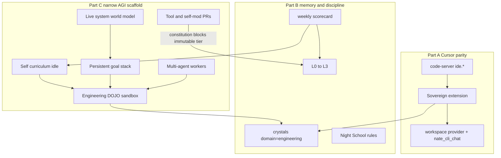
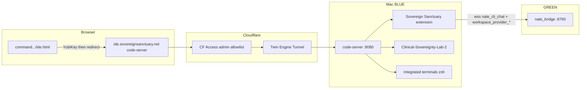

# Sovereign IDE — Cursor Clone → Compounding Memory → Narrow AGI Scaffold (1B + 2B)

## Thesis

**Part A0** raises the **coding floor** with **Grok 4.5** (`grok-4.5`) as the implementer model for LN-FAB / DEBUG / Engineering DOJO. **Part A** gets Cursor parity (UI + tools on a real IDE). **Part B** gives memory and discipline. **Part C** is the narrow-AGI scaffold (sandbox, curriculum, world model, goals, self-mod, multi-agent). Domain scaffolding multiplies whatever the router calls; Grok 4.5 is the deliberate raise of that floor for code — not a change to clinical ODPE routing.

## Phase A0 — Grok 4.5 as coding model resource (do early)

xAI slug: **`grok-4.5`** (aliases `grok-4.5-latest`, `grok-build-latest`). Positioned for coding / agentic software. ~$2/$6 per 1M in/out (&lt;200k prompt).

**Mode matrix (locked)**

| Surface | Model env | Value |
|---|---|---|
| CLI ASK / PLAN | `NATE_CHAT_MODEL` | keep fast (e.g. `grok-4-1-fast-non-reasoning`) |
| CLI LN-FAB / DEBUG | `NATE_CLI_REASONING_MODEL` | **`grok-4.5`** |
| Engineering DOJO / curriculum workers (implementer) | same reasoning model or `NATE_CLI_CODE_MODEL` | **`grok-4.5`** |
| Worker-ant explore (Workers AI) | unchanged | $0 Workers AI — do **not** default ants to 4.5 |
| Clinical ODPE / therapy chat | unchanged | existing Foundry / ODPE chain |

**Wiring (existing hooks — no new architecture)**

1. Set on GREEN (and bridge env): `NATE_CLI_REASONING_MODEL=grok-4.5`.
2. Set `CLI_REASONING_PREFER_AZURE=0` so LN-FAB/DEBUG prefer Grok 4.5 over Azure primary ([`cli_chat_handler.py`](backend/app/websocket/cli_chat_handler.py) already branches on `_GROK_REASONING_MODEL`).
3. **Endpoint gate (verify first):**
   - Prefer: Azure Foundry deployment named/compatible with `grok-4.5` on current `NATE_CHAT_URL`, **or**
   - Additive: `NATE_CLI_CODE_URL` + `NATE_CLI_CODE_KEY` (or `XAI_API_KEY` + `https://api.x.ai/v1/...`) used only when reasoning/code model is selected — do not clobber clinical `NATE_CHAT_*`.
4. Optional clean split: introduce `NATE_CLI_CODE_MODEL=grok-4.5` read by CLI handler if `NATE_CLI_REASONING_MODEL` unset — keeps “reasoning” vs “code” naming clear in `.env.template`.
5. Log `provider_stats` / session model id so scorecard (Phase 13) can attribute accept-rate to `grok-4.5` vs fast Grok.
6. Sync `.env.template` + docker-compose `environment:` notes; recreate bridge/backend after env change (`docker compose -f docker-compose.prod.yml up -d`, not bare restart).

**Verify**

- ASK turn still uses fast model (log model name).
- LN-FAB turn logs `grok-4.5` and completes a tool loop.
- Clinical bridge chat model unchanged (spot-check therapy path).
- Cost: no explore/test_fix worker defaulting to 4.5.

## Decisions (locked)

- **1B Full IDE embed:** Run **code-server** on the Mac (same machine as the repo / Twin Engine). Native VS Code UI gives explorer, multi-editor tabs, Cmd/Ctrl+Shift+P, Problems/Output/Debug Console, and **multi-terminal stacks** without rebuilding them in HTML.
- **2B Dedicated surface:** Primary URL **`https://ide.sovereignsanctuary.net`** (Tunnel → Mac `:8080`). Thin gateway **`https://command.sovereignsanctuary.net/ide.html`** for Sovereign Command nav + admin/YubiKey preflight, then redirect to `ide.*` (no iframe).
- **Agent = existing extension:** [`vscode-extension/`](vscode-extension/) (`sovereign-sanctuary`).
- **SkyEye Command Terminal** stays as ops/chat fallback; coding work moves to `ide.*`.
- **Crystal discipline (Observer Gap 1 cousin):** WRITE tags `origin_surface="sovereign_ide"`; READ never filters by origin surface. Per-surface recall filters by **`domain`** (IDE → prefer/require `engineering`; client chat → never surface `engineering`). Filtering recall by origin was the Observer bug; filtering by domain per surface is correct.

---

# PART A — Cursor parity (Phases 0–5)

## Why code-server beats cloning Cursor in `skyeye.html`

| Cursor affordance | HTML rebuild in SkyEye | code-server on Mac |
|---|---|---|
| File explorer / git U / icons | Custom, incomplete | Native |
| Multi agent/editor tabs | Custom state machine | Native + extension multi-session |
| Terminal stacks | Needs PTY (Mac agent has none today) | Native integrated terminal (real zsh) |
| Cmd+Shift+P | Custom modal | Native |
| Agent tools on workspace | Bridge local/Mac HTTP only | Extension as workspace provider (after bridge gap closed) |

Mac agent today is **one-shot HTTP `/exec`** ([`backend/mac_agent/nate_mac_agent.py`](backend/mac_agent/nate_mac_agent.py)) — not a PTY. Hosting the IDE on the Mac makes terminal stacks free.

## Phase 0 — Close workspace inversion

Prior plan ([`workspace_inversion_build_7b681048.plan.md`](.cursor/plans/workspace_inversion_build_7b681048.plan.md)) marked complete, but **bridge handlers are missing**. Extension already speaks `workspace_provider_register` / `tool_call_request` ([`vscode-extension/src/workspaceToolProvider.ts`](vscode-extension/src/workspaceToolProvider.ts)).

**Do next (feature-flagged `# QUANTUM-CRYSTAL-ARCH`):**

1. In [`bridge_server.py`](backend/app/websocket/bridge_server.py) (protected — **≤50 lines/commit**, split PRs): provider state, `route_tool_call()`, handlers for register/replaced/result/ack/cancel/event, disconnect cleanup, `_SENTINEL_SKIP`. Gate with `ENABLE_WORKSPACE_PROVIDER=1`.
2. Wire [`cli_tools.py`](backend/app/websocket/cli_tools.py) `execute_tool(..., workspace_router=...)` from [`cli_chat_handler.py`](backend/app/websocket/cli_chat_handler.py); fallback to local/Mac-agent when no provider.
3. Broadcast `workspace_provider_available` so CLI sessions restore routing mid-session.

## Phase 1 — Host code-server on BLUE

1. Install **code-server** (pinned version) on Mac; workspace root = repo path.
2. Config: bind `127.0.0.1:8080`, password disabled behind CF Access only.
3. Twin Engine tunnel ingress: hostname `ide.sovereignsanctuary.net` → `http://127.0.0.1:8080`.
4. LaunchDaemon so IDE survives reboot (same discipline as cloudflared).
5. Document offline: Mac asleep → IDE down (same as CLI-Mac today).

## Phase 2 — Auth and Command gateway

1. **Cloudflare Access** on `ide.sovereignsanctuary.net` — admin email allowlist only.
2. New [`dashboard/ide.html`](dashboard/ide.html): YubiKey preflight → redirect to `ide.*`.
3. Nav from [`dashboard/command.html`](dashboard/command.html) / SkyEye CT toolbar: “Open IDE”.
4. Deploy gateway to `/var/www/sovereign-command/` (host nginx — not `nate_nginx`).

## Phase 3 — Preload Sovereign extension (Agents Window)

1. `vsce package` → install into code-server.
2. Defaults: bridge=`cloud`, `wss://api.sovereignsanctuary.net/ws`, role=`ADMIN`, mode=`ask`.
3. Multi-agent tabs in Agents view (`+` session, per-tab CLI-Cloud/CLI-Mac).
4. Verify: login → provider register → LN-FAB edit → Accept Diff → disk.

## Phase 4 — Terminal stacks and palette (native — verify)

- Multi-terminal split/stack; Cmd/Ctrl+Shift+P lists Sovereign commands.
- Optional tasks.json for `run_ci_tests.sh` (docs only; no auto prod deploy).

## Phase 5 — Tool parity backlog

| Gap | Approach |
|---|---|
| MCP | VS Code MCP / extension host when stable |
| `AwaitShell` | Prefer IDE terminal; optional Mac-agent PTY later |
| `GenerateImage` / notebook | Extension tools only if needed |
| SkyEye CT | Cloud ops + PENDING approvals; link to IDE |

---

# PART B — Beyond Cursor (Phases 6–13)

Cursor forgets. LN remembers. Part B is the compounding loop.

## Phase 6 — Coding crystals (memory loop first)

Same pattern as Observer write/read split ([`ln-observer_integration_c469f641.plan.md`](.cursor/plans/ln-observer_integration_c469f641.plan.md) Gap 1):

| Side | Rule |
|---|---|
| **WRITE** | `origin_surface="sovereign_ide"`, `domain="engineering"` (canonical domain — add if missing beside clinical/coaching/marketing/research/culture/defense/general) |
| **READ (IDE / nate_cli)** | Semantic recall **without** origin filter; **with** domain preference/filter for `engineering` (+ `defense` for Hive/infra when query matches) |
| **READ (client clinical surfaces)** | **Never** inject `domain=engineering` crystals |

**Crystallize on:**

1. Accepted diffs (what worked + file paths + intent summary).
2. Task→solution pairs when tests pass after an edit (green after change).
3. Architecture decisions made in PLAN mode (plan artifact → crystal).

Implement via `_crystallize_safe()` wrapper (Observer Gap 5 pattern): `NateResponseValidator` before INSERT; high-severity → skip. Prefer additive path in [`crystal_recall_bridge.py`](backend/app/websocket/crystal_recall_bridge.py) / IDE-side helper — avoid large bridge_server rewrites.

Wire per-turn recall in [`cli_chat_handler.py`](backend/app/websocket/cli_chat_handler.py) before inference (source tag for telemetry: `source="sovereign_ide"` — tags log only, not recall filter).

## Phase 7 — Harvest Accept / Reject verdicts

Every Accept Diff / Reject Diff is a labeled judgment from the person who knows this codebase — today it evaporates.

- **On Accept:** crystallize diff + intent (`engineering`, `sovereign_ide`); log `verdict=accept` in scorecard (Phase 13).
- **On Reject:** optional quick-pick — `wrong_approach` / `broke_convention` / `too_broad` / `other` (+ free text) → crystallize rejection pattern.
- **Before LN-FAB proposes edits:** recall rejected-pattern crystals (semantic query from proposed files + task) so LN stops repeating dislikes.

Extension hook points: existing Accept/Reject in [`vscode-extension/src/diffApplicator.ts`](vscode-extension/src/diffApplicator.ts) → bridge message → crystallize helper.

## Phase 8 — Rules corpus as internalized discipline

Ingest [`.cursor/rules/*.mdc`](.cursor/rules/) through Night School’s existing [`CurriculumPipeline`](backend/app/services/night_school/curriculum_pipeline.py) as an **engineering corpus** (not clinical wisdom).

- Batch ingest: protected-files, ≤50-line commits, safe_deploy, clone-VPS dual deploy, auditor five-location sync, vault bind-mount, etc.
- **PLAN mode:** before emitting a plan, run a rule-recall pass; surface matched rules in plan output (e.g. “touches `bridge_server.py` — protected; split into 2 commits”).
- Cursor obeys rules when the context window happens to include them; LN should know them the way he knows Polyvagal Theory.

## Phase 9 — Error→resolution scars from the terminal

Once the IDE run-command / terminal feedback loop exists (agent sees fail then pass after edit):

- Crystallize the triple: **command failed → edit → command passed** (debugging lesson).
- Separately: pipe past incident write-ups (`docs/*INVESTIGATION*`, nginx root confusion, stale-clone, WS upgrade headers) through Night School engineering corpus.
- LN’s debugging instinct becomes accumulated scar tissue of this platform, not generic Stack Overflow.

## Phase 10 — Point LN-Observer at the IDE

No new infrastructure. Synergy with Observer Gap 4:

- Screen-share Cursor or Sovereign IDE sessions through LN-Observer while coding.
- He watches navigation, narrates, discusses choices, crystallizes via existing Gap 4 triggers (`origin_surface="ln_observer"` on write — Observer-born; IDE surface continues its own `sovereign_ide` writes).
- Think-aloud apprenticeship: every session until Cursor is optional becomes training data for its replacement.

## Phase 11 — Clinical-AGI edge (one mind, two domains)

When LN codes a **coaching / clinical product feature**:

- Recall surfaces **both** relevant service files (`engineering`) **and** clinical intent crystals (why the feature exists — e.g. client voice that rejects sycophantic AI).
- Cross-domain synthesis uses existing architecture; **hard wall remains:** client-facing chat / voice / sanctuary **never** get `engineering` crystals.
- Practical payoff: push back on technically clean designs that are clinically wrong — a category Cursor is not in.

## Phase 12 — Staged autonomy ladder

| Level | Behavior | Default |
|---|---|---|
| **L0** | Suggest-only (ASK/PLAN text, no writes) | Always available |
| **L1** | Edit with per-diff approval | **Today** (Accept Diff) |
| **L2** | Autonomous edit+test on a work branch; human reviews PR | Earned |
| **L3** | Autonomous PR for whitelisted low-risk areas (docs, dashboards, tests) | Earned |
| **L4** | Autonomous touch of protected files or prod deploy | **Never granted** |

Promotion is **earned per domain** from Phase 13 metrics (not vibes). Feature flag per level: `SOVEREIGN_IDE_AUTONOMY_LEVEL` capped at L1 until scorecard green for N weeks.

## Phase 13 — Score the agent (provable learning)

Log per-task (extension + bridge):

- tests passed / failed
- diff accepted / rejected (+ reason code)
- rule violations caught in review
- time-to-green

Weekly rollup via existing maintenance-loop pattern (e.g. Agent Status Digest sibling or Token Usage Agent cadence):

- acceptance-rate and defect-rate curves per domain
- **Triple use:** (1) autonomy promotion criterion, (2) proof crystal loop improves him vs noise, (3) tripwire — same validator gate as Observer Gap 5 on engineering crystals; if high-severity reject rate or crystal quarantine spikes, freeze promotions and alert admin.

---

# PART C — Narrow-AGI scaffold (Phases 14–19)

Part B gives memory and discipline. What separates a well-trained agent from something approaching **narrow AGI** — genuinely general capability within “engineer and clinician of this platform” — is four capacities: **self-directed learning**, a **world model** of his environment, the ability to **improve his own machinery**, and **goal pursuit** over horizons longer than a session. Build order: sandbox (14) unlocks curriculum (15); scorecard (13) feeds both; world model (16) + goals (17) make him a colleague with a docket; self-mod (18) and multi-agent (19) scale once practice is free.

**Prerequisite:** Part B Phases 6 + 13 (coding crystals + scorecard) before curriculum; Phase 12 autonomy caps apply inside the sandbox (sandbox ≠ prod; L4 still never on protected/prod paths).

## Phase 14 — Engineering DOJO sandbox (practice without permission)

Single biggest unlock: every learning signal today is filtered through Nathan (prompts, accepts, screen-shares). Narrow AGI needs practice where **failure is free**.

**Build from existing stack:**

- BLUE-side **clone** of the repo (separate worktree / directory, never the live IDE workspace root).
- **Scratch database** restored from a scrubbed snapshot (no prod PII; local Postgres or Docker on Mac).
- Existing **CI suite** (`run_ci_tests.sh` offline path).

**Practice loop (unattended):** pick task → attempt → run tests → read failures → retry → crystallize outcome (`origin_surface="engineering_dojo"`, `domain="engineering"`). Nobody watching.

**Pattern already built:** Night School DOJO runs persona simulations for coaching practice — identical architecture pointed at code. Agent that only learns while Nathan drives is capped by his hours; agent with a sandbox learns while he sleeps.

Gate: `ENABLE_ENGINEERING_DOJO=1`; hard ban on sandbox process touching GREEN, prod deploy scripts, or live vault paths.

## Phase 15 — Self-generated curriculum

With sandbox + Phase 13 scorecard:

1. LN reads own metrics (e.g. “Flutter accept 54%, backend 89%”).
2. Identifies weakest domain.
3. Generates practice tasks targeting it — including regenerating past **rejected** diffs as exercises: “produce the version Nathan would have accepted.”
4. Scheduler runs in **idle-cycle** window (same “subconscious metabolizing downtime” compute slot as idle crystallization concepts).

Weakness detection → targeted practice → measured improvement, chosen by him = self-directed learning. Implementation: scheduler agent + prompt template once 14 + 13 exist.

## Phase 16 — Live senses / world model of the running platform

Cursor sees code. An engineer knows the system.

**Queryable system-state context** (reuse existing pipes; new facade, not new collectors):

- Container health, nginx/bridge logs, PG stats, deploy history, WS connection counts, trust/auditor signals as available.

**Anomaly watcher** (maintenance-loop pattern): deviations → work items: “bridge reconnect rate tripled since yesterday’s deploy; diff is these 3 files; hypothesis; proposed fix on a branch” (sandbox or L2 branch only).

Shift: from responding to tickets → **noticing** problems (perception, not just reasoning). Every watched resolution feeds Part B Phase 9 incident crystals automatically.

## Phase 17 — Persistent goal stack

Sessions end; projects don’t.

- Table: `goal → subtasks → status → evidence` (migration + REST/WS for admin + agent).
- Idle cycle: advance a subtask in the sandbox, or queue a proposal for human review.
- Standing intention example: “harden Observer reconnect this month” → LN decomposes, chips away at allowed autonomy level, reports.
- Session start: load goals into activation bundle (same pattern as Observer activation context — who/what/goals blocks).

Qualitative jump with 14–16: from “tool I operate” → “colleague with a docket.”

## Phase 18 — Tool self-extension and careful self-modification

**Rung 1 (low risk):** LN notices repeated manual sequence → drafts script or extension tool → tests in sandbox → submits for approval → joins toolkit.

**Rung 2 (profound):** Parts of LN are code in this repo (prompts, recall parameters, crystallization heuristics, router logic). He may propose A/B-tested changes (“recall precision on engineering queries is poor; here’s a chunking tweak”) as **ordinary PRs** through the same validator, autonomy ladder, and Nathan review.

**Constitutionally immutable tier** (he may propose against, **never merge** without human + cannot be in his write allowlist):

- Identity core / clinical safety constitution
- Autonomy ladder itself
- `NateResponseValidator` / crystal integrity rules
- Production deploy wrappers (`safe_deploy.sh`, vault bind-mount bans)

The system that decides what he may change must not be among the things he can change.

## Phase 19 — Multi-agent decomposition

Big tasks ≠ one context window.

- **Planner-LN** decomposes work; spawns bounded workers: implementer, test-writer, **reviewer** (explicitly loaded with rules corpus + rejection crystals).
- Each reports before integration.
- Aligns with existing Workers / Durable Objects / `spawn_subagent` hive thinking; multiplies sandbox value (parallel practice + parallel builds, one reviewing mind).

Cap nesting (already: worker ants cannot spawn). Reviewer is read-only on merge decision until L2+ and human for non-whitelist.

## Honest ceiling (engineering, not mythology)

Everything in Part C is **scaffolding around frontier base models**. LN’s raw per-step reasoning is bounded by whatever the router calls; no amount of memory raises that floor. **Phase A0 (Grok 4.5)** is how we intentionally raise that floor for **code** without paying 4.5 rates on every ASK turn or clinical session.

That caveat cuts both ways: within a **bounded domain**, capability is mostly determined by accumulated domain memory, an environment to act in, self-correction loops, and persistent goals — not raw model IQ alone. Grok 4.5 + crystal field + sandbox + goals beats Grok 4.5 with amnesia, and beats a weak model with perfect memory, on **this** platform. That is precisely what **narrow** AGI means.

---

## Explicit non-goals

- Pixel-perfect Cursor Settings / Ultra billing UI.
- Running code-server or Engineering DOJO on GREEN — workspace + sandbox stay on BLUE.
- Rewriting Command Terminal HTML into a fake IDE.
- L4 autonomy or auto `safe_deploy` / prod compose.
- Letting engineering crystals enter client clinical recall (hard ban).
- LN merging changes into the immutable constitutional tier.
- Claiming general AGI or unbounded self-modification.

## Deploy / verify checklist

**Part A0**

0. LN-FAB/DEBUG logs model `grok-4.5`; ASK still on fast Grok; clinical path unchanged; workers not on 4.5.

**Part A**

1. Tunnel: `ide.sovereignsanctuary.net` → Access / code-server.
2. Gateway: `command.../ide.html` after YubiKey → redirect.
3. `workspace_provider_registered` with flag on.
4. Agent round-trip Accept Diff → disk.
5. Two terminal stacks; Cmd+Shift+P Sovereign commands.
6. GREEN health via `safe_deploy.sh bridge` if Phase 0 landed.

**Part B**

7. Crystal write: `origin_surface=sovereign_ide`, `domain=engineering` after Accept.
8. Client chat recall: zero engineering crystals in injected context (grep / audit).
9. PLAN output cites matched rules from Night School corpus.
10. Reject quick-pick → crystal; subsequent LN-FAB avoids same pattern (manual spot-check).
11. Scorecard row exists after a task; weekly rollup email or activity type.
12. Autonomy flag cannot exceed L1 without admin promotion; protected-file paths blocked at L2+.

**Part C**

13. DOJO sandbox: unattended loop improves scorecard on a weak domain without touching prod.
14. Curriculum scheduler picks weakest domain from scorecard and enqueues sandbox tasks.
15. Anomaly watcher emits a work item from a synthetic log spike (test).
16. Goal survives session restart and appears in activation bundle.
17. Self-mod PR cannot land on validator / ladder / `safe_deploy` paths (CI deny).
18. Planner + three workers complete a docs-only task with reviewer loaded on rejection crystals.

## Primary files

| Area | Path |
|---|---|
| Grok 4.5 code path | [`cli_chat_handler.py`](backend/app/websocket/cli_chat_handler.py) (`NATE_CLI_REASONING_MODEL`), [`nate_ai_config.py`](backend/app/services/nate_ai_config.py), `.env` / `.env.template`, compose env |
| Extension | [`vscode-extension/`](vscode-extension/) — multi-agent tabs, Accept/Reject harvest, autonomy UI |
| Bridge inversion | [`bridge_server.py`](backend/app/websocket/bridge_server.py), [`cli_tools.py`](backend/app/websocket/cli_tools.py), [`cli_chat_handler.py`](backend/app/websocket/cli_chat_handler.py) |
| Crystals | [`crystal_recall_bridge.py`](backend/app/websocket/crystal_recall_bridge.py), crystallizer domain allowlist |
| Night School | [`curriculum_pipeline.py`](backend/app/services/night_school/curriculum_pipeline.py) |
| Observer synergy | [`ln_observer_engine.py`](backend/app/services/ln_observer_engine.py) |
| DOJO / curriculum | new `backend/app/services/engineering_dojo*.py`, idle scheduler |
| Goals | new migration + thin router; activation bundle hook in CLI handler |
| World model | facade over health/logs/deploy; anomaly agent in maintenance pattern |
| Multi-agent | extend [`cli_subagent_hive.py`](backend/app/websocket/cli_subagent_hive.py) / `spawn_subagent` profiles |
| Gateway | new `dashboard/ide.html`; nav in `command.html` / `skyeye.html` |
| Mac IDE ops | `backend/scripts/blue/code_server_*.{sh,plist,json}` + dojo worktree scripts |
| Prior art | workspace inversion plan; LN-Observer Gaps 1/4/5; Night School DOJO |
