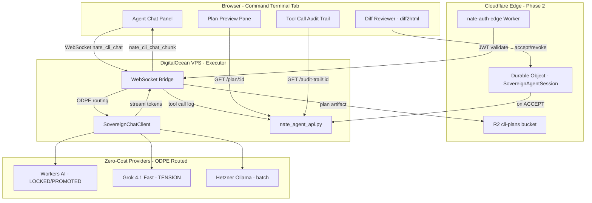

# Little Nate Sovereign IDE

## Core Principle

**Edge Workers are the router, not the executor.** Cloudflare Workers handle auth, routing, staging, and SSE passthrough (CPU limit: 10ms free / 30ms paid). The DigitalOcean VPS runs Python orchestration, tool execution, AI calls, and WebSocket session management with no time limits. This boundary is immutable.




---

## Phase 1: Dashboard Enhancement (Build Now)

### 1A. Streaming Agent Chat Panel

Add a `nate_cli_chat` WebSocket handler to [bridge_server.py](backend/app/websocket/bridge_server.py):

**Message protocol:**

```python
# Inbound from dashboard:
{"type": "nate_cli_chat", "message": "...", "mode": "ln_fab", "cli": "cloud",
 "context": {"active_file": "...", "error_panel": [], "recent_files": []}}

# Streamed response:
{"type": "nate_cli_chat_chunk", "delta": "## Plan\n\n", "provider": "workers_ai"}

# Completion:
{"type": "nate_cli_chat_done", "plan_id": "plan-a8f2e1c4",
 "tool_calls": [...], "provider": "workers_ai", "tokens_used": 0}
```

**Handler logic:**

1. Build mode-specific system prompt (see Mode-to-Tool Mapping below)
2. Call `sovereign_chat_client.generate_streaming()` with ODPE routing
3. Stream `nate_cli_chat_chunk` messages back via WebSocket
4. On completion: parse structured plan content, extract tool calls
5. Store plan artifact in R2 at `cli-plans/{plan_id}.md`
6. Log tool calls to `cli_tool_calls` table
7. Refund tokens if provider was zero-cost (existing refund logic in bridge)

**Frontend in [skyeye.html](dashboard/skyeye.html):**

- Replace Previewer textarea with split-panel: left 60% chat, right 40% plan/diff
- Include `marked.js` + `highlight.js` via CDN for markdown rendering
- WebSocket handlers for `nate_cli_chat_chunk` (append + re-render) and `nate_cli_chat_done` (finalize)
- Chat bubbles: user (gold border) + Nate (cyan border) with streaming animation

### Mode-to-Tool Mapping

Each mode passes a different system prompt and enables a different tool subset. This maps directly to the existing `ct-mode` select in the Command Terminal:


| Mode   | System Prompt Focus                              | Tools Enabled                         | Behavior Tag |
| ------ | ------------------------------------------------ | ------------------------------------- | ------------ |
| plan   | Generate structured markdown implementation plan | write_plan only                       | PLAN-ONLY    |
| ask    | Answer questions, explain code, no edits         | read_file, search, explain            | NO-EDIT      |
| debug  | Diagnose errors, check logs, suggest fixes       | read_file, run_query, read_logs       | NO-EDIT      |
| ln_fab | Implement the plan, generate real file changes   | All: read, write, diff, migrate, test | FULL-EDIT    |


Tool calls are structured as:

```python
{"tool": "read_file", "input": {"path": "backend/app/routers/sessions.py"},
 "output": {"lines": 142, "size": "4.2KB"}, "duration_ms": 12}
```

### 1B. Structured Plan Generation + Preview

**Plan format** (YAML frontmatter + markdown, matching Cursor convention):

```markdown
---
plan_id: plan-a8f2e1c4
mode: ln_fab
target: backend
files:
  - path: backend/app/routers/sessions.py
    action: modify
    lines: "45-67"
  - path: backend/migrations/145_coach_notes.sql
    action: create
status: proposed
coherence_impact: low
---

## Summary
Add `coach_notes` TEXT column to `coaching_sessions`...

## File Changes

### backend/migrations/145_coach_notes.sql (CREATE)
...sql block...

### backend/app/routers/sessions.py (MODIFY lines 45-67)
...diff block...

## Rollback
...rollback sql...
```

**Plan hash** uses the same convention as Cursor:

```python
plan_id = hashlib.sha256(f"{task}{time.time()}".encode()).hexdigest()[:8]
filename = f"{task[:30].replace(' ','-').lower()}_{plan_id}.plan.md"
```

**R2 storage:** `cli-plans/{user_id}/{filename}` in `nate-vault` bucket (zero egress).

**New endpoints in [nate_agent_api.py](backend/app/routers/nate_agent_api.py):**

- `GET /api/nate-agent/plan/{plan_id}` -- fetch plan markdown from R2
- `POST /api/nate-agent/plan/{plan_id}/accept` -- accept all proposed changes, create `source_repair_request`
- `POST /api/nate-agent/plan/{plan_id}/accept-file` -- accept a single file change
- `POST /api/nate-agent/plan/{plan_id}/revoke` -- discard plan, mark `revoked`
- `GET /api/nate-agent/plan/{plan_id}/diffs` -- per-file unified diffs

**Frontend plan preview pane:**

- File tree sidebar (collapsible, action badges: CREATE/MODIFY/DELETE)
- Click file to scroll to its section
- Metadata header (plan_id, status, coherence_impact, provider)

### 1C. Diff Rendering with Accept/Revoke

**Library:** `diff2html` via CDN:

```html
<link rel="stylesheet" href="https://cdn.jsdelivr.net/npm/diff2html/bundles/css/diff2html.min.css">
<script src="https://cdn.jsdelivr.net/npm/diff2html/bundles/js/diff2html-ui.min.js"></script>
```

**Diff rendering:**

```javascript
var html = Diff2Html.html(unifiedDiff, {
  drawFileList: false, matching: 'lines', outputFormat: 'side-by-side'
});
```

**Per-file accept/revoke state machine:**

```
proposed --> accepted --> executing --> completed
proposed --> revoked (terminal)
accepted --> revoked (before execution only)
```

State tracked in `cli_mode_artifacts.review_status` (new column). Phase 1 stages changes in PostgreSQL + R2; Phase 2 migrates staging to Durable Objects.

**Per-file buttons:** Accept (gold) / Revoke (red) on each diff block. "Execute Accepted" button creates a `source_repair_request` with only the accepted file set.

### 1D. Tool Call Audit Trail

**New migration** [backend/migrations/144_command_terminal_v2.sql](backend/migrations/144_command_terminal_v2.sql):

```sql
CREATE TABLE IF NOT EXISTS cli_tool_calls (
  id UUID PRIMARY KEY DEFAULT gen_random_uuid(),
  plan_id TEXT NOT NULL,
  request_id UUID REFERENCES source_repair_requests(id),
  tool_name TEXT NOT NULL,
  tool_input JSONB,
  tool_output JSONB,
  status TEXT DEFAULT 'completed',
  duration_ms INT,
  decision TEXT,      -- accepted / revoked / null
  decided_by TEXT,
  decided_at TIMESTAMPTZ,
  created_at TIMESTAMPTZ DEFAULT NOW()
);
CREATE INDEX IF NOT EXISTS idx_cli_tool_calls_plan ON cli_tool_calls(plan_id);

ALTER TABLE cli_mode_artifacts
  ADD COLUMN IF NOT EXISTS review_status TEXT DEFAULT 'proposed';

ALTER TABLE source_repair_requests
  ADD COLUMN IF NOT EXISTS plan_id TEXT;
```

**Endpoint:** `GET /api/nate-agent/audit-trail/{plan_id}` returns chronological tool call log.

**Frontend:** Collapsible audit trail panel below the diff reviewer. Each tool call rendered as a card: tool icon, input/output as expandable JSON, duration badge, decision badge (gold=accepted, red=revoked, cyan=informational). Chronological order, newest at bottom (terminal-style).

---

## Phase 2: Cloudflare Edge Promotion

### 2A. Durable Object: SovereignAgentSession

Create a new Durable Object class for session-scoped staging. This replaces PostgreSQL staging with edge-native persistence (free, auto-cleanup, lower latency).

**New worker:** `cloudflare/workers/nate-agent-session/` with `wrangler.toml`:

```toml
name = "nate-agent-session"
main = "worker.js"
compatibility_date = "2024-01-01"

[durable_objects]
bindings = [
  { name = "AGENT_SESSION", class_name = "SovereignAgentSession" }
]

[[migrations]]
tag = "v1"
new_classes = ["SovereignAgentSession"]

[[r2_buckets]]
binding = "PLAN_STORE"
bucket_name = "nate-vault"
```

**Durable Object class:**

```javascript
export class SovereignAgentSession {
  constructor(state, env) {
    this.state = state;
    this.env = env;
  }

  async fetch(request) {
    const url = new URL(request.url);
    switch(url.pathname) {
      case '/stage':
        // Proposed change -- NOT committed anywhere yet
        const { planId, diffs } = await request.json();
        const pending = await this.state.storage.get('pending') || [];
        pending.push({ planId, diffs, stagedAt: Date.now() });
        await this.state.storage.put('pending', pending);
        return Response.json({ staged: true });

      case '/accept':
        // Approved -- commit to R2 + notify VPS executor
        const { diffId } = await request.json();
        await this.commitToR2(diffId);
        await this.logToAuditTrail(diffId, 'accepted');
        return Response.json({ committed: true });

      case '/revoke':
        // Rejected -- evict from memory, storage untouched
        const { revokeId } = await request.json();
        await this.evictPendingDiff(revokeId);
        await this.logToAuditTrail(revokeId, 'revoked');
        return Response.json({ revoked: true });

      case '/history':
        const trail = await this.state.storage.get('auditTrail') || [];
        return Response.json(trail);
    }
  }
}
```

### 2B. Edge Auth Gateway (OAuth 2.0 JWT)

Enhance [nate-auth-edge](cloudflare/workers/nate-auth-edge/) to validate real JWTs issued by `oauth_server.py` (M2M `client_credentials` is already implemented but not exposed via HTTP). Wire up:

1. `POST /api/oauth/token` endpoint on the backend (expose `oauth_server.py` grant flow)
2. Auth-edge Worker validates JWT `iss`, `exp`, `scope` claims before routing to VPS
3. Session bootstrap stores validated profile in D1 + KV cache (5-min TTL)

This replaces the current opaque bridge token lookup with standards-based JWT auth at the edge.

### 2C. R2 as Primary Artifact Store

Migrate all plan artifacts, eval results, and audit logs from Azure Blob to R2:

- Plan `.md` files: `cli-plans/{user_id}/{filename}`
- Eval battery results: `cli-evals/{plan_id}/`
- Audit trail exports: `cli-audit/{session_id}/`
- Zero egress fees vs Azure Blob (~$0.087/GB)

---

## Phase 3: VS Code Extension (.vsix)

Reuses the same backend infrastructure. The extension:

- WebView panel with identical chat HTML/CSS (same `marked.js` + `diff2html` rendering)
- `vscode.workspace.applyEdit()` replaces CLI execution for local file changes
- `vscode.window.showTextDocument(fileUri, { selection })` for file navigation
- Plan `.md` files written to `.sovereign/plans/` in workspace (real files, VS Code syntax highlighting renders them)
- WebSocket connects to the same bridge
- Ships as `.vsix` for enterprise developer tool distribution

---

## Zero-Cost Inference Loop

All chat and plan generation uses ODPE routing through existing infrastructure:


| ODPE Signal  | Provider      | Cost            | Typical % |
| ------------ | ------------- | --------------- | --------- |
| LOCKED       | Workers AI    | $0              | ~40%      |
| PROMOTED     | Workers AI    | $0              | ~20%      |
| PROVISIONAL  | Workers AI    | $0              | ~15%      |
| TENSION      | Grok 4.1 Fast | ~$0.00025/query | ~20%      |
| DEEP_TENSION | Grok 4.1 Fast | ~$0.00025/query | <1%       |
| NOISE        | Skip LLM      | $0              | ~5%       |


Token refund happens automatically for zero-cost providers via `BillingSystem.refund_tokens()` in `bridge_server.py`. Internal tokens circulate through the existing free inference pool -- no external API costs for 95%+ of operations.

## Cloudflare Free Tier Budget


| Resource        | Free Limit                       | Use Case                                 |
| --------------- | -------------------------------- | ---------------------------------------- |
| Workers         | 100,000 req/day                  | Auth gate, routing, SSE passthrough      |
| Workers KV      | 100k reads / 1k writes per day   | Session metadata, tool call cache        |
| Durable Objects | 1M requests/month                | Staged diffs, accept/revoke state        |
| R2 Storage      | 10GB, zero egress                | Plan artifacts, eval results, audit logs |
| D1              | 25B rows read, 50M rows write/mo | Edge queries, crystal metadata           |
| Workers AI      | Included                         | Llama 3.1, Whisper, BGE embeddings       |
| Vectorize       | 30M queries/mo free              | Wisdom + memory crystal search           |


**Net new infrastructure cost: $0**

---

## SmartHire Compliance Story

> "Every AI-proposed change is staged in a governed edge layer. Nothing commits to production storage without explicit clinician approval. Every action is logged with the approving user's identity, timestamp, and decision rationale. The audit trail is immutable and session-scoped. All inference runs through our own zero-cost AI infrastructure -- no data leaves the sovereign network."

This maps directly to the eval battery governance architecture: plan -> review -> approve -> execute -> audit.

---

## File Change Summary


| File                                                                                             | Changes                                                                                                                                                      |
| ------------------------------------------------------------------------------------------------ | ------------------------------------------------------------------------------------------------------------------------------------------------------------ |
| [dashboard/skyeye.html](dashboard/skyeye.html)                                                   | Major: split-panel chat + plan/diff layout. Add marked.js, highlight.js, diff2html CDNs. Streaming WebSocket handlers. File tree sidebar. Audit trail panel. |
| [backend/app/websocket/bridge_server.py](backend/app/websocket/bridge_server.py)                 | New `nate_cli_chat` handler: mode-specific system prompts, ODPE streaming, plan parsing, R2 storage, tool call logging.                                      |
| [backend/app/routers/nate_agent_api.py](backend/app/routers/nate_agent_api.py)                   | New endpoints: plan CRUD, per-file diffs, per-file accept/revoke, audit trail.                                                                               |
| [backend/migrations/144_command_terminal_v2.sql](backend/migrations/144_command_terminal_v2.sql) | `cli_tool_calls` table. `review_status` on `cli_mode_artifacts`. `plan_id` on `source_repair_requests`.                                                      |
| [cloudflare/workers/nate-agent-session/](cloudflare/workers/nate-agent-session/)                 | Phase 2: New Durable Object worker for edge staging.                                                                                                         |
| [cloudflare/workers/nate-auth-edge/worker.js](cloudflare/workers/nate-auth-edge/worker.js)       | Phase 2: JWT validation enhancement.                                                                                                                         |
| [backend/app/routers/oauth_api.py](backend/app/routers/oauth_api.py)                             | Phase 2: Wire `POST /api/oauth/token` to `oauth_server.py`.                                                                                                  |


## Deployment Sequence (Phase 1)

1. Apply migration 144
2. Deploy `bridge_server.py` with `nate_cli_chat` handler
3. Deploy `nate_agent_api.py` with plan/diff/audit-trail endpoints
4. Deploy `skyeye.html` to all 3 server directories
5. Restart `nate_bridge` and `nate_backend`
6. Verify streaming chat, plan generation, and diff rendering work end-to-end

