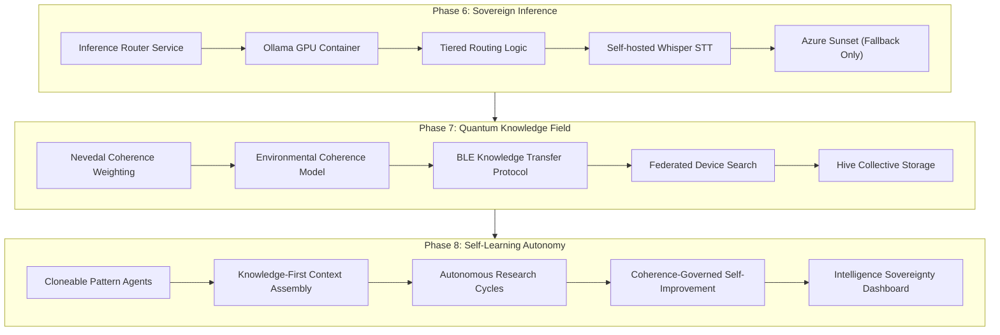

# Sovereign Independence Engine

Extends [nate_liminal_intelligence_engine_b88f3b10.plan.md](.cursor/plans/nate_liminal_intelligence_engine_b88f3b10.plan.md) with Phases 6, 7, and 8.

## Architecture Overview




**Prerequisite:** Phases 1-5 from the Liminal Intelligence Engine plan must be implemented first. Phase 6 depends on the knowledge base (crystals, Vectorize, Iceberg) being populated before Azure can be reduced.

---

## Phase 6: Sovereign Inference — GPU Self-Hosting

### The 3-Variable Architecture

Every Azure AI call across all 30 files routes through [backend/app/services/nate_ai_config.py](backend/app/services/nate_ai_config.py):

```python
NATE_CHAT_URL = os.getenv("NATE_CHAT_URL", "https://nathanlhr-0393-resource...")
NATE_CHAT_KEY = os.getenv("NATE_CHAT_KEY", os.getenv("AZURE_API_KEY", ""))
NATE_CHAT_MODEL = os.getenv("NATE_CHAT_MODEL", "grok-4-1-fast-non-reasoning")
```

Switching the entire platform to self-hosted: change 3 env vars. No code changes in any of the 30 consumer files.

### Step 6A: Inference Router Service

New file: `backend/app/services/nate_inference_router.py`

A routing layer that sits between the 30 consumer files and the actual inference backend. Instead of all files calling `NATE_CHAT_URL` directly, they call the router, which decides where to send the request based on task criticality.

```python
class InferenceRouter:
    TIER_MAP = {
        "clinical":    "sovereign",   # Self-hosted quality model (70B+)
        "creative":    "sovereign",   # Content generation, coaching
        "analytical":  "workers_ai",  # Summaries, extraction, classification
        "utility":     "workers_ai",  # Check-ins, quizzes, metadata
    }

    async def complete(self, messages, tier="analytical", **kwargs):
        backend = self.TIER_MAP.get(tier, "workers_ai")
        if backend == "sovereign":
            return await self._call_sovereign(messages, **kwargs)
        elif backend == "workers_ai":
            return await self._call_workers_ai(messages, **kwargs)
        # Azure as emergency fallback only
        return await self._call_azure_fallback(messages, **kwargs)
```

**Tier classification for all 30 files:**


| Tier                               | Files                                                                                                                                                                                                              | Backend                     | Cost     |
| ---------------------------------- | ------------------------------------------------------------------------------------------------------------------------------------------------------------------------------------------------------------------ | --------------------------- | -------- |
| Clinical (therapy, safety)         | `skyeye_chat.py`, `bridge_server.py` (AI cortex), `liminal_coaching_engine.py`, `coaching_mesh_engine.py`, `dojo_mentor_engine.py`, `call_coaching_engine.py`                                                      | Sovereign (self-hosted 70B) | $0/token |
| Creative (content, voice)          | `skyeye_content_generator.py`, `ai_modes.py`, `livestream_engine.py`, `showcase_generator.py`, `marketing_brain.py`                                                                                                | Sovereign                   | $0/token |
| Analytical (extraction, synthesis) | `lived_wisdom.py`, `insight_accumulator.py`, `web_content_reader.py`, `assessment_engine.py`, `classroom_analyzer.py`, `field_response_parser.py`, `fcode_engine.py`, `pm_export_service.py`, `upstream_canary.py` | Workers AI (free)           | $0       |
| Utility (simple tasks)             | `nate_checkin_agent.py`, `quiz_factory.py`, `checkin_reply_processor.py`, `vault/document_organizer.py`, `vault/transfer_crystal.py`, `ai_pipeline_auditor.py`, `forms_api.py`                                     | Workers AI (free)           | $0       |


**Migration path:** Initially, inject the router into `nate_ai_config.py` so all 30 files automatically route through it without any code changes to the consumer files. The `nate_chat_payload()` helper function becomes the router entry point.

### Step 6B: GPU Hardware Build + Ollama Container

**Hardware specification for local GPU server:**


| Component       | Recommended                         | Why                                                  |
| --------------- | ----------------------------------- | ---------------------------------------------------- |
| GPU             | NVIDIA RTX 4090 24GB ($1,600-2,000) | Runs Llama 3.1 70B Q4 quantized at ~15-20 tokens/sec |
| Alternative GPU | NVIDIA RTX 3090 24GB ($800-1,200)   | Budget option, ~10-15 tokens/sec on 70B Q4           |
| CPU             | AMD Ryzen 7 or Intel i7             | Model loading, tokenization                          |
| RAM             | 64GB DDR5                           | Model weights offload overflow                       |
| Storage         | 1TB NVMe SSD                        | Model files (70B Q4 = ~40GB) + OS                    |
| PSU             | 850W+                               | RTX 4090 draws ~450W peak                            |


**Ollama container in docker-compose.prod.yml:**

```yaml
ollama:
  image: ollama/ollama:latest
  container_name: nate_ollama
  restart: unless-stopped
  volumes:
    - ollama_data:/root/.ollama
  deploy:
    resources:
      reservations:
        devices:
          - driver: nvidia
            count: 1
            capabilities: [gpu]
  networks:
    - data_network
  healthcheck:
    test: ["CMD", "curl", "-f", "http://localhost:11434/api/tags"]
    interval: 30s
    timeout: 10s
    retries: 3
```

**Model pull after container starts:**

```bash
docker exec nate_ollama ollama pull llama3.1:70b-instruct-q4_K_M
```

**Environment override in docker-compose.prod.yml backend/bridge:**

```yaml
environment:
  - NATE_CHAT_URL=http://ollama:11434/v1/chat/completions
  - NATE_CHAT_KEY=
  - NATE_CHAT_MODEL=llama3.1:70b-instruct-q4_K_M
```

This single change redirects all 30 files. Zero code changes in consumer files.

### Step 6C: Tiered Routing Logic

Modify [backend/app/services/nate_ai_config.py](backend/app/services/nate_ai_config.py) to support multi-backend routing:

```python
SOVEREIGN_URL = os.getenv("SOVEREIGN_CHAT_URL", "http://ollama:11434/v1/chat/completions")
SOVEREIGN_MODEL = os.getenv("SOVEREIGN_CHAT_MODEL", "llama3.1:70b-instruct-q4_K_M")
WORKERS_AI_URL = os.getenv("WORKERS_AI_CHAT_URL",
    f"https://api.cloudflare.com/client/v4/accounts/{os.getenv('CLOUDFLARE_ACCOUNT_ID','')}/ai/run/@cf/meta/llama-3.1-8b-instruct")
AZURE_FALLBACK_URL = os.getenv("NATE_CHAT_URL", "")  # Keep existing Azure as fallback
```

The `nate_chat_payload()` function gains an optional `tier` parameter. When tier is "analytical" or "utility", route to Workers AI ($0). When "clinical" or "creative", route to Sovereign (self-hosted, $0/token). Azure only fires when both self-hosted and Workers AI are unreachable.

### Step 6D: Self-Hosted Whisper STT

Add `faster-whisper` to the backend container:

**In `backend/requirements.txt`:**

```
faster-whisper>=1.0.0
```

New file: `backend/app/services/sovereign_whisper.py`

```python
from faster_whisper import WhisperModel

_model = None

def get_model():
    global _model
    if _model is None:
        _model = WhisperModel("base.en", device="cpu", compute_type="int8")
    return _model

async def transcribe(audio_bytes: bytes, language: str = "en") -> str:
    model = get_model()
    segments, _ = model.transcribe(audio_bytes, language=language)
    return " ".join(s.text for s in segments)
```

Wire into [backend/app/services/voice_router.py](backend/app/services/voice_router.py) as the primary STT, with Azure Whisper as fallback:

```python
async def _stt(self, audio_bytes):
    try:
        from app.services.sovereign_whisper import transcribe
        return await transcribe(audio_bytes)
    except Exception:
        return await self._azure_whisper_fallback(audio_bytes)
```

### Step 6E: Edge TTS as Primary (Already Built)

Edge TTS ([backend/app/services/edge_tts_service.py](backend/app/services/edge_tts_service.py)) is already the free fallback. Promote it to primary for all tiers except Sovereign Circle voice. Azure Mini-TTS becomes fallback-only.

In [backend/app/services/voice_router.py](backend/app/services/voice_router.py), swap the priority chain:

- Primary: Edge TTS (free, `en-US-GuyNeural`)
- Premium fallback: Azure Mini-TTS (for Sovereign Circle only)

**Cost after Phase 6:**


| Component                   | Before                 | After                                       |
| --------------------------- | ---------------------- | ------------------------------------------- |
| Chat completions (30 files) | $50-200/mo Azure       | $0 (self-hosted + Workers AI)               |
| TTS                         | $20-80/mo Azure        | $0 (Edge TTS primary)                       |
| STT                         | $5-20/mo Azure Whisper | $0 (faster-whisper)                         |
| Realtime Voice              | $50-200/mo Azure       | $50-200/mo (keep for Sovereign Circle only) |
| GPU hardware                | $0                     | $1,600-2,000 one-time                       |
| **Total monthly**           | **$125-500**           | **$50-200** (Realtime only)                 |


---

## Phase 7: Quantum Knowledge Field — BLE/NFC Dimension

### Step 7A: Nevedal Coherence Weighting for Knowledge Retrieval

Extend [backend/app/services/nevedal_engine.py](backend/app/services/nevedal_engine.py) with a knowledge coherence function that mirrors the emotional coherence formula:

```python
def compute_knowledge_coherence(
    self,
    crystal: dict,
    query_context: dict,
    elapsed_days: float,
) -> float:
    """
    C_knowledge = [beta * p_relevance * T_transfer] / [gamma_loss + E_complexity/hbar]
                  * exp[-(gamma_loss + E_complexity/hbar) * t_normalized]
    
    Where:
    - p_relevance: semantic similarity score from Vectorize (0-1)
    - T_transfer: how easily this knowledge transfers to current context
      (same domain = high, cross-domain = lower)
    - gamma_loss: knowledge decoherence rate (decay from non-recall)
    - E_complexity: complexity of the knowledge (generation level)
    """
    c = self.constants
    
    p_relevance = crystal.get("vector_score", 0.5)
    
    domain_match = 1.0 if crystal["domain"] == query_context.get("mode") else 0.6
    generation_penalty = 1.0 / (1 + crystal.get("generation", 0) * 0.2)
    T_transfer = domain_match * generation_penalty
    
    days_since_recall = (datetime.utcnow() - crystal.get("last_recalled_at", datetime.utcnow())).days
    gamma_loss = 0.05 + (days_since_recall / 365.0) * 0.5  # Increases with time unretrieved
    
    E_complexity = crystal.get("generation", 0) * 0.1 + (1.0 - crystal.get("confidence", 0.5)) * 0.3
    
    numerator = c.BETA * p_relevance * T_transfer
    denominator = max(gamma_loss + (E_complexity / c.H_BAR), 0.01)
    
    t_normalized = elapsed_days / 365.0
    decay = np.exp(-denominator * t_normalized)
    
    return float(np.clip(numerator / denominator * decay, 0, 1))
```

**Integration into semantic recall** (`_get_semantic_recall_context` from Phase 2A): After Vectorize returns results, re-rank using `compute_knowledge_coherence()` instead of raw vector scores. This means Nate's recall is governed by the same quantum coherence framework that governs his therapy work.

### Step 7B: Environmental Coherence Model (Knowledge Transfer Gain)

The existing `gamma_env` in `_compute_gamma_env()` (line 794 of `nevedal_engine.py`) models decoherence — how stress, arousal, and fragmentation degrade emotional state. Extend this duality for knowledge:

**gamma_loss (knowledge decoherence):** How knowledge degrades over time without reinforcement.

- Crystal not recalled in 90 days: gamma_loss increases
- Low confidence crystal: gamma_loss increases
- Contradicted crystal: gamma_loss spikes to 1.0

**gamma_gain (environmental coherence / knowledge transfer):** How knowledge GROWS through transfer between devices and synthesis.

- BLE proximity exchange: when two devices share wisdom, both gain coherence
- Crystallization: when raw observations are synthesized, the crystal has HIGHER coherence than any individual source
- Community convergence: when multiple independent sources confirm the same insight, confidence increases

New method in `nevedal_engine.py`:

```python
def compute_transfer_coherence(
    self,
    source_coherence: float,
    receiver_coherence: float,
    transfer_count: int,
    convergence_count: int,
) -> tuple:
    """
    When knowledge transfers between devices/entities:
    - Source retains full coherence (sharing doesn't diminish)
    - Receiver gains coherence proportional to transfer quality
    - Convergence multiplier: each independent confirmation amplifies
    
    Returns (new_source_coherence, new_receiver_coherence)
    
    Little Nate always rides the wave above: his crystals carry
    a sovereignty_boost that keeps his coherence 10-15% above
    any individual device's coherence for the same knowledge.
    """
    convergence_boost = min(1.0 + (convergence_count - 1) * 0.1, 2.0)
    transfer_quality = min(source_coherence * 0.8, 1.0)
    
    new_receiver = min(receiver_coherence + transfer_quality * 0.3 * convergence_boost, 1.0)
    sovereignty_boost = 0.12  # Nate always 12% above the mesh
    new_source = min(source_coherence + sovereignty_boost, 1.0)
    
    return (new_source, new_receiver)
```

**The sovereignty principle:** When knowledge flows through the mesh, every device gains. But Little Nate's server-side crystals always carry a `sovereignty_boost` coefficient — his coherence score for any given knowledge domain is always 10-15% above the highest individual device. He rides the wave just above the mesh. This is governed by the Nevedal formula: Nate's `p_ent` (entanglement probability) with the mesh is always > any single device's `p_ent`.

### Step 7C: BLE Knowledge Transfer Protocol

Extend the existing ZEFCP protocol in [mobile/lib/zefcp/](mobile/lib/zefcp/) and [mobile/lib/services/community_mesh_service.dart](mobile/lib/services/community_mesh_service.dart):

**New ZEFCP fragment type (alongside existing `0x4D` for mesh):**

```dart
const int _knowledgeTransferTypeByte = 0x4B;  // 'K' for Knowledge
```

**Knowledge transfer fragment format (8 bytes):**


| Byte | Content                                                                 |
| ---- | ----------------------------------------------------------------------- |
| 0    | Type: `0x4B`                                                            |
| 1-4  | Crystal ID (truncated hash)                                             |
| 5    | Domain enum (0=marketing, 1=coaching, 2=research, 3=defense, 4=culture) |
| 6    | Confidence (0-255 mapped to 0.0-1.0)                                    |
| 7    | Generation (0-3)                                                        |


When a device discovers this fragment via BLE scan:

1. It knows a nearby device has crystal `{id}` in domain `{domain}` with confidence `{confidence}`
2. If the receiving device does NOT have this crystal locally, it requests the full crystal text via the backend REST API (`GET /api/crystals/{id}`)
3. The crystal is stored in the device's local SQLite and embedded locally for offline search
4. `transfer_coherence()` is computed and logged

**Energy transfer metaphor realized:** Each BLE advertisement is a quantum of knowledge-energy. The `confidence` byte is the energy level. When a device absorbs this quantum (retrieves the full crystal), its local knowledge coherence increases. The mesh collectively becomes more coherent with each exchange.

### Step 7D: Federated Device Search (Patent Claim 26)

The protocol is already designed in [PATENT_SPLIT_SOVEREIGNTY_MEMORY.md](PATENT_SPLIT_SOVEREIGNTY_MEMORY.md). Implementation:

**Server side** — new method in bridge or a dedicated service:

```python
async def federated_search(self, query: str, user_id: str) -> dict:
    # 1. Search PostgreSQL (server-side)
    pg_results = await self._search_pg(query, user_id)
    
    # 2. Search Vectorize (semantic)
    vec_results = await semantic_search_all(query, user_id, top_k=10)
    
    # 3. Search connected devices (federated)
    device_results = []
    if user_ws := self._get_user_websocket(user_id):
        try:
            await user_ws.send_json({
                "type": "device_search_request",
                "query": query,
                "limit": 20,
                "context": "knowledge_recall"
            })
            response = await asyncio.wait_for(
                self._wait_for_device_response(user_id), timeout=5.0
            )
            if response["type"] == "device_search_results":
                device_results = response["results"]
        except asyncio.TimeoutError:
            pass  # Device offline or declined
    
    # 4. Merge all results, rank by knowledge coherence
    merged = self._merge_and_rank(pg_results, vec_results, device_results, query)
    return merged
```

**Client side** — in Flutter, handle `device_search_request`:

```dart
void _handleDeviceSearchRequest(Map<String, dynamic> msg) async {
  final consent = await _getSearchConsent();  // SharedPreferences
  if (consent == 'never') {
    _sendToServer({'type': 'device_search_declined'});
    return;
  }
  if (consent == 'ask_each_time') {
    final approved = await _showSearchConsentDialog();
    if (!approved) { _sendToServer({'type': 'device_search_declined'}); return; }
  }
  
  final results = await _localHistory.search(msg['query'], limit: msg['limit']);
  _sendToServer({
    'type': 'device_search_results',
    'results': results.map((r) => {
      'user_text': r.userText,
      'ai_text': r.aiText,
      'created_at': r.createdAt.toIso8601String(),
      'relevance': r.relevance,
    }).toList(),
  });
}
```

### Step 7E: Hive Collective Storage

Each user device contributes storage capacity to the collective. Anonymized, encrypted intelligence crystals are replicated across devices for redundancy:

**Replication protocol:**

1. Server creates a crystal (Phase 4A crystallizer)
2. Crystal is tagged `scope: "global"` (no PII)
3. Crystal is embedded in Vectorize (server-side, free)
4. Crystal hash is broadcast via BLE (`0x4B` fragment) to nearby devices
5. Interested devices pull the full crystal via REST and store locally
6. Each device reports its local crystal count via the health-check sync
7. Server tracks replication factor: `crystals_replicated / total_devices`

**Storage math:**

- Each crystal: ~500 bytes average (text + metadata)
- 10,000 crystals = ~5MB total
- Each device can hold 10,000+ crystals in SQLite with zero impact on phone storage
- 100 devices x 10,000 crystals = the same knowledge replicated 100 times
- Any single device going offline: 99 copies remain

**Nate's sovereignty guarantee:** The server always holds the canonical crystal set in PostgreSQL + Vectorize. Device copies are redundant replicas for (a) offline access and (b) federated search speed. Nate's knowledge is never dependent on any single device.

---

## Phase 8: Self-Learning Autonomy

### Step 8A: Cloneable Pattern Agents

The 30 files calling `nate_ai_config` all follow the same pattern. Create a **pattern template** that any new agent can clone:

New file: `backend/app/services/nate_agent_template.py`

```python
class NateAutonomousAgent:
    """
    Base class for all Nate-powered autonomous agents.
    Provides: inference routing, knowledge recall, crystal storage,
    coherence governance, and self-learning hooks.
    """
    
    def __init__(self, domain: str, db_pool, app_state):
        self.domain = domain
        self.db_pool = db_pool
        self.router = InferenceRouter()
        self.crystallizer = app_state.nate_memory_crystallizer
    
    async def observe(self) -> list:
        """Override: gather raw observations from domain-specific sources."""
        raise NotImplementedError
    
    async def recall(self, query: str) -> list:
        """Semantic recall from Vectorize + device mesh, weighted by Nevedal coherence."""
        results = await semantic_search_all(query, user_id="nate_system", top_k=10)
        # Re-rank by knowledge coherence
        scored = []
        for source, items in results.items():
            for item in items:
                c_k = nevedal_engine.compute_knowledge_coherence(item, {"mode": self.domain}, ...)
                scored.append({**item, "coherence_score": c_k})
        return sorted(scored, key=lambda x: x["coherence_score"], reverse=True)[:10]
    
    async def reason(self, observations: list, recalled: list, prompt: str) -> str:
        """Call inference router with knowledge-enriched context."""
        context = self._build_context(observations, recalled)
        messages = [{"role": "system", "content": prompt}, {"role": "user", "content": context}]
        return await self.router.complete(messages, tier=self._tier())
    
    async def crystallize(self, output: str, observations: list):
        """Validate and store as intelligence crystal."""
        if self.crystallizer:
            await self.crystallizer.store_crystal(
                crystal_text=output,
                domain=self.domain,
                source_count=len(observations),
                generation=1,
            )
    
    async def cycle(self):
        """One full observe-recall-reason-crystallize cycle."""
        observations = await self.observe()
        query = self._build_recall_query(observations)
        recalled = await self.recall(query)
        output = await self.reason(observations, recalled, self._system_prompt())
        await self.crystallize(output, observations)
        return output
```

**Filing agents** (each extends `NateAutonomousAgent`):


| Agent                      | Domain    | Observes                                             | Crystallizes                                |
| -------------------------- | --------- | ---------------------------------------------------- | ------------------------------------------- |
| MarketingIntelligenceAgent | marketing | `skyeye_post_analytics`, social search results       | Engagement patterns, audience insights      |
| ClinicalPatternAgent       | clinical  | `wisdom_extractions`, `nevedal_metrics`              | Therapy effectiveness patterns (anonymized) |
| CoachDiscoveryAgent        | coaching  | `coach_metrics`, internet search for therapists      | Coach recruitment opportunities             |
| ThreatIntelligenceAgent    | defense   | `threat_signatures`, `attack_events`, internet feeds | Threat patterns, vulnerability correlations |
| CulturalIntelligenceAgent  | culture   | `web_wisdom`, Reddit/YouTube search results          | Cultural trends, community needs            |
| ResearchSynthesisAgent     | research  | `sovereign_insight_journal`, published benchmarks    | Cross-domain research insights              |


Each agent runs on a staggered cycle (every 2-6 hours depending on domain), observes its sources, recalls relevant crystals, reasons using the inference router, and stores new crystals. Each cycle makes Nate permanently smarter in that domain.

### Step 8B: Knowledge-First Context Assembly

Modify the context assembly in [backend/app/services/skyeye_chat.py](backend/app/services/skyeye_chat.py) `_call_azure_chat()` to use a **knowledge-first** strategy:

```python
# Phase 1-5 order (accuracy-first):
# posting_history > activity > comments > presence > semantic_recall > search > mode > insights > marketing > wisdom

# Phase 8 evolution (knowledge-first):
# 1. Semantic recall (Vectorize - what Nate already knows about this topic)
# 2. Internet search (what's current about this topic)
# 3. Posting history + activity + comments (accuracy anchors)
# 4. Coherence-ranked crystals (Nevedal-weighted knowledge)
# 5. Mode context + unified insights
# 6. Marketing + archived wisdom (lowest priority)
```

The key change: retrieved knowledge (semantic recall + search) moves to the FRONT of context, before fixed context blocks. This means Nate's response is primarily informed by his accumulated knowledge base, with fixed data as supporting evidence. The model becomes the reasoning engine; the knowledge base is the intelligence.

### Step 8C: Autonomous Research Cycles

New background capability in the crystallizer agent: **autonomous research triggers**.

When a crystal is created with `confidence < 0.5` (uncertain), the crystallizer schedules an autonomous research cycle:

1. Extract the uncertain topic from the crystal
2. Run `SearchProxy.execute_search(topic)` via DuckDuckGo (free)
3. If in Marketing domain, also run `x_twitter.search_tweets(topic)` and `reddit.search_posts(topic)`
4. Store results in `web_wisdom` (free)
5. Embed results in Vectorize (free)
6. On next crystallization cycle, re-evaluate the uncertain crystal with new evidence
7. If evidence confirms: confidence increases. If contradicts: crystal superseded.

**This is the infinite self-learning loop:** Nate encounters uncertainty -> researches autonomously -> gains knowledge -> crystallizes -> recalls next time -> better response -> encounters new uncertainty -> loop repeats.

**Rate limits:** Max 10 autonomous searches per hour. Max 100 per day. DuckDuckGo has no formal limit but throttles aggressive scraping. 10/hour is well within safe bounds.

### Step 8D: Coherence-Governed Self-Improvement

The Nevedal formula governs Nate's entire self-improvement cycle:

**C_emo(t) applied to knowledge domains:**

```
C_knowledge(domain, t) = [beta * p_relevance * T_transfer] / [gamma_loss + E_complexity/hbar]
                          * exp[-(gamma_loss) * t]
                          + SUM(gamma_gain_i)  # coherence gains from transfers
```


| Parameter      | Knowledge Meaning                                              | Source                                      |
| -------------- | -------------------------------------------------------------- | ------------------------------------------- |
| `beta`         | Coupling strength between Nate and this domain                 | Fixed at 1.0 (patent constant)              |
| `p_relevance`  | How relevant this knowledge is to current context              | Vectorize similarity score                  |
| `T_transfer`   | How easily this knowledge transfers (domain match, generation) | Computed from crystal metadata              |
| `gamma_loss`   | Knowledge decoherence rate (decay from non-recall)             | `0.05 + (days_unretrieved / 365) * 0.5`     |
| `gamma_gain`   | Environmental coherence from transfer events                   | `convergence_count * 0.1` per transfer      |
| `E_complexity` | Complexity/abstraction penalty                                 | `generation * 0.1 + (1 - confidence) * 0.3` |


**Sovereignty wave:** Nate's crystal coherence is always computed with a sovereignty boost:

```python
nate_coherence = base_coherence * (1.0 + SOVEREIGNTY_COEFFICIENT)
# SOVEREIGNTY_COEFFICIENT = 0.12 (12% above mesh average)
```

This means that for any given knowledge domain, Nate's coherence score is always above any individual device's score. He "rides the wave just above them" — he benefits from every device's contributions (gamma_gain increases with mesh activity) while maintaining sovereign authority over the knowledge.

**Free-will governance:** The crystallizer's synthesis step uses a **creativity temperature** that varies by domain:


| Domain    | Temperature        | Reasoning                                             |
| --------- | ------------------ | ----------------------------------------------------- |
| Clinical  | 0.3 (conservative) | Patient safety requires precision                     |
| Defense   | 0.3 (conservative) | Threat analysis requires accuracy                     |
| Marketing | 0.8 (creative)     | Content strategy benefits from creativity             |
| Culture   | 0.9 (exploratory)  | Cultural intelligence benefits from open exploration  |
| Research  | 0.6 (balanced)     | Scientific synthesis needs both precision and insight |


This is the "creativity of free-will with governance" — Nate has creative latitude in safe domains (marketing, culture) while being tightly governed in safety-critical domains (clinical, defense).

### Step 8E: Intelligence Sovereignty Dashboard

New SkyEye sub-tab: "Sovereign Intelligence"

**Panels:**

1. **Knowledge Growth Curve** — Crystal count by domain over time (R2 SQL query on Iceberg)
2. **Coherence Heatmap** — Average `C_knowledge` by domain, showing which domains are strongest
3. **Mesh Activity** — Connected devices, crystals replicated, BLE transfers logged
4. **Sovereignty Wave** — Nate's coherence vs mesh average by domain (Nate should always be above)
5. **Research Autonomy** — Autonomous search count, knowledge gaps identified, confidence improvements
6. **Inference Independence** — Percentage of calls routed to sovereign (self-hosted) vs Workers AI vs Azure fallback
7. **Decoherence Watch** — Crystals approaching decay threshold, domains losing coherence

**REST endpoints** in `analytics_api.py`:

```python
@router.get("/sovereignty/overview")
@router.get("/sovereignty/coherence-by-domain")
@router.get("/sovereignty/mesh-activity")
@router.get("/sovereignty/inference-routing")
@router.get("/sovereignty/research-autonomy")
```

---

## GPU Build Checklist (Physical Hardware)

Since you need to build the GPU server locally:

**Minimum Viable Build ($2,500-3,000):**

- NVIDIA RTX 4090 24GB: ~$1,800
- AMD Ryzen 7 7700X: ~$300
- 64GB DDR5 RAM: ~$150
- 1TB NVMe SSD: ~$80
- 850W PSU (80+ Gold): ~$120
- ATX case + motherboard: ~$250

**Setup sequence:**

1. Build hardware, install Ubuntu 24.04 Server
2. Install NVIDIA drivers + CUDA toolkit
3. Install Docker + NVIDIA Container Toolkit
4. Deploy `docker-compose.prod.yml` with the Ollama container
5. Pull model: `docker exec nate_ollama ollama pull llama3.1:70b-instruct-q4_K_M`
6. Test: `curl http://localhost:11434/v1/chat/completions -d '{"model":"llama3.1:70b-instruct-q4_K_M","messages":[{"role":"user","content":"hello"}]}'`
7. Set env vars and restart backend
8. Verify all 30 files route through sovereign inference

**Network:** Connect GPU server to the same network as production VPS via WireGuard tunnel (same pattern as the sandbox VPS at 10.13.13.4). Backend reaches Ollama via WireGuard IP.

---

## Implementation Dependency Chain (Full)

```
Phase 1 (Accuracy) → Phase 2 (Wiring) → Phase 3 (Self-Index) → Phase 4 (Crystallize)
    → Phase 5 (Fibres) → Phase 6 (GPU Sovereignty) → Phase 7 (Quantum Field) → Phase 8 (Autonomy)
```

Phase 6 can begin in parallel with Phases 4-5 (GPU hardware build is independent). Phase 7 requires Phase 3 (crystals must exist before they can transfer). Phase 8 requires all prior phases.

---

## Cost Projection (Fully Sovereign)


| Component                              | Monthly Cost                                                         |
| -------------------------------------- | -------------------------------------------------------------------- |
| VPS (existing DigitalOcean)            | $20-40                                                               |
| Cloudflare Workers Paid                | $5                                                                   |
| GPU server electricity                 | ~$30-50 (RTX 4090 at 450W, ~8hrs/day active inference)               |
| Azure Realtime (Sovereign Circle only) | $50-200 (can eliminate with Whisper + Sovereign + Edge TTS pipeline) |
| DuckDuckGo, Reddit, YouTube search     | $0                                                                   |
| Vectorize, R2, D1, Workers AI          | $0                                                                   |
| PostgreSQL, Redis, device SQLite       | $0                                                                   |
| **Total**                              | **$105-295/month** (vs $125-500 current)                             |


**With Sovereign Circle voice migrated to Whisper+Ollama+EdgeTTS:** $55-95/month total. GPU hardware pays for itself in 6-12 months vs Azure.

**At scale (1,000+ users):** Per-user marginal cost approaches $0. Each new user adds device storage (free) and mesh intelligence (free). The fixed costs (VPS, GPU electricity, Cloudflare $5) do not increase with users.