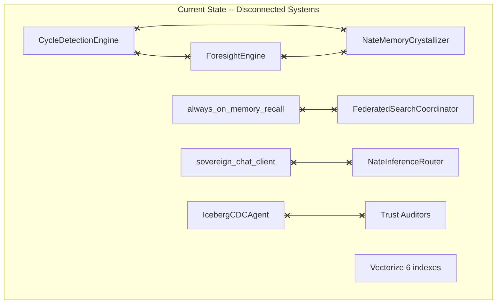
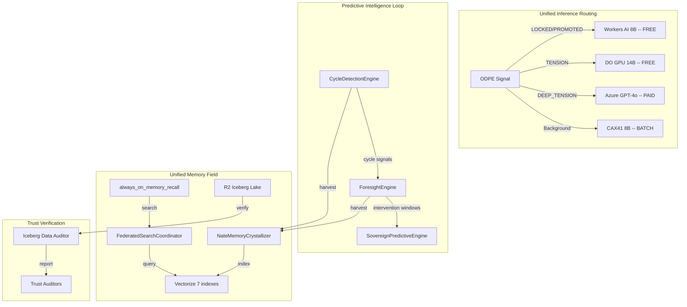

# Sovereign Inference + Predictive Intelligence Alignment Build

## Current State -- 8 Integration Gaps

The codebase has powerful systems that are **not connected to each other**:

- `sovereign_chat_client.py` (bridge therapy) and `nate_inference_router.py` are **separate inference paths** -- therapy bypasses ODPE-aware routing
- `CycleDetectionEngine` is **isolated** from `ForesightEngine` -- detected cycles don't feed forecasting
- Cycle detections and foresight alerts are **never crystallized** into Little Nate's long-term memory
- Cycle data is **not indexed in Vectorize** -- Little Nate can't semantically recall cycle patterns
- `always_on_memory_recall()` **bypasses** `FederatedSearchCoordinator` -- skips coherence re-ranking and context budgets
- Trust auditors **don't verify** R2 Iceberg lake data integrity
- `distributed_inference_config.py` defines impossible models on CAX41 (14B/32B on ARM CPU)




## Target State -- Unified Intelligence Architecture




---

## Phase 1: DO GPU Infrastructure (Server-Side)

SSH to DigitalOcean GPU droplet:

- Install Ollama, pull `qwen2.5:14b-instruct-q4_K_M`
- Set `OLLAMA_KEEP_ALIVE=-1`, `OLLAMA_NUM_PARALLEL=4`
- Configure WireGuard tunnel (assign `10.13.13.X`)
- Pull `llama3.1:8b-instruct-q4_K_M` as fallback
- Verify GPU inference with `curl` test

---

## Phase 2: Unify Inference Paths

**Problem**: `sovereign_chat_client.py` (therapy) and `nate_inference_router.py` are separate. Therapy bypasses ODPE routing.

**Solution**: Refactor `sovereign_chat_client.py` to add DO GPU + Workers AI as providers and use ODPE signal routing:

In [sovereign_chat_client.py](backend/app/services/sovereign_chat_client.py):

- Add `_DO_GPU_URL` from `DIGITAL_OCEAN_INFERENCE_URL`
- Add `_WORKERS_AI_URL` / `_WORKERS_AI_TOKEN` streaming support
- Replace the binary Sovereign/Azure routing with ODPE-aware cascade:
  - LOCKED/PROMOTED: Workers AI -> DO GPU -> Azure
  - TENSION: DO GPU -> Azure (no Workers AI for clinical safety)
  - DEEP_TENSION: Azure -> DO GPU
  - PROVISIONAL: DO GPU -> Workers AI -> Azure
  - NOISE: skip LLM
  - Background: CAX41 -> Workers AI

In [nate_inference_router.py](backend/app/services/nate_inference_router.py):

- Update tier priorities: `TIER_CLINICAL` routes to `digitalocean` (not `sovereign`)
- `TIER_REALTIME` routes to `digitalocean, workers_ai, azure` (not just `azure`)
- `_resolve_sovereign_model()` uses DO GPU's 14B for TENSION, not CAX41's nonexistent models

In [distributed_inference_config.py](backend/app/services/distributed_inference_config.py):

- Remove `hetzner-14b` and `hetzner-32b` nodes (impossible on ARM CPU)
- Add `do-gpu` node with `qwen2.5:14b-instruct-q4_K_M`
- Mark `hetzner-primary` as `batch_only=True`

---

## Phase 3: Wire Predictive Intelligence Loop

**Problem**: `CycleDetectionEngine` and `ForesightEngine` are isolated. Detected cycles don't feed forecasting.

**Solution**: Create a bidirectional link:

In [foresight_engine.py](backend/app/services/foresight_engine.py):

- Add `set_cycle_engine(engine)` method
- In `synthesize_streams()`, add a 5th stream: **Cycle Signals** -- query `cycle_detections` for active cycles with confidence > 0.6, feed detected periodicities and phases into forecasting
- Weight cycle stream at 0.20 (reduce others proportionally)
- In `forecast_coherence()`, when a cycle with a known period aligns with the forecast window, adjust the prediction envelope using the cycle's amplitude and phase

In [main.py](backend/app/main.py):

- After both engines initialize, call `foresight_engine.set_cycle_engine(cycle_detection_engine)`

In [cycle_detection_engine.py](backend/app/services/cycle_detection_engine.py):

- Add `get_active_cycles(user_id, min_confidence=0.6)` method that returns recent detected cycles with domain, period, phase, amplitude, and confidence -- this is what `ForesightEngine` will query

---

## Phase 4: Crystallize Predictive Intelligence

**Problem**: Cycle detections and foresight alerts never enter Little Nate's long-term memory. He can't recall "this client has a 14-day emotional cycle" or "coherence drop predicted next week."

**Solution**: Add harvest sources to the crystallizer:

In [nate_memory_crystallizer.py](backend/app/services/nate_memory_crystallizer.py) `_harvest_cycle()`:

- Add query for `cycle_detections` where `confidence > 0.7` and `detected_at > last_harvest`
- Format as fragments: `"Cycle detected: {domain} cycle with {period}-day period for user {user_id}, confidence {confidence}, phase: {phase}"`
- Domain: `clinical` for addiction/harm/criminal/sexual_desire; `coaching` for emotional/coping/legacy; `research` for others
- Add query for `foresight_alerts` where `status = 'active'` and `created_at > last_harvest`
- Format as fragments: `"Foresight alert: {alert_type} -- {description}, confidence {confidence}"`

---

## Phase 5: Add Vectorize Index for Predictive Data

**Problem**: Cycle detections and predictions are not in Vectorize. Little Nate can't semantically search "what cycles has this client shown?" during therapy.

**Solution**: Add a 7th Vectorize index:

In [vectorize_service.py](backend/app/services/vectorize_service.py):

- Add `predictive` to `INDEX_NAMES`: `nate-predictive`
- Add `index_cycle_detection(user_id, domain, period, phase, amplitude, confidence, prediction_text)` method
- Add `index_foresight_alert(alert_id, user_id, alert_type, description, confidence)` method

In [cycle_detection_engine.py](backend/app/services/cycle_detection_engine.py):

- After storing a detection in `cycle_detections`, call `vectorize_service.index_cycle_detection()`

In [foresight_engine.py](backend/app/services/foresight_engine.py):

- After creating a foresight alert, call `vectorize_service.index_foresight_alert()`

In [quantum_knowledge_field.py](backend/app/services/quantum_knowledge_field.py):

- Add `predictive` to the domain -> index mapping for `clinical` and `coaching` domains

Update trust baseline: `vectorize_pipeline_check_count` from 12 to 14 (add 2 checks for the new index: retrieval quality + metadata schema)

---

## Phase 6: Route Always-On Memory Through Federated Search

**Problem**: `always_on_memory_recall()` calls `vectorize_service.semantic_search_all()` directly, bypassing `FederatedSearchCoordinator`'s coherence re-ranking, context budgets, and sovereignty coefficient.

**Solution**: In [bridge_server.py](backend/app/websocket/bridge_server.py) `always_on_memory_recall()`:

- Replace `vectorize_service.semantic_search_all(query, ...)` with `federated_search.search(query, domain, user_id, context_budget=...)`
- Pass the ODPE signal from the current session context so `context_budget` is signal-aware
- The `FederatedSearchCoordinator` already runs PG crystals + Vectorize in parallel and re-ranks by coherence -- this gives Little Nate higher-quality recall

In [quantum_knowledge_field.py](backend/app/services/quantum_knowledge_field.py) `FederatedSearchCoordinator.search()`:

- Add `include_predictive=True` parameter that includes the new `nate-predictive` index in the search
- Ensure `search()` respects `index_subset` from ODPE routing (already partially wired)

---

## Phase 7: Iceberg Lake Trust Verification

**Problem**: Trust auditors only verify PostgreSQL and REST endpoints. The R2 Iceberg data lake (`IcebergCDCAgent` writes 11 tables) is completely unaudited. If CDC stops pushing or R2 data drifts from PG, nobody notices.

**Solution**: Expand the `VectorizePipelineAuditor` to include Iceberg checks:

In [vectorize_pipeline_auditor.py](backend/app/services/vectorize_pipeline_auditor.py):

- Add Tab 5: "Iceberg Data Lake" with 4 checks:
  1. `cdc_agent_alive` -- verify `app.state.iceberg_cdc_agent` is not None and has run within 30min
  2. `cdc_last_push_fresh` -- query `skyeye_activity` for `iceberg_cdc_push` events, verify freshness
  3. `crystal_count_sync` -- compare `COUNT(*)` from PG `nate_intelligence_crystals` vs R2 SQL (via `R2AnalyticsService`); flag if delta > 5%
  4. `wisdom_count_sync` -- compare PG `wisdom_extractions` count vs R2 SQL; flag if delta > 5%

Update trust baseline: `vectorize_pipeline_check_count` from 14 (after Phase 5) to 18 (+4 iceberg checks)

Total vectorize pipeline checks: 12 (existing) + 2 (predictive index from Phase 5) + 4 (iceberg from Phase 7) = 18

---

## Phase 8: Provider-Aware Billing (Zero-Cost Tokens)

In [bridge_server.py](backend/app/websocket/bridge_server.py), after streaming completes:

```python
if provider_used in ("do_gpu", "workers_ai", "sovereign"):
    billing.add_token_usage(uid, token_estimate, deduct_balance=False, source="ai_chat")
else:
    billing.use_tokens(uid, token_estimate, source="ai_chat")
```

Add a `provider` column to `token_transactions` via migration so cost analytics can track per-provider usage.

---

## Phase 9: Environment, Deploy Config, and Rules

**.env.template** updates:

- `DIGITAL_OCEAN_INFERENCE_URL=http://10.13.13.X:11434`
- `DIGITAL_OCEAN_MODEL=qwen2.5:14b-instruct-q4_K_M`
- `WORKERS_AI_URL`, `WORKERS_AI_TOKEN`
- `SCALING_LEVEL=3`
- `SOVEREIGN_HAS_GPU=false`

**docker-compose.prod.yml**: Add all new env vars to both `backend` and `bridge` `environment:` blocks.

**Rule updates**:

- `sovereign-inference-routing.mdc` -- DO GPU as primary, CAX41 as batch
- `sandbox-vps-infrastructure.mdc` -- Add DO GPU droplet details
- `token-economics-architecture.mdc` -- Zero-cost for sovereign providers
- `service-health-49-49.mdc` -- Update vectorize pipeline check count to 18

---

## Key Files Modified


| File                                                   | Changes                                                            |
| ------------------------------------------------------ | ------------------------------------------------------------------ |
| `backend/app/services/sovereign_chat_client.py`        | Add DO GPU + Workers AI providers, ODPE-aware cascade              |
| `backend/app/services/nate_inference_router.py`        | Update tier priorities for DO GPU                                  |
| `backend/app/services/distributed_inference_config.py` | Remove impossible CAX41 models, add DO GPU node                    |
| `backend/app/services/foresight_engine.py`             | Add cycle signal stream, `set_cycle_engine()`                      |
| `backend/app/services/cycle_detection_engine.py`       | Add `get_active_cycles()`, Vectorize indexing                      |
| `backend/app/services/nate_memory_crystallizer.py`     | Harvest from `cycle_detections` + `foresight_alerts`               |
| `backend/app/services/vectorize_service.py`            | Add `nate-predictive` index (7th)                                  |
| `backend/app/services/quantum_knowledge_field.py`      | Add `predictive` to domain mapping, `include_predictive` param     |
| `backend/app/websocket/bridge_server.py`               | Route always-on memory through federated search; zero-cost billing |
| `backend/app/services/vectorize_pipeline_auditor.py`   | Add Iceberg lake trust checks                                      |
| `backend/app/main.py`                                  | Wire `foresight_engine.set_cycle_engine()`                         |
| `backend/migrations/XXX_predictive_vectorize.sql`      | `provider` column on `token_transactions`                          |
| `.env.template`                                        | DO GPU + Workers AI vars                                           |
| `docker-compose.prod.yml`                              | Add new env vars to backend + bridge                               |
| 4 rule files                                           | Update routing, infrastructure, billing, health docs               |


---

## Expected Outcome


| Metric                        | Before                 | After                                   |
| ----------------------------- | ---------------------- | --------------------------------------- |
| Real-time TTFT (LOCKED)       | 82-114s (CAX41 CPU)    | <1s (Workers AI)                        |
| Real-time TTFT (TENSION)      | 82-114s or Azure ($$$) | ~1-3s (DO GPU, free)                    |
| Azure monthly cost (1K users) | $1,500-3,000           | $50-150                                 |
| Cycle data in Nate's memory   | Not crystallized       | Crystallized + Vectorized               |
| Foresight alerts in memory    | Not crystallized       | Crystallized + Vectorized               |
| Cycle signals in forecasting  | Isolated               | 5th stream in ForesightEngine           |
| Always-on memory quality      | Raw Vectorize only     | Coherence re-ranked via FederatedSearch |
| Iceberg data lake trust       | Unaudited              | 4 checks 3x daily                       |
| Vectorize indexes             | 6                      | 7 (+ nate-predictive)                   |
| Vectorize pipeline checks     | 12                     | 18                                      |
| Zero-cost query percentage    | 0%                     | ~95%                                    |


