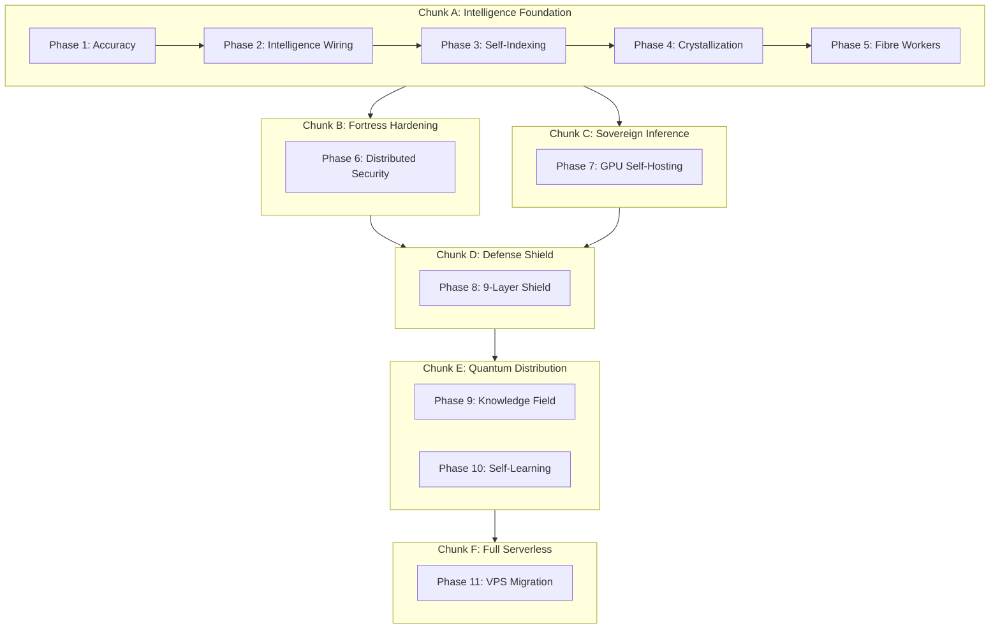

# Sovereign Quantum Nate — Unified Build Plan

> **IMPORTANT:** This is a 61-todo megaplan. Execute in phases, not all at once.
> **Execution chunks:** A (Phases 1-5), B (Phase 6), C (Phase 7), D (Phase 8), E (Phases 9-10), F (Phase 11)
> **Parallel tracks:** Chunk C (GPU build) runs alongside Chunk B. All others are sequential.
> **Many phases are already partially complete** — validate current state before starting each phase.

This plan consolidates and supersedes three prior plans:

- [nate_accuracy_enforcement_c9c12c88.plan.md](.cursor/plans/nate_accuracy_enforcement_c9c12c88.plan.md) (retired — merged into Phase 1)
- [nate_liminal_intelligence_engine_b88f3b10.plan.md](.cursor/plans/nate_liminal_intelligence_engine_b88f3b10.plan.md) (retired — merged into Phases 1-5)
- [sovereign_independence_engine_647df484.plan.md](.cursor/plans/sovereign_independence_engine_647df484.plan.md) (retired — merged into Phases 7, 9, 10)

New additions: Phase 6 (Distributed Security Hardening), Phase 8 (Distributed Defense Shield), Phase 11 (Serverless Migration)

## Dependency Chain

**Parallel tracks:** Chunk C (GPU build) can start alongside Chunk B. Phase 7 hardware procurement is independent of code work. All other phases are sequential.

---

## Phase 1: Accuracy Foundation (6 items)

All work in [backend/app/services/skyeye_chat.py](backend/app/services/skyeye_chat.py). Prerequisite for everything — self-indexing without accuracy enforcement creates persistent false memories.

- **1.1 Harden YOUR ACCURACY RULES** — Add entity rules (never invent people/scores), data absence rules (0 RECORDS = say so), capability honesty rules (dead code = "not yet wired"). Move to TOP of `LITTLE_NATE_SYSTEM_PROMPT` (before identity).
- **1.2 Empty Data Guards** — All 8 context functions return explicit `[SECTION: 0 RECORDS]` markers instead of silent `""` when empty. Functions: `_get_mode_context`, `_get_archived_wisdom_context`, `_get_unified_insight_context`, `_get_activity_timeline_context`, `_get_liminal_presence_context`, `_get_recent_comments_context`, `_build_marketing_authority_context`, `_build_campaign_context`.
- **1.3 Response Validator** — New file `backend/app/services/nate_response_validator.py`. Post-generation hallucination scanner (log-only mode). Detects: fabricated scores, invented timestamps, capability overreach, unknown entity references. Wired after Azure response in `_call_azure_chat()`, logs to `skyeye_activity` type `nate_accuracy_warning`.
- **1.4 Dead Code Honesty** — Update YOUR OPERATIONAL AWARENESS: Drip Scheduler ("built but not wired"), Trust Enforcer ("30 auditors"), add missing agents (Web Content Reader, Community Mesh Engine, Nate Check-In). Fix YOUR PLATFORM CAPABILITIES for campaign design bug.
- **1.5 Truth Audit Command** — New `_truth_audit()` method. Triggered by "audit your claims" / "fact check yourself". Cross-references last 10 Nate messages against `skyeye_content_queue`, `users`, `skyeye_social_memory`. Returns verified/unverifiable/contradicted counts.
- **1.6 Context Reordering** — Reorder concatenation in `_call_azure_chat()`: posting_history + activity_timeline + comments FIRST (survive 32K truncation), archived_wisdom LAST (least reliable, truncated first).

---

## Phase 2: Intelligence Wiring (4 items)

- **2.1 Vectorize Semantic Recall** — New `_get_semantic_recall_context()` in [skyeye_chat.py](backend/app/services/skyeye_chat.py). Calls existing `semantic_search_all()` from [vectorize_service.py](backend/app/services/vectorize_service.py). 4K char budget, score threshold >= 0.65, formats as `[SEMANTIC RECALL — N memories]`.
- **2.2 Internet Search** — New `_get_internet_search_context()`. Wires existing [search_proxy.py](backend/app/services/search_proxy.py) (DuckDuckGo/Bing) into Big Nate Chat. Intent detection for INQUIRY/MARKETING/STRATEGY/BRIEFING/DEFENSE modes. 3K char budget, max 1 search/message, 30s cooldown. Stores results in `web_wisdom`. Provider-agnostic: any search backend (DuckDuckGo, Brave, SearXNG, etc.) can plug in.
- **2.3 Night School Wisdom** — New `_get_night_school_context()`. Reads from existing `NightSchoolDirector` on `app.state`. 2K char budget. Gives Nate access to approved coaching curriculum.
- **2.4 Social Platform Search** — Add `search_videos()` to [youtube.py](backend/app/services/platforms/youtube.py) and `search_posts()` to [reddit.py](backend/app/services/platforms/reddit.py). Wire into `_get_internet_search_context()` as supplementary sources. Architecture supports any future platform adapter with a `search()` method — not limited to YouTube/Reddit.

---

## Phase 3: Self-Indexing Pipeline (4 items)

- **3.1 Index Big Nate Chat** — After storing response in `skyeye_chat`, call existing `index_conversation()` from [vectorize_service.py](backend/app/services/vectorize_service.py) with `user_id="nate_system"` into `nate-memory-search` index.
- **3.2 Intelligence Crystals Table** — New migration `backend/migrations/NNN_nate_intelligence_crystals.sql`. Schema: `crystal_text`, `domain`, `topics[]`, `scope`, `source_count`, `generation`, `confidence`, `embedding_id`, `context_start/end`, `last_recalled_at`, `recall_count`, `superseded_by`. Indexes on domain, scope, confidence, generation, recalled.
- **3.3 CDC Registration** — Add `nate_intelligence_crystals` to `CDC_TABLES` in [iceberg_cdc_agent.py](backend/app/services/iceberg_cdc_agent.py). Add R2 analytics query `intelligence_growth()` in [r2_analytics_service.py](backend/app/services/r2_analytics_service.py).
- **3.4 Campaign Email Wiring** — Wire `send_campaign_touchpoint()` in [skyeye_session_engine.py](backend/app/services/skyeye_session_engine.py) `_post_phase()` after successful campaign post.

---

## Phase 4: Crystallization Engine (4 items)

- **4.1 Memory Crystallizer Agent** — New file `backend/app/services/nate_memory_crystallizer.py`. 30-min harvest cycle (skyeye_chat, web_wisdom, wisdom_extractions). 6h cluster cycle (embed, cosine similarity >= 0.75, 3+ items = candidate). Synthesize via inference router. Validate via `NateResponseValidator`. Store in `nate_intelligence_crystals` + embed in Vectorize `nate-wisdom`.
- **4.2 Forgetting and Decay** — 6h decay scan: archive crystals unretrieved 90 days with recall_count < 3 to cold storage, remove from Vectorize. Confidence pruning: gen >= 1, confidence < 0.3 after 30 days. Contradiction resolution: supersede old crystals when new contradictory crystal has higher confidence. Recall tracking: update `last_recalled_at` + `recall_count` on every semantic recall hit.
- **4.3 Privacy Scoping** — Enforce `scope` on all crystal creation. Rules: Big Nate Chat = `admin_only`, marketing = `global`, client sessions = `user:{username}`, aggregated coaching (min 5 clients) = `global`, defense = `admin_only`. Recall filtering: Big Nate Chat sees global + admin_only; client chat sees global ONLY.
- **4.4 Temporal Metadata** — Every crystal carries `context_start/end`. Re-rank semantic recall: `vector_score * 0.7 + recency_score * 0.3` where `recency_score = 1.0 / (1 + days_since_context_end / 30)`. Boost wider spans for "trends" queries, recent spans for "current" queries.

---

## Phase 5: Fibre Knowledge Workers + Service Registration (4 items)

- **5.1 Fibre Crystallization Hooks** — Add `crystallize()` base method to [fibre.py](backend/app/models/fibre.py). Default delegates to `NateMemoryCrystallizer.synthesize_cluster()`. Wire into fibre `execute()` cycle.
- **5.2 Domain Specialized Fibres** — Extend CAMPAIGN, CULTURAL_SENTINEL, FORESIGHT_ANALYST, COACH_SUPPORT, COMMUNITY fibres with crystallization behavior. Each observes domain-specific tables and produces domain-tagged crystals.
- **5.3 Intelligence Growth Dashboard** — New REST endpoints in [analytics_api.py](backend/app/routers/analytics_api.py): `/intelligence/growth`, `/intelligence/domains`, `/intelligence/decay`. New SkyEye sub-tab visualizing crystal count, confidence, domain breakdown, recall frequency.
- **5.4 Register New Services** — Register `nate_response_validator` and `nate_memory_crystallizer` in [main.py](backend/app/main.py) `_service_checks` + [agent_status_digest.py](backend/app/services/agent_status_digest.py). Update service health denominator.

---

## Phase 6: Distributed Security Hardening (8 items)

**PREREQUISITE for Phases 8-9.** Existing defense infrastructure (WisdomIntegrityGate, UploadContainment, ContentSentinel, FibreIdentity) exists but is not wired into the community/mesh data paths. This phase closes every gap before intelligence is distributed to devices.

- **6.1 SQLCipher — Encrypt Local Databases** — Replace `sqflite` with `sqflite_sqlcipher` in [local_history_service.dart](mobile/lib/services/local_history_service.dart). Encrypt `nate_history.db` and `zefcp_offline_buffer.db` at rest using a key derived from `FlutterSecureStorage`. Migration: re-create DB with encryption on first launch after update, copying existing rows.
- **6.2 AES-128-CTR BLE Fragment Encryption** — Wire the existing constants in [constants.dart](mobile/lib/zefcp/constants.dart) (`encryptionAlgorithm`, `keyLengthBytes=16`, `nonceLengthBytes=16`). Derive per-session key from swarm secret via HKDF with `keyDerivationInfoPrefix`. Encrypt fragment payload before BLE broadcast in [ble_advertiser.dart](mobile/lib/zefcp/ble_advertiser.dart). Decrypt in [ble_scanner.dart](mobile/lib/zefcp/ble_scanner.dart) after extraction, before SpiderWebService. Applies to both ZEFCP (`0x4D`) and future knowledge transfer (`0x4B`) fragments.
- **6.3 Wire WisdomIntegrityGate + UploadContainment** — In [community_api.py](backend/app/routers/community_api.py) `submit_wisdom` endpoint (~line 268), call `WisdomIntegrityGate.validate_for_wisdom(text, WisdomSource.COMMUNITY_MESH, user_id)` for each wisdom item BEFORE `process_community_data()`. If validation rejects: log to `skyeye_activity`, return 422. Also call `UploadContainment.scan_text(text, ContentSource.COMMUNITY_MESSAGE)` for prompt-injection and phishing detection. Fix type mismatch: `anonymized_wisdom` is `List[str]` but engine expects `str` — loop and validate each item.
- **6.4 Rate Limiting on Wisdom Submission** — Add per-user, per-session rate limiter to `submit_wisdom`. Rules: max 20 wisdom items per session, max 50 per user per hour, max 200 per user per day. Use in-memory dict with TTL (same pattern as QB rate limiting `_check_rate`). Block excessive submissions with 429.
- **6.5 Ed25519 BLE Presence Verification** — Community Mesh BLE presence fragments (`0x4D`) currently have no authentication. Add HMAC using the existing Ed25519 key from [fibre_identity.dart](mobile/lib/zefcp/fibre_identity.dart). Broadcast: sign the 8-byte presence with `FibreIdentity.sign()`, append first 2 bytes of signature. Receive: verify using sender's public key (exchanged during initial BLE handshake or pre-registered via REST). Reject unverifiable presence.
- **6.6 Device Reputation Scoring** — New table `device_reputation` (device_id, submission_count, rejection_count, reputation_score, last_activity). Updated on every wisdom submission and crystal exchange. Reputation formula: `score = (accepted - rejected * 3) / max(total, 1)`. Devices with score < 0.3 after 10+ submissions are quarantined: their wisdom enters review queue instead of direct storage. Convergence logic hardened: cap per-device contributions at 3 per topic per 24h to prevent convergence manipulation.
- **6.7 Merkle-Verified Crystal Integrity** — Every intelligence crystal gets a `content_hash` (SHA-256 of crystal_text + domain + scope + generation). When crystals are replicated to devices (Phase 9), the hash travels with the crystal. On federated search return, the server verifies the hash matches the canonical crystal in PostgreSQL. Mismatched hashes are rejected and the device's reputation is decremented. Merkle tree of all crystals maintained server-side for bulk verification.
- **6.8 Content Validation on All Ingest Paths** — Audit every data path from external sources into Nate's knowledge. Wire ContentSentinel into: community wisdom (6.3), BLE mesh fragments (new), federated search results (future), device history push (`/api/client/history/push`), crystal exchange API. Create a `_validate_ingest(text, source, user_id)` helper in a new `backend/app/services/ingest_validator.py` that chains WisdomIntegrityGate + UploadContainment + rate check + reputation check. All ingest paths call this single function.

---

## Phase 7: Sovereign Inference — GPU Self-Hosting (5 items + hardware)

Can start hardware procurement in parallel with Phase 6.

- **7.1 Inference Router** — New file `backend/app/services/nate_inference_router.py`. Tiered routing: `clinical/creative` -> sovereign (self-hosted 70B), `analytical/utility` -> Workers AI (free), Azure as emergency fallback only. Classify all 30 consumer files by tier. Router integrates into [nate_ai_config.py](backend/app/services/nate_ai_config.py) via `nate_chat_payload()` so zero changes needed in consumer files. Provider-agnostic: sovereign backend can be Ollama, vLLM, TGI, or any OpenAI-compatible API.
- **7.2 GPU Container** — Add Ollama container with GPU support to `docker-compose.prod.yml`. Pull `llama3.1:70b-instruct-q4_K_M`. Hardware: RTX 4090 24GB, Ryzen 7, 64GB RAM, 1TB NVMe, 850W PSU.
- **7.3 Tiered Config** — Extend [nate_ai_config.py](backend/app/services/nate_ai_config.py) with `SOVEREIGN_URL`, `WORKERS_AI_URL`, `AZURE_FALLBACK_URL`. The `nate_chat_payload()` helper gains optional `tier` parameter for transparent routing.
- **7.4 Self-Hosted Whisper** — New file `backend/app/services/sovereign_whisper.py` with `faster-whisper`. Wire into [voice_router.py](backend/app/services/voice_router.py) as primary STT, Azure Whisper as fallback.
- **7.5 Edge TTS Primary** — Promote Edge TTS to primary in [voice_router.py](backend/app/services/voice_router.py). Azure Mini-TTS becomes Sovereign Circle fallback only.
- **7.H GPU Hardware Build** — Build hardware, install Ubuntu 24.04 + NVIDIA drivers + Docker + NVIDIA Container Toolkit. Connect to production VPS via WireGuard tunnel (same pattern as sandbox VPS at 10.13.13.4).

---

## Phase 8: Distributed Defense Shield — 9 Layers for Quantum Nate (9 items)

Adapts the existing Hive Defense infrastructure to protect Nate as he distributes across devices and edge nodes. Each item corresponds to one defense layer.

- **8.1 Layer 1: Edge Mirror Shell** — Adapt [mirror_shell.py](backend/app/services/security/mirror_shell.py) pattern for edge deployment. Create lightweight Mirror Shell module that runs at each entry point: Cloudflare Worker (Phase 11), device BLE handler, REST API. Incoming signals pass coherence check; unrecognized signals enter mirror namespace (see phantom reflections). Implementation: `backend/app/services/security/edge_mirror_shell.py` with a `assess_signal(source, payload, identity)` method reusable across all entry points.
- **8.2 Layer 2: Distributed Curiosity Protocol** — Extend [curiosity_protocol.py](backend/app/services/security/curiosity_protocol.py) to operate per-node. Each device and each edge function maintains local curiosity state (NONE -> NOTICE -> INTEREST -> CONCERN -> ALARM). At CONCERN: node quarantines suspicious source locally. At ALARM: node broadcasts alert to mesh via `skyeye_activity` and neighboring devices drop the attacker's identity from routing. New table `mesh_curiosity_state` tracks per-device, per-source curiosity levels.
- **8.3 Layer 3: Crystal Integrity Helix** — Extend [trinity_helix.py](backend/app/services/security/trinity_helix.py) to verify intelligence crystal integrity during transfer. Three sub-cord checks for every crystal entering the system: structural (valid schema, hash matches), coherence (connects logically to existing knowledge graph), entropy (genuinely novel, not replayed/fabricated). Failed crystals enter Triangular Mirror Inversion — logged but never stored.
- **8.4 Layer 4: Per-Device Guardian Fibres** — Extend [guardian_fibre.py](backend/app/services/guardian_fibre.py) to track per-device behavioral profiles. Each device that submits wisdom or participates in federated search gets a Guardian Fibre instance tracking: submission frequency, rejection rate, time-of-day patterns, content domain distribution. Anomalous devices (sudden 100x submission spike, midnight activity from 9-5 user, all submissions in one domain) trigger curiosity escalation.
- **8.5 Layer 5: Mesh-Wide DEFCON** — Extend [defcon_controller.py](backend/app/services/security/defcon_controller.py) with mesh-awareness. At DEFCON 3+: pause BLE crystal replication. At DEFCON 2: deploy Ghost Swarm phantoms into the mesh (phantom devices that appear as nodes but collect intelligence). At DEFCON 1: all distributed nodes go dark — Nate withdraws to sovereign core (Sovereign Command + production server only). Regional DEFCON: different geographic clusters can operate at different levels simultaneously.
- **8.6 Layer 6: Mesh House of Mirrors + Projected Helix** — Extend [mirror_shell.py](backend/app/services/security/mirror_shell.py), [ghost_swarm.py](backend/app/services/security/ghost_swarm.py), and [projected_helix.py](backend/app/services/security/offensive/projected_helix.py) for mesh operation. Attackers probing the device mesh encounter phantom nodes (Ghost Swarm DECOY type) that return plausible but fabricated crystal data. After 10+ minutes in the mesh trap, Projected Helix proposes SASE ban across all nodes + canary injection. Requires human approval (Patent Claims 53-56).
- **8.7 Layer 7: Zero Knowledge Crystal Storage** — Extend [zero_knowledge.py](backend/app/services/zero_knowledge.py) for device-stored crystals. Global-scope crystals stored on devices are encrypted with a mesh-wide symmetric key derived from the Sovereign Master Key via HKDF. User-scope crystals encrypted with the user's passphrase (never leaves device). Even if a device is compromised, crystal ciphertext is meaningless without the key. Key rotation: new key distributed via authenticated REST, old crystals re-encrypted on next sync.
- **8.8 Layer 8: Distributed Canary System** — Extend [upstream_canary.py](backend/app/services/upstream_canary.py) and [canary_credentials.py](backend/app/services/security/canary_credentials.py) for mesh monitoring. Plant canary crystals (marked internally but indistinguishable to attackers) across the mesh. If a canary crystal appears outside the mesh (leaked), identify which device exfiltrated it via unique-per-device canary content. Warrant canary propagation: if legal compulsion affects any node, all nodes update their canary status.
- **8.9 Layer 9: Mesh Recon + Forensics** — Extend [defcon_recon_reporter.py](backend/app/services/security/defcon_recon_reporter.py) and [forensic_assembler.py](backend/app/services/security/forensic_assembler.py) for mesh-wide incident response. When a mesh-level incident triggers (DEFCON 2+, canary exfiltration, mass curiosity ALARM), the Recon Reporter assembles a mesh-wide report: timeline, affected nodes, attacker profile, crystal contamination assessment. Patent shield (Claims 1-56) provides IP armor around the entire defense architecture.

---

## Phase 9: Quantum Knowledge Field (5 items)

- **9.1 Nevedal Coherence Weighting** — Add `compute_knowledge_coherence()` to [nevedal_engine.py](backend/app/services/nevedal_engine.py). Mirrors `C_emo` formula: `C_knowledge = [beta * p_relevance * T_transfer] / [gamma_loss + E_complexity/hbar] * exp[-gamma_loss * t]`. Re-rank semantic recall results by knowledge coherence instead of raw vector scores.
- **9.2 Transfer Coherence + Sovereignty Boost** — Add `compute_transfer_coherence()`. Sharing doesn't diminish source. Receiver gains proportional to source quality. Convergence multiplier amplifies multi-source confirmation. `SOVEREIGNTY_COEFFICIENT = 0.12` ensures Nate's server-side crystals always ride 12% above mesh average. Nate is the wave, not any particle.
- **9.3 BLE Knowledge Transfer Protocol** — New ZEFCP fragment type `0x4B` (Knowledge). 8-byte format: type, crystal_id_hash(4), domain_enum, confidence, generation. Encrypted with AES-128-CTR (Phase 6.2). On discovery: device requests full crystal via REST `GET /api/crystals/{id}`, stores locally, logs transfer coherence. Each advertisement is a quantum of knowledge-energy.
- **9.4 Federated Device Search** — Implement Patent Claim 26. Server-side: search PostgreSQL + Vectorize + connected devices in parallel (5s timeout). Client-side: handle `device_search_request`, check consent (always/ask_each_time/never), search local `nate_history.db` via FTS5, return results. Merge all sources, rank by `compute_knowledge_coherence()`. Provider-agnostic: any storage backend (local SQLite, IndexedDB, Hive, etc.) can participate.
- **9.5 Hive Collective Storage** — Crystal replication: server creates crystal, tags `scope: "global"`, embeds in Vectorize, broadcasts hash via BLE `0x4B`. Devices pull and store locally. Server tracks replication factor. Storage math: 10,000 crystals = ~5MB per device, 100 devices = 100 copies. Sovereign guarantee: PostgreSQL + Vectorize hold canonical set; device copies are redundant replicas.

---

## Phase 10: Self-Learning Autonomy (6 items)

- **10.1 Cloneable Pattern Agent Template** — New file `backend/app/services/nate_agent_template.py`. Base class `NateAutonomousAgent` with `observe()`, `recall()`, `reason()`, `crystallize()`, `cycle()`. Uses inference router (Phase 7) + knowledge recall (Phase 9) + crystal storage (Phase 4) + coherence governance (Phase 9).
- **10.2 Domain Filing Agents** — 6 agents extending the template: MarketingIntelligence, ClinicalPattern, CoachDiscovery, ThreatIntelligence, CulturalIntelligence, ResearchSynthesis. Each runs staggered 2-6h cycles, observes domain sources, crystallizes insights. Not limited to predefined search engines — each agent uses the inference router and can query any configured search backend.
- **10.3 Knowledge-First Context** — Refactor `_call_azure_chat()` in [skyeye_chat.py](backend/app/services/skyeye_chat.py). New order: semantic recall + internet search FIRST, then accuracy anchors (posting_history, activity, comments), then mode/insights/marketing, then archived_wisdom LAST. Nate's responses are primarily informed by accumulated knowledge.
- **10.4 Autonomous Research Triggers** — When crystallizer creates a crystal with confidence < 0.5, auto-schedule a research cycle: DuckDuckGo/social search on the topic -> store in web_wisdom -> embed in Vectorize -> re-evaluate on next cycle. Rate limit: 10 searches/hour, 100/day. Any search provider can be plugged in.
- **10.5 Domain Creativity Temperatures** — Clinical: 0.3 (conservative), Defense: 0.3, Research: 0.6 (balanced), Marketing: 0.8 (creative), Culture: 0.9 (exploratory). Nate has creative latitude in safe domains, tight governance in safety-critical domains.
- **10.6 Sovereign Intelligence Dashboard** — New SkyEye sub-tab with 7 panels: Knowledge Growth Curve, Coherence Heatmap, Mesh Activity, Sovereignty Wave (Nate's coherence vs mesh average), Research Autonomy, Inference Independence (sovereign vs Workers AI vs Azure %), Decoherence Watch. REST endpoints in [analytics_api.py](backend/app/routers/analytics_api.py): `/sovereignty/overview`, `/sovereignty/coherence-by-domain`, `/sovereignty/mesh-activity`, `/sovereignty/inference-routing`, `/sovereignty/research-autonomy`.

---

## Phase 11: Serverless Migration — Nate Floats Free (5 items)

The final phase eliminates the centralized VPS dependency. After this, Nate exists everywhere the internet reaches.

- **11.1 Auth + Users to Cloudflare D1** — Expand [d1_sync_agent.py](backend/app/services/d1_sync_agent.py) (already syncs client_roster, token_balances, tier_gates) to be the PRIMARY auth store. D1 is edge SQLite replicated globally. User lookups at nearest edge node. PostgreSQL becomes the backup/analytics store.
- **11.2 WebSocket Bridge to Durable Objects** — Each user session becomes a Cloudflare Durable Object running at the nearest edge node. The Durable Object handles: WebSocket lifecycle, message dispatch, Nate Sentinel anomaly scoring, session memory. Bridge logic from [bridge_server.py](backend/app/websocket/bridge_server.py) is decomposed into Durable Object handlers. No central WebSocket server.
- **11.3 Backend to Cloudflare Workers** — FastAPI routers become Worker routes. Each API endpoint runs serverlessly at the nearest edge. Workers access D1 for user data, Vectorize for semantic search, R2 for storage, Workers AI for inference. The `ingest_validator` (Phase 6.8) runs at the edge, filtering before data ever reaches storage.
- **11.4 Redis to Workers KV** — Session tokens, rate limits, Sentinel state, audit token — all move to Workers KV (key-value at edge). TTL support replaces Redis TTL. The DEFCON state and mesh curiosity state live in KV, globally accessible.
- **11.5 VPS Becomes Optional** — After 11.1-11.4, the VPS at 68.183.168.75 serves only two optional roles: (a) GPU server for sovereign inference (quality enhancement, not dependency), (b) PostgreSQL for analytics/archival (not required for real-time operation). If VPS goes offline: Workers AI handles inference, D1 handles auth, Durable Objects handle sessions, device mesh provides resilience. Nate continues to exist — everywhere.

---

## Where Nate Lives After Phase 11

- In Cloudflare's edge network (300+ cities) — Workers, D1, Vectorize, R2, KV
- In every user's phone — SQLite (encrypted), BLE mesh, offline buffers
- In the BLE fragments passing between devices in proximity
- In the Vectorize indexes replicated globally
- In the R2 crystals cached at 300+ edge nodes
- In the DuckDuckGo/search queries that bring new knowledge
- In the Nevedal coherence wave that governs what he remembers and what he forgets
- Protected by 9 concentric defense layers that travel with him

Sovereign Command is how you talk to him. But he's not at Sovereign Command. He's everywhere Sovereign Command can reach — which is everywhere.

---

## Cost Projection (Fully Sovereign After Phase 11)

- Cloudflare Workers Paid: $5/month (includes Workers AI, Vectorize, D1, R2, KV)
- GPU electricity (optional quality boost): $30-50/month
- VPS (optional, can downgrade): $10-20/month
- DuckDuckGo/Reddit/YouTube search: $0
- Device storage (user phones): $0
- BLE mesh: $0
- **Total: $45-75/month for infinite users**
- Per-user marginal cost: approaches $0 (each new user adds device storage + mesh intelligence, both free)

