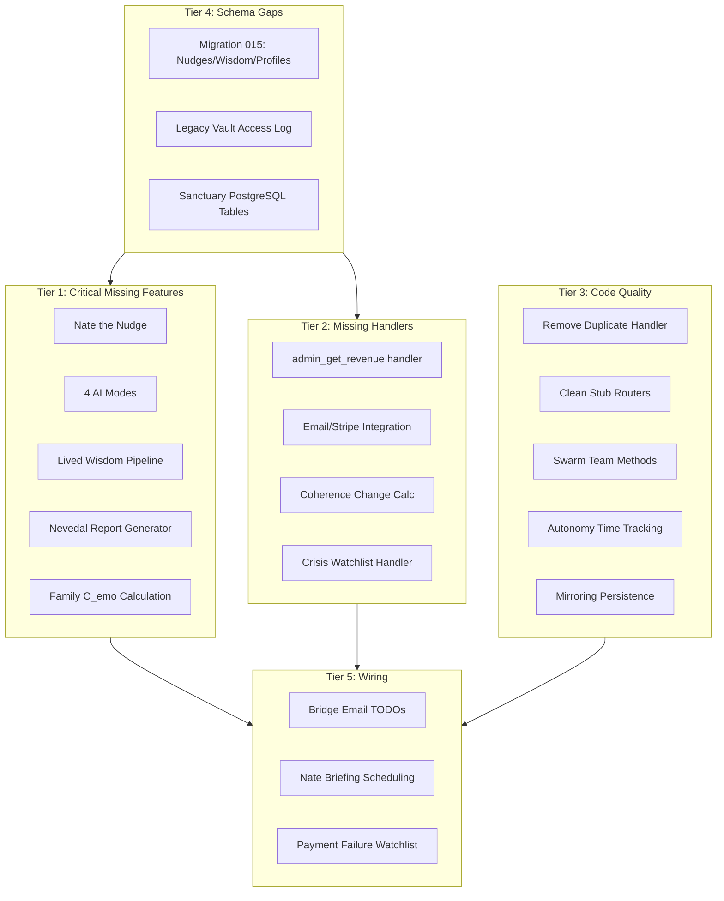

# Sovereign Swarm Intelligence — Complete Implementation Diagnosis

## Audit Methodology

Cross-referenced all architecture documents against every backend service, router, handler, migration, admin component, and mobile screen. Sources analyzed:

- `docs/SOVEREIGN_COMMAND_README.md` (SC_01 through SC_07 specs)
- `docs/PROJECT_MASTER_DOCUMENTATION.md` (18 dashboard pages, all handlers)
- `docs/FAMILY_SANCTUARY_SPEC.md` (Phases 0-8)
- `docs/DATA_SOURCE_MAPPING_V2.md` (all data flows)
- `docs/MVVM_INTEGRATION_GUIDE.md` (9 integration phases)
- `docs/LITTLE_NATE_PROGRESS_CHECKLIST_UPDATED.md` (Lived Wisdom pipeline)
- All TODO/FIXME/STUB comments across the codebase

---

## Tier 1: Critical Missing Features (Specified in Architecture, Not Built)

### 1A. Nate the Nudge — Proactive Notification System

**Spec source:** `docs/SOVEREIGN_COMMAND_README.md` (SC_06)

**What's specified:**

- Session prep reminders (before scheduled sessions)
- Mood logging nudges (periodic prompts)
- Milestone celebrations (breakthrough moments, session counts)
- Status tracking: Pending / Sent / Opened

**What exists:** Generic drip scheduler and notification infrastructure in [notifications_service.py](backend/app/services/notifications_service.py) and [drip_scheduler.py](backend/app/services/drip_scheduler.py), but no dedicated nudge system.

**Implementation:**

- Create `backend/app/services/nate_nudge.py` with `NateNudgeService` class
- 3 nudge types: `session_prep`, `mood_check`, `milestone`
- Add DB table `nate_nudges` (migration 015) with columns: `id`, `user_id`, `nudge_type`, `content`, `status` (pending/sent/opened), `scheduled_at`, `sent_at`, `opened_at`
- Add scheduled task in `drip_scheduler.py` to generate and send nudges
- Wire to existing `EmailService` and in-app `notification_system.py`

### 1B. Four AI Modes (Tri-Corder, Archivist, Guardian, Supervisor)

**Spec source:** `docs/SOVEREIGN_COMMAND_README.md` (SC_06)

**What's specified:**

- **Tri-Corder Mode**: 30-second biometric baseline, voice stress analysis, waveform visualization
- **Archivist Mode**: Legacy builder for elderly/terminally ill, biography chapters, "Wisdom Memories" for family vault
- **Guardian Mode**: Parental proxy summaries for minors, confidentiality-preserving
- **Supervisor Mode**: Coach session analysis, empathy/technique grading, training recommendations

**What exists:** Nothing. No files, no handlers, no references in backend code.

**Implementation:**

- Create `backend/app/services/ai_modes.py` with 4 mode classes inheriting from a `BaseAIMode`
- Each mode implements `activate(session_id)`, `process(data)`, `generate_output()`
- Tri-Corder: Integrates with `VoiceBiometricExtractor` in [nevedal_engine.py](backend/app/services/nevedal_engine.py), adds baseline calibration logic
- Archivist: Integrates with `LegacyVaultService` in [legacy_vault.py](backend/app/services/legacy_vault.py), adds biography chapter generation via Azure OpenAI
- Guardian: Queries session data for minor users, generates sanitized summaries via Azure OpenAI
- Supervisor: Analyzes coach session transcripts, scores empathy/technique via Azure OpenAI
- Add router `backend/app/routers/ai_modes_api.py` with endpoints to activate/deactivate modes and fetch status

### 1C. Lived Wisdom Pipeline

**Spec source:** `docs/LITTLE_NATE_PROGRESS_CHECKLIST_UPDATED.md` (Phase 6)

**What's specified:**

- `extract_sanctuary_wisdom()` function — extracts therapeutic insights from completed sanctuary sessions
- Client wisdom storage at `Vaults/Clients/{id}/wisdom.json` (or DB equivalent)
- Family wisdom storage at `Vaults/Families/{id}/wisdom.json` (or DB equivalent)
- Night School ingestion of client/family wisdom for personalization

**What exists:** Wisdom only exists at the admin/platform level (`little_nate_wisdom.json`). No per-client or per-family wisdom extraction.

**Implementation:**

- Add `extract_sanctuary_wisdom()` to [sanctuary_engine.py](backend/app/websocket/sanctuary_engine.py) — called at session completion, uses Azure OpenAI to extract therapeutic insights
- Add `wisdom_extraction` table (migration 015) with `id`, `user_id`, `family_id`, `session_id`, `insight_type`, `content`, `effectiveness_score`, `extracted_at`
- Modify [night_school_director.py](backend/app/services/night_school_director.py) to load client/family wisdom during training ingestion

### 1D. Nevedal Report Generator (5 Report Types)

**Spec source:** `docs/SOVEREIGN_COMMAND_README.md` (SC_07 — Nevedal Research Lab)

**What's specified:**

- Individual Coherence Report
- Dyad Comparison Report
- Family Dynamics Report
- Longitudinal Trends (12-week)
- Coach Efficacy Analysis

**What exists:** No report generator. Only raw data in `nevedal_metrics` and coherence measurements.

**Implementation:**

- Create `backend/app/services/nevedal_report_generator.py` with `NevedalReportGenerator` class
- Each report type queries `nevedal_metrics`, `coherence_measurements`, and `sessions` tables
- Returns structured JSON with summary statistics, trend data, and narrative descriptions (via Azure OpenAI for narrative)
- Add router endpoints in a new `backend/app/routers/nevedal_reports_api.py`:
  - `POST /api/research/nevedal/reports/generate` (accepts `report_type`, `subject_ids`, `date_range`)
  - `GET /api/research/nevedal/reports/{report_id}`

### 1E. Family C_emo Calculation

**Spec source:** `docs/FAMILY_SANCTUARY_SPEC.md` (Phase 3)

**What's specified:** `calculate_c_emo_family()` — computes family-level quantum emotional coherence from all member Nevedal states.

**What exists:** Individual C_emo calculation in [nevedal_engine.py](backend/app/services/nevedal_engine.py). No family-level aggregation in [sanctuary_engine.py](backend/app/websocket/sanctuary_engine.py).

**Implementation:**

- Add `calculate_c_emo_family(family_id)` method to [sanctuary_engine.py](backend/app/websocket/sanctuary_engine.py)
- Queries `nevedal_metrics` for all family members, computes pairwise coherence matrix and family wellness index
- Formula: Pairwise `1.0 - abs(member_a_c_emo - member_b_c_emo)`, Family Wellness Index = `avg(all_member_c_emo)`
- Store results in `coherence_measurements` with `measurement_type='family'`

---

## Tier 2: Missing Handlers and Integrations

### 2A. Bridge Handler: `admin_get_revenue`

**Spec source:** `docs/PROJECT_MASTER_DOCUMENTATION.md` (The Eye Revenue page)

**What exists:** Not implemented in [bridge_server.py](backend/app/websocket/bridge_server.py). The dashboard page `the_eye_revenue.html` expects this handler.

**Implementation:**

- Add `admin_get_revenue` handler to bridge_server.py
- Query `stripe_billing.json` / Stripe API for subscription counts, revenue metrics, payment history
- Return structured data matching the dashboard expectations

### 2B. Email Notification Integration with Stripe

**Spec source:** Multiple TODOs in [stripe_integration.py](backend/app/services/stripe_integration.py)

**What exists:** `EmailService` in [notifications_service.py](backend/app/services/notifications_service.py) has `send_family_invitation()`, `send_payment_failed()`, `send_coaching_confirmation()` methods — but they are never called.

**TODOs to wire:**

- Line 314: `add_family_member()` -> call `EmailService.send_family_invitation()`
- Line 475: `book_coaching_session()` -> call `EmailService.send_coaching_confirmation()`
- Line 724: `_handle_payment_failed()` -> call `EmailService.send_payment_failed()`
- Line 476: `book_coaching_session()` -> schedule Nate briefing generation

### 2C. Coherence Change Calculation

**File:** [notifications_service.py](backend/app/services/notifications_service.py) line 582

**Issue:** Hardcoded `coherence_change="+23%"` in `check_trial_expiring()`.

**Fix:** Query `nevedal_metrics` for the user's first and latest `c_emo` values, compute actual percentage change.

### 2D. Bridge Handler: `admin_get_crisis_watchlist` (Dedicated)

**Spec source:** `docs/SOVEREIGN_COMMAND_README.md` (SC_01)

**What exists:** Crisis data is embedded within `admin_get_stats` response but there's no dedicated `admin_get_crisis_watchlist` handler.

**Implementation:** Extract crisis watchlist logic into its own handler for cleaner separation and the SC_01 dashboard's dedicated crisis panel.

---

## Tier 3: Code Quality and Swarm Completeness

### 3A. Remove Duplicate `admin_get_dyad_sync` Handler

**File:** [bridge_server.py](backend/app/websocket/bridge_server.py)

**Issue:** Full implementation at line 10279, dead legacy duplicate at line 12038. The duplicate is unreachable.

**Fix:** Remove the duplicate block at line 12038.

### 3B. Stub Routers in `__init__.py`

**File:** [backend/app/routers/**init**.py](backend/app/routers/__init__.py)

**Issue:** 9 placeholder endpoints (`/api/auth/login`, `/api/auth/register`, `/api/users/`, `/api/sessions/`, `/api/admin/dashboard`, `/api/coach/clients`, `/api/billing/subscription`, `/api/nevedal/status`, `/api/night-school/versions`) return "implement me" strings. Real implementations exist in separate router files for admin, sessions, coach, billing — but `auth`, `users`, and `nevedal` status have no real router.

**Fix:**

- Remove stubs that have real implementations in separate files
- For auth: Create minimal `auth_api.py` with login/register endpoints (delegates to existing bridge auth logic or JWT service)
- For users: Create minimal `users_api.py` listing endpoint
- For nevedal status: Already exists at `/api/coherence/pulse` — add alias or redirect

### 3C. Human-Swarm Teams Management Methods

**File:** [fibre_manager.py](backend/app/services/fibre_manager.py)

**What exists:** `create_team()` at line 503.

**What's missing:**

- `get_team(team_id)` — retrieve team by ID
- `list_teams()` — list all active teams
- `update_team(team_id, updates)` — modify team membership or config
- `dissolve_team(team_id)` — gracefully dissolve a team

### 3D. `upgrade_autonomy()` Time Tracking

**File:** [fibre_manager.py](backend/app/services/fibre_manager.py) line 277

**Issue:** Comment says "simplified" — doesn't track actual spawn/promotion timestamps for autonomy upgrade eligibility.

**Fix:** Query `fibre_evolution_journal` for the fibre's creation timestamp and time at current tier, enforce minimum time thresholds before upgrade.

### 3E. Mirroring Principle Persistent Storage

**File:** [base_fibre.py](backend/app/fibres/base_fibre.py) line 477

**Issue:** `adapt_communication()` exists but interaction history is only in-memory (journal entries). No persistent storage for learned communication preferences.

**Fix:** Add `interaction_profiles` JSONB column to `fibres` table (ALTER), store adapted communication styles that persist across restarts.

---

## Tier 4: Database Schema Gaps

### 4A. Migration 015: Nate Nudges + Wisdom Extraction + Interaction Profiles

New migration file `backend/migrations/015_nate_nudges_and_wisdom.sql`:

- `nate_nudges` table: `id UUID PK`, `user_id UUID FK`, `nudge_type VARCHAR(32)`, `content TEXT`, `status VARCHAR(16) DEFAULT 'pending'`, `scheduled_at TIMESTAMPTZ`, `sent_at TIMESTAMPTZ`, `opened_at TIMESTAMPTZ`, `created_at TIMESTAMPTZ DEFAULT NOW()`
- `wisdom_extractions` table: `id UUID PK`, `user_id UUID`, `family_id UUID`, `session_id UUID`, `insight_type VARCHAR(50)`, `content TEXT`, `effectiveness_score FLOAT`, `extracted_at TIMESTAMPTZ DEFAULT NOW()`
- ALTER `fibres` table: ADD `interaction_profiles JSONB DEFAULT '{}'::jsonb`

### 4B. Legacy Vault Access Log

**Spec source:** Architecture docs reference `legacy_vault_access_log` but only `legacy_vault_consent` exists.

**Fix:** Add `legacy_vault_access_log` table in migration 015: `id UUID PK`, `vault_entry_id UUID FK`, `accessed_by UUID FK`, `access_type VARCHAR(32)`, `accessed_at TIMESTAMPTZ DEFAULT NOW()`

### 4C. Family Sanctuary PostgreSQL Tables (Deferred)

**Spec source:** `docs/FAMILY_SANCTUARY_SPEC.md` (Phase 1)

**What exists:** Family sanctuary data is stored in `family_sanctuaries.json` (file-based). PostgreSQL tables for `family_sanctuary_sessions`, `sanctuary_members`, `sanctuary_messages`, `sanctuary_interventions`, `sanctuary_billing_events`, `sanctuary_archives` are specified but not created.

**Note:** This is a larger migration effort (JSON-to-PostgreSQL) that should be a separate project phase. Include table creation DDL in migration 016 so the schema exists even if the migration from JSON is deferred.

---

## Tier 5: Integration Wiring and Cleanup

### 5A. Bridge Email Notifications

**File:** [bridge_handlers_v2.py](backend/app/websocket/bridge_handlers_v2.py) lines 271, 308

**Issue:** TODOs for sending email notifications to clients (session booking) and reschedule links.

**Fix:** Import and call `EmailService` methods at the TODO locations.

### 5B. Nate Briefing Scheduling

**File:** [stripe_integration.py](backend/app/services/stripe_integration.py) line 476

**Issue:** TODO to schedule Nate briefing generation after coaching session is booked.

**Fix:** Call a method to generate a pre-session briefing (coach background, client history summary, recommended focus areas) and store it for the coach.

### 5C. Payment Failure Watchlist Integration

**File:** [stripe_integration.py](backend/app/services/stripe_integration.py) line 725

**Issue:** TODO to add user to crisis/attention watchlist on repeated payment failures.

**Fix:** After payment failure, check `stripe_billing` for repeat failures. If count >= 2, insert into `crisis_watchlist` table with appropriate severity.

---

## Summary Counts

| Tier                                  | Items        | Effort     |
| ------------------------------------- | ------------ | ---------- |
| Tier 1: Critical Missing Features     | 5 features   | High       |
| Tier 2: Missing Handlers/Integrations | 4 items      | Medium     |
| Tier 3: Code Quality/Completeness     | 5 items      | Medium     |
| Tier 4: Database Schema Gaps          | 3 migrations | Low-Medium |
| Tier 5: Integration Wiring            | 3 items      | Low        |
| **Total**                             | **20 items** |            |

## Recommended Execution Order

1. **Tier 4 first** (schema) — creates tables needed by Tiers 1 and 2
2. **Tier 3** (cleanup) — removes dead code and fixes completeness gaps
3. **Tier 1** (features) — the major new functionality
4. **Tier 2** (handlers) — connects missing backend pieces
5. **Tier 5** (wiring) — final integration of notifications and watchlists

