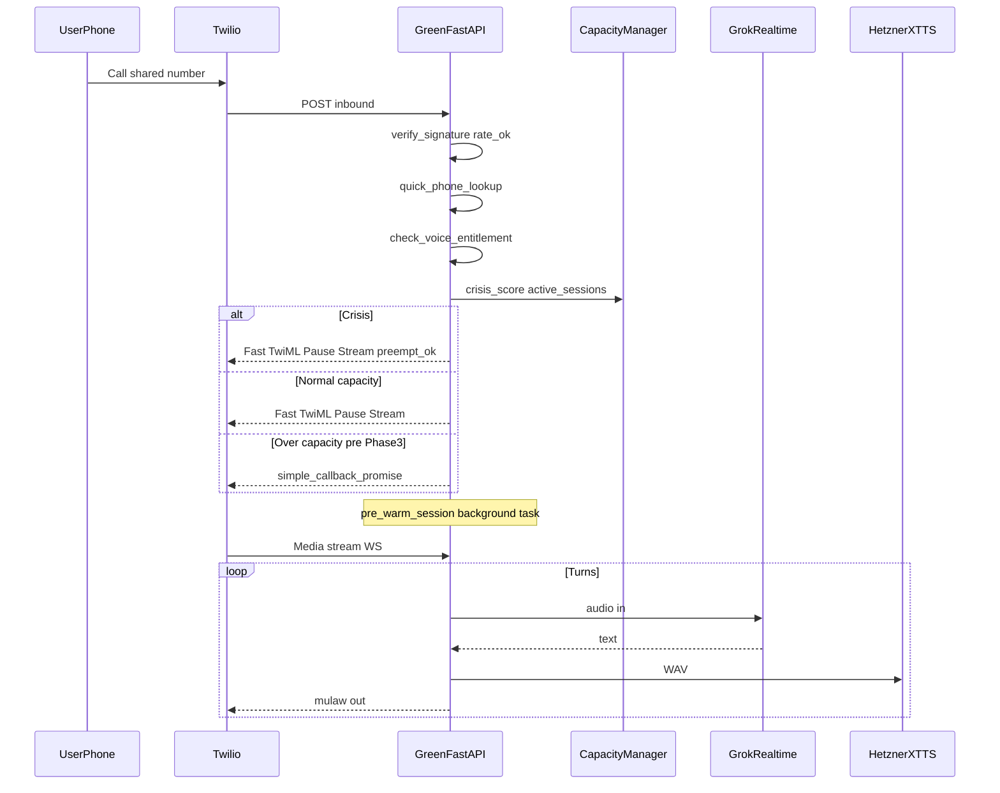

# Sovereign Voice v3.1 — Implementation Plan

## Addendum integrated: Call Center Architecture (Outreach Engine v1.0)

This plan includes the **Call Center** addendum (three lanes, callback queue, coach escalation, jitter, SkyEye). Pseudo-code using `user_id: int` maps to `**users.id` (UUID)** and/or `**username` (VARCHAR)** everywhere.

**Design principle:** No busy signal at steady state — metered by XTTS (8), hold (15), and callback queue. **Exception:** **Crisis callers never enter hold or callback-only denial** — see §Implementation gap fixes.

**Feature flag:** `SOVEREIGN_VOICE_V31_ENABLED` (default off in `.env.template`). When **true**, inbound runs the full v3.1 gate; when **false**, legacy TwiML (lookup + stream) without slot/quota enforcement.

---

## Done

These are **in the codebase** (Mar 2026). Full v3.1 inbound behavior requires `**SOVEREIGN_VOICE_V31_ENABLED=true`** and **migration `153_sovereign_voice_v31.sql`** applied (PG tables + Redis).

- `**/ws/nate-media-stream**` mounted (`main.py` + `littlenate_api` / `twilio_ws_router`); single `**TWILIO_MEDIA_STREAM_URL**` (backend `:8000`, not bridge `/ws`).
- `**/api/voice/***` aliases (`voice_alias_router`) — inbound, callback, twiml for Twilio Console.
- **Webhook guard** — `_twilio_voice_guard` + Twilio signature validation on voice POSTs (`twilio_voice.py`); in-app rate limit.
- **Per-call cap + T−120s wrap-up + Twilio hangup** — `voice_metering` + `TwilioMediaSession._enforce_max_call_duration` / `_hangup_twilio_call` (`littlenate_realtime.py`).
- **Inbound user lookup** — digit-normalized phone → `users`; ambiguous multi-match → Polly + hangup (`voice_phone` + inbound SQL).
- **Crisis + admission + Redis slots** (flagged) — `quick_crisis_check`, `decide_inbound_admission`, `acquire_voice_slot` / `release_voice_slot`, `get_active_voice_count` (`voice_admission.py`, `voice_capacity.py`, `twilio_voice.py`).
- **Monthly voice entitlement + usage** (flagged) — `check_voice_entitlement`, `voice_call_usage`, over-quota TwiML Polly; `**add_voice_minutes` on session `_finalize`** (`voice_metering.py`).
- `**callback_queue` INSERT** — `enqueue_simple_callback` on not entitled / at capacity / slot race (`voice_admission.py`); table from **migration 153**.
- **Coach overflow ping** — `notify_coach_of_voice_overflow` using `profile_data.assigned_coach` (at capacity + race loss).
- `**user_uuid` on stream** — TwiML `<Parameter>` + `littlenate_api` DB lookup when connect uses query `user_id` only.
- **Nginx pattern** — repo `nginx/nginx.conf` + `docs/nginx-api-twilio-media-stream.md` (host must proxy `/ws/nate-media-stream` to backend with long read timeout).
- **μ-law ↔ PCM codec** — `twilio_voice_codec.py`: `twilio_mulaw_to_pcm16` (8 kHz μ-law → 16 kHz PCM for Grok input), `xtts_pcm_to_twilio_mulaw` (24 kHz PCM → 8 kHz μ-law for Twilio output), `strip_wav_header`. Uses `audioop` + `ratecv`.
- **Grok Realtime WebSocket** — `twilio_grok_xtts_pipeline.py` connects to `wss://api.x.ai/v1/realtime` (bearer `XAI_API_KEY`); `modalities: ["text"]` so all Nathan audio comes from XTTS; `littlenate_api.py` routes via `TWILIO_VOICE_PIPELINE=grok_xtts` (or falls back when `littlenate_realtime` is absent). Includes RISSC voice parameters per emotional profile.
- **Coach notifications** — `coach_notifications.py`: `notify_coach` (multi-channel stub) + `notify_coach_of_voice_overflow` (at-capacity + slot race → assigned coach); writes `coach_escalation_notifications` table.

---

## Next steps

Priority order for remaining work (updated Mar 21 2026):

1. **Production enable** — Apply **migration 153** to GREEN; set `SOVEREIGN_VOICE_V31_ENABLED=true`; verify host nginx matches doc (before generic `/ws` → bridge). **Grok+XTTS pipeline already works without v3.1 gating** (`TWILIO_VOICE_PIPELINE=grok_xtts` is set in prod).
2. **Degradation ladder + session lifecycle** — Formal `SovereignVoiceSession` class: Grok → Azure → Polly fallbacks; reconnect policy; `log_voice_session_end`; cleanup.
3. **Fillers + Hetzner cache** — `wait_for(1.5s)` filler path; Hetzner pre-renders WAVs on XTTS boot; GREEN HTTP-fetches cached WAV (`fillers-v1`, `filler-cache-hetzner`).
4. **Fast TwiML** — Leading `<Pause>` / short `<Play>`; prove **<1–2s** webhook response; keep `pre_warm_voice_session` non-blocking.
5. **Phone model** — E.164 normalization, DB index on normalized phone, **Flutter** shared-number onboarding UX.
6. **Callback processor** — Background agent: dequeue `callback_queue`, place return calls, retries / missed handling.
7. **Slot accuracy** — Mitigate **TwiML-time acquire** leak (abandon before Media Stream): status webhook release, **or** move `acquire_voice_slot` to first WS `start`.
8. **Edge / WAF** — Cloudflare rate limits + Twilio IP allowlist; never `TWILIO_SKIP_SIGNATURE_VERIFY` in prod.
9. **Phase 3+** — Therapeutic hold (15), full firehose backpressure, hold TwiML lanes, outreach jitter, SkyEye voice metrics / auditor if new routes.
10. **E2E** — One live test call: happy path + one degradation path.

~~7. **Grok Realtime WebSocket** — COMPLETED. `twilio_grok_xtts_pipeline.py` connects to `wss://api.x.ai/v1/realtime`; text modalities; handler routes in `littlenate_api.py`.~~

---

## Production state (verified Mar 21 2026)


| Item                               | Status                                | Detail                                                                                                                                |
| ---------------------------------- | ------------------------------------- | ------------------------------------------------------------------------------------------------------------------------------------- |
| Migration 153                      | **NOT applied**                       | `voice_call_usage`, `callback_queue`, `coach_escalation_notifications` tables do not exist on GREEN                                   |
| `SOVEREIGN_VOICE_V31_ENABLED`      | **NOT set**                           | Env var absent from backend container; v3.1 admission/metering/slots code path is dormant                                             |
| `TWILIO_VOICE_PIPELINE`            | `**grok_xtts`** (set)                 | Grok+XTTS bridge is the active voice pipeline in prod — works independently of v3.1 gating                                            |
| `XAI_API_KEY`                      | Set (valid)                           | xAI bearer token for Grok Realtime WebSocket                                                                                          |
| `XAI_REALTIME_URL`                 | Default `wss://api.x.ai/v1/realtime`  | Verified working; env var exists in `.env.template` but not overridden in prod (default is correct)                                   |
| `XTTS_URL`                         | `http://37.27.244.80:8100/synthesize` | Direct Hetzner IP (not WireGuard); works from GREEN                                                                                   |
| Voice files deployed               | Yes                                   | `twilio_grok_xtts_pipeline.py`, `twilio_voice_codec.py`, `voice_admission.py`, `voice_capacity.py`, `voice_metering.py` all on server |
| Host nginx `/ws/nate-media-stream` | **Verify**                            | Must proxy to backend `:8000` with long read timeout; see `docs/nginx-api-twilio-media-stream.md`                                     |


**To enable v3.1 fully:** Apply migration 153 → set `SOVEREIGN_VOICE_V31_ENABLED=true` → recreate backend container → verify slot/metering tables exist.

---

## Detailed implementation matrix (Mar 2026)


| Area                               | Status         | Code / notes                                                                                                                                                                                        |
| ---------------------------------- | -------------- | --------------------------------------------------------------------------------------------------------------------------------------------------------------------------------------------------- |
| Media WS mount                     | Done           | `main.py` — `twilio_ws_router` + `littlenate_api_router`; path `/ws/nate-media-stream`                                                                                                              |
| `/api/voice/*` aliases             | Done           | `voice_alias_router` — inbound, callback, twiml (Twilio Console parity)                                                                                                                             |
| Webhook signature + rate limit     | Partial        | `_twilio_voice_guard` → `twilio_signature_valid` + in-app rate limit; **CF/WAF + Twilio IP allowlist = ops**                                                                                        |
| Per-call duration + wrap-up        | Done           | `voice_metering.TIER_MAX_SINGLE_CALL_SECONDS`, T−120s Polly, Twilio REST hangup — `littlenate_realtime.py`                                                                                          |
| Inbound PG lookup                  | Partial        | Digit-normalized `ANY($1::text[])` + `user_uuid` / `raw_profile`; E.164 + DB index + Flutter onboarding still open                                                                                  |
| Crisis + admission + capacity      | Done (flagged) | `twilio_voice.py` — `quick_crisis_check`, `decide_inbound_admission`, `get_active_voice_count`, `acquire_voice_slot`                                                                                |
| Entitlement + metering             | Done (flagged) | `check_voice_entitlement`, `voice_call_usage`; TwiML Polly if over quota; `add_voice_minutes` on `_finalize`                                                                                        |
| Callback queue rows                | Done (enqueue) | `enqueue_simple_callback` → `callback_queue` (migr. **153**); **processor agent** not built                                                                                                         |
| Coach overflow                     | Done           | `coach_notifications.py` — `notify_coach` + `notify_coach_of_voice_overflow`; writes `coach_escalation_notifications`                                                                               |
| Slot release                       | Done           | `release_voice_slot(call_sid)` in `TwilioMediaSession._finalize`                                                                                                                                    |
| WS `user_uuid` without TwiML param | Done           | `littlenate_api.py` — tier + `user_uuid` from DB when only query `user_id`                                                                                                                          |
| **μ-law codec**                    | **Done**       | `twilio_voice_codec.py` — `twilio_mulaw_to_pcm16` (8k→16k), `xtts_pcm_to_twilio_mulaw` (24k→8k), `strip_wav_header`                                                                                 |
| **Grok Realtime WS**               | **Done**       | `twilio_grok_xtts_pipeline.py` — xAI Realtime WS (`wss://api.x.ai/v1/realtime`), text modalities, XTTS voice synthesis; `TWILIO_VOICE_PIPELINE=grok_xtts` active in prod                            |
| Nginx Twilio media                 | Doc + repo     | `nginx/nginx.conf` `location = /ws/nate-media-stream` → backend :8000, 86400s timeouts; `docs/nginx-api-twilio-media-stream.md` for host nginx                                                      |
| Known gap                          | **Open**       | Slot acquired at **TwiML** time — if caller abandons before Media Stream `start`, Redis `active_sessions` can drift until TTL/reconcile; mitigate with status callback or acquire-on-WS-start later |


---

## Implementation gap fixes (scorecard / production hardening)

These items were missing from the first plan revision and **must** be explicit in Phase 1 (or noted phase) to avoid launch failures.


| Gap                                            | Severity                        | Fix (summary)                                                                                                                                                                                                                                                                                                                                                                                                                                                                                                                                                                                                                                                                                                                                         |
| ---------------------------------------------- | ------------------------------- | ----------------------------------------------------------------------------------------------------------------------------------------------------------------------------------------------------------------------------------------------------------------------------------------------------------------------------------------------------------------------------------------------------------------------------------------------------------------------------------------------------------------------------------------------------------------------------------------------------------------------------------------------------------------------------------------------------------------------------------------------------- |
| **1 — Crisis bypass not in Phase 1 admission** | ~~CRITICAL~~ **DONE** (flagged) | **Shipped:** `quick_crisis_check` → `decide_inbound_admission` with crisis bypass → `acquire_voice_slot(crisis=True)` in `twilio_voice.py` + `voice_admission.py`. Non-crisis at capacity → `enqueue_simple_callback`. Preempt policy requires clinical/legal sign-off. **Flagged**: behind `SOVEREIGN_VOICE_V31_ENABLED`. Flow: `quick_crisis_check` → if `crisis_score > 0.7` → **always** `lane_immediate(..., preempt=True)` — no therapeutic hold, no “call back later” for crisis. Non-crisis: if `active < 8` immediate; **before Phase 3** use `simple_callback_promise` TwiML when at capacity (no full queue yet). Preempt lowest-priority **active** session per Outreach spec — **requires clinical/legal sign-off** (see risk register). |
| **2 — Twilio ~15s webhook timeout**            | CRITICAL                        | **Never** await crystal pre-warm or Grok `session.update` before returning TwiML. **Fast path:** indexed phone lookup only → `VoiceResponse`: brief `<Pause>` or short `<Play>` (“one moment”) → `<Connect><Stream>`. `asyncio.create_task(pre_warm_session(user_uuid))` runs during pause/stream connect. Target **<1–2s** to first byte of response.                                                                                                                                                                                                                                                                                                                                                                                                |
| **3 — μ-law / PCM / sample-rate mismatch**     | ~~CRITICAL~~ **FIXED**          | **Done:** `twilio_voice_codec.py` — `twilio_mulaw_to_pcm16` (8 kHz μ-law → 16 kHz PCM for Grok), `xtts_pcm_to_twilio_mulaw` (24 kHz PCM → 8 kHz μ-law for Twilio), `strip_wav_header`. Uses `audioop.ulaw2lin`, `lin2ulaw`, `ratecv`.                                                                                                                                                                                                                                                                                                                                                                                                                                                                                                                 |
| **4 — Grok Realtime vs HTTP ambiguity**        | ~~HIGH~~ **FIXED**              | **Done:** `twilio_grok_xtts_pipeline.py` connects to `wss://api.x.ai/v1/realtime` with `XAI_API_KEY` bearer auth. `modalities: ["text"]` — all Nathan audio comes from XTTS. Inbound user audio decoded via codec, streamed to Grok Realtime. `TWILIO_VOICE_PIPELINE=grok_xtts` active in production.                                                                                                                                                                                                                                                                                                                                                                                                                                                 |
| **5 — WebSocket lifecycle**                    | HIGH                            | `**SovereignVoiceSession`** (or equivalent): owns Twilio media WS + Grok WS; handles **Twilio `stop`**, **Grok disconnect** (reconnect policy or graceful end), **XTTS failure** → degradation ladder; `**cleanup()`** closes Grok, clears buffers, logs `log_voice_session_end`, decrements capacity counters.                                                                                                                                                                                                                                                                                                                                                                                                                                       |
| **6 — Filler pre-cache on GREEN boot**         | MEDIUM                          | **Wrong:** batch ~30 XTTS calls from DO on every backend restart (slow, fails if Hetzner down). **Right:** pre-render fillers (+ hold scripts) **on Hetzner XTTS server boot** to `/opt/xtts-data/filler_cache/`; optional `**GET /filler/{profile}/{hash}.wav`** fast serve; miss → synthesize once + cache. GREEN **fetches** bytes, never blocks startup.                                                                                                                                                                                                                                                                                                                                                                                          |
| **7 — Graceful degradation**                   | HIGH                            | **Phase 1 ladder:** (1) Grok Realtime down → **Azure OpenAI** chat path (already in codebase patterns). (2) XTTS down → **Grok native voice** if session allows, else **Polly**. (3) Both down → **Polly + minimal GREEN context**. (4) **DB unavailable** → static TwiML / Polly honest message (“technical moment — text or retry”). Implement inside session error handling, not deferred.                                                                                                                                                                                                                                                                                                                                                         |
| **8 — Inbound webhook abuse**                  | CRITICAL                        | `**verify_twilio_signature`** = **hard blocker** (reject 403 if invalid). Add **Cloudflare** rate limiting; **allowlist Twilio IP ranges** where compatible with infra. Prevents PG pool exhaustion from forged POSTs.                                                                                                                                                                                                                                                                                                                                                                                                                                                                                                                                |
| **9 — Voice metering / entitlement**           | ~~HIGH~~ **DONE** (flagged)     | **Shipped:** `check_voice_entitlement` + `TIER_MAX_SINGLE_CALL_SECONDS` + `voice_call_usage` table (migration 153) + `add_voice_minutes` on `_finalize`. Over-limit → TwiML Polly. **Flagged**: migration 153 not applied to prod; behind `SOVEREIGN_VOICE_V31_ENABLED`.: monthly minutes vs **tier limits** (map to real tiers: `TRIAL`, `STANDARD`, `COACH_ONLY`, etc. — align with `users.tier` / subscriptions). Over limit → TwiML **Polly** message (“voice minutes used — text or upgrade”). Persist usage in PG (e.g. `voice_usage_monthly` or extend existing billing).                                                                                                                                                                      |
| **10 — Coach notification delivery**           | ~~MEDIUM~~ **PARTIAL**          | **Phase 1 done:** `coach_notifications.py` — `notify_coach` + `notify_coach_of_voice_overflow` wired on voice overflow; writes `coach_escalation_notifications`. **Phase 5 remaining:** FCM push, in-app notification row, email for `critical`, full `COACH_ESCALATION_TRIGGERS` breadth.                                                                                                                                                                                                                                                                                                                                                                                                                                                            |


---

## Current codebase vs spec (gap analysis)


| Spec item               | Status (Mar 2026)                                                                                           | Action remaining                                     |
| ----------------------- | ----------------------------------------------------------------------------------------------------------- | ---------------------------------------------------- |
| Webhooks `/api/voice/`* | **Done** — `voice_alias_router` mounts inbound, callback, twiml                                             | None                                                 |
| Media WebSocket         | **Done** — `twilio_ws_router` mounted in `main.py`; single `TWILIO_MEDIA_STREAM_URL`                        | None                                                 |
| Grok brain              | **Done** — `twilio_grok_xtts_pipeline.py` → xAI Realtime WS; `TWILIO_VOICE_PIPELINE=grok_xtts` routes to it | Degradation ladder (Grok → Azure → Polly) still TODO |
| μ-law codec             | **Done** — `twilio_voice_codec.py`: mulaw↔PCM + WAV strip + 24k→8k resample                                 | None                                                 |
| UUID vs INTEGER         | **Done** — migration 153 uses UUID FKs throughout                                                           | None                                                 |
| Coach async notify      | **Done** — `coach_notifications.py`: `notify_coach` + `notify_coach_of_voice_overflow`                      | FCM/in-app Phase 5                                   |
| Voice metering          | **Done (flagged)** — `voice_metering.py` + migration 153 `voice_call_usage`                                 | Migration 153 not applied to prod                    |
| Admission + slots       | **Done (flagged)** — crisis-first + Redis slots + callback enqueue                                          | Callback processor agent not built                   |


**Critical production state:** Migration 153 is **NOT applied** to production. `SOVEREIGN_VOICE_V31_ENABLED` is **NOT set**. The Grok+XTTS pipeline works independently (controlled by `TWILIO_VOICE_PIPELINE=grok_xtts`, which IS set in prod).

---

## Architecture target (v3.1 + three lanes + crisis)




---

## Call Center — admission (revised)

### Phase 1 (minimal) — `route_inbound_call`

```text
crisis_score > 0.7  →  lane_immediate(preempt=True)   # NEVER hold/callback-only
active < 8          →  lane_immediate()
else (pre Phase 3)  →  simple_callback_promise()      # TwiML + optional queue row stub
```

### Phase 3 (full)

Add **therapeutic hold** (depth < 15) and **callback lane** with coach notify for non-crisis only. **Crisis path unchanged.**

---

## Phase mapping (updated)

### Phase 1 (2–3 weeks) — **full checklist (gaps filled)**

1. **Done.** Mount `/ws/nate-media-stream` in `main.py`; single `TWILIO_MEDIA_STREAM_URL` (backend, not bridge).
2. `**verify_twilio_signature`** — **Done** on voice webhooks via `_twilio_voice_guard` / `voice_twilio_security`; production must not use skip-verify env.
3. **Cloudflare** rate limit + Twilio IP allowlist (ops + WAF rules). **Still TODO** (outside app repo).
4. **E.164** + **indexed** phone lookup — **Partial** (`voice_phone` + inbound query); index migration + Flutter still TODO.
5. `**check_voice_entitlement`** + `voice_call_usage` + over-limit TwiML — **Done** behind `SOVEREIGN_VOICE_V31_ENABLED`.
6. **Admission controller** crisis-first + Redis slots + callback enqueue — **Done** (flagged); richer `quick_crisis_check` over time.
7. **Fast TwiML** — **Partial**: `asyncio.create_task(pre_warm_voice_session)` after admit; leading `<Pause>`/`<Play>` + latency proof still TODO.
8. **Done.** **μ-law ↔ PCM** pipeline — `twilio_voice_codec.py`: `twilio_mulaw_to_pcm16` (8k→16k), `xtts_pcm_to_twilio_mulaw` (24k→8k), `strip_wav_header`; tested in `test_twilio_voice_codec.py`.
9. **Done.** **Grok Realtime WebSocket** — `twilio_grok_xtts_pipeline.py` connects to `wss://api.x.ai/v1/realtime` with bearer auth (`XAI_API_KEY`); `modalities: ["text"]`; `littlenate_api.py` routes via `TWILIO_VOICE_PIPELINE=grok_xtts`.
10. **XTTS** with RISSC params — **Done**; **filler** `wait_for(1.5s)` — **TODO** (filler bytes from **Hetzner cache URL**, not GREEN-generated on boot).
11. `**SovereignVoiceSession`** lifecycle + `**cleanup()`** on hangup/error.
12. **Degradation ladder** (Grok → Azure → XTTS → Polly → static).
13. Feature flag `**SOVEREIGN_VOICE_V31_ENABLED`** — **wired** (default off).
14. **One end-to-end test call** (happy path + one degradation path) — **TODO**.

**Post-enable notes:** Reconcile Redis `nate:voice:active_sessions` if abandons skew counts; consider **acquire on WS `start`** (see **Next steps** §3).

### Phase 2 (1 week)

- **Hetzner:** pre-render **fillers + therapeutic hold** WAVs on XTTS service boot; `**/filler`** (or nginx static) serve.
- GREEN: only HTTP fetch cache paths; `**voice_filler_events`** logging.

### Phase 3 (1–2 weeks)

- Full **hold queue** + `**callback_queue` processor** + firehose backpressure (Redis slot counter + enqueue exist today).
- **Lane 2 / 3** TwiML for non-crisis overload (today: Polly + hangup + queue row).

### Phases 4–8+

- Unchanged from prior plan (pre-warm depth, outreach+jitter+processor, RISSC tools, LOCKED audio, biometrics).

### Phase 5 — coach infrastructure

- `coach_notifications.py` is **done** (Phase 1): `notify_coach` + `notify_coach_of_voice_overflow`. Remaining: FCM push, in-app notification row, email for `critical`, full `COACH_ESCALATION_TRIGGERS` breadth.

---

## Data model additions

- **Voice metering:** e.g. `voice_call_usage` (`user_uuid`, `month`, `minutes_used`, `updated_at`) or extend billing tables — align with `check_voice_entitlement`.
- `**callback_queue`** and outreach tables: **UUID** `user_uuid REFERENCES users(id)`.
- **In-app notifications** for coaches: reuse or add table consumed by coach portal.

---

## Ops checklist (additions)

- Document **Twilio webhook timeout** behavior and **max call duration** for hold experiments.
- xAI: API keys, Realtime pricing, and **modalities** limits in staging.
- **Tier → minute limits** product sheet must match `TIER_LIMITS` in code.

## Risk register (with fixes)


| Risk                                     | Mitigation                                                                                                                           |
| ---------------------------------------- | ------------------------------------------------------------------------------------------------------------------------------------ |
| Twilio 15s timeout                       | Fast TwiML + background pre-warm (Gap #2)                                                                                            |
| Codec mismatch                           | Explicit `audioop`/ffmpeg pipeline + tests (Gap #3)                                                                                  |
| Grok disconnect                          | Session reconnect policy or Polly fallback (Gaps #5, #7)                                                                             |
| Callback SLA                             | SkyEye counters + alerts (existing)                                                                                                  |
| **Crisis preempt** drops non-crisis call | **Sign-off** on whether to hard-end a session vs “next free slot + coach page”; document in runbook                                  |
| Metering bypass                          | Entitlement check before Grok session (Gap #9)                                                                                       |
| Webhook DDoS                             | Signature + CF rate limit (Gap #8)                                                                                                   |
| Abandon before Media Stream `start`      | Slot reserved at TwiML — may inflate Redis active count; TTL on slot key does not decr counter — **reconcile or move acquire to WS** |


## Summary scorecard (self-assessment — updated Mar 22 2026)


| Area             | Grade | Notes                                                                                                                                               |
| ---------------- | ----- | --------------------------------------------------------------------------------------------------------------------------------------------------- |
| Gap analysis     | A+    | 6/10 gaps DONE/FIXED (#1 crisis, #3 codec, #4 Grok, #9 metering, #10 coach partial); 4 remain (#2 fast TwiML, #5 lifecycle, #7 degradation, #8 WAF) |
| Sequence diagram | A     | Crisis + fast TwiML still worth reflecting in narrative                                                                                             |
| Phase mapping    | A     | Inbound v3.1 done (flagged); codecs + Grok + XTTS done; fillers + degradation ladder remain                                                         |
| Phase 1 PR scope | A−    | Core pipeline complete — Grok→XTTS→Twilio works E2E; remaining: degradation, fillers, migration apply, callback processor                           |
| Data model       | A     | **153** for metering + callback_queue; exists in repo but NOT applied to prod                                                                       |
| Production state | B     | Pipeline works (`TWILIO_VOICE_PIPELINE=grok_xtts`); v3.1 gating dormant (migration + flag not applied)                                              |


**See [Done](#done) and [Next steps](#next-steps) at top of doc for the live checklist.**