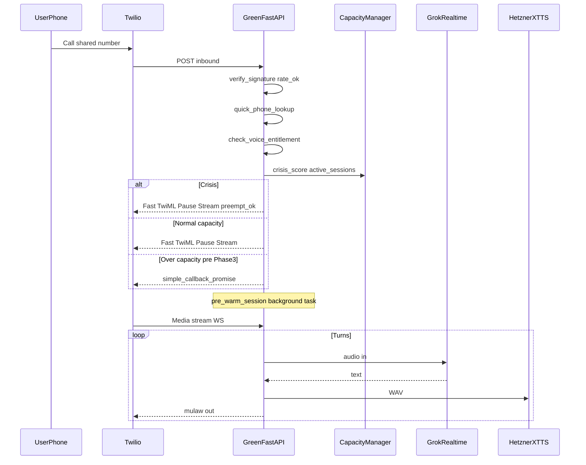

# Sovereign Voice v3.1 — Implementation Plan

## Addendum integrated: Call Center Architecture (Outreach Engine v1.0)

This plan includes the **Call Center** addendum (three lanes, callback queue, coach escalation, jitter, SkyEye). Pseudo-code using `user_id: int` maps to **`users.id` (UUID)** and/or **`username` (VARCHAR)** everywhere.

**Design principle:** No busy signal at steady state — metered by XTTS (8), hold (15), and callback queue. **Exception:** **Crisis callers never enter hold or callback-only denial** — see §Implementation gap fixes.

---

## Implementation gap fixes (scorecard / production hardening)

These items were missing from the first plan revision and **must** be explicit in Phase 1 (or noted phase) to avoid launch failures.

| Gap | Severity | Fix (summary) |
|-----|----------|----------------|
| **1 — Crisis bypass not in Phase 1 admission** | CRITICAL | **Admission controller ships in Phase 1**, not only Phase 3. Flow: `quick_crisis_check` → if `crisis_score > 0.7` → **always** `lane_immediate(..., preempt=True)` — no therapeutic hold, no “call back later” for crisis. Non-crisis: if `active < 8` immediate; **before Phase 3** use `simple_callback_promise` TwiML when at capacity (no full queue yet). Preempt lowest-priority **active** session per Outreach spec — **requires clinical/legal sign-off** (see risk register). |
| **2 — Twilio ~15s webhook timeout** | CRITICAL | **Never** await crystal pre-warm or Grok `session.update` before returning TwiML. **Fast path:** indexed phone lookup only → `VoiceResponse`: brief `<Pause>` or short `<Play>` (“one moment”) → `<Connect><Stream>`. `asyncio.create_task(pre_warm_session(user_uuid))` runs during pause/stream connect. Target **&lt;1–2s** to first byte of response. |
| **3 — μ-law / PCM / sample-rate mismatch** | CRITICAL | Twilio: **8 kHz μ-law**. XTTS: **24 kHz 16-bit PCM WAV**. Grok Realtime: confirm accepted audio format in xAI docs. Implement **`mulaw_to_pcm`** / **`pcm_to_mulaw`** (e.g. `audioop`: `ulaw2lin`, `lin2ulaw`, `ratecv` 24k→8k). Phase 1 deliverable — without this, silence or garbage. |
| **4 — Grok Realtime vs HTTP ambiguity** | HIGH | **Resolved:** use **xAI Realtime WebSocket** (URL/auth per **current xAI docs** — e.g. `wss://api.x.ai/v1/realtime` + Bearer; re-verify at implementation). **`modalities: ["text"]`** for assistant output so **all Nathan audio = XTTS**. Inbound: stream **user audio** (μ-law decoded → format Grok expects) into Realtime; STT can be internal to Grok session if supported — avoid duplicating STT unless needed. |
| **5 — WebSocket lifecycle** | HIGH | **`SovereignVoiceSession`** (or equivalent): owns Twilio media WS + Grok WS; handles **Twilio `stop`**, **Grok disconnect** (reconnect policy or graceful end), **XTTS failure** → degradation ladder; **`cleanup()`** closes Grok, clears buffers, logs `log_voice_session_end`, decrements capacity counters. |
| **6 — Filler pre-cache on GREEN boot** | MEDIUM | **Wrong:** batch ~30 XTTS calls from DO on every backend restart (slow, fails if Hetzner down). **Right:** pre-render fillers (+ hold scripts) **on Hetzner XTTS server boot** to `/opt/xtts-data/filler_cache/`; optional **`GET /filler/{profile}/{hash}.wav`** fast serve; miss → synthesize once + cache. GREEN **fetches** bytes, never blocks startup. |
| **7 — Graceful degradation** | HIGH | **Phase 1 ladder:** (1) Grok Realtime down → **Azure OpenAI** chat path (already in codebase patterns). (2) XTTS down → **Grok native voice** if session allows, else **Polly**. (3) Both down → **Polly + minimal GREEN context**. (4) **DB unavailable** → static TwiML / Polly honest message (“technical moment — text or retry”). Implement inside session error handling, not deferred. |
| **8 — Inbound webhook abuse** | CRITICAL | **`verify_twilio_signature`** = **hard blocker** (reject 403 if invalid). Add **Cloudflare** rate limiting; **allowlist Twilio IP ranges** where compatible with infra. Prevents PG pool exhaustion from forged POSTs. |
| **9 — Voice metering / entitlement** | HIGH | **`check_voice_entitlement`** before opening Grok + billing session: monthly minutes vs **tier limits** (map to real tiers: `TRIAL`, `STANDARD`, `COACH_ONLY`, etc. — align with `users.tier` / subscriptions). Over limit → TwiML **Polly** message (“voice minutes used — text or upgrade”). Persist usage in PG (e.g. `voice_usage_monthly` or extend existing billing). |
| **10 — Coach notification delivery** | MEDIUM (Phase 5) | **`backend/app/services/coach_notifications.py`**: multi-channel **`notify_coach(coach_id, notification)`** — SMS (Twilio), **FCM push** (if available), **in-app notification row**, email for `critical`. **Not** the same as [`call_coaching_engine.py`](backend/app/services/call_coaching_engine.py) (live third-party coaching). Wire escalation triggers into this module. |

---

## Current codebase vs spec (gap analysis)


| Spec item | Repo reality | Action |
| --------- | ------------ | ------ |
| Webhooks `/api/voice/*` | Voice under [`twilio_voice.py`](backend/app/routers/twilio_voice.py) `/api/calls/*` | Alias or Console URLs |
| Media WebSocket | **Mounted** in [`main.py`](backend/app/main.py) (`littlenate_api` + `twilio_ws_router`); inbound uses `TWILIO_MEDIA_STREAM_URL` only | Keep env single-source |
| Grok brain | Today Twilio path leans **Azure** in [`littlenate_realtime.py`](backend/app/services/littlenate_realtime.py) | New **Grok Realtime WS** path + degradation to Azure |
| UUID vs INTEGER | `users.id` is UUID | All voice/callback/metering FKs use UUID (or username) |
| Coach async notify | No `coach_notifications` service | Add Gap fix #10 in Phase 5 |

*(Full table from prior revision still applies; rows above are the highest-impact.)*

---

## Architecture target (v3.1 + three lanes + crisis)



---

## Call Center — admission (revised)

### Phase 1 (minimal) — `route_inbound_call`

```text
crisis_score > 0.7  →  lane_immediate(preempt=True)   # NEVER hold/callback-only
active < 8          →  lane_immediate()
else (pre Phase 3)  →  simple_callback_promise()      # TwiML + optional queue row stub
```

### Phase 3 (full)

Add **therapeutic hold** (depth &lt; 15) and **callback lane** with coach notify for non-crisis only. **Crisis path unchanged.**

---

## Phase mapping (updated)

### Phase 1 (2–3 weeks) — **full checklist (gaps filled)**

1. Mount **`/ws/nate-media-stream`** in [`main.py`](backend/app/main.py); **single** `TWILIO_MEDIA_STREAM_URL` (remove wrong default for inbound).
2. **`verify_twilio_signature`** on **all** voice webhooks — **fail closed** in production.
3. **Cloudflare** rate limit + Twilio IP allowlist (ops + WAF rules).
4. **E.164** + **indexed** phone lookup (target **&lt;50ms**).
5. **`check_voice_entitlement`** + persistence for monthly voice minutes; over-limit TwiML branch.
6. **Admission controller** with **crisis-first** + `preempt` flag (stub `quick_crisis_check` from C_emo/flags until richer signals).
7. **Fast TwiML** (`Pause` / short `Play`) + **`asyncio.create_task(pre_warm_session)`** — no blocking pre-warm.
8. **μ-law ↔ PCM** pipeline + 24k→8k for XTTS → Twilio.
9. **Grok Realtime WebSocket**, **`modalities: ["text"]`**, tools stub; confirm endpoint against xAI docs at integration time.
10. **XTTS** with RISSC params; **filler** `wait_for(1.5s)` (filler bytes from **Hetzner cache URL**, not GREEN-generated on boot).
11. **`SovereignVoiceSession`** lifecycle + **`cleanup()`** on hangup/error.
12. **Degradation ladder** (Grok → Azure → XTTS → Polly → static).
13. Feature flag **`SOVEREIGN_VOICE_V31_ENABLED`**.
14. **One end-to-end test call** (happy path + one degradation path).

**Implemented (inbound slice):** With `SOVEREIGN_VOICE_V31_ENABLED=true`, `/api/voice/inbound` runs `quick_crisis_check` → `check_voice_entitlement` → `decide_inbound_admission` → `acquire_voice_slot` (crisis bypass) + `pre_warm_voice_session`; Polly+hangup + `callback_queue` + coach notify on overload; TwiML passes `user_uuid`; `TwilioMediaSession._finalize` calls `release_voice_slot` and `add_voice_minutes`. WS-only connects get `user_uuid` from DB in `littlenate_api`. *Known gap:* slot reserved at TwiML time — if caller abandons before Media Stream `start`, Redis active count may drift until TTL/reconcile (future: status callback or acquire-on-WS-start).

### Phase 2 (1 week)

- **Hetzner:** pre-render **fillers + therapeutic hold** WAVs on XTTS service boot; **`/filler`** (or nginx static) serve.
- GREEN: only HTTP fetch cache paths; **`voice_filler_events`** logging.

### Phase 3 (1–2 weeks)

- Full **hold queue** + **callback_queue** + semaphore(8) + firehose backpressure.
- **Lane 2 / 3** TwiML for non-crisis overload.

### Phases 4–8+

- Unchanged from prior plan (pre-warm depth, outreach+jitter+processor, RISSC tools, LOCKED audio, biometrics).

### Phase 5 — coach infrastructure

- Implement **[`coach_notifications.py`](backend/app/services/coach_notifications.py)** (Gap #10) before wiring all `COACH_ESCALATION_TRIGGERS`.

---

## Data model additions

- **Voice metering:** e.g. `voice_call_usage` (`user_uuid`, `month`, `minutes_used`, `updated_at`) or extend billing tables — align with `check_voice_entitlement`.
- **`callback_queue`** and outreach tables: **UUID** `user_uuid REFERENCES users(id)`.
- **In-app notifications** for coaches: reuse or add table consumed by coach portal.

---

## Ops checklist (additions)

- Document **Twilio webhook timeout** behavior and **max call duration** for hold experiments.
- xAI: API keys, Realtime pricing, and **modalities** limits in staging.
- **Tier → minute limits** product sheet must match `TIER_LIMITS` in code.

## Risk register (with fixes)

| Risk | Mitigation |
| ---- | ---------- |
| Twilio 15s timeout | Fast TwiML + background pre-warm (Gap #2) |
| Codec mismatch | Explicit `audioop`/ffmpeg pipeline + tests (Gap #3) |
| Grok disconnect | Session reconnect policy or Polly fallback (Gaps #5, #7) |
| Callback SLA | SkyEye counters + alerts (existing) |
| **Crisis preempt** drops non-crisis call | **Sign-off** on whether to hard-end a session vs “next free slot + coach page”; document in runbook |
| Metering bypass | Entitlement check before Grok session (Gap #9) |
| Webhook DDoS | Signature + CF rate limit (Gap #8) |

## Summary scorecard (self-assessment)

| Area | Grade | Notes |
| ---- | ----- | ----- |
| Gap analysis | A+ | Real blockers vs spec restate |
| Sequence diagram | A | Add crisis + fast TwiML in narrative |
| Phase mapping | A | Phase 1 now includes admission + crisis + codecs + degradation |
| Phase 1 PR scope | A | Matches minimal slice **plus** non-negotiables above |
| Data model | A | UUID correction retained |

**Next PR after Phase 1 green:** Phase 3 `callback_queue` + therapeutic hold + full capacity manager (crisis path unchanged).

---

## Twilio Console — TwiML App & credentials (Mar 2026)

| Field | Value |
| ----- | ----- |
| **TwiML App SID** | `AP3e3d64011746c2bd270f6a41954489b5` (`TWILIO_VOICE_APP_SID`) |
| **Voice Request URL** | `POST` `https://api.sovereignsanctuary.net/api/voice/inbound` |
| **Status callback** | `POST` `https://api.sovereignsanctuary.net/api/voice/callback` |
| **Media Stream WebSocket** | `TWILIO_MEDIA_STREAM_URL` → `wss://api.sovereignsanctuary.net/ws/nate-media-stream` |

FastAPI mounts the same handlers under **`/api/calls/*`** (legacy) and **`/api/voice/*`** (Console alias).

**Nginx (critical):** On `api.sovereignsanctuary.net`, `/ws/nate-media-stream` must proxy to **backend :8000** with `Upgrade` + `Connection: upgrade` + **`proxy_read_timeout` ≥ 86400s**. A bare `location /ws` → bridge will send Twilio to the wrong process and/or drop at 60s. See [`docs/nginx-api-twilio-media-stream.md`](docs/nginx-api-twilio-media-stream.md) and `nginx/nginx.conf` (api server block).

### Twilio Voice signing public key (RSA)

Store the **public** PEM alongside the repo for ops reference (not secret): [`docs/twilio_voice_public_key.pem`](docs/twilio_voice_public_key.pem). Optional env: `TWILIO_VOICE_PUBLIC_KEY_PATH` if a service must load it from disk. **Do not** commit private keys.

---

## Per-call duration caps (cost + safety)

Hard cap **per single Twilio media-stream session** is enforced in `TwilioMediaSession` (`littlenate_realtime.py`): sleep → **wrap-up TTS** at **T−120s** → hangup via Twilio REST at **T**.

**Wrap-up line (verbatim):**  
“We're getting close to the end of our time today. Let's wrap up with what feels most important.”

**Tier → max seconds** (`voice_metering.TIER_MAX_SINGLE_CALL_SECONDS` — aligned with `users.tier`):

| Tier | Seconds | Minutes |
| ---- | ------- | ------- |
| TRIAL, THRESHOLD | 300 | 5 |
| STANDARD, CLIENT | 900 | 15 |
| INNER_CHAMBER | 1800 | 30 |
| SOVEREIGN_CIRCLE, COACH_ONLY | 3600 | 60 |
| ADMIN | 7200 | 120 (safety cap) |

Inbound TwiML passes `max_call_seconds`, `tier`, `call_sid`, `user_id` as `<Stream><Parameter>`; Nate check-in Redis context includes the same. **≤0** would mean unlimited (reserved; not used by defaults).

---

## Future phase — Twilio Video + Spline avatar (“FaceTime with Little Nate”)

**Goal:** User sees LN’s **3D Spline** avatar face-to-face; avatar **expression** tracks user **camera** affect.

**Sketch:**

```text
User camera → Twilio Video Room (WebRTC)
  ├── Video track → server-side facial / affect signals → drives LN avatar blendshapes
  │                 → render avatar → publish **video** track to Room
  ├── Audio track → Grok Realtime (reasoning) → XTTS (Nathan voice) → publish **audio** to Room
  └── User receives: avatar video + Nathan audio in one Room
```

This is **orthogonal** to the phone **Media Stream** path; reuse inference + TTS stack, add Video SDK + compositor latency budget.

---

## Implementation notes (this drop)

- **`main.py`**: `littlenate_api` router + `twilio_ws_router` (`/ws/nate-media-stream`); `voice_alias_router` (`/api/voice/*`).
- **`twilio_voice.inbound`**: `TWILIO_MEDIA_STREAM_URL` only (removed `TWILIO_WS_URL`); Twilio **signature** via `_twilio_voice_guard`.
- **`voice_metering`**: `max_single_call_seconds`, `VOICE_CALL_WRAP_UP_MESSAGE`, `TIER_MAX_SINGLE_CALL_SECONDS`.
