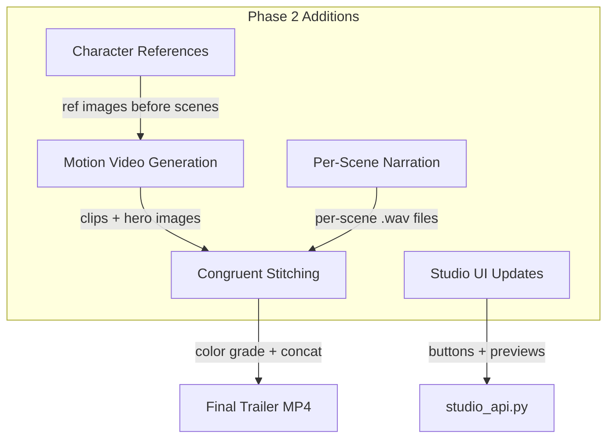

# Thera-World Studio Phase 2 -- Motion Video + Congruent Stitching

## Current State

Phase 1 is deployed and healthy (112/112). The following files exist:

- [`backend/app/sse/trailer_generator.py`](backend/app/sse/trailer_generator.py) -- 76 lines, loads presets, generates hero images with `GROK_IMAGINE_LOCK`
- [`backend/app/sse/studio_service.py`](backend/app/sse/studio_service.py) -- 501 lines, all service logic (content sources, Workers AI, image/video/narration gen, library, projects, Redis cost)
- [`backend/app/routers/studio_api.py`](backend/app/routers/studio_api.py) -- 188 lines, 15 endpoints
- [`backend/app/sse/infrastructure/grok_imagine_client.py`](backend/app/sse/infrastructure/grok_imagine_client.py) -- 148 lines, `generate_image`, `generate_video`, `poll_video_status`, `GROK_IMAGINE_LOCK`
- [`backend/app/sse/infrastructure/r2_storage.py`](backend/app/sse/infrastructure/r2_storage.py) -- 93 lines, `store_image` (image/png), `store_video` (downloads URL then uploads video/mp4)
- [`dashboard/studio.html`](dashboard/studio.html) -- 606 lines, React via CDN, Script/Scenes/Library tabs
- [`backend/app/sse/data/studio_presets/thera_world_origin.json`](backend/app/sse/data/studio_presets/thera_world_origin.json) -- 141 lines, 19 scenes (prompt/duration/mood, no characters/dialogue fields)

## What This Phase Adds



## File Changes

| Action | File | Scope |
|--------|------|-------|
| MODIFY | `backend/Dockerfile` | Add `ffmpeg \` to apt-get install block (line 16) |
| MODIFY | `backend/app/routers/admin.py` | Fix `generate_all_scenes` call at line 6045 to pass project_id (2 lines) |
| REWRITE | `backend/app/sse/trailer_generator.py` | Character refs, style prefix, consistent prompts, motion prompts, dialogue, stitching, narration, Ken Burns fallback |
| MODIFY | `backend/app/sse/infrastructure/r2_storage.py` | Add `store_bytes(data, key, content_type)` generic upload |
| MODIFY | `backend/app/sse/studio_service.py` | Wire new trailer functions, add batch generation orchestrators |
| MODIFY | `backend/app/routers/studio_api.py` | Add 5 new endpoints |
| REWRITE | `backend/app/sse/data/studio_presets/thera_world_origin.json` | Add `characters` and `dialogue` fields to all 19 scenes |
| MODIFY | `dashboard/studio.html` | Video buttons, character refs, stitch dialog, progress tracking |

---

## Step 0: FFmpeg Install (Before Any Code Changes)

FFmpeg is required by `stitch_trailer()` and the Ken Burns fallback. Install it in the running container immediately, and add it to the Dockerfile for future rebuilds.

**Live container install:**
```bash
ssh root@68.183.168.75 "docker exec nate_backend which ffmpeg || \
  (docker exec nate_backend apt-get update -qq && \
   docker exec nate_backend apt-get install -y -qq ffmpeg && \
   echo 'FFmpeg installed')"
```

**Dockerfile update** ([`backend/Dockerfile`](backend/Dockerfile) line 10-17): Add `ffmpeg \` to the existing `apt-get install` block. Do NOT rebuild the image now -- this is for future `docker compose build` runs only.

```
RUN apt-get update && apt-get install -y \
    gcc \
    libpq-dev \
    curl \
    libmagic1 \
    libsndfile1 \
    tesseract-ocr \
    ffmpeg \
    && rm -rf /var/lib/apt/lists/*
```

---

## Step 1: Prerequisites Check

Before building, run these 6 checks on GREEN:
- Phase 1 Studio router registered in `main.py`
- `GROK_IMAGINE_LOCK` exists in `grok_imagine_client.py`
- Redis cost tracking exists in `studio_service.py`
- FFmpeg now installed (verified in Step 0)
- Grok Video API model name verification (see below)
- R2 `store_image` content type handling

**Grok Video model verification** -- run on GREEN to discover actual model names:
```bash
ssh root@68.183.168.75 "docker exec nate_backend python3 -c \"
import httpx, os, asyncio
async def check():
    key = os.getenv('XAI_API_KEY','')
    r = await httpx.AsyncClient().get('https://api.x.ai/v1/models',
        headers={'Authorization': f'Bearer {key}'})
    for m in r.json().get('data', []):
        if 'video' in m.get('id','').lower() or 'image' in m.get('id','').lower():
            print(m['id'])
asyncio.run(check())
\""
```

If the model name differs from `grok-imagine-video` (used in `grok_imagine_client.py` line 14), update `_VIDEO_URL` and `generate_video()` payload accordingly. If NO video model exists, video generation will return errors and the Ken Burns fallback (below) will produce clips from static images.

Report all 6 findings before proceeding.

---

## Step 1.5: Backward Compatibility -- admin.py generate-trailer

[`backend/app/routers/admin.py`](backend/app/routers/admin.py) line 6044-6045 calls `generate_all_scenes()` with no args. Phase 2 changes the signature to `generate_all_scenes(project_id, scenes)`. Fix the old call site (2 lines max):

```python
@sse_router.post("/admin/generate-trailer")
async def sse_generate_trailer(request: Request, background_tasks: BackgroundTasks):
    import uuid as _uuid
    from app.sse.trailer_generator import generate_all_scenes
    background_tasks.add_task(generate_all_scenes, str(_uuid.uuid4()))
    return {"status": "started", "message": "Generating 19 scenes — check status in ~3 minutes"}
```

This passes a generated project_id as the first arg; `scenes` defaults to `None` which loads the Thera-World preset.

---

## Step 2: Add `store_bytes` to r2_storage.py

Add a generic `store_bytes(data, key, content_type)` function to [`r2_storage.py`](backend/app/sse/infrastructure/r2_storage.py) after line 93. This replaces the need for a separate `_store_video` helper in `trailer_generator.py`. The function accepts arbitrary bytes, a key, and a content type string, then uploads via the existing boto3 client.

```python
async def store_bytes(data: bytes, key: str, content_type: str = "application/octet-stream") -> str:
    client = _get_client()
    if client is None:
        return _mock_url(key)
    def _upload():
        client.put_object(Bucket=_R2_BUCKET, Key=key, Body=data, ContentType=content_type)
    await asyncio.get_event_loop().run_in_executor(None, _upload)
    return f"{_R2_PUBLIC_BASE}/{key}"
```

---

## Step 3: Rewrite trailer_generator.py

This is the largest change. The file grows from 76 to ~450 lines. Key additions:

**CHARACTER_REFERENCES dict** -- 7 characters (boy, serpent, dragon, girl, watcher, glowing_woman, knight) each with `ref_prompt` and `inline_desc` as specified in the task.

**STYLE_PREFIX** -- Terrence Malick / del Toro visual language string prepended to every image and video prompt.

**CHARACTER_VOICES** -- Voice configs for Azure TTS: serpent (onyx, deep/ancient), dragon (onyx, powerful), boy (shimmer, child), girl (shimmer, bright child).

**SCENE_DIALOGUE dict** -- Keyed by scene number, lists of `{voice, text}` for scenes 3-7, 12-13, 16-18 as specified.

**SCENE_MOTION_PROMPTS list** -- 19 entries with `motion`, `transition_from`, `transition_to` for continuity.

**Functions:**
- `generate_character_references(project_id)` -- generates 7 ref images, stores to R2 at `sse/studio/projects/{id}/refs/`
- `_build_consistent_prompt(scene_prompt, characters)` -- prepends STYLE_PREFIX + character inline descriptions
- Updated `generate_all_scenes(project_id, scenes)` -- calls character refs first, uses consistent prompts, saves manifest to R2
- `generate_motion_clips(project_id)` -- extends hero images to 5s video clips with transition context
- `_generate_scene_narration(project_id, scene_num, work_dir)` -- generates TTS per dialogue line, concatenates with FFmpeg
- `_generate_all_narration(project_id, work_dir)` -- orchestrates narration for all dialogue scenes
- `stitch_trailer(project_id, options)` -- downloads clips, applies color grade, concatenates, overlays narration, format conversion
- `_azure_tts(text, voice, instructions)` -- calls Azure Mini TTS
- `_concat_audio_files(paths, output)` -- FFmpeg concat for audio

All functions use `GROK_IMAGINE_LOCK` for Grok calls, check Redis cost budget via `studio_service._check_cost_budget`, and store to R2 via `r2_storage.store_bytes`.

**Ken Burns fallback** -- If Grok Video generation fails or returns empty for a scene, generate a 5-second Ken Burns clip (slow zoom on the static hero image) using FFmpeg. This ensures every scene has a video clip even if Grok Video is unavailable or the model name is wrong:

```python
async def _ken_burns_fallback(image_url: str, output_path: str, duration: int = 5) -> bool:
    """Generate a slow-zoom Ken Burns clip from a static image using FFmpeg."""
    import subprocess, tempfile
    async with aiohttp.ClientSession() as sess:
        async with sess.get(image_url) as r:
            if r.status != 200:
                return False
            img_bytes = await r.read()
    img_path = output_path.replace(".mp4", ".png")
    with open(img_path, "wb") as f:
        f.write(img_bytes)
    frames = duration * 24
    cmd = [
        "ffmpeg", "-y", "-loop", "1", "-t", str(duration), "-i", img_path,
        "-vf", f"zoompan=z='min(zoom+0.001,1.08)':d={frames}:s=1920x1080",
        "-c:v", "libx264", "-pix_fmt", "yuv420p", output_path,
    ]
    result = subprocess.run(cmd, capture_output=True, timeout=30)
    return os.path.exists(output_path)
```

Inside `generate_motion_clips`, after a failed Grok Video call, invoke `_ken_burns_fallback` and mark the clip as `status: "ken_burns"` instead of `status: "failed"`.

The existing `generate_all_scenes` function signature changes: it now requires `project_id` as a first argument. The backward-compat call in `admin.py` is fixed in Step 1.5.

---

## Step 4: Update the preset JSON

Rewrite [`thera_world_origin.json`](backend/app/sse/data/studio_presets/thera_world_origin.json) to add `characters` array and `dialogue` list to each of the 19 scenes. The prompts are updated to use `{character}` placeholders that `_build_consistent_prompt` resolves at generation time.

---

## Step 5: Add 5 new endpoints to studio_api.py

| Method | Path | Body | Returns |
|--------|------|------|---------|
| POST | `/generate-character-refs` | `{project_id}` | `{status: "started"}` (BackgroundTasks) |
| POST | `/generate-video-clips` | `{project_id}` | `{status: "started", estimated_cost}` (BackgroundTasks) |
| POST | `/stitch-trailer` | `{project_id, options}` | `{status: "started"}` (BackgroundTasks) |
| GET | `/projects/{id}/video-status` | -- | video manifest or `{status: "not_started"}` |
| GET | `/projects/{id}/trailer-status` | -- | `{status, trailer_url}` |

All long-running operations use `BackgroundTasks` for immediate return.

---

## Step 6: Update studio.html

**Scenes Tab additions:**
- "Generate Character References" button (calls `/generate-character-refs`, shows 7 ref image cards when done)
- Per-scene "Generate Video" button with inline `<video>` preview
- "Generate All Videos" batch button with cost estimate confirmation dialog
- Progress bar for batch operations
- Updated cost tracker reflecting video costs

**New Stitch Dialog** (modal triggered from Scenes tab):
- Checkboxes: color grading (default on), narration (default on), subtitles (default on)
- Format selector: 16:9 / 9:16 / 1:1
- "Stitch Trailer" button calling `/stitch-trailer`
- Status polling with progress display
- Video preview of finished trailer

**Library Tab additions:**
- "Trailers" filter option
- Character reference images section
- Project trailer preview

---

## Step 7: Deploy to GREEN

1. FFmpeg already installed in running container (Step 0)
2. `scp` changed files: `r2_storage.py`, `trailer_generator.py`, `studio_service.py`, `studio_api.py`, `admin.py`, `thera_world_origin.json`, `studio.html`, `Dockerfile`
3. Dashboard HTML (`studio.html`) to all 3 server directories
4. `docker compose -f docker-compose.prod.yml restart backend`
5. Verify 112/112 healthy
6. Verify FFmpeg: `docker exec nate_backend which ffmpeg` (should still be installed from Step 0; if container was recreated, re-install)
7. Test endpoints: `/content-sources`, `/presets`, `/cost-status`, `/generate-character-refs` (POST with project_id)
8. Verify old trailer button still works: `POST /api/sse/admin/generate-trailer` (backward compat)

---

## What This Plan Does NOT Touch

- `bridge_server.py` -- not modified
- `littlenate_inference.py` -- not modified
- `docker-compose.prod.yml` -- not modified
- `main.py` -- not modified (studio_router already registered)
- No auditor/trust changes
- Service health 112/112 unchanged

---

## Graceful Degradation

If Grok Video API is unavailable or returns errors for all scenes:
- Hero images still generate normally (Grok Imagine)
- Ken Burns fallback produces 5s slow-zoom clips from each hero image
- Narration generates normally (Azure TTS)
- Stitching works with Ken Burns clips + narration
- The trailer is watchable but lacks motion video -- admin can retry individual scenes later via the per-scene "Generate Video" button
