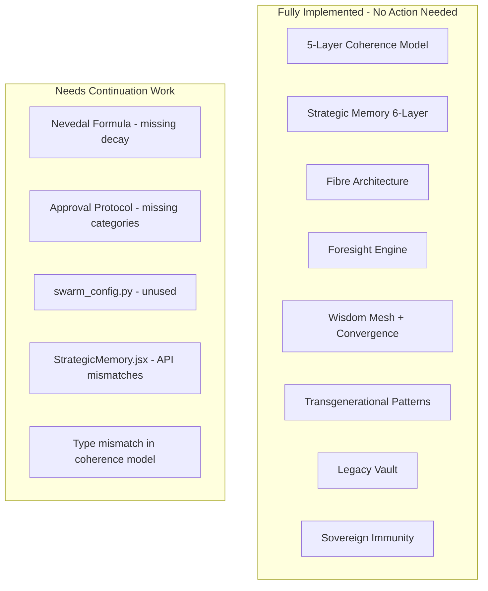

# Sovereign Swarm: PhD Alignment Continuation Assessment

## Current State

The framework has solid coverage across all major subsystems:

The 4 parallel audits found **5 categories of remaining work**, ordered by priority.

---

## Category 1: swarm_config.py Integration (HIGH -- Config is dead code)

**Problem:** `swarm_config.py` was created with 40+ centralized thresholds and `SWARM_*` env var overrides, but **no service imports or uses it**. Every service still has hardcoded values. This defeats the entire purpose of the config file.

**Files to update (replace hardcoded values with `swarm_settings.*`):**

- [backend/app/services/fibre_manager.py](backend/app/services/fibre_manager.py) -- `AUTONOMY_MIN_HOURS` (line 45-49), `ALIGNMENT_THRESHOLDS` (line 52-56)
- [backend/app/services/coherence_engine.py](backend/app/services/coherence_engine.py) -- Layer weights at lines 134, 225, 296, 399
- [backend/app/services/wisdom_mesh.py](backend/app/services/wisdom_mesh.py) -- `CONVERGENCE_WINDOW_SECONDS`, `MAX_MESSAGES_PER_MINUTE` (lines 48-49), `min_score = 0.75`
- [backend/app/services/sovereign_immunity.py](backend/app/services/sovereign_immunity.py) -- `MAX_MESSAGES_PER_MINUTE`, `MAX_UNIQUE_TOPICS_PER_HOUR`, `ANOMALY_SCORE_THRESHOLD` (lines 85-87)
- [backend/app/services/foresight_engine.py](backend/app/services/foresight_engine.py) -- Stream weights, thresholds
- [backend/app/services/pattern_engine.py](backend/app/services/pattern_engine.py) -- `MIN_SESSIONS_PER_MEMBER`, `MIN_FAMILY_MEMBERS`, correlation thresholds
- [backend/app/fibres/base_fibre.py](backend/app/fibres/base_fibre.py) -- Alignment thresholds (line 391), decay factors (lines 369-384)

**Pattern:** Each service adds `from app.swarm_config import swarm_settings` at module level, then replaces class-level constants with `swarm_settings.CONSTANT_NAME`.

---

## Category 2: Nevedal Formula -- Missing Time-Dependent Decay (HIGH)

**Problem:** The theoretical framework documents the formula as:

`C_emo(t) = [beta * p_ent * T_tunnel] / [gamma_env + E_G^joint / hbar] * exp[-(gamma_env + E_G^joint / hbar) * t]`

But the implementation in [backend/app/services/nevedal_engine.py](backend/app/services/nevedal_engine.py) computes only the steady-state numerator/denominator **without** the exponential decay term `exp[-(gamma + E_G/hbar) * t]`.

Additionally, CEE thresholds differ: code uses `0.65` and `15s`, doc specifies `0.72` and `30s`.

**Fix:**

- Add the `exp()` decay term to `_compute_c_emo()` using elapsed session time `t`
- Align CEE thresholds to match the theoretical framework (or update the doc to match the chosen values and document the rationale)

---

## Category 3: Approval Protocol -- Missing Category System (MEDIUM)

**Problem:** The theoretical framework defines 4 approval categories with distinct behaviors:

- **Observe**: No approval needed (pure logging)
- **Suggest**: Implicit approval (auto-execute after timeout)
- **Act**: Explicit human approval required
- **Critical**: Multi-party approval + mandatory waiting period + dead-man switch

The current implementation in [backend/app/services/approval_protocol.py](backend/app/services/approval_protocol.py) only has a flat approve/reject flow with auto-execute for low-risk proposals. Missing:

- Explicit category classification based on risk + impact
- Multi-party approval for Critical actions (currently only single approver)
- Dead-man switch (revert Fibres to Observation mode if approval system unresponsive)
- Timeout escalation (escalate to next authority if no response)

**Fix:**

- Add `ApprovalCategory` enum (OBSERVE, SUGGEST, ACT, CRITICAL) to [backend/app/models/strategy.py](backend/app/models/strategy.py)
- Add category classification logic to `ApprovalProtocolService` based on `risk` + `action_type`
- Implement multi-party approval for CRITICAL (require N of M validators)
- Add dead-man switch: a scheduler job that checks if the approval system is responsive and reverts all Fibres to OBSERVATION if not

---

## Category 4: StrategicMemory.jsx API Mismatches (MEDIUM)

**Problem:** The admin component [admin/src/components/StrategicMemory.jsx](admin/src/components/StrategicMemory.jsx) has 3 broken API calls:

- **Standing order creation**: Sends `{ content, priority }` but router expects `{ title, directive, origin, domain_tags, priority }`
- **Standing order deactivation**: Sends `POST .../deactivate` but router expects `DELETE .../`
- **Proposal approve/reject**: Sends `POST .../approve` but router expects `PUT .../status` with `{ status: "approved" }`

**Fix:** Update the component's fetch calls to match the [strategic_memory_api.py](backend/app/routers/strategic_memory_api.py) router contract exactly.

---

## Category 5: Minor Type/Safety Fixes (LOW)

**5A. Coherence model type mismatch:**

- [backend/app/models/coherence.py](backend/app/models/coherence.py) has `user_id: Optional[int]` -- should be `Optional[UUID]` to match migration 007 schema

**5B. Error handling gaps:**

- [backend/app/services/coherence_engine.py](backend/app/services/coherence_engine.py): Should raise `InsufficientDataException` when data is too sparse instead of silently returning 0.5
- [backend/app/services/pattern_engine.py](backend/app/services/pattern_engine.py): JSONB parsing needs try/except guard

---

## What is NOT Remaining

These are confirmed complete and aligned with the PhD architecture:

- 5-Layer Coherence Model (all weights, formulas, and DB queries match)
- Strategic Memory 6-Layer System (full CRUD + 12-endpoint API)
- Fibre Architecture (FrozenEthicalCore, autonomy ladder, Evolution Journal, Mirroring Principle)
- Wisdom Mesh (Redis Streams, 3-tier convergence: embeddings -> TF-IDF -> Jaccard)
- Foresight Engine (4-stream synthesis, ARIMA/exponential smoothing, accuracy tracking)
- Sovereign Immunity (identity verification, anomaly detection, quarantine, consensus)
- Transgenerational Pattern Recognition (theme correlation, coping inheritance, trigger mapping)
- Legacy Vault (consent framework, inheritance maps, transformation tracking)
- All service wiring (immunity guards mesh, mesh guards publish, fibres publish results)
- All 7 API routers (50+ endpoints, all included in main.py)
- All tests (17/17 components covered in 18 test files)
- All admin UI (4 new components wired into SovereignCommand)
- Migration numbering (fixed, sequential 001-012)
- Performance indexes (sessions, nevedal_metrics)
- Theoretical framework document (13 sections, 45+ academic references)
- PhD citations in all service docstrings

---

## Estimated Effort

- Category 1 (swarm_config): ~1-2 hours (mechanical replacement across 7 files)
- Category 2 (Nevedal decay): ~30 min (add exp() term + align thresholds)
- Category 3 (Approval categories): ~2-3 hours (new enum, classification logic, multi-party, dead-man)
- Category 4 (UI fixes): ~30 min (fix 3 fetch calls)
- Category 5 (Type/safety): ~30 min (UUID type fix + 2 error handling additions)

**Total: ~5-7 hours to reach 100% PhD alignment.**