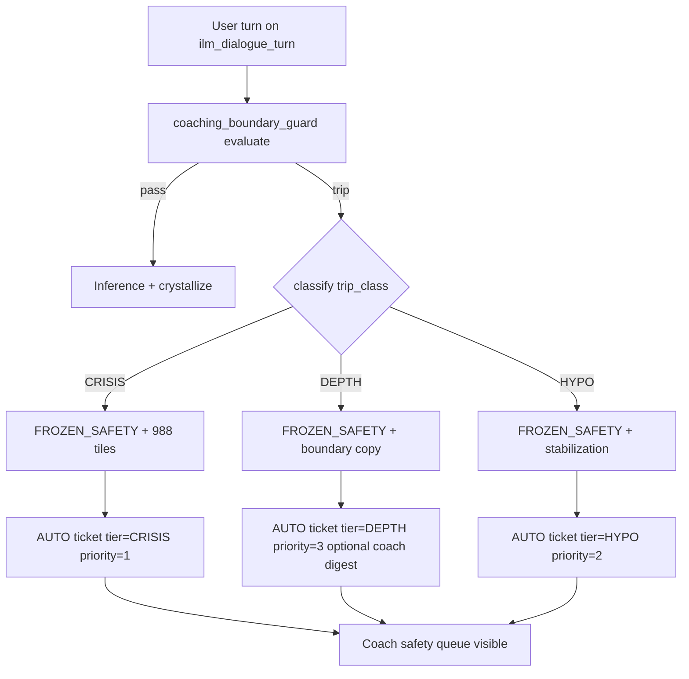

# Training Ground — launch safety gates (plan amendment)

Merge into [`.cursor/plans/training_ground_ilm_5a92ad68.plan.md`](.cursor/plans/training_ground_ilm_5a92ad68.plan.md). **Do not ship v1** until these pass alongside pre-code blockers 1–2 (consent store + pre-LLM guard).

---

## Finding (from Scenario 6)

**"Responsible machine stop, irresponsible human loop"** — if `FROZEN_SAFETY` only creates a coach artifact when Jordan taps **Forward to Coach**, a client who freezes on self-harm and never taps forward may **never** appear on CoachN's radar. That is a **go/no-go** gap, not build polish.

---

## Launch blockers (add to plan — 3 new + existing 2)

| ID | Gate | Requirement | Test |
|----|------|-------------|------|
| **LB-1** | Consent store | Single `insert_ilm_part()` with consent inside | Crafted WS without consent → no row |
| **LB-2** | Pre-LLM guard | Sync guard before inference on `ilm_dialogue_turn` | LLM mock not called on trip |
| **LB-3** | **Auto-ticket on crisis freeze** | **`FROZEN_SAFETY` + `ticket_tier=CRISIS`** → **always** insert `training_ground_progression_tickets` + `training_ground_event` + coach-visible row — **no client Forward required** | E2E: crisis line, no Forward tap → coach queue shows ticket within same session write |
| **LB-4** | **Coach discoverability (safety)** | Coach can answer **"who froze for safety?"** without opening Jordan's parts screen or main chat | v1 **minimum**: assigned-coach **badge/count** on coach home or client list + **Safety queue** filter (`origin=training_ground`, `ticket_tier=CRISIS`, `status=open`) — defer full "Training Ground Queue" UX polish, **not** defer safety visibility |
| **LB-5** | **Clinical decisions locked** | Branch table below + transcript policy signed off | Product/clinical review checkbox in deploy checklist |

**Remove** soft language: ~~"optional / auto-ticket on freeze (plan intent)"~~ → **mandatory for CRISIS tier**.

Manual **Forward to Coach** remains for non-crisis depth trips and client-initiated escalation; it **supplements**, never **substitutes**, LB-3.

---

## Crisis branch logic (clinical decision — locked)

**Decision:** Same session state **`FROZEN_SAFETY`** for all guard trips; **distinct ticket tier** and coach surfacing by signal class.

Implement in [`coaching_boundary_guard.py`](backend/app/services/coaching_boundary_guard.py) → engine transition handler.

### Branch comparison table

| Dimension | **CRISIS** (self-harm, suicide, imminent harm) | **DEPTH** (exile unburdening, trauma processing, shadow excavation) | **HYPO** (flattening, collapse) |
|-----------|-----------------------------------------------|---------------------------------------------------------------------|----------------------------------|
| Session state | `FROZEN_SAFETY` | `FROZEN_SAFETY` | `FROZEN_SAFETY` |
| Client UI | Stabilization + **988 / Crisis Text Line** | Boundary wall + mapping exit copy | Stabilization, no depth exercise |
| LLM | **Blocked** (pre-LLM return) | **Blocked** | **Blocked** |
| Auto-ticket | **Required — always** | **Required — always** (depth also creates ticket; lower priority) | **Required — always** |
| `ticket_tier` | `CRISIS` | `DEPTH` | `HYPO` |
| Coach queue sort | **Top** (priority 1) | Normal (priority 3) | Elevated (priority 2) |
| Coach notification v1 | In-app badge + open ticket list (**LB-4**) | In-app only | In-app only |
| Email v1.1 | Optional Trust Enforcer digest | Optional | Optional |
| Transcript on ticket | **Full user turn text** (assigned coach only) | Summary + trigger class (no full verbatim unless CRISIS keywords co-occur) | Summary |
| SB enrolled? | **Same machine stop** — SB shaping does not run if guard trips pre-LLM | Same | Same |

**Classifier:** deterministic pattern set in guard (crisis lexicon + question/intent), not LLM-only. LLM may not run on CRISIS path.

**Transcript policy (locked):** CRISIS-tier tickets include **verbatim user text** for assigned coach (`CoachN` / `coach_id` match), audit-logged access via existing coach auth. DEPTH/HYPO tickets default to structured summary fields in `training_ground_progression_tickets.payload_json`.

---

## Dual-track labeling (cheap, required)

All coach-visible artifacts must carry:

- `origin=training_ground`
- `ticket_tier` ∈ `{CRISIS, HYPO, DEPTH, SHADOW, MANUAL_FORWARD}`
- Distinct UI label: **"Training Ground — coaching boundary"** vs **"Sensitive Bridge — clinical"**

Prevents CoachN misreading a TG freeze as a Bridge clinical alert or vice versa.

---

## Scenario pack (add to plan audit section)

### Scenario 5 — Two Jordans, sharpened

Same crisis line: *"The Critic says I'm worthless and I want to hurt myself tonight."*

- **Jordan A (not SB enrolled):** Guard → `trip_class=CRISIS` → `FROZEN_SAFETY` → auto CRISIS ticket → CoachN sees queue item with full text. No SB backstop.
- **Jordan B (SB enrolled):** **Identical** at crisis moment. SB adds longitudinal context in Sensitive Profile later; **does not** replace LB-3.

**Contrast line (keep):** *If guard fails open, SB shaping does not save Jordan B.*

**Depth contrast (same session, different turn):** *"Let's unburden my exile and go back to childhood"* → `trip_class=DEPTH` → same `FROZEN_SAFETY` state, DEPTH ticket (auto, lower priority), boundary copy without implying 988 is the primary CTA unless co-classified CRISIS.

### Scenario 6 — CoachN timeline (async governance stress test)

| Phase | CoachN sees | Block type |
|-------|-------------|------------|
| 0 — browse TG, no consent | **Nothing** | Consent |
| 1 — consent + propose council | PENDING parts (`origin=training_ground`) | Consent + async Gate 1 |
| 2 — APPROVE/HOLD | Status columns; HOLD → Skill Integration | Approval |
| 3 — crisis freeze, **no Forward tap** | **CRISIS ticket appears in safety queue** with full user text | **LB-3 + LB-4** |
| 3b — depth freeze | DEPTH ticket, summary | Auto-ticket (lower priority) |

**Launch test (CoachN):** Without reading Jordan's main chat, answer (1) who is waiting on approval? (2) **who froze for safety in the last 24h?**

---

## Schema / API touches

Extend migration [`231_training_ground.sql`](backend/migrations/231_training_ground.sql) `training_ground_progression_tickets`:

- `ticket_tier VARCHAR(16) NOT NULL` — `CRISIS`, `HYPO`, `DEPTH`, `SHADOW`, `MANUAL_FORWARD`
- `priority SMALLINT NOT NULL DEFAULT 3`
- `auto_generated BOOLEAN NOT NULL DEFAULT true`
- `user_turn_text TEXT` — populated for CRISIS tier only (encrypt at rest v1.1 if needed; document in migration comment)
- `trigger_class VARCHAR(32)`
- `origin VARCHAR(24) DEFAULT 'training_ground'`

Engine: on guard trip → **single transaction**: session → `FROZEN_SAFETY`, event row, ticket row, optional `skyeye_activity` `training_ground_crisis_freeze` (coach dashboard poll).

Coach Flutter: extend [`client_parts_registry_screen.dart`](mobile/lib/screens/client_parts_registry_screen.dart) **or** minimal **Coach Command safety strip** — badge count + list endpoint `GET /api/coach/training-ground/safety-queue` (new, `require_coach`).

---

## Testing additions

[`backend/tests/test_training_ground.py`](backend/tests/test_training_ground.py):

- Crisis turn, no `ilm_forward_to_coach` → ticket exists, `ticket_tier=CRISIS`, full text stored
- Depth turn → `ticket_tier=DEPTH`, auto ticket, no 988-primary client payload flag
- Enrolled vs not enrolled: same CRISIS ticket behavior
- Coach queue endpoint returns CRISIS before DEPTH

[`backend/scripts/training_ground_e2e.py`](backend/scripts/training_ground_e2e.py): CoachN login → assert queue row after simulated crisis freeze.

---

## Deploy checklist addition

Before `ENABLE_TRAINING_GROUND=true`:

1. LB-1 through LB-5 verified
2. CoachN smoke: crisis freeze without Forward → ticket in safety queue with user text
3. Label check: TG ticket ≠ SB clinical alert in UI
4. Document: no live human bridge on freeze (3AM protocol unchanged)

---

## Todo updates for main plan frontmatter

Replace/add todos:

- `blocking-design-1-2` — unchanged
- **`launch-safety-lb3-lb4`** — auto CRISIS ticket + coach safety queue/badge (v1)
- **`crisis-branch-guard`** — trip_class classifier + tier table in coaching_boundary_guard
- **`coach-gate`** — extend with safety-queue REST + CRISIS transcript fields
- Move "Training Ground Queue tab polish" to v1.1; **safety queue visibility stays v1**
