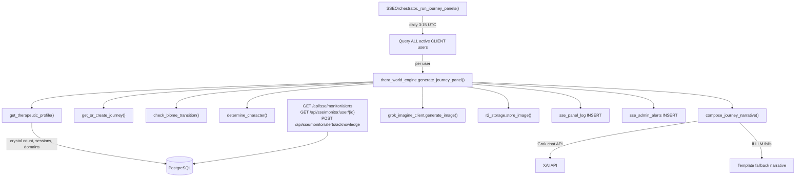

# Phase 1: Thera-World Core Engine + Data Model

## Key Design Principle

Journey panels are **independent of workbook enrollment**. A user can have BOTH a workbook storyboard AND daily journey panels running in parallel. Workbooks are structured side-quest content assigned by admin/coach. Journeys are the autonomous, lifelong main thread generated from crystal memory. They are parallel streams -- never exclusive.

## Architecture

## Step 1: Migration -- `backend/migrations/174_sse_thera_world.sql`

5 new tables, 4 indexes. All additive, no ALTER/DROP.

- `sse_user_journeys` -- one row per user, tracks biome/phase/character/arc
- `sse_quests` -- user-initiated growth goals
- `sse_missions` -- relational work tracking
- `sse_panel_log` -- unified log of all generated panels (journey, quest, mission, workbook)
- `sse_admin_alerts` -- events for admin monitoring (journey_started, biome_transition, etc.)

## Step 2: New file -- `backend/app/sse/thera_world_engine.py` (max 300 lines)

Key design decisions:

- **LLM calls**: Follow the `layer1_identity_forge.py` pattern -- `httpx.AsyncClient` with `NATE_CHAT_URL` + `XAI_API_KEY`/`NATE_CHAT_KEY`, `Bearer` auth, `grok-3-mini` model
- **LLM fallback**: If Grok chat fails, `compose_journey_narrative()` returns a template-based fallback so panel generation never fails due to LLM downtime:
  - `narrative_text`: `"In the {biome_name}, the {character_name} watches and waits. The path forward is becoming clearer."`
  - `image_prompt`: `"{biome_description}, a solitary figure in the landscape, {grok_suffix}, painterly style, muted warm palette"`
  - `panel_tone`: `"meditative"`
- **Image generation**: Use existing `grok_imagine_client.generate_image(prompt)` from [infrastructure/grok_imagine_client.py](backend/app/sse/infrastructure/grok_imagine_client.py)
- **R2 storage**: Use existing `r2_storage.store_image(bytes, key)` from [infrastructure/r2_storage.py](backend/app/sse/infrastructure/r2_storage.py)
- **No Redis for v1**: SSE module has zero Redis usage. Use in-memory `dict` with TTL check (profile changes slowly -- 1h staleness is fine). Redis can be added in Phase 2 if needed.
- **Session count**: Query `conversation_history` table for distinct session counting
- **User scope**: Journey panels target ALL active CLIENT users (from `users` table WHERE `role='CLIENT'` AND `subscription_status='ACTIVE'`), not just `sse_enrolled_users`. Every paying user gets a journey panel.

Functions (7 total):

- `get_or_create_journey` (~25 lines) -- SELECT/INSERT sse_user_journeys, INSERT admin alert on creation
- `get_therapeutic_profile` (~40 lines) -- Query crystals (count + top domains + recent text), session count, active quests/missions. In-memory cache with 1h TTL
- `check_biome_transition` (~25 lines) -- Compare profile against BIOME_THRESHOLDS, UPDATE + alert if transition earned
- `determine_character` (~15 lines) -- Map dominant crystal domain via CRYSTAL_TO_CHARACTER, default to Mirror
- `compose_journey_narrative` (~55 lines) -- Build prompt with biome/character/crystals/quest/mission context, call Grok chat, parse JSON. On LLM failure, return template fallback (never raises)
- `generate_journey_panel` (~40 lines) -- Full pipeline: journey -> profile -> biome check -> character -> narrative -> image -> R2 -> panel_log -> update journey
- `get_user_sse_status` (~35 lines) -- Aggregate query for admin monitor. Includes workbook enrollment via `sse_enrolled_users` JOIN `sse_ip_provenance` to get storyboard title alongside journey/quest/mission state and recent panels

Constants at top: `CRYSTAL_TO_CHARACTER` dict (32 entries -- full therapeutic coverage), `BIOME_THRESHOLDS` list (5 biomes), `_profile_cache` dict.

### CRYSTAL_TO_CHARACTER full mapping (32 entries)

Original 15 entries from task spec plus 17 additional therapeutic domains:

- attachment, love, trust -> Mirror
- shame, deception -> Serpent
- guilt -> Pride/Shame
- identity, self-worth -> Reflection
- faith, hope, spiritual -> Holy Spirit
- wonder, growth, discovery -> Curiosity
- anger, fear, control, resentment -> Serpent (added)
- anxiety, loss, abandonment, codependency, depression -> Mirror (added)
- grief, boundaries, rejection -> Reflection (added)
- trauma, perfectionism -> Pride/Shame (added)
- loneliness, vulnerability -> Curiosity (added)
- forgiveness -> Holy Spirit (added)

`determine_character()` uses this dict with a catch-all default: if no domain matches any key, returns `("Mirror", "with a faint reflection visible in still water nearby, suggesting hidden depth")`.

## Step 3: Modify `backend/app/sse/layer0_orchestrator.py` (max 20 new lines)

Add a new method `_run_journey_panels()` and register it as a daily job at 3:15 UTC (15 min after workbook panels at 3:00). Journey generation is separate from per-storyboard workbook generation.

Changes to `start()` (~5 lines):
- Add a `CronTrigger(minute="15", hour="3")` job calling `self._run_journey_panels`

New method `_run_journey_panels()` (~15 lines):
- Query ALL active clients (verified schema: `users` table, columns `username`, `role`, `subscription_status`):
  `SELECT username FROM users WHERE role='CLIENT' AND subscription_status IN ('ACTIVE','TRIAL_ACTIVE')`
  Currently 23 users (14 ACTIVE + 9 TRIAL_ACTIVE). Excludes 3 CANCELLED.
- For each user, call `thera_world_engine.generate_journey_panel(user_id, self.db_pool)`
- try/except per user -- one failure doesn't block others
- Log total generated and any failures

## Step 4: Admin endpoints on `sse_router` in `backend/app/routers/admin.py` (max 25 lines)

Three new endpoints appended to the existing `sse_router`:

- `GET /api/sse/monitor/alerts` -- query `sse_admin_alerts` with optional `?acknowledged=false` filter, newest first, LIMIT 100
- `POST /api/sse/monitor/alerts/acknowledge` -- set `acknowledged=true` for given `alert_id`
- `GET /api/sse/monitor/user/{user_id}` -- call `thera_world_engine.get_user_sse_status()` for full SSE state (journey + quests + missions + workbook enrollments with storyboard titles + recent panels)

## Step 5: Deploy sequence

1. `scp` migration SQL to GREEN
2. Run migration from inside `nate_backend` container using asyncpg (same pattern as verification scripts): `docker exec nate_backend python -c "import asyncio, asyncpg, os; ..."`  -- NOT via `nate_postgres` container
3. `scp` thera_world_engine.py, layer0_orchestrator.py, admin.py to GREEN
4. `docker compose -f docker-compose.prod.yml restart backend`
5. Verify startup health (104/104 or higher)
6. Manual test: `docker exec nate_backend python -c "..."` to run `generate_journey_panel` for a test user

## Files touched

- `backend/migrations/174_sse_thera_world.sql` -- NEW (~40 lines)
- `backend/app/sse/thera_world_engine.py` -- NEW (~290 lines)
- `backend/app/sse/layer0_orchestrator.py` -- MODIFY (~20 new lines)
- `backend/app/routers/admin.py` -- MODIFY (~25 new lines)

## Not touched (per rules)

- `main.py`, `bridge_server.py`, `littlenate_inference.py`, `nate_memory_crystallizer.py`
- No new service registration needed -- orchestrator already exists on `app.state`
