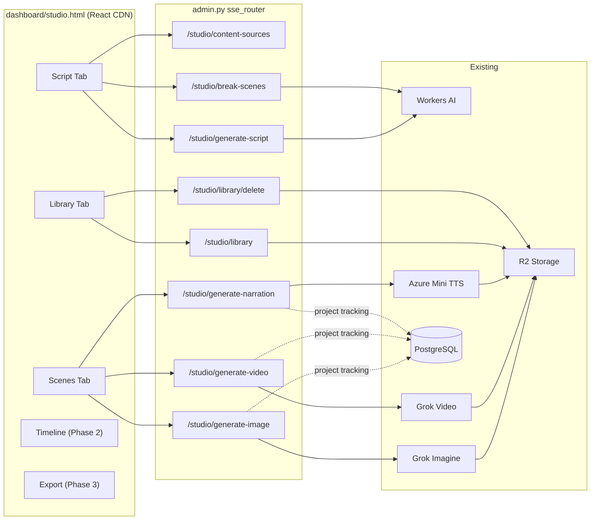

# Thera-World Studio -- Phase 1

## Architecture



---

## 1. Navigation: Studio tab in Sovereign Command

[command.html](dashboard/command.html) has a horizontal `.nav-tab` bar. SSE Monitor is at line 1056:

```1056:1058:dashboard/command.html
        <div class="nav-tab" data-tab="sse_monitor" onclick="navTo('sse_monitoring.html')">
            <span>📡</span> SSE Monitor
        </div>
```

Add a Studio tab immediately after it:

```html
<div class="nav-tab" data-tab="studio" onclick="navTo('studio.html')">
    <span>🎬</span> Studio
</div>
```

In [sse_monitoring.html](dashboard/sse_monitoring.html), add a link to Studio in the top bar area. In `studio.html`, add a back-link to SSE Monitor. Bidirectional navigation.

---

## 2. Preset system -- decouple from hardcoded prompts

The existing [trailer_generator.py](backend/app/sse/trailer_generator.py) hardcodes 19 `SCENE_PROMPTS`. Refactor:

- **Move the 19 scenes** to a JSON preset file: `backend/app/sse/data/studio_presets/thera_world_origin.json`
- **Refactor `generate_all_scenes(scenes_list, project_id)`** to accept any list of scene dicts, not the hardcoded list
- **Keep backward compat**: the existing `/admin/generate-trailer` endpoint loads the preset and passes it to the refactored function
- **New preset loading endpoint**: `GET /admin/studio/presets` returns available preset names; `GET /admin/studio/presets/{name}` returns the scene list

Preset JSON schema:

```json
{
  "id": "thera_world_origin",
  "title": "Thera-World: A Journey of Two Worlds",
  "description": "19-scene cinematic trailer for the origin story",
  "scenes": [
    {"scene": 1, "title": "the_boy_and_the_tree", "prompt": "Cinematic wide shot..."}
  ]
}
```

---

## 3. Project persistence -- Migration 178

File: `backend/migrations/178_sse_studio_projects.sql`

```sql
CREATE TABLE IF NOT EXISTS sse_studio_projects (
    project_id UUID PRIMARY KEY DEFAULT gen_random_uuid(),
    title TEXT NOT NULL,
    scene_count INT DEFAULT 0,
    status TEXT DEFAULT 'draft',
    manifest JSONB DEFAULT '{}',
    estimated_cost_cents INT DEFAULT 0,
    actual_cost_cents INT DEFAULT 0,
    created_at TIMESTAMPTZ DEFAULT now(),
    updated_at TIMESTAMPTZ DEFAULT now()
);
CREATE INDEX IF NOT EXISTS idx_studio_projects_status ON sse_studio_projects(status);
```

- `manifest` JSONB stores the full scene list with R2 URLs and generation statuses (replaces `/tmp/` manifest files)
- `status`: `draft` | `generating` | `complete` | `failed`
- Cost fields track estimated vs actual spend per project

---

## 4. Cost tracking

Constants in `studio_service.py`:

- `COST_PER_IMAGE_CENTS = 7` ($0.07 per Grok Imagine call)
- `COST_PER_VIDEO_CENTS = 25` ($0.25 per Grok Video call)
- `COST_PER_NARRATION_CENTS = 1` ($0.01 per Azure TTS call, negligible)

Before generation, the UI shows: "This will generate N images (~$X.XX) and N video clips (~$Y.YY). Estimated total: $Z.ZZ. Proceed?"

After each generation call, `actual_cost_cents` is incremented on the project row.

---

## 5. Media Library

### Backend

`GET /api/sse/admin/studio/library` -- uses the existing [r2_storage.list_objects](backend/app/services/r2_storage.py) (line 204) but needs richer metadata. Create a helper in `studio_service.py` that calls `list_objects_v2` directly to get `Key`, `Size`, `LastModified` from R2 for prefixes `sse/trailer/` and `sse/studio/`. Also uses `delete_object_async` (line 195) for the delete endpoint.

Returns:

```json
{
  "items": [
    {"key": "sse/studio/images/abc.png", "url": "https://...", "size_bytes": 102400, "last_modified": "...", "type": "image"},
    {"key": "sse/studio/videos/def.mp4", "url": "https://...", "size_bytes": 2048000, "last_modified": "...", "type": "video"}
  ],
  "total_size_bytes": 12345678,
  "count": 42
}
```

`DELETE /api/sse/admin/studio/library/delete` -- body `{"key": "sse/studio/..."}` -- calls `delete_object_async`.

### Frontend

Library tab in `studio.html`:

- Grid of thumbnails (images render inline via ``, videos show `<video>` with poster)
- Filter tabs: All | Images | Clips | Trailers
- Click to preview full-size in a modal
- Download button (direct R2 URL)
- Delete button (confirm dialog, then DELETE call)
- Total storage counter at top

---

## 6. Backend service: `backend/app/sse/studio_service.py` (NEW)

All business logic for Studio endpoints:

- `get_content_sources()` -- aggregates story plots from [data/story_plots/](backend/app/sse/data/story_plots/), biomes from `BIOME_THRESHOLDS` in [thera_world_engine.py](backend/app/sse/thera_world_engine.py), archetypes from [layer1_identity_forge.py](backend/app/sse/layer1_identity_forge.py), workbook metadata from [protocol_workbooks/metadata.json](backend/resources/therapeutic_library/protocol_workbooks/metadata.json), NPCs from `TEMPLATE_NPCS` in [quest_mission_engine.py](backend/app/sse/quest_mission_engine.py)
- `generate_script(prompt, source_ids)` -- calls Workers AI via `WORKERS_AI_URL` / `WORKERS_AI_TOKEN` following the pattern from [nate_inference_router.py line 335](backend/app/services/nate_inference_router.py)
- `break_into_scenes(script_text)` -- calls Workers AI with structured output prompt
- `generate_narration(text, voice)` -- calls Azure Mini TTS following [voice_router.py line 376](backend/app/services/voice_router.py), uploads MP3 to R2
- `list_library_items(prefix)` -- calls R2 `list_objects_v2` with full metadata
- `create_project(title, scenes)` / `update_project(project_id, manifest)` -- PostgreSQL CRUD
- Cost estimate helpers

Voice mapping for narration:

| Voice ID | Azure voice | Instructions |
|----------|------------|--------------|
| serpent | ash | Deep, resonant, ancient and mysterious |
| boy | echo | Young boy, age 6, wonder and innocence |
| girl | shimmer | Young girl, age 6, bright and cheerful |
| narrator | onyx | Clear, authoritative cinematic narration |

---

## 7. Endpoints in `admin.py` (additive to `sse_router`)

8 endpoints, each a thin wrapper calling `studio_service.py`:

- `GET /admin/studio/content-sources`
- `POST /admin/studio/generate-script` -- body: `{prompt, content_sources[]}`
- `POST /admin/studio/break-scenes` -- body: `{script}`
- `POST /admin/studio/generate-image` -- body: `{scene_description}` -- calls `grok_imagine_client.generate_image` + `r2_storage.store_image`
- `POST /admin/studio/generate-video` -- body: `{image_url, motion_prompt}` -- calls `generate_video` + polls + `store_video`
- `POST /admin/studio/generate-narration` -- body: `{text, voice}`
- `GET /admin/studio/library` -- lists all R2 objects under `sse/trailer/` + `sse/studio/`
- `POST /admin/studio/library/delete` -- body: `{key}` -- deletes from R2

Plus: `GET /admin/studio/presets` and `GET /admin/studio/presets/{name}` for preset loading.

---

## 8. Frontend: `dashboard/studio.html` (NEW)

React via CDN:

```html
<script src="https://unpkg.com/react@18/umd/react.production.min.js"></script>
<script src="https://unpkg.com/react-dom@18/umd/react-dom.production.min.js"></script>
<script src="https://unpkg.com/@babel/standalone/babel.min.js"></script>
<script src="https://cdn.tailwindcss.com"></script>
```

Auth: `_recoverAuth()` + `_authHeaders()` from [token_lab.html](dashboard/token_lab.html) pattern.

Design: Tailwind + design system CSS vars (`--void: #050505`, `--gold: #C9A962`, etc.).

### Tab 1: Script

- Left 70%: `<textarea>` editor with dark theme
- Right 30%: Content source browser (collapsible accordions for Plots, Biomes, Archetypes, Workbooks, NPCs -- fetched from `/content-sources`)
- Top bar: "Load Preset" dropdown (fetches `/presets`, loads preset scenes directly into Scene tab)
- AI prompt input + "Generate Script" button
- "Break into Scenes" button: calls `/break-scenes`, populates scenes state
- Scene breakdown list: each scene shows number, description, duration slider (3-15s), mood selector

### Tab 2: Scenes

- Top: cost estimate banner ("19 images = ~$1.33, 19 videos = ~$4.75, Total: ~$6.08")
- "Generate All Images" / "Generate All Videos" batch buttons with confirm dialog showing cost
- 3-column grid of scene cards, each with:
  - Scene number + description
  - Image preview + "Generate" / "Regenerate" buttons
  - Video preview (`<video>` element) + "Generate Video" / "Regenerate" buttons
  - Audio controls + voice selector + "Generate Audio" button
  - Loading spinner during generation
  - Cost badge showing per-scene spend

### Tab 3: Library

- Filter bar: All | Images | Clips | Trailers
- Storage counter ("142 items, 847 MB")
- Grid of media cards: thumbnail, filename, size, date
- Click: modal preview (full-size image or video player)
- Download + Delete buttons per item

### Tabs 4-5: Timeline / Export

- Placeholder with "Coming in Phase 2/3" message

---

## 9. Refactor `trailer_generator.py`

Current file has hardcoded `SCENE_PROMPTS`. Refactor to:

- Move 19 scenes to `backend/app/sse/data/studio_presets/thera_world_origin.json`
- `generate_all_scenes(scenes_list, project_id=None)` accepts any scene list
- If `project_id` is provided, update `sse_studio_projects` row with manifest + status
- Keep `_write_manifest()` for backward compat with the existing `/admin/trailer-status` endpoint
- The existing `/admin/generate-trailer` endpoint loads the preset file and calls the refactored function

---

## 10. Deploy

- `scp` new files: `studio_service.py`, `studio.html`, `thera_world_origin.json`, migration 178
- `scp` modified files: `admin.py`, `trailer_generator.py`, `command.html`, `sse_monitoring.html`
- Run migration 178 on GREEN
- Deploy `studio.html` to all 3 dashboard directories
- Deploy `command.html` + `sse_monitoring.html` to all 3 dashboard directories
- Restart backend, verify 112/112 healthy

---

## Files summary

| File | Action | Lines |
|------|--------|-------|
| `backend/migrations/178_sse_studio_projects.sql` | NEW | ~10 |
| `backend/app/sse/studio_service.py` | NEW | ~250 |
| `backend/app/sse/data/studio_presets/thera_world_origin.json` | NEW | ~200 |
| `backend/app/sse/trailer_generator.py` | MODIFY | ~20 changed |
| `backend/app/routers/admin.py` | MODIFY | ~80 added |
| `dashboard/studio.html` | NEW | ~800 |
| `dashboard/command.html` | MODIFY | ~3 added |
| `dashboard/sse_monitoring.html` | MODIFY | ~3 added |
