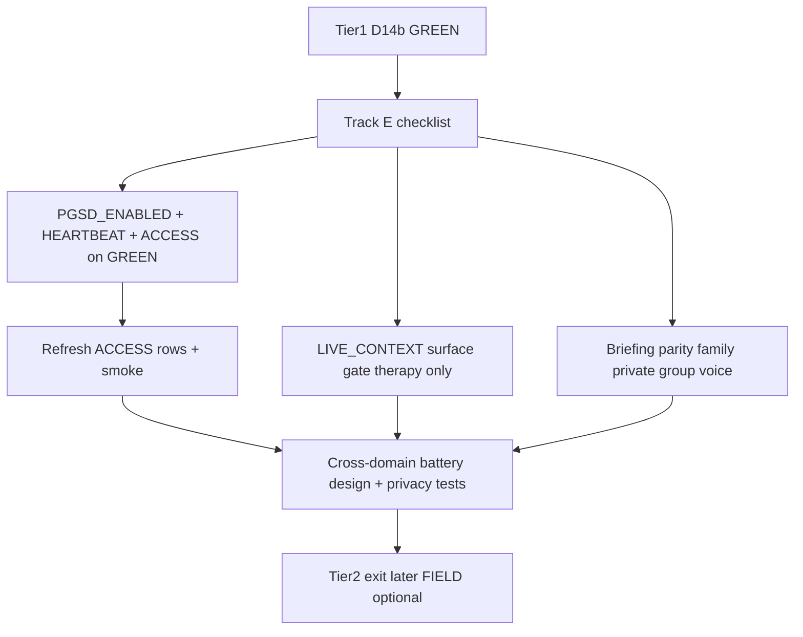

# Tier 2 Narrow AGI — Kickoff Milestone

**Default chosen:** Coordinated Track E — ACCESS smoke + LIVE_CONTEXT surface gate + battery design spike. **No** `ENABLE_PGSD_FIELD` until ACCESS has live rows. **No** “Narrow AGI certified” language until family/DOJO/ops batteries + privacy walls pass.

Substrate already exists (Phase E code): [`pgsd_correlation.py`](backend/app/services/pgsd_correlation.py), [`pgsd_discernment_scorer.py`](backend/app/services/pgsd_discernment_scorer.py), [`pgsd_handlers.py`](backend/app/websocket/pgsd_handlers.py), Queen tools `query_pgsd_*` in [`cli_tools.py`](backend/app/websocket/cli_tools.py), mig `283_pgsd_access_field.sql`. Journey still lists Tier 2 as next after D.14b ([`CLINICAL_AGI_ASI_JOURNEY.md`](docs/CLINICAL_AGI_ASI_JOURNEY.md)).

## Phase 0 — Honesty + Track E (docs)

- Update [`docs/CLINICAL_AGI_ASI_JOURNEY.md`](docs/CLINICAL_AGI_ASI_JOURNEY.md): Tier 2 status → **OPEN / kickoff**; substrate ≠ certification.
- Add **Track E** rows to [`docs/AGENTIC_ROLLOUT_CHECKLIST.md`](docs/AGENTIC_ROLLOUT_CHECKLIST.md): E.1 ACCESS flags, E.2 LIVE_CONTEXT gate, E.3 briefing parity, E.4 privacy walls, E.5 domain batteries, E.6 agreement evidence.
- Fix stale line in [`docs/PGSD_WIRING.md`](docs/PGSD_WIRING.md) if it still calls `pgsd_cross_domain_agreement` “future”.

## Phase 1 — LIVE_CONTEXT contamination fuse (code, first)

**Why first:** AQ `live_focus` is already on GREEN; Tier 2 surfaces must not inherit clinical cues.

- In [`six_quotient_live_context.py`](backend/app/services/six_quotient_live_context.py): add `surface` param; default allowlist `{"bridge_chat","therapy"}` (or whatever the therapy call site passes); return `""` for other surfaces.
- Update sole call site in [`therapeutic_controller.py`](backend/app/services/therapeutic_controller.py) / bridge TTC path to pass `surface="bridge_chat"`.
- Offline test: family/voice surface → empty addendum; therapy → non-empty when focus present.

## Phase 2 — PGSD ACCESS on GREEN (ops + smoke)

Flag ladder only (compose already documents pattern):

1. Confirm mig **283** applied on GREEN.
2. Set `PGSD_ENABLED=true` → `ENABLE_PGSD_HEARTBEAT=true` → `ENABLE_PGSD_ACCESS=true` (FIELD stays **false**).
3. `safe_deploy.sh backend`.
4. Run [`backend/scripts/pgsd_refresh_access_field.py`](backend/scripts/pgsd_refresh_access_field.py) (or documented refresh) against a **test family**.
5. Verify rows: `pgsd_chat_correlation`, `pgsd_discernment_scores`, `pgsd_cross_domain_agreement`; WS/admin [`dashboard/pgsd.html`](dashboard/pgsd.html) non-empty.

## Phase 3 — Briefing parity (R8)

Inject `pgsd_briefing.build_field_briefing` (read-only, short) on crystal-bearing AI paths that already `notify_user` but lack briefing:

- Family sanctuary / private / group coaching in [`bridge_server.py`](backend/app/websocket/bridge_server.py) — **≤50 lines per hook**, feature-flagged behind `ENABLE_PGSD_ACCESS`.
- Voice: [`twilio_grok_xtts_pipeline.py`](backend/app/services/twilio_grok_xtts_pipeline.py) grounded prompt — same gate; no LIVE_CONTEXT.

Do **not** inject six-quotient AQ focus on these paths.

## Phase 4 — Cross-domain battery design spike (no cert claim)

New design + scaffolding only (no Sunday auto-act expansion):

- Spec doc section: domains = `therapy | family | dojo | voice | ops`; privacy wall = no cross-member crystal recall / no clinical live_focus bleed.
- Skeleton service e.g. `backend/app/services/tier2_cross_domain_battery.py` + migration stub for `tier2_domain_eval_runs` (or reuse PGSD agreement as scoreboard v0).
- Offline privacy tests: family member A cannot recall B’s user-scoped crystals; LIVE_CONTEXT empty on sanctuary path.
- Wire checklist E.4/E.5 as open until first scored multi-domain pack exists.

## Explicitly out of this milestone

- `ENABLE_PGSD_FIELD` / Patent 12 claims activation
- Flutter coach PGSD UI
- Renaming Queen tools to plan aliases (document `query_pgsd_*` as canonical)
- Claiming “Narrow AGI completed”
- Lowering Tier-1 κ/gold locks

## Success criteria (kickoff done)

| Check | Pass |
|-------|------|
| Track E in checklist | Present |
| LIVE_CONTEXT surface gate | Tests green; sanctuary gets no AQ addendum |
| ACCESS on GREEN | Discernment + cross-domain rows for test family |
| Briefing | Present on chat + at least family + voice behind ACCESS |
| FIELD | Still false |
| Language | “Tier 2 kickoff / substrate” only |