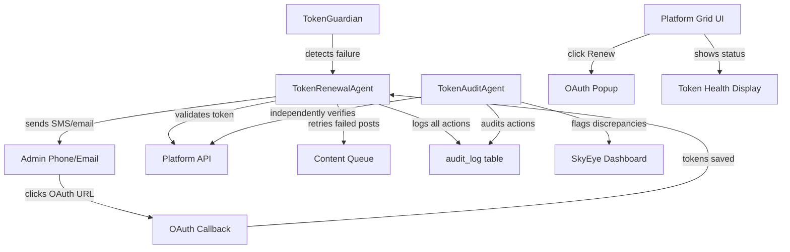

# Token Renewal System — Manual UI + Autonomous Agent + Audit Agent

## Architecture

## Option A — Manual Renewal UI in SkyEye

Add a **Token Health** section to the existing Platform Grid tab in [dashboard/skyeye.html](dashboard/skyeye.html).

**What it shows per platform:**

- Status indicator: green (valid), amber (expiring within 24h), red (expired/failed)
- Token expiry countdown (e.g., "Expires in 3d 12h" or "Expired 2h ago")
- Last refresh attempt and result
- "Renew" button that opens the OAuth authorization popup (reuses existing `connectPlatform()` logic)

**Implementation:**

- Add `loadTokenHealth()` function that calls `GET /api/skyeye/platforms/status` (already exists)
- Add HTML block inside `tab-platform-grid` section with per-platform status cards
- Wire "Renew" buttons to existing `connectPlatform(platform)` function (line 3104 of skyeye.html)
- Auto-refresh every 60 seconds when the Platform Grid tab is active

**Backend:** No new endpoints needed — the existing `GET /api/skyeye/platforms/status` returns token health per platform. Add `token_expiry` and `last_refresh_error` to the response if not already present.

## Option B — Autonomous Token Renewal Agent

New file: `backend/app/services/token_renewal_agent.py`

Follows the existing worker pattern from [backend/app/workers/briefing_worker.py](backend/app/workers/briefing_worker.py): `start()` / `_run_loop()` / `stop()` with async loop.

**Agent loop (runs every 15 minutes):**

1. **Detect** — Query `skyeye_platform_tokens` for platforms with `status = 'expired'` or `token_expiry < NOW() + interval '30 minutes'`
2. **Attempt auto-refresh** — For each failing platform, call `adapter.refresh_token()`. If refresh succeeds, mark resolved and move on
3. **Notify if refresh fails** — If auto-refresh fails (needs human OAuth click):
  - Build the OAuth authorization URL for the platform
  - Send SMS to admin via `notification_system.send_sms()` with the platform name and a short message: "Sovereign Sanctuary: {platform} token expired. Re-authorize: {oauth_url}"
  - Send email via `notification_system._send_email()` with clickable OAuth link
  - Log notification to `skyeye_activity` table with type `token_renewal_notification`
  - Track in-memory: `_pending_renewals[platform] = {notified_at, attempts}`
4. **Watch for resolution** — On each loop iteration, check if previously-failing platforms now have valid tokens (OAuth callback would have saved new tokens)
5. **Validate after renewal** — When a token transitions from expired to valid:
  - Call `adapter.authenticate()` to verify the token actually works
  - Set a **green light** flag: insert `token_renewal_validated` event into `skyeye_activity` with `severity = 'success'`
  - If validation fails, re-enter the notification cycle
6. **Retry failed posts** — After successful validation, query `skyeye_content_queue` for items with `status = 'failed'` on that platform, update their status to `approved` so the next SkyEye session picks them up
7. **Cooldown** — Don't re-notify for the same platform more than once per 2 hours

**Validation green light signal (visible in UI):**

- Insert into `skyeye_activity`: `{type: 'token_renewal_validated', platform: '...', content: 'Token validated — platform operational', severity: 'success'}`
- The existing Activity Feed tab in SkyEye will display this automatically

**Registration in main.py:**

- Create instance in lifespan startup, store in `app.state.token_renewal_agent`
- Pass `db_pool`, `notification_system`, and platform adapters

## Audit Agent — Audits the Renewal Agent

New file: `backend/app/services/token_audit_agent.py`

**Agent loop (runs every 30 minutes, offset from renewal agent):**

1. **Audit renewal actions** — Query `skyeye_activity` for recent `token_renewal_*` events. For each:
  - Verify the claimed outcome matches reality (e.g., if `token_renewal_validated` was logged, independently check `skyeye_platform_tokens` status and call `adapter.authenticate()`)
  - If discrepancy found: log `token_audit_discrepancy` to `audit_log` table with `action_type = 'SECURITY'`
2. **Independent health check** — For ALL platforms (not just ones the renewal agent flagged):
  - Query token status from DB
  - Call `adapter.authenticate()` to independently verify
  - Compare result with what Token Guardian and Renewal Agent report
  - Flag any platform that is broken but was NOT flagged by the renewal agent
3. **Notification gap check** — Verify that for every platform in `expired` status for >30 minutes, a notification was sent. If not, log `token_audit_notification_gap` and send its own notification
4. **Queue integrity check** — Verify that failed posts on now-valid platforms have been re-queued. Flag any that were missed
5. **Report** — Insert `token_audit_report` into `skyeye_activity` with summary: platforms checked, discrepancies found, missed notifications, queue items stuck

**Audit log entries use:**

- `action_type = 'SECURITY'` for discrepancies
- `action_type = 'APPROVE'` for clean audits
- `compliance_flags = ['AUDIT']` on all entries
- Immutable (protected by `audit_log_immutable` trigger)

**Registration:** Same pattern — created in `main.py` lifespan, stored in `app.state.token_audit_agent`

## Files to Create/Modify

- **New:** `backend/app/services/token_renewal_agent.py` — Option B agent
- **New:** `backend/app/services/token_audit_agent.py` — Audit agent
- **Modify:** [dashboard/skyeye.html](dashboard/skyeye.html) — Option A UI (token health section in Platform Grid tab, ~50 lines HTML + ~80 lines JS)
- **Modify:** [backend/app/main.py](backend/app/main.py) — Register both agents in lifespan startup/shutdown
- **Modify:** [backend/app/services/token_guardian.py](backend/app/services/token_guardian.py) — Minor: expose `get_platform_status()` method for audit agent to compare against
- **Modify:** [backend/app/routers/skyeye_api.py](backend/app/routers/skyeye_api.py) — Add `token_expiry` and `last_error` to platform status response if missing

