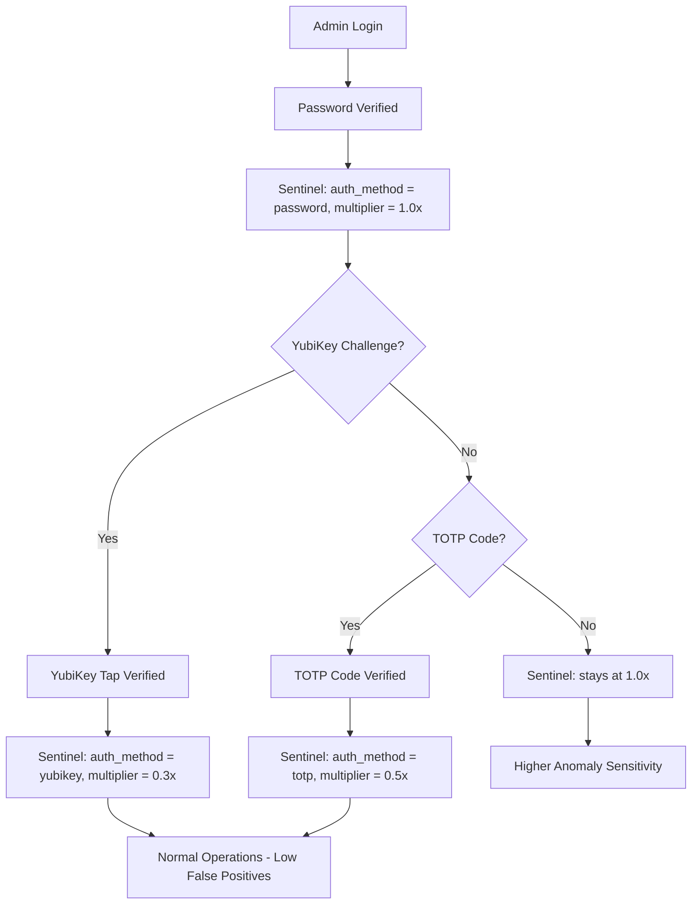

# TOTP, SMS, Sentinel Integration, and Hardware Security Trust Auditor

## Current State

- 2 YubiKeys registered (Primary + Backup) in PostgreSQL `profile_data`
- SMS verification exists via Twilio Verify (WebSocket-only, used during passphrase flow)
- No TOTP implementation exists anywhere in the codebase
- Sentinel scores admin actions but has **no awareness** of auth method (YubiKey, TOTP, password)
- Sentinel's `score_action()` receives empty strings for IP and user_agent, effectively disabling IP/device anomaly detection

## Part 1: TOTP Authenticator Setup

Add REST endpoints in [backend/app/routers/admin.py](backend/app/routers/admin.py) (same pattern as WebAuthn endpoints):

- `POST /api/admin/totp/setup` -- Generate TOTP secret using `pyotp`, return provisioning URI + QR code data (base32 secret). Store `totp_secret` in PostgreSQL `profile_data`
- `POST /api/admin/totp/verify` -- Validate a 6-digit code against the stored secret. On success, set `totp_enabled: true` in `profile_data`
- `GET /api/admin/totp/status` -- Return whether TOTP is configured

Add UI in `skyeye.html` Hardware Security tab:

- "Configure TOTP" button that shows the secret/QR provisioning URI
- Input field to verify the first code
- Green checkmark on success

**Dependency:** `pyotp` must be installed in `nate_backend` container.

## Part 2: SMS Verification Phone Setup

SMS sending already works via Twilio Verify in [backend/app/websocket/bridge_server.py](backend/app/websocket/bridge_server.py) (lines 991-1008). Currently the admin phone is hardcoded in `ADMIN_VERIFY_PHONE` env var.

Add REST endpoints in [backend/app/routers/admin.py](backend/app/routers/admin.py):

- `POST /api/admin/sms/set-phone` -- Store/update admin phone in PostgreSQL `profile_data.phone`
- `POST /api/admin/sms/send-verify` -- Send OTP to stored phone via Twilio Verify
- `POST /api/admin/sms/confirm` -- Verify OTP code, set `sms_verified: true` in `profile_data`
- `GET /api/admin/sms/status` -- Return whether SMS is configured

Add UI in `skyeye.html` Hardware Security tab:

- Phone number input field
- "Send Verification Code" button
- Code entry + verify button
- Green checkmark on success

## Part 3: Sentinel YubiKey/Auth-Method Awareness

This is the critical piece that answers the false-positive question.

### Changes to [backend/app/websocket/bridge_server.py](backend/app/websocket/bridge_server.py):

1. **Track auth method per session** -- When admin authenticates, record how:
  - Password-only: `auth_method = "password"`
  - After WebAuthn verify: `auth_method = "yubikey"`
  - After TOTP verify: `auth_method = "totp"`
2. **Pass auth method to Sentinel** -- Extend `score_action()` call to include `auth_method`
3. **Pass IP and user_agent** -- The `client_ip` is already extracted at line 7344 but never passed. Fix: pass `client_ip` and extract `user_agent` from WebSocket headers

### Changes to [backend/app/websocket/sentinel.py](backend/app/websocket/sentinel.py):

1. **Auth-method score modifier** -- If session has `auth_method = "yubikey"`:
  - Reduce all anomaly scores by 70% (physical key proves physical presence)
  - Raise freeze threshold from 80 to 150
  - Raise warn threshold from 50 to 100
  - Unknown IP penalty drops from 40 to 12
  - Unknown device penalty drops from 30 to 9
2. **Known YubiKey = known device** -- When a YubiKey is used, register its credential_id as a known device in the Sentinel baseline
3. **Auth method stored in session state** -- `_session_auth_method[uid]` dict

```
Score multiplier by auth method:
  yubikey  -> 0.3x  (70% reduction)
  totp     -> 0.5x  (50% reduction)
  password -> 1.0x  (no change)
```

### Flow diagram:




## Part 4: Hardware Security Trust Auditor

New file: `backend/app/services/hardware_security_auditor.py`

Following the established auditor pattern (stagger: 240s, 3x daily at UTC 05:00/17:00/23:00).

**Checks (8 total):**


| Check                | What It Validates                           | TRUSTED Condition              |
| -------------------- | ------------------------------------------- | ------------------------------ |
| WebAuthn Enabled     | `profile_data.webauthn_enabled`             | `true`                         |
| Primary Key          | `webauthn_credentials[0]` exists            | Has credential_id + public_key |
| Backup Key           | `webauthn_credentials[1]` exists            | Has credential_id + public_key |
| TOTP Configured      | `profile_data.totp_enabled`                 | `true`                         |
| SMS Verified         | `profile_data.sms_verified`                 | `true`                         |
| Sentinel Clear       | No frozen sessions                          | `_frozen_sessions` empty       |
| Register Options API | `POST /api/admin/webauthn/register-options` | Returns 200                    |
| Keys List API        | `GET /api/admin/webauthn/keys`              | Returns 200 with keys array    |


**Integration:**

- Register in [backend/app/main.py](backend/app/main.py) (startup, health, shutdown)
- Add `"hardware_security_audit_sent"` to Trust Enforcer's `AUDITOR_ACTIVITY_TYPES` and `AUDITOR_LABELS` in [backend/app/services/trust_enforcer.py](backend/app/services/trust_enforcer.py)
- Seed baseline in new migration `055_hardware_security_baseline.sql`
- Email scorecard to `support@sovereignsanctuary.net`

## Dependency Check

- `pyotp` -- Needs to be installed in backend container (for TOTP)
- `py_webauthn 2.7.1` -- Already installed
- `twilio` -- Already installed
- Twilio Verify SID -- Already configured (`TWILIO_VERIFY_SID`)

## Files Changed


| File                                                    | Change                                       |
| ------------------------------------------------------- | -------------------------------------------- |
| `backend/app/routers/admin.py`                          | Add TOTP + SMS REST endpoints                |
| `backend/app/websocket/sentinel.py`                     | Auth-method score modifier                   |
| `backend/app/websocket/bridge_server.py`                | Pass IP, user_agent, auth_method to Sentinel |
| `dashboard/skyeye.html`                                 | TOTP + SMS setup UI in Hardware Security tab |
| `backend/app/services/hardware_security_auditor.py`     | NEW -- trust auditor                         |
| `backend/app/main.py`                                   | Register new auditor                         |
| `backend/app/services/trust_enforcer.py`                | Add auditor to monitoring                    |
| `backend/migrations/055_hardware_security_baseline.sql` | NEW -- baseline seed                         |


