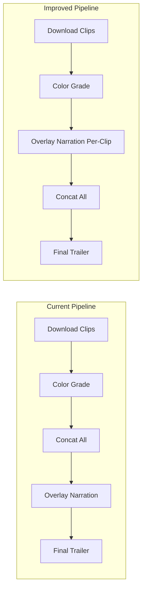

# Trailer Pipeline Improvements

## 1. Hybrid Per-Scene Generation Mode

**Problem**: `generate_congruent_trailer` accepts a single `mode` string and dispatches the entire 19-scene trailer to one pipeline. Dragon/serpent scenes (3, 9, 10, 11, 13) need Cel Animation for character identity, while softer emotional scenes work better with Interpolated.

**Approach**: Add a new `mode="hybrid"` option with a per-scene mode map.

### Files to change

- [backend/app/sse/trailer_generator.py](backend/app/sse/trailer_generator.py) -- add `generate_hybrid_trailer` function and a `HYBRID_MODE_MAP` constant
- [backend/app/sse/studio_service.py](backend/app/sse/studio_service.py) -- pass optional `scene_modes` through
- [backend/app/routers/studio_api.py](backend/app/routers/studio_api.py) -- extend `CongruentClipsRequest` with `scene_modes: dict[int, str] | None`

### Design

Add a default mode map as a constant (overridable via API):

```python
HYBRID_MODE_MAP: dict[int, str] = {
    1: "interpolated", 2: "interpolated",
    3: "cel", 4: "cel", 5: "cel",  # serpent dialogue
    6: "interpolated", 7: "interpolated",
    8: "cel",  # dragon pull
    9: "cel", 10: "cel", 11: "cel",  # dragon/character-heavy
    12: "cel", 13: "cel",  # dragon climax
    14: "interpolated", 15: "interpolated",
    16: "interpolated", 17: "interpolated",
    18: "interpolated", 19: "interpolated",
}
```

The `generate_hybrid_trailer` function iterates scenes and for each one dispatches to either `_generate_video_from_image` (with `end_frame` for interpolated scenes) or `generate_cel_animation_clip` (for cel scenes), maintaining `previous_last_frame` state across both. At branch points, reset `previous_last_frame` as the cel path already does.

The unified `video_manifest.json` written at the end uses `mode: "hybrid"` and each clip entry includes a `generation_mode` field.

### API contract

```json
{
  "project_id": "...",
  "mode": "hybrid",
  "scene_modes": {
    "3": "cel", "9": "cel", "10": "cel", "11": "cel", "13": "cel"
  }
}
```

Unspecified scenes default to `"interpolated"`. If `scene_modes` is null, `HYBRID_MODE_MAP` is used.

---

## 2. Manifest Staleness Fix (Single-Scene Regen)

**Problem**: `generate_scene_image` and `generate_scene_video` in [studio_service.py](backend/app/sse/studio_service.py) upload the new asset to R2 but never patch `video_manifest.json` or `manifest.json`. The stitcher reads old clip entries.

### Files to change

- [backend/app/sse/studio_service.py](backend/app/sse/studio_service.py) -- patch manifest after regen

### Design

After `generate_scene_video` succeeds (the background task in `studio_api.py`), read `video_manifest.json` from R2, find the clip entry matching the scene number, update its `video_url` and `status`, write it back:

```python
async def _patch_video_manifest(project_id: str, scene_num: int, new_url: str):
    """Update a single clip entry in video_manifest.json after scene regen."""
    from app.sse.trailer_generator import _load_video_manifest, _r2_client
    manifest = await _load_video_manifest(project_id)
    if not manifest:
        return
    for clip in manifest.get("clips", []):
        scene_key = clip.get("scene") or clip.get("from_scene")
        if scene_key == scene_num:
            clip["video_url"] = new_url
            clip["status"] = "success"
            clip["regenerated_at"] = datetime.utcnow().isoformat()
            break
    r2_key = f"sse/studio/projects/{project_id}/video_manifest.json"
    await store_bytes(json.dumps(manifest, indent=2).encode(), r2_key, "application/json")
```

Similarly, after `generate_scene_image`, patch the project `manifest.json` to update the scene's `image_url`.

The background task wrapper in `studio_api.py` calls `_patch_video_manifest` after the video upload succeeds.

---

## 3. Chain Auto-Approve with Quality Threshold

**Problem**: `generate_chain_trailer` pauses at every `BRANCH_POINTS` scene and waits for manual approval via `approve_branch_point`. This blocks unattended batch runs.

### Files to change

- [backend/app/sse/trailer_generator.py](backend/app/sse/trailer_generator.py) -- add auto-approve logic at branch points
- [backend/app/routers/studio_api.py](backend/app/routers/studio_api.py) -- add `auto_approve` parameter to congruent clips request

### Design

Since there is no CLIP embedding infrastructure in the codebase currently, use a lightweight proxy: **structural similarity (SSIM)** between the last frame of the current clip and the next scene's hero image, computed via PIL/skimage (already available or trivially installable).

```python
async def _should_auto_approve(
    last_frame_url: str, next_hero_url: str, threshold: float = 0.35
) -> bool:
    """Compare last generated frame to next scene hero via SSIM.
    
    Threshold is deliberately low -- we're checking visual coherence,
    not identity. A score above 0.35 means the transition won't jar.
    """
    from skimage.metrics import structural_similarity
    # download both images, resize to 256x256, convert to grayscale
    # compute SSIM
    return ssim_score >= threshold
```

In `generate_chain_trailer`, before the branch pause:

```python
if next_scene and next_scene in BRANCH_POINTS and auto_approve:
    hero_url = scenes[i + 1].get("image_url", "")
    if await _should_auto_approve(last_frame_url, hero_url, auto_approve_threshold):
        logger.info("[CHAIN] Auto-approved branch at scene %d (SSIM=%.3f)", next_scene, score)
        continue  # skip the pause
```

If SSIM is below threshold, fall back to the existing pause-and-wait behavior.

The `CongruentClipsRequest` gains:

```python
auto_approve: bool = False
auto_approve_threshold: float = 0.35
```

---

## 4. Per-Scene Narration Timing Sync

**Problem**: Narration is overlaid after full-video concatenation using a hardcoded `cumulative += 8.0` offset per clip. Scenes have varying preset durations (3s, 5s, 8s), and narration that exceeds a clip's duration bleeds into the next scene.

### Files to change

- [backend/app/sse/trailer_generator.py](backend/app/sse/trailer_generator.py) -- modify `stitch_trailer` to overlay narration per-clip before concatenation

### Design

**Step 1**: Measure actual clip duration with ffprobe instead of assuming 8s:

```python
def _get_duration(path: str) -> float:
    result = subprocess.run(
        ["ffprobe", "-v", "error", "-show_entries", "format=duration",
         "-of", "default=noprint_wrappers=1:nokey=1", path],
        capture_output=True, text=True, timeout=10
    )
    return float(result.stdout.strip()) if result.stdout.strip() else 8.0
```

**Step 2**: In `stitch_trailer`, after downloading and color-grading each clip, overlay narration onto that individual clip before concatenation:

```python
for clip_info in successful:
    graded_path = ...  # existing graded clip path
    scene_num = clip_info.get("scene") or clip_info.get("from_scene")
    
    if include_narration and scene_num in narration_files:
        narr_path = download(narration_files[scene_num])
        clip_duration = _get_duration(graded_path)
        # Overlay with -shortest so narration is trimmed to clip length
        narrated_clip = os.path.join(work_dir, f"narrated_{scene_num:02d}.mp4")
        subprocess.run([
            "ffmpeg", "-y", "-i", graded_path, "-i", narr_path,
            "-c:v", "copy", "-c:a", "aac",
            "-map", "0:v", "-map", "1:a",
            "-shortest", narrated_clip
        ], capture_output=True, timeout=120)
        # Use narrated clip in concat list instead of graded
        graded_path = narrated_clip
    
    concat_list.append(graded_path)
```

**Step 3**: Remove the post-concat `_merge_narration_audio` call when per-scene narration is used. Keep it as a fallback flag (`narration_mode: "per_scene" | "post_concat"`) for backward compatibility.

**Step 4**: For scenes where narration is longer than the clip, extend the clip to match narration duration using `-filter_complex "[0:v]tpad=stop_mode=clone:stop_duration=X"` to freeze the last frame.



---

## Priority and Dependencies

| Improvement | Urgency | Complexity | Dependencies |
|---|---|---|---|
| Manifest staleness fix | Highest -- blocking correct stitching | Low (~30 lines) | None |
| Per-scene narration sync | High -- timing is wrong for variable-duration clips | Medium (~80 lines) | None |
| Hybrid per-scene mode | Medium -- quality improvement | Medium (~120 lines) | Needs both interpolated and cel paths to be individually callable per-scene |
| Chain auto-approve | Lower -- convenience for batch runs | Medium (~60 lines + skimage dep) | `scikit-image` or PIL-based SSIM |
