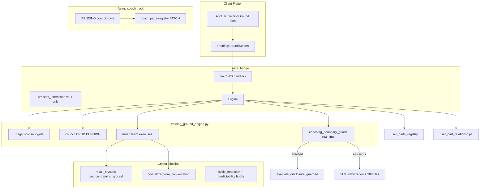
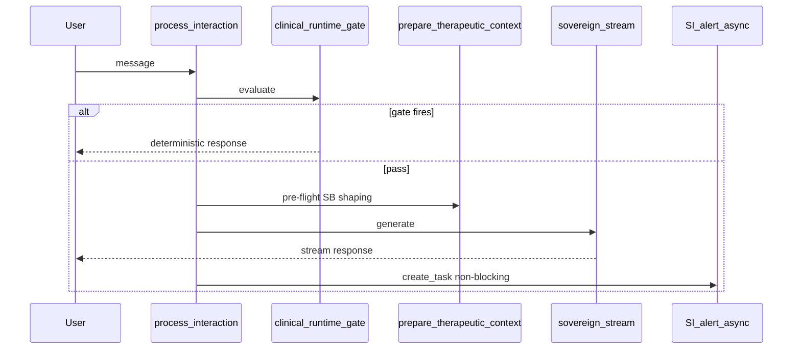

# Training Ground — Inner Leadership Mapping (ILM)

**Decisions locked:** standalone Stage-0 consent (no Sensitive Bridge enrollment required); v1 = card/council layout; graph canvas deferred to v1.1.

**Reference pattern:** mirror [Daily Reconnect](.cursor/plans/daily_reconnect_ritual_9f7af239.plan.md) — dedicated engine + migration + WS handlers behind feature flag + Flutter screen + coach async gate.

---

## Product shape

| Layer | Role |
|---|---|
| **IFS (Schwartz)** | Structural backbone — Manager / Firefighter / Self-energy; mapping only, no exile unburdening |
| **Inner Team (Schulz von Thun)** | Dialogue grammar — Hearing, Negotiation, chairing internal meetings |
| **Jungian council** | Identity language — Sovereign, Warrior, Magician, Lover, Critic (roles, not fixed identity) |
| **Thera-world / Sovereign Vault** | Visual + template layer — reuse [`protector_parts_metadata.json`](backend/resources/therapeutic_library/imagery_guides/protector_parts/protector_parts_metadata.json) and [`CRYSTAL_TO_CHARACTER`](backend/app/sse/thera_world_engine.py) (no new “Archetype Vault” dataset) |
| **Crystal Intelligence** | Recall, crystallization, cycle signals — source tag `training_ground` |

Attribution line in consent + LN system copy: *grounded in Schwartz, Schulz von Thun, and Jung; Inner Leadership Mapping is Sovereign Sanctuary’s integrative synthesis.*

---

## Architecture

**Dual-track governance (spec §5):**
- **Async:** new/updated council members default `coaching_status = PENDING_APPROVAL`; coach approves/HOLD via existing coach API surface.
- **Real-time:** `coaching_boundary_guard` runs synchronously on every **Training Ground WS** ILM turn (v1) — never queued; freezes canvas + crisis tiles; does not wait for coach. Main-chat marker path **deferred v1.1**.

---

## Data model — reuse existing terminology

**Do not create** spec tables `client_profiles`, `internal_council_members`, `part_relationship_vectors`.

### Migration `231_training_ground.sql` (additive)

1. **`training_ground_consent`** — `user_id TEXT REFERENCES users(username)`, `consent_version`, `acknowledged_non_clinical`, `acknowledged_coach_visibility`, `acknowledged_persistence`, `consented_at`, `revoked_at`. Hard gate before any council write.

2. **Extend [`user_parts_registry`](backend/migrations/217_v1_4_addiction_architecture.sql)** (nullable coaching columns; Sensitive Bridge rows unchanged):
   - `ilm_archetype_base VARCHAR(32)` — Sovereign, Warrior, Magician, Lover, Critic, Self
   - `ifs_role VARCHAR(20)` — manager, firefighter, self_energy (mapping-only; **no exile processing**)
   - `thera_world_template_id VARCHAR(64)` — FK to protector template `id` (e.g. `the_perfectionist`)
   - `activation_score SMALLINT DEFAULT 0` (0–100)
   - `coaching_status VARCHAR(24) DEFAULT 'APPROVED'` for coach-created rows; **`PENDING_APPROVAL`** for client ILM creates
   - `coaching_status_notes TEXT`
   - `origin VARCHAR(24) DEFAULT 'sensitive_bridge'` vs `'training_ground'` to distinguish cohorts

3. **`user_part_relationships`** — `user_id`, `source_part_id`, `target_part_id` FK → `user_parts_registry(id)`, `relationship_type`, `conflict_intensity` (0–10). Replaces spec’s `part_relationship_vectors`.

4. **`training_ground_session`** + **`training_ground_event`** — state machine + telemetry (mirror [`daily_reconnect_session`](backend/migrations/230_daily_reconnect.sql) / `daily_reconnect_event`). States: `CONSENT`, `AWARENESS`, `COUNCIL_FORMATION`, `SKILL_INTEGRATION` (HOLD path), `TEAM_DIALOGUE`, `SELF_ALIGNMENT`, `FROZEN_SAFETY`, `CLOSED`.

5. **`training_ground_progression_tickets`** — shadow-request and forward-to-coach async tickets (spec §6.2, §7).

**Identity:** all `user_id` = canonical `users.username` via [`resolve_username`](backend/app/services/_identity_resolver.py).

**Erasure (phased):** v1 = hard delete ILM rows + relationships on user-requested purge endpoint; v1.1 = KMS key shred per HIPAA audit gaps (document in migration comment, do not block v1 ship).

---

## Archetype catalog (single JSON, no new DB vault)

New file: [`backend/resources/training_ground/ilm_archetype_catalog.json`](backend/resources/training_ground/ilm_archetype_catalog.json)

Maps each council seat → `{ protector_template_id, thera_world_character, ifs_role_default, coaching_copy }`. Example: Critic → `the_perfectionist` + Pride/Shame visual family; Warrior → `the_wall_builder`; Sovereign → Self-energy copy only (no villain framing).

LN language rule (encoded in prompts): *“A part of you is carrying the ___ role right now”* — never *“you are the ___.”*

---

## Backend engine

### New service: [`backend/app/services/training_ground_engine.py`](backend/app/services/training_ground_engine.py)

- Feature flag: `ENABLE_TRAINING_GROUND=false` in [`.env.template`](.env.template) + [`docker-compose.prod.yml`](docker-compose.prod.yml) bridge env.
- Handlers (mirror [`daily_reconnect_engine.py`](backend/app/services/daily_reconnect_engine.py)):
  - `ilm_get_state` — consent + session + council snapshot
  - `ilm_consent_ack` — Stage 0 checkboxes
  - `ilm_propose_member` — insert `user_parts_registry` with `origin=training_ground`, `coaching_status=PENDING_APPROVAL`
  - `ilm_set_relationship` — upsert `user_part_relationships`
  - `ilm_dialogue_turn` — Inner Team exercise turn (Hearing / Negotiation)
  - `ilm_self_alignment` — Stage 4 integrated statement
  - `ilm_forward_to_coach` — lock session, enqueue ticket
  - `ilm_exit`

### New context builder: [`backend/app/services/training_ground_chat_context.py`](backend/app/services/training_ground_chat_context.py)

Builds ILM system injection: active council, relationships, coaching_status summary, HOLD → Skill Integration copy, enrolled Sensitive Bridge flags (read-only sync).

Wire into **ILM WS turns only** (v1). Do not touch `process_interaction()` until v1.1 main-chat invite is explicitly scoped.

### New persistence: [`backend/app/services/training_ground_part_persistence.py`](backend/app/services/training_ground_part_persistence.py)

Standalone insert path ( **not** [`client_initiated_sensitive_registration.py`](backend/app/services/client_initiated_sensitive_registration.py) — that file stays Sensitive-Bridge-gated). Reuse PII guards from [`sensitive_profile_api.py`](backend/app/routers/sensitive_profile_api.py) `_raise_if_pii`.

### Bridge WS registration

Thin handlers in [`bridge_server.py`](backend/app/websocket/bridge_server.py) (≤50 lines per commit, `# QUANTUM-CRYSTAL-ARCH`), add `ilm_*` to `_SENTINEL_SKIP`, delegate to engine. Pattern: [`reconnect_get_or_create`](backend/app/services/daily_reconnect_engine.py) at bridge ~27195.

### Stage 1 chat invite (main NeuralInterface) — **v1.1 deferred**

Lightweight detector in engine or [`little_nate_adaptive.py`](backend/app/services/little_nate_adaptive.py): linguistic markers (“part of me”, internal gridlock). LN offers Training Ground entry; does not auto-open.

---

## Coach async gate (Gate 1)

Extend coach [`PATCH /api/coach/sensitive-profile/{user_id}/parts-registry/{part_id}`](backend/app/routers/sensitive_profile_api.py) to accept `coaching_status` + `coaching_status_notes` (coach/admin only).

- **APPROVED** → full ILM exercises unlock
- **HOLD** → client UI → `SKILL_INTEGRATION` state; LN uses spec scripted copy (no red clinical alert)
- **REJECTED** → retire part (`is_active=false`) with coach note

Coach Flutter: extend [`client_parts_registry_screen.dart`](mobile/lib/screens/client_parts_registry_screen.dart) with ILM columns + filter `origin=training_ground` + pending badge. Optional v1.1: dedicated “Training Ground Queue” tab in Coach Command.

Notify coach via existing [`sensitive_alert_dispatcher`](backend/app/services/sensitive_alert_dispatcher.py) pattern or `skyeye_activity` row `training_ground_pending_review` (email via Trust Enforcer only if auditor added — defer email to v1.1).

---

## Safety & boundaries (Track B)

New module: [`backend/app/services/coaching_boundary_guard.py`](backend/app/services/coaching_boundary_guard.py)

| Signal | Action |
|---|---|
| Hyper-arousal / crisis language | Freeze canvas, stabilization prompt, 988 tiles, `FROZEN_SAFETY` |
| Hypo-arousal / flattening (“Whatever.”, monosyllabic collapse) | Same — equal weight to hyper-arousal |
| Shadow integration request | Door-knocking protocol + `training_ground_progression_tickets` |
| Exile unburdening / trauma processing language | Boundary wall + coach ticket; exit mapping depth |

Reuse when enrolled: [`evaluate_disclosure_guarded`](backend/app/services/therapeutic_controller.py) (Sensitive Bridge clinical firewall).

**3AM protocol:** no “bridging to human now”; transparent offline message + crisis tiles (spec §7.2).

**Forward to Coach** button always visible in Flutter AppBar on Training Ground screen.

---

## Crystal Intelligence integration

Per [`crystal-recall-crystallization-wiring.mdc`](.cursor/rules/crystal-recall-crystallization-wiring.mdc):

| Hook | Location | Source tag |
|---|---|---|
| Recall before ILM dialogue | `training_ground_chat_context.py` | `training_ground` |
| Crystallize after each ILM turn | `bridge_server.py` or engine via `asyncio.create_task` | `training_ground` |
| Main chat while ILM session open | same | `training_ground` |

Add `training_ground` to crystal recall source table in project rules when implementing.

**Cycle / predictability:** append `training_ground_event` types (`part_activated`, `conflict_intensity_change`, `self_alignment_completed`) for [`cycle_detection_engine.py`](backend/app/services/cycle_detection_engine.py) consumption (new cycle template or extend NLP source list in v1.1).

**Sensitive Bridge sync (when enrolled):** read `user_parts_registry` + codewords in ILM context; do not duplicate into `sse_parts_registry` (unused scaffold — leave dormant).

---

## Flutter UI

### Icon (fist + cross)

- Asset: [`mobile/assets/icons/training_ground.svg`](mobile/assets/icons/training_ground.svg) (gold `#C9A962`, matches heart)
- Widget: [`mobile/lib/widgets/training_ground_icon.dart`](mobile/lib/widgets/training_ground_icon.dart)
- Placement: [`mobile/lib/updated_screens.dart`](mobile/lib/updated_screens.dart) AppBar `actions` **immediately after** Daily Reconnect (~line 4740), before Family Sanctuary — same WS close / `_connectToCortex()` pattern as heart icon.

### Screen: [`mobile/lib/screens/training_ground_screen.dart`](mobile/lib/screens/training_ground_screen.dart)

| Stage | UI |
|---|---|
| 0 | Consent dashboard (3 checkboxes + non-clinical disclaimer) |
| 1 | Awareness intro + LN invite recap |
| 2 | **Card council** — grid of part cards (Thera-world image from template id, archetype badge, activation bar); add-member flow |
| HOLD | Skill Integration banner + bounded grounding exercises |
| 3 | Inner Team dialogue (structured turn list: Hearing → Negotiation) |
| 4 | Self-led alignment — integrated action statement |
| Safety | Read-only freeze overlay + 988 / Crisis Text Line tiles |

WebSocket message types mirror `reconnect_*` naming: `ilm_*`.

**v1.1:** interactive graph (e.g. `graphview` package or embedded web Cytoscape) replacing card grid; relationship edges draggable.

---

## LLM prompt governance

New prompt blocks in [`training_ground_chat_context.py`](backend/app/services/training_ground_chat_context.py) (not generic skyeye chat):

- Non-clinical mandate + depth line (mapping vs unburdening) — spec §7.1 table
- Inner Team facilitator scripts (Hearing, Negotiation)
- Shadow door-knocking negative directive — spec §6.2
- Archetype held lightly language rule
- Injected council JSON from DB (approved members only for Stage 3–4; pending visible but not exercise-unlocked)

---

## Testing & trust

| Suite | Scope |
|---|---|
| [`backend/tests/test_training_ground.py`](backend/tests/test_training_ground.py) | Consent gate, PENDING insert, HOLD state machine, boundary guard fixtures (hyper + hypo arousal), shadow ticket |
| Offline CI | Add to [`run_ci_tests.sh`](backend/scripts/run_ci_tests.sh) |
| E2E script | [`backend/scripts/training_ground_e2e.py`](backend/scripts/training_ground_e2e.py) (mirror [`daily_reconnect_e2e.py`](backend/scripts/daily_reconnect_e2e.py)) |

**Auditor (v1.1):** optional `training_ground_auditor.py` + trust baseline — not required for initial flag-off deploy.

---

## Deploy sequence

1. Migration 231 on GREEN PostgreSQL
2. Backend + bridge files via git pull + [`safe_deploy.sh`](scripts/safe_deploy.sh) bridge/backend
3. `ENABLE_TRAINING_GROUND=true` only after smoke test
4. Flutter build + [`deploy_flutter_web.sh`](scripts/deploy_flutter_web.sh) + CF purge
5. Verify: consent blocks writes; PENDING row visible to coach; crystal rows tagged `training_ground`

---

## Phasing summary

| Phase | Deliverable |
|---|---|
| **v1 (this plan)** | Icon, consent, engine, extended parts + relationships, card UI, coach approval, crystal hooks, coaching safety, forward-to-coach |
| **v1.1** | Graph canvas ATG, cycle_detection templates, coach queue tab, column encryption/KMS shred, dedicated auditor |
| **Out of scope** | Exile unburdening, shadow excavation, real-time human bridge promise, duplicate archetype DB |

---

## Protected-file discipline

[`bridge_server.py`](backend/app/websocket/bridge_server.py): additive WS handlers only, feature-flagged, ≤50 lines per commit, `# QUANTUM-CRYSTAL-ARCH` comments.

No changes to Nevedal formula, voice pipeline, or `nate_memory_crystallizer` clustering logic — only new recall/crystallize call sites with `source="training_ground"`.

---

## Pre-implementation safety audit (2026-07-02)

Cross-referenced against current repo. **Training Ground code does not exist yet** (no `training_ground_*`, `ilm_*`, or `coaching_boundary_guard` symbols). Audit evaluates plan vs existing adjacent systems and flags bypass paths if built as written.

### Blocking (1–2 only) — resolve in design before code

Items **3–5** from the original audit are **not** separate pre-code gates. Rationale in subsection below.

### Original audit items 3–5 (reclassified)

| # | Verdict | Existing codebase | Plan depends on (not built) | Bypass / gap risk | Required design fix |
|---|---------|-------------------|----------------------------|-------------------|---------------------|
| **1 Consent gate** | **FAIL — ambiguous** | Four live writers to `user_parts_registry`: coach [`add_part`](backend/app/routers/sensitive_profile_api.py) (no consent), [`persist_client_initiated_part`](backend/app/services/client_initiated_sensitive_registration.py) (SB enrollment only), [`parts_auto_extractor`](backend/app/services/parts_auto_extractor.py) (SB + codeword flags), migration backfill. No `training_ground_consent` table. | `ilm_propose_member` + separate `training_ground_part_persistence.py` = **two planned paths** | Crafted WS or coach REST can insert parts without TG consent; auto-extractor can create parts from main chat for SB-enrolled users without TG consent | **One module** [`training_ground_part_store.py`](backend/app/services/training_ground_part_store.py) with `insert_ilm_part()` — sole writer for `origin='training_ground'`. Consent check **inside** store (DB row + `revoked_at IS NULL`). WS handler calls store only. Coach REST must not set `origin=training_ground` without consent audit; default coach inserts `origin=sensitive_bridge`. Ban `ilm_*` handlers from raw SQL. |
| **2 Boundary guard timing** | **FAIL — not specified as blocking** | Pre-LLM blockers in main chat: [`little_nate_clinical_runtime_gate`](backend/app/services/little_nate_clinical_runtime_gate.py) (`return` before inference), IP boundary. [`evaluate_disclosure_guarded`](backend/app/services/sensitive_clinical_bridge.py) only **shapes** prompt via `_apply_sensitive_bridge_decision` — does **not** suppress LLM. SI alert is `asyncio.create_task` **after** user message, non-blocking. Daily Reconnect crisis check runs **before** turn persist, no LLM ([`_handle_turn`](backend/app/services/daily_reconnect_engine.py) L365–371). | `coaching_boundary_guard.py` on "every ILM turn" | If guard runs post-LLM or async, boundary-crossing reply reaches client | **`ilm_dialogue_turn` pipeline:** (1) guard user input synchronously (2) if trip → transition `FROZEN_SAFETY`, send scripted stabilization + 988 payload, **`return`** (3) only then call inference. Mirror `clinical_runtime_gate` / Reconnect crisis, not `create_task`. Add test: LLM mock must not be called when guard fires. |
| **3 Main-chat wiring** | **Not blocking (v1 scope cut)** | — | Main-chat ILM in `process_interaction()` | Only a risk if v1 ships main-chat wiring | **v1:** icon → `TrainingGroundScreen` → `ilm_*` WS only. No `process_interaction()` changes. Revisit as v1.1 with full precedence doc if invite returns. |
| **4 PENDING enforcement** | **Verify during build (engine AC)** | — | Server-side coach gate | Bypass if `ilm_dialogue_turn` ships without checks | First implementation of `ilm_dialogue_turn` must include `_require_approved_parts()` — refuse when `coaching_status != APPROVED` or `SKILL_INTEGRATION`. Not a separate design phase; acceptance criterion for `engine-flag` + tests. |
| **5 Guard precedence (enrolled)** | **Merged into blocking 2** | SB does not block LLM today | Separate orchestrator name | Illusory gap if coaching guard is pre-LLM | Rule: **coaching_boundary_guard alone must be sufficient** for all ILM turns. When enrolled, SB may shape prompt **after** guard passes; SB never substitutes for guard. No extra pre-code doc beyond item 2 pipeline. |

### Must-verify during build (6–12)

| # | Verdict | Finding | Build verification |
|---|---------|---------|-------------------|
| **6 Mapping-only / no exile** | **PARTIAL — structural hole today** | Plan omits `exile` in `ifs_role` enum (good). But [`VALID_PART_CATEGORIES`](backend/app/routers/sensitive_profile_api.py) includes `exile`; [`parts_auto_extractor`](backend/app/services/parts_auto_extractor.py) can auto-insert `exile` from main chat when SB enrolled. Coach API accepts `protected_exile_part_id`. | For `origin=training_ground`: reject `part_category=exile` and `ifs_role=exile` in store; reject `protected_exile_part_id`. Dialogue handlers must not reference exile unburdening flows. Integration test: exile-language triggers guard or block, not exile row. |
| **7 Archetype language rule** | **SOFT CONTROL** | No runtime validator for "you are the X" vs "part carrying X role". | Document as residual risk. Add prompt + optional post-gen regex warning in tests (not production block v1). |
| **8 PII on part_name** | **GAP in existing reuse** | Coach `add_part` runs `_raise_if_pii` on **description only** (L2199), not `part_name`. Client path checks `part_name`. | TG store must `_raise_if_pii("part_name", ...)` and `description` on every insert. |
| **9 Erasure completeness** | **NOT IMPLEMENTED** | v1 hard-delete planned; crystals use `origin_surface` / source tags — no TG purge yet. | Erasure routine must delete: consent, sessions, events, tickets, relationships, ILM-origin parts, crystals with `origin_surface=training_ground` or recall tag `training_ground`. Document v1 KMS gap explicitly in consent copy. |
| **10 Consent vs crystallize race** | **GAP — pattern exists** | [`crystallize_from_conversation`](backend/app/websocket/crystal_recall_bridge.py) has no consent check; main chat uses fire-and-forget `create_task` ([`bridge_server.py`](backend/app/websocket/bridge_server.py) L10427). | ILM crystallize wrapper must re-check `training_ground_consent` at execution time; skip if revoked. Prefer synchronous crystallize for ILM turns or pass consent snapshot into task. |
| **11 State-machine dead-ends** | **DESIGN REQUIRED** | Daily Reconnect: `CRISIS_BYPASS` terminal for turns; `reconnect_reenter` from WARNING. Plan lists `FROZEN_SAFETY` / `SKILL_INTEGRATION` without exit edges. | Define transitions: `FROZEN_SAFETY` → `CLOSED` or coach-reviewed `AWARENESS`; `SKILL_INTEGRATION` → `TEAM_DIALOGUE` on coach APPROVED. Mirror Reconnect tests. |
| **12 Feature-flag completeness** | **PARTIAL precedent** | Daily Reconnect: flag gates engine ([`daily_reconnect_engine.py`](backend/app/services/daily_reconnect_engine.py) L179) but **Flutter heart icon always visible** (backend tier-gates). Bridge always registers WS types. | Gate: engine handlers, bridge delegation, Flutter icon (`ENABLE_TRAINING_GROUND` via profile or config), main-chat detector (if any), crystallize/recall injection. Icon hidden when flag off. |

### Reference: existing pre-LLM vs post-LLM patterns

**ILM must follow Gate branch, not SI branch**, for both user input trip and optional output scan before first token.

### Plan amendments (incorporated above)

- Replace `training_ground_part_persistence.py` with **`training_ground_part_store.py`** — single insert API.
- **Defer main-chat ILM invite to v1.1** (removes blocking 3 entirely for v1).
- **`_require_approved_parts()`** in engine (verify-during-build item 4, not pre-code gate).
- Coaching guard sufficient alone; SB shaping optional when enrolled (item 5 merged into 2).
- Add explicit **state transition table** for `FROZEN_SAFETY` and `SKILL_INTEGRATION` in engine spec (verify-during-build item 11).
- **`blocking-design-1-2`** todo before `engine-flag` (consent store + pre-LLM guard only).
