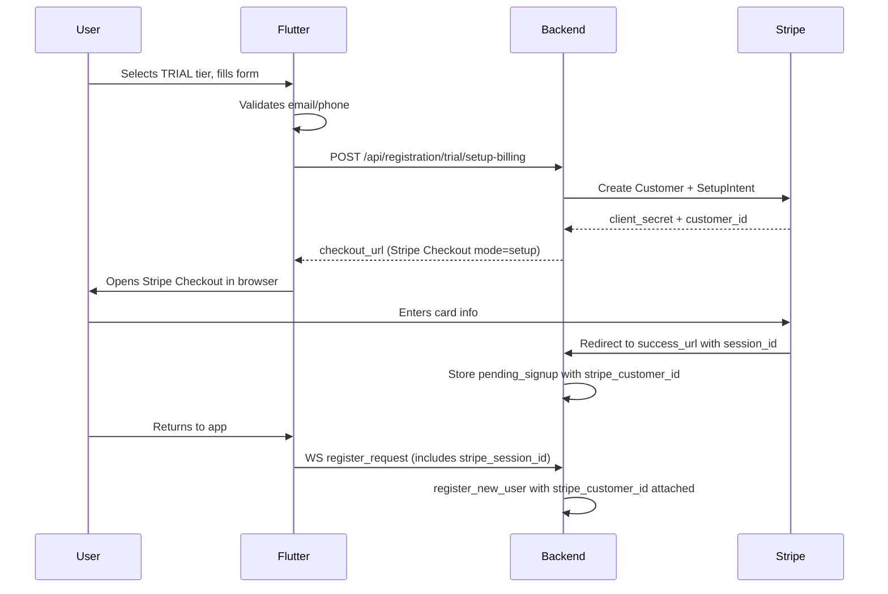

# Trial Billing Gate & Contact Requirement

## Part 0: Deploy Existing Fix

Push the `tier_for_db_column()` fix in `bridge_server.py` (already applied locally) to production and restart the bridge.

---

## Part 1: Require Email or Phone on All Client Registrations

Currently only COACH registration validates email/phone. CLIENT registration sends them but allows empty values.

### Flutter (`mobile/lib/main.dart`)

In `_submitRegistration()` (~line 7808), add validation before the WebSocket send:

- If role is CLIENT and both `_emailCtrl.text` and `_phoneCtrl.text` are empty, show error: "Please provide an email address or phone number."
- Email validation: must contain `@` and `.` (same as coach validation at line 7820)
- Phone validation: must have >= 10 digits (same as coach validation at line 7826)
- At least ONE of the two must be provided; both is allowed

### Backend (`bridge_server.py`)

In `register_new_user()` (~line 3195), add server-side validation:

- If `role == "CLIENT"` and both `email` and `phone` are empty, return `(False, "Email or phone number is required")`
- This is defense-in-depth behind the Flutter validation

---

## Part 2: Stripe Billing Hold on Trial Registration

Trial users must provide a payment method (captured via Stripe SetupIntent) before registration completes. No charge is made — the payment method is stored for future use.

### Flow (Non-iOS)

### Flow (iOS)

iOS users who select TRIAL see a message: "To start your free trial, complete billing setup on our website." with a link to `https://app.sovereignsanctuary.net/trial-setup` (a lightweight web page that runs the same Stripe Checkout setup flow, then deep-links back to the app).

### New Backend Endpoint

Add to `backend/app/routers/registration_checkout.py`:

`**POST /api/registration/trial/setup-billing**`

- Accepts: `name`, `email`
- Creates a Stripe Customer (or reuses if email matches)
- Creates a Stripe Checkout Session with `mode="setup"`, `success_url` pointing to a callback
- Returns `{ checkout_url, session_id }`
- Stores pending data in Redis with 30-min TTL keyed by `session_id`

`**GET /api/registration/trial/setup-callback**`

- Stripe redirects here after card setup
- Retrieves the Checkout Session, confirms `setup_intent` status
- Stores `stripe_customer_id` and `payment_method` in Redis pending signup
- Redirects to app or shows "Return to app" page

### Flutter Changes (`main.dart`)

In `_submitRegistration()`, when `_selectedTier == 'TRIAL'` and `!isNativeIOS`:

1. Before opening the WebSocket, POST to `/api/registration/trial/setup-billing` with name + email
2. Open `checkout_url` in external browser (same pattern as `_launchStripeCheckout` at line 9465)
3. On return, include `stripe_session_id` in the `register_request` payload
4. `register_new_user` looks up the pending session, attaches `stripe_customer_id` to the profile

For iOS (`isNativeIOS`):

1. Show a dialog explaining billing setup must happen on the web
2. Provide a "Set up billing on web" button that opens `https://app.sovereignsanctuary.net/trial-setup?name=X&email=Y` in Safari
3. After setup, user returns to app and completes registration with the session token

### Bridge Changes (`bridge_server.py`)

In `register_new_user()`:

- When `registration_type == "TRIAL"` and `stripe_session_id` is present in `data`:
  - Look up the pending session in Redis
  - Set `stripe_customer_id` from the stored data
- When `registration_type == "TRIAL"` and no `stripe_session_id` and not an iOS bypass:
  - Return error "Billing setup required for trial registration"

---

## Part 3: Trial Expiry Conversion Prompt

The existing `drip_scheduler.py` already handles trial expiration with nudges at 3 days and 1 day before expiry. On expiry, it needs to:

### Modify `drip_scheduler.py` `sweep_trial_expirations()` (~line 936)

On trial expiry (when `trial_end_date` is past):

- Set `subscription_plan = "COACH_ONLY"`, `can_access_nate = false`, `token_balance = 0`
- Set `subscription_status = "ACTIVE"` (not expired — they're a valid COACH_ONLY user)
- Send notification (email/SMS) with upgrade link: "Your trial has ended. Upgrade to continue using Little Nate."
- The stored payment method (from Part 2) makes the upgrade one-click: user selects tier, Stripe charges the stored method

### Modify Trial Nudges (3-day and 1-day)

Update the nudge messages to mention the upcoming downgrade and include the upgrade CTA:

- 3 days: "Your trial ends in 3 days. Choose your plan to continue."
- 1 day: "Last day of your trial. Upgrade now to keep access to Little Nate."

### Flutter `TrialBannerWidget` (`billing_screens.dart` ~line 2798)

Update the existing trial banner to include tier selection (Inner Chamber vs Sovereign Circle) and an "Upgrade" button that calls the existing `/api/billing/checkout` endpoint using the stored `stripe_customer_id`.

---

## File Change Summary

| File                                           | Changes                                                                                                   |
| ---------------------------------------------- | --------------------------------------------------------------------------------------------------------- |
| `backend/app/websocket/bridge_server.py`       | Deploy existing fix + server-side email/phone validation + stripe_session_id lookup on trial registration |
| `backend/app/routers/registration_checkout.py` | New trial billing setup endpoint + callback                                                               |
| `backend/app/services/drip_scheduler.py`       | Trial expiry downgrades to COACH_ONLY instead of TRIAL_EXPIRED                                            |
| `mobile/lib/main.dart`                         | Email/phone validation + Stripe setup flow for trial + iOS web redirect                                   |
| `mobile/lib/screens/billing_screens.dart`      | Updated TrialBannerWidget with upgrade CTA                                                                |

