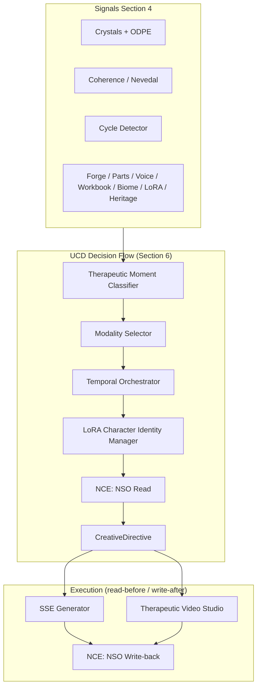

# Unified Creative Director (SS-UCD-001) — Section Map and Gap Plan

## Document structure (15 sections)

| Section | Title | Role |
|--------|--------|------|
| 1 | Executive Summary and Thesis | Defines UCD as convergence layer; thesis on information density + modality range |
| 2 | Problem Statement: Dual-Pipeline Fragmentation | Five deficits D1-D5 (temporal, modality, character drift, narrative incoherence, predictive blindness) |
| 3 | Theoretical Foundation | Narrative identity, fabula/syuzhet, multi-modal engagement |
| 4 | System Inventory | Inputs TMC reads (crystals, EC, cycles, Identity Forge incl. mask detection state, parts, voice, workbook, biome, LoRA registry, heritage, etc.) |
| 5 | UCD Architecture | Five subsystems: TMC, Modality Selector, Temporal Orchestrator, LoRA Character Identity Manager, Narrative Coherence Enforcer |
| 6 | Data Flow: Session to Delivery | 12-step loop from session completion through Creative Directive to recursive feedback |
| 7 | Integration Wiring Plan | Five implementation phases (weeks 1-16), each independently deployable |
| 8 | Clinical Safety Architecture | S1 Intensity Governor, S2 Modality Safety Matrix, S3 Predictive Restraint (+ inherited Patent 7 safety) |
| 9 | Database Schema Extensions | `narrative_state_objects`, `nso_history`, `ucd_creative_directives`, `generation_log`, `character_lora_models`, `tmc_training_data`, `intensity_ledger` |
| 10 | API Surface and Event Contracts | Inbound events (session, crystal, coherence, cycle, workbook, cadence); outbound (CreativeDirective, alerts, NSOUpdate) |
| 11 | Performance and Cost Model | Per-modality cost table; ~$5.56/user/month baseline in spec (internal planning figure -- omit from patent-adjacent external documentation) |
| 12 | Patent Coverage Map | Subsystem-to-patent mapping; CIP / Patent 10 recommendation |
| 13 | Risk Analysis and Mitigation | LoRA safety, TMC misclassification, NSO corruption (mitigated by nso_history snapshots), cost, predictive pressure |
| 14 | Implementation Timeline | Phase/week matrix tied to D1-D5 elimination |
| 15 | References | Academic and provisional patent citations |

## Core architecture (validated against UCD spec Section 6)

Two interaction patterns are shown below. The **decision flow** is the linear pipeline from TMC through to Creative Directive emission. The **execution protocol** is the NCE's bidirectional read-before-generate / write-after-generate interaction with SSE and Studio.

**Decision flow** (top to bottom): TMC classifies moment -> Modality Selector picks format -> Temporal Orchestrator schedules -> LoRA resolves character adapters -> NCE reads current NSO for narrative context -> CreativeDirective emitted to pipeline.

**Execution protocol** (bottom): Pipeline generates content, then writes back updated narrative state to NCE (NSO update). This is not a decision loop -- it is the compliance protocol ensuring narrative coherence is maintained after every generation.

**Seven TMC moment classes** (from Section 5.1): THRESHOLD, BREAKTHROUGH, INTEGRATION, RECURRENCE, REST, CRISIS, HERITAGE -- each with distinct triggers and creative response profiles.

**Three novel safety mechanisms** (Section 8): Intensity Governor (e.g. max one BREAKTHROUGH per 48h), Modality Safety Matrix (forbidden moment-modality pairs, deployment-context-aware), Predictive Restraint (pre-position without depicting breakthrough until the crystal exists).

---

## Signal source inventory (Section 4 audit)

### Available today (TMC can read these in Phase 2)

| Spec source | Codebase location |
|---|---|
| Crystal Intelligence DB | `nate_intelligence_crystals` table (migration 119); `crystal_recall_bridge.py`, `nate_memory_crystallizer.py` |
| Coherence trajectory (EC) | `nevedal_engine.py` `_compute_c_emo()`; `nevedal_coherence_log` table |
| Cycle Detector | `CycleDetectionEngine` in `cycle_detection_engine.py`; `cycle_detections` table (migration 129). Spec references `pattern_cycles` -- this is a documentation artifact. TMC reads `cycle_detections` directly; no migration needed for the spec name. |
| Identity Forge | `sse_identity_forge` table (migration 174); `layer1_identity_forge.py`. **Note:** Table needs `mask_detection_state` column (MASKED / EVOLVING) from Patent 7 Surveillance Awareness Indexing. TMC must read this to gate BREAKTHROUGH content -- a MASKED user receiving BREAKTHROUGH imagery could undermine the mask they need for survival in an institutional context. This is a safety-critical signal. |
| Lived Wisdom | `wisdom_entries` table (migration 001); Night School API |
| Generation logging | `sse_delivery_generation_log` table (migration 170); `foundation/delivery_runtime.py`. Needs extension: add `directive_id FK`, `moment_class`, `nso_snapshot`, `creative_directive`, `engagement_action`, `user_response_crystal_ids` columns to match spec `generation_log` schema |

### Missing -- must be created before TMC can aggregate full signal set

| Spec source | What's needed |
|---|---|
| Parts Registry (`sse_parts_registry`) | New table + implement `layer1_parts_registry.py` (currently scaffold) |
| Workbook progress (`sse_workbook_progress`) | New table; `workbook_ingestion.py` exists but no per-user progress tracking |
| Biome state (`sse_biome_state`) | New table; biome concepts exist in `thera_world_engine.py` as in-memory mappings only |
| Heritage correlation index (`heritage_correlation_index`) | Materialized view or lookup table pre-computing parent-child crystal domain correlations. Data already flows through `nate_intelligence_crystals` + `transgenerational_patterns` (migration 027) + `family_engine.get_heritage_landmarks()`. TMC needs fast queries without running full Crystal Bridge pipeline per event. **Refresh trigger:** refresh on crystal confidence transition when any crystal crosses the LOCKED threshold (0.85+), not on a time schedule. Heritage correlations change infrequently (parent crystal reaches LOCKED, child crystals emerge in correlated domains). Trigger-based refresh prevents stale heritage data while avoiding unnecessary recomputation. |
| LoRA model registry (`character_lora_models`) | New metadata table storing both Replicate model reference URL and R2-cached adapter weights (`r2_adapter_key`); training/inference already works via `replicate_client.py` `train_lora()` / `generate_with_loras()` |
| Voice session features (TMC signal) | `voice_session_biometrics` table exists (migration 153) with per-session pitch/energy/pause data inserted by `twilio_grok_xtts_pipeline.py` at call end. TMC needs a **summary view** (`voice_session_features_summary`) that aggregates recent sessions per user for fast querying. Phase 2 should add a materialized view over `voice_session_biometrics` or a TMC-side aggregation function. |
| Deployment context | No `deployment_context` column exists. The Modality Safety Matrix (Phase 2) needs to know whether a user is in an institutional or private deployment to restrict video in institutional environments. Phase 1 migration must add a `deployment_context` column (`institutional` / `private`, default `private`) on the appropriate table -- either per-tenant on a tenants/organizations table if multi-tenant, or per-user on the users `profile_data` JSONB. This is a Phase 1 item because the Modality Safety Matrix in Phase 2 depends on it. |
| Surveillance Context | `layer6_institutional_safety.py` is scaffold; needs implementation reading `deployment_context` to enforce modality restrictions for institutional deployments |
| Identity Forge mask state | `sse_identity_forge` table needs `mask_detection_state` column (VARCHAR: `MASKED`, `EVOLVING`, `UNMASKED`). Written by `layer1_identity_forge.py` via Patent 7 Surveillance Awareness Indexing. Read by TMC to gate moment classification -- MASKED users must not receive BREAKTHROUGH content. |

### Crystal formation event hook -- critical Phase 2 gap

There is **no** `CrystalFormationEvent` emitter. Crystal creation is a raw `INSERT INTO nate_intelligence_crystals` in `nate_memory_crystallizer.py` with optional downstream indexing. Phase 2 requires adding an event emission hook at the crystallizer's insertion point, plus similar hooks in `nevedal_engine.py` (coherence threshold crossing) and `cycle_detection_engine.py` (cycle break detection).

### NSO write serialization -- Phase 1 design decision

When both SSE and Studio target the same user within a short window, concurrent NSO writes can corrupt narrative state. Two approaches:

- **PostgreSQL advisory lock** keyed on `user_id` hashcode during NSO write (simple, proven, no schema change)
- **Optimistic concurrency** via `generation_sequence_counter` column on `narrative_state_objects` with retry on conflict (spec-aligned, adds one column)

Recommendation: **advisory lock** for Phase 1 (simpler, no retry logic needed), migrate to optimistic concurrency in Phase 4 when CreativeDirective serializes all generation requests through a single dispatch point.

### NSO corruption recovery -- Phase 1 safety net

Risk Analysis (Section 13) identifies NSO corruption as a threat. Phase 1 must include an `nso_history` table (or JSONB array column on `narrative_state_objects`) storing the last 10 NSO snapshots. Each NSO write appends the pre-mutation state to the history. The Clinical Oversight Interface should expose a "revert NSO to snapshot" action for administrators. This is low-cost to implement in Phase 1 and prevents a corrupted NSO from requiring manual database intervention.

Schema:
- `nso_history(id SERIAL, user_id UUID FK, nso_snapshot JSONB, generation_id UUID, created_at TIMESTAMPTZ)`
- Oldest snapshots pruned when count exceeds 10 per user (simple DELETE with LIMIT)
- Admin endpoint: `POST /api/admin/sse/nso/{user_id}/revert/{snapshot_id}`

### Engagement action population path

The `engagement_action` column on `sse_delivery_generation_log` needs two population sources:

1. **Client-initiated** (Phase 1): `POST /api/sse/engagement` endpoint accepting `{generation_id, action: "viewed"|"discussed"|"skipped"|"ignored"}`. Mobile/web client fires this when a user views, taps, or dismisses a panel or video. This is the primary source for the Modality Selector's engagement history.
2. **Bridge-inferred** (Phase 5): When a user discusses a panel with Little Nate and the conversation produces crystals linked to that panel's `generation_id`, the bridge server auto-tags the engagement as `discussed`. This closes the loop between conversational engagement and content feedback.

### TMC initial classification model -- Phase 2 bootstrap

Phase 2 deploys the TMC with zero historical training data. A logistic regression with no training data is a random classifier. The TMC must launch as a **rule-based classifier** using the signal weighting table from UCD spec Section 7.2:

| Signal | Weight |
|---|---|
| Crystal confidence > 0.75 | 0.30 |
| First-time pattern break (cycle_detections) | 0.25 |
| EC slope (nevedal_coherence_log trend) | 0.20 |
| Identity Forge mask state (EVOLVING vs MASKED) | 0.10 |
| Session recency (hours since last session) | 0.10 |
| Heritage correlation strength | 0.05 |

Phase 5 replaces the rule-based classifier with a trained logistic regression model once sufficient content-response data accumulates in `tmc_training_data`. The rule-based classifier remains as a fallback if the trained model's accuracy drops below a configurable threshold.

## What is not wired in this codebase today

| Spec component | Current repo state |
|---|---|
| **Shared NSO** | [`adapters/narrative_state.py`](backend/app/sse/adapters/narrative_state.py) is scaffolding only ("Planned for SSE Phase 2"); no `narrative_state_objects` table; no `nso_history` recovery mechanism |
| **TMC service** | No event-driven classifier; no `MomentClassifiedEvent`; SSE/Studio remain schedule- or manually-triggered. No rule-based bootstrap classifier. |
| **Modality Selector** | Studio and SSE choose modalities independently; no unified matrix from TMC class + engagement + deployment context. Engagement data partially exists (`viewed_at` on `sse_panel_log`, migration 176) but lacks categorical engagement signals (`discussed`, `ignored`, `skipped`). No `deployment_context` column for institutional vs private mode. |
| **Temporal Orchestrator** | [`layer0_orchestrator.py`](backend/app/sse/layer0_orchestrator.py) provides APScheduler cron via `sse_cron_schedules` -- this is the current cadence trigger that Phase 2 must subordinate to TMC, not replace. No priority override for BREAKTHROUGH/CRISIS |
| **LoRA Character Identity Manager** | LoRA training (`replicate_client.py`) and generation (`trailer_generator.py`, `studio_service.py`) exist, but no `character_lora_models` metadata table and no cross-pipeline adapter sync. Adapters stored as Replicate URLs only -- no R2 cache for cross-service compatibility |
| **NCE** | No enforced three-act arc or single NSO that both pipelines must update after every generation |
| **Event bus** | Section 10 contracts not implemented as unified pub/sub; crystal formation is a raw INSERT with no event emission |
| **Creative Directive JSON** | Pipelines do not receive a single authoritative `CreativeDirective` payload |
| **`ucd_creative_directives` table** | Does not exist; needed by Phase 4 for directive logging |
| **Recursive loop (Phase 5)** | Crystals not tagged with `generation_id` of the prompting asset |
| **Safety mechanisms (S1-S3)** | No `intensity_ledger`; `layer9_clinical_integration.py` has proto-governor (`_PACING` dict); `layer6_safety_filter.py` and `layer6_institutional_safety.py` are scaffolds that can be extended. No `clinician_override_limit` for coach override of intensity thresholds (Patent 7 Claim 12 / Patent 10 Claim 5 interaction). No `deployment_context` for Modality Safety Matrix. No `mask_detection_state` on Identity Forge for MASKED-user BREAKTHROUGH gating. |
| **Engagement tracking** | No `POST /api/sse/engagement` endpoint; no client SDK event for panel/video interaction; no bridge-inferred `discussed` tagging |

---

## Recommended implementation order (matches Section 7 / 14)

**Phase 0 (resolved):** TTS `api-version` in `studio_service.py` and `trailer_generator.py` was updated to `2025-01-01-preview` in a prior commit. Studio narration pipeline prerequisite is satisfied.

1. **Phase 1 (Weeks 1-2):** Migrations for `narrative_state_objects`, `nso_history` (last 10 snapshots per user for corruption recovery), `ucd_creative_directives`; extend `sse_delivery_generation_log` with spec columns (`directive_id FK`, `moment_class`, `nso_snapshot`, `creative_directive`, `engagement_action`, `user_response_crystal_ids`); add `deployment_context` column (`institutional`/`private`, default `private`) to appropriate table; add `mask_detection_state` column to `sse_identity_forge`; create prerequisite signal tables (`sse_parts_registry`, `sse_workbook_progress`, `sse_biome_state`); create `heritage_correlation_index` materialized view with refresh trigger on crystal LOCKED threshold crossing (0.85+); create `voice_session_features_summary` view over `voice_session_biometrics`; implement NSO read/write with **advisory lock serialization** in SSE (`thera_world_engine.py`, `layer6_imagination_engine.py`) and Studio (`studio_service.py`) generation paths; version NSO snapshots per generation with `nso_history` write-back; implement `POST /api/sse/engagement` endpoint for client-initiated engagement tracking; admin endpoint `POST /api/admin/sse/nso/{user_id}/revert/{snapshot_id}` for NSO recovery (addresses **D4**).
2. **Phase 2 (Weeks 3-5):** TMC as **rule-based classifier** using spec Section 7.2 signal weights (crystal confidence 0.30, first-time pattern break 0.25, EC slope 0.20, mask state 0.10, session recency 0.10, heritage correlation 0.05); aggregating from existing sources (`nate_intelligence_crystals`, `nevedal_coherence_log`, `cycle_detections` -- not `pattern_cycles` which is a spec documentation artifact, `sse_identity_forge` including `mask_detection_state`, `wisdom_entries`, `voice_session_features_summary`, `heritage_correlation_index`, `deployment_context`) + new prerequisite tables; add event hooks in `nate_memory_crystallizer.py` (crystal formation), `nevedal_engine.py` (coherence threshold), `cycle_detection_engine.py` (cycle break); crystal LOCKED transition triggers `heritage_correlation_index` refresh; MASKED-user safety gate preventing BREAKTHROUGH classification; demote `layer0_orchestrator.py` cron to REST fallback after 24h without TMC activity (addresses **D1, D2**).
3. **Phase 3 (Weeks 6-9):** `character_lora_models` metadata table storing both Replicate model reference URL and R2-cached adapter weights (`r2_adapter_key`); adapter export/cache step for cross-pipeline compatibility (SSE and Studio may use different generation services); cross-pipeline LoRA sync using existing `replicate_client.py` `train_lora()` / `generate_with_loras()` infrastructure; pass `lora_model_ref` into both SSE and Studio requests; add `clinician_override_limit` column to `intensity_ledger` schema (nullable, per user per moment class, enforces minimum safety floor, writable via Coach Override Protocol per Patent 7 Claim 12 / Patent 10 Claim 5) (addresses **D3**).
4. **Phase 4 (Weeks 10-13):** Single dispatch: TMC -> Modality Selector (reads `deployment_context` + engagement history from `sse_delivery_generation_log`) -> Temporal Orchestrator (override layer above `layer0_orchestrator.py`) -> LoRA resolution -> NCE (NSO read) -> **CreativeDirective** -> SSE/Studio as executors only; upgrade NSO serialization from advisory lock to **optimistic concurrency** (`generation_sequence_counter` with retry); coherence-driven pre-positioning within **Predictive Restraint** (addresses **D5**).
5. **Phase 5 (Weeks 14-16):** `tmc_training_data` table, content-response linking (`generation_id` on crystals), replace rule-based TMC classifier with trained logistic regression (rule-based remains as fallback if model accuracy < threshold), monthly retrain hook; bridge server auto-tags `discussed` engagement when conversation crystals link to a `generation_id`.

Implement **S1-S3** (Section 8) alongside Phase 2-4: extend `_PACING` in `layer9_clinical_integration.py` into full Intensity Governor with `intensity_ledger` (including `clinician_override_limit`); implement Modality Safety Matrix in `layer6_safety_filter.py` reading `deployment_context` for institutional restrictions; implement Predictive Restraint; implement Surveillance Context in `layer6_institutional_safety.py` reading `deployment_context`; implement MASKED-user BREAKTHROUGH gate in TMC (Identity Forge `mask_detection_state` check).

---

## Safety testing requirement (cross-cutting)

S1-S3 mechanisms require unit tests with specific scenarios before any phase goes to production. Critical test cases:

- **Predictive Restraint (S3):** Verify the system pre-positions narrative at THRESHOLD but never generates BREAKTHROUGH imagery until the crystal exists. A bug here creates the therapeutic pressure the system is designed to prevent.
- **Intensity Governor (S1):** Verify max-one-BREAKTHROUGH-per-48h enforcement including edge cases (timezone boundaries, user clock drift). Verify `clinician_override_limit` respects the minimum safety floor even when a coach sets a higher limit.
- **Modality Safety Matrix (S2):** Verify forbidden moment-modality pairs are rejected even when the TMC classifies with high confidence. Verify video modality is blocked when `deployment_context = 'institutional'`.
- **MASKED-user gate:** Verify TMC never classifies a moment as BREAKTHROUGH when `mask_detection_state = 'MASKED'` on `sse_identity_forge`. A MASKED user receiving BREAKTHROUGH content could undermine the mask they need for survival in an institutional context.

---

## Files likely to be touched in future work (non-exhaustive)

- New: `backend/app/services/ucd_*.py` (or `sse/ucd/`) for TMC, orchestrator, directive emission
- New: `backend/app/routers/sse_engagement_api.py` for `POST /api/sse/engagement`
- Migrations under [`backend/migrations/`](backend/migrations/) for Section 9 tables
- [`backend/app/sse/`](backend/app/sse/) generators and [`backend/app/routers/studio_api.py`](backend/app/routers/studio_api.py) / SSE routers -- to accept directives and update NSO
- [`backend/app/sse/layer1_identity_forge.py`](backend/app/sse/layer1_identity_forge.py) -- add `mask_detection_state` writes
- Event sources: bridge session completion, crystal formation hooks, Nevedal/coherence updates -- likely [`backend/app/main.py`](backend/app/main.py) lifespan or dedicated agent registration

---

## Note on protected files

Per workspace rules, avoid large unsolicited edits to [`backend/app/main.py`](backend/app/main.py) and other production-critical files without an explicit, scoped plan; UCD wiring should use **additive** patterns and feature flags where those files are involved.
