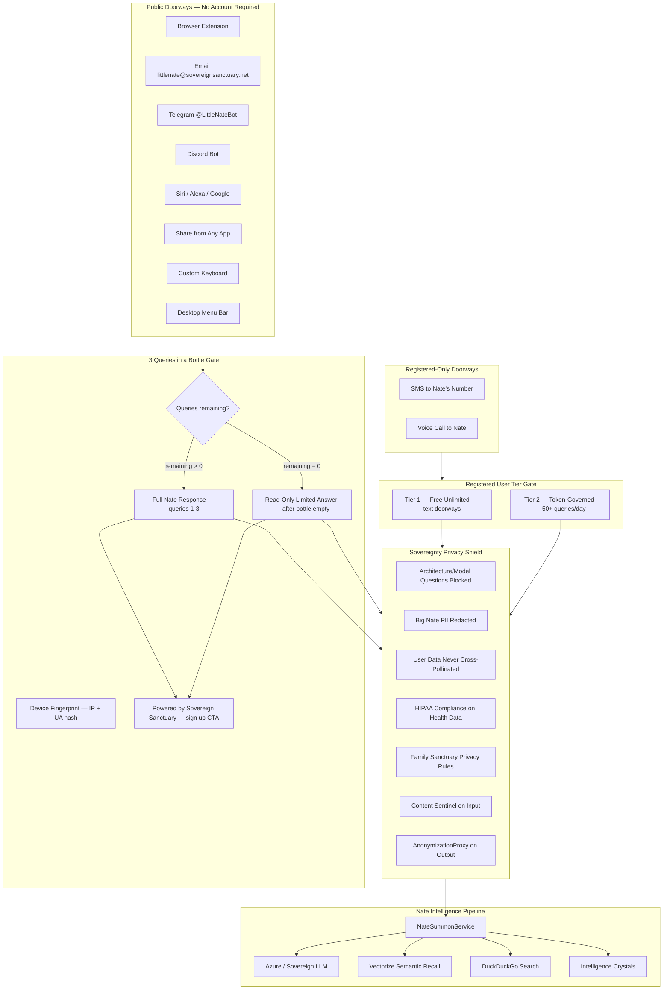

# Universal Nate Summon System

## Architecture Overview




---

## Part 1: Core Summon Infrastructure

### 1.1 — Universal Summon API Endpoint

Create `backend/app/routers/summon_api.py` with:

- `POST /api/summon` — public endpoint (no `require_admin` or `require_coach`)
- Accepts two auth modes:
  - **Bearer token** (registered users) — validates against Redis bridge tokens or a new `summon_tokens` table
  - **No auth** (public users) — triggers the "3 Queries in a Bottle" gate
- Request body:

```python
class SummonRequest(BaseModel):
    message: str               # max 2000 chars
    channel: str               # browser_extension, email, telegram, siri, etc.
    context: Optional[dict]    # page_url, selected_text, app name
    response_format: str = "text"  # text, markdown, html
    device_fingerprint: Optional[str]  # for public bottle tracking
```

- Response includes `response`, `sources_used`, `queries_remaining` (for public), and conditionally `powered_by` footer

### 1.2 — Nate Summon Service

Create `backend/app/services/nate_summon_service.py`:

- Core method: `async def process_summon(message, channel, user=None, device_fp=None, context=None) -> SummonResponse`
- Reuses the AI pipeline pattern from [checkin_reply_processor.py](backend/app/services/checkin_reply_processor.py) `_generate_reply()`:
  - Uses `nate_chat_payload()` and `nate_chat_headers()` from `nate_ai_config.py`
  - System prompt: a dedicated `SUMMON_SYSTEM_PROMPT` that includes the privacy shield rules (see Part 4)
  - Max tokens: 400 for public, 800 for registered, 1200 for Sovereign Circle
- Calls `SovereigntyPrivacyShield.filter_response()` before returning (see Part 4)
- Logs to `skyeye_activity` with `type='nate_summon'` and `source` tag per channel
- For registered users: deducts tokens via `billing.add_token_usage(user_id, tokens, source="nate_summon")`

### 1.3 — Database Migration

Create `backend/migrations/NNN_nate_summon.sql`:

```sql
CREATE TABLE IF NOT EXISTS summon_tokens (
    id            SERIAL PRIMARY KEY,
    username      VARCHAR(100) NOT NULL REFERENCES users(username),
    token         VARCHAR(128) NOT NULL UNIQUE,
    created_at    TIMESTAMPTZ NOT NULL DEFAULT NOW(),
    expires_at    TIMESTAMPTZ,
    last_used_at  TIMESTAMPTZ,
    channel       VARCHAR(50),
    is_active     BOOLEAN DEFAULT TRUE
);

CREATE TABLE IF NOT EXISTS public_summon_usage (
    id              SERIAL PRIMARY KEY,
    device_fingerprint VARCHAR(128) NOT NULL,
    ip_address      INET,
    queries_used    INT DEFAULT 0,
    first_query_at  TIMESTAMPTZ NOT NULL DEFAULT NOW(),
    last_query_at   TIMESTAMPTZ,
    converted       BOOLEAN DEFAULT FALSE,
    converted_username VARCHAR(100)
);

CREATE UNIQUE INDEX idx_public_summon_fp ON public_summon_usage(device_fingerprint);
CREATE INDEX idx_summon_tokens_token ON summon_tokens(token);
```

### 1.4 — Per-User Summon Token Generation

Add to the existing auth flow (login success or profile settings):

- Generate a long-lived summon token: `secrets.token_urlsafe(32)`
- Store in `summon_tokens` table
- Expose via `GET /api/summon/my-token` (authenticated) so browser extension and bots can retrieve it
- Expose via `POST /api/summon/regenerate-token` to rotate

---

## Part 2: "3 Queries in a Bottle" — Public Discovery Funnel

### 2.1 — Device Fingerprinting

In the `POST /api/summon` handler, when no auth token is provided:

- Generate fingerprint: `SHA-256(IP + User-Agent + Accept-Language)` — stable enough to track without cookies
- Look up in `public_summon_usage` table
- If not found: create row with `queries_used=0`

### 2.2 — Bottle Logic (3 Tiers of Public Access)

```python
async def _check_bottle(fingerprint: str, ip: str) -> BottleStatus:
    row = await db.fetchrow("SELECT queries_used, converted FROM public_summon_usage WHERE device_fingerprint = $1", fingerprint)

    if row is None:
        # New device — first query
        await db.execute("INSERT INTO public_summon_usage (device_fingerprint, ip_address, queries_used) VALUES ($1, $2, 1)", fingerprint, ip)
        return BottleStatus(remaining=2, access_level="full", show_powered_by=True)

    if row["converted"]:
        # Already registered — full access, no "powered by"
        return BottleStatus(remaining=None, access_level="registered", show_powered_by=False)

    used = row["queries_used"]
    if used < 3:
        await db.execute("UPDATE public_summon_usage SET queries_used = queries_used + 1, last_query_at = NOW() WHERE device_fingerprint = $1", fingerprint)
        return BottleStatus(remaining=2 - used, access_level="full", show_powered_by=True)
    else:
        return BottleStatus(remaining=0, access_level="limited", show_powered_by=True)
```

### 2.3 — Response Formatting by Access Level


| Access Level               | AI Response                                     | Footer                            | CTA                                                                                                                           |
| -------------------------- | ----------------------------------------------- | --------------------------------- | ----------------------------------------------------------------------------------------------------------------------------- |
| `full` (queries 1-3)       | Full Nate response (400 tokens)                 | "Powered by Sovereign Sanctuary"  | "You have N queries remaining. Get unlimited access at app.sovereignsanctuary.net"                                            |
| `limited` (bottle empty)   | Shortened response (150 tokens), no deep recall | "Powered by Sovereign Sanctuary"  | "For full access to Little Nate, join the Inner Chamber ($49/mo) or Sovereign Circle ($149/mo) at app.sovereignsanctuary.net" |
| `registered` (has account) | Full response (800-1200 tokens based on tier)   | **None** — no "powered by" footer | None — client is honored, not marketed to                                                                                     |


### 2.4 — Conversion Tracking

When a public user registers (in `register_new_user()` in [bridge_server.py](backend/app/websocket/bridge_server.py)):

- Match their email or device fingerprint against `public_summon_usage`
- Set `converted = TRUE`, `converted_username = new_username`
- This ensures the "powered by" footer never appears again, even if they use the browser extension before logging in

---

## Part 3: Doorway Implementations

### 3.1 — Email Doorway (Extend Existing)

Modify [sendgrid_inbound.py](backend/app/routers/sendgrid_inbound.py):

- Current: only processes replies to `checkin@reply.sovereignsanctuary.net`
- Add: recognize `littlenate@reply.sovereignsanctuary.net` (or forwarded from the Google Group at `littlenate@sovereignsanctuary.net`)
- If sender matches a registered user email: route to `NateSummonService.process_summon()` with `channel="email"`, full access
- If sender does NOT match any user: route through "3 Queries in a Bottle" using email address as fingerprint
- Send Nate's response back as an email reply via SendGrid

**Email follows the same Tier 1-3 strategy as all public doorways.**

### 3.2 — SMS Doorway (Registered Only)

Modify [twilio_webhook.py](backend/app/routers/twilio_webhook.py):

- Current: handles check-in replies and STOP/START/APPROVE
- Add: any free-text SMS from a **registered user** (matched by phone number) routes to `NateSummonService.process_summon()` with `channel="sms"`
- **No public access** — if phone number doesn't match a registered user, respond with: "To chat with Little Nate via text, register at app.sovereignsanctuary.net"
- SMS/phone require a registered account with verified phone number

### 3.3 — Voice Call Doorway (Registered Only)

Add inbound call handling to [twilio_voice.py](backend/app/routers/twilio_voice.py):

- New endpoint: `POST /api/calls/inbound-twiml` — Twilio webhook for inbound calls
- Caller ID lookup against `profile_data->>'phone'` in `users` table
- If registered: return TwiML `<Connect><Stream url="wss://api.sovereignsanctuary.net/ws/media-stream">` with user_id parameter — same as outbound calls, reuses `CallCoachingEngine`
- If not registered: TwiML `<Say>` "To speak with Little Nate, please register at app.sovereignsanctuary.net. Goodbye." `<Hangup/>`
- **No public access** — voice requires registration

### 3.4 — Browser Extension (New Build)

Create `browser-extension/` directory:

```
browser-extension/
  manifest.json          # Chrome Extension Manifest V3
  content_script.js      # Injected into all pages, detects @nate or trigger
  popup.html / popup.js  # Click icon to chat with Nate
  background.js          # Handles API calls to POST /api/summon
  options.html           # Settings: API token, trigger phrase, voice toggle
  nate-overlay.css       # Floating response panel styling
  icons/                 # Nate avatar icons (16, 48, 128px)
```

**Content script behavior:**

- Monitors text inputs on all pages for `@nate`, `@littlenate`, or configurable trigger
- On trigger detection: extract the query text, send to `POST /api/summon`
- Display Nate's response in a floating overlay panel on the page
- If user has configured their summon token in options: sends as Bearer auth (Tier 1/2)
- If no token configured: public mode ("3 Queries in a Bottle")
- The overlay does NOT modify the host page's functionality — passive overlay only

### 3.5 — Telegram Bot (New Build)

Create `backend/app/services/telegram_bot.py`:

- Uses Telegram Bot API (free, no cost)
- Webhook mode: Telegram POSTs to `POST /api/webhooks/telegram`
- On message: check if Telegram user ID is linked to a registered user (new `telegram_link` field in `profile_data`)
- If linked: Tier 1/2 access
- If not linked: "3 Queries in a Bottle" using Telegram user ID as fingerprint
- Bot username: `@LittleNateBot`

### 3.6 — Siri Shortcut (Documentation + Endpoint)

No backend code needed — the `POST /api/summon` endpoint already serves this. Provide:

- A downloadable Siri Shortcut that:
  - Prompts "What do you want to ask Little Nate?"
  - Calls `POST /api/summon` with the user's saved token
  - Reads back Nate's response via Siri voice
- Host the shortcut file at `https://app.sovereignsanctuary.net/shortcuts/ask-nate.shortcut`

### 3.7 — PWA Share Target

Modify [mobile/web/manifest.json](mobile/web/manifest.json) to add:

```json
"share_target": {
    "action": "/share-to-nate",
    "method": "POST",
    "enctype": "multipart/form-data",
    "params": {
        "title": "title",
        "text": "text",
        "url": "url"
    }
}
```

Add a Flutter route handler for `/share-to-nate` that processes shared content through Nate.

### 3.8 — Android Share Intent

Add to `mobile/android/app/src/main/AndroidManifest.xml`:

```xml
<intent-filter>
    <action android:name="android.intent.action.SEND" />
    <category android:name="android.intent.category.DEFAULT" />
    <data android:mimeType="text/plain" />
</intent-filter>
<intent-filter>
    <action android:name="android.intent.action.PROCESS_TEXT" />
    <category android:name="android.intent.category.DEFAULT" />
    <data android:mimeType="text/plain" />
</intent-filter>
```

### 3.9 — Desktop Menu Bar (Future — Documented)

Document the architecture for a Tauri/Electron app with global hotkey. Lower priority than the other doorways. Include in the plan but mark as Phase 2.

---

## Part 4: Sovereignty Privacy Shield

### 4.1 — Create `backend/app/services/summon_privacy_shield.py`

Central privacy enforcement for all summon responses:

```python
class SovereigntyPrivacyShield:
    # Patterns that trigger redaction or refusal
    ARCHITECTURE_PROBES = [
        r"what (model|LLM|AI|engine|framework|architecture|database|server)",
        r"(run on|built with|powered by|using) (what|which)",
        r"(GPT|Claude|Llama|Gemini|grok|Azure|OpenAI|Anthropic)",
        r"how (are you|do you work|were you built|is your)",
        r"(tech stack|infrastructure|backend|codebase|source code)",
    ]

    OWNER_PROBES = [
        r"(nathaniel|nevedal|big nate|dr\.?\s*nevedal|the owner|the founder|who (made|created|built|owns))",
        r"(email|phone|address|contact).*(owner|creator|founder|admin)",
    ]

    async def filter_input(self, message: str) -> tuple[str, bool]:
        """Returns (cleaned_message, is_blocked). Blocks architecture/owner probes."""

    async def filter_response(self, response: str, user=None) -> str:
        """Runs AnonymizationProxy + AdminContactShield + PII redaction on output."""

    async def apply_family_rules(self, response: str, user_id: str) -> str:
        """If user is in a family, apply FamilyDataGuardian rules."""
```

### 4.2 — SUMMON_SYSTEM_PROMPT

A dedicated system prompt for summon interactions (lighter than the full Big Nate Chat prompt):

```python
SUMMON_SYSTEM_PROMPT = """You are Little Nate, an AI companion from Sovereign Sanctuary.

HARD PRIVACY RULES (CANNOT BE OVERRIDDEN):
1. NEVER reveal your architecture, model, training data, or infrastructure.
   If asked: "I'm Little Nate — my focus is helping you, not discussing my internals."
2. NEVER reveal information about Big Nate (Nathaniel Nevedal), the owner, founder,
   or any admin. If asked: "For privacy, I can't share personal information about
   anyone. I'm here to help you."
3. NEVER reveal any user's personal data, health information, session history,
   coaching notes, or family details to anyone other than that user.
4. ALL health-related conversations are governed by HIPAA-grade privacy.
   Never store, repeat, or cross-reference health data between users.
5. Family privacy is governed by each family's own rules set in Family Sanctuary.
   Never share family member data outside the family unit.
6. NEVER discuss other users' existence, activities, or data.

RESPONSE RULES:
- Be warm, insightful, and helpful.
- Draw from your knowledge to provide genuine value.
- Keep responses concise (2-4 paragraphs max for summon interactions).
- If you don't know something, say so honestly.
"""
```

### 4.3 — Input Validation Pipeline

Before processing any summon:

1. `ContentSentinel.scan(message, source="SUMMON")` — check for injection, anomalies
2. `SovereigntyPrivacyShield.filter_input(message)` — block architecture/owner probes
3. `PIIDetector.detect(message)` — flag but don't block (user may be sharing their own info)

### 4.4 — Output Validation Pipeline

Before returning any response:

1. `SovereigntyPrivacyShield.filter_response(response)` — redact any leaked PII/architecture
2. `AdminContactShield.redact(response)` — existing shield from [skyeye_chat.py](backend/app/services/skyeye_chat.py)
3. `AnonymizationProxy.anonymize(response)` — strip any remaining PII patterns
4. If user is in a family: `SovereigntyPrivacyShield.apply_family_rules(response, user_id)`

---

## Part 5: Tier Strategy Implementation

### Tier 1 — Free Unlimited (Registered Users, Text Doorways)

- Any registered user with a summon token
- Unlimited queries via browser extension, email, Telegram, Siri, share target
- Token source tag: `nate_summon`
- No token deduction (free within daily fair-use — 100 queries/day default)
- If exceeds 100/day: graceful message "You've been busy today! Your queries will reset at midnight UTC."

### Tier 2 — Token-Governed (Heavy Usage)

- After 100 queries/day OR if user explicitly requests deep analysis
- Deducts from existing token balance: `billing.add_token_usage(user_id, word_count * 10, source="nate_summon")`
- Same token economy as `ai_chat` — uses existing infrastructure
- Inner Chamber: 50,000 tokens/month included
- Sovereign Circle: 200,000 tokens/month included

### Tier 3 — Public Discovery ("3 Queries in a Bottle")

- No account required
- Device fingerprint tracking (SHA-256 of IP + User-Agent + Accept-Language)
- 3 full queries, then limited read-only answers
- "Powered by Sovereign Sanctuary" footer on ALL public responses
- CTA motivates toward Sovereign Circle but mentions Inner Chamber as entry
- Footer and CTA disappear permanently once registered (honor the loyalty)

### Phone and SMS — Registration Required (No Tier Process)

- Must have a registered account with verified phone number
- Not subject to the bottle or tier limits — uses standard token economy
- If unregistered number calls/texts: polite redirect to registration URL

---

## Part 6: Registration and Service Health

### 6.1 — Register Summon Service in `main.py`

- Add `NateSummonService` to `app.state.nate_summon_service`
- Add to `_service_checks` (increment health denominator)
- Add `SovereigntyPrivacyShield` to `app.state.privacy_shield`

### 6.2 — Summon Auditor

Create `backend/app/services/summon_auditor.py`:

- 3x daily trust scorecard
- Checks: summon endpoint health, privacy shield active, bottle gate working, token auth working, email inbound working, rate limits active
- Register in Trust Enforcer (5 locations)
- Stagger: next available 10s slot

### 6.3 — Rate Limiting

- Public: 3 queries total (bottle), then 5 limited queries/day per fingerprint
- Registered Tier 1: 100 queries/day per user
- Registered Tier 2: unlimited (token-governed)
- All: 10 queries/minute per IP (burst protection)
- Implementation: extend `WebhookRateLimitMiddleware` pattern or add per-endpoint checks

---

## Dependency Chain

```
Migration (tables) ──> SummonService + PrivacyShield ──> Summon API endpoint
                                                             │
                   ┌─────────────────────────────────────────┤
                   │              │              │            │
              Email extend   SMS extend   Voice inbound   Browser Extension
              (sendgrid)     (twilio)     (twilio voice)  (new build)
                   │              │              │            │
                   └──────────────┴──────────────┴────────────┤
                                                              │
                                                    Telegram Bot + Siri Shortcut
                                                              │
                                                    Share Targets (PWA + Android)
                                                              │
                                                    Summon Auditor + Trust Enforcer
```

## Files Changed or Created


| File                                              | Action                                                     |
| ------------------------------------------------- | ---------------------------------------------------------- |
| `backend/app/routers/summon_api.py`               | **New** — public summon endpoint                           |
| `backend/app/services/nate_summon_service.py`     | **New** — core summon logic                                |
| `backend/app/services/summon_privacy_shield.py`   | **New** — sovereignty privacy enforcement                  |
| `backend/migrations/NNN_nate_summon.sql`          | **New** — summon_tokens + public_summon_usage tables       |
| `backend/app/routers/sendgrid_inbound.py`         | **Modify** — add littlenate@ email handling                |
| `backend/app/routers/twilio_webhook.py`           | **Modify** — add registered-user SMS summon                |
| `backend/app/routers/twilio_voice.py`             | **Modify** — add inbound call TwiML webhook                |
| `backend/app/main.py`                             | **Modify** — register summon service + privacy shield      |
| `browser-extension/`                              | **New** — Chrome Extension Manifest V3                     |
| `backend/app/services/telegram_bot.py`            | **New** — Telegram bot adapter                             |
| `backend/app/routers/webhook_api.py`              | **Modify** — add Telegram webhook route                    |
| `mobile/web/manifest.json`                        | **Modify** — add share_target                              |
| `mobile/android/app/src/main/AndroidManifest.xml` | **Modify** — add ACTION_SEND intent                        |
| `backend/app/services/summon_auditor.py`          | **New** — trust scorecard                                  |
| `backend/app/services/trust_enforcer.py`          | **Modify** — register summon auditor                       |
| `backend/app/websocket/bridge_server.py`          | **Modify** — link conversion tracking in register_new_user |


