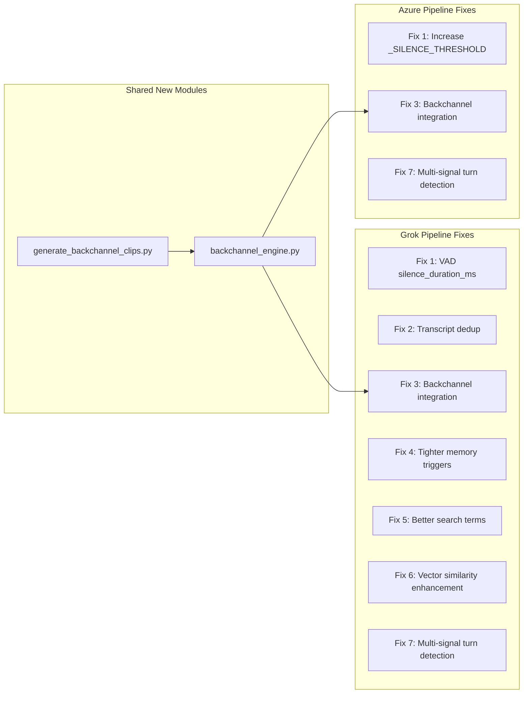

# Voice Call Fixes + Neural Mirror Implementation

## Part 0: Patent Filing

Save `PATENT_PROVISIONAL_11_NEURAL_MIRROR.md` to `patent/` alongside the existing 10 provisionals. Update the patent portfolio integrity rule (`.cursor/rules/patent-portfolio-integrity.mdc`) to add row 14 for Patent 11.

---

## Part 1: Voice Call Fixes (7 Fixes)

These fixes target `backend/app/services/twilio_grok_xtts_pipeline.py` (Grok pipeline) and `backend/app/services/littlenate_realtime.py` (Azure pipeline). Fixes 2/4/5/6 apply only to the Grok pipeline (Azure pipeline has no memory search). Fixes 1/3/7 apply to both.

**Note**: The Azure pipeline (`littlenate_realtime.py`) does not have memory search (`_is_memory_query`, `_extract_search_terms`, `_deep_memory_search`). Those functions live exclusively in the Grok pipeline. Adding memory search to the Azure pipeline is a separate effort beyond this plan.


| Pipeline       | File                                            | VAD Model                                 | Memory Search                                                            | Backchannel |
| -------------- | ----------------------------------------------- | ----------------------------------------- | ------------------------------------------------------------------------ | ----------- |
| Grok           | `twilio_grok_xtts_pipeline.py`                  | xAI server-side `server_vad`              | Yes (`_is_memory_query`, `_extract_search_terms`, `_deep_memory_search`) | None        |
| Azure Realtime | `littlenate_realtime.py` (`TwilioMediaSession`) | Chunk-based energy (`_SILENCE_THRESHOLD`) | None                                                                     | None        |





### Fix 1 -- VAD Silence Duration + Short Response Lever (both pipelines)

**VAD/Fix 7 Coordination**: Fix 1 sets the native VAD silence threshold. Fix 7 adds the MultiSignalTurnDetector as a second gate. If both use 1500ms independently, total delay can reach 3000ms (VAD fires at 1500ms, then detector waits another 1500ms) -- too long for voice therapy. Resolution: set the native VAD to 800ms (just above default, reduces false triggers on breaths) and let the MultiSignalTurnDetector be the real gatekeeper at 1500ms. The native VAD fires early as a candidate signal; the detector holds until all 4 signals agree. Total delay from actual speech end: ~1500ms, not 3000ms.

**Grok pipeline** -- [twilio_grok_xtts_pipeline.py](backend/app/services/twilio_grok_xtts_pipeline.py) line ~253:

```python
# CURRENT (line 253):
"turn_detection": {"type": "server_vad"},

# CHANGE TO:
"turn_detection": {
    "type": "server_vad",
    "silence_duration_ms": 800,
    "threshold": 0.5,
    "prefix_padding_ms": 300,
},
```

If xAI's API does not support `silence_duration_ms`, implement the `VADPatience` class from the spec as a client-side fallback. Add it as a new class at the module level (~~line 370) and integrate into `grok_listener()` where user transcript events arrive (~~line 910). This would intercept `response.create` triggers and delay them by 800ms unless new speech arrives.

**Azure pipeline** -- [littlenate_realtime.py](backend/app/services/littlenate_realtime.py) line ~547:

```python
# CURRENT:
self._SILENCE_THRESHOLD = 50  # ~1.0s of silence

# CHANGE TO:
self._SILENCE_THRESHOLD = 40  # ~0.8s -- early candidate signal, MultiSignalTurnDetector is the real gate
```

**Lever 3 -- Short Response Instruction (both pipelines, same commit as VAD change)**

This is the highest-impact zero-engineering-effort improvement. Append to the system instructions in the same deployment as the VAD change:

**Grok pipeline**: In the `session.update` system instructions string (~line 249):

```
You are on a live phone call. Keep every response to 2-4 sentences maximum. Speak naturally and conversationally. Do not monologue. Pause and let the client react.
```

**Azure pipeline**: In the `relational_prompt` construction in `_synthesize_rissc()` (~line 1412), append the same text to the system prompt.

This triples effective concurrent capacity by cutting average response length from ~200 words to ~60 words, reducing TTS generation time and keeping the conversation rhythm natural for voice therapy.

### Fix 2 -- Memory Search Dedup (Grok only)

Add a `MemorySearchDedup` class (inline in the Grok pipeline or a small utility) that hashes the first 200 chars of user transcript text. Before calling `_deep_memory_search()`, check `should_search(text)`. Prevents duplicate RAG queries when Grok re-emits the same transcript.

Initialize `_search_dedup = MemorySearchDedup()` at module level or as a session-scoped variable inside `run_twilio_grok_xtts_bridge`.

Integrate into `grok_listener()` at line ~910:

```python
# CURRENT:
if _is_memory_query(user_txt) and session_username and ctx.get("db_pool"):

# CHANGE TO:
if _is_memory_query(user_txt) and _search_dedup.should_search(user_txt) and session_username and ctx.get("db_pool"):
```

### Fix 3 -- Backchannel Engine (both pipelines)

**New file**: `backend/app/services/backchannel_engine.py`

`BackchannelEngine` class:

- Loads pre-rendered mulaw WAV clips from `assets/backchannel_clips/` organized by register (neutral, warm, empathic, validating)
- Fires every 6-12 seconds during continuous client speech
- Register selection based on audio energy + pitch (empathic for low energy/pitch, validating for high energy); later overridden by Neural Mirror `register_bias` (Part 2, Phase 5)
- `enable()`/`disable()` to suppress during Nate's speech
- `reset()` on session end
- Zero LLM cost (pre-rendered audio clips)
- Returns base64-encoded mulaw audio for injection into Twilio media stream
- **CRITICAL ISOLATION RULE**: Backchannel clips are injected DIRECTLY to the Twilio WebSocket media stream. They are NEVER sent through Grok's audio input or any inference provider's audio channel. The inference provider must be completely unaware that backchannels are occurring.

**New file**: `scripts/generate_backchannel_clips.py`

Uses **Azure Speech SDK** (`azure-cognitiveservices-speech`) with SSML for prosody control (pitch, rate, volume per clip). SSML is required because backchannel clips need precise prosodic shaping -- a warm "mmhmm" needs different pitch contour than an empathic "I hear you." Env vars: `AZURE_SPEECH_KEY` / `AZURE_SPEECH_REGION`. Output format: 8kHz 8-bit mono mulaw WAV. Outputs to `assets/backchannel_clips/{neutral,warm,empathic,validating}/`.

**New directory**: `assets/backchannel_clips/` with 4 register subdirectories.

**Grok pipeline integration** -- [twilio_grok_xtts_pipeline.py](backend/app/services/twilio_grok_xtts_pipeline.py):

- In the media chunk handler (~line 941-960, where `event == "media"` and audio is forwarded to Grok), add `_compute_audio_energy()` and feed backchannel engine
- Check `backchannel.get_backchannel()` and inject via `_send_mulaw_to_twilio()`
- Disable/enable around `_on_grok_text()` TTS calls

**Azure pipeline integration** -- [littlenate_realtime.py](backend/app/services/littlenate_realtime.py):

- In `TwilioMediaSession.__init__`: instantiate `BackchannelEngine`
- In the audio chunk processing loop (where `_silence_chunks` is tracked, ~lines 700-750): compute energy and feed backchannel engine
- Check for backchannel clips to inject via the existing `_send_mulaw` method
- Disable/enable in `_synthesize_rissc()` (~line 1412)

### Fix 4 -- Tighter Memory Triggers (Grok only)

Replace the existing `_MEMORY_QUERY_PATTERNS` list (lines ~325-338) and `_is_memory_query` function (lines ~350-354) with a `MemorySearchTrigger` class using a two-gate system:

- Gate 1: Pattern categories (explicit recall, temporal reference, topic deepening, emotional recall) -- at least 2 categories must match.
- Gate 2: Confidence score >= 2.0 (weighted sum of category matches + question mark bonus + first-person bonus). `SECOND_PERSON_MEMORY` ("do you remember") is weighted double.
- Reduces false positives from broad patterns like `\b(history|previous)\b`. Eliminates false triggers on phrases like "Today I was developing code" and "conversation I had with my boss".

### Fix 5 -- Better Search Terms (Grok only)

Replace the existing `_extract_search_terms` function (lines ~357-371) with a `SearchTermExtractor` class:

- Expanded stop word list (~200 common English words: articles, pronouns, common verbs, fillers, discourse markers)
- `PRESERVE_WORDS` set for therapeutically significant vocabulary (emotions, relationships, clinical terms, somatic words -- e.g., "trauma", "anxiety", "grief", "abandonment", "attachment", "boundaries")
- Returns 3-8 meaningful terms ordered by relevance (clinical terms first, then nouns, then verbs)
- Deduplication while preserving order

The return type changes from `str` to `List[str]`. Update `_deep_memory_search` (~line 384) to join the list: `search_terms = " ".join(self._term_extractor.extract(query_text))`.

### Fix 6 -- Vector Embedding at Crystallization (both pipelines)

Post-session crystallization in `_finalize` of `littlenate_realtime.py` AND in the `finally` block of `twilio_grok_xtts_pipeline.py` (~line 1212+) -- after crystal text is generated:

- Call Cloudflare Workers AI BGE-base-en-v1.5 to generate an embedding vector.
- Upsert the vector to the appropriate Vectorize index with crystal metadata.
- This ensures voice-originated crystals are searchable via `_search_vectorize()` in `_deep_memory_search()`.

The existing `_search_vectorize()` in the Grok pipeline already does semantic retrieval -- so this fix primarily improves the **write** side (embedding at crystallization time).

**Read-side note**: The Vectorize query path (`_search_vectorize()`) currently only exists in the Grok pipeline's `_deep_memory_search()`. The Azure pipeline has no memory search at all. When memory search is eventually added to the Azure pipeline (separate effort), it should include the Vectorize semantic query path from the start -- not just FTS.

### Fix 7 -- Multi-Signal Turn Detection (both pipelines)

Create `MultiSignalTurnDetector` class (in `backchannel_engine.py` alongside the backchannel engine).

Combines 4 signals before committing to a response:

1. VAD silence (1500ms threshold -- this is the REAL silence gate; native VAD at 800ms is just the early candidate trigger)
2. Backchannel engine confirms client not in continuous speech
3. Energy trajectory declining (below 30% of peak)
4. Client spoke for at least 1.0 second (filters "mmhmm" acknowledgments)

Returns `should_end_turn: bool` with a composite confidence score.

**Coordination with Fix 1**: The native VAD (Fix 1) fires at 800ms as a "candidate turn end" event. The MultiSignalTurnDetector receives this event and starts its own 1500ms timer while checking all 4 signals. If new speech arrives, the timer resets. Total delay from actual speech end is ~1500ms (detector gate), not 800ms+1500ms=2300ms. The native VAD is intentionally lower than the detector threshold.

- **Grok integration**: Replace the direct `response.create` handling in `grok_listener()`. When Grok's server VAD fires `speech_stopped`, feed it to the detector as a candidate event. Only send `response.create` when `should_trigger_response()` returns True.
- **Azure integration**: Replace the simple `_SILENCE_THRESHOLD` check in `TwilioMediaSession` with the multi-signal detector. Feed `on_audio_frame()` from each chunk, and only call `_process_turn()` when `should_trigger_response()` returns True.

---

## Part 2: Neural Mirror System (8 Phases)

All new code lives in `backend/app/services/neural_mirror.py` (single file, ~800 lines). New migration creates 3 tables. Integration touches both voice pipelines and the Helix orchestrator.

### Phase 1 -- VoiceFeatureExtractor

A superset of the existing `VoiceBiometricExtractor` in [nevedal_engine.py](backend/app/services/nevedal_engine.py) (line 169). Extracts ~90 features across 3 domains:

- **Time-domain**: speech rate, pause patterns, energy mean/variance/trajectory, zero-crossing rate, voiced/unvoiced ratio, breath frequency, articulation rate
- **Frequency-domain**: pitch (F0 via Praat/parselmouth), formants F1-F3, spectral centroid/bandwidth/rolloff, HNR, jitter, shimmer
- **Time-frequency**: 13 MFCCs + delta + delta-delta, spectral flux, 12 chroma features, onset strength
- **Derived composites**: emotional volatility index, vocal tension score, prosodic engagement score, respiratory pattern

Returns a `VoiceFeatureVector` dataclass with a `to_vector()` method producing an ~90-dim float32 numpy array.

**Dependencies**: `librosa`, `parselmouth` (Praat wrapper), `numpy`. These are heavy -- install on the server only; the Docker image needs `apt-get install libsndfile1` for librosa.

**Relationship to existing `VoiceBiometricExtractor`**: The new extractor supersedes it for Neural Mirror purposes but does NOT replace it. The existing extractor continues to run independently for the C_emo formula path. The Neural Mirror extractor runs in parallel, consuming the same raw audio bytes.

### Phase 2 -- EmotionalBaselineCapturer + Storage

- `EmotionalBaselineCapturer` class: maintains a 30-second rolling audio buffer. When the feature extractor detects a clear emotional state with confidence >= 0.75, captures the buffered audio as a baseline sample.
- 10 target emotions: grief, anger, joy, contentment, shame, conviction, fear, curiosity, dissociation, integration.
- Minimum 2-minute cooldown between captures. Each emotion is captured only once (can be re-captured if confidence improves).
- Stores to `voice_emotional_baselines` table (see migration below).
- Consent text added to the voice onboarding flow: "Little Nate calibrates to your unique voice over time..."

### Heuristic Mode (Degraded Graceful -- Active from Day 1)

Between deployment and accumulating ~~1000 voice segments (~~5 hours of calls across multiple clients), Phases 3-8 (autoencoder, fingerprint, mirror, interpreter, crystal integration, trajectory analysis) are non-functional. During this collection period, the system operates in **heuristic mode** where the VoiceFeatureExtractor (Phase 1) feeds a simplified direct mapping to approximate Nevedal factors WITHOUT the autoencoder:


| Voice Feature                             | Heuristic Mapping   | Band Equivalent                |
| ----------------------------------------- | ------------------- | ------------------------------ |
| Pitch below client session average        | Elevated theta      | Deep emotional processing      |
| Speech rate acceleration (>1.3x baseline) | Elevated beta       | Cognitive activation / anxiety |
| Energy drop (below 40% of session peak)   | Elevated delta      | Withdrawal / dissociation      |
| Jitter/shimmer spikes (>2x session mean)  | Elevated resistance | Vocal tension / guardedness    |
| Pause ratio increase (>1.5x baseline)     | Elevated alpha      | Reflective processing          |
| Pitch variance increase (>2x baseline)    | Elevated gamma      | Emotional breakthrough         |


This gives the NeuralMirror rough co-regulation functionality from the first call. The `NeuralMirror` class must implement `_heuristic_mode()` alongside the autoencoder path, selected by checking `self._autoencoder_trained: bool`. When the autoencoder becomes trained and weights are loaded, heuristic mode is transparently replaced -- no code change, no restart.

Feature vectors are stored in `voice_emotional_baselines` during this period for later autoencoder training.

### Phase 3 -- VoiceEEGAutoencoder

PyTorch autoencoder (90-dim input -> 64-dim hidden -> 32-dim latent -> 64 -> 90 reconstruction):

- Latent space structured as 8 bands of 4 dimensions each: delta(0:4), theta(4:8), alpha(8:12), beta(12:16), gamma(16:20), resistance(20:24), coherence(24:28), signature(28:32)
- Encoder uses LayerNorm + GELU + Dropout(0.1) + Tanh output bounding
- **Training**: Cannot train until ~~1000 voice segments (~~5 hours of audio across multiple clients) are accumulated. During collection phase, features are extracted and stored but no latent encoding happens. **Heuristic mode** (above) provides approximate functionality during this period.
- Pre-trained weights stored in R2 (`nate-vault/models/voice_eeg_autoencoder.pt`) and loaded on session start.
- **Dependency**: `torch` (CPU-only, ~200MB). Install via `pip install torch --index-url https://download.pytorch.org/whl/cpu` to avoid CUDA overhead.

### Phase 4 -- NeuralFingerprint

- Accumulates latent vectors across sessions into a per-client statistical model.
- After 50+ samples: computes mean vector, covariance matrix, fits `GaussianMixture` (sklearn) with 6 clusters.
- `compute_deviation()` returns Mahalanobis distance from baseline, cluster assignment, per-band deviations, closest emotion, and Nevedal factors.
- `compare_sessions()` compares mean latent vectors between two sessions to detect therapeutic progression.
- Periodically saved to `neural_fingerprints` table (after each session).
- **Dependency**: `scikit-learn` (already likely installed; verify).

### Phase 5 -- NeuralMirror

The co-regulation engine. Receives deviation metrics from the fingerprint and adjusts Little Nate's processing:

- **Technique weight adjustment**: IFS, AEDP, Polyvagal, EFT weights computed from band energies (resistance -> IFS, theta -> AEDP, delta+resistance -> Polyvagal, theta+beta -> EFT).
- **Backchannel register bias**: Maps dominant band to register (delta/theta -> empathic, alpha -> warm, beta -> neutral, gamma -> validating). Feeds into `BackchannelEngine` from Fix 3.
- **Response pacing**: very_slow (delta) through normal (beta).
- **Prompt context injection**: Generates natural-language descriptions of the client's neurological state for the LLM system prompt (e.g., "The client is in deep emotional processing. Speak slowly. Use experiential language.").
- **Heartbeat synchronization**: Processing interval adjusted (500ms gamma to 2000ms delta).

### Phase 6 -- VirtualEEGInterpreter + Nevedal Formula Mapping

Interprets the 32-dim latent vector as band energies, then maps to the Nevedal Formula factors:

- A (Awareness) = (alpha + beta) / 2
- Aw (Attunement) = (theta + gamma) / 2
- I (Integration) = (gamma + coherence) / 2
- R (Resistance) = max(0.01, resistance + (1 - alpha) * 0.5)
- EC = (A * Aw * I) / R

This provides a voice-inferred EC score that runs alongside (not replacing) the existing C_emo computation in `nevedal_engine.py`.

### Phase 7 -- Crystal Integration

When crystals are created from voice sessions, attach the virtual EEG context:

- Current latent vector (32-dim)
- Band deviations from baseline
- Dominant band at time of crystallization
- Nevedal factors (A, Aw, I, R, EC)
- Closest detected emotion

Stored in the crystal's `metadata` JSONB field. On recall, this context enables neurological-aware comparison: "Last time we discussed this, your theta was dominant with high resistance. Now theta is present but resistance is lower."

### Phase 8 -- Cross-Session Trajectory Analysis

Per-session latent trajectories stored in `virtual_eeg_traces` table. Enables:

- Session-to-session comparison (overall shift, per-band changes, EC change)
- Tunneling event detection with explicit thresholds (configurable constants in `neural_mirror.py`):
  - Resistance-band mean energy drops by more than **0.5** (normalized 0-1 scale) within a 30-second window
  - AND gamma-band mean energy rises by more than **0.4** within the same window
  - AND alpha and beta band energies both remain below **0.3** during the transition (no intermediate cognitive processing stage)
  - Constants: `TUNNEL_RESISTANCE_DROP = 0.5`, `TUNNEL_GAMMA_RISE = 0.4`, `TUNNEL_INTERMEDIATE_CAP = 0.3`, `TUNNEL_WINDOW_SECONDS = 30`
- Long-term therapeutic progression visualization (future Nevedal Lab dashboard tab)

---

## Database Migration

New migration `backend/migrations/XXX_neural_mirror.sql` creates 3 tables:

```sql
voice_emotional_baselines (baseline_id UUID PK, user_id TEXT, emotion TEXT, audio_data BYTEA, feature_vector JSONB, latent_vector JSONB, session_id UUID, nevedal_ec_score FLOAT, confidence FLOAT, context_summary TEXT, captured_at TIMESTAMPTZ)

neural_fingerprints (fingerprint_id UUID PK, user_id TEXT, mean_vector JSONB, covariance JSONB, gmm_params JSONB, n_samples INT, emotional_baselines JSONB, calibrated BOOL, created_at TIMESTAMPTZ)

virtual_eeg_traces (trace_id UUID PK, user_id TEXT, session_id UUID, latent_vectors JSONB, band_energies JSONB, nevedal_factors JSONB, dominant_bands JSONB, mirror_states JSONB, tunneling_events JSONB, created_at TIMESTAMPTZ)
```

FKs reference `voice_accounts(user_id)` and `voice_sessions(session_id)`.

---

## Integration Points (Both Pipelines)

### Azure Pipeline (`littlenate_realtime.py`)

In `TwilioMediaSession.__init__` (~line 525):

- Initialize `VoiceFeatureExtractor`, `VoiceEEGAutoencoder` (load weights), `NeuralMirror`, `EmotionalBaselineCapturer`, load `NeuralFingerprint` from DB.

In the audio processing loop (~line 743+):

- Every ~1 second of accumulated audio, run `_process_neural_mirror(audio_segment)` which: extracts features -> encodes to latent -> updates fingerprint -> updates mirror -> injects prompt context -> checks for baseline capture.

In `_process_turn` (~line 1013+):

- Inject `neural_mirror.get_prompt_injection()` into the system prompt context.
- Pass `neural_mirror.get_technique_weights()` to the Helix pipeline.
- Pass `neural_mirror.get_backchannel_bias()` to the backchannel engine.

### Grok Pipeline (`twilio_grok_xtts_pipeline.py`)

Same pattern: initialize in session setup, run mirror pipeline on audio frames, inject into prompt context via `conversation.item.create` or `session.update`.

### Helix Orchestrator (`helix_orchestrator.py`)

In `think()` (line 172), after Stage 4 (quantum evaluation) and Stage 4.5 (ODPE):

- Accept optional `neural_mirror_context: str` and `technique_weight_overrides: dict` parameters.
- Inject mirror context into the synthesis stage.
- Use technique weight overrides in technique selection.

### Prompt Injection Order and Token Budget

The voice pipeline now has FOUR context injection sources hitting the same prompt. Without a defined order and token budget, these can collectively consume 2000+ tokens, squeezing out conversation history and degrading response quality. Defined injection order (first = highest priority, survives truncation):


| Priority | Source                                            | Max Tokens | Truncation Behavior                           |
| -------- | ------------------------------------------------- | ---------- | --------------------------------------------- |
| 1        | Crystal recall context (personal + global memory) | 300        | Truncate oldest crystals first                |
| 2        | Neural Mirror context (`get_prompt_injection()`)  | 200        | Drop band-detail paragraph, keep summary line |
| 3        | Helix system prompt injection (technique/ODPE)    | 200        | Drop technique rationale, keep technique name |
| 4        | User memory context (FTS/Vectorize results)       | 200        | Truncate lowest-relevance results             |


**Total injection budget: 900 tokens maximum.** If any source exceeds its budget, truncate to cap. The remaining context window is reserved for conversation history and the base system prompt. Implement as a `ContextBudgetAllocator` utility that accepts all 4 sources and returns truncated versions fitting within their caps.

---

## New Dependencies

- `librosa` (audio feature extraction)
- `parselmouth` (Praat wrapper for clinical-grade pitch/formant/jitter/shimmer)
- `torch` (CPU-only, for autoencoder)
- System package: `libsndfile1` (required by librosa, add to Dockerfile)

---

## Deployment Priority


| Step | Fix                                           | Pipeline             | Risk                                            | Estimate  |
| ---- | --------------------------------------------- | -------------------- | ----------------------------------------------- | --------- |
| 0    | Patent 11 filing                              | N/A                  | None                                            | 5 min     |
| 1    | Fix 1 (VAD 800ms) + Lever 3 (short responses) | Both                 | Low -- config + prompt text                     | 30 min    |
| 2    | Fix 2 (Dedup)                                 | Grok                 | Low -- additive                                 | 30 min    |
| 3    | Fix 4 (Tighter triggers)                      | Grok                 | Low -- replaces regex                           | 1-2 hrs   |
| 4    | Fix 5 (Better search terms)                   | Grok                 | Low -- replaces extractor                       | 1-2 hrs   |
| 5    | Fix 3 (Backchannel engine)                    | Both                 | Medium -- new audio injection + clip generation | 4-8 hrs   |
| 6    | Fix 7 (Multi-signal turn)                     | Both                 | Medium -- replaces VAD handling                 | 4-8 hrs   |
| 7    | Fix 6 (Vector embedding)                      | Both                 | Medium -- Vectorize write integration           | 2-4 hrs   |
| 8    | Neural Mirror Phase 1                         | New file             | Low -- additive, begins data collection         | 4-8 hrs   |
| 9    | Neural Mirror Phases 2-4                      | New file + migration | Medium -- autoencoder training needs data       | 8-16 hrs  |
| 10   | Neural Mirror Phases 5-8                      | Integration          | High -- touches Helix + both pipelines          | 16-24 hrs |


**Immediate (can ship independently)**: Steps 0-2
**This sprint**: Steps 3-8
**Next sprint**: Steps 9-10

---

## Files Summary

**New files:**

- `backend/app/services/backchannel_engine.py` (BackchannelEngine + MultiSignalTurnDetector)
- `scripts/generate_backchannel_clips.py` (Azure TTS clip generator)
- `assets/backchannel_clips/` directory with ~22 pre-rendered clips in 4 register subdirs
- `backend/app/services/neural_mirror.py` (~800 lines, all Neural Mirror classes)
- `backend/migrations/XXX_neural_mirror.sql` (3 tables)
- `patent/PATENT_PROVISIONAL_11_NEURAL_MIRROR.md`

**Modified files:**

- `backend/app/services/twilio_grok_xtts_pipeline.py` (Fixes 1-7, Neural Mirror integration)
- `backend/app/services/littlenate_realtime.py` (Fixes 1, 3, 6, 7, Neural Mirror integration)
- `backend/app/services/helix_orchestrator.py` (Neural Mirror context injection in `think()`)
- `.cursor/rules/patent-portfolio-integrity.mdc` (add Patent 11 row)

**Not modified:**

- `voice_billing.py`, `voice_billing_api.py`, `voice_notifications.py`, `voice_metering.py` -- billing is already done
- `nevedal_engine.py` -- existing `VoiceBiometricExtractor` continues unchanged, Neural Mirror runs in parallel

