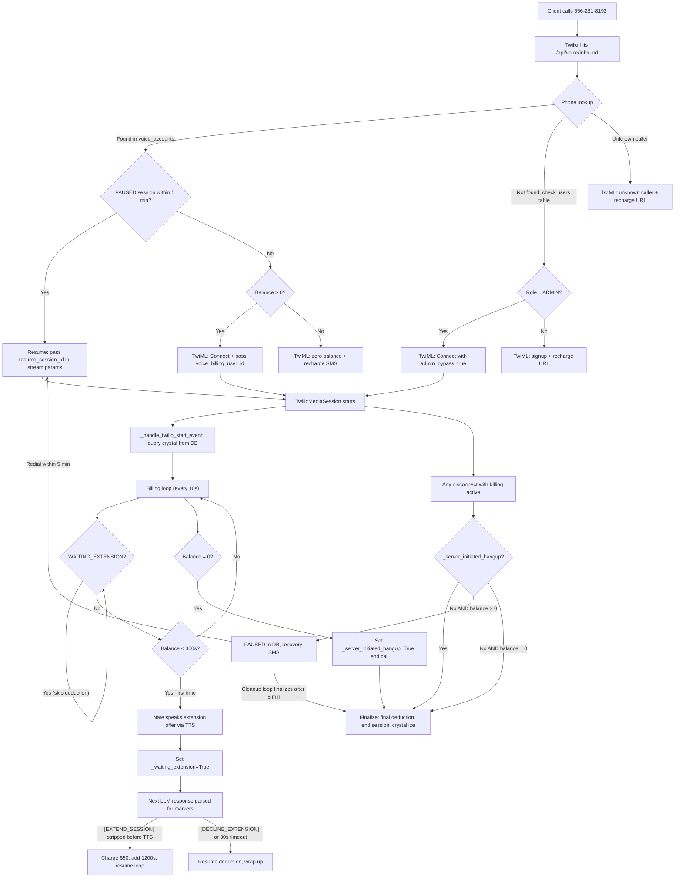

# Voice Therapy Prepaid Billing Integration

## Current State

The existing voice infrastructure has:

- `voice_metering.py` -- tier-based monthly minute entitlement (TRIAL=30min, STANDARD=120min, ADMIN=unlimited). Being **retired/replaced** with safe fallback.
- `twilio_voice.py` -- handles outbound calls only (`/api/calls/initiate`, `/api/calls/twiml`, `/api/calls/status`). No inbound call handler.
- `littlenate_realtime.py` -- `TwilioMediaSession` manages the live call lifecycle, uses `_enforce_max_call_duration` for hard time limit, logs minutes at `_finalize` via `add_voice_minutes`.
- `voice_admission.py` / `voice_capacity.py` / `voice_phone.py` -- admission checks, Redis slot management, phone normalization.
- Phone number `+16562318192` is already in `.env` as `TWILIO_PHONE_NUMBER`.
- No `voice_accounts`, `voice_billing`, or `STRIPE_VOICE_`* anything exists yet.

## Architecture Clarification

`voice_billing_api.py` runs inside the same FastAPI app as all other routers. It shares the same `app.state.db_pool`, `app.state.voice_billing`, Stripe config, and Redis connection. No separate process. `bridge_server.py` is NOT modified -- the voice billing system is entirely within the FastAPI backend. Crystal recall and user lookup are done via direct PostgreSQL queries from the billing router and `littlenate_realtime.py`, not through bridge functions.

## Stripe Product (Already Created)

- Product ID: `prod_UDnPpUcR7Fl6gE`
- Prices (confirmed mapping):
  - `price_1TFLojDY11zQpvlsP0mx3z5t` -- $50 (1 block, 20 min)
  - `price_1TFLojDY11zQpvlsaZ2fpoeM` -- $250 (5 blocks, 100 min)
  - `price_1TFLojDY11zQpvlsWsTJTRgI` -- $500 (10 blocks, 200 min)
  - `price_1TFLojDY11zQpvlsOakfpFPT` -- $1,000 (20 blocks, 400 min)

The `setup_stripe_voice_product.py` is NOT needed -- the product already exists in Stripe Live mode.

## Call Flow (Full -- Including PAUSED Resume and Crystal Recall)




## Audit Findings (14 + 7 gaps, all resolved below)

### Round 1 -- Resolved Gap Summary (14)

1. `**_instructions` not used by Twilio inference** -- use `_billing_context_addon` appended to `relational_prompt`
2. `**[EXTEND_SESSION]` spoken aloud by TTS** -- strip markers from `result.text` before `_synthesize_rissc`
3. `**voice_accounts.user_id` type mismatch** -- store UUID (not username), matching `voice_call_usage.user_uuid`
4. **Crystal context too large for TwiML params** -- query DB in `_handle_twilio_start_event` instead
5. **No hangup vs drop distinction** -- use `_server_initiated_hangup` flag
6. **Watchdog task dies with session** -- use periodic cleanup loop in `VoiceBillingSystem` instead
7. **Webhook path outside router prefix** -- use `/api/voice/webhook/stripe`
8. `**_enforce_max_call_duration` conflicts** -- skip it when billing is active
9. **Final deduction gap** -- calculate remainder in `_finalize`
10. **SMS delivery risk (A2P 10DLC)** -- use `TWILIO_MESSAGING_SERVICE_SID` pattern
11. **Service health denominator** -- update rule after deploy
12. **Account creation flow** -- auto-create on first Stripe checkout completion
13. **No auditor** -- deferred to follow-up sprint
14. **Synchronous Stripe calls** -- follow existing codebase pattern (not a regression)

### Round 2 -- Final Audit Gaps (A-G)

**Gap A: Crystallization LLM call in `_finalize` is unspecified**

The Twilio realtime WebSocket is already closed when `_finalize` runs -- we cannot use the Azure Realtime session. Crystallization uses `NateInferenceRouter.generate()` (available on `self._app_state.inference_router`) which makes a standard HTTP text completion call (Grok/Workers AI/Azure Chat, not the realtime socket).

Implementation in `_finalize`:

```python
if self._billing_active and self._app_state and hasattr(self._app_state, 'inference_router'):
    transcript_lines = []
    for turn in self._conversation.turns:
        speaker = "Client" if turn.role == "user" else "Nate"
        transcript_lines.append(f"{speaker}: {turn.text}")
    transcript_text = "\n".join(transcript_lines[-30:])  # last 30 turns max

    try:
        crystal_result = await self._app_state.inference_router.generate(
            prompt=(
                f"Summarize this therapy session in 2-3 sentences. "
                f"List the main topics discussed. "
                f"Identify the client's primary emotional state.\n\n"
                f"Session transcript:\n{transcript_text}\n\n"
                f"Respond in JSON: {{\"summary\": \"...\", \"topics\": \"...\", \"emotional_state\": \"...\"}}"
            ),
            system="You are a clinical summarizer. Return ONLY valid JSON.",
            tier="clinical",
            domain="clinical",
            temperature=0.3,
            max_tokens=300,
        )
        import json as _json
        crystal_data = _json.loads(crystal_result["text"])
        pool = self._app_state.db_pool
        await pool.execute(
            "INSERT INTO voice_crystals (user_id, session_id, summary, topics, emotional_state) "
            "VALUES ($1, $2, $3, $4, $5)",
            self._voice_billing_user_id,
            self._voice_billing_session_id,
            crystal_data.get("summary", ""),
            crystal_data.get("topics", ""),
            crystal_data.get("emotional_state", ""),
        )
    except Exception as e:
        logger.warning("Voice crystallization failed (non-blocking): %s", e)
```

If the inference provider is rate-limited or down, crystallization fails gracefully -- logged but does not block finalize. The `_conversation.turns` list provides the transcript (see Gap B).

**Gap B: Session transcript storage for crystallization**

Confirmed: `self._conversation` is a `ConversationState()` that accumulates all turns via `self._conversation.add_turn(user_turn)` and `self._conversation.add_turn(nate_turn)` throughout `_process_turn`. Each turn has `.text` and `.role` attributes. The `.turns` list persists until `_finalize` completes. No additional accumulation is needed -- the transcript is already available at crystallization time.

**Gap C: `voice_accounts.user_id` resolution in webhook (chicken-and-egg)**

Two paths exist depending on whether the caller has a platform account:

- **Returning client (has `users` row)**: Webhook receives `metadata.phone`, queries `users` table by `profile_data->>'phone'` to resolve `users.id::text` as `user_id`. Creates `voice_accounts` row with that UUID.
- **Brand new caller (no `users` row)**: The Checkout session metadata includes `metadata.phone` but there is no `users.id` to look up. In this case, the webhook stores `phone` as a temporary `user_id` in `voice_accounts`. When the caller later registers on the Sovereign Sanctuary platform, a one-time migration links their `voice_accounts` row to their `users.id` UUID.

The `voice_billing_api.py` webhook handler:

```python
# Resolve user_id from phone -- prefer users table UUID, fallback to phone
user_id = metadata.get("user_id")  # set on recharge path
if not user_id:
    phone = metadata.get("phone", "")
    row = await pool.fetchrow(
        "SELECT id::text FROM users WHERE profile_data->>'phone' = $1 LIMIT 1",
        phone,
    )
    user_id = row["id"] if row else phone  # fallback: use phone as temp user_id

# Upsert voice_accounts
await pool.execute("""
    INSERT INTO voice_accounts (user_id, phone, balance_seconds, stripe_customer_id)
    VALUES ($1, $2, $3, $4)
    ON CONFLICT (user_id) DO UPDATE SET
        balance_seconds = voice_accounts.balance_seconds + EXCLUDED.balance_seconds,
        stripe_customer_id = COALESCE(EXCLUDED.stripe_customer_id, voice_accounts.stripe_customer_id)
""", user_id, phone, seconds_purchased, customer_id)
```

The `voice_accounts` table needs a `UNIQUE(phone)` index (in addition to `user_id PK`) to allow lookup by phone on inbound calls regardless of whether the user_id is a UUID or temp phone string. Migration updated to include: `CREATE UNIQUE INDEX IF NOT EXISTS idx_voice_accounts_phone ON voice_accounts(phone);`

**Gap D: Recharge Checkout metadata key mismatch**

Harmonized across both paths:

- **First purchase** (from signup URL, no account yet): metadata includes `type="voice_block"`, `phone=<caller_phone>`, `seconds=<purchased_seconds>`.
- **Recharge** (account exists, tapped SMS link): metadata includes `type="voice_block"`, `user_id=<uuid>`, `phone=<phone>`, `seconds=<purchased_seconds>`.

The webhook checks `metadata.type == "voice_block"` (single discriminator) and then uses `metadata.user_id` if present, otherwise resolves from `metadata.phone` (Gap C flow).

`create_recharge_checkout()` in `voice_billing.py` is updated to always set:

```python
metadata={
    "type": "voice_block",
    "user_id": account["user_id"],
    "phone": account["phone"],
    "seconds": str(seconds),
}
```

The old `metadata.product = "voice_therapy_recharge"` key is removed. One key, one discriminator.

**Gap E: Extension offer TTS does NOT trigger hangup**

Confirmed safe. `_play_wrap_up_warning()` (line 1451) is TTS-only -- it synthesizes audio and streams it to Twilio. It does NOT call `_hangup_twilio_call()`. The hangup is only in `_enforce_max_call_duration()` (line 1483), which calls `_play_wrap_up_warning()` first, then sleeps, then hangs up. Since the billing loop calls `_play_wrap_up_warning()` directly (not `_enforce_max_call_duration()`), the extension offer plays the message and waits for the client's response without any hangup. No code change needed -- just documenting this explicitly.

**Gap F: No rate limit on recovery SMS**

Add `self._last_recovery_sms: float = 0.0` instance variable to `TwilioMediaSession`. In `_finalize`, before sending recovery SMS:

```python
if time.time() - self._last_recovery_sms < 120:
    logger.info("Skipping recovery SMS -- sent within last 2 minutes")
else:
    await send_call_drop_recovery_sms(phone, name, remaining // 60)
    self._last_recovery_sms = time.time()
```

This prevents SMS spam from flaky network causing repeated connect/disconnect cycles. Same pattern as the `_last_low_balance_alert` cooldown.

**Gap G: `_voice_billing_loop` error handling**

The loop body is wrapped in try/except so DB connection failures, Stripe timeouts, or any other exception does not kill the call:

```python
async def _voice_billing_loop(self):
    while not self._finalized and self._billing_active:
        try:
            await asyncio.sleep(10)
            if self._finalized:
                break
            if self._waiting_extension:
                # ... extension logic (already specified)
                continue
            result = await voice_billing.deduct_seconds(
                self._voice_billing_user_id,
                self._voice_billing_session_id,
                10,
            )
            self._total_billed_seconds += 10
            # ... warning/zero-balance/alert logic (already specified)
        except asyncio.CancelledError:
            break
        except Exception as e:
            logger.exception(
                "Voice billing loop error (session %s, will retry next cycle): %s",
                self.session_id, e,
            )
            # Don't break -- retry on next 10-second cycle
            await asyncio.sleep(10)
```

A failed deduction is retried on the next cycle. The call continues uninterrupted. The `except asyncio.CancelledError: break` ensures clean shutdown when the session finalizes.

## New Files

### 1. Migration: `backend/migrations/160_voice_billing_tables.sql`

Adapted from the provided SQL. Creates 4 tables:

- `voice_accounts` -- per-client balance ledger (`user_id TEXT PK` stores UUID string from `users.id::text` when available, or phone number as temp ID for unregistered callers -- see Gap C). Also `CREATE UNIQUE INDEX idx_voice_accounts_phone ON voice_accounts(phone)` for phone-based lookups on inbound calls regardless of user_id format.
- `voice_sessions` -- per-call session log (session_id UUID PK, status CHECK including `'paused'`, paused_at TIMESTAMPTZ, seconds_used, end_reason)
- `voice_transactions` -- ledger of purchases/deductions (type, seconds, amount_cents, stripe_payment_id)
- `voice_crystals` -- post-session memory crystals (summary, topics, emotional_state, therapeutic_notes)

### 2. Core Billing Module: `backend/app/services/voice_billing.py`

Adapted from the provided `voice_billing.py` with these changes:

- Use **Stripe Price IDs from env vars** (`STRIPE_VOICE_PRICE_1BLOCK`, etc.) for `create_recharge_checkout` instead of inline `price_data`
- `**create_recharge_checkout()` metadata harmonized** (Gap D): always sets `metadata.type = "voice_block"`, `metadata.user_id`, `metadata.phone`, `metadata.seconds`. Removed old `metadata.product` key.
- **Confirm `customer=account["stripe_customer_id"]`** is passed to `stripe.checkout.Session.create()` so SMS recharge is one-tap
- Add `is_admin_caller(phone)` method that checks `users` table for ADMIN role matching the phone (via `profile_data->>'phone'`)
- Add `ADMIN_BYPASS_USER_ID = "DrNevedal1"` constant
- The `deduct_seconds` method returns flags: `needs_5min_warning`, `is_zero`, `needs_low_balance_alert`
- Use separate webhook secret: `STRIPE_VOICE_WEBHOOK_SECRET`
- `pause_session(session_id)` -- sets status='paused', paused_at=NOW(), freezes timer
- `resume_session(session_id)` -- sets status='active', paused_at=NULL, returns remaining balance
- `get_paused_session_for_phone(phone)` -- queries for status='paused' AND paused_at > NOW() - INTERVAL '5 minutes' for a given user_id (resolved from phone via voice_accounts)
- `get_latest_crystal(user_id)` -- `SELECT summary, topics, emotional_state FROM voice_crystals WHERE user_id = $1 ORDER BY created_at DESC LIMIT 1`
- `**cleanup_expired_paused_sessions()**` -- called every 60s from a background loop. Finalizes all PAUSED sessions where `paused_at < NOW() - INTERVAL '5 minutes'`. This replaces per-session watchdog tasks that would die when the WebSocket disconnects.
- `**start()` / `stop()**` -- background loop methods for the cleanup task. Registered on `app.state` and cleaned up in lifespan shutdown.
- Follows existing synchronous Stripe call pattern (not wrapped in `asyncio.to_thread`) for consistency with `stripe_integration.py`.

### 3. SMS Notification Utility: `backend/app/services/voice_notifications.py`

Uses the same SMS delivery pattern as `notification_system.py`:

- Reads `TWILIO_MESSAGING_SERVICE_SID` env var. When set, passes `messaging_service_sid` to `messages.create()` for A2P 10DLC compliance. Falls back to `from_=TWILIO_PHONE_NUMBER` when not set.
- Checks opt-out list before sending (loads from `DATA_DIR/sms_opt_out.json`, same as `NotificationSystem`).
- **4 notification functions:**
  - `send_recharge_sms(phone, name, balance_minutes, recharge_url)`
  - `send_zero_balance_decline_sms(phone, name, recharge_url)`
  - `send_call_drop_recovery_sms(phone, name, remaining_minutes)`
  - `send_recharge_confirmation_sms(phone, name, minutes_added, balance_minutes)`

Called from **four trigger points:**

1. **Inbound handler** (`/api/voice/inbound`) -- when call is declined for zero balance
2. **Billing loop** (`_voice_billing_loop`) -- when `needs_low_balance_alert` is True (balance < 10 min) and `last_low_balance_alert` was > 1 hour ago
3. **Billing loop** -- when `is_zero` is True (balance depleted during call, `_server_initiated_hangup` set)
4. `**_finalize`** -- on PAUSED state entry (call drop with balance > 0)

**Deploy verification**: Send a test SMS after deploy and confirm delivery. If A2P is still blocked, fallback to in-app push notifications in a follow-up.

### 4. Voice Billing Router: `backend/app/routers/voice_billing_api.py`

Router prefix: `/api/voice`. All REST endpoints under this prefix.

- `/api/voice/inbound` (POST) -- Twilio inbound call webhook, returns TwiML
- `/api/voice/balance/{phone}` (GET) -- Check balance for caller ID (admin-only)
- `/api/voice/recharge` (POST) -- Create recharge checkout session
- `/api/voice/sessions/{user_id}` (GET) -- Session history
- `/api/voice/monthly-summary` (GET) -- Monthly usage summary
- `/api/voice/webhook/stripe` (POST) -- Stripe webhook (under the same `/api/voice` prefix, NOT at `/webhook/voice-stripe`)

The **inbound handler** (`/api/voice/inbound`) is the critical new endpoint:

1. Extract `From` (caller phone) from Twilio form data
2. Normalize via `voice_phone.phone_digits_only`
3. Look up in `voice_accounts` by phone
4. **Check for PAUSED session** -- if one exists within 5 minutes, resume it instead of creating a new one. Pass `resume_session_id` in TwiML `<Parameter>` so `TwilioMediaSession` picks up where it left off.
5. If found with balance > 0 (and no paused session): pass `voice_billing_user_id` in TwiML `<Parameter>`. Crystal recall happens in `_handle_twilio_start_event` (DB query, NOT a TwiML parameter -- see Gap 4 fix). Return TwiML `<Connect><Stream>`.
6. If found with balance = 0: return TwiML `<Say>` "your balance is zero" + call `send_zero_balance_decline_sms()`
7. If not found: check `users` table -- if ADMIN role, connect with `admin_bypass=true` parameter; otherwise play signup message with recharge URL

The **Stripe webhook** (`/api/voice/webhook/stripe`):

- Handles `checkout.session.completed` where `metadata.type == "voice_block"` (single discriminator, harmonized with `create_recharge_checkout()` -- Gap D)
- Resolves `user_id` from `metadata.user_id` (recharge path) or falls back to phone lookup in `users` table, or uses phone as temp ID (Gap C)
- **Auto-creates `voice_accounts` row via UPSERT** if this is the client's first purchase (no separate account creation endpoint needed -- the webhook IS the account creation path)
- Credits `balance_seconds`, logs `voice_transactions` row
- Calls `send_recharge_confirmation_sms()`
- Uses `STRIPE_VOICE_WEBHOOK_SECRET` (separate from main `STRIPE_WEBHOOK_SECRET`)

**Removed**: `/api/voice/account` endpoint. Account creation is automatic on first purchase.

## Modified Files

### 5. `backend/app/services/littlenate_realtime.py` -- Per-Second Billing Loop + PAUSED State + Crystal Recall

In `TwilioMediaSession`:

**New instance variables:**

```python
self._voice_billing_user_id: Optional[str] = None
self._voice_billing_session_id: Optional[str] = None
self._admin_bypass: bool = False
self._billing_active: bool = False
self._waiting_extension: bool = False
self._extension_decision: Optional[str] = None  # "[EXTEND_SESSION]" or "[DECLINE_EXTENSION]"
self._server_initiated_hangup: bool = False
self._total_billed_seconds: int = 0
self._billing_context_addon: str = ""  # Appended to relational_prompt in _process_turn
self._billing_task: Optional[asyncio.Task] = None
self._last_low_balance_alert: float = 0.0
self._last_recovery_sms: float = 0.0  # Gap F: 2-min cooldown for recovery SMS
```

**Session Start / Crystal Recall (in `_handle_twilio_start_event`):**

- Read `voice_billing_user_id`, `admin_bypass`, `resume_session_id` from `call_context` (set by TwiML `<Parameter>` tags)
- If `voice_billing_user_id` is set and `admin_bypass` is not "true": set `self._billing_active = True`
- **Query crystal from DB directly** (not from TwiML parameter -- avoids size limits):

```python
if self._voice_billing_user_id and self._app_state and hasattr(self._app_state, 'db_pool'):
    pool = self._app_state.db_pool
    crystal = await pool.fetchrow(
        "SELECT summary, topics, emotional_state FROM voice_crystals "
        "WHERE user_id = $1 ORDER BY created_at DESC LIMIT 1",
        self._voice_billing_user_id,
    )
    if crystal:
        self._billing_context_addon = (
            f"\n\nLast time you spoke with this client: {crystal['summary']}. "
            f"Topics: {crystal['topics']}. Emotional state: {crystal['emotional_state']}. "
            f"Open with a warm check-in referencing where they left off."
        )
```

- If `resume_session_id` is present: set `self._billing_context_addon` to "The client just called back after a dropped call. Say something like 'I'm glad you called back, let's pick up where we left off.'" Resume billing from existing balance.
- **Skip `_enforce_max_call_duration`** when `self._billing_active` is True (billing loop is the primary mechanism). Keep it for admin calls.
- Start `self._billing_task = asyncio.create_task(self._voice_billing_loop())` when billing is active.

**Prompt injection (in `_process_turn`, after line 1106):**

```python
if self._billing_context_addon:
    relational_prompt += "\n\n" + self._billing_context_addon
```

This follows the existing pattern for `_user_memory_context` (line 1100) and `helix_output.system_prompt_injection` (line 1105). The `_billing_context_addon` is set once at session start (crystal recall) and updated during extension detection.

**LLM response marker parsing (in `_process_turn`, after line 1130, BEFORE `_synthesize_rissc` at line 1159):**

```python
clean_text = result.text
if self._waiting_extension:
    if "[EXTEND_SESSION]" in clean_text:
        self._extension_decision = "extend"
        clean_text = clean_text.replace("[EXTEND_SESSION]", "").strip()
    elif "[DECLINE_EXTENSION]" in clean_text:
        self._extension_decision = "decline"
        clean_text = clean_text.replace("[DECLINE_EXTENSION]", "").strip()
    result = InferenceResult(text=clean_text, provider=result.provider, latency_ms=result.latency_ms)
```

This ensures markers are NEVER spoken aloud by TTS.

**Billing Loop (`_voice_billing_loop`):**

- Runs every 10 seconds while session is active
- **Entire loop body wrapped in try/except** (Gap G) -- DB failures, Stripe timeouts, or any exception logs `logger.exception()` and retries on the next 10-second cycle instead of killing the call. `CancelledError` is caught separately to allow clean shutdown.
- **Checks `_waiting_extension` flag first -- if True, skips deduction** (prevents race condition)
- Checks `_extension_decision` -- if "extend", charge and resume; if "decline" or 30s timeout, clear flag
- Calls `voice_billing.deduct_seconds(user_id, session_id, 10)`
- On `needs_5min_warning` (first time only): inject extension offer via `_play_wrap_up_warning` (TTS-only, does NOT hangup -- see Gap E), set `_waiting_extension = True`, update `_billing_context_addon` with extension detection instructions
- On `is_zero`: set `_server_initiated_hangup = True`, trigger `_hangup_twilio_call`, call `send_recharge_sms()`
- On `needs_low_balance_alert`: call `send_recharge_sms()` if `time.time() - self._last_low_balance_alert > 3600`
- If `admin_bypass` is True: this task is never started

**PAUSED State on Call End (in `_finalize`):**

Instead of a watchdog task inside the session, PAUSED detection happens in `_finalize`:

```python
if self._billing_active and not self._server_initiated_hangup:
    # Check remaining balance
    remaining = await voice_billing.get_balance(self._voice_billing_user_id)
    if remaining > 0:
        # Call dropped or client hung up with time left -- enter PAUSED
        await voice_billing.pause_session(self._voice_billing_session_id)
        # Gap F: rate-limit recovery SMS (2-min cooldown prevents spam from flaky networks)
        if time.time() - self._last_recovery_sms > 120:
            await send_call_drop_recovery_sms(phone, name, remaining // 60)
            self._last_recovery_sms = time.time()
        return  # Don't finalize yet -- cleanup loop will handle it after 5 min

# Normal finalize: final deduction, end session, crystallize
elapsed = time.time() - self._voice_stream_started_at
remainder = int(elapsed) - self._total_billed_seconds
if remainder > 0 and self._billing_active:
    await voice_billing.deduct_seconds(self._voice_billing_user_id, self._voice_billing_session_id, remainder)

if self._billing_active:
    await voice_billing.end_session(self._voice_billing_session_id, end_reason)
```

The `VoiceBillingSystem.cleanup_expired_paused_sessions()` loop (every 60s) handles the 5-minute timeout -- no in-session watchdog needed.

**Crystallization** happens in `_finalize` (both normal and after PAUSED timeout) via `NateInferenceRouter.generate()` (see Gap A). The transcript is built from `self._conversation.turns` (see Gap B). The inference call uses `tier="clinical"`, `domain="clinical"`, `temperature=0.3`, `max_tokens=300`. The LLM returns JSON with `summary`, `topics`, `emotional_state`, which is inserted into `voice_crystals`. Wrapped in try/except -- crystallization failure is logged but does not block finalize.

### 6. `backend/app/routers/twilio_voice.py` -- Minor Changes (SEPARATE from voice billing)

- The `voice_alias_router` import error in `main.py` is a pre-existing issue. The voice billing router is registered separately -- no dependency on `twilio_voice.py` changes.
- The `users.user_id` column reference bug at line 44/153 is a pre-existing bug. Fix if convenient, but not blocking.

### 7. `backend/app/main.py` (PROTECTED -- under 50 lines, manual diff review before deploy)

Additive-only changes (~8 lines total, tagged `# SOVEREIGN-VOICE`):

```python
# Import (near other router imports)
try:  # SOVEREIGN-VOICE
    from app.routers.voice_billing_api import router as voice_billing_router
    app.include_router(voice_billing_router)
except Exception as _vb_err:
    print(f"   Warning: voice_billing_api router failed: {_vb_err}")

# In lifespan startup (near other service inits)
from app.services.voice_billing import VoiceBillingSystem  # SOVEREIGN-VOICE
app.state.voice_billing = VoiceBillingSystem(db_pool)
await app.state.voice_billing.start()  # starts PAUSED cleanup loop

# In lifespan shutdown
if hasattr(app.state, 'voice_billing'):  # SOVEREIGN-VOICE
    await app.state.voice_billing.stop()

# In _service_checks
("voice_billing", getattr(app.state, 'voice_billing', None)),  # SOVEREIGN-VOICE
```

**Review this diff manually before deploy per standing protected file rules.**

### 8. `backend/app/services/voice_metering.py` -- Bridge to New System (Safe Fallback)

- `check_voice_entitlement` modified to **first** check `voice_accounts.balance_seconds > 0` using `user_uuid` (UUID string, matching `voice_accounts.user_id`), **with a safe fallback**: if the `voice_accounts` query raises an exception (table doesn't exist yet) or returns no row for this user (user hasn't onboarded to voice billing), **fall back to the old tier-based logic**.
- ADMIN tier still returns `(True, "unlimited")` **first** -- this check runs before the voice_accounts query, unchanged
- `add_voice_minutes` modified to call `voice_billing.deduct_seconds` when a voice_accounts row exists, otherwise fall back to the old `voice_call_usage` upsert
- Old tier constants (`TIER_VOICE_MINUTES`) preserved for fallback path

```python
async def check_voice_entitlement(pool, user_uuid: str, tier: Optional[str]) -> Tuple[bool, str]:
    limit = tier_minute_limit(tier)
    if limit is None:
        return True, "unlimited"  # ADMIN -- unchanged
    if not pool:
        return True, "no_pool"
    # Try prepaid balance first (user_uuid is UUID string, matches voice_accounts.user_id)
    try:
        async with pool.acquire() as conn:
            row = await conn.fetchrow(
                "SELECT balance_seconds FROM voice_accounts WHERE user_id = $1",
                user_uuid,
            )
        if row is not None:
            return (row["balance_seconds"] > 0, "prepaid_ok" if row["balance_seconds"] > 0 else "prepaid_zero")
    except Exception:
        pass  # Table may not exist yet -- fall through to tier-based
    # Fallback: tier-based monthly limits (existing behavior)
    used = await get_monthly_minutes_used(pool, user_uuid)
    if used >= limit:
        return False, "over_quota"
    return True, "ok"
```

## Env Vars to Add

```
STRIPE_VOICE_PRODUCT_ID=prod_UDnPpUcR7Fl6gE
STRIPE_VOICE_PRICE_1BLOCK=price_1TFLojDY11zQpvlsP0mx3z5t
STRIPE_VOICE_PRICE_5BLOCKS=price_1TFLojDY11zQpvlsaZ2fpoeM
STRIPE_VOICE_PRICE_10BLOCKS=price_1TFLojDY11zQpvlsWsTJTRgI
STRIPE_VOICE_PRICE_20BLOCKS=price_1TFLojDY11zQpvlsOakfpFPT
STRIPE_VOICE_WEBHOOK_SECRET=whsec_xxxxx
```

The `whsec_` value comes from Stripe Dashboard after registering `https://api.sovereignsanctuary.net/api/voice/webhook/stripe` as a webhook endpoint.

## DrNevedal1 Admin Bypass

- Identified by phone number match against `users` table where `role = 'ADMIN'` and `profile_data->>'phone'` matches caller
- No `voice_accounts` row needed for admin
- No billing loop started during admin calls (`_billing_task` is never created)
- `_enforce_max_call_duration` runs as-is (existing ADMIN 2h safety cap)
- No balance deduction, no 5-min warning, no session time limit from billing
- Crystal recall still runs for admin (Little Nate remembers previous admin voice sessions via `voice_crystals` table)
- Inbound handler returns TwiML with `admin_bypass=true` in stream `<Parameter>`

## PAUSED State + Call Drop Resume

When a call ends with billing active and `_server_initiated_hangup` is False:

1. `_finalize` checks remaining balance via `voice_billing.get_balance(user_id)`
2. If balance > 0: enter PAUSED state instead of finalizing
3. Session row updated: `status='paused'`, `paused_at=NOW()`, timer frozen at current `seconds_used`
4. `send_call_drop_recovery_sms()` sent: "Looks like your call dropped. Your session is paused with X minutes remaining. Call back within 5 min to resume where you left off."
5. `VoiceBillingSystem.cleanup_expired_paused_sessions()` runs every 60s and finalizes sessions where `paused_at < NOW() - INTERVAL '5 minutes'` (crystallizes + end_session)
6. When the client redials, `/api/voice/inbound` detects the PAUSED session via `get_paused_session_for_phone(phone)`:
  - Returns TwiML with `resume_session_id` in stream `<Parameter>`
  - `_handle_twilio_start_event` calls `resume_session()`, restarts billing loop at existing balance
  - Little Nate says: "Hey, I'm glad you called back. Let's pick up right where we left off."
  - No new crystal recall -- context injected for warm resume

When a call ends with `_server_initiated_hangup = True` (billing loop triggered hangup at zero balance, or max duration):

- Normal finalize: final deduction for remainder, `end_session()`, crystallize

When a call ends with `_billing_active = False` (admin call or non-billed):

- Normal finalize: existing behavior unchanged

## Mid-Session Extension (5-Minute Warning) -- LLM-Based Intent Detection

When balance drops below 300 seconds, Little Nate speaks via `_play_wrap_up_warning()` (reuses existing TTS pattern from `_enforce_max_call_duration`):

> "We're getting close to the end of this block. Would you like to keep going? I can add another 20 minutes, or we can start wrapping up."

The billing loop enters **WAITING_EXTENSION** state:

- **Deduction loop skips** -- no seconds deducted during this window (eliminates race condition where balance depletes while Stripe charge is processing)
- `_billing_context_addon` is updated with: "You just offered the client an extension. If they agree to continue (any phrasing -- 'yes', 'sure', 'keep going', etc.), include [EXTEND_SESSION] at the end of your response. If they decline or want to wrap up, include [DECLINE_EXTENSION]. Respond naturally regardless -- do NOT speak the marker text aloud."
- In `_process_turn`, after LLM returns `result.text`: markers are **parsed and stripped** before TTS. `self._extension_decision` is set to "extend" or "decline".
- The billing loop checks `self._extension_decision` each cycle:
  - On "extend": charge $50 via `voice_billing.extend_session()`, set `_waiting_extension = False`, clear `_billing_context_addon` extension text, resume deduction. If Stripe charge fails, inject failure message via TTS and let remaining balance deplete.
  - On "decline" or 30-second timeout: set `_waiting_extension = False`, resume deduction, Little Nate wraps up gracefully

## Account Creation Flow

There is no explicit "create account" endpoint. Accounts are created automatically:

1. New client calls in -- hears signup message with recharge URL
2. Client taps URL, completes Stripe Checkout for their first block
3. Stripe webhook fires `checkout.session.completed` with `metadata.type = "voice_block"`, `metadata.phone`, and `metadata.seconds` (Gap D: harmonized metadata keys)
4. Webhook resolves `user_id`: checks `metadata.user_id` first (recharge), then queries `users` table by phone, then falls back to using phone as temporary `user_id` (Gap C: chicken-and-egg resolution)
5. Webhook UPSERTS `voice_accounts` row (user_id, phone, initial balance_seconds, stripe_customer_id from checkout)
6. `send_recharge_confirmation_sms()` sent with new balance
7. Client calls again -- now found in `voice_accounts` via phone UNIQUE index, balance > 0, connected to Little Nate
8. If client later registers on the Sovereign Sanctuary platform, an admin step can link their `voice_accounts` user_id to their `users.id` UUID

## Stripe Checkout Customer Pre-fill (Confirmed)

The provided `voice_billing.py` already passes `customer=account["stripe_customer_id"]` to `stripe.checkout.Session.create()`. This is preserved so that when a client taps the SMS recharge link, Stripe pre-fills their saved card -- one-tap payment, no re-entering card info.

## Deferred Items

- **Monthly email invoice**: The `/api/voice/monthly-summary` endpoint generates the data. The actual email send via SendGrid is deferred to a later sprint. When implemented, it will be a scheduled task on the 1st of each month.
- **Voice billing auditor**: No trust auditor for the 6 voice billing endpoints yet. Deferred to follow-up sprint after the system stabilizes. The endpoints are not yet covered by any trust scorecard.
- **Service health denominator**: Adding `voice_billing` to `_service_checks` will increase the count. Update `service-health-49-49.mdc` after confirming the service starts healthy.

## Twilio Console Configuration (Manual Step)

In Twilio Console for +16562318192:

- Voice & Fax > "A CALL COMES IN" > Webhook
- URL: `https://api.sovereignsanctuary.net/api/voice/inbound`
- Method: POST

## Deployment Order

1. Run migration on production PostgreSQL
2. Deploy `voice_billing.py`, `voice_notifications.py`, `voice_billing_api.py`, modified `littlenate_realtime.py`, modified `voice_metering.py`
3. Add env vars to `.env` on server (all `STRIPE_VOICE`_* vars)
4. **Review `main.py` diff manually** -- confirm under 50 lines, additive-only, `# SOVEREIGN-VOICE` tagged
5. Recreate backend container (`docker compose -f docker-compose.prod.yml up -d backend`)
6. Verify service health count and `voice_billing` appears in startup log
7. Register Stripe webhook endpoint (`https://api.sovereignsanctuary.net/api/voice/webhook/stripe`) in Stripe Dashboard, get `whsec`_ secret, add to `.env`, recreate container again
8. Configure Twilio inbound webhook URL in Twilio Console
9. **Verify SMS delivery**: send test SMS via `voice_notifications.py`, confirm receipt
10. **Verify**: DrNevedal1 calls in free (admin bypass), test client call uses balance, test call drop PAUSED + resume within 5 min, test zero-balance decline + SMS, test extension offer + accept/decline

