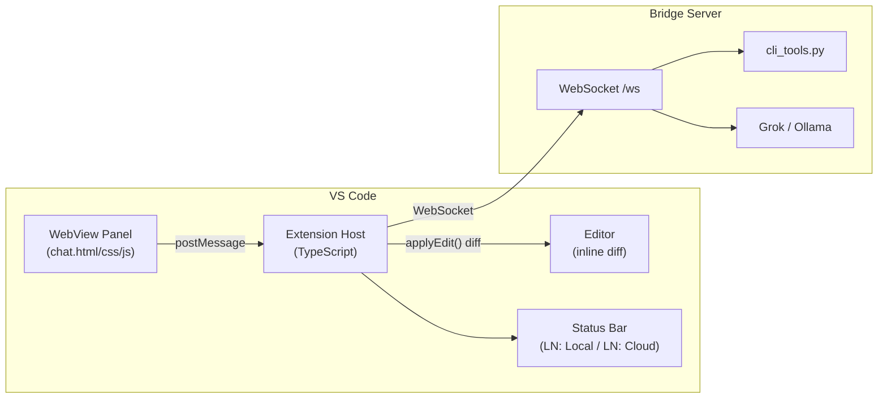

# Phase 6: VS Code Extension (.vsix)

## Architecture




## Directory Structure

All new files under `vscode-extension/` at the project root:

```
vscode-extension/
  package.json            # Extension manifest, commands, settings, keybindings
  tsconfig.json           # TypeScript strict config targeting ES2022
  esbuild.js              # esbuild bundler (single-file output for extension + webview)
  .vscodeignore           # Exclude src/, node_modules from .vsix
  src/
    extension.ts          # activate() / deactivate() entry point
    bridgeClient.ts       # WebSocket client: auto-detect, reconnect, auth
    chatPanel.ts          # WebView panel provider + message routing
    diffApplicator.ts     # Inline diff preview with Accept/Reject
    planManager.ts        # .sovereign/plans/ file lifecycle
    statusBar.ts          # "LN: Local" / "LN: Cloud" indicator + quick-pick
    auth.ts               # SecretStorage wrapper for bridge credentials
    types.ts              # Shared TypeScript interfaces for message protocol
    webview/
      chat.html           # WebView HTML (adapted from skyeye.html Command Terminal)
      chat.css            # CSS (extracted design tokens + CLI classes)
      chat.js             # JS (message handler, marked.js, diff2html, hljs)
```

## Key Design Decisions

### 1. Bridge Auto-Detection

`bridgeClient.ts` implements a three-tier connection strategy:

- Read `sovereignSanctuary.bridge` setting: `"auto"` (default), `"local"`, or `"cloud"`
- If `"auto"`: attempt `ws://localhost:8765/ws` with a 3-second timeout; on failure, fall back to `wss://api.sovereignsanctuary.net/ws`
- If `"local"` or `"cloud"`: connect directly to the specified endpoint
- `cli_type` (the `cli` field in messages) is derived from the active connection: `"mac"` for local, `"cloud"` for production
- Tool availability is already gated by the bridge (Phase 2/4 enforcement) -- the extension doesn't duplicate that logic

Settings schema in `package.json`:

```json
"sovereignSanctuary.bridge": {
  "type": "string",
  "enum": ["auto", "local", "cloud"],
  "default": "auto",
  "description": "Bridge connection mode. Enterprise deployments can lock to cloud-only."
},
"sovereignSanctuary.bridgeLocalUrl": {
  "type": "string",
  "default": "ws://localhost:8765/ws"
},
"sovereignSanctuary.bridgeCloudUrl": {
  "type": "string",
  "default": "wss://api.sovereignsanctuary.net/ws"
}
```

### 2. Authentication

`auth.ts` uses VS Code's `SecretStorage` API (encrypted, per-user):

- On first activation, prompt for username/password via `vscode.window.showInputBox`
- Send `login_request` over WebSocket; on `login_success`, store the returned `token` + `hardware_id` in SecretStorage
- On subsequent activations, reconnect with `auth` message using stored token
- On `auth_failed` / `login_failed`, clear stored credentials and re-prompt
- Exposes a `sovereignSanctuary.logout` command to clear stored credentials

### 3. WebView Panel (Chat UI)

`chatPanel.ts` creates a `vscode.WebviewPanel` in the editor area. The WebView reuses the same HTML/CSS/JS patterns from the Command Terminal in `skyeye.html`:

- **HTML**: Adapted from the `#tab-command-terminal` section -- strips the three-column layout down to a single-column chat-focused layout (mode selector + chat log + input). The previewer pane is removed because generated code goes to inline diffs in the editor instead.
- **CSS**: Same design tokens (`--void:#050510`, `--gold:#C9A962`, etc.), same `.msg-tool`, `.msg-nate`, `.msg-user`, `.hypothesis-card` classes. Font stack uses `'JetBrains Mono'` for code, `'DM Sans'` for body.
- **JS**: Same `_ideRenderToolCall`, `_ideRenderNateMessage`, `_ideShowToolLoading` functions. `marked.js`, `highlight.js`, and `diff2html` are bundled as local assets (not CDN) to comply with VS Code's CSP.
- **Libraries**: `marked`, `highlight.js`, and `diff2html` are npm dependencies bundled into the webview JS. VS Code WebViews require `Content-Security-Policy` meta tags and `nonce` attributes -- CDN scripts are blocked.

Communication between WebView and Extension Host:

```
WebView                          Extension Host
  |                                    |
  |-- postMessage({cmd:"send",        |
  |     mode, message, context})  -->  |
  |                                    |-- ws.send(nate_cli_chat)
  |                                    |
  |                              <--   |-- onMessage(nate_cli_chat_chunk)
  |<-- postMessage({cmd:"chunk",       |
  |     delta, provider, turn})        |
  |                                    |
  |                              <--   |-- onMessage(nate_cli_chat_output)
  |                                    |-- diffApplicator.showDiff(content, targetFile)
  |<-- postMessage({cmd:"output_applied"}) |
```

### 4. Inline Diff for Generated Code (diffApplicator.ts)

When the bridge sends `nate_cli_chat_output`, the extension host:

1. Resolves the `target_file` path relative to `vscode.workspace.workspaceFolders[0]`
2. Opens the file with `vscode.window.showTextDocument(fileUri)`
3. Creates a `WorkspaceEdit` with the proposed changes
4. Shows the diff using VS Code's built-in diff editor (`vscode.commands.executeCommand('vscode.diff', originalUri, proposedUri, 'Nate: Proposed Changes')`)
5. Adds Accept/Reject buttons via a custom editor decoration or an information message:
  - **Accept**: applies the `WorkspaceEdit` via `vscode.workspace.applyEdit(edit)`
  - **Reject**: closes the diff tab, no changes made

For new files (no existing `target_file`), the extension creates the file content in a virtual document and shows it in a new editor tab with an "Accept" action that writes to disk.

### 5. Plan Manager (planManager.ts)

Plans are written to `.sovereign/plans/` in the workspace root:

- On `nate_cli_chat_done` with `mode: "plan"`, extract the plan content from the streamed response
- Write to `.sovereign/plans/{plan_id}.md` using `vscode.workspace.fs.writeFile`
- The plan frontmatter (plan_id, mode, status, files) is preserved
- A `sovereignSanctuary.openPlan` command opens the plan file in the editor
- A TreeView provider (`SovereignPlansProvider`) shows plans in the Explorer sidebar under a "Sovereign Plans" section

### 6. Status Bar (statusBar.ts)

- Creates a `StatusBarItem` at `StatusBarAlignment.Left` priority 100
- Displays `$(zap) LN: Local` (green) or `$(cloud) LN: Cloud` (blue) based on active connection
- Displays `$(alert) LN: Disconnected` (red) when not connected
- Click opens a QuickPick with options: "Switch to Local", "Switch to Cloud", "Auto-detect", "Logout"
- The mode (ASK/PLAN/DEBUG/LN-FAB) is shown as a second status bar item that opens a QuickPick to switch modes

### 7. Context Injection from VS Code

The extension enriches `nate_cli_chat` messages with VS Code context that the dashboard doesn't have:

```typescript
const context = {
  active_file: vscode.window.activeTextEditor?.document.uri.fsPath,
  selection: vscode.window.activeTextEditor?.selection,
  visible_files: vscode.window.visibleTextEditors.map(e => e.document.uri.fsPath),
  diagnostics: vscode.languages.getDiagnostics(activeUri).map(d => ({
    message: d.message, severity: d.severity, range: d.range
  })),
  workspace_root: vscode.workspace.workspaceFolders?.[0]?.uri.fsPath,
};
```

This gives the LLM awareness of what file the user is looking at, their selection, and any active linter errors -- richer context than the dashboard provides.

### 8. File Navigation from Tool Calls

When `nate_cli_chat_tool` arrives with `tool_name: "read_file"`, the extension offers a clickable link in the WebView. Clicking it sends a `postMessage` to the extension host, which calls:

```typescript
const uri = vscode.Uri.file(path.join(workspaceRoot, toolInput.path));
const line = toolInput.start_line ? toolInput.start_line - 1 : 0;
vscode.window.showTextDocument(uri, {
  selection: new vscode.Range(line, 0, line, 0),
  preview: true
});
```

### 9. Keybindings and Commands


| Command                                | Keybinding                     | Description                                    |
| -------------------------------------- | ------------------------------ | ---------------------------------------------- |
| `sovereignSanctuary.openChat`          | `Ctrl+Shift+N` / `Cmd+Shift+N` | Open/focus the chat panel                      |
| `sovereignSanctuary.askAboutSelection` | `Ctrl+Shift+A` / `Cmd+Shift+A` | Send selected code to ASK mode                 |
| `sovereignSanctuary.debugSelection`    | `Ctrl+Shift+D` / `Cmd+Shift+D` | Send selected code + diagnostics to DEBUG mode |
| `sovereignSanctuary.switchMode`        | (none)                         | QuickPick mode selector                        |
| `sovereignSanctuary.switchBridge`      | (none)                         | QuickPick bridge selector                      |
| `sovereignSanctuary.logout`            | (none)                         | Clear stored credentials                       |
| `sovereignSanctuary.openPlan`          | (none)                         | Open a plan from .sovereign/plans/             |
| `sovereignSanctuary.markFixed`         | (none)                         | Mark current debug session as fixed            |


### 10. Packaging and Distribution

- Build with `esbuild` (fast, single-file output): `node esbuild.js --production`
- Package with `vsce package` into `sovereign-sanctuary-X.Y.Z.vsix`
- The `.vsix` can be installed via `code --install-extension sovereign-sanctuary-X.Y.Z.vsix`
- Enterprise distribution: host the `.vsix` on R2 or a private extension registry
- `.vscodeignore` excludes `src/`, `node_modules/`, `*.ts` from the package (only bundled JS ships)

## What Does NOT Change

- **Bridge server**: No changes to `bridge_server.py`. The extension is a new frontend for the same WebSocket protocol.
- **cli_tools.py**: No changes. Tool gating (mac/cloud, admin/non-admin) is already enforced server-side.
- **Existing dashboard**: `skyeye.html` Command Terminal continues to work unchanged.

## Build Dependencies (npm)

```json
{
  "devDependencies": {
    "@types/vscode": "^1.85.0",
    "@vscode/vsce": "^2.22.0",
    "esbuild": "^0.20.0",
    "typescript": "^5.3.0"
  },
  "dependencies": {
    "ws": "^8.16.0",
    "marked": "^12.0.0",
    "highlight.js": "^11.9.0",
    "diff2html": "^3.4.0"
  }
}
```

