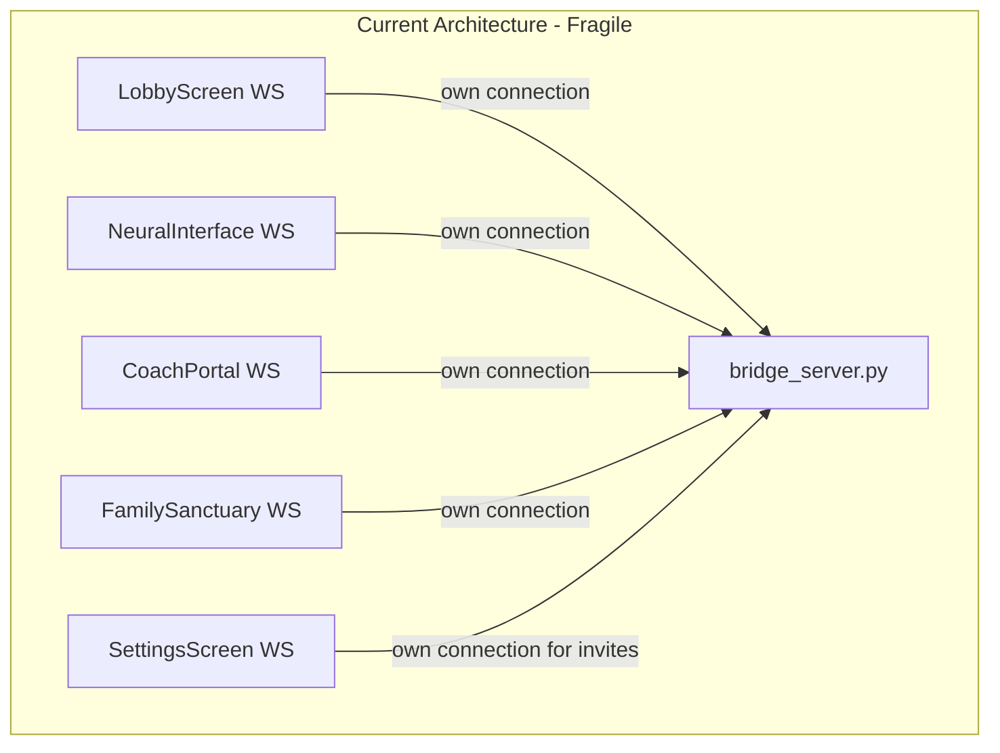
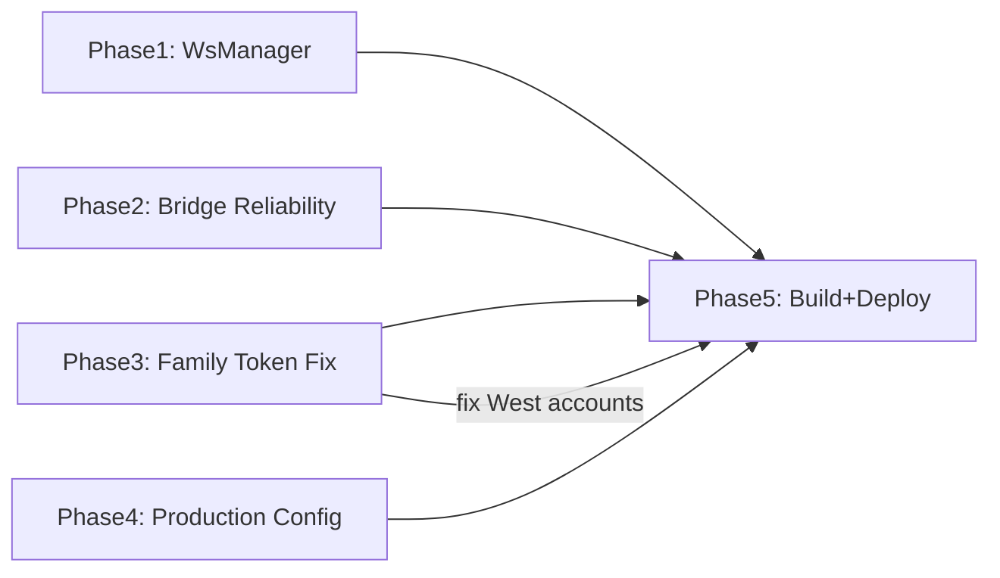

# Production WebSocket Reliability + Family Token Pipeline Fix

## Current State (Audit Findings)

The audit reveals **no centralized connection management** -- each Flutter screen creates its own `WebSocketChannel` with different reconnection logic, no heartbeats, no message ACKs, and no session recovery. Family tokens are per-user (not pooled), invites are stored in volatile JSON (not PostgreSQL), and token balance changes are never pushed to clients.




**Critical gaps identified:**

- No heartbeat (only 1 partial ping found in Family Sanctuary)
- No message ACKs (fire-and-forget)
- No message queuing (lost on disconnect)
- No session recovery (clients restart from scratch on reconnect)
- Token balance never pushed to clients after changes
- Family invites stored in `registry["_family_invites"]` (volatile JSON, not PostgreSQL)
- Token balances per-user, not family-pooled -- HoH pays but members show 0

---

## Phase 1: Shared WebSocket Manager (Flutter)

**Problem**: 5+ separate WebSocket connection implementations with different backoff, no heartbeat, no ACKs.

**Solution**: Create `mobile/lib/services/ws_manager.dart` -- a singleton WebSocket manager used by all screens.

**Key features:**

- Ping/pong heartbeat every 30s, close if no pong in 10s
- Exponential backoff with jitter: `min(1s * 2^attempt + random(0, 1s), 32s)`, max 5 attempts
- Message queue for unACKed messages, resend on reconnect
- Session recovery token stored locally, sent on reconnect
- Connection state stream for all UI screens to observe

**Backoff schedule:**

- Attempt 1: 1s +/- 0.5s
- Attempt 2: 2s +/- 1s
- Attempt 3: 4s +/- 2s
- Attempt 4: 8s +/- 4s
- Attempt 5: 16s +/- 8s
- After 5 failures: show "Pull to retry" UI, then exponential decay (32s, 64s...)

**Message ACK pattern:**

- Every critical message gets a `msg_id` (UUID)
- Client stores unACKed messages in local queue
- Server responds with `{"type": "ack", "msg_id": "..."}`
- On reconnect, client resends unACKed queue
- ACK timeout: 10s per message, then retry

**Files to modify:**

- Create: `mobile/lib/services/ws_manager.dart` (new singleton)
- Modify: `mobile/lib/main.dart` -- replace all `WebSocketChannel.connect()` calls with `WsManager.instance`
- Modify: `mobile/lib/screens/settings_screen.dart` -- use shared manager for invites
- Modify: `mobile/lib/updated_screens.dart` -- use shared manager
- Modify: `mobile/lib/screens/coach_portal_v2_complete.dart` -- use shared manager

---

## Phase 2: Server-Side Reliability (Bridge)

**Problem**: Bridge has `ping_interval=20` but no pong tracking, no ACKs, no session recovery, stale cleanup every 60s.

**Solution**: Enhance `bridge_server.py` with:

**2a. Pong tracking + fast stale detection**

- Track last pong per connection in `connected_clients`
- Reduce stale cleanup from 60s to 15s
- Disconnect if no pong after 2 missed pings (40s)

**2b. Message ACK system**

- Server sends `{"type": "ack", "msg_id": "..."}` for every critical client message
- Critical message types: `login_request`, `generate_family_invite_tokens_batch`, `accept_family_invite`, `create_dependent_account`, token operations
- Server adds `msg_id` to its own responses so client can correlate

**2c. Session recovery via Redis**

- On auth success, generate a `recovery_token` stored in Redis (TTL 5 min)
- Key: `nate:{env}:session:{recovery_token}` -> `{hardware_id, username, role, last_msg_seq}`
- On reconnect, client sends `{"type": "session_recover", "recovery_token": "..."}`
- Server restores auth state without re-login, sends missed messages from buffer
- Message buffer: last 50 messages per session stored in Redis list

**Files to modify:**

- `backend/app/websocket/bridge_server.py` -- add ACK system, recovery tokens, pong tracking
- Bridge startup in `main()` -- initialize Redis session store

---

## Phase 3: Family Token Pipeline Fix

**Problem**: Bill West (HoH) and Lisa West (spouse, merged) have persistent token issues. Kate can't be invited. Token balances don't sync.

**3a. Fix family invite persistence (move to PostgreSQL)**

Currently `_family_invites` lives in volatile JSON. Move to a `family_invites` table:

```sql
CREATE TABLE IF NOT EXISTS family_invites (
    id SERIAL PRIMARY KEY,
    token VARCHAR(12) UNIQUE NOT NULL,
    family_id VARCHAR(255) NOT NULL,
    invited_by VARCHAR(255) NOT NULL,
    inviter_name VARCHAR(255),
    invitee_name VARCHAR(255),
    invitee_contact VARCHAR(255),
    role VARCHAR(20) DEFAULT 'CHILD',
    expires_at TIMESTAMPTZ NOT NULL,
    accepted_at TIMESTAMPTZ,
    accepted_by VARCHAR(255),
    created_at TIMESTAMPTZ DEFAULT NOW()
);
```

- `generate_family_invite_tokens_batch` writes to this table instead of JSON
- `lookup_family_invite` and `accept_family_invite` query this table
- Invites survive bridge restarts

**3b. Fix token balance push mechanism**

After any `use_tokens()` or `add_token_usage()` call, push balance update to all connected family members:

```python
async def _push_token_update(self, hoh_id, new_balance):
    family_members = [hw for hw, info in connected_clients.items()
                      if info.get("head_of_household_id") == hoh_id or hw == hoh_id]
    for hw_id in family_members:
        ws = connected_clients.get(hw_id, {}).get("ws")
        if ws:
            await ws.send(json.dumps({
                "type": "token_balance_update",
                "token_balance": new_balance,
                "hoh_balance": new_balance
            }))
```

**3c. Fix family member token visibility**

Family members currently show their own `token_balance` (often 0 or 5000 initial). They should see the HoH's balance since HoH pays for all family usage.

- Add `hoh_token_balance` to login_success response for family members
- Settings screen displays: "Family Token Balance: X tokens (via HoH)"
- Token Lab shows family-pooled view alongside individual

**3d. Fix Bill/Lisa West specifically**

Query and fix their account data:

- Verify `family_id` matches on both accounts
- Verify `head_of_household_id` is set correctly on Lisa's profile
- Verify Lisa's `family_role` is `SPOUSE`
- Check if Bill's `family_id` auto-creation happened correctly during merge
- Sync token balances to PostgreSQL if stale

**Files to modify:**

- `backend/app/websocket/bridge_server.py` -- invite persistence, token push, family balance visibility
- `backend/app/websocket/user_store.py` -- family invite table operations
- `mobile/lib/screens/settings_screen.dart` -- show HoH balance for family members
- `mobile/lib/main.dart` -- handle `token_balance_update` message type
- New migration: `backend/migrations/080_family_invites.sql`

---

## Phase 4: Production Checklist (99.9% Uptime)


| Layer         | Current                       | Target                                                             |
| ------------- | ----------------------------- | ------------------------------------------------------------------ |
| Network       | WSS + valid certs             | WSS + TCP keepalive + valid certs                                  |
| Load Balancer | nginx 7d timeout, no sticky   | Sticky sessions via `$hardware_id` cookie, 2min+ timeouts          |
| Client        | No heartbeat, mixed backoff   | Heartbeat 30s, standardized backoff 1-32s with jitter              |
| Server        | ping_interval=20, 60s cleanup | Pong tracking, 15s cleanup, connection limit per user              |
| Recovery      | None                          | Redis session tokens (TTL 5min), message buffer (50 msgs)          |
| Monitoring    | None                          | Connection count metrics, latency tracking, dead connection alerts |


**nginx sticky session config** (add to `/ws` location):

```nginx
upstream bridge_servers {
    ip_hash;  # Sticky sessions by client IP
    server bridge:8765;
}
```

**Redis pub/sub for horizontal scale** (future):

- When multiple bridge instances exist, use Redis pub/sub to broadcast messages across instances
- Not needed now (single bridge) but architecture should not preclude it

---

## Phase 5: Flutter Build + Deploy

After all changes:

1. `flutter build web --release` -- verify 0 errors
2. Deploy bridge changes via `scp` + `docker restart nate_bridge`
3. Apply migration 080
4. Deploy Flutter web build (no `--delete`)
5. Run build-deploy-ux-verification checks
6. Test family invite flow with Bill West account
7. Verify token balance push on AI chat usage

---

## Implementation Order

The phases build on each other but can be partially parallelized:




Phase 3 is the most urgent (fixes the active user issue). Phases 1+2 are the reliability foundation. Phase 4 is configuration hardening.