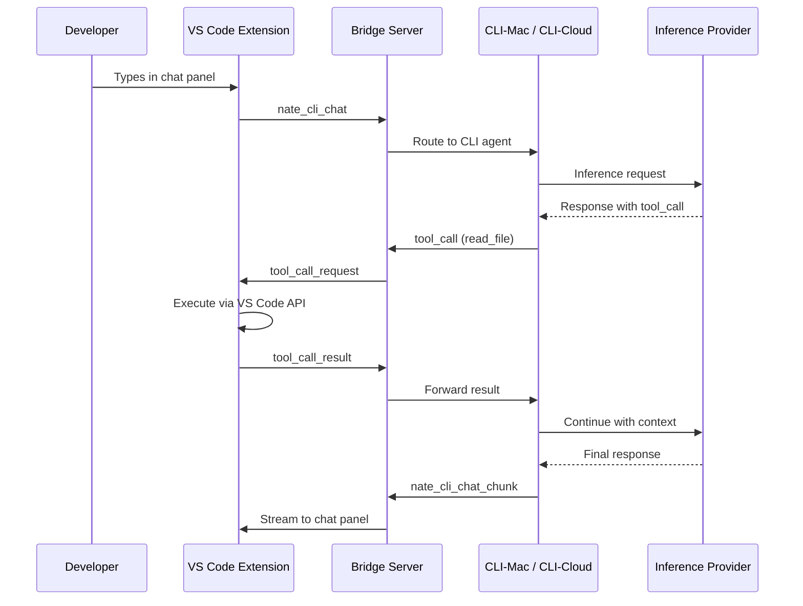

# Workspace Inversion Architecture Build

7 phases, ~690 lines new code, 1 new file + 4 modified. Phase 8 (R2 source-of-truth) deferred.

## Build Order (Dependency Chain)

```
Phase 5 (Types) --> Phase 1 (WorkspaceToolProvider) --> Phase 6 (Extension Wiring)
                                                             |
                                                             v
                                                        Phase 2 (Bridge Routing)
                                                             |
                                                             v
                                                        Phase 3 (CLI Abstraction)
                                                             |
                                                             v
                                                        Phase 4 (Events)
                                                             |
                                                             v
                                                        Phase 7 (Crystallization)
```

## Architecture




## Fallback Behavior Matrix

- **Developer in VS Code with extension**: Full inversion -- both CLIs see editor state via VS Code workspace API
- **Terminal-only CLI-Mac (no VS Code)**: Identical to current behavior -- local filesystem
- **SSH into VPS (CLI-Cloud)**: Identical to current behavior -- server filesystem
- **VS Code disconnects mid-session**: Graceful fallback to local -- pending requests fail, CLI resumes locally
- **VS Code reconnects after disconnect**: Extension re-registers, tool calls route to workspace again

---

## Phase 5: Type Definitions [BUILD FIRST]

**File:** [vscode-extension/src/types.ts](vscode-extension/src/types.ts)
**Action:** MODIFY -- add new interfaces to existing file
**Lines:** ~60

Define all message interfaces before writing any handlers. This gives compile-time safety across Phases 1 and 6.

### Outbound interfaces (Extension -> Bridge):

```typescript
export interface OutboundWorkspaceRegister {
  type: 'workspace_provider_register';
  provider_id: string;
  workspace_root: string;
  capabilities: string[];
  vscode_version: string;
  extension_version: string;
}

export type ToolCallErrorCode =
  | 'FILE_NOT_FOUND'
  | 'BINARY_FILE'
  | 'PATH_TRAVERSAL'
  | 'PERMISSION_DENIED'
  | 'TIMEOUT'
  | 'CANCELLED'
  | 'WORKSPACE_DISCONNECTED'
  | 'USER_REJECTED'
  | 'UNKNOWN';

export interface OutboundToolCallResult {
  type: 'tool_call_result';
  request_id: string;
  tool: string;
  success: boolean;
  content?: string;
  error?: string;
  error_code?: ToolCallErrorCode;
  metadata?: Record<string, unknown>;
  duration_ms: number;
  action?: 'accepted' | 'rejected' | 'cancelled';
}

export interface OutboundToolCallAck {
  type: 'tool_call_ack';
  request_id: string;
}

export interface OutboundWorkspaceProviderReplaced {
  type: 'workspace_provider_replaced';
  reason: 'superseded_by_new_registration';
}

export interface OutboundWorkspaceEvent {
  type: 'workspace_event';
  event_type: 'file_saved' | 'file_created' | 'file_deleted' |
              'diagnostic_change' | 'active_editor_change';
  file?: string;
  language?: string;
  errors?: Array<{ message: string; line: number; severity: string }>;
}
```

### Inbound interfaces (Bridge -> Extension):

```typescript
export interface InboundToolCallRequest {
  type: 'tool_call_request';
  request_id: string;
  tool: string;
  params: Record<string, unknown>;
  requesting_cli: string;
}

export interface InboundWorkspaceRegistered {
  type: 'workspace_provider_registered';
  status: 'active';
}

export interface InboundToolCallCancel {
  type: 'tool_call_cancel';
  request_id: string;
  reason?: string;
}
```

### Also add:

- `ToolCallErrorCode` type: union of 9 structured error codes (defined above with `OutboundToolCallResult`)
- `WorkspaceToolName` type: union of all 12 tool name strings
- Update `OutboundMessage` union to include all new outbound interfaces, including `workspace_provider_replaced`
- Update `InboundMessage` union to include all new inbound interfaces, including `tool_call_cancel`
- Verify existing `VsCodeContext` interface has `workspace_root`, `active_file`, `diagnostics`

### Bridge -> CLI notification (for session continuity):

```typescript
export interface InboundWorkspaceProviderAvailable {
  type: 'workspace_provider_available';
  workspace_root: string;
  capabilities: string[];
}
```

This is sent by the bridge to all connected CLI websockets when a workspace provider registers or re-registers. It tells CLIs that workspace routing is restored so they flip back from local fallback without needing a session restart.

---

## Phase 1: WorkspaceToolProvider [CORE BUILD]

**File:** `vscode-extension/src/workspaceToolProvider.ts`
**Action:** CREATE
**Lines:** ~420

### Existing code to leverage:

- [vscode-extension/src/bridgeClient.ts](vscode-extension/src/bridgeClient.ts) -- `BridgeClient.send()` for outbound messages, `handleMessage()` switch for inbound routing
- [vscode-extension/src/diffApplicator.ts](vscode-extension/src/diffApplicator.ts) -- already implements accept/reject diff UX with `ProposedContentProvider` (reuse for `proposed_edit`)
- [vscode-extension/src/types.ts](vscode-extension/src/types.ts) -- `VsCodeContext` has `workspace_root`, `active_file`, `diagnostics`

### Class structure:

```typescript
class WorkspaceToolProvider implements vscode.Disposable {
  private bridge: BridgeClient;
  private diffApplicator: DiffApplicator;
  private workspaceRoot: vscode.Uri;
  private disposables: vscode.Disposable[] = [];

  constructor(bridge: BridgeClient, diffApplicator: DiffApplicator) {
    this.bridge = bridge;
    this.diffApplicator = diffApplicator;
    this.workspaceRoot = vscode.workspace.workspaceFolders![0].uri;
    this.bridge.on("tool_call_request", this.handleToolCall.bind(this));
    this.bridge.on("login_success", this.register.bind(this));
  }
}
```

Registration fires on `login_success` (after auth), sends `workspace_provider_register` with capabilities array and workspace root path.

### Phase 1 scope note: `proposed_edit` is single-file only

- `proposed_edit` handles exactly one file per tool call in Phase 1
- If PLAN mode needs to touch 4 files, it sends 4 sequential `proposed_edit` calls
- Batch review / multi-file summary UI is explicitly deferred to a later phase
- This matches the current design of [vscode-extension/src/diffApplicator.ts](vscode-extension/src/diffApplicator.ts), which is already single-file oriented

### Tool dispatch with ack and cancellation for proposed_edit:

```typescript
private async handleToolCall(msg: InboundToolCallRequest): Promise<void> {
  const start = Date.now();
  try {
    if (msg.tool === "proposed_edit") {
      this.bridge.send({ type: "tool_call_ack", request_id: msg.request_id });
    }
    const result = await this.dispatch(msg.tool, msg.params);
    this.bridge.send({
      type: "tool_call_result",
      request_id: msg.request_id,
      tool: msg.tool,
      ...result,
      duration_ms: Date.now() - start,
    });
  } catch (err) {
    this.bridge.send({
      type: "tool_call_result",
      request_id: msg.request_id,
      tool: msg.tool,
      success: false,
      error: String(err),
      error_code: this.classifyError(err, msg.tool),
      duration_ms: Date.now() - start,
    });
  }
}

private classifyError(err: unknown, tool: string): ToolCallErrorCode {
  const msg = String(err);
  if (msg.includes('FileNotFound') || msg.includes('ENOENT'))       return 'FILE_NOT_FOUND';
  if (msg.includes('NoPermissions') || msg.includes('EACCES'))      return 'PERMISSION_DENIED';
  if (msg.includes('outside workspace') || msg.includes('traversal')) return 'PATH_TRAVERSAL';
  return 'UNKNOWN';
}
```

Each handler also sets `error_code` explicitly for known failure modes:

- `handleReadFile()` -> `FILE_NOT_FOUND` if uri doesn't exist, `BINARY_FILE` if detected non-text
- `handleProposedEdit()` -> `USER_REJECTED` if developer clicks reject, `CANCELLED` if tool_call_cancel received
- `handleWriteFile()` / `handleCreateFile()` -> `PERMISSION_DENIED` if user declines confirmation dialog
- `handleRunCommand()` -> `TIMEOUT` if shell command exceeds limit
- Bridge timeout path -> `TIMEOUT`; workspace disconnection mid-call -> `WORKSPACE_DISCONNECTED`

This lets the CLI agent make intelligent retry decisions without parsing error strings:

- `FILE_NOT_FOUND` -> try `list_directory` to find correct path
- `USER_REJECTED` on `proposed_edit` -> don't retry same edit
- `WORKSPACE_DISCONNECTED` -> fall back to local
- `BINARY_FILE` -> skip file, report to user
- `CANCELLED` -> stop processing, user aborted the turn

```

Add a `tool_call_cancel` listener. If a pending `proposed_edit` is cancelled, close the open diff UI if present, clear local pending state, and return `action: 'cancelled'`.

### 12 tool handlers by priority:

**P0 -- Core (must work for minimum viable agent):**

- `handleReadFile()` -- `workspace.fs.readFile(uri)`, numbered lines, max 200 lines, metadata (path, size, language, line count), truncated flag if exceeds 200
- `handleListDirectory()` -- `workspace.fs.readDirectory(uri)`, sorted entries, optional glob filter
- `handleSearchCode()` -- **Gap 2 fix**: Use `vscode.workspace.findTextInFiles()` (async, indexed, respects `.gitignore`), NOT line-by-line scan. Return file path, line number, match content, 2 lines surrounding context. Cap at maxResults (default 20).
- `handleProposedEdit()` -- **Gap 5 fix**: Send `tool_call_ack` immediately. Delegate to existing `DiffApplicator`. Developer reviews with no timeout. Return `action: 'accepted' | 'rejected' | 'cancelled'`. Bridge timeout: 5s for ack, 300s for final result. Single-file only in Phase 1.

**P1 -- Extended read/write:**

- `handleReadDiagnostics()` -- `vscode.languages.getDiagnostics(uri)`, return severity/message/range
- `handleReadGitStatus()` -- `vscode.extensions.getExtension('vscode.git')` API, modified/staged/untracked lists
- `handleWriteFile()` -- **Gap 3**: Confirmation dialog ("Nate wants to write to X"), then `workspace.fs.writeFile()`. Return written path and byte count.
- `handleCreateFile()` -- **Gap 3**: Confirmation dialog, create parent dirs first via `workspace.fs.createDirectory()`, then write

**P2 -- Full agent parity:**

- `handleDeleteFile()` -- **Gap 8**: Confirmation always required, `workspace.fs.delete(uri)`
- `handleRenameFile()` -- **Gap 8**: Confirmation dialog, `workspace.fs.rename(oldUri, newUri)`
- `handleRunCommand()` -- **Gap 4**: Create VS Code terminal via `window.createTerminal()`, send command, capture output via `Terminal.shellIntegration`. Confirm destructive commands (contains `rm`, `delete`, `drop`, `--force`). Return stdout, stderr, exit code.
- `handleReadOpenEditors()` -- **Gap 9**: Return `window.tabGroups.all` mapped to file paths, language IDs, active/dirty status

---

## Phase 6: Extension Wiring [INTEGRATION]

**Files:** [vscode-extension/src/extension.ts](vscode-extension/src/extension.ts) + [vscode-extension/src/bridgeClient.ts](vscode-extension/src/bridgeClient.ts)
**Action:** MODIFY
**Lines:** ~33 total

### extension.ts changes:

```typescript
import { WorkspaceToolProvider } from './workspaceToolProvider';
let workspaceProvider: WorkspaceToolProvider;

export function activate(context: vscode.ExtensionContext): void {
  // ... existing bridge, auth, statusBar, diffApplicator, planManager, chatPanel ...
  workspaceProvider = new WorkspaceToolProvider(bridge, diffApplicator);
  context.subscriptions.push(workspaceProvider);
  // ... rest unchanged ...
}
```

### bridgeClient.ts changes:

Add to `handleMessage()` switch (currently at line 145):

```typescript
case 'tool_call_request':
  this.emit('tool_call_request', msg as InboundToolCallRequest);
  break;
case 'workspace_provider_registered':
  this.emit('workspace_registered', msg);
  break;
case 'tool_call_cancel':
  this.emit('tool_call_cancel', msg as InboundToolCallCancel);
  break;
```

Update `send()` type signature to accept new outbound message types from the union.

---

## Phase 2: Bridge Routing Layer [CORE BUILD]

**File:** [backend/app/websocket/bridge_server.py](backend/app/websocket/bridge_server.py)
**Action:** MODIFY
**Lines:** ~150

### New global state (add near existing `connected_clients`/`connected_coaches` around line 2060):

```python
workspace_provider: Optional[WebSocketServerProtocol] = None
workspace_capabilities: set = set()
workspace_pending_requests: Dict[str, asyncio.Future] = {}
workspace_pending_acks: Dict[str, float] = {}
workspace_request_created: Dict[str, float] = {}  # request_id -> creation time (for TTL)
WORKSPACE_TOOLS = {
    "read_file", "search_code", "list_directory",
    "read_diagnostics", "read_git_status", "proposed_edit",
    "read_terminal_output", "write_file", "create_file",
    "delete_file", "rename_file", "run_command", "read_open_editors"
}
```

### Provider arbitration rule

- **Last registration replaces prior provider**
- If a second VS Code window registers as `workspace_provider`, the new websocket becomes authoritative
- The old provider receives `workspace_provider_replaced` with `reason: 'superseded_by_new_registration'`
- The bridge logs the replacement and the old extension stops handling tool calls
- This prevents two extensions from racing to answer the same `tool_call_request`

### 6 new message handlers (add to `if/elif` chain):

- `workspace_provider_register` -- **Gap 7 fix**: Validate connection authenticated as ADMIN role. If an existing provider is present and different, send it `workspace_provider_replaced`, then replace it. Store websocket ref, set capabilities, respond with `workspace_provider_registered`. **Session continuity**: After successful registration, broadcast `workspace_provider_available` (with `workspace_root` and `capabilities`) to all connected CLI websockets so they restore workspace routing mid-session.
- `tool_call_result` -- Pop from `workspace_pending_requests`, resolve `asyncio.Future`, log to `cli_tool_calls` with `provider: "vscode_workspace"`. Propagate `error_code` from the result dict through to the CLI.
- `tool_call_ack` -- Record ack timestamp in `workspace_pending_acks`, extend timeout for `proposed_edit` to 300s.
- `tool_call_cancel` -- Cancel a pending request. If the request is still outstanding, forward `tool_call_cancel` to the workspace provider, clear bridge pending state, and resolve the waiting CLI path with `action: 'cancelled'`.
- `workspace_provider_replaced` -- outbound bridge->extension notification only; no inbound handler needed on bridge.
- `workspace_event` -- Validate sender is registered workspace provider. Forward to all connected CLI websockets.

### Core routing function:

```python
async def route_tool_call(tool_call: dict, requesting_ws) -> dict:
    tool_name = tool_call.get("tool")
    request_id = tool_call.get("request_id", str(uuid.uuid4()))

    if (workspace_provider is not None
            and tool_name in WORKSPACE_TOOLS
            and tool_name in workspace_capabilities):
        future = asyncio.get_event_loop().create_future()
        workspace_pending_requests[request_id] = future
        workspace_request_created[request_id] = time.time()
        await workspace_provider.send(json.dumps({
            "type": "tool_call_request",
            "request_id": request_id,
            "tool": tool_name,
            "params": tool_call.get("params", {}),
        }))
        try:
            timeout = 300 if tool_name == "proposed_edit" else 30
            result = await asyncio.wait_for(future, timeout=timeout)
            workspace_request_created.pop(request_id, None)
            return result
        except asyncio.TimeoutError:
            workspace_pending_requests.pop(request_id, None)
            workspace_request_created.pop(request_id, None)
            return {"type": "tool_result", "request_id": request_id,
                    "fallback": True, "reason": "workspace_timeout",
                    "error_code": "TIMEOUT"}
    return {"type": "tool_result", "request_id": request_id,
            "fallback": True, "reason": "no_workspace_provider",
            "error_code": "WORKSPACE_DISCONNECTED"}
```

### Gap 1 fix: TTL cleanup background task

Add a background task started via `asyncio.create_task()` in `main()`. Runs every 60 seconds. Sweeps `workspace_pending_requests` for futures where `time.time() - workspace_request_created[rid] > 300`. Resolves stale futures with `{"fallback": True, "reason": "stale_request_cleaned"}`.

### Disconnection cleanup (add to `finally` block, around line 28024):

```python
if websocket == workspace_provider:
    workspace_provider = None
    workspace_capabilities = set()
    for rid, future in workspace_pending_requests.items():
        if not future.done():
            future.set_result({"type": "tool_result", "request_id": rid,
                               "fallback": True, "reason": "workspace_disconnected",
                               "error_code": "WORKSPACE_DISCONNECTED"})
    workspace_pending_requests.clear()
    workspace_request_created.clear()
    print(">>> [WORKSPACE] VS Code disconnected -- falling back to local")
```

### `_SENTINEL_SKIP` update:

Add `"workspace_provider_register"`, `"workspace_provider_replaced"`, `"workspace_provider_available"`, `"tool_call_result"`, `"tool_call_ack"`, `"tool_call_cancel"`, `"workspace_event"` to the skip set. These are read-only/workspace messages and must not accumulate Sentinel anomaly points.

---

## Phase 3: CLI Tool Execution Abstraction

**File:** [backend/app/websocket/cli_tools.py](backend/app/websocket/cli_tools.py)
**Action:** MODIFY
**Lines:** ~30

### Change `execute_tool()` to route through bridge first:

- Current flow (line 661+): `execute_tool()` dispatches directly to `_read_file_sync()`, `_search_code_sync()`, etc. via `_TOOL_DISPATCH`
- New flow: `execute_tool()` receives an optional `workspace_router` callable. If provided and tool is in `WORKSPACE_TOOLS`, call `await workspace_router(tool_call)` first. If result has `fallback=True`, fall through to existing local dispatch.
- Pass `route_tool_call` from `bridge_server.py` into `execute_tool()` via the `nate_cli_chat` handler (around line 27596).

### Session continuity on reconnect:

When the bridge broadcasts `workspace_provider_available` to CLI websockets (triggered by VS Code registering/re-registering), the CLI handler must listen for this message and flip an internal flag (`workspace_available = True`). This restores workspace routing for the next tool call without requiring a session restart. Without this, a CLI that fell back to local stays on local for the remainder of the session even after VS Code comes back.

```python
# In nate_cli_chat handler, add to message dispatch:
elif msg_type == "workspace_provider_available":
    workspace_available = True
    print(f">>> [CLI] Workspace provider restored: {data.get('workspace_root')}")
```

### Backward compatibility:

- If `workspace_router` is `None` (no VS Code), every tool executes locally -- identical to current behavior
- CLI-Cloud on the VPS (SSH) still works exactly as before
- CLI-Mac in terminal without VS Code still works exactly as before
- Zero changes to tool definitions, timeouts, or security (path traversal, binary filters)
- `workspace_provider_available` messages are ignored if CLI has no `workspace_router` configured

---

## Phase 4: Workspace Events [ENHANCEMENT]

**File:** `vscode-extension/src/workspaceToolProvider.ts` (addition to Phase 1 class)
**Lines:** ~80

### 5 event subscriptions (add to constructor, push to `this.disposables`):

- `vscode.workspace.onDidSaveTextDocument` -> push `file_saved` with file path and languageId
- `vscode.workspace.onDidCreateFiles` -> push `file_created` with file path
- `vscode.workspace.onDidDeleteFiles` -> push `file_deleted` with file path
- `vscode.languages.onDidChangeDiagnostics` -> push `diagnostic_change` with file path, error messages, line numbers (errors only, severity === 0)
- `vscode.window.onDidChangeActiveTextEditor` -> push `active_editor_change` with file path and language

### Gap 6 fix: Event queue semantics

- **Bridge side**: Forward `workspace_event` messages to all connected CLI websockets
- **CLI side**: Buffer events in a list, max 50 (oldest dropped on overflow)
- **Consumption**: Events are drained at the start of each `nate_cli_chat` handler turn in `bridge_server.py`. The bridge injects relevant context into the CLI's next inference call (e.g., "The developer just saved backend/app/routers/sessions.py")
- **Not during inference**: Events do NOT interrupt a CLI mid-inference. They wait for the next turn boundary.

---

## Phase 7: Crystallization Integration [METADATA]

**Files:** No new files -- metadata enrichment on existing logging
**Lines:** ~0 (field additions to existing log calls)

The existing crystallization loop in `bridge_server.py` already captures tool call results via `cli_tool_calls`. The workspace inversion enriches this with provenance metadata:

- `provider: "vscode_workspace"` -- distinguish workspace-routed calls from local execution
- `workspace_root: "/Users/nathannevedal/Desktop/Clinical-Sovereignty-Lab-2"` -- crystal provenance
- `workspace_verified: true` -- flag on TENSION crystals that included workspace tool calls
- `never_decay: true` -- already set for coding domain crystals, confirmed for workspace crystals

---

## Phase 8: Cloudflare R2 Source-of-Truth [DEFERRED]

Build after Phases 1-7 are stable. Piggybacks on Phase 4 `file_saved` events to push file contents to R2. Adds R2 as Priority 2 in `route_tool_call()` between live VS Code and local fallback. Enables 24/7 CLI access to workspace state when laptop is off.

### Deferred scope:

- **WorkspaceCache Durable Object** -- holds last-saved content of every workspace file
- **File tree index in KV** -- directory structure for `list_directory` without round trip
- **Source code archive in R2** -- full workspace as canonical repository (10 GB free tier)
- **Reconciliation sync** -- on VS Code reconnect, diff local vs R2, push changes
- `**route_tool_call` Priority 2** -- if VS Code offline, read from R2 with `stale: true` flag

### Why deferred:

Phases 1-7 give you the full workspace inversion with live VS Code connected. That alone eliminates the Cursor dependency for development. R2 adds always-on access, but that is a Phase 2 business concern, not a Phase 1 build blocker.

---

## File Manifest


| File                                            | Action | Phase | Lines     | Priority |
| ----------------------------------------------- | ------ | ----- | --------- | -------- |
| `vscode-extension/src/workspaceToolProvider.ts` | CREATE | 1 + 4 | ~420 + 80 | P0       |
| `vscode-extension/src/types.ts`                 | MODIFY | 5     | +60       | P0       |
| `vscode-extension/src/extension.ts`             | MODIFY | 6     | +8        | P0       |
| `vscode-extension/src/bridgeClient.ts`          | MODIFY | 6     | +25       | P0       |
| `backend/app/websocket/bridge_server.py`        | MODIFY | 2     | +150      | P0       |
| `backend/app/websocket/cli_tools.py`            | MODIFY | 3     | +30       | P0       |


**Total: ~690 lines new code. 1 new file created, 4 existing files modified. Zero new dependencies. Zero new infrastructure. Zero cost increase.**

---

## Smoke Test Sequence

After all phases are built, run this verification:

1. **Open Clinical-Sovereignty-Lab-2 in VS Code** -- Extension activates, status bar shows `LN: Local` or `LN: Cloud`. Verifies Phase 6 wiring.
2. **Check bridge_server.py terminal output** -- Should show `>>> [WORKSPACE] VS Code registered: /Users/nathannevedal/Desktop/Clinical-Sovereignty-Lab-2`. Verifies Phase 2 registration.
3. **Type in chat panel: "Read bridge_server.py"** -- Response includes file contents from VS Code workspace, not local CLI filesystem. Verifies Phase 1 `read_file` + Phase 3 routing.
4. **Type: "Search for nevedal_handler"** -- Results show file paths and line numbers from workspace search. Verifies Phase 1 `search_code`.
5. **Type: "Add a comment to line 1 of bridge_server.py"** -- Inline diff appears in editor with accept/reject for a single file. Verifies Phase 1 `proposed_edit` + DiffApplicator + single-file scope.
6. **Abort the turn while a proposed edit is pending** -- Bridge forwards `tool_call_cancel`, extension dismisses the pending diff, result returns `action: cancelled`. Verifies cancellation protocol.
7. **Save a file in the editor** -- Bridge logs: `workspace_event file_saved forwarded to CLI`. Verifies Phase 4 events.
8. **Close VS Code while CLI is running** -- CLI falls back to local execution, no crash. Verifies Phase 2 disconnection + Phase 3 fallback.
9. **Trigger a read_file while VS Code is closed** -- Result comes from local fallback. error_code in result is `WORKSPACE_DISCONNECTED`. Verifies error taxonomy propagation.
10. **Reopen VS Code** -- Extension reconnects, re-registers. Bridge broadcasts `workspace_provider_available` to CLI. CLI logs "Workspace provider restored". Next tool call routes through VS Code, not local. Verifies session continuity.
11. **Type: "Read a nonexistent file: /fake/path.txt"** -- Result has `success: false`, `error_code: "FILE_NOT_FOUND"`. Agent uses `list_directory` to find correct path. Verifies structured error taxonomy enables self-correction.
12. **Submit a proposed_edit, then reject it** -- Result has `action: "rejected"`, `error_code: "USER_REJECTED"`. Agent does not retry same edit. Verifies USER_REJECTED semantics.
13. **Open a second VS Code window on the same workspace** -- New provider takes over, old provider receives `workspace_provider_replaced`, bridge logs the swap. Verifies provider arbitration.

