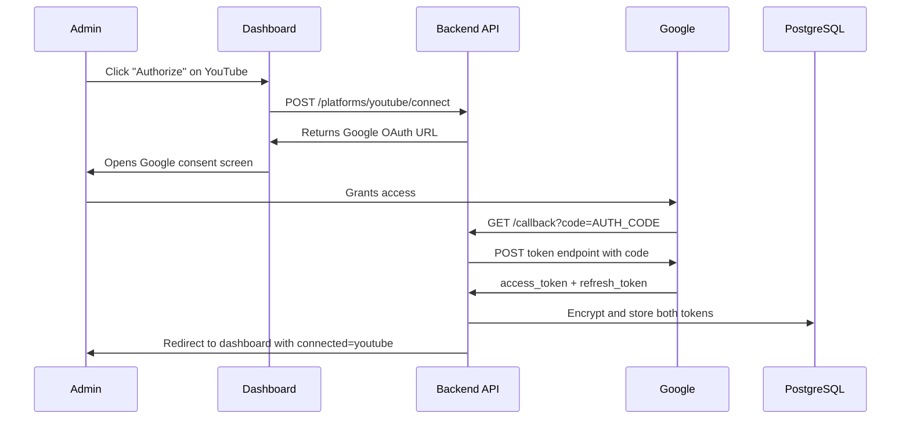

# YouTube OAuth Persistent Access Fix

## Problem

The OAuth flow is fully coded (all 4 steps exist in the YouTube adapter and API router), but the `redirect_uri` is constructed using `request.base_url` which resolves to `http://localhost:8000` inside the Docker container instead of `https://api.sovereignsanctuary.net`. Google rejects the token exchange when the redirect URI doesn't match.

## Root Cause

[backend/app/routers/skyeye_api.py](backend/app/routers/skyeye_api.py) lines 1030-1031 and 1065-1066 both use:

```python
base_url = str(request.base_url).rstrip("/")
redirect_uri = f"{base_url}/api/skyeye/platforms/{platform}/callback"
```

FastAPI is not configured to trust the `X-Forwarded-Proto` / `X-Forwarded-For` headers from nginx, so `request.base_url` returns the internal Docker address.

## Fix

### Option A (Cleanest -- config-based public URL)

Add a `PUBLIC_BASE_URL` setting to [backend/app/config.py](backend/app/config.py):

```python
PUBLIC_BASE_URL: str = ""  # e.g. https://api.sovereignsanctuary.net
```

Then in both the `/connect` and `/callback` endpoints, use:

```python
base_url = settings.PUBLIC_BASE_URL or str(request.base_url).rstrip("/")
```

This also fixes the same issue for **all 7 platforms**, not just YouTube.

### Changes

- **[backend/app/config.py](backend/app/config.py)** -- Add `PUBLIC_BASE_URL: str = ""`
- **[.env.template](/.env.template)** -- Document `PUBLIC_BASE_URL`
- **Production .env** -- Set `PUBLIC_BASE_URL=https://api.sovereignsanctuary.net`
- **[backend/app/routers/skyeye_api.py](backend/app/routers/skyeye_api.py)** -- Update both `initiate_platform_connect` (line 1030) and `platform_oauth_callback` (line 1065) to prefer `PUBLIC_BASE_URL`

### Verification (the 4-step flow)

After the fix is deployed:

1. **Step 1 -- Build Auth URL**: Click "Authorize" on YouTube in the SkyEye dashboard. The `/connect` endpoint returns a Google OAuth URL with the correct `redirect_uri=https://api.sovereignsanctuary.net/api/skyeye/platforms/youtube/callback`
2. **Step 2 -- Authorize**: The admin (you) clicks the URL, logs in to Google, grants YouTube access to Little Nate
3. **Step 3 -- Capture Code**: Google redirects to `https://api.sovereignsanctuary.net/api/skyeye/platforms/youtube/callback?code=...`
4. **Step 4 -- Exchange Code**: The callback handler calls `adapter.handle_oauth_callback(code, redirect_uri)` which POSTs to Google's token endpoint with `grant_type=authorization_code`. Google returns both an `access_token` and a `refresh_token` (because `access_type=offline` and `prompt=consent` are set in the auth URL). Both tokens are encrypted via TokenCipher and saved to `skyeye_platform_tokens`.

After this, Little Nate has persistent access -- when the access token expires (1 hour), the `refresh_token()` method in the YouTube adapter automatically gets a new one.




## Files changed (4 files, ~10 lines total)

- `backend/app/config.py` -- add `PUBLIC_BASE_URL`
- `.env.template` -- document new setting
- `backend/app/routers/skyeye_api.py` -- use `PUBLIC_BASE_URL` in 2 places
- Production `.env` -- set the value

