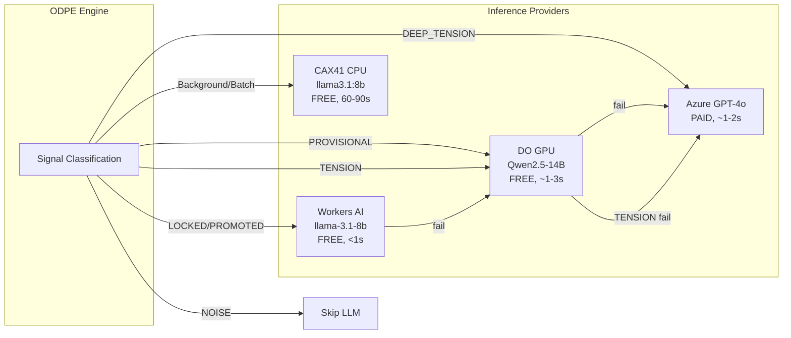

# Zero-Cost Sovereign Inference with DO GPU + Workers AI

## Hardware Reality


| Node                 | Specs                          | Role                              | TTFT          |
| -------------------- | ------------------------------ | --------------------------------- | ------------- |
| **DigitalOcean GPU** | 10GB VRAM, active              | Primary real-time sovereign       | ~1-3s (GPU)   |
| **Hetzner CAX41**    | 16 ARM cores, 32GB RAM, no GPU | Batch/background only             | 82-114s (CPU) |
| **Workers AI**       | Cloudflare free tier           | Routine queries (LOCKED/PROMOTED) | <1s           |
| **Azure OpenAI**     | GPT-4o                         | Emergency fallback + DEEP_TENSION | ~1-2s         |


Running 14B or 32B on the CAX41 ARM CPU is impractical (minutes per response). The previous plans assumed a GPU upgrade that hasn't happened.

## Revised ODPE Signal Routing




| Signal       | Primary         | Fallback              | Cost | Latency |
| ------------ | --------------- | --------------------- | ---- | ------- |
| LOCKED       | Workers AI (8B) | DO GPU                | $0   | <1s     |
| PROMOTED     | Workers AI (8B) | DO GPU                | $0   | <1s     |
| PROVISIONAL  | DO GPU (14B)    | Workers AI -> Azure   | $0   | ~1-3s   |
| TENSION      | DO GPU (14B)    | Azure (no Workers AI) | $0   | ~1-3s   |
| DEEP_TENSION | Azure GPT-4o    | DO GPU                | $$$  | ~1-2s   |
| NOISE        | Skip            | --                    | $0   | 0       |
| Background   | CAX41 (8B CPU)  | Workers AI            | $0   | 60-90s  |


**Why Qwen2.5-14B on DO GPU (not 8B)?** Workers AI already provides llama-3.1-8b for free. Running 8B on the DO GPU would be redundant. Qwen2.5-14B at q4_K_M needs ~8.5GB VRAM -- fits in 10GB with headroom. This gives GPT-4o-mini-class quality at zero cost.

## Phase 1: DO GPU Infrastructure Setup

SSH to the DigitalOcean GPU droplet and configure:

- Install Ollama (if not already installed)
- Pull `qwen2.5:14b-instruct-q4_K_M` (~9GB disk, ~8.5GB VRAM)
- Set `OLLAMA_KEEP_ALIVE=-1` (always keep loaded -- it's the only model)
- Set `OLLAMA_NUM_PARALLEL=4` (4 concurrent requests)
- Configure WireGuard tunnel to production VPS (10.13.13.X)
- Verify GPU inference works: `curl http://localhost:11434/api/chat -d '{"model":"qwen2.5:14b-instruct-q4_K_M","messages":[{"role":"user","content":"test"}]}'`

Also pull `llama3.1:8b-instruct-q4_K_M` as a fallback model (~4.7GB VRAM -- can swap in if 14B has issues).

## Phase 2: Wire DO GPU + Workers AI into sovereign_chat_client.py

[sovereign_chat_client.py](backend/app/services/sovereign_chat_client.py) currently only supports Sovereign (Ollama on Hetzner) and Azure. It needs:

1. **Add DO GPU as a separate provider** with its own URL and inflight tracking:
  - `_DO_GPU_URL` from env `DIGITAL_OCEAN_INFERENCE_URL`
  - `_DO_GPU_MODEL` from env `DIGITAL_OCEAN_MODEL` (default: `qwen2.5:14b-instruct-q4_K_M`)
  - Separate `_inflight_do_gpu` counter and session pool
2. **Add Workers AI provider**:
  - `_WORKERS_AI_URL` and `_WORKERS_AI_TOKEN` already read from env
  - Add `_stream_workers_ai()` and `_complete_workers_ai()` methods
  - Workers AI uses REST API format: `POST {url} -H "Authorization: Bearer {token}" -d '{"messages":[...]}'`
3. **Update routing logic in `generate_streaming()`**:

```python
# Current: Sovereign (Hetzner) → Azure
# New:     ODPE-aware multi-provider cascade

if odpe_signal in ("LOCKED", "PROMOTED"):
    # Workers AI first (free, fast), then DO GPU, then Azure
    providers = ["workers_ai", "do_gpu", "azure"]
elif odpe_signal in ("TENSION",):
    # DO GPU first (14B quality), then Azure (NO Workers AI -- clinical safety)
    providers = ["do_gpu", "azure"]
elif odpe_signal == "DEEP_TENSION":
    # Azure first (GPT-4o), then DO GPU
    providers = ["azure", "do_gpu"]
else:  # PROVISIONAL or None
    # DO GPU first (14B quality), then Workers AI, then Azure
    providers = ["do_gpu", "workers_ai", "azure"]
```

1. **Demote CAX41 Hetzner to batch-only**: The existing `_SOVEREIGN_URL` (CAX41) is only used when all other providers fail for real-time, or when explicitly called for background tasks. Add a `background=True` parameter that forces routing to CAX41.
2. **Track provider in stats**: Update `get_routing_stats()` to include `total_do_gpu` and `total_workers_ai` counters.

## Phase 3: Update distributed_inference_config.py

[distributed_inference_config.py](backend/app/services/distributed_inference_config.py) currently defines Hetzner as running 8B+14B+32B (impossible on CPU). Fix:

- `hetzner-primary`: Change role to `batch_only=True`, keep 8B model
- Remove `hetzner-14b` and `hetzner-32b` nodes (can't run on ARM CPU)
- Add `do-gpu` node: URL from env, model `qwen2.5:14b-instruct-q4_K_M`, `max_concurrent=4`
- Update `get_node_for_tier()` to route clinical to DO GPU instead of Hetzner 32B/14B
- Ensure NOISE signal still returns `None`

## Phase 4: Update nate_inference_router.py

[nate_inference_router.py](backend/app/services/nate_inference_router.py) has all 5 providers but needs routing adjustments:

- `TIER_CLINICAL`: Change from `["home_gpu", "sovereign", "azure"]` to `["home_gpu", "digitalocean", "azure"]` (clinical goes to DO GPU 14B, not CAX41 CPU)
- `TIER_CREATIVE`: Change to `["digitalocean", "workers_ai", "azure"]`
- `TIER_ANALYTICAL`: Keep as `["workers_ai", "digitalocean", "sovereign", "azure"]` (sovereign for batch OK)
- `TIER_UTILITY`: Keep as `["workers_ai", "digitalocean", "azure"]`
- `TIER_REALTIME`: Change from `["azure"]` to `["digitalocean", "workers_ai", "azure"]`

Model selection in `_resolve_sovereign_model()` needs adjustment: TENSION/DEEP_TENSION should select the DO GPU's 14B model, not the CAX41's nonexistent 14B/32B.

## Phase 5: Provider-Aware Billing (Zero-Cost Tokens)

In [bridge_server.py](backend/app/websocket/bridge_server.py), after streaming completes, check which provider served the response:

```python
if provider_used in ("do_gpu", "workers_ai", "sovereign"):
    billing.add_token_usage(uid, token_estimate, deduct_balance=False, source="ai_chat")
else:
    billing.use_tokens(uid, token_estimate, source="ai_chat")
```

This makes all sovereign-served inference zero-cost to users. Only Azure-served DEEP_TENSION queries deduct tokens.

Add a `provider` column to `token_transactions` via migration so cost analytics can track per-provider usage.

## Phase 6: Environment and Deploy Config

`**.env.template**` updates:

- `DIGITAL_OCEAN_INFERENCE_URL=http://10.13.13.X:11434` (DO GPU WireGuard IP)
- `DIGITAL_OCEAN_MODEL=qwen2.5:14b-instruct-q4_K_M`
- `WORKERS_AI_URL=https://api.cloudflare.com/client/v4/accounts/{account_id}/ai/run/@cf/meta/llama-3.1-8b-instruct`
- `WORKERS_AI_TOKEN={cloudflare_api_token}`
- `SCALING_LEVEL=3` (Twin-Helix)
- `SOVEREIGN_HAS_GPU=false` (CAX41 stays CPU)

`**docker-compose.prod.yml**`: Add all new env vars to both `backend` and `bridge` environment blocks.

## Phase 7: Update Rules Documentation

- `sovereign-inference-routing.mdc` -- Reflect DO GPU as primary real-time provider, CAX41 as batch
- `sandbox-vps-infrastructure.mdc` -- Add DO GPU droplet details (IP, specs, model)
- `token-economics-architecture.mdc` -- Document zero-cost for sovereign providers
- `service-health-49-49.mdc` -- Note CAX41 is batch-only, DO GPU is primary

## Optional: Add CCX33 (x86 AMD, 8 vCPU, 32GB RAM)

If added, it would serve as a second batch processing node:

- x86 AMD runs Ollama ~2-3x faster than ARM → ~30-40s TTFT for 8B (still not real-time)
- Could double batch throughput (crystallization, Night School, wisdom synthesis)
- Would NOT change real-time architecture -- DO GPU + Workers AI remain primary

This is only worth adding if batch processing (background crystallization, session summaries) is bottlenecked.

## Expected Performance After Implementation


| Metric                        | Before                          | After                                          |
| ----------------------------- | ------------------------------- | ---------------------------------------------- |
| Real-time TTFT (LOCKED)       | 82-114s (CAX41 CPU)             | <1s (Workers AI)                               |
| Real-time TTFT (TENSION)      | 82-114s or Azure ($$$)          | ~1-3s (DO GPU, free)                           |
| Azure dependency (therapy)    | ~100% or 82-114s CPU            | <5% (DEEP_TENSION only)                        |
| Azure monthly cost (1K users) | $1,500-3,000                    | $50-150                                        |
| Sovereign model quality       | llama3.1:8b only                | Qwen2.5-14B (clinical) + llama3.1:8b (routine) |
| Zero-cost query percentage    | 0%                              | ~95%                                           |
| Background batch              | 82-114s (shared with real-time) | 82-114s (dedicated, no contention)             |


