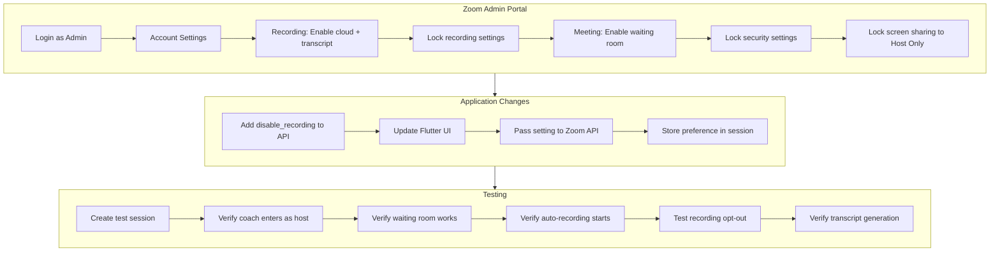

# Zoom Configuration Setup Plan

This plan covers both **Zoom Admin Portal settings** (locked at account level) and **code changes** needed to support coach-controlled recording opt-out.

---

## Part 1: Zoom Admin Portal Configuration

Log into [zoom.us/signin](https://zoom.us/signin) with your admin account, then go to **Admin > Account Management > Account Settings**.

### Recording Settings (Lock These)


| Setting                             | Value                 | Lock? | Reason                                      |
| ----------------------------------- | --------------------- | ----- | ------------------------------------------- |
| Cloud recording                     | ON                    | YES   | Auto-record all sessions to cloud           |
| Automatic recording                 | "Record in the cloud" | YES   | Ensures consistent recording                |
| Recording consent                   | ON                    | YES   | Shows recording indicator to participants   |
| Audio transcript                    | ON                    | YES   | Generates VTT files for Classroom analysis  |
| Save closed captions                | ON                    | YES   | Backup for transcript                       |
| Allow hosts to stop/start recording | ON                    | NO    | Coaches need this to honor opt-out requests |


### Meeting Settings (Lock These)


| Setting                                 | Value     | Lock? | Reason                                 |
| --------------------------------------- | --------- | ----- | -------------------------------------- |
| Waiting room                            | ON        | YES   | Coaches control client entry           |
| Host video                              | ON        | NO    | Optional for coach                     |
| Participants video                      | ON        | NO    | Optional for client                    |
| Join before host                        | OFF       | YES   | Prevent clients entering without coach |
| Mute participants upon entry            | ON        | NO    | Recommended default                    |
| Screen sharing                          | Host only | YES   | Only coaches can share screen          |
| Allow removed participants to rejoin    | OFF       | YES   | Security                               |
| Allow participants to rename themselves | OFF       | YES   | Prevent confusion                      |
| Hide participant profile pictures       | OFF       | NO    | Helps coach identify clients           |


### Security Settings (Lock These)


| Setting                           | Value    | Lock? | Reason                             |
| --------------------------------- | -------- | ----- | ---------------------------------- |
| Require passcode for meetings     | ON       | YES   | Security layer                     |
| Embed passcode in invite link     | ON       | YES   | Easier client access               |
| Only authenticated users can join | OFF      | NO    | Clients may not have Zoom accounts |
| Block users from specific regions | Optional | NO    | Depends on your compliance needs   |


### In-Meeting Controls (Lock These)


| Setting                            | Value | Lock? | Reason                              |
| ---------------------------------- | ----- | ----- | ----------------------------------- |
| Allow host to put attendee on hold | ON    | YES   | Manage multiple clients             |
| Breakout rooms                     | ON    | NO    | Useful for family sessions          |
| Co-host                            | OFF   | YES   | Only one coach should control       |
| Annotation                         | OFF   | YES   | Reduces distractions                |
| Whiteboard                         | OFF   | YES   | Not needed for coaching             |
| Remote control                     | OFF   | YES   | Security                            |
| Virtual background                 | ON    | NO    | Professional appearance             |
| Chat                               | ON    | NO    | Useful for sharing links            |
| File transfer                      | OFF   | YES   | Security                            |
| Private chat                       | OFF   | YES   | All communication should be visible |


---

## Part 2: Zoom App Scopes Required

Ensure your Server-to-Server OAuth app has these scopes:

**Required Scopes:**

- `meeting:write:admin` - Create/update/delete meetings
- `meeting:read:admin` - Read meeting details
- `recording:read:admin` - Access recordings
- `recording:write:admin` - Delete recordings after archiving
- `user:read:admin` - Get user info for host

**Optional (for webhooks):**

- `webhook:read:admin` - Receive meeting events

---

## Part 3: Code Changes - Coach Recording Toggle

### 3.1 Update Session Scheduling API

Add `disable_recording` parameter to [backend/app/routers/sessions.py](backend/app/routers/sessions.py):

```python
class ScheduleSessionRequest(BaseModel):
    # ... existing fields ...
    disable_recording: bool = False  # Coach can opt-out of recording
```

When creating the Zoom meeting, pass this to override auto_recording:

```python
zoom_settings = {}
if req.disable_recording:
    zoom_settings["auto_recording"] = "none"
    session["recording_disabled"] = True

zoom_resp = await client.create_meeting(
    topic=topic,
    start_time_iso=start_iso,
    duration_minutes=int(dur_min or 50),
    agenda=req.notes or "",
    settings=zoom_settings if zoom_settings else None,  # Override recording
)
```

### 3.2 Update Flutter Session Creation UI

Add toggle in [mobile/lib/updated_screens.dart](mobile/lib/updated_screens.dart) session creation dialog:

```dart
SwitchListTile(
  title: Text("Disable Recording", style: TextStyle(color: Colors.white)),
  subtitle: Text(
    "Turn off auto-recording for this session",
    style: TextStyle(color: Colors.grey, fontSize: 12),
  ),
  value: disableRecording,
  onChanged: (v) => setState(() => disableRecording = v),
  activeColor: Colors.orange,
),
```

Pass to API:

```dart
"disable_recording": disableRecording,
```

---

## Part 4: Suggested Features and Restrictions

### Recommended Additional Settings

1. **Waiting Room Message** - Customize with: "Please wait while your coach admits you to the session."
2. **Recording Disclaimer** - Set up automatic message: "This session is being recorded for quality and training purposes."
3. **Meeting Duration Limits** - Set max duration to 90 minutes (prevents runaway costs)
4. **Participant Limit** - Set to 10 (sufficient for family sessions)

### Recommended Restrictions


| Feature                        | Status  | Reason                  |
| ------------------------------ | ------- | ----------------------- |
| Virtual backgrounds            | ALLOW   | Professional appearance |
| Reactions                      | ALLOW   | Non-verbal feedback     |
| Polling                        | DISABLE | Not needed              |
| Q&A                            | DISABLE | Not webinar format      |
| Live streaming                 | DISABLE | Privacy/HIPAA           |
| Third-party file sharing       | DISABLE | Security                |
| Meeting recordings auto-delete | 30 days | Storage management      |


### Host Controls Available to Coaches

Once configured, coaches will be able to:

- Admit/remove participants from waiting room
- Mute/unmute participants
- Stop/start video for participants
- Put participants on hold
- Share their screen
- Stop recording (if opt-out requested)
- End meeting for all

Coaches will NOT be able to:

- Change account-level settings
- Enable features you've locked
- Transfer host to participant
- Create breakout rooms (unless you enable)

---

## Part 5: Implementation Checklist




---

## Files to Modify


| File                                                               | Change                                          |
| ------------------------------------------------------------------ | ----------------------------------------------- |
| [backend/app/routers/sessions.py](backend/app/routers/sessions.py) | Add `disable_recording` param, pass to Zoom API |
| [mobile/lib/updated_screens.dart](mobile/lib/updated_screens.dart) | Add recording toggle in session creation dialog |


