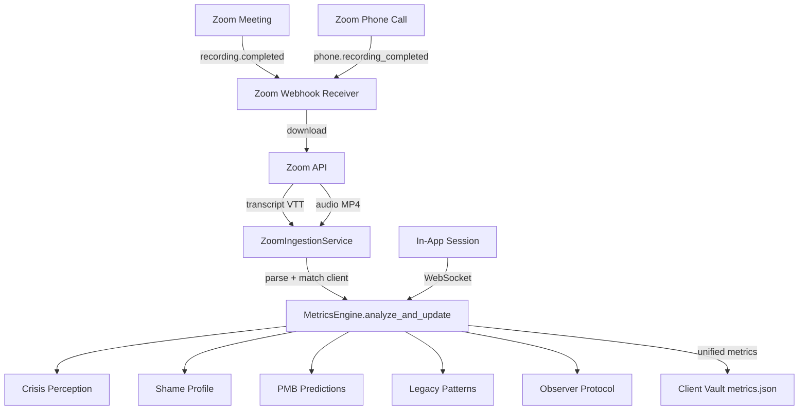

# Zoom Integration: External Session Ingestion Pipeline

## Pre-Build: Patent Update (recommended)

Add a new section to `patent/QUANTUM_EMOTIONAL_COHERENCE_PATENT_PROVISIONAL_2.md` covering:

- Multi-source session ingestion architecture
- Cross-session behavioral correlation (in-app vs. external session)
- Passive AI observer processing third-party transcripts
- One new independent claim covering the ingestion pipeline

## Phase 1: Zoom OAuth App Setup

Create a Zoom Server-to-Server OAuth app in the Zoom Marketplace:

- Scopes needed: `recording:read`, `phone:read`, `meeting:read`, `webhook`
- This gives API access to cloud recordings and transcripts
- Store credentials in `.env`: `ZOOM_CLIENT_ID`, `ZOOM_CLIENT_SECRET`, `ZOOM_ACCOUNT_ID`

## Phase 2: Zoom Webhook Receiver

**New file:** `backend/app/routers/zoom_webhook.py`

- FastAPI router mounted at `/api/zoom/webhook`
- Handles Zoom webhook events:
  - `recording.completed` — a meeting recording + transcript is ready
  - `phone.recording_completed` — a Zoom Phone call recording is ready
- Validates webhook signature using Zoom's verification token
- On event received: enqueue transcript download + processing job

## Phase 3: Transcript Ingestion Service

**New file:** `backend/app/services/zoom_ingestion.py`

- `ZoomIngestionService` class with methods:
  - `download_transcript(recording_id)` — fetches VTT/SRT transcript from Zoom API
  - `download_audio(recording_id)` — fetches audio file (for voice biometrics, future phase)
  - `parse_transcript(vtt_text)` — converts VTT to structured conversation turns (speaker, text, timestamp)
  - `match_client(meeting_topic, participants)` — maps Zoom meeting to a Sovereign Sanctuary client using email or name matching against `user_registry.json`
  - `ingest_session(client_id, transcript_turns)` — feeds each turn through `MetricsEngine.analyze_and_update()` to compute Crisis Perception, Shame, PMB, Legacy patterns

Key logic in `ingest_session`:

- Loads client's existing `metrics.json` from their vault
- Iterates through transcript turns, calling `analyze_and_update()` for client messages
- Tags the session source as `"zoom_meeting"` or `"zoom_phone"` in the metrics history
- Saves updated metrics back to the vault
- Logs the session in `sessions.json` with source type

## Phase 4: Wire Into Bridge Server

**File:** [backend/app/websocket/bridge_server.py](backend/app/websocket/bridge_server.py)

- Add new WebSocket handler `admin_get_zoom_sessions` to list ingested Zoom sessions for a client
- Add `session_source` field tracking to `analyze_and_update()` so metrics know if data came from app, zoom_meeting, or zoom_phone
- Update `get_presession_brief()` to include Zoom session insights: "Coach session on [date] via Zoom — key topics: ..."

## Phase 5: Dashboard Visibility

**File:** [dashboard/my_clients.html](dashboard/my_clients.html)

- Add a "Zoom Sessions" indicator on client cards showing how many external sessions have been ingested
- In the PMB card, add a "Data Sources" section showing breakdown: X in-app sessions, Y Zoom meetings, Z Zoom Phone calls
- In the Pre-Session Brief, surface key themes from recent Zoom coaching sessions

**File:** [dashboard/command.html](dashboard/command.html)

- Add a "Zoom Integration" status indicator in the System Overview showing connection health

## Phase 6: Zoom Phone Setup

Zoom Phone requires a Zoom Phone license (add-on to Zoom Pro/Business):

- Coaches get a Zoom Phone number
- Calls are auto-recorded per admin policy
- Same webhook pipeline handles `phone.recording_completed`
- Same transcript parsing and ingestion flow

## Architecture Diagram

## Key Dependencies

- **Zoom Pro/Business** plan with cloud recording enabled (confirmed)
- **Zoom Phone** license add-on for phone call monitoring
- **Zoom Marketplace** app registration (Server-to-Server OAuth)
- **Public webhook endpoint**: The server at 68.183.168.75 needs an HTTPS route for Zoom to POST to (nginx already handles HTTPS via `api.sovereignsanctuary.net`)

## Consent and Compliance

- All Zoom recordings require participant consent (Zoom handles the "this meeting is being recorded" prompt)
- Add consent language to the Sovereign Sanctuary Terms of Service
- Store a `zoom_consent` flag per client in `user_registry.json`
- Zoom Phone recordings also require consent per state law (varies by jurisdiction)

